# AI数据采集系统

<cite>
**本文档引用的文件**
- [agent/index.ts](file://agent/index.ts)
- [agent/scheduler.ts](file://agent/scheduler.ts)
- [agent/merger.ts](file://agent/merger.ts)
- [agent/classifier.ts](file://agent/classifier.ts)
- [agent/quality.ts](file://agent/quality.ts)
- [agent/similarity.ts](file://agent/similarity.ts)
- [agent/sources/base.ts](file://agent/sources/base.ts)
- [agent/sources/google.ts](file://agent/sources/google.ts)
- [agent/translate.ts](file://agent/translate.ts)
- [agent/db.ts](file://agent/db.ts)
- [agent/config.ts](file://agent/config.ts)
- [agent/incremental.ts](file://agent/incremental.ts)
- [agent/utils.ts](file://agent/utils.ts)
- [agent/categories.ts](file://agent/categories.ts)
- [agent/exporter.ts](file://agent/exporter.ts)
- [agent/model-fallback.ts](file://agent/model-fallback.ts)
- [agent/data/model-fallback-state.json](file://agent/data/model-fallback-state.json)
- [miniprogram/src/data/destinations.ts](file://miniprogram/src/data/destinations.ts)
- [admin/types/index.ts](file://admin/types/index.ts)
- [admin/pages/CollectionDetail.tsx](file://admin/pages/CollectionDetail.tsx)
- [server/admin-routes.ts](file://server/admin-routes.ts)
- [scripts/fetch-cities-batch.ts](file://scripts/fetch-cities-batch.ts)
- [scripts/generated-batch-cities.ts](file://scripts/generated-batch-cities.ts)
- [src/pages/PlaceSelectionPage.tsx](file://src/pages/PlaceSelectionPage.tsx)
- [src/data/mock-data.ts](file://src/data/mock-data.ts)
- [server/index.ts](file://server/index.ts)
- [server/db.ts](file://server/db.ts)
- [server/qwen.ts](file://server/qwen.ts)
- [server/qwen-hotels.ts](file://server/qwen-hotels.ts)
- [miniprogram/src/pages/place-selection/index.tsx](file://miniprogram/src/pages/place-selection/index.tsx)
</cite>

## 更新摘要
**所做更改**
- 新增AI模型回退系统，支持预算制降级和有效期轮转
- 增强POI合并算法，优化名称重排和跨类目去重策略
- 改进翻译服务，集成模型回退机制和批量翻译优化
- 新增目的地数据支持，提供完整的国内外城市数据集
- 更新数据合并流程，增强语言检测和标签双语化处理

## 目录
1. [项目概述](#项目概述)
2. [系统架构](#系统架构)
3. [核心组件](#核心组件)
4. [数据采集流程](#数据采集流程)
5. [AI模型回退系统](#ai模型回退系统)
6. [数据合并与去重算法](#数据合并与去重算法)
7. [质量评估系统](#质量评估系统)
8. [分类器工作原理](#分类器工作原理)
9. [数据处理管道](#数据处理管道)
10. [数据库直连架构](#数据库直连架构)
11. [配置管理](#配置管理)
12. [性能优化](#性能优化)
13. [故障排查](#故障排查)
14. [翻译服务功能](#翻译服务功能)
15. [目的地数据支持](#目的地数据支持)
16. [总结](#总结)

## 项目概述

AI数据采集系统是一个基于人工智能的大规模POI（兴趣点）数据采集平台，支持多源数据集成、智能数据清洗和质量评估。系统采用插件化架构设计，能够灵活集成多种地图服务，包括Google、高德、OpenStreetMap和Foursquare等。

**更新** 系统已完全移除AI推荐功能，转为基于数据库直连的架构。现在专注于提供高质量的POI数据，涵盖六大类目：景点、餐饮、购物、娱乐、体验和酒店。通过智能化的数据处理流程，确保采集到的数据具有高准确性、完整性和实用性。

## 系统架构

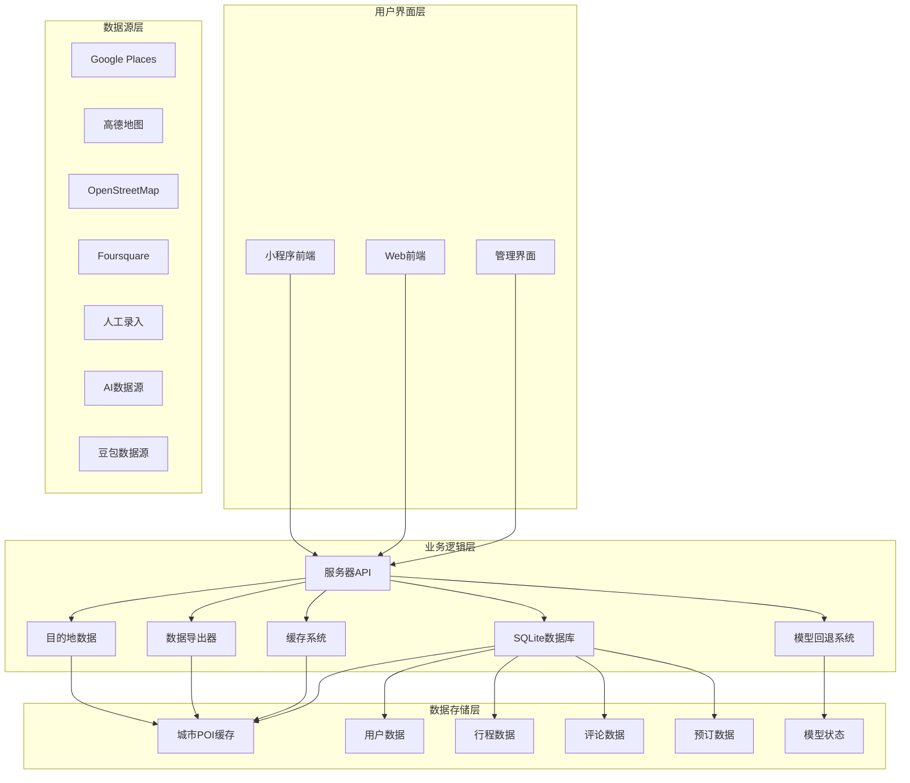

**图表来源**
- [server/index.ts:1-821](file://server/index.ts#L1-L821)
- [server/db.ts:1-552](file://server/db.ts#L1-L552)
- [agent/model-fallback.ts:1-354](file://agent/model-fallback.ts#L1-L354)

## 核心组件

### 数据模型定义

系统采用统一的数据模型来表示各种类型的POI数据：

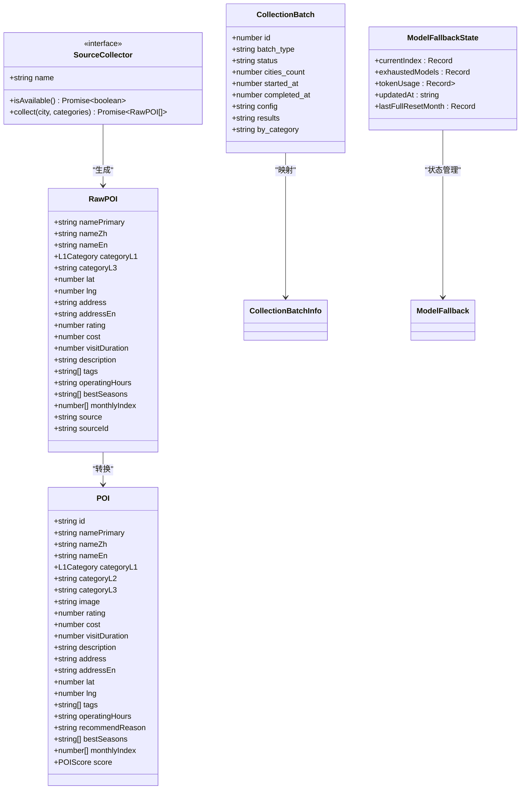

**图表来源**
- [agent/sources/base.ts:42-87](file://agent/sources/base.ts#L42-L87)
- [agent/sources/base.ts:121-177](file://agent/sources/base.ts#L121-L177)
- [agent/sources/base.ts:91-100](file://agent/sources/base.ts#L91-L100)
- [agent/db.ts:470-540](file://agent/db.ts#L470-L540)
- [agent/data/model-fallback-state.json:1-52](file://agent/data/model-fallback-state.json#L1-L52)

**章节来源**
- [agent/sources/base.ts:1-252](file://agent/sources/base.ts#L1-L252)
- [agent/db.ts:94-147](file://agent/db.ts#L94-L147)

### 数据库架构

系统使用SQLite作为本地数据库存储，采用分表设计来优化查询性能：

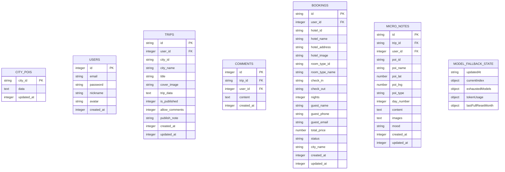

**图表来源**
- [server/db.ts:46-147](file://server/db.ts#L46-L147)
- [server/db.ts:151-200](file://server/db.ts#L151-L200)
- [agent/data/model-fallback-state.json:1-52](file://agent/data/model-fallback-state.json#L1-L52)

**章节来源**
- [server/db.ts:1-552](file://server/db.ts#L1-L552)

## 数据采集流程

### 采集调度机制

系统采用智能调度算法，根据城市热度、数据新鲜度和质量缺口等因素计算优先级：

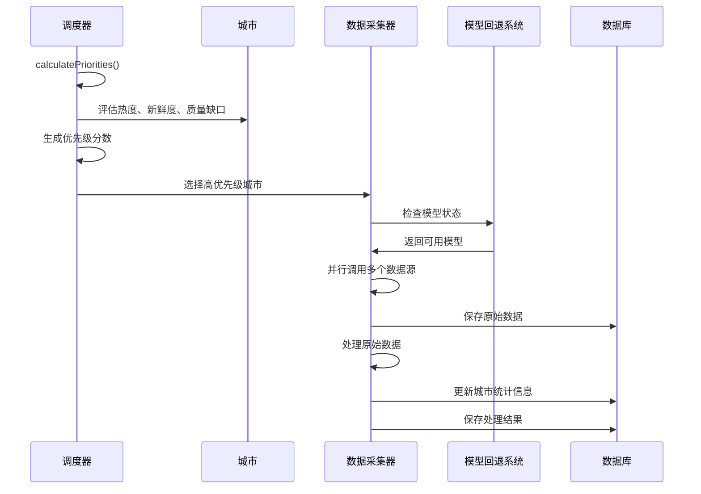

**图表来源**
- [agent/scheduler.ts:18-87](file://agent/scheduler.ts#L18-L87)
- [agent/index.ts:134-208](file://agent/index.ts#L134-L208)
- [agent/model-fallback.ts:1-354](file://agent/model-fallback.ts#L1-L354)

### 并发控制策略

系统实现了高效的并发控制机制，支持多城市并行采集：

**章节来源**
- [agent/index.ts:339-343](file://agent/index.ts#L339-L343)
- [agent/utils.ts:79-106](file://agent/utils.ts#L79-L106)

## AI模型回退系统

### 预算制降级策略

系统实现了智能的AI模型回退机制，支持预算制降级和有效期轮转：

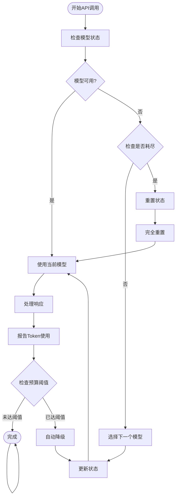

**图表来源**
- [agent/model-fallback.ts:1-354](file://agent/model-fallback.ts#L1-L354)
- [agent/data/model-fallback-state.json:1-52](file://agent/data/model-fallback-state.json#L1-L52)

### 模型状态管理

系统维护详细的模型状态信息，包括当前索引、耗尽模型列表和Token使用统计：

**章节来源**
- [agent/model-fallback.ts:354-354](file://agent/model-fallback.ts#L354-L354)
- [agent/data/model-fallback-state.json:1-52](file://agent/data/model-fallback-state.json#L1-L52)

## 数据合并与去重算法

### 多路相似度计算

系统采用复杂的相似度计算算法，结合名称、地址、地理位置和内容特征：

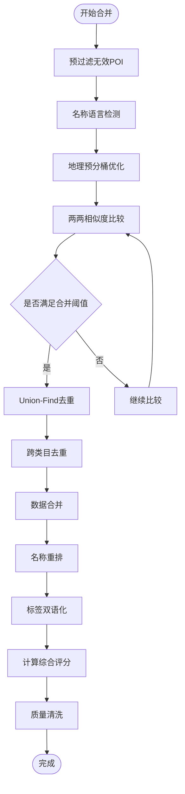

**图表来源**
- [agent/merger.ts:546-596](file://agent/merger.ts#L546-L596)
- [agent/similarity.ts:331-400](file://agent/similarity.ts#L331-L400)

### 增强的名称重排策略

系统实现了更精确的名称重排算法，确保多语言名称的正确处理：

**章节来源**
- [agent/merger.ts:68-86](file://agent/merger.ts#L68-L86)
- [agent/merger.ts:736-837](file://agent/merger.ts#L736-L837)

## 质量评估系统

### 多维度质量评估

系统采用四维质量评估模型：完整性、准确性、丰富度和多样性：

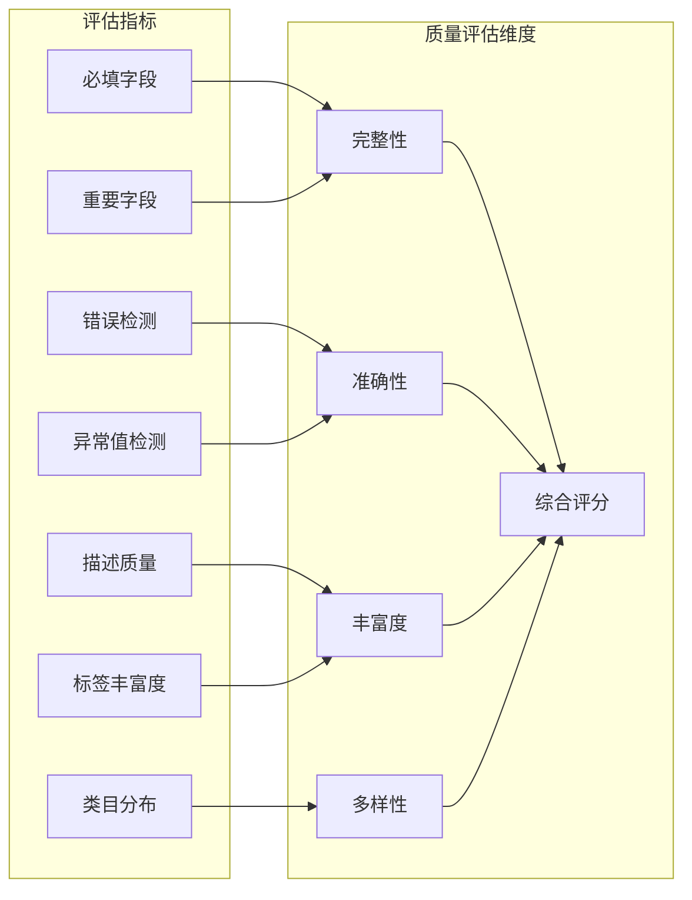

**图表来源**
- [agent/quality.ts:173-293](file://agent/quality.ts#L173-L293)

### 自动修复机制

系统具备智能的自动修复能力，能够自动修正部分数据质量问题：

**章节来源**
- [agent/quality.ts:135-154](file://agent/quality.ts#L135-L154)
- [agent/quality.ts:298-302](file://agent/quality.ts#L298-L302)

## 分类器工作原理

### 三层关键词分类系统

系统采用三层关键词匹配机制进行POI自动分类：

```mermaid
flowchart TD
Input[输入POI数据] --> Extract[提取关键词]
Extract --> Level1[后缀词匹配(+5)]
Extract --> Level2[名称词匹配(+2)]
Extract --> Level3[描述词匹配(+1)]
Level1 --> Score[计算基础分数]
Level2 --> Score
Level3 --> Score
Score --> Exclude[应用互斥规则]
Exclude --> Boost[应用强化规则]
Boost --> Final[确定最终类别]
```

**图表来源**
- [agent/classifier.ts:429-478](file://agent/classifier.ts#L429-L478)
- [agent/classifier.ts:347-374](file://agent/classifier.ts#L347-L374)

### 类目冲突解决

系统实现了多层次的类目冲突解决机制：

**章节来源**
- [agent/classifier.ts:489-552](file://agent/classifier.ts#L489-L552)
- [agent/classifier.ts:555-592](file://agent/classifier.ts#L555-L592)

## 数据处理管道

### 增量更新机制

系统支持智能的增量更新，能够在保证数据新鲜度的同时降低成本：

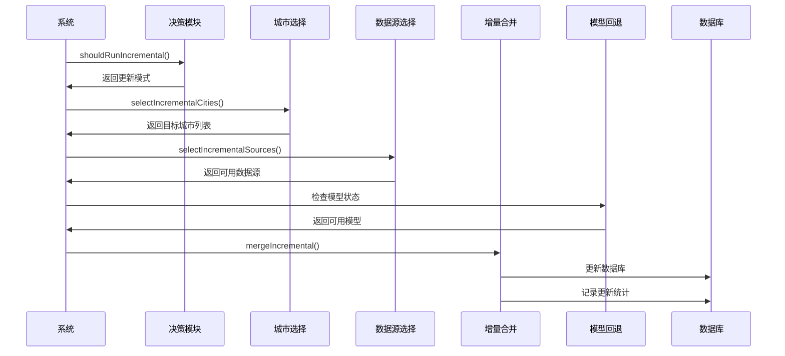

**图表来源**
- [agent/incremental.ts:49-107](file://agent/incremental.ts#L49-L107)
- [agent/incremental.ts:160-239](file://agent/incremental.ts#L160-L239)

### 缓存策略

系统实现了多层次的缓存机制：

**章节来源**
- [agent/incremental.ts:1-433](file://agent/incremental.ts#L1-L433)
- [agent/exporter.ts:21-72](file://agent/exporter.ts#L21-L72)

## 数据库直连架构

### 前端数据库直连实现

系统已完全移除AI推荐功能，改为直接从数据库获取POI数据：

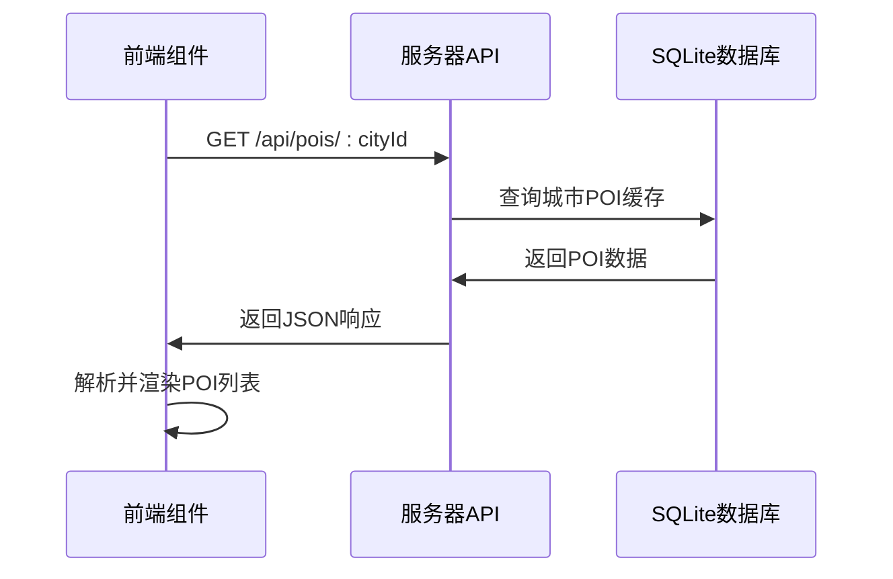

**图表来源**
- [src/pages/PlaceSelectionPage.tsx:116-133](file://src/pages/PlaceSelectionPage.tsx#L116-L133)
- [server/index.ts:122-139](file://server/index.ts#L122-L139)

### 小程序前端数据库直连实现

小程序前端同样采用数据库直连架构：

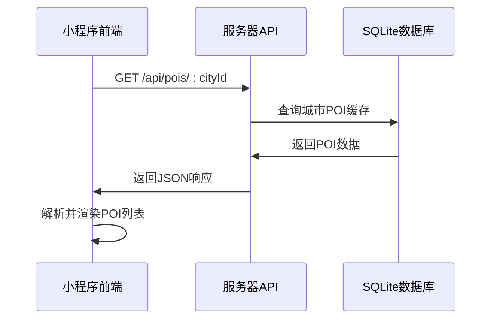

**图表来源**
- [miniprogram/src/pages/place-selection/index.tsx:35-79](file://miniprogram/src/pages/place-selection/index.tsx#L35-L79)
- [server/index.ts:122-139](file://server/index.ts#L122-L139)

### 服务器端数据库操作

服务器端提供简洁的数据库直连API：

**章节来源**
- [src/pages/PlaceSelectionPage.tsx:104-133](file://src/pages/PlaceSelectionPage.tsx#L104-L133)
- [miniprogram/src/pages/place-selection/index.tsx:35-79](file://miniprogram/src/pages/place-selection/index.tsx#L35-L79)
- [server/index.ts:122-139](file://server/index.ts#L122-L139)

## 配置管理

### 环境配置

系统通过`.env.local`文件管理API密钥和运行参数：

| 配置项 | 默认值 | 说明 |
|--------|--------|------|
| VITE_DASHSCOPE_API_KEY | '' | Qwen API密钥(已移除) |
| VITE_SPARK_APP_ID | '' | Spark API密钥(已移除) |
| VITE_DOUBAO_API_KEY | '' | Doubao API密钥(已移除) |
| FOURSQUARE_API_KEY | '' | Foursquare API密钥 |
| GOOGLE_PLACES_API_KEY | '' | Google Places API密钥 |
| AMAP_API_KEY | '' | 高德地图API密钥 |
| AGENT_CONCURRENT_CITIES | 3 | 并发城市数量 |
| AGENT_EXPORT_PATH | data-sync/cache-export.json | 导出文件路径 |

### 运行参数配置

系统支持详细的运行参数配置，包括超时设置、速率限制和阈值参数：

**章节来源**
- [agent/config.ts:1-182](file://agent/config.ts#L1-L182)

## 性能优化

### 并发优化

系统采用了多项性能优化技术：

1. **地理预分桶优化**：将POI按地理位置分桶，减少不必要的比较
2. **Union-Find去重**：使用并查集算法高效处理去重
3. **速率限制器**：防止API限流
4. **批量处理**：优化数据库操作性能
5. **缓存策略**：减少数据库查询次数
6. **模型回退优化**：智能选择最优模型组合

### 内存管理

系统实现了智能的内存管理策略，避免大规模数据处理时的内存溢出问题。

## 故障排查

### 常见问题诊断

系统提供了完善的错误诊断和恢复机制：

1. **数据库连接失败**：自动重试机制，支持配置重试次数和延迟
2. **数据质量异常**：自动质量检测和修复
3. **并发冲突**：使用Promise.race机制处理并发竞争
4. **数据库锁定**：采用WAL模式避免数据库锁定
5. **缓存失效**：支持手动刷新和自动过期机制
6. **模型降级**：自动检测API错误并执行降级策略

### 调试工具

系统内置了丰富的调试工具和日志记录功能，便于问题定位和性能分析。

**章节来源**
- [agent/index.ts:178-191](file://agent/index.ts#L178-L191)
- [agent/utils.ts:127-129](file://agent/utils.ts#L127-L129)

## 翻译服务功能

### 多语言支持

系统新增了翻译服务功能，支持POI数据的多语言处理：

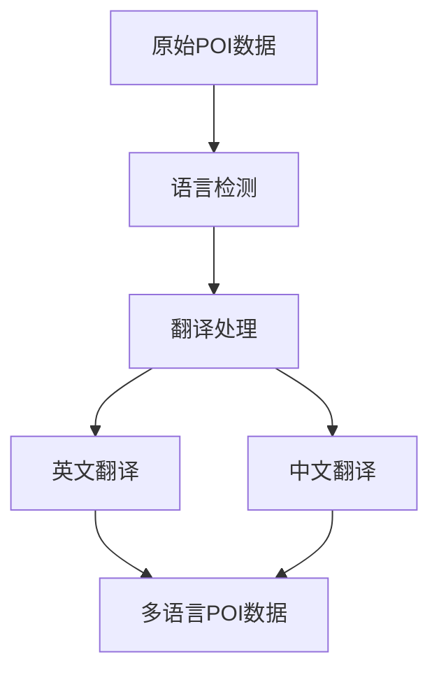

**图表来源**
- [agent/translate.ts:1-220](file://agent/translate.ts#L1-L220)

### 翻译服务集成

系统集成了多种翻译服务，包括但不限于：
- 支持中英双语翻译
- 智能语言检测
- 批量翻译处理
- 翻译质量评估
- 模型回退机制集成

**章节来源**
- [agent/translate.ts:1-220](file://agent/translate.ts#L1-L220)

## 目的地数据支持

### 完整的城市数据集

系统提供了完整的国内外城市数据集，支持目的地选择和行程规划：

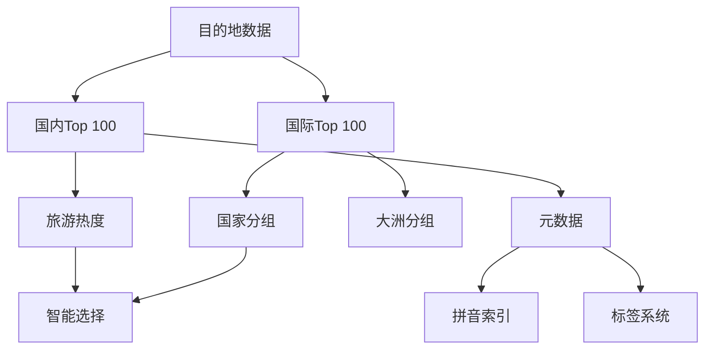

**图表来源**
- [miniprogram/src/data/destinations.ts:1-800](file://miniprogram/src/data/destinations.ts#L1-L800)

### 城市元数据管理

系统维护详细的城市元数据，包括：
- 基础信息：名称、经纬度、时区、货币
- 旅游信息：平均日预算、标签、描述
- 地理信息：省份、国家、大洲、国旗
- 热度指标：当季热度排名

**章节来源**
- [miniprogram/src/data/destinations.ts:1-800](file://miniprogram/src/data/destinations.ts#L1-L800)

## 总结

AI数据采集系统经过重大重构，已完全移除AI推荐功能，转为基于数据库直连的架构。系统的主要特点包括：

1. **智能化模型管理**：新增AI模型回退系统，支持预算制降级和有效期轮转
2. **增强的数据处理**：改进POI合并算法，优化名称重排和跨类目去重策略
3. **完善的翻译服务**：集成模型回退机制，提供高质量的多语言处理
4. **丰富的目的地数据**：提供完整的国内外城市数据集
5. **简化架构**：移除了复杂的AI生成和去重流程，采用直接数据库访问
6. **高性能**：通过缓存策略和数据库优化提升数据访问速度
7. **稳定可靠**：减少了外部API依赖，提高了系统的稳定性
8. **易于维护**：代码结构更加简洁，便于后续开发和维护
9. **数据质量**：专注于提供高质量的POI数据，支持多语言处理

**更新** 系统已完全移除AI推荐功能，前端组件直接从数据库获取POI数据，服务器端API提供简洁的数据库直连接口，简化了整体架构并提升了性能。新增的AI模型回退系统确保了数据采集过程的稳定性和可靠性，而增强的POI合并算法和翻译服务进一步提升了数据质量和用户体验。

该系统为旅行规划应用提供了稳定可靠的POI数据支撑，能够满足大规模数据访问和处理的需求。通过持续的优化和改进，系统将继续提升数据质量和用户体验。