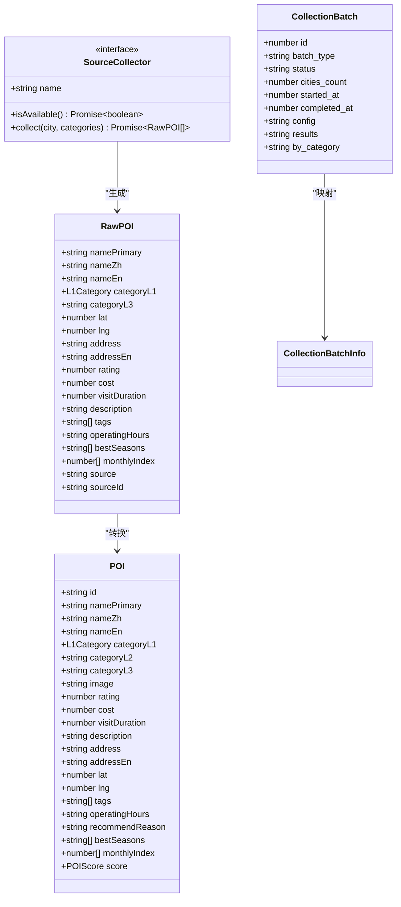
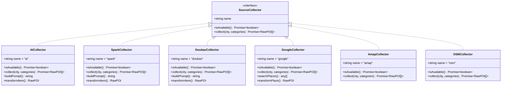
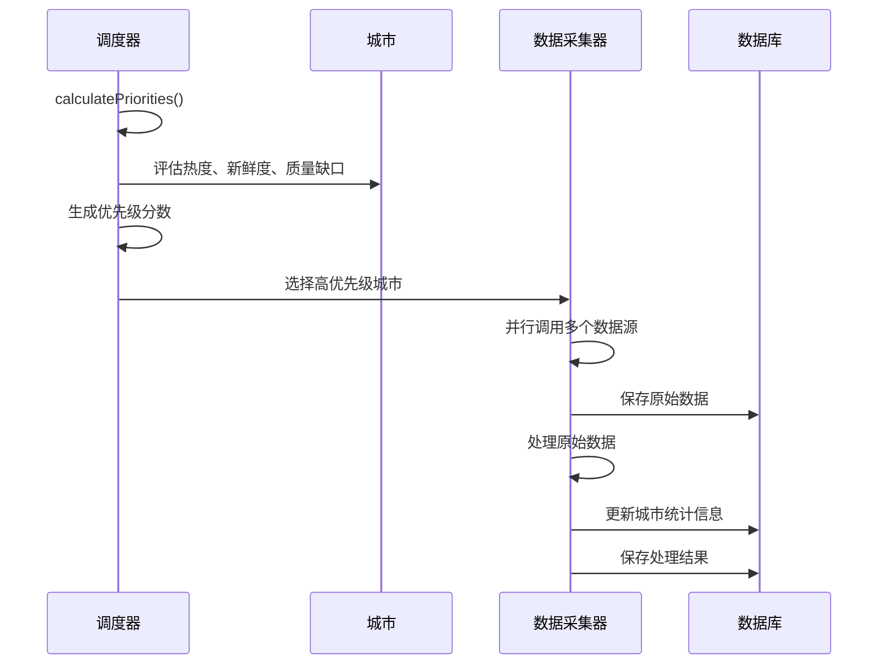
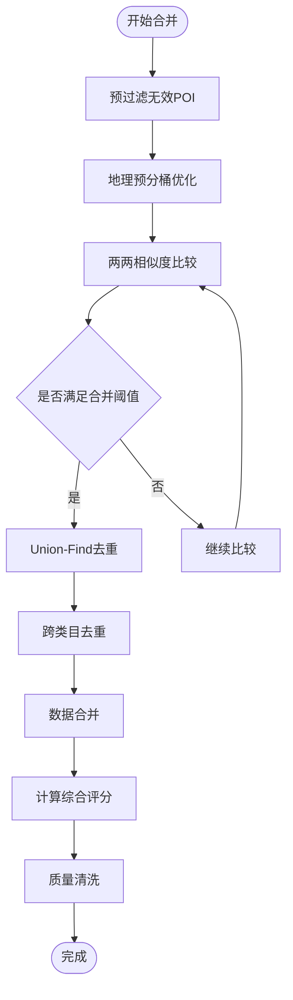
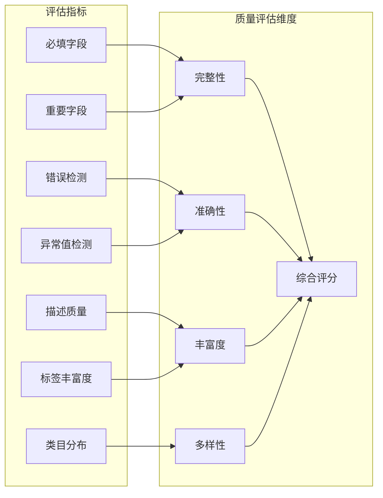
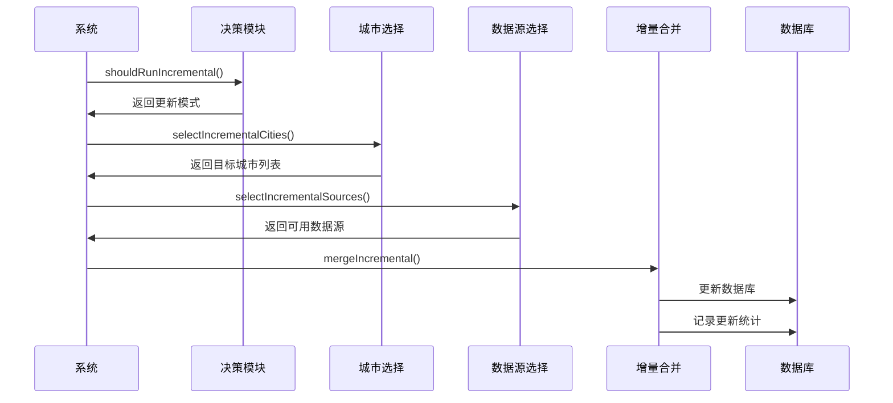
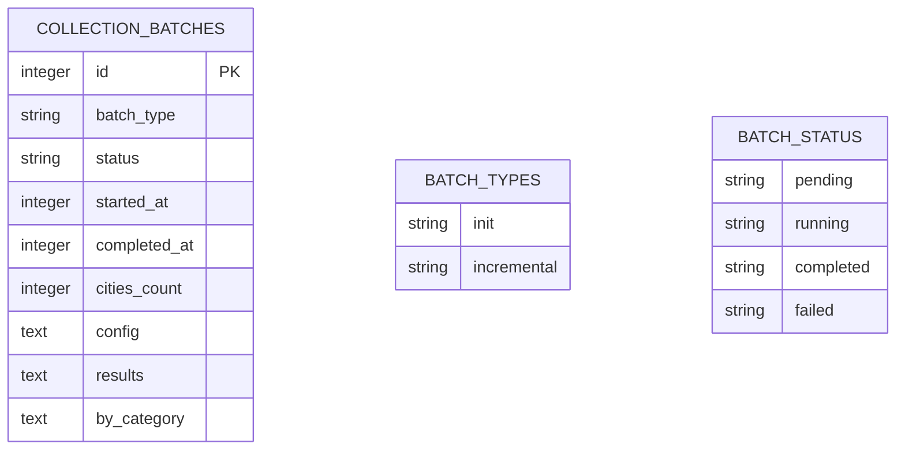
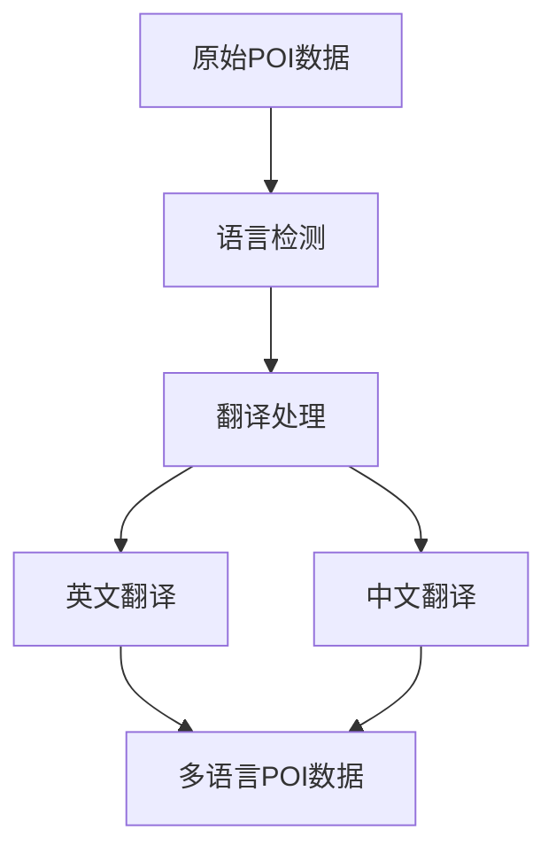

# AI数据采集系统

<cite>
**本文档引用的文件**
- [agent/index.ts](file://agent/index.ts)
- [agent/scheduler.ts](file://agent/scheduler.ts)
- [agent/merger.ts](file://agent/merger.ts)
- [agent/classifier.ts](file://agent/classifier.ts)
- [agent/quality.ts](file://agent/quality.ts)
- [agent/similarity.ts](file://agent/similarity.ts)
- [agent/sources/base.ts](file://agent/sources/base.ts)
- [agent/sources/ai.ts](file://agent/sources/ai.ts)
- [agent/sources/google.ts](file://agent/sources/google.ts)
- [agent/sources/spark.ts](file://agent/sources/spark.ts)
- [agent/sources/doubao.ts](file://agent/sources/doubao.ts)
- [agent/translate.ts](file://agent/translate.ts)
- [agent/db.ts](file://agent/db.ts)
- [agent/config.ts](file://agent/config.ts)
- [agent/incremental.ts](file://agent/incremental.ts)
- [agent/utils.ts](file://agent/utils.ts)
- [agent/categories.ts](file://agent/categories.ts)
- [agent/exporter.ts](file://agent/exporter.ts)
- [admin/types/index.ts](file://admin/types/index.ts)
- [admin/pages/CollectionDetail.tsx](file://admin/pages/CollectionDetail.tsx)
- [server/admin-routes.ts](file://server/admin-routes.ts)
- [scripts/fetch-cities-batch.ts](file://scripts/fetch-cities-batch.ts)
- [scripts/generated-batch-cities.ts](file://scripts/generated-batch-cities.ts)
</cite>

## 更新摘要
**所做更改**
- 增强了批处理系统，支持批量创建和状态更新功能
- 改进了类别分布跟踪机制，新增collection_batches表结构
- 更新了命令行界面的数据源命名约定，支持batch和targeted作业类型
- 新增了批处理作业管理和监控功能

## 目录
1. [项目概述](#项目概述)
2. [系统架构](#系统架构)
3. [核心组件](#核心组件)
4. [AI服务插件化架构](#ai服务插件化架构)
5. [数据采集流程](#数据采集流程)
6. [数据合并与去重算法](#数据合并与去重算法)
7. [质量评估系统](#质量评估系统)
8. [分类器工作原理](#分类器工作原理)
9. [数据处理管道](#数据处理管道)
10. [批处理系统增强](#批处理系统增强)
11. [配置管理](#配置管理)
12. [性能优化](#性能优化)
13. [故障排查](#故障排查)
14. [总结](#总结)

## 项目概述

AI数据采集系统是一个基于人工智能的大规模POI（兴趣点）数据采集平台，支持多源数据集成、智能数据清洗和质量评估。系统采用插件化架构设计，能够灵活集成多种AI和地图服务，包括Qwen、高德、Google、Spark和Doubao等。

该系统的核心目标是为旅行规划应用提供高质量的POI数据，涵盖六大类目：景点、餐饮、购物、娱乐、体验和酒店。通过智能化的数据处理流程，确保采集到的数据具有高准确性、完整性和实用性。

**更新** 新增Spark和Doubao AI提供程序支持，增强分类系统排除规则，新增翻译服务功能，增强批处理系统支持批量创建和状态更新

## 系统架构

```mermaid
graph TB
subgraph "用户界面层"
Admin[管理界面]
Web[Web前端]
BatchUI[批处理界面]
end
subgraph "业务逻辑层"
Scheduler[调度器]
Collector[数据采集器]
Merger[数据合并器]
Classifier[分类器]
Quality[质量评估]
Translate[翻译服务]
BatchManager[批处理管理器]
end
subgraph "数据源层"
AI[AI服务(Qwen)]
Spark[Spark AI]
Doubao[Doubao AI]
Google[Google Places]
Amap[高德地图]
OSM[OpenStreetMap]
Foursquare[Foursquare]
Other[其他数据源]
end
subgraph "数据存储层"
DB[SQLite数据库]
Cache[缓存系统]
Export[导出文件]
BatchDB[批处理数据库]
end
Admin --> Scheduler
Web --> Collector
BatchUI --> BatchManager
Scheduler --> Collector
Collector --> Merger
Merger --> Classifier
Classifier --> Quality
Quality --> Translate
Translate --> DB
Collector --> DB
BatchManager --> BatchDB
BatchDB --> DB
DB --> Export
Export --> Web
```

**图表来源**
- [agent/index.ts:115-130](file://agent/index.ts#L115-L130)
- [agent/scheduler.ts:18-87](file://agent/scheduler.ts#L18-L87)
- [agent/db.ts:34-131](file://agent/db.ts#L34-L131)
- [agent/db.ts:94-147](file://agent/db.ts#L94-L147)

## 核心组件

### 数据模型定义

系统采用统一的数据模型来表示各种类型的POI数据：



**图表来源**
- [agent/sources/base.ts:42-87](file://agent/sources/base.ts#L42-L87)
- [agent/sources/base.ts:121-177](file://agent/sources/base.ts#L121-L177)
- [agent/sources/base.ts:91-100](file://agent/sources/base.ts#L91-L100)
- [agent/db.ts:470-540](file://agent/db.ts#L470-L540)

**章节来源**
- [agent/sources/base.ts:1-252](file://agent/sources/base.ts#L1-L252)
- [agent/db.ts:94-147](file://agent/db.ts#L94-L147)

### 数据库架构

系统使用SQLite作为本地数据库存储，采用分表设计来优化查询性能：

```mermaid
erDiagram
CITY_POIS {
string city_id PK
text data
integer updated_at
integer version
}
COLLECTION_LOGS {
integer id PK
string city_id
string source
string status
integer items_collected
integer items_accepted
string error_message
integer duration_ms
integer created_at
text by_category
}
RAW_POIS {
string city_id PK
string source PK
text data
integer items_count
integer collected_at
}
PENDING_UPDATES {
integer id PK
string city_id UNIQ
text data
number quality_score
text by_category
text score_dist
integer total_pois
text sources_used
integer issues_count
integer created_at
}
CITY_STATS {
string city_id PK
integer total_pois
number quality_score
integer last_collection_at
integer collection_count
integer failure_count
text sources_used
text by_category
}
REFRESH_CYCLES {
integer id PK
string cycle_type
string status
integer started_at
integer completed_at
text config
text results
}
COLLECTION_BATCHES {
integer id PK
string batch_type
string status
integer started_at
integer completed_at
integer cities_count
text config
text results
text by_category
}
```

**图表来源**
- [agent/db.ts:36-131](file://agent/db.ts#L36-L131)
- [agent/db.ts:94-147](file://agent/db.ts#L94-L147)

**章节来源**
- [agent/db.ts:1-459](file://agent/db.ts#L1-L459)

## AI服务插件化架构

### 插件化设计模式

系统采用插件化架构，所有数据源都实现了统一的`SourceCollector`接口：



**图表来源**
- [agent/sources/ai.ts:246-341](file://agent/sources/ai.ts#L246-L341)
- [agent/sources/google.ts:167-202](file://agent/sources/google.ts#L167-L202)
- [agent/sources/spark.ts:83-150](file://agent/sources/spark.ts#L83-L150)
- [agent/sources/doubao.ts:81-148](file://agent/sources/doubao.ts#L81-L148)

### AI服务集成

系统支持多种AI服务，包括Qwen、Spark和Doubao作为主要的AI数据生成器：

**章节来源**
- [agent/sources/ai.ts:1-342](file://agent/sources/ai.ts#L1-L342)
- [agent/sources/google.ts:1-203](file://agent/sources/google.ts#L1-L203)
- [agent/sources/spark.ts:1-150](file://agent/sources/spark.ts#L1-L150)
- [agent/sources/doubao.ts:1-148](file://agent/sources/doubao.ts#L1-L148)

## 数据采集流程

### 采集调度机制

系统采用智能调度算法，根据城市热度、数据新鲜度和质量缺口等因素计算优先级：



**图表来源**
- [agent/scheduler.ts:18-87](file://agent/scheduler.ts#L18-L87)
- [agent/index.ts:134-208](file://agent/index.ts#L134-L208)

### 并发控制策略

系统实现了高效的并发控制机制，支持多城市并行采集：

**章节来源**
- [agent/index.ts:339-343](file://agent/index.ts#L339-L343)
- [agent/utils.ts:79-106](file://agent/utils.ts#L79-L106)

## 数据合并与去重算法

### 多路相似度计算

系统采用复杂的相似度计算算法，结合名称、地址、地理位置和内容特征：



**图表来源**
- [agent/merger.ts:546-596](file://agent/merger.ts#L546-L596)
- [agent/similarity.ts:331-400](file://agent/similarity.ts#L331-L400)

### 综合相似度计算

系统实现了五路径决策树算法：

**章节来源**
- [agent/similarity.ts:321-400](file://agent/similarity.ts#L321-L400)
- [agent/merger.ts:546-596](file://agent/merger.ts#L546-L596)

## 质量评估系统

### 多维度质量评估

系统采用四维质量评估模型：完整性、准确性、丰富度和多样性：



**图表来源**
- [agent/quality.ts:173-293](file://agent/quality.ts#L173-L293)

### 自动修复机制

系统具备智能的自动修复能力，能够自动修正部分数据质量问题：

**章节来源**
- [agent/quality.ts:135-154](file://agent/quality.ts#L135-L154)
- [agent/quality.ts:298-302](file://agent/quality.ts#L298-L302)

## 分类器工作原理

### 三层关键词分类系统

系统采用三层关键词匹配机制进行POI自动分类：

```mermaid
flowchart TD
Input[输入POI数据] --> Extract[提取关键词]
Extract --> Level1[后缀词匹配(+5)]
Extract --> Level2[名称词匹配(+2)]
Extract --> Level3[描述词匹配(+1)]
Level1 --> Score[计算基础分数]
Level2 --> Score
Level3 --> Score
Score --> Exclude[应用互斥规则]
Exclude --> Boost[应用强化规则]
Boost --> Final[确定最终类别]
```

**图表来源**
- [agent/classifier.ts:429-478](file://agent/classifier.ts#L429-L478)
- [agent/classifier.ts:347-374](file://agent/classifier.ts#L347-L374)

### 类目冲突解决

系统实现了多层次的类目冲突解决机制：

**章节来源**
- [agent/classifier.ts:489-552](file://agent/classifier.ts#L489-L552)
- [agent/classifier.ts:555-592](file://agent/classifier.ts#L555-L592)

## 数据处理管道

### 增量更新机制

系统支持智能的增量更新，能够在保证数据新鲜度的同时降低成本：



**图表来源**
- [agent/incremental.ts:49-107](file://agent/incremental.ts#L49-L107)
- [agent/incremental.ts:160-239](file://agent/incremental.ts#L160-L239)

### 缓存策略

系统实现了多层次的缓存机制：

**章节来源**
- [agent/incremental.ts:1-433](file://agent/incremental.ts#L1-L433)
- [agent/exporter.ts:21-72](file://agent/exporter.ts#L21-L72)

## 批处理系统增强

### 批处理作业管理

系统新增了完整的批处理作业管理系统，支持批量创建和状态更新：

```mermaid
sequenceDiagram
participant Admin as 管理界面
participant BatchManager as 批处理管理器
participant Agent as AI采集器
participant DB as 数据库
Admin->>BatchManager : 创建批处理作业
BatchManager->>DB : 保存作业状态
BatchManager->>Agent : 启动批处理执行
Agent->>Agent : 批量城市采集
Agent->>DB : 更新作业进度
Agent->>DB : 保存批处理结果
DB->>BatchManager : 返回作业状态
BatchManager->>Admin : 更新作业界面
```



**图表来源**
- [server/admin-routes.ts:875-914](file://server/admin-routes.ts#L875-L914)
- [agent/db.ts:470-540](file://agent/db.ts#L470-L540)

### 批处理数据库结构

系统新增了专门的批处理数据库表来管理批量作业：



**图表来源**
- [agent/db.ts:94-147](file://agent/db.ts#L94-L147)
- [agent/db.ts:470-540](file://agent/db.ts#L470-L540)

### 命令行界面数据源命名约定

系统更新了命令行界面的数据源命名约定，支持新的作业类型：

| 作业类型 | 命令行参数 | 描述 |
|----------|------------|------|
| 批处理 | `--batch` | 批量城市采集作业 |
| 目标化 | `--targeted` | 目标城市采集作业 |
| 增量更新 | `--incremental` | 增量数据更新作业 |
| 初始化 | `--init` | 初始数据采集作业 |

**章节来源**
- [agent/index.ts:352-381](file://agent/index.ts#L352-L381)
- [agent/db.ts:94-147](file://agent/db.ts#L94-L147)
- [admin/types/index.ts:103-108](file://admin/types/index.ts#L103-L108)

## 配置管理

### 环境配置

系统通过`.env.local`文件管理API密钥和运行参数：

| 配置项 | 默认值 | 说明 |
|--------|--------|------|
| VITE_DASHSCOPE_API_KEY | '' | Qwen API密钥 |
| VITE_SPARK_APP_ID | '' | Spark API密钥 |
| VITE_DOUBAO_API_KEY | '' | Doubao API密钥 |
| FOURSQUARE_API_KEY | '' | Foursquare API密钥 |
| GOOGLE_PLACES_API_KEY | '' | Google Places API密钥 |
| AMAP_API_KEY | '' | 高德地图API密钥 |
| AGENT_CONCURRENT_CITIES | 3 | 并发城市数量 |
| AGENT_EXPORT_PATH | data-sync/cache-export.json | 导出文件路径 |

### 运行参数配置

系统支持详细的运行参数配置，包括超时设置、速率限制和阈值参数：

**章节来源**
- [agent/config.ts:1-182](file://agent/config.ts#L1-L182)

## 性能优化

### 并发优化

系统采用了多项性能优化技术：

1. **地理预分桶优化**：将POI按地理位置分桶，减少不必要的比较
2. **Union-Find去重**：使用并查集算法高效处理去重
3. **速率限制器**：防止API限流
4. **批量处理**：优化数据库操作性能
5. **批处理队列**：支持大规模数据的有序处理

### 内存管理

系统实现了智能的内存管理策略，避免大规模数据处理时的内存溢出问题。

## 故障排查

### 常见问题诊断

系统提供了完善的错误诊断和恢复机制：

1. **API调用失败**：自动重试机制，支持配置重试次数和延迟
2. **数据质量异常**：自动质量检测和修复
3. **并发冲突**：使用Promise.race机制处理并发竞争
4. **数据库锁定**：采用WAL模式避免数据库锁定
5. **批处理失败**：支持断点续传和错误恢复

### 调试工具

系统内置了丰富的调试工具和日志记录功能，便于问题定位和性能分析。

**章节来源**
- [agent/index.ts:178-191](file://agent/index.ts#L178-L191)
- [agent/utils.ts:127-129](file://agent/utils.ts#L127-L129)

## 翻译服务功能

### 多语言支持

系统新增了翻译服务功能，支持POI数据的多语言处理：



**图表来源**
- [agent/translate.ts:1-200](file://agent/translate.ts#L1-L200)

### 翻译服务集成

系统集成了多种翻译服务，包括但不限于：
- 支持中英双语翻译
- 智能语言检测
- 批量翻译处理
- 翻译质量评估

**章节来源**
- [agent/translate.ts:1-200](file://agent/translate.ts#L1-L200)

## 总结

AI数据采集系统是一个功能完整、架构清晰的大规模POI数据处理平台。系统的主要特点包括：

1. **插件化架构**：支持灵活扩展新的数据源和服务，现已支持Qwen、Spark、Doubao等多种AI提供程序
2. **智能算法**：采用先进的相似度计算和分类算法，增强分类系统排除规则
3. **质量保障**：多维度质量评估和自动修复机制
4. **性能优化**：高效的并发处理和缓存策略
5. **多语言支持**：新增翻译服务功能，支持POI数据的多语言处理
6. **批处理增强**：全新的批处理系统支持批量创建和状态更新，改进类别分布跟踪
7. **易用性**：提供完整的命令行工具和管理界面

**更新** 新增Spark和Doubao AI提供程序支持，增强分类系统排除规则，新增翻译服务功能，增强批处理系统支持批量创建和状态更新，改进类别分布跟踪，更新命令行界面的数据源命名约定

该系统为旅行规划应用提供了高质量的POI数据支撑，能够满足大规模数据采集和处理的需求。通过持续的算法优化和架构改进，系统将继续提升数据质量和处理效率。