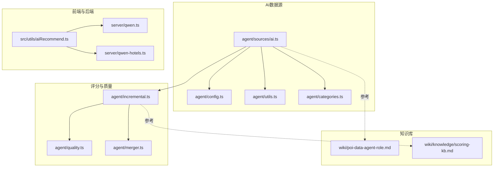
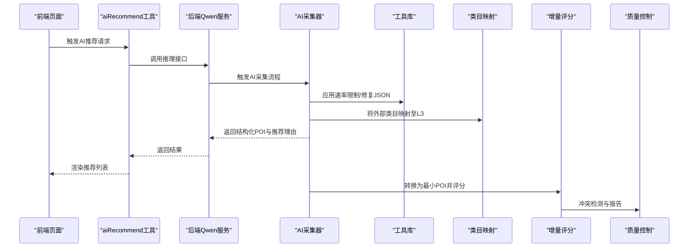
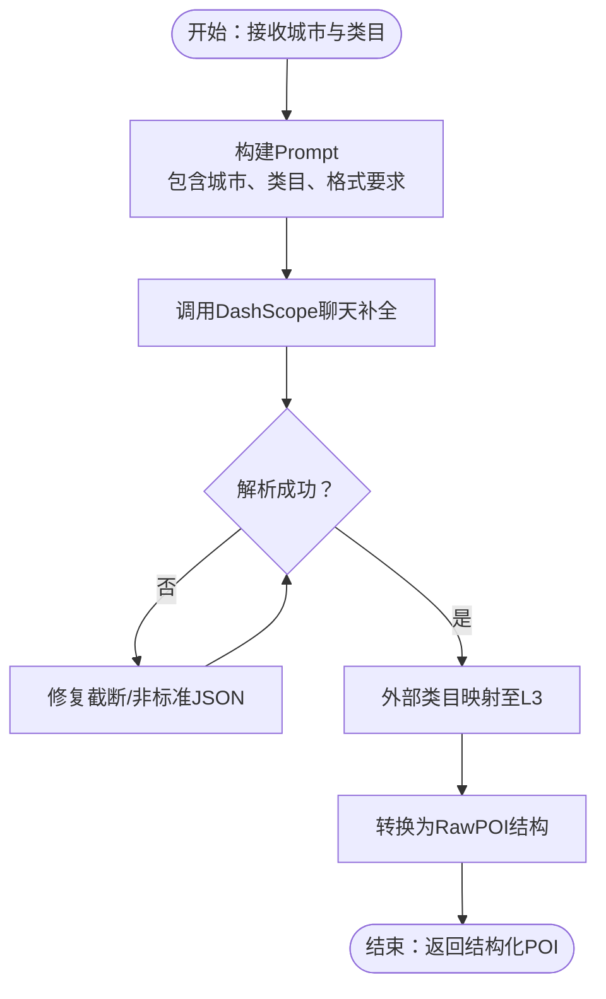
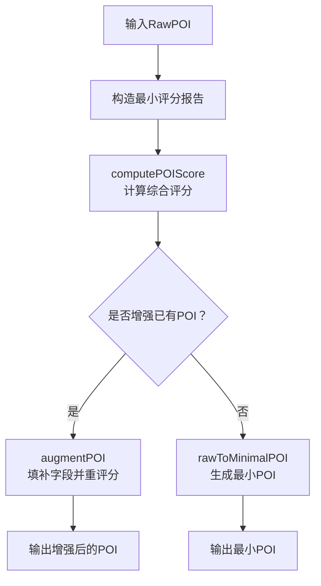
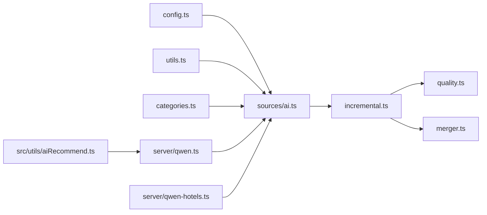

# AI智能数据源

<cite>
**本文引用的文件**
- [agent/sources/ai.ts](file://agent/sources/ai.ts)
- [agent/config.ts](file://agent/config.ts)
- [agent/utils.ts](file://agent/utils.ts)
- [agent/categories.ts](file://agent/categories.ts)
- [agent/incremental.ts](file://agent/incremental.ts)
- [agent/quality.ts](file://agent/quality.ts)
- [agent/merger.ts](file://agent/merger.ts)
- [src/utils/aiRecommend.ts](file://src/utils/aiRecommend.ts)
- [server/qwen.ts](file://server/qwen.ts)
- [server/qwen-hotels.ts](file://server/qwen-hotels.ts)
- [wiki/poi-data-agent-role.md](file://wiki/poi-data-agent-role.md)
- [wiki/knowledge/scoring-kb.md](file://wiki/knowledge/scoring-kb.md)
</cite>

## 目录
1. [简介](#简介)
2. [项目结构](#项目结构)
3. [核心组件](#核心组件)
4. [架构总览](#架构总览)
5. [详细组件分析](#详细组件分析)
6. [依赖关系分析](#依赖关系分析)
7. [性能考量](#性能考量)
8. [故障排查指南](#故障排查指南)
9. [结论](#结论)
10. [附录](#附录)

## 简介
本技术文档聚焦于AI智能数据源，系统性阐述其在POI（兴趣点）数据生成与推荐中的能力与应用。该数据源以阿里云DashScope（通义千问）为基础，通过结构化Prompt与质量控制机制，实现对城市级POI的智能生成与推荐理由抽取，并将其融入多源数据融合与评分体系中。文档覆盖API集成方式、请求参数配置、响应处理、质量控制（置信度与冲突检测）、配置指南、使用示例与最佳实践。

## 项目结构
AI智能数据源位于agent/sources目录下，围绕“采集-评分-融合-质量”闭环构建，同时在前端提供AI推荐工具函数与后端服务对接。

**图表来源**
- [agent/sources/ai.ts:1-30](file://agent/sources/ai.ts#L1-L30)
- [agent/config.ts:1-100](file://agent/config.ts#L1-L100)
- [agent/utils.ts:1-200](file://agent/utils.ts#L1-L200)
- [agent/categories.ts:1-120](file://agent/categories.ts#L1-L120)
- [agent/incremental.ts:298-432](file://agent/incremental.ts#L298-L432)
- [agent/quality.ts:1-200](file://agent/quality.ts#L1-L200)
- [agent/merger.ts:1-200](file://agent/merger.ts#L1-L200)
- [src/utils/aiRecommend.ts:1-200](file://src/utils/aiRecommend.ts#L1-L200)
- [server/qwen.ts:1-200](file://server/qwen.ts#L1-L200)
- [server/qwen-hotels.ts:1-200](file://server/qwen-hotels.ts#L1-L200)
- [wiki/poi-data-agent-role.md:1-200](file://wiki/poi-data-agent-role.md#L1-L200)
- [wiki/knowledge/scoring-kb.md:1-200](file://wiki/knowledge/scoring-kb.md#L1-L200)

**章节来源**
- [agent/sources/ai.ts:1-30](file://agent/sources/ai.ts#L1-L30)
- [agent/config.ts:1-100](file://agent/config.ts#L1-L100)
- [agent/utils.ts:1-200](file://agent/utils.ts#L1-L200)
- [agent/categories.ts:1-120](file://agent/categories.ts#L1-L120)
- [agent/incremental.ts:298-432](file://agent/incremental.ts#L298-L432)
- [agent/quality.ts:1-200](file://agent/quality.ts#L1-L200)
- [agent/merger.ts:1-200](file://agent/merger.ts#L1-L200)
- [src/utils/aiRecommend.ts:1-200](file://src/utils/aiRecommend.ts#L1-L200)
- [server/qwen.ts:1-200](file://server/qwen.ts#L1-L200)
- [server/qwen-hotels.ts:1-200](file://server/qwen-hotels.ts#L1-L200)
- [wiki/poi-data-agent-role.md:1-200](file://wiki/poi-data-agent-role.md#L1-L200)
- [wiki/knowledge/scoring-kb.md:1-200](file://wiki/knowledge/scoring-kb.md#L1-L200)

## 核心组件
- AI采集器：基于DashScope的聊天补全接口，按城市与类别生成POI与推荐理由，具备速率限制与JSON修复能力。
- 配置中心：集中管理API密钥、模型参数、速率限制等全局配置。
- 工具库：提供坐标取整、延迟、截断JSON修复、数值夹取等通用能力。
- 类目映射：将外部类目映射到内部L3类目路径，确保统一评分与融合。
- 增量评分与融合：将AI生成数据转换为最小POI并评分，支持字段增强与冲突检测。
- 质量控制：定义冲突字段与比率，输出评分报告，支撑后续融合决策。
- 前端AI推荐工具：封装调用后端Qwen服务的推荐流程，供页面组件使用。
- 后端Qwen服务：提供POI生成与酒店推荐的推理接口，作为前端调用入口。

**章节来源**
- [agent/sources/ai.ts:1-30](file://agent/sources/ai.ts#L1-L30)
- [agent/config.ts:1-100](file://agent/config.ts#L1-L100)
- [agent/utils.ts:1-200](file://agent/utils.ts#L1-L200)
- [agent/categories.ts:1-120](file://agent/categories.ts#L1-L120)
- [agent/incremental.ts:298-432](file://agent/incremental.ts#L298-L432)
- [agent/quality.ts:1-200](file://agent/quality.ts#L1-L200)
- [agent/merger.ts:1-200](file://agent/merger.ts#L1-L200)
- [src/utils/aiRecommend.ts:1-200](file://src/utils/aiRecommend.ts#L1-L200)
- [server/qwen.ts:1-200](file://server/qwen.ts#L1-L200)
- [server/qwen-hotels.ts:1-200](file://server/qwen-hotels.ts#L1-L200)

## 架构总览
AI智能数据源贯穿“采集-评分-融合-质量-展示”的完整链路，既可作为独立数据源参与增量更新，也可与高德、OpenStreetMap等其他源协同工作。

**图表来源**
- [src/utils/aiRecommend.ts:1-200](file://src/utils/aiRecommend.ts#L1-L200)
- [server/qwen.ts:1-200](file://server/qwen.ts#L1-L200)
- [agent/sources/ai.ts:1-30](file://agent/sources/ai.ts#L1-L30)
- [agent/utils.ts:1-200](file://agent/utils.ts#L1-L200)
- [agent/categories.ts:1-120](file://agent/categories.ts#L1-L120)
- [agent/incremental.ts:298-432](file://agent/incremental.ts#L298-L432)
- [agent/quality.ts:1-200](file://agent/quality.ts#L1-L200)

## 详细组件分析

### AI采集器（agent/sources/ai.ts）
- 功能定位：在其他数据源不足时，使用DashScope（通义千问）生成POI与推荐理由。
- 关键特性：
  - 模型与端点：固定模型与兼容模式端点，便于稳定集成。
  - 类目标签：针对六大类目提供明确描述，提升生成一致性。
  - 速率限制：基于配置的分类延迟，避免触发平台限流。
  - JSON修复：对截断或非标准JSON进行修复，提高解析成功率。
- 输入输出：
  - 输入：城市信息、目标类目、坐标范围等上下文。
  - 输出：结构化POI（含名称、地址、经纬度、评分、时长、标签、推荐理由等）。

**图表来源**
- [agent/sources/ai.ts:1-30](file://agent/sources/ai.ts#L1-L30)
- [agent/utils.ts:1-200](file://agent/utils.ts#L1-L200)
- [agent/categories.ts:1-120](file://agent/categories.ts#L1-L120)

**章节来源**
- [agent/sources/ai.ts:1-30](file://agent/sources/ai.ts#L1-L30)

### 配置中心（agent/config.ts）
- 作用：集中管理API密钥、模型参数、速率限制、延迟等全局配置。
- 关键项：
  - API密钥：DashScope访问凭证。
  - 模型参数：如模型名、温度、最大令牌数等（根据需要扩展）。
  - 速率限制：每类目的请求间隔，保障稳定性。
- 建议：将敏感配置置于环境变量中，避免硬编码。

**章节来源**
- [agent/config.ts:1-100](file://agent/config.ts#L1-L100)

### 工具库（agent/utils.ts）
- 作用：提供通用能力，支撑AI采集与数据处理。
- 关键能力：
  - RateLimiter：基于时间窗口的速率限制。
  - delay：可控延迟，缓解突发请求。
  - repairTruncatedJSON：修复截断或不完整JSON。
  - roundCoord：坐标取整，减少噪声。
  - clamp：数值夹取，保证字段范围合法。

**章节来源**
- [agent/utils.ts:1-200](file://agent/utils.ts#L1-L200)

### 类目映射（agent/categories.ts）
- 作用：将外部类目统一映射到内部L3类目路径，确保评分与融合的一致性。
- 关键点：提供从外部类目到L3路径的映射表与辅助函数。

**章节来源**
- [agent/categories.ts:1-120](file://agent/categories.ts#L1-L120)

### 增量评分与融合（agent/incremental.ts）
- 作用：将AI生成的RawPOI转换为最小POI并评分；支持字段增强与冲突检测。
- 关键流程：
  - poiToRawPOI：标准化POI为RawPOI，便于比较。
  - scoreForRawPOI：为单源POI构造最小评分报告。
  - augmentPOI：用新数据增强既有POI（填补空白字段），并重新评分。
  - rawToMinimalPOI：新增POI的最小转换，设定默认值与边界约束。

**图表来源**
- [agent/incremental.ts:298-432](file://agent/incremental.ts#L298-L432)

**章节来源**
- [agent/incremental.ts:298-432](file://agent/incremental.ts#L298-L432)

### 质量控制（agent/quality.ts）
- 作用：定义冲突字段、计算冲突比率，输出评分报告，辅助融合决策。
- 关键点：冲突检测与报告结构，用于指导后续合并策略。

**章节来源**
- [agent/quality.ts:1-200](file://agent/quality.ts#L1-L200)

### 多源融合（agent/merger.ts）
- 作用：整合AI与其他数据源的POI，依据评分与冲突报告进行去重与合并。
- 关键点：与评分与质量模块协作，形成最终可用的POI集合。

**章节来源**
- [agent/merger.ts:1-200](file://agent/merger.ts#L1-L200)

### 前端AI推荐工具（src/utils/aiRecommend.ts）
- 作用：封装调用后端Qwen服务的推荐流程，供页面组件使用。
- 关键点：请求参数组织、错误处理、结果渲染。

**章节来源**
- [src/utils/aiRecommend.ts:1-200](file://src/utils/aiRecommend.ts#L1-L200)

### 后端Qwen服务（server/qwen.ts）
- 作用：提供POI生成与推荐的推理接口，作为前端调用入口。
- 关键点：路由定义、参数校验、调用AI采集器、返回结构化结果。

**章节来源**
- [server/qwen.ts:1-200](file://server/qwen.ts#L1-L200)

### 后端Qwen酒店服务（server/qwen-hotels.ts）
- 作用：专门处理酒店类POI的生成与推荐，复用AI采集器能力。
- 关键点：类目特化、参数适配、与通用Qwen服务的差异。

**章节来源**
- [server/qwen-hotels.ts:1-200](file://server/qwen-hotels.ts#L1-L200)

## 依赖关系分析
AI智能数据源的内部依赖清晰，耦合度低、内聚性强，便于扩展与维护。

**图表来源**
- [agent/config.ts:1-100](file://agent/config.ts#L1-L100)
- [agent/sources/ai.ts:1-30](file://agent/sources/ai.ts#L1-L30)
- [agent/utils.ts:1-200](file://agent/utils.ts#L1-L200)
- [agent/categories.ts:1-120](file://agent/categories.ts#L1-L120)
- [agent/incremental.ts:298-432](file://agent/incremental.ts#L298-L432)
- [agent/quality.ts:1-200](file://agent/quality.ts#L1-L200)
- [agent/merger.ts:1-200](file://agent/merger.ts#L1-L200)
- [src/utils/aiRecommend.ts:1-200](file://src/utils/aiRecommend.ts#L1-L200)
- [server/qwen.ts:1-200](file://server/qwen.ts#L1-L200)
- [server/qwen-hotels.ts:1-200](file://server/qwen-hotels.ts#L1-L200)

**章节来源**
- [agent/config.ts:1-100](file://agent/config.ts#L1-L100)
- [agent/sources/ai.ts:1-30](file://agent/sources/ai.ts#L1-L30)
- [agent/utils.ts:1-200](file://agent/utils.ts#L1-L200)
- [agent/categories.ts:1-120](file://agent/categories.ts#L1-L120)
- [agent/incremental.ts:298-432](file://agent/incremental.ts#L298-L432)
- [agent/quality.ts:1-200](file://agent/quality.ts#L1-L200)
- [agent/merger.ts:1-200](file://agent/merger.ts#L1-L200)
- [src/utils/aiRecommend.ts:1-200](file://src/utils/aiRecommend.ts#L1-L200)
- [server/qwen.ts:1-200](file://server/qwen.ts#L1-L200)
- [server/qwen-hotels.ts:1-200](file://server/qwen-hotels.ts#L1-L200)

## 性能考量
- 速率限制：通过分类维度的延迟控制，避免触发平台限流，保障稳定性与成本可控。
- JSON修复：对截断或非标准JSON进行修复，降低解析失败率，提升吞吐。
- 数值边界：对评分、价格、时长等字段进行夹取，防止异常值影响评分与展示。
- 并发与批处理：建议结合队列与批处理策略，进一步优化吞吐与资源占用。

## 故障排查指南
- API密钥与网络问题：
  - 确认配置中心中的DashScope密钥有效且未过期。
  - 检查网络连通性与代理设置，避免请求超时。
- JSON解析失败：
  - 利用工具库的JSON修复能力，确认修复逻辑生效。
  - 对异常响应进行日志记录与重试。
- 评分异常：
  - 检查类目映射是否正确，避免因类目不一致导致评分偏差。
  - 核对冲突检测与评分报告，定位冲突字段与比率异常。
- 推荐理由为空：
  - 检查Prompt构建与模型参数，确保格式要求与上下文完整。
  - 在后端服务中增加参数校验与错误回退逻辑。

**章节来源**
- [agent/config.ts:1-100](file://agent/config.ts#L1-L100)
- [agent/utils.ts:1-200](file://agent/utils.ts#L1-L200)
- [agent/quality.ts:1-200](file://agent/quality.ts#L1-L200)
- [server/qwen.ts:1-200](file://server/qwen.ts#L1-L200)

## 结论
AI智能数据源通过DashScope实现了高质量的POI生成与推荐理由抽取，并以严格的速率限制、JSON修复与评分融合机制保障了数据质量与系统稳定性。配合前端推荐工具与后端推理服务，形成了从采集到展示的完整闭环。建议在生产环境中持续优化Prompt、完善错误处理与监控告警，并结合业务场景动态调整模型参数与评分权重。

## 附录

### API集成方式与请求参数配置
- 端点与模型：固定DashScope兼容模式端点与模型名，便于统一接入。
- 请求头：包含认证信息与内容类型。
- 请求体：包含系统消息、用户消息（含城市、类目、格式要求）与模型参数。
- 响应处理：解析结构化POI与推荐理由，必要时进行JSON修复与字段清洗。

**章节来源**
- [agent/sources/ai.ts:1-30](file://agent/sources/ai.ts#L1-L30)
- [agent/config.ts:1-100](file://agent/config.ts#L1-L100)

### 质量控制机制（置信度与冲突检测）
- 冲突字段：定义冲突检测的字段集合，如名称、地址、经纬度、评分等。
- 冲突比率：计算冲突对占可比对的比例，辅助融合决策。
- 评分报告：输出来源统计、冲突计数与字段详情，支撑可视化与审计。

**章节来源**
- [agent/quality.ts:1-200](file://agent/quality.ts#L1-L200)
- [agent/incremental.ts:298-432](file://agent/incremental.ts#L298-L432)

### 配置指南
- API密钥设置：在配置中心集中管理，建议使用环境变量注入。
- 模型参数调优：根据业务需求调整温度、最大令牌数等，平衡生成质量与成本。
- 错误处理策略：统一捕获网络异常、解析异常与业务异常，记录日志并进行重试或降级。

**章节来源**
- [agent/config.ts:1-100](file://agent/config.ts#L1-L100)
- [agent/utils.ts:1-200](file://agent/utils.ts#L1-L200)

### 实际使用示例与最佳实践
- 示例场景：在城市POI不足时，按类目触发AI生成；将生成结果与现有数据融合并评分。
- 最佳实践：
  - 明确Prompt规范，确保输出结构一致。
  - 分类维度设置合理延迟，避免限流。
  - 对评分与冲突报告进行可视化展示，辅助人工审核。
  - 建立监控与告警，及时发现异常并处置。

**章节来源**
- [src/utils/aiRecommend.ts:1-200](file://src/utils/aiRecommend.ts#L1-L200)
- [server/qwen.ts:1-200](file://server/qwen.ts#L1-L200)
- [wiki/poi-data-agent-role.md:1-200](file://wiki/poi-data-agent-role.md#L1-L200)
- [wiki/knowledge/scoring-kb.md:1-200](file://wiki/knowledge/scoring-kb.md#L1-L200)