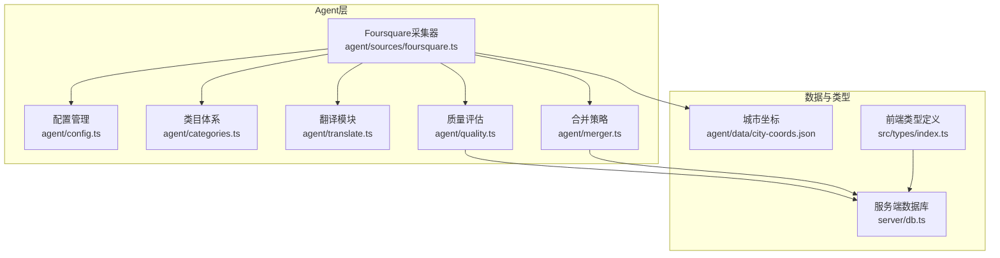
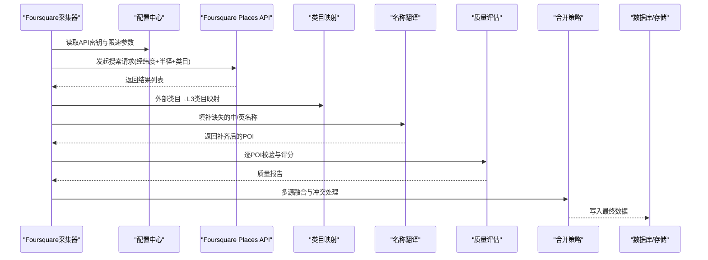
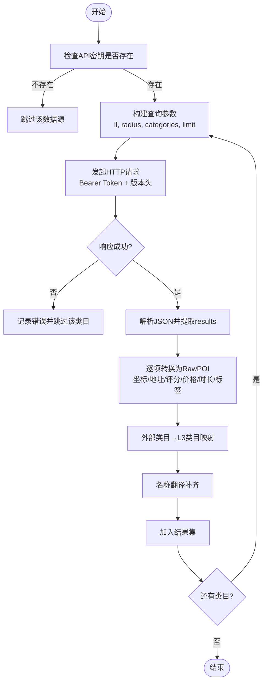
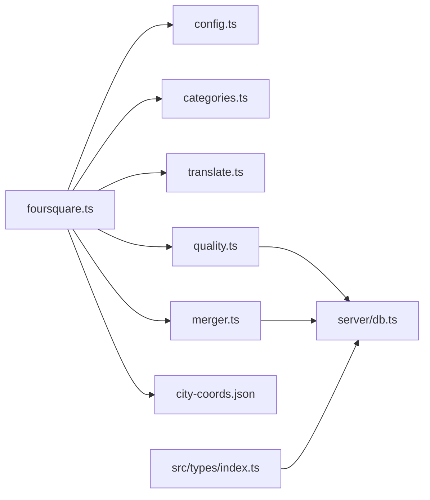

# Foursquare数据源

<cite>
**本文档引用的文件**
- [agent/sources/foursquare.ts](file://agent/sources/foursquare.ts)
- [agent/config.ts](file://agent/config.ts)
- [agent/categories.ts](file://agent/categories.ts)
- [agent/translate.ts](file://agent/translate.ts)
- [agent/quality.ts](file://agent/quality.ts)
- [agent/merger.ts](file://agent/merger.ts)
- [agent/data/city-coords.json](file://agent/data/city-coords.json)
- [src/types/index.ts](file://src/types/index.ts)
- [server/db.ts](file://server/db.ts)
</cite>

## 目录
1. [简介](#简介)
2. [项目结构](#项目结构)
3. [核心组件](#核心组件)
4. [架构总览](#架构总览)
5. [详细组件分析](#详细组件分析)
6. [依赖关系分析](#依赖关系分析)
7. [性能考量](#性能考量)
8. [故障排查指南](#故障排查指南)
9. [结论](#结论)
10. [附录](#附录)

## 简介
本文件面向“Foursquare数据源”的社交数据集成，围绕以下目标展开：
- 详述Foursquare Places API v3的接入方式与调用流程
- 说明Venue API的使用与用户评价数据整合策略
- 分析Foursquare数据的社交特色与UGC优势（真实体验、照片分享、社交互动）
- 解释数据隐私保护与用户同意机制的实现现状
- 提供API认证配置、数据过滤与质量控制策略
- 展示社交数据在旅行规划中的应用场景与价值分析

## 项目结构
Foursquare数据源位于Agent子系统中，采用模块化设计：
- 数据源采集器：负责调用Foursquare API、解析响应、转换为统一格式
- 配置管理：集中管理API密钥、超时与速率限制等运行参数
- 类目体系：定义六大一级类目及映射规则，支持外部类目到内部类目的映射
- 翻译模块：补齐缺失的中/英名称
- 质量评估：对采集数据进行清洗、校验与评分
- 合并策略：多源数据融合与冲突处理

**图表来源**
- [agent/sources/foursquare.ts:1-199](file://agent/sources/foursquare.ts#L1-L199)
- [agent/config.ts:1-182](file://agent/config.ts#L1-L182)
- [agent/categories.ts:1-374](file://agent/categories.ts#L1-L374)
- [agent/translate.ts:1-196](file://agent/translate.ts#L1-L196)
- [agent/quality.ts:1-327](file://agent/quality.ts#L1-L327)
- [agent/merger.ts:465-506](file://agent/merger.ts#L465-L506)
- [agent/data/city-coords.json:1-800](file://agent/data/city-coords.json#L1-L800)
- [src/types/index.ts:136-208](file://src/types/index.ts#L136-L208)
- [server/db.ts:42-84](file://server/db.ts#L42-L84)

**章节来源**
- [agent/sources/foursquare.ts:1-199](file://agent/sources/foursquare.ts#L1-L199)
- [agent/config.ts:1-182](file://agent/config.ts#L1-L182)

## 核心组件
- Foursquare采集器：封装API调用、参数构造、响应解析与数据转换
- 配置中心：集中管理API密钥、超时与速率限制
- 类目映射：支持外部类目到内部L3类目的映射
- 翻译补齐：基于DashScope的批量名称翻译
- 质量评估：完整性、准确性、丰富度、多样性维度评分
- 合并策略：多源融合与冲突惩罚

**章节来源**
- [agent/sources/foursquare.ts:163-199](file://agent/sources/foursquare.ts#L163-L199)
- [agent/config.ts:20-77](file://agent/config.ts#L20-L77)
- [agent/categories.ts:348-374](file://agent/categories.ts#L348-L374)
- [agent/translate.ts:122-196](file://agent/translate.ts#L122-L196)
- [agent/quality.ts:189-293](file://agent/quality.ts#L189-L293)
- [agent/merger.ts:475-490](file://agent/merger.ts#L475-L490)

## 架构总览
Foursquare数据流从采集器开始，经由类目映射、名称翻译、质量评估与合并策略，最终写入数据库或供前端消费。

**图表来源**
- [agent/sources/foursquare.ts:121-159](file://agent/sources/foursquare.ts#L121-L159)
- [agent/categories.ts:348-374](file://agent/categories.ts#L348-L374)
- [agent/translate.ts:122-196](file://agent/translate.ts#L122-L196)
- [agent/quality.ts:189-293](file://agent/quality.ts#L189-L293)
- [agent/merger.ts:475-490](file://agent/merger.ts#L475-L490)
- [server/db.ts:42-84](file://server/db.ts#L42-L84)

## 详细组件分析

### Foursquare采集器（Venue API与社交数据整合）
- 接口与认证
  - 使用新版端点与Bearer Token认证，携带版本头
  - 通过环境变量注入API Key
- 查询参数
  - 以经纬度为中心，按设定半径与类目集合查询
  - 限制单次返回数量上限
- 响应解析与转换
  - 优先使用顶层坐标；若无则回退到地理编码字段
  - 提取名称、地址、评分、价格、营业时间、描述/提示、标签
  - 将Foursquare评分归一化到1-5分
  - 默认访问时长按类目预设
- 类目映射
  - 使用外部类目到L3的映射函数，尽可能提升类目精度
- 名称补齐
  - 调用翻译模块补齐缺失的中/英名称
- 错误处理
  - 捕获HTTP错误与超时，记录并继续处理其他类目

**图表来源**
- [agent/sources/foursquare.ts:121-159](file://agent/sources/foursquare.ts#L121-L159)
- [agent/sources/foursquare.ts:34-92](file://agent/sources/foursquare.ts#L34-L92)
- [agent/categories.ts:348-374](file://agent/categories.ts#L348-L374)
- [agent/translate.ts:122-196](file://agent/translate.ts#L122-L196)

**章节来源**
- [agent/sources/foursquare.ts:15-199](file://agent/sources/foursquare.ts#L15-L199)

### API认证配置与可用性检测
- 认证方式
  - Bearer Token + Service API Key
  - 通过环境变量FOURSQUARE_API_KEY注入
- 可用性检测
  - 在配置中提供可用性检测函数，若未配置Key则标记不可用
- 运行参数
  - 超时与速率限制分别在配置中设置，确保稳定运行

**章节来源**
- [agent/config.ts:20-28](file://agent/config.ts#L20-L28)
- [agent/config.ts:87-125](file://agent/config.ts#L87-L125)
- [agent/config.ts:37-53](file://agent/config.ts#L37-L53)

### 类目体系与外部类目映射
- 六大一级类目：scenic、food、shopping、entertainment、experience、hotel
- 外部类目到L3映射
  - 基于关键字匹配（如museum、restaurant、hotel等），优先映射到最贴合的L3
  - 若无法映射，则保留默认L2/L3组合

**章节来源**
- [agent/categories.ts:17-31](file://agent/categories.ts#L17-L31)
- [agent/categories.ts:348-374](file://agent/categories.ts#L348-L374)

### 名称翻译与多语言支持
- 翻译策略
  - 基于DashScope模型，批量补齐缺失的中文名与英文名
  - 自动识别主名称语言，避免重复翻译
- 批处理与限速
  - 每批最多30条，控制调用频率，降低API成本与风险

**章节来源**
- [agent/translate.ts:122-196](file://agent/translate.ts#L122-L196)

### 数据质量控制与过滤
- 质量评估维度
  - 完整性、准确性、丰富度、多样性
  - 城市级评分与问题清单
- 过滤与修复
  - 坐标有效性、距离城市中心阈值、重复与冲突
  - 自动修复与人工审核结合

**章节来源**
- [agent/quality.ts:189-293](file://agent/quality.ts#L189-L293)
- [agent/quality.ts:23-169](file://agent/quality.ts#L23-L169)

### 多源融合与冲突处理
- 融合评分
  - 基于来源数量、一致性与冲突惩罚计算综合分数
- 过滤阶段
  - 预过滤剔除明显无效POI，减少后续处理负担

**章节来源**
- [agent/merger.ts:475-490](file://agent/merger.ts#L475-L490)
- [agent/merger.ts:494-506](file://agent/merger.ts#L494-L506)

### 社交数据的社交特色与UGC优势
- 用户评价与评分
  - Foursquare提供评分与描述/提示字段，可作为用户真实体验的参考
- 标签与类目
  - 标签有助于表达场所特性，便于兴趣匹配与个性化推荐
- 营业时间
  - 为行程安排提供时间约束
- 照片分享与社交互动
  - 当前采集器未直接抓取图片链接；如需照片与互动数据，建议扩展接口或引入其他数据源补充

**章节来源**
- [agent/sources/foursquare.ts:67-92](file://agent/sources/foursquare.ts#L67-L92)

### 数据隐私保护与用户同意机制
- 当前实现
  - 采集器仅获取公开的Venue信息（名称、地址、评分、描述等）
  - 未涉及用户个人数据或评论内容的抓取
- 建议
  - 如需引入用户UGC（如评论、照片），需明确用户同意与数据使用范围，并遵守相关法规

**章节来源**
- [agent/sources/foursquare.ts:121-159](file://agent/sources/foursquare.ts#L121-L159)

### 旅行规划中的应用场景与价值
- 场景
  - 景点与体验类：徒步、SPA、博物馆等
  - 餐饮与购物：本地特色、连锁品牌、夜市与市集
  - 娱乐与主题：主题公园、演出、夜生活
  - 住宿：舒适型与特色住宿
- 价值
  - 结合评分与时长预估，辅助行程编排
  - 与季节性指数结合，提升推荐相关性

**章节来源**
- [agent/sources/foursquare.ts:94-117](file://agent/sources/foursquare.ts#L94-L117)
- [agent/categories.ts:34-225](file://agent/categories.ts#L34-L225)

## 依赖关系分析
- 采集器依赖配置中心（密钥、超时、限速）、类目映射、翻译模块
- 质量评估与合并策略依赖采集结果与类目体系
- 存储层（数据库）为最终落点，供前端展示与旅行笔记发布

**图表来源**
- [agent/sources/foursquare.ts:1-199](file://agent/sources/foursquare.ts#L1-L199)
- [agent/config.ts:1-182](file://agent/config.ts#L1-L182)
- [agent/categories.ts:1-374](file://agent/categories.ts#L1-L374)
- [agent/translate.ts:1-196](file://agent/translate.ts#L1-L196)
- [agent/quality.ts:1-327](file://agent/quality.ts#L1-L327)
- [agent/merger.ts:465-506](file://agent/merger.ts#L465-L506)
- [agent/data/city-coords.json:1-800](file://agent/data/city-coords.json#L1-L800)
- [src/types/index.ts:136-208](file://src/types/index.ts#L136-L208)
- [server/db.ts:42-84](file://server/db.ts#L42-L84)

**章节来源**
- [agent/sources/foursquare.ts:1-199](file://agent/sources/foursquare.ts#L1-L199)
- [agent/config.ts:1-182](file://agent/config.ts#L1-L182)

## 性能考量
- 速率限制
  - 默认1秒/请求，避免触发平台限流
- 超时控制
  - 设置合理超时，防止阻塞整体流程
- 批处理与缓存
  - 名称翻译采用批处理，减少API调用次数
  - 城市坐标与POI缓存可降低重复请求

**章节来源**
- [agent/config.ts:46](file://agent/config.ts#L46)
- [agent/config.ts:39](file://agent/config.ts#L39)
- [agent/translate.ts:19-20](file://agent/translate.ts#L19-L20)
- [agent/data/city-coords.json:1-800](file://agent/data/city-coords.json#L1-L800)

## 故障排查指南
- 常见问题
  - API密钥未配置：检查环境变量FOURSQUARE_API_KEY
  - 请求超时：适当提高超时阈值或降低并发
  - 速率限制：调整间隔或分时段采集
  - 类目映射不准确：检查外部类目关键字与映射规则
  - 名称翻译失败：确认DashScope密钥与网络连通性
- 质量问题
  - 坐标异常或偏离城市中心：检查原始数据与坐标转换
  - 评分缺失：确认Foursquare响应字段

**章节来源**
- [agent/config.ts:87-125](file://agent/config.ts#L87-L125)
- [agent/quality.ts:23-169](file://agent/quality.ts#L23-L169)
- [agent/translate.ts:40-77](file://agent/translate.ts#L40-L77)

## 结论
Foursquare数据源在本项目中实现了高质量的Venue信息采集与标准化处理，具备以下优势：
- 真实用户评分与描述，支撑旅行决策
- 完善的类目映射与名称补齐，提升数据可用性
- 成熟的质量评估与多源融合策略，保障数据可信度

建议后续扩展：
- 引入用户UGC（评论、照片）以增强社交属性
- 增加数据隐私与用户同意机制
- 结合季节性与热度指数，优化个性化推荐

## 附录

### API认证配置清单
- 环境变量
  - FOURSQUARE_API_KEY：Foursquare服务API Key
- 运行参数
  - foursquareTimeout：请求超时（毫秒）
  - foursquareInterval：请求间隔（毫秒）

**章节来源**
- [agent/config.ts:20-28](file://agent/config.ts#L20-L28)
- [agent/config.ts:39](file://agent/config.ts#L39)
- [agent/config.ts:46](file://agent/config.ts#L46)

### 数据过滤与质量控制策略
- 过滤标准
  - 坐标有效性、距离中心阈值、重复与冲突
- 评分维度
  - 完整性、准确性、丰富度、多样性
- 处理流程
  - 预过滤→逐POI校验→自动修复→合并评分→入库

**章节来源**
- [agent/quality.ts:189-293](file://agent/quality.ts#L189-L293)
- [agent/merger.ts:475-490](file://agent/merger.ts#L475-L490)

### 社交数据在旅行规划中的应用
- 推荐场景
  - 基于评分与时长预估的行程编排
  - 结合用户标签的兴趣匹配
- 价值体现
  - 提升旅行体验的真实感与可信度
  - 支撑旅行笔记与社交分享

**章节来源**
- [agent/sources/foursquare.ts:67-92](file://agent/sources/foursquare.ts#L67-L92)
- [agent/categories.ts:34-225](file://agent/categories.ts#L34-L225)