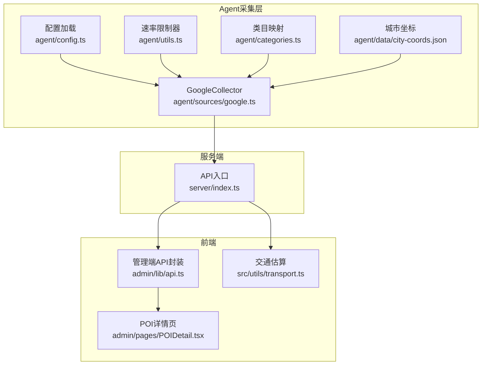
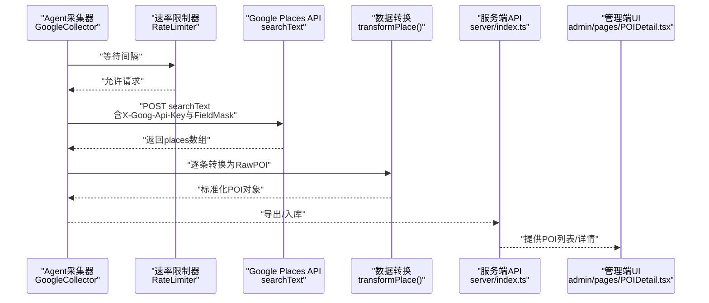
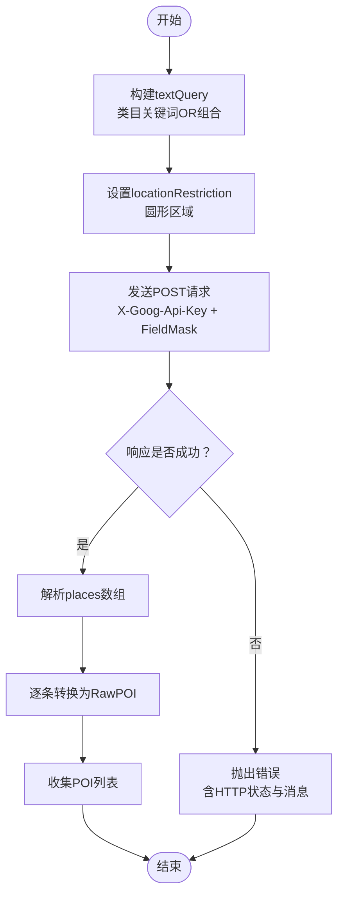
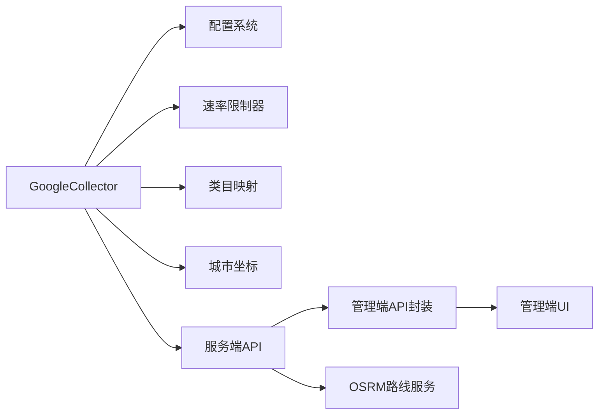

# Google地图数据源

<cite>
**本文引用的文件**
- [agent/sources/google.ts](file://agent/sources/google.ts)
- [agent/config.ts](file://agent/config.ts)
- [agent/utils.ts](file://agent/utils.ts)
- [agent/categories.ts](file://agent/categories.ts)
- [agent/data/city-coords.json](file://agent/data/city-coords.json)
- [server/index.ts](file://server/index.ts)
- [admin/lib/api.ts](file://admin/lib/api.ts)
- [admin/pages/POIDetail.tsx](file://admin/pages/POIDetail.tsx)
- [src/utils/transport.ts](file://src/utils/transport.ts)
</cite>

## 目录
1. [简介](#简介)
2. [项目结构](#项目结构)
3. [核心组件](#核心组件)
4. [架构总览](#架构总览)
5. [详细组件分析](#详细组件分析)
6. [依赖分析](#依赖分析)
7. [性能考虑](#性能考虑)
8. [故障排查指南](#故障排查指南)
9. [结论](#结论)
10. [附录](#附录)

## 简介
本文件面向“Google地图数据源”的专业集成文档，围绕Google Places API（新端点）在本项目中的实现进行系统化说明。内容涵盖API密钥配置、请求参数设置与响应解析、全球覆盖与国际化特性（多语言、评价与媒体）、地理编码与反向地理编码的应用场景、API使用限制与配额管理、成本控制策略，以及实际集成示例与性能优化建议。

## 项目结构
本项目采用“Agent采集 + 服务端聚合 + 前端展示”的分层架构。与Google地图集成相关的代码主要集中在agent子系统，负责从Google Places API拉取POI数据，并将其标准化为内部统一的RawPOI格式；随后由服务端与前端进行展示与交互。

**图表来源**
- [agent/sources/google.ts:167-202](file://agent/sources/google.ts#L167-L202)
- [agent/config.ts:32-77](file://agent/config.ts#L32-L77)
- [agent/utils.ts:110-123](file://agent/utils.ts#L110-L123)
- [agent/categories.ts:348-373](file://agent/categories.ts#L348-L373)
- [agent/data/city-coords.json:1-200](file://agent/data/city-coords.json#L1-L200)
- [server/index.ts:287-308](file://server/index.ts#L287-L308)
- [admin/lib/api.ts:1-32](file://admin/lib/api.ts#L1-L32)
- [admin/pages/POIDetail.tsx](file://admin/pages/POIDetail.tsx)
- [src/utils/transport.ts:39-81](file://src/utils/transport.ts#L39-L81)

**章节来源**
- [agent/sources/google.ts:1-203](file://agent/sources/google.ts#L1-L203)
- [agent/config.ts:1-182](file://agent/config.ts#L1-L182)
- [agent/utils.ts:74-131](file://agent/utils.ts#L74-L131)
- [agent/categories.ts:227-373](file://agent/categories.ts#L227-L373)
- [agent/data/city-coords.json:1-800](file://agent/data/city-coords.json#L1-L800)
- [server/index.ts:287-308](file://server/index.ts#L287-L308)
- [admin/lib/api.ts:1-32](file://admin/lib/api.ts#L1-L32)
- [admin/pages/POIDetail.tsx](file://admin/pages/POIDetail.tsx)
- [src/utils/transport.ts:39-81](file://src/utils/transport.ts#L39-L81)

## 核心组件
- GoogleCollector：实现SourceCollector接口，负责调用Google Places API searchText端点，按城市与类目搜索POI，并将结果转换为内部RawPOI。
- 配置系统：从.env.local读取API密钥与运行参数，包含Google API密钥、超时与速率限制等。
- 速率限制器：基于时间间隔的RateLimiter，确保请求频率符合Google配额要求。
- 类目映射：externalCategoryToL3将外部类目（如Google Place Types）映射到内部L3类目，提升数据一致性。
- 城市坐标：通过city-coords.json提供经纬度与国家/地区信息，支撑地理范围查询。

**章节来源**
- [agent/sources/google.ts:167-202](file://agent/sources/google.ts#L167-L202)
- [agent/config.ts:20-28](file://agent/config.ts#L20-L28)
- [agent/config.ts:32-77](file://agent/config.ts#L32-L77)
- [agent/utils.ts:110-123](file://agent/utils.ts#L110-L123)
- [agent/categories.ts:348-373](file://agent/categories.ts#L348-L373)
- [agent/data/city-coords.json:1-200](file://agent/data/city-coords.json#L1-L200)

## 架构总览
下图展示了从Agent发起请求到服务端与前端消费数据的整体流程，重点标注了Google Places API的关键交互点。

**图表来源**
- [agent/sources/google.ts:119-163](file://agent/sources/google.ts#L119-L163)
- [agent/utils.ts:110-123](file://agent/utils.ts#L110-L123)
- [agent/sources/google.ts:31-85](file://agent/sources/google.ts#L31-L85)
- [server/index.ts:287-308](file://server/index.ts#L287-L308)
- [admin/pages/POIDetail.tsx](file://admin/pages/POIDetail.tsx)

## 详细组件分析

### Google Places API集成实现
- API端点与认证
  - 使用searchText端点，通过HTTP头X-Goog-Api-Key传递密钥。
  - FieldMask仅请求必要字段，减少带宽与成本。
- 请求参数
  - textQuery：类目关键词组合（OR连接）。
  - locationRestriction：圆形区域，中心为城市坐标，半径以千米传入并转为米。
  - maxResultCount：单次请求最大结果数量。
  - languageCode：固定为zh-CN，体现多语言支持能力。
- 响应解析
  - 解析places数组，提取displayName、formattedAddress、location、rating、types、priceLevel、regularOpeningHours、editorialSummary、primaryTypeDisplayName等。
  - 转换为内部RawPOI，包含名称、地址、坐标、评分、价格等级、营业时间、描述、标签、访问时长等字段。
- 错误处理
  - 对非2xx响应抛出错误，包含HTTP状态与错误消息。
  - 使用AbortController与超时控制，避免请求悬挂。

**图表来源**
- [agent/sources/google.ts:119-163](file://agent/sources/google.ts#L119-L163)
- [agent/sources/google.ts:31-85](file://agent/sources/google.ts#L31-L85)

**章节来源**
- [agent/sources/google.ts:14-163](file://agent/sources/google.ts#L14-L163)
- [agent/sources/google.ts:31-85](file://agent/sources/google.ts#L31-L85)

### API密钥配置与可用性检测
- 密钥来源：从项目根目录.env.local加载，键名GOOGLE_PLACES_API_KEY。
- 可用性检测：通过isAvailable判断密钥是否存在，不存在则该数据源跳过。
- 运行参数：超时与速率限制在AGENT_CONFIG中集中配置，便于统一管理。

**章节来源**
- [agent/config.ts:15-28](file://agent/config.ts#L15-L28)
- [agent/config.ts:87-125](file://agent/config.ts#L87-L125)
- [agent/config.ts:32-77](file://agent/config.ts#L32-L77)
- [agent/sources/google.ts:170-172](file://agent/sources/google.ts#L170-L172)

### 类目映射与数据标准化
- 外部类目到L3映射：externalCategoryToL3根据关键词匹配，将Google Place Types映射到内部L1/L3，保证跨数据源的一致性。
- 默认L2/L3：当无明确映射时，使用默认L2/L3作为兜底。
- 标签与描述：优先使用primaryTypeDisplayName与editorialSummary，补充types作为标签来源。

**章节来源**
- [agent/categories.ts:348-373](file://agent/categories.ts#L348-L373)
- [agent/sources/google.ts:100-115](file://agent/sources/google.ts#L100-L115)
- [agent/sources/google.ts:43-55](file://agent/sources/google.ts#L43-L55)

### 地理编码与反向地理编码
- 地理编码：本项目通过city-coords.json提供城市中心坐标，用于Places API的locationRestriction。
- 反向地理编码：当前实现未直接调用Google Geocoding API；若需更精确地址或行政区划信息，可在服务端或Agent层扩展调用对应端点。

**章节来源**
- [agent/data/city-coords.json:1-200](file://agent/data/city-coords.json#L1-L200)
- [agent/sources/google.ts:139-150](file://agent/sources/google.ts#L139-L150)

### 国际化与多语言支持
- 语言参数：languageCode固定为zh-CN，满足中文展示需求。
- 名称与地址：保留英文名称与英文地址字段，便于国际化场景复用。
- 描述与标签：editorialSummary与primaryTypeDisplayName可配合翻译模块使用。

**章节来源**
- [agent/sources/google.ts:148](file://agent/sources/google.ts#L148)
- [agent/sources/google.ts:66-81](file://agent/sources/google.ts#L66-L81)

### 评分与媒体内容
- 评分：使用rating字段，经数值裁剪至1-5区间。
- 媒体：当前实现未直接拉取图片/相册；如需媒体内容，可在FieldMask中增加相应字段并在转换逻辑中扩展。

**章节来源**
- [agent/sources/google.ts:76-80](file://agent/sources/google.ts#L76-L80)
- [agent/sources/google.ts:137](file://agent/sources/google.ts#L137)

### 成本控制与配额管理
- FieldMask最小化：仅请求必要字段，降低请求体积与成本。
- 速率限制：RateLimiter以毫秒间隔控制请求节奏，避免触发配额限制。
- 超时控制：AbortController与超时机制防止长时间占用资源。
- 额度提示：注释标明“$200/月免费额度”，结合上述措施可有效控制成本。

**章节来源**
- [agent/sources/google.ts:137](file://agent/sources/google.ts#L137)
- [agent/utils.ts:110-123](file://agent/utils.ts#L110-L123)
- [agent/config.ts:32-77](file://agent/config.ts#L32-L77)

## 依赖分析
- 组件耦合
  - GoogleCollector依赖配置系统（API密钥、超时、间隔）、速率限制器、类目映射与城市坐标。
  - 服务端与前端通过API进行解耦，前端通过admin/lib/api.ts封装请求。
- 外部依赖
  - Google Places API（新端点）。
  - OSRM（用于交通路线估算，与地图数据互补）。

**图表来源**
- [agent/sources/google.ts:167-202](file://agent/sources/google.ts#L167-L202)
- [agent/config.ts:20-28](file://agent/config.ts#L20-L28)
- [agent/utils.ts:110-123](file://agent/utils.ts#L110-L123)
- [agent/categories.ts:348-373](file://agent/categories.ts#L348-L373)
- [agent/data/city-coords.json:1-200](file://agent/data/city-coords.json#L1-L200)
- [server/index.ts:287-308](file://server/index.ts#L287-L308)
- [admin/lib/api.ts:1-32](file://admin/lib/api.ts#L1-L32)

**章节来源**
- [agent/sources/google.ts:167-202](file://agent/sources/google.ts#L167-L202)
- [agent/config.ts:20-28](file://agent/config.ts#L20-L28)
- [agent/utils.ts:110-123](file://agent/utils.ts#L110-L123)
- [agent/categories.ts:348-373](file://agent/categories.ts#L348-L373)
- [agent/data/city-coords.json:1-200](file://agent/data/city-coords.json#L1-L200)
- [server/index.ts:287-308](file://server/index.ts#L287-L308)
- [admin/lib/api.ts:1-32](file://admin/lib/api.ts#L1-L32)

## 性能考虑
- 请求节流：使用RateLimiter确保每500ms一次请求，兼顾吞吐与合规。
- 字段裁剪：通过FieldMask仅取所需字段，减少网络与解析开销。
- 超时与中断：AbortController与超时控制避免长时间阻塞。
- 城市并发：AGENT_CONFIG.concurrentCities控制城市级并发，避免过度并发导致限流。
- 本地估算：前端提供基于Haversine的交通估算，减少对实时路由服务的依赖。

**章节来源**
- [agent/utils.ts:110-123](file://agent/utils.ts#L110-L123)
- [agent/config.ts:32-77](file://agent/config.ts#L32-L77)
- [src/utils/transport.ts:39-81](file://src/utils/transport.ts#L39-L81)

## 故障排查指南
- 缺少API密钥
  - 现象：Google数据源不可用，日志显示密钥未配置。
  - 排查：检查.env.local中GOOGLE_PLACES_API_KEY是否正确设置。
- 请求超时
  - 现象：请求被AbortController中断。
  - 排查：调整AGENT_CONFIG.googleTimeout，或降低并发与请求频率。
- 频繁限流/配额不足
  - 现象：出现HTTP错误或响应异常。
  - 排查：检查RateLimiter间隔与FieldMask字段，适当降低请求密度。
- 城市坐标缺失
  - 现象：无法按城市范围检索。
  - 排查：确认city-coords.json中存在目标城市的经纬度与国家信息。

**章节来源**
- [agent/config.ts:87-125](file://agent/config.ts#L87-L125)
- [agent/config.ts:32-77](file://agent/config.ts#L32-L77)
- [agent/data/city-coords.json:1-200](file://agent/data/city-coords.json#L1-L200)

## 结论
本项目对Google Places API的集成实现了“安全、可控、可扩展”的设计：通过严格的配置与限流、最小化字段请求与超时控制，既保障了稳定性，又兼顾成本；通过类目映射与数据标准化，提升了跨数据源的一致性。未来可在媒体内容拉取、反向地理编码与更细粒度的配额监控方面进一步增强。

## 附录

### 实际集成示例（步骤说明）
- 准备环境
  - 在.env.local中配置GOOGLE_PLACES_API_KEY。
  - 确认AGENT_CONFIG.googleTimeout与googleInterval合理。
- 触发采集
  - 通过Agent调度或命令行触发GoogleCollector.collect，传入城市与类目集合。
- 数据消费
  - 服务端提供POI列表与详情接口，管理端通过admin/lib/api.ts进行调用。
- 可视化
  - 在admin/pages/POIDetail.tsx中查看POI详情与来源字段。

**章节来源**
- [agent/config.ts:15-28](file://agent/config.ts#L15-L28)
- [agent/config.ts:32-77](file://agent/config.ts#L32-L77)
- [agent/sources/google.ts:174-201](file://agent/sources/google.ts#L174-L201)
- [admin/lib/api.ts:1-32](file://admin/lib/api.ts#L1-L32)
- [admin/pages/POIDetail.tsx](file://admin/pages/POIDetail.tsx)