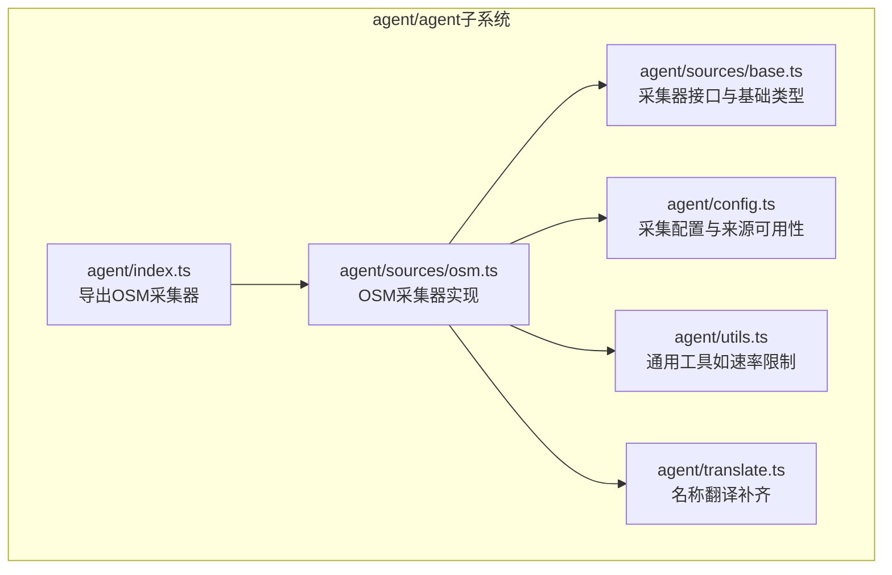
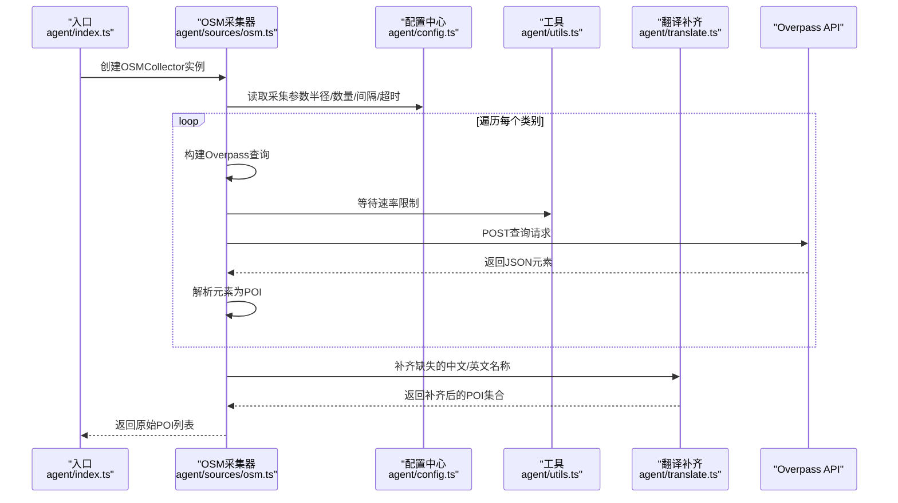
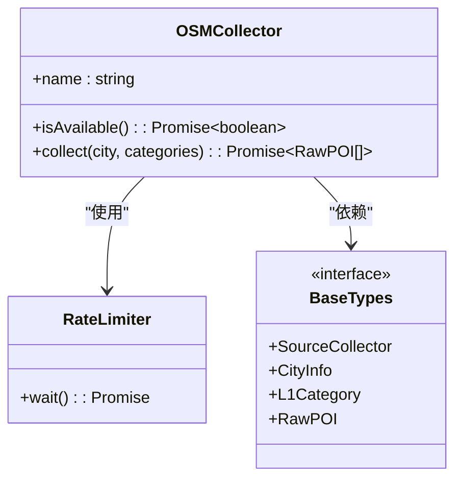
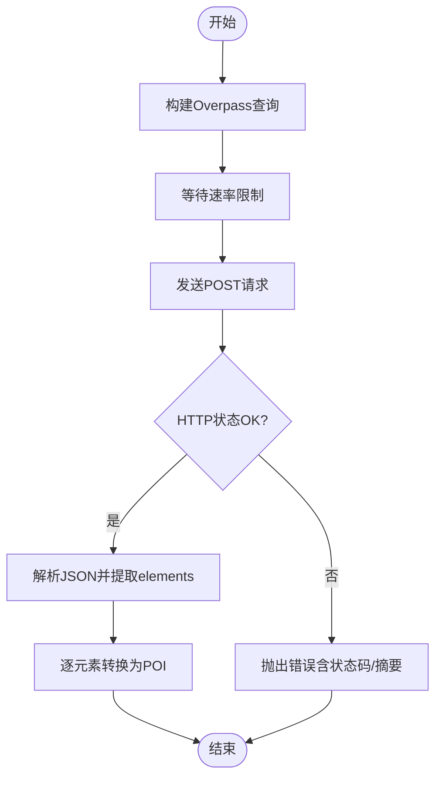
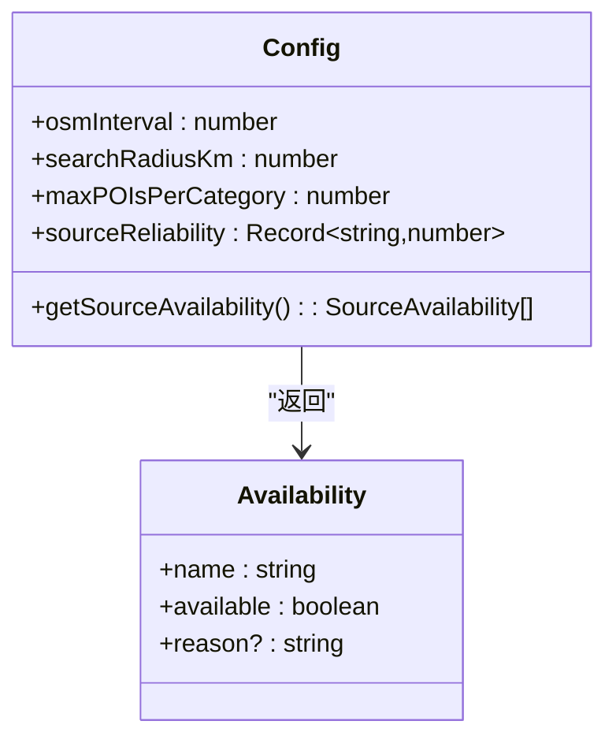
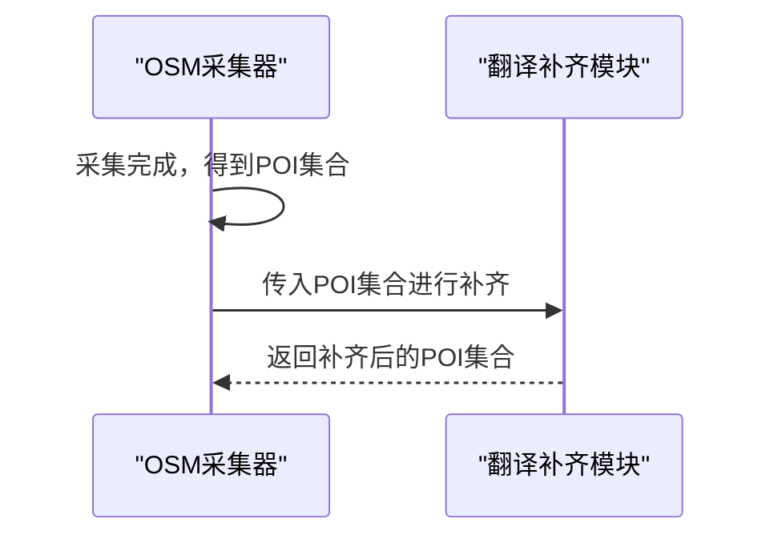
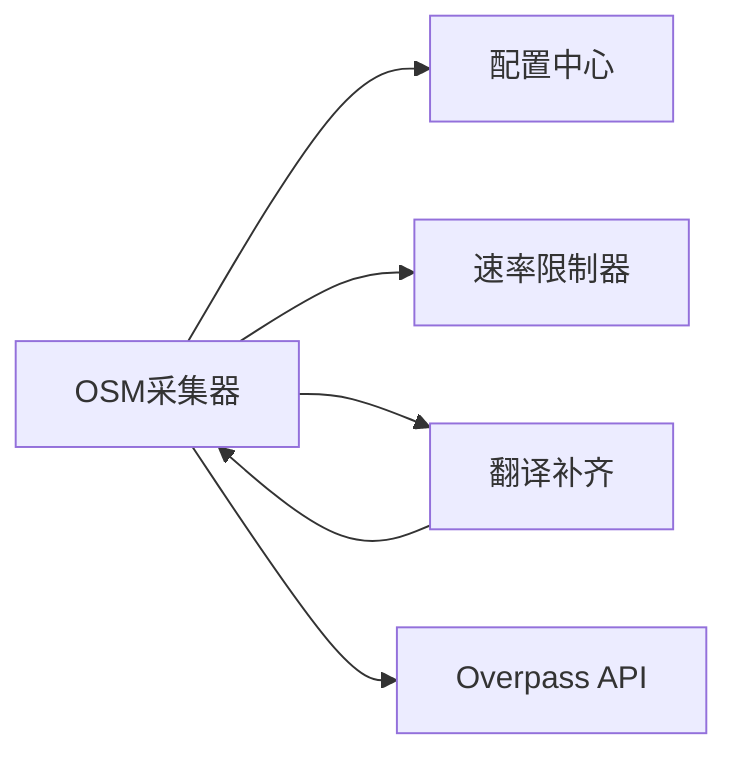

# OpenStreetMap数据源

<cite>
**本文引用的文件**
- [agent/sources/osm.ts](file://agent/sources/osm.ts)
- [agent/config.ts](file://agent/config.ts)
- [agent/sources/base.ts](file://agent/sources/base.ts)
- [agent/utils.ts](file://agent/utils.ts)
- [agent/translate.ts](file://agent/translate.ts)
- [agent/index.ts](file://agent/index.ts)
</cite>

## 目录
1. [简介](#简介)
2. [项目结构](#项目结构)
3. [核心组件](#核心组件)
4. [架构总览](#架构总览)
5. [详细组件分析](#详细组件分析)
6. [依赖关系分析](#依赖关系分析)
7. [性能考量](#性能考量)
8. [故障排查指南](#故障排查指南)
9. [结论](#结论)
10. [附录](#附录)

## 简介
本文件面向“OpenStreetMap（OSM）数据源”的开源数据集成场景，围绕Overpass API与Nominatim服务在本项目中的使用方式展开，系统梳理数据采集流程、查询构建策略、速率控制与错误处理、数据清洗与翻译补齐、以及与多源数据融合的实践要点。同时结合OSM的开源特性与社区驱动优势，给出数据质量评估与合规性建议。

## 项目结构
与OSM数据源直接相关的代码集中在 agent 子模块中，主要由以下部分组成：
- 数据采集器：负责调用Overpass API进行POI检索，并将结果转换为统一的原始POI结构
- 配置中心：集中管理采集参数、速率限制、来源权重等
- 基础类型与工具：定义采集器接口、坐标处理、通用工具函数
- 翻译补齐：对缺失的中文/英文名称进行补全
- 入口聚合：对外暴露OSM采集器实例，供调度器或任务编排使用

**图表来源**
- [agent/index.ts](file://agent/index.ts)
- [agent/sources/osm.ts](file://agent/sources/osm.ts)
- [agent/sources/base.ts](file://agent/sources/base.ts)
- [agent/config.ts](file://agent/config.ts)
- [agent/utils.ts](file://agent/utils.ts)
- [agent/translate.ts](file://agent/translate.ts)

**章节来源**
- [agent/index.ts](file://agent/index.ts)
- [agent/sources/osm.ts](file://agent/sources/osm.ts)
- [agent/sources/base.ts](file://agent/sources/base.ts)
- [agent/config.ts](file://agent/config.ts)
- [agent/utils.ts](file://agent/utils.ts)
- [agent/translate.ts](file://agent/translate.ts)

## 核心组件
- OSM采集器（OSMCollector）
  - 实现统一的数据采集接口，支持按城市与类别维度发起查询
  - 使用Overpass API执行查询，返回JSON元素列表并转换为内部POI对象
  - 对缺失的中文/英文名称进行补齐，确保多语言一致性
- Overpass查询构建器
  - 将L1类目映射为对应的查询片段，注入半径、经纬度等参数
  - 统一封装请求头、User-Agent、超时控制与响应解析
- 速率限制与超时控制
  - 基于配置的间隔时间进行限流，避免触发公平使用策略
  - 请求设置超时，异常中断并记录错误信息
- 配置中心
  - 定义采集半径、每类最大数量、重试次数、来源权重等参数
  - 提供来源可用性检测，便于运行时判断是否启用某数据源

**章节来源**
- [agent/sources/osm.ts](file://agent/sources/osm.ts)
- [agent/config.ts](file://agent/config.ts)

## 架构总览
下图展示了从入口到采集器、再到Overpass API的整体调用链路，以及与翻译补齐、配置中心的交互关系。

**图表来源**
- [agent/index.ts](file://agent/index.ts)
- [agent/sources/osm.ts](file://agent/sources/osm.ts)
- [agent/config.ts](file://agent/config.ts)
- [agent/utils.ts](file://agent/utils.ts)
- [agent/translate.ts](file://agent/translate.ts)

## 详细组件分析

### OSM采集器（OSMCollector）
- 角色与职责
  - 实现统一采集接口，负责按城市与类别发起查询
  - 负责将Overpass返回的元素转换为内部POI结构
  - 在采集完成后进行名称翻译补齐
- 关键行为
  - 可用性判定：免费且无需密钥
  - 查询构建：根据类别生成查询片段，注入半径与坐标
  - 请求发送：设置Content-Type、User-Agent、超时与中断控制
  - 错误处理：HTTP状态码异常、响应体文本截断、日志记录
- 性能与稳定性
  - 通过速率限制器控制请求频率，避免被限流
  - 设置合理超时，防止长时间阻塞
  - 对每个类别的结果进行计数统计，便于监控与调试

**图表来源**
- [agent/sources/osm.ts](file://agent/sources/osm.ts)
- [agent/utils.ts](file://agent/utils.ts)
- [agent/sources/base.ts](file://agent/sources/base.ts)

**章节来源**
- [agent/sources/osm.ts](file://agent/sources/osm.ts)

### Overpass查询构建与调用
- 查询构建
  - 将L1类目映射为Overpass查询片段，替换半径、纬度、经度等占位符
  - 统一添加超时、输出格式与结果上限
- 请求调用
  - POST方式提交查询，设置Content-Type与User-Agent
  - 使用AbortController实现可取消的请求
  - 对非OK状态码抛出带状态码与响应摘要的错误
- 结果解析
  - 从JSON中提取elements数组，若不存在则返回空数组
  - 将每个element转换为内部POI对象

**图表来源**
- [agent/sources/osm.ts](file://agent/sources/osm.ts)

**章节来源**
- [agent/sources/osm.ts](file://agent/sources/osm.ts)

### 配置中心与来源可用性
- 采集参数
  - 搜索半径、每类最大采集数、目标采集数、重试次数与延迟
  - 各数据源的请求间隔与超时配置
- 权重与可用性
  - 为不同来源分配可靠性权重
  - 提供来源可用性检测，用于运行时启用/禁用

**图表来源**
- [agent/config.ts](file://agent/config.ts)

**章节来源**
- [agent/config.ts](file://agent/config.ts)

### 翻译补齐与多语言一致性
- 目标
  - 对缺失中文/英文名称的POI进行补齐，提升多语言展示一致性
- 流程
  - 在采集完成后统一调用翻译补齐模块
  - 与采集器解耦，便于替换或扩展策略

**图表来源**
- [agent/sources/osm.ts](file://agent/sources/osm.ts)
- [agent/translate.ts](file://agent/translate.ts)

**章节来源**
- [agent/sources/osm.ts](file://agent/sources/osm.ts)
- [agent/translate.ts](file://agent/translate.ts)

### 与Nominatim服务的集成说明
- 当前实现聚焦于Overpass API的POI检索，未在OSM采集器中直接调用Nominatim
- 若需地址解析或地理编码能力，可在采集流程之外单独引入Nominatim服务，以补充坐标与地名标准化
- 建议在调用Nominatim时同样遵循速率限制与User-Agent规范，避免触发限流

[本节为概念性说明，不直接对应具体源码文件]

## 依赖关系分析
- 组件耦合
  - OSM采集器依赖配置中心（参数）、速率限制器（限流）、翻译补齐（名称补齐）
  - 与基础类型接口解耦，便于扩展其他数据源
- 外部依赖
  - Overpass API：免费、无配额限制，但需遵守公平使用策略
  - Nominatim：可选，用于地址解析与地理编码
- 潜在循环依赖
  - 采集器与工具、配置之间为单向依赖，未见循环

**图表来源**
- [agent/sources/osm.ts](file://agent/sources/osm.ts)
- [agent/config.ts](file://agent/config.ts)
- [agent/utils.ts](file://agent/utils.ts)
- [agent/translate.ts](file://agent/translate.ts)

**章节来源**
- [agent/sources/osm.ts](file://agent/sources/osm.ts)
- [agent/config.ts](file://agent/config.ts)
- [agent/utils.ts](file://agent/utils.ts)
- [agent/translate.ts](file://agent/translate.ts)

## 性能考量
- 速率限制
  - 使用固定间隔进行限流，避免频繁请求导致的限流或失败
  - 可根据Overpass节点负载动态调整间隔
- 超时与重试
  - 请求设置超时，异常时快速失败并记录
  - 配置重试次数与延迟，平衡成功率与资源消耗
- 查询优化
  - 合理设置搜索半径与每类最大数量，避免过大范围导致超时或超量
  - 优先选择高覆盖率的类别查询片段，减少无效请求
- 内存与并发
  - 控制单次采集的POI数量，避免内存峰值过高
  - 在批量城市采集时，采用串行或受控并发，避免对上游服务造成压力

[本节提供通用指导，不直接分析具体文件]

## 故障排查指南
- 常见问题与定位
  - HTTP状态码异常：检查请求URL、查询语法与超时设置
  - 响应体为空或元素缺失：确认类别映射与查询片段是否正确
  - 速率限制导致失败：增大osmInterval或降低并发
  - 名称缺失：确认翻译补齐流程是否执行
- 日志与可观测性
  - 采集器在每个类别查询前后打印日志，便于定位耗时与失败点
  - 记录错误摘要，避免输出完整响应体带来的日志膨胀
- 快速修复建议
  - 缩小搜索半径或减少每类最大数量
  - 临时提高osmInterval，观察是否恢复
  - 检查网络连通性与代理设置

**章节来源**
- [agent/sources/osm.ts](file://agent/sources/osm.ts)
- [agent/config.ts](file://agent/config.ts)

## 结论
本项目通过OSM采集器实现了对Overpass API的稳定集成，具备良好的可维护性与扩展性。配合配置中心与速率限制机制，能够在保证服务质量的前提下高效获取全球城市的POI数据。建议在后续迭代中：
- 明确Nominatim的使用边界与调用时机，避免与Overpass查询耦合过深
- 引入更细粒度的错误分类与重试策略，提升鲁棒性
- 增强对OSM标签体系的解析与映射规则，进一步提升数据质量与一致性

[本节为总结性内容，不直接分析具体文件]

## 附录

### OSM数据格式与标签系统理解（实践建议）
- 标签解析
  - 优先解析name、name:zh、operator、brand等常用标签
  - 对缺失中文名的实体，结合翻译补齐模块进行补全
- 映射规则
  - 将OSM标签映射到内部L1/L2类别，确保与业务语义一致
  - 对模糊或冲突标签，保留原始标签并打上置信度标记
- 质量评估
  - 基于坐标精度、标签完整性、重复度与来源权重进行综合评分
  - 与高可靠来源（如官方地图或权威数据）交叉验证

[本节为概念性说明，不直接对应具体源码文件]

### 开源数据处理最佳实践与合规性
- 最佳实践
  - 明确数据来源与使用范围，避免超出许可范围的商业用途
  - 对采集到的数据进行去重与一致性处理，提升整体质量
  - 保持查询与解析逻辑的可审计性，便于追踪数据来源
- 合规性
  - 遵循OSM开放数据库许可证（ODbL）要求，标注来源并公开衍生数据
  - 在产品中展示数据来源与致谢，满足许可条款
  - 对外发布或分发数据时，确保符合ODbL的再许可与共享义务

[本节为概念性说明，不直接对应具体源码文件]