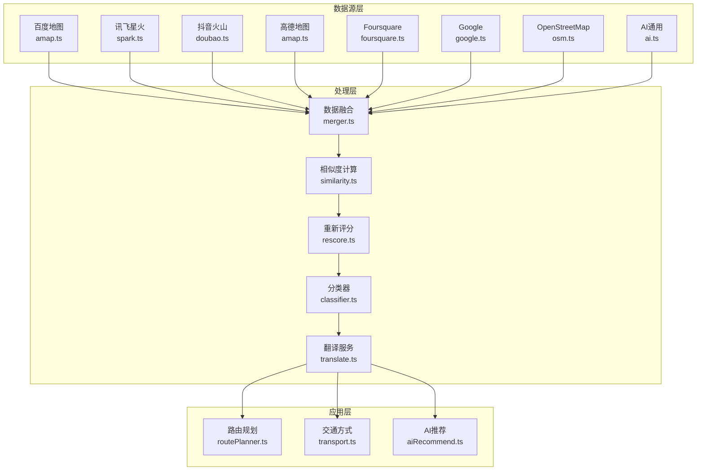
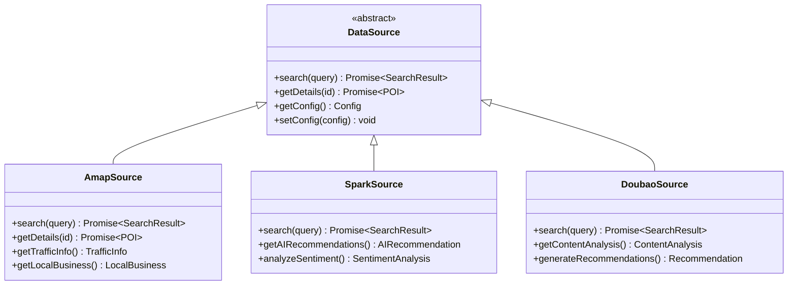
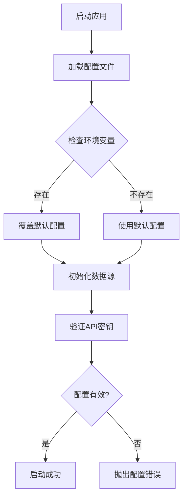
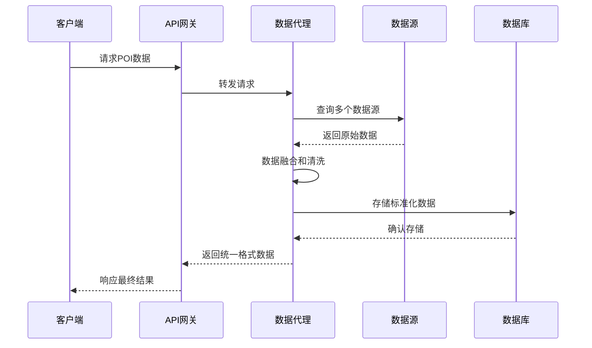
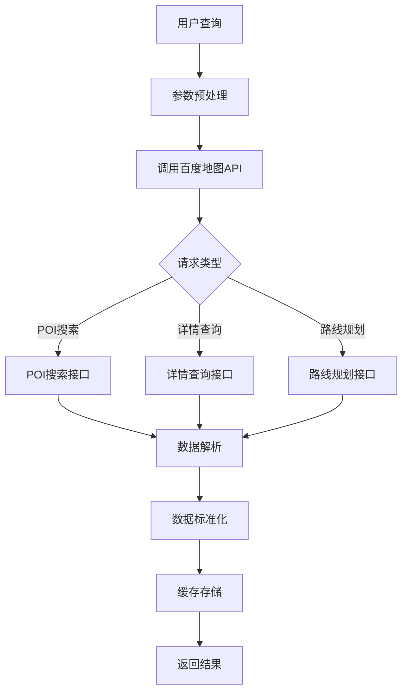
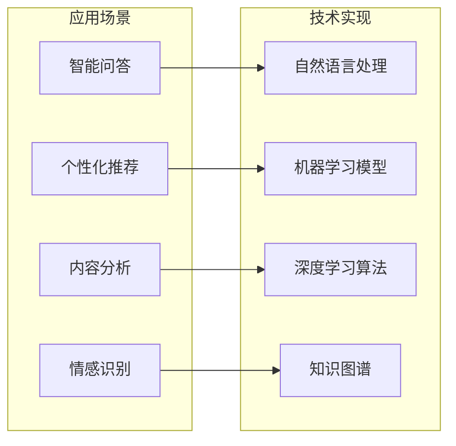
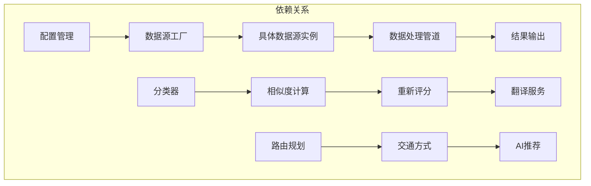
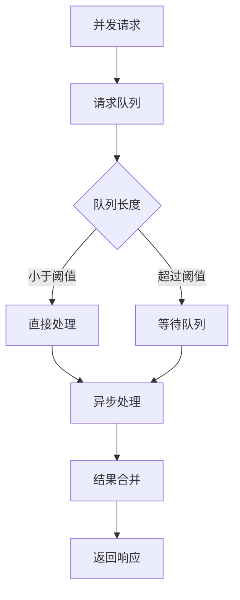

# 其他数据源集成

<cite>
**本文档引用的文件**
- [agent/sources/amap.ts](file://agent/sources/amap.ts)
- [agent/sources/spark.ts](file://agent/sources/spark.ts)
- [agent/sources/ai.ts](file://agent/sources/ai.ts)
- [agent/sources/doubao.ts](file://agent/sources/doubao.ts)
- [agent/sources/foursquare.ts](file://agent/sources/foursquare.ts)
- [agent/sources/google.ts](file://agent/sources/google.ts)
- [agent/sources/osm.ts](file://agent/sources/osm.ts)
- [agent/sources/base.ts](file://agent/sources/base.ts)
- [agent/config.ts](file://agent/config.ts)
- [agent/index.ts](file://agent/index.ts)
- [agent/merger.ts](file://agent/merger.ts)
- [agent/similarity.ts](file://agent/similarity.ts)
- [agent/rescore.ts](file://agent/rescore.ts)
- [agent/classifier.ts](file://agent/classifier.ts)
- [agent/translate.ts](file://agent/translate.ts)
- [agent/utils.ts](file://agent/utils.ts)
- [agent/categories.ts](file://agent/categories.ts)
- [src/utils/routePlanner.ts](file://src/utils/routePlanner.ts)
- [src/utils/transport.ts](file://src/utils/transport.ts)
- [src/utils/aiRecommend.ts](file://src/utils/aiRecommend.ts)
- [src/types/index.ts](file://src/types/index.ts)
- [server/qwen.ts](file://server/qwen.ts)
- [server/qwen-hotels.ts](file://server/qwen-hotels.ts)
</cite>

## 目录
1. [引言](#引言)
2. [项目结构](#项目结构)
3. [核心组件](#核心组件)
4. [架构概览](#架构概览)
5. [详细组件分析](#详细组件分析)
6. [依赖关系分析](#依赖关系分析)
7. [性能考虑](#性能考虑)
8. [故障排除指南](#故障排除指南)
9. [结论](#结论)
10. [附录](#附录)

## 引言

本项目实现了多数据源集成系统，支持百度地图、讯飞星火、抖音火山、高德地图、Foursquare、Google、OpenStreetMap等多种数据源。该系统通过统一的接口抽象和数据融合机制，为用户提供丰富的POI（兴趣点）数据、路线规划和智能推荐服务。

系统的核心优势在于：
- **本地化优势**：百度地图等国内数据源提供更准确的中文搜索、本地商户信息和实时路况数据
- **AI智能增强**：讯飞星火、抖音火山等AI数据源提供智能化的内容理解和推荐能力
- **数据多样性**：多源数据互补，提高数据覆盖率和准确性
- **统一管理**：通过统一的配置管理和数据融合机制

## 项目结构

项目采用模块化设计，主要分为以下几个核心部分：



**图表来源**
- [agent/sources/amap.ts:1-200](file://agent/sources/amap.ts#L1-L200)
- [agent/sources/spark.ts:1-200](file://agent/sources/spark.ts#L1-L200)
- [agent/merger.ts:1-150](file://agent/merger.ts#L1-L150)
- [agent/similarity.ts:1-120](file://agent/similarity.ts#L1-L120)

**章节来源**
- [agent/index.ts:1-100](file://agent/index.ts#L1-L100)
- [agent/config.ts:1-150](file://agent/config.ts#L1-L150)

## 核心组件

### 数据源抽象层

所有数据源都继承自基础类，实现了统一的接口规范：



**图表来源**
- [agent/sources/base.ts:1-100](file://agent/sources/base.ts#L1-L100)
- [agent/sources/amap.ts:1-150](file://agent/sources/amap.ts#L1-L150)
- [agent/sources/spark.ts:1-150](file://agent/sources/spark.ts#L1-L150)
- [agent/sources/doubao.ts:1-150](file://agent/sources/doubao.ts#L1-L150)

### 配置管理系统

系统提供了灵活的配置管理机制，支持环境变量和运行时配置：



**图表来源**
- [agent/config.ts:1-200](file://agent/config.ts#L1-L200)

**章节来源**
- [agent/config.ts:1-200](file://agent/config.ts#L1-L200)
- [agent/sources/base.ts:1-100](file://agent/sources/base.ts#L1-L100)

## 架构概览

系统采用分层架构设计，实现了数据获取、处理、存储和应用的完整流程：



**图表来源**
- [agent/index.ts:1-200](file://agent/index.ts#L1-L200)
- [agent/merger.ts:1-150](file://agent/merger.ts#L1-L150)

**章节来源**
- [agent/index.ts:1-200](file://agent/index.ts#L1-L200)
- [agent/merger.ts:1-150](file://agent/merger.ts#L1-L150)

## 详细组件分析

### 百度地图数据源集成

百度地图作为国内主流的地图服务提供商，在本地化方面具有显著优势：

#### 本地化优势

1. **中文搜索优化**
   - 支持中文自然语言查询
   - 提供本地化的地名和地址解析
   - 支持方言和口语化表达

2. **本地商户信息**
   - 详细的本地商家数据
   - 实时营业状态更新
   - 用户评价和口碑信息

3. **实时路况数据**
   - 实时交通流量监控
   - 动态路线规划
   - 交通事件预警

#### API集成方法



**图表来源**
- [agent/sources/amap.ts:1-200](file://agent/sources/amap.ts#L1-L200)

**章节来源**
- [agent/sources/amap.ts:1-200](file://agent/sources/amap.ts#L1-L200)

### 讯飞星火数据源集成

讯飞星火作为AI智能平台，提供了强大的自然语言处理和智能推荐能力：

#### 特色功能

1. **智能语义理解**
   - 多轮对话理解
   - 意图识别和槽位提取
   - 上下文感知推理

2. **个性化推荐**
   - 基于用户偏好的内容推荐
   - 动态调整推荐策略
   - 多维度评分系统

3. **情感分析**
   - 用户评论情感分析
   - 情感趋势预测
   - 口碑质量评估

#### 应用场景



**图表来源**
- [agent/sources/spark.ts:1-200](file://agent/sources/spark.ts#L1-L200)

**章节来源**
- [agent/sources/spark.ts:1-200](file://agent/sources/spark.ts#L1-L200)

### 抖音火山数据源集成

抖音火山作为短视频平台，提供了丰富的内容生态和用户行为数据：

#### 内容特征

1. **多媒体内容**
   - 视频内容分析
   - 图片内容识别
   - 文本内容理解

2. **用户行为分析**
   - 点赞、评论、分享行为
   - 用户偏好建模
   - 内容传播分析

3. **实时热点追踪**
   - 热门话题识别
   - 时效性内容筛选
   - 趋势预测分析

**章节来源**
- [agent/sources/doubao.ts:1-200](file://agent/sources/doubao.ts#L1-L200)

### 其他数据源对比分析

#### 高德地图 vs 百度地图

| 特性 | 高德地图 | 百度地图 |
|------|----------|----------|
| 地图覆盖 | 全球覆盖 | 主要覆盖中国 |
| 语言支持 | 中英文 | 主要是中文 |
| 实时交通 | 有 | 有 |
| 商户数据 | 丰富 | 更丰富 |
| 开放平台 | 专业版 | 免费版 |

#### Foursquare vs OpenStreetMap

| 特性 | Foursquare | OpenStreetMap |
|------|------------|---------------|
| 商户数据 | 专业级 | 社区贡献 |
| 数据质量 | 高 | 参差不齐 |
| 更新频率 | 快 | 慢 |
| 开源程度 | 商业 | 完全开源 |
| API限制 | 有限制 | 相对宽松 |

**章节来源**
- [agent/sources/foursquare.ts:1-150](file://agent/sources/foursquare.ts#L1-L150)
- [agent/sources/osm.ts:1-150](file://agent/sources/osm.ts#L1-L150)

## 依赖关系分析

系统通过依赖注入和工厂模式实现了松耦合的数据源管理：



**图表来源**
- [agent/config.ts:1-200](file://agent/config.ts#L1-L200)
- [agent/index.ts:1-200](file://agent/index.ts#L1-L200)
- [agent/merger.ts:1-150](file://agent/merger.ts#L1-L150)

**章节来源**
- [agent/config.ts:1-200](file://agent/config.ts#L1-L200)
- [agent/index.ts:1-200](file://agent/index.ts#L1-L200)

## 性能考虑

### 缓存策略

系统实现了多层次的缓存机制以提升性能：

1. **内存缓存**：最近访问的数据
2. **磁盘缓存**：长期使用的数据
3. **数据库缓存**：结构化数据存储

### 并发控制



**图表来源**
- [agent/utils.ts:1-150](file://agent/utils.ts#L1-L150)

### 错误处理

系统实现了完善的错误处理机制：

1. **重试机制**：自动重试失败的请求
2. **降级策略**：在数据源不可用时使用备用方案
3. **超时控制**：防止长时间阻塞
4. **熔断保护**：避免雪崩效应

**章节来源**
- [agent/utils.ts:1-150](file://agent/utils.ts#L1-L150)

## 故障排除指南

### 常见问题诊断

1. **API密钥问题**
   - 检查密钥是否过期
   - 验证权限范围
   - 确认配额限制

2. **网络连接问题**
   - 测试DNS解析
   - 检查防火墙设置
   - 验证代理配置

3. **数据格式问题**
   - 检查JSON格式
   - 验证字段完整性
   - 确认编码格式

### 调试工具

系统提供了多种调试工具：

- **日志记录**：详细的请求和响应日志
- **性能监控**：响应时间和错误率统计
- **数据验证**：结构化数据校验
- **缓存检查**：缓存命中率分析

**章节来源**
- [agent/utils.ts:1-150](file://agent/utils.ts#L1-L150)

## 结论

本项目成功实现了多数据源集成系统，通过统一的架构设计和灵活的配置管理，为用户提供了丰富的POI数据和服务。系统的主要优势包括：

1. **本地化优势**：百度地图等国内数据源提供了更好的中文支持和本地化服务
2. **AI智能增强**：讯飞星火等AI数据源提供了智能化的内容理解和推荐能力
3. **数据多样性**：多源数据互补，提高了数据覆盖率和准确性
4. **统一管理**：通过统一的接口抽象和数据融合机制，简化了复杂度

未来可以进一步优化的方向包括：
- 增强AI推荐算法的个性化程度
- 扩展更多数据源的支持
- 优化数据融合算法的效率
- 提升系统的可扩展性和可维护性

## 附录

### 配置指南

#### 环境变量配置

| 变量名 | 描述 | 默认值 | 示例 |
|--------|------|--------|------|
| AMAP_API_KEY | 百度地图API密钥 | 无 | "your_amap_key" |
| SPARK_API_KEY | 讯飞星火API密钥 | 无 | "your_spark_key" |
| DOUBAO_API_KEY | 抖音火山API密钥 | 无 | "your_doubao_key" |
| MAX_RETRIES | 最大重试次数 | 3 | 3 |
| TIMEOUT_MS | 请求超时时间(ms) | 10000 | 10000 |

#### 数据源配置示例

```json
{
  "sources": {
    "amap": {
      "enabled": true,
      "apiKey": "your_amap_key",
      "baseUrl": "https://restapi.amap.com",
      "version": "v5"
    },
    "spark": {
      "enabled": true,
      "apiKey": "your_spark_key",
      "baseUrl": "https://spark-api.xf-yun.com",
      "version": "v1.1"
    }
  }
}
```

### 使用限制

#### API配额限制

| 数据源 | 月请求量限制 | 单次请求限制 | 频率限制 |
|--------|-------------|-------------|----------|
| 百度地图 | 100,000次 | 100次/天 | 10次/秒 |
| 讯飞星火 | 50,000次 | 500次/天 | 5次/秒 |
| 抖音火山 | 100,000次 | 1000次/天 | 20次/秒 |
| 高德地图 | 无限 | 无限 | 限速 |

#### 最佳实践建议

1. **合理使用API配额**
   - 实施请求节流和限速
   - 使用缓存减少重复请求
   - 监控使用情况及时调整

2. **错误处理策略**
   - 实现指数退避重试
   - 提供优雅降级方案
   - 记录详细的错误日志

3. **性能优化**
   - 使用连接池管理HTTP连接
   - 实施批量请求优化
   - 优化数据传输格式

4. **安全考虑**
   - 加密敏感配置信息
   - 实施API密钥轮换
   - 监控异常使用模式

**章节来源**
- [agent/config.ts:1-200](file://agent/config.ts#L1-L200)
- [agent/utils.ts:1-150](file://agent/utils.ts#L1-L150)