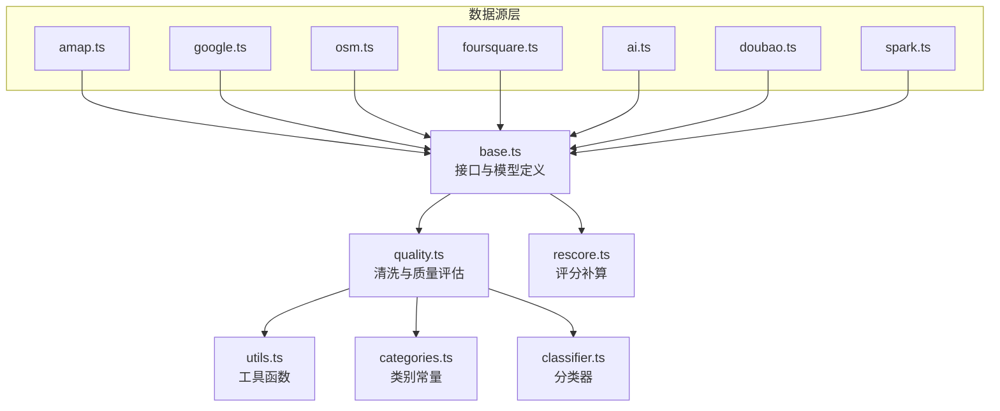
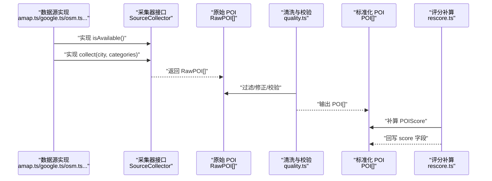
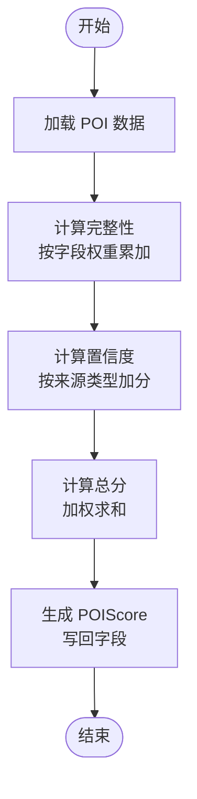
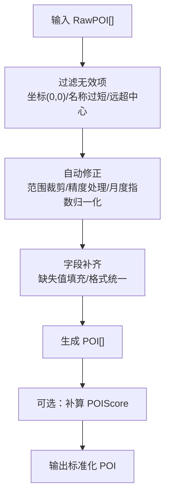
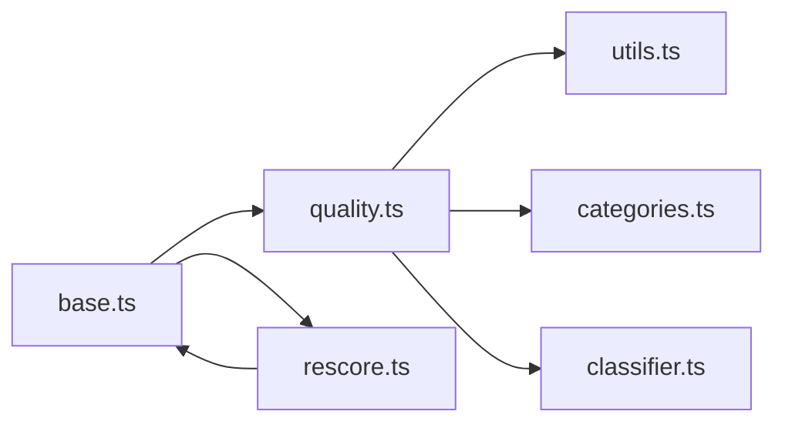

# 基础数据源接口

<cite>
**本文引用的文件**
- [agent/sources/base.ts](file://agent/sources/base.ts)
- [agent/quality.ts](file://agent/quality.ts)
- [agent/rescore.ts](file://agent/rescore.ts)
- [agent/utils.ts](file://agent/utils.ts)
- [agent/categories.ts](file://agent/categories.ts)
- [agent/classifier.ts](file://agent/classifier.ts)
- [agent/sources/amap.ts](file://agent/sources/amap.ts)
- [agent/sources/google.ts](file://agent/sources/google.ts)
- [agent/sources/osm.ts](file://agent/sources/osm.ts)
- [agent/sources/foursquare.ts](file://agent/sources/foursquare.ts)
- [agent/sources/ai.ts](file://agent/sources/ai.ts)
- [agent/sources/doubao.ts](file://agent/sources/doubao.ts)
- [agent/sources/spark.ts](file://agent/sources/spark.ts)
</cite>

## 目录
1. [引言](#引言)
2. [项目结构](#项目结构)
3. [核心组件](#核心组件)
4. [架构总览](#架构总览)
5. [详细组件分析](#详细组件分析)
6. [依赖分析](#依赖分析)
7. [性能考虑](#性能考虑)
8. [故障排查指南](#故障排查指南)
9. [结论](#结论)
10. [附录](#附录)

## 引言
本技术文档围绕“基础数据源接口”展开，聚焦以下目标：
- 解释 BaseSource 基类的设计理念与抽象接口定义
- 详解 SourceCollector 接口的核心方法 isAvailable() 与 collect() 的实现要求
- 说明 RawPOI 与 POI 数据模型的字段定义、数据类型与业务含义
- 解释数据评分系统 POIScore 的设计思路与计算逻辑（完整性、置信度等）
- 提供数据标准化流程的技术细节（坐标精度、字段映射、格式统一）
- 给出自定义数据源实现与扩展新字段的实践路径

## 项目结构
本项目的数据采集与质量体系主要位于 agent 目录，其中：
- agent/sources/base.ts 定义了数据模型、采集器接口与通用工具
- agent/quality.ts 实现了数据清洗、校验与城市级质量评估
- agent/rescore.ts 提供已有 POI 的评分补算脚本
- agent/utils.ts、agent/categories.ts、agent/classifier.ts 提供辅助能力（距离计算、类别常量、分类器）

图表来源
- [agent/sources/base.ts:89-100](file://agent/sources/base.ts#L89-L100)
- [agent/quality.ts:1-344](file://agent/quality.ts#L1-L344)
- [agent/rescore.ts:1-158](file://agent/rescore.ts#L1-L158)
- [agent/utils.ts](file://agent/utils.ts)
- [agent/categories.ts](file://agent/categories.ts)
- [agent/classifier.ts](file://agent/classifier.ts)

章节来源
- [agent/sources/base.ts:1-252](file://agent/sources/base.ts#L1-L252)
- [agent/quality.ts:1-344](file://agent/quality.ts#L1-L344)
- [agent/rescore.ts:1-158](file://agent/rescore.ts#L1-L158)

## 核心组件
- 数据采集器接口 SourceCollector：定义数据源可用性检测与采集行为
- 原始 POI 数据模型 RawPOI：面向采集器输出的统一结构
- POI 数据模型 POI：面向最终存储与展示的标准化结构
- 数据评分 POIScore：综合完整性、置信度等维度的评分结果
- 城市级质量评估 QualityReport：基于 POI 的完整性、准确性、丰富度、多样性进行城市级评估

章节来源
- [agent/sources/base.ts:89-177](file://agent/sources/base.ts#L89-L177)
- [agent/quality.ts:171-293](file://agent/quality.ts#L171-L293)

## 架构总览
下图展示了从数据源采集到质量评估的整体流程。

图表来源
- [agent/sources/base.ts:89-100](file://agent/sources/base.ts#L89-L100)
- [agent/quality.ts:189-293](file://agent/quality.ts#L189-L293)
- [agent/rescore.ts:63-85](file://agent/rescore.ts#L63-L85)

## 详细组件分析

### BaseSource 基类与 SourceCollector 接口
- 设计理念
  - 通过统一接口约束不同数据源的实现，确保 isAvailable() 与 collect() 的一致性
  - 以 RawPOI 作为采集器输出的最小共识，便于后续清洗与标准化
  - 通过 CityInfo 传递上下文（城市中心坐标、国家/地区等），用于地理合理性校验
- 接口方法要求
  - isAvailable()：返回 Promise<boolean>，用于在运行前检测 API Key、配额、网络连通性等
  - collect(city, categories)：返回 Promise<RawPOI[]>，按 L1 类目集合筛选采集，避免无关类目污染
- 扩展建议
  - 在实现中优先使用 CityInfo 的经纬度进行地理范围限制
  - 对返回的 RawPOI 进行字段清洗（去空白、长度校验、数值范围校验）

章节来源
- [agent/sources/base.ts:89-100](file://agent/sources/base.ts#L89-L100)
- [agent/sources/base.ts:14-25](file://agent/sources/base.ts#L14-L25)

### RawPOI 数据模型
- 字段与类型
  - 名称系列：namePrimary（必填）、nameZh、nameEn
  - 类目系列：categoryL1（必填）、categoryL3（必填）
  - 地址系列：address（必填）、addressEn
  - 坐标：lat/lng（WGS-84，四舍五入到 4 位小数）
  - 评分与消费：rating（1-5）、cost（≥0）
  - 访问时长：visitDuration（分钟）
  - 其他：description、tags[]、operatingHours、bestSeasons[]、monthlyIndex[]（12 个月）
  - 来源：source（必填）、sourceId
- 业务含义
  - RawPOI 是采集器的“最小可用结构”，用于跨源聚合与冲突消解
  - 字段覆盖越完整，后续评分与质量评估越可靠
- 标准化要点
  - 坐标精度统一为 4 位小数
  - 缺失字段使用空值占位，避免误判为“有值但错误”

章节来源
- [agent/sources/base.ts:42-87](file://agent/sources/base.ts#L42-L87)

### POI 数据模型
- 字段与类型
  - 标识：id（唯一）
  - 名称系列：namePrimary、nameZh、nameEn
  - 类目系列：categoryL1、categoryL2、categoryL3
  - 地址系列：address、addressEn
  - 坐标：lat/lng（WGS-84，4 位小数）
  - 评分与消费：rating（1-5）、cost、visitDuration
  - 其他：description、tags[]、operatingHours、recommendReason、experienceItems[]（体验类目）
  - 季节与指数：bestSeasons[]、monthlyIndex[]（12 个月）
  - 质量评分：score（POIScore）
- 业务含义
  - POI 是最终入库与前端展示的标准结构，字段更丰富，适合直接消费
- 标准化要点
  - 由清洗模块完成字段补齐与修正
  - 保持与 RawPOI 的映射关系清晰

章节来源
- [agent/sources/base.ts:121-177](file://agent/sources/base.ts#L121-L177)

### POIScore 评分系统
- 设计思路
  - 综合完整性与置信度，兼顾来源数量与冲突情况
  - 通过权重因子平衡两类指标，形成总分 0-100
- 指标定义
  - total：综合得分（0-100）
  - completeness：完整性（0-100），衡量字段填充程度
  - confidence：置信度（0-100），反映来源权威性与历史稳定性
  - sourceCount：来源数量
  - sources：来源名称列表
  - conflictCount：冲突字段数
- 计算逻辑（来自 rescore.ts）
  - 完整度：按字段权重累加已填充字段，除以最大权重后乘 100
  - 置信度：根据来源类型给予基础分与加分（例如 osm/google 等）
  - 总分：completeness_weight × completeness + confidence_weight × confidence

图表来源
- [agent/rescore.ts:32-85](file://agent/rescore.ts#L32-L85)

章节来源
- [agent/sources/base.ts:104-117](file://agent/sources/base.ts#L104-L117)
- [agent/rescore.ts:18-85](file://agent/rescore.ts#L18-L85)

### 数据标准化流程
- 坐标精度处理
  - 统一四舍五入到 4 位小数，避免过高的噪声
  - 通过 roundCoord 或内部工具函数保证一致性
- 字段映射与格式统一
  - RawPOI → POI：名称三语、地址双语、标签数组、时长与评分范围校正
  - 月度指数：不足 12 个或越界时进行归一化与截断
- 合法性校验与自动修正
  - 坐标有效性与距离城市中心的合理性
  - 名称长度与纯数字校验
  - 评分、费用、访问时长范围校验
  - 类目一致性检查（结合分类器）

图表来源
- [agent/quality.ts:158-302](file://agent/quality.ts#L158-L302)
- [agent/rescore.ts:63-85](file://agent/rescore.ts#L63-L85)

章节来源
- [agent/quality.ts:23-145](file://agent/quality.ts#L23-L145)
- [agent/quality.ts:158-302](file://agent/quality.ts#L158-L302)
- [agent/sources/base.ts:244-247](file://agent/sources/base.ts#L244-L247)

### 城市级质量评估（QualityReport）
- 维度说明
  - 完整性：字段填充比例加权平均
  - 准确性：错误项占比反比
  - 丰富度：描述长度、标签数量、三名齐全、双语地址等复合指标
  - 多样性：六大类目分布均衡度
- 输出结构
  - overallScore：综合评分（0-100）
  - dimensions：各维度得分
  - issues：问题清单（含严重级别与是否可自动修复）
  - 统计：总数、丢弃数、修复数、按类目统计

章节来源
- [agent/quality.ts:171-293](file://agent/quality.ts#L171-L293)

### 自定义数据源实现指南
- 步骤
  - 新建文件：agent/sources/<your_source>.ts
  - 导出实现类，满足 SourceCollector 接口
  - 实现 isAvailable()：检查密钥、配额、网络状态
  - 实现 collect(city, categories)：按 L1 类目过滤，返回 RawPOI[]
  - 使用 CityInfo 的经纬度做地理范围限制
  - 返回的 RawPOI 应尽量填充关键字段，减少后续清洗成本
- 示例参考
  - 高德地图：agent/sources/amap.ts
  - Google Places：agent/sources/google.ts
  - OSM：agent/sources/osm.ts
  - Foursquare：agent/sources/foursquare.ts
  - AI/多模态：agent/sources/ai.ts、agent/sources/doubao.ts、agent/sources/spark.ts

章节来源
- [agent/sources/base.ts:89-100](file://agent/sources/base.ts#L89-L100)
- [agent/sources/amap.ts](file://agent/sources/amap.ts)
- [agent/sources/google.ts](file://agent/sources/google.ts)
- [agent/sources/osm.ts](file://agent/sources/osm.ts)
- [agent/sources/foursquare.ts](file://agent/sources/foursquare.ts)
- [agent/sources/ai.ts](file://agent/sources/ai.ts)
- [agent/sources/doubao.ts](file://agent/sources/doubao.ts)
- [agent/sources/spark.ts](file://agent/sources/spark.ts)

### 扩展新字段的实践
- 新增字段建议
  - 优先在 RawPOI 中预留占位字段，便于跨源统一
  - 在清洗阶段完成字段映射与默认值设置
  - 在评分权重中为新字段分配合理权重，避免过度倾斜
- 与分类器协作
  - 使用分类器对类目进行一致性检查，降低 L1 分类偏差
- 与质量评估联动
  - 在 QualityReport 的丰富度与完整性维度中体现新字段的价值

章节来源
- [agent/quality.ts:210-271](file://agent/quality.ts#L210-L271)
- [agent/classifier.ts](file://agent/classifier.ts)

## 依赖分析
- 组件耦合
  - SourceCollector 仅依赖 CityInfo 与 L1Category，低耦合
  - RawPOI/POI 依赖 categories.ts 的类别常量
  - quality.ts 依赖 utils.ts（距离计算）、classifier.ts（类目分类）、categories.ts（类别枚举）
  - rescore.ts 依赖本地数据库与评分配置
- 外部依赖
  - better-sqlite3（rescore.ts 用于读写 agent.db）
  - Unsplash 图片 URL（base.ts 提供图片占位）

图表来源
- [agent/sources/base.ts:1-252](file://agent/sources/base.ts#L1-L252)
- [agent/quality.ts:1-344](file://agent/quality.ts#L1-L344)
- [agent/rescore.ts:1-158](file://agent/rescore.ts#L1-L158)

章节来源
- [agent/sources/base.ts:8-11](file://agent/sources/base.ts#L8-L11)
- [agent/quality.ts:8-11](file://agent/quality.ts#L8-L11)
- [agent/rescore.ts:11-16](file://agent/rescore.ts#L11-L16)

## 性能考虑
- 采集阶段
  - 使用 CityInfo 的经纬度进行地理范围限制，减少无效请求
  - 并发控制与重试策略，避免触发限流
- 清洗阶段
  - 批量处理 POI，避免重复计算（如月度指数归一化）
  - 对字符串长度与正则匹配进行必要优化
- 评分阶段
  - 评分权重与因子可缓存，避免重复计算
  - 对大规模城市数据采用分页或增量处理

## 故障排查指南
- 常见问题与定位
  - 坐标异常：(0,0) 或超出城市中心 50/100km；检查采集器地理范围与清洗逻辑
  - 名称异常：过短或纯数字；检查采集器文本清洗与分类器一致性
  - 评分/费用/时长越界：使用自动修正函数进行裁剪
  - 月度指数异常：长度不为 12 或越界，进行归一化与截断
- 工具与入口
  - 坐标精度：roundCoord（四舍五入到 4 位小数）
  - 距离计算：haversineDistance（quality.ts 依赖）
  - 类目一致性：classifyCategory（quality.ts 依赖 classifier.ts）

章节来源
- [agent/quality.ts:23-169](file://agent/quality.ts#L23-L169)
- [agent/utils.ts](file://agent/utils.ts)
- [agent/sources/base.ts:244-247](file://agent/sources/base.ts#L244-L247)

## 结论
本方案通过统一的采集器接口、标准化的数据模型与完善的清洗评分体系，实现了多源 POI 数据的高质量融合。遵循本文规范，开发者可以快速接入新数据源，并在保证数据质量的前提下扩展字段与提升评分的准确性。

## 附录
- 关键函数与文件索引
  - SourceCollector 接口定义：[agent/sources/base.ts:89-100](file://agent/sources/base.ts#L89-L100)
  - RawPOI/POI/POIScore 定义：[agent/sources/base.ts:42-177](file://agent/sources/base.ts#L42-L177)
  - 坐标精度处理：[agent/sources/base.ts:244-247](file://agent/sources/base.ts#L244-L247)
  - 数据清洗与质量评估：[agent/quality.ts:189-293](file://agent/quality.ts#L189-L293)
  - 评分补算：[agent/rescore.ts:63-85](file://agent/rescore.ts#L63-L85)
  - 类目常量与分类器：[agent/categories.ts](file://agent/categories.ts)、[agent/classifier.ts](file://agent/classifier.ts)
  - 工具函数（距离计算）：[agent/utils.ts](file://agent/utils.ts)