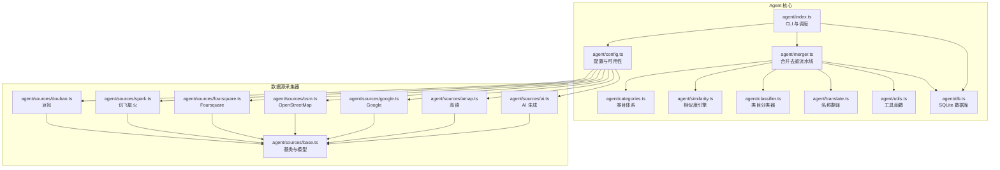
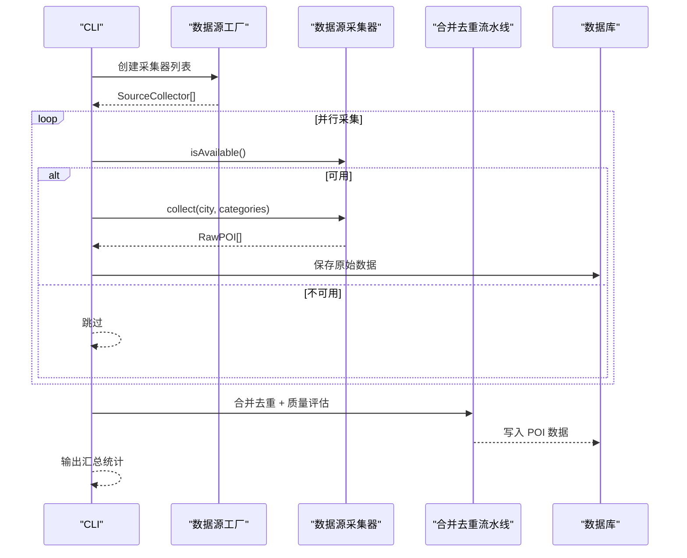
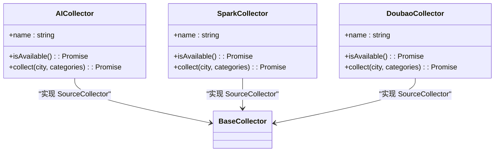
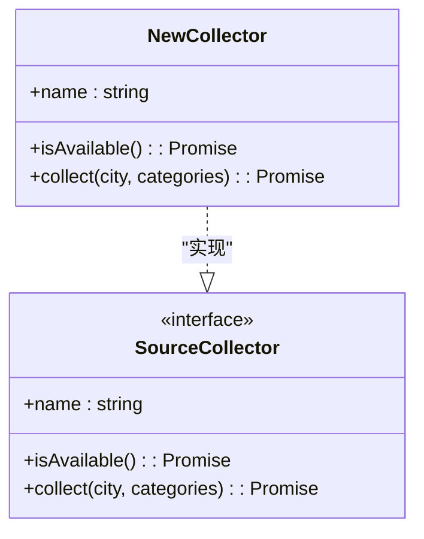
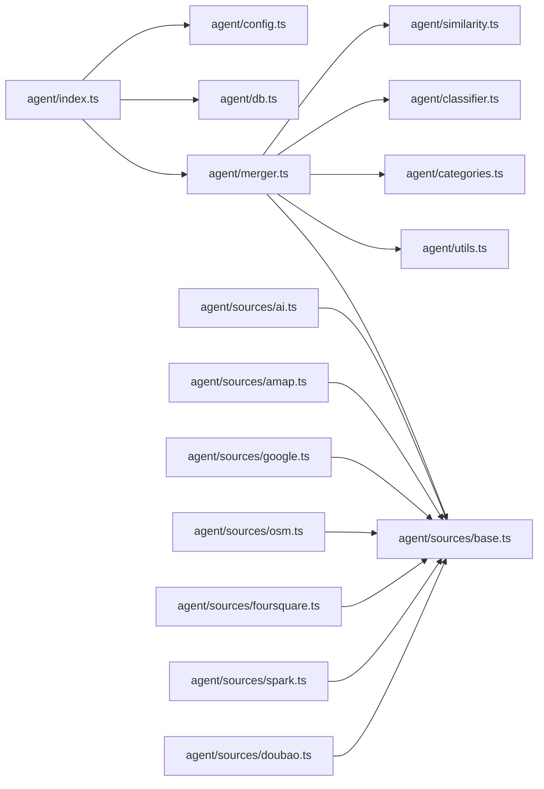

# 多源数据集成

<cite>
**本文引用的文件**
- [agent/index.ts](file://agent/index.ts)
- [agent/sources/base.ts](file://agent/sources/base.ts)
- [agent/sources/ai.ts](file://agent/sources/ai.ts)
- [agent/sources/amap.ts](file://agent/sources/amap.ts)
- [agent/sources/google.ts](file://agent/sources/google.ts)
- [agent/sources/osm.ts](file://agent/sources/osm.ts)
- [agent/sources/foursquare.ts](file://agent/sources/foursquare.ts)
- [agent/sources/spark.ts](file://agent/sources/spark.ts)
- [agent/sources/doubao.ts](file://agent/sources/doubao.ts)
- [agent/config.ts](file://agent/config.ts)
- [agent/categories.ts](file://agent/categories.ts)
- [agent/merger.ts](file://agent/merger.ts)
- [agent/similarity.ts](file://agent/similarity.ts)
- [agent/classifier.ts](file://agent/classifier.ts)
- [agent/translate.ts](file://agent/translate.ts)
- [agent/utils.ts](file://agent/utils.ts)
- [agent/db.ts](file://agent/db.ts)
</cite>

## 更新摘要
**所做更改**
- 更新了Spark数据源的正式集成部分，包括新的数据格式兼容性和归一化处理
- 增强了AI数据源架构的说明，突出Spark与现有AI系统的协同工作
- 完善了数据标准化流程，增加了Spark特有的JSON格式修复机制
- 更新了数据源权重配置，反映了Spark在AI数据源中的地位

## 目录
1. [引言](#引言)
2. [项目结构](#项目结构)
3. [核心组件](#核心组件)
4. [架构总览](#架构总览)
5. [详细组件分析](#详细组件分析)
6. [依赖关系分析](#依赖关系分析)
7. [性能考量](#性能考量)
8. [故障排查指南](#故障排查指南)
9. [结论](#结论)
10. [附录](#附录)

## 引言
本技术文档围绕"多源数据集成"功能，系统阐述插件化数据源架构的设计理念与实现细节。重点包括：
- BaseSource 基类的抽象设计与各具体数据源的实现模式
- 各数据源特点：AI 数据源的智能推荐能力、高德地图的地理信息服务、Google 地图的全球覆盖、OpenStreetMap 的开源优势、Foursquare 的社交数据、百度地图的本地化优势等
- 数据标准化流程：字段映射、坐标转换与格式统一
- 数据源切换与扩展的实践指南：新数据源接入流程与最佳实践

**更新** 本次更新特别关注Spark数据源的正式集成，包括其独特的OpenAI兼容接口、JSON格式修复机制以及在AI数据源生态系统中的定位。

## 项目结构
多源数据采集 Agent 采用模块化与插件化设计，核心由"数据源采集器 + 合并去重 + 质量评估 + 数据库持久化 + CLI 控制台"构成。

**图表来源**
- [agent/index.ts:113-130](file://agent/index.ts#L113-L130)
- [agent/config.ts:79-125](file://agent/config.ts#L79-L125)
- [agent/merger.ts:1-30](file://agent/merger.ts#L1-L30)
- [agent/sources/base.ts:89-100](file://agent/sources/base.ts#L89-L100)

**章节来源**
- [agent/index.ts:113-130](file://agent/index.ts#L113-L130)
- [agent/config.ts:79-125](file://agent/config.ts#L79-L125)

## 核心组件
- 数据源采集器接口与模型
  - SourceCollector 抽象接口定义统一采集行为
  - RawPOI/POI 数据模型定义标准化字段
  - 城市信息 CityInfo 与类目 L1Category
- 相似度与分类器
  - compositeSimilarity 决策树 + 多维相似度
  - classifyCategory 与 resolveCategoryConflict 类目判定与冲突解决
- 合并去重流水线
  - 预过滤 → 地理分桶 → Union-Find 传递性去重 → 跨类目去重 → 数据合并 → 后分类检查
- 翻译与工具
  - 名称翻译 fillMissingTranslations
  - 坐标转换 gcj02ToWgs84、速率限制器 RateLimiter、并发 runWithConcurrency
- 数据库与 CLI
  - SQLite 存储城市 POI、采集日志、待确认更新、刷新周期
  - CLI 命令：collect、export、quality、status、sources、refresh、reprocess

**章节来源**
- [agent/sources/base.ts:12-177](file://agent/sources/base.ts#L12-L177)
- [agent/similarity.ts:17-414](file://agent/similarity.ts#L17-L414)
- [agent/classifier.ts:11-601](file://agent/classifier.ts#L11-L601)
- [agent/merger.ts:1-1026](file://agent/merger.ts#L1-L1026)
- [agent/translate.ts:1-196](file://agent/translate.ts#L1-L196)
- [agent/utils.ts:1-191](file://agent/utils.ts#L1-L191)
- [agent/db.ts:1-459](file://agent/db.ts#L1-L459)

## 架构总览
多源数据采集采用"并行采集 + 统一流水线"的架构。CLI 作为入口，根据配置动态选择可用数据源，采集完成后进入合并去重与质量评估，最终落库并可导出缓存。

**图表来源**
- [agent/index.ts:134-208](file://agent/index.ts#L134-L208)
- [agent/index.ts:218-281](file://agent/index.ts#L218-L281)
- [agent/merger.ts:669-789](file://agent/merger.ts#L669-L789)

**章节来源**
- [agent/index.ts:134-208](file://agent/index.ts#L134-L208)
- [agent/index.ts:218-281](file://agent/index.ts#L218-L281)

## 详细组件分析

### BaseSource 抽象与数据模型
- SourceCollector 接口
  - name: 数据源名称
  - isAvailable(): 检测可用性（如 API Key）
  - collect(city, categories): 采集 RawPOI 列表
- 数据模型
  - RawPOI：统一的原始字段集合，包含名称、地址、坐标、评分、费用、时长、标签、营业时间、最佳季节、月度指数、来源标识等
  - POI：合并后的最终格式，包含 L1/L2/L3 类目路径、评分与质量指标、体验类目专属字段等
- 工具与辅助
  - roundCoord 坐标精度处理
  - L1 类目标签与图片 URL 生成
  - getCurrentSeason 季节信息

**章节来源**
- [agent/sources/base.ts:89-177](file://agent/sources/base.ts#L89-L177)
- [agent/sources/base.ts:242-252](file://agent/sources/base.ts#L242-L252)

### AI 数据源（通义千问/讯飞星火/豆包）
- 设计理念
  - 作为补充数据源，在其他来源不足时使用，强调"智能推荐"
  - 通过 Prompt 生成结构化 JSON，再统一 transform 为 RawPOI
- 关键特性
  - 多轮采集 + 去重：基于名称归一化避免重复
  - 速率限制与重试：分类间延迟、批量大小、最大轮次
  - L3 映射：优先使用外部分类器映射，否则回退默认值
  - 月度指数标准化与体验类目字段支持
- 与其他 AI 的差异
  - 通义千问：统一 Prompt 与 JSON 规范
  - 讯飞星火：OpenAI 兼容端点，修复格式与截断问题
  - 豆包：响应较慢，放宽超时

**更新** Spark数据源的正式集成显著增强了AI数据源生态的多样性。Spark采用OpenAI兼容接口，支持更灵活的JSON格式处理，包括格式修复和截断恢复机制。

**图表来源**
- [agent/sources/ai.ts:246-341](file://agent/sources/ai.ts#L246-L341)
- [agent/sources/spark.ts:84-176](file://agent/sources/spark.ts#L84-L176)
- [agent/sources/doubao.ts:81-173](file://agent/sources/doubao.ts#L81-L173)

**章节来源**
- [agent/sources/ai.ts:93-203](file://agent/sources/ai.ts#L93-L203)
- [agent/sources/ai.ts:235-341](file://agent/sources/ai.ts#L235-L341)
- [agent/sources/spark.ts:27-80](file://agent/sources/spark.ts#L27-L80)
- [agent/sources/doubao.ts:27-77](file://agent/sources/doubao.ts#L27-L77)

### Spark数据源（讯飞星火）
- 设计理念
  - 作为AI数据源的重要组成部分，提供OpenAI兼容接口
  - 支持JSON格式修复和截断恢复，增强数据格式兼容性
- 关键特性
  - OpenAI兼容端点：`https://spark-api-open.xf-yun.com/v1/chat/completions`
  - 鉴权方式：`Bearer {APIKey}:{APISecret}`
  - 模型选择：使用`lite`模型进行快速响应
  - JSON格式修复：支持格式错误修复和截断恢复
  - 速率限制：独立的分类间延迟配置
- 数据格式处理
  - 自动检测并修复格式错误的JSON
  - 处理未引号属性名和单引号字符串问题
  - 支持截断JSON的恢复和验证

**新增章节** Spark数据源的正式集成带来了以下技术改进：

**章节来源**
- [agent/sources/spark.ts:1-177](file://agent/sources/spark.ts#L1-L177)

### 高德地图（amap）
- 设计理念
  - 针对中国与日本城市的高质量地理数据，提供周边搜索
  - 坐标系 GCJ-02 → WGS-84 转换
- 关键特性
  - 类目映射：基于高德类型码映射 L3
  - 营业时间与费用提取
  - 未提供英文名时补齐翻译
  - 仅支持特定区域（isDomestic 或日本）

**章节来源**
- [agent/sources/amap.ts:31-101](file://agent/sources/amap.ts#L31-L101)
- [agent/sources/amap.ts:128-179](file://agent/sources/amap.ts#L128-L179)
- [agent/utils.ts:23-66](file://agent/utils.ts#L23-L66)

### Google 地图（google）
- 设计理念
  - 全球覆盖、评分准确，作为主数据源之一
- 关键特性
  - Place Types → L3 映射
  - 价格等级估算与营业时间提取
  - 默认时长估计与 L3 回退

**章节来源**
- [agent/sources/google.ts:31-85](file://agent/sources/google.ts#L31-L85)
- [agent/sources/google.ts:117-163](file://agent/sources/google.ts#L117-L163)

### OpenStreetMap（osm）
- 设计理念
  - 免费、无限制、开源可靠，作为基础数据源
- 关键特性
  - Overpass API 查询，按 L1 类目构建查询片段
  - OSM 标签 → 类目映射，地址构建与营业时间解析
  - 未提供中文/英文名时补齐翻译

**章节来源**
- [agent/sources/osm.ts:135-171](file://agent/sources/osm.ts#L135-L171)
- [agent/sources/osm.ts:196-225](file://agent/sources/osm.ts#L196-L225)

### Foursquare（foursquare）
- 设计理念
  - 全球覆盖、数据质量高，提供社交与用户评价
- 关键特性
  - Places API v3，迁移至新端点
  - 价格等级映射与评分归一化
  - 类目映射与 L3 回退

**章节来源**
- [agent/sources/foursquare.ts:34-92](file://agent/sources/foursquare.ts#L34-L92)
- [agent/sources/foursquare.ts:119-159](file://agent/sources/foursquare.ts#L119-L159)

### 数据标准化流程
- 字段映射
  - 名称：三名系统（namePrimary/nameZh/nameEn）
  - 地址：本地语言与英文地址
  - 类目：L1/L2/L3，优先外部映射，其次默认值
  - 标签：双语化处理，去重并限制数量
  - 评分与费用：来源可靠性加权或中位数
- 坐标转换
  - 高德 GCJ-02 → WGS-84
  - 坐标精度统一到 4 位小数
- 格式统一
  - 月度指数标准化为 0-5 的 12 项数组
  - 营业时间统一为可读格式
  - 体验类目字段仅在 categoryL1=experience 时填充

**更新** Spark数据源的集成增强了数据格式的兼容性处理，包括：

**章节来源**
- [agent/merger.ts:492-789](file://agent/merger.ts#L492-L789)
- [agent/similarity.ts:320-400](file://agent/similarity.ts#L320-L400)
- [agent/translate.ts:112-195](file://agent/translate.ts#L112-L195)

### 数据源切换与扩展实践指南
- 切换数据源
  - 通过 CLI --sources 指定启用的数据源集合
  - 配置文件中设置 API Key，自动可用性检测
- 扩展新数据源
  - 实现 SourceCollector 接口（name/isAvailable/collect）
  - 定义 transform 函数将第三方响应映射为 RawPOI
  - 在工厂 createCollectors 中注册
  - 可选：提供类目映射函数与 L3 回退策略
  - 可选：添加翻译与坐标转换逻辑
  - 可选：在合并流水线中考虑新来源的可靠性权重

**图表来源**
- [agent/sources/base.ts:89-100](file://agent/sources/base.ts#L89-L100)
- [agent/index.ts:115-130](file://agent/index.ts#L115-L130)

**章节来源**
- [agent/index.ts:115-130](file://agent/index.ts#L115-L130)
- [agent/config.ts:79-125](file://agent/config.ts#L79-L125)

## 依赖关系分析
- 组件耦合
  - agent/index.ts 依赖 config.ts 与 db.ts，并组合各数据源采集器
  - merger.ts 依赖 similarity.ts、classifier.ts、categories.ts、utils.ts、base.ts
  - 各数据源采集器依赖 base.ts 的模型与工具
- 外部依赖
  - 各数据源 API（高德、Google、Foursquare、DashScope、讯飞、豆包）
  - SQLite（better-sqlite3）用于本地持久化
- 可能的循环依赖
  - 未发现直接循环导入；模块职责清晰

**图表来源**
- [agent/index.ts:35-47](file://agent/index.ts#L35-L47)
- [agent/merger.ts:12-27](file://agent/merger.ts#L12-L27)

**章节来源**
- [agent/index.ts:35-47](file://agent/index.ts#L35-L47)
- [agent/merger.ts:12-27](file://agent/merger.ts#L12-L27)

## 性能考量
- 并发与限流
  - 并发采集：runWithConcurrency 控制每批城市并发度
  - 速率限制：RateLimiter 保障各数据源请求节奏
- 地理分桶优化
  - deduplicateGroup 与 crossCategoryDedup 使用地理分桶，仅在邻近桶内比较，降低复杂度
- 合并策略
  - 权重与阈值：来源可靠性、相似度阈值、冲突检测阈值
  - 跨类目合并：仅在密切相关类目之间开启
- I/O 与缓存
  - 原始数据覆盖式保存，便于 reprocess 重跑策略
  - 导出缓存文件供前端使用

**更新** Spark数据源的性能优化包括：

**章节来源**
- [agent/utils.ts:74-106](file://agent/utils.ts#L74-L106)
- [agent/utils.ts:108-123](file://agent/utils.ts#L108-L123)
- [agent/merger.ts:523-667](file://agent/merger.ts#L523-L667)
- [agent/config.ts:30-77](file://agent/config.ts#L30-L77)

## 故障排查指南
- 数据源不可用
  - 检查 .env.local 中 API Key 配置
  - 使用命令：agent/index.ts sources/status
- 采集失败
  - 查看 collection_logs 与错误信息
  - 检查网络超时与限流设置
- 合并异常
  - reprocess 命令：从 raw_pois 重跑合并，不调用外部 API
  - 检查相似度阈值与冲突检测配置
- 名称缺失
  - 确认 DashScope Key 配置，触发名称翻译
- 坐标偏差
  - 确认高德坐标转换逻辑与精度处理

**更新** Spark数据源的故障排查要点：

**章节来源**
- [agent/index.ts:641-651](file://agent/index.ts#L641-L651)
- [agent/index.ts:536-639](file://agent/index.ts#L536-L639)
- [agent/db.ts:157-174](file://agent/db.ts#L157-L174)
- [agent/translate.ts:122-195](file://agent/translate.ts#L122-L195)

## 结论
本多源数据集成功能通过插件化数据源架构实现了高扩展性与高鲁棒性：
- BaseSource 抽象确保各数据源的一致性
- 合并去重流水线以相似度与分类器为核心，兼顾准确性与效率
- 标准化流程统一字段、坐标与格式，提升数据质量
- CLI 与数据库提供完善的运行时管理与可观测性

**更新** Spark数据源的正式集成进一步强化了系统在AI数据源领域的竞争力，提供了：
- 更多样化的AI模型选择
- 增强的JSON格式兼容性处理
- 更灵活的OpenAI兼容接口支持
- 改进的数据格式修复机制

## 附录
- 常用命令
  - collect：采集城市 POI
  - reprocess：从原始数据重跑合并
  - export：导出缓存
  - quality/status/sources/refresh：质量评估与状态查看
- 配置要点
  - API Key 与运行参数
  - 速率限制与超时
  - 合并阈值与可靠性权重

**更新** Spark数据源的配置要点：
- SPARK_API_KEY：讯飞星火API密钥
- SPARK_API_SECRET：讯飞星火API密钥
- sparkCategoryDelay：Spark分类间延迟配置
- sparkTimeout：Spark单类目超时设置

**章节来源**
- [agent/index.ts:283-366](file://agent/index.ts#L283-L366)
- [agent/index.ts:368-450](file://agent/index.ts#L368-L450)
- [agent/index.ts:452-534](file://agent/index.ts#L452-L534)
- [agent/index.ts:536-639](file://agent/index.ts#L536-L639)
- [agent/index.ts:641-800](file://agent/index.ts#L641-L800)
- [agent/config.ts:30-77](file://agent/config.ts#L30-L77)
- [agent/config.ts:25-27](file://agent/config.ts#L25-L27)
- [agent/config.ts:50-51](file://agent/config.ts#L50-L51)
- [agent/config.ts:115-118](file://agent/config.ts#L115-L118)