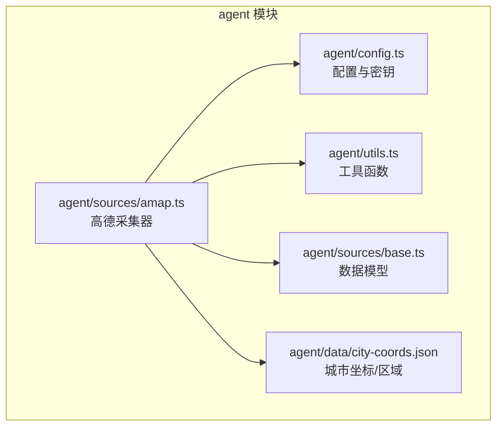
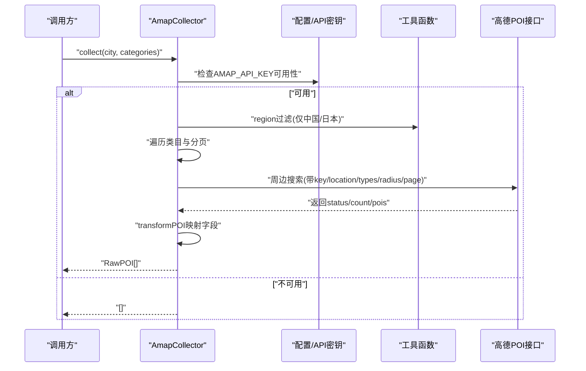
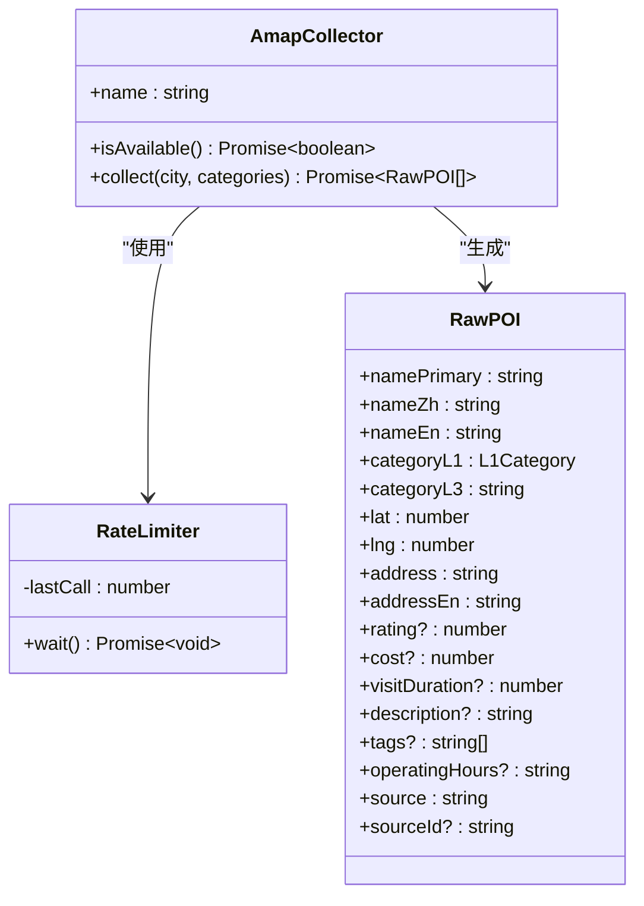
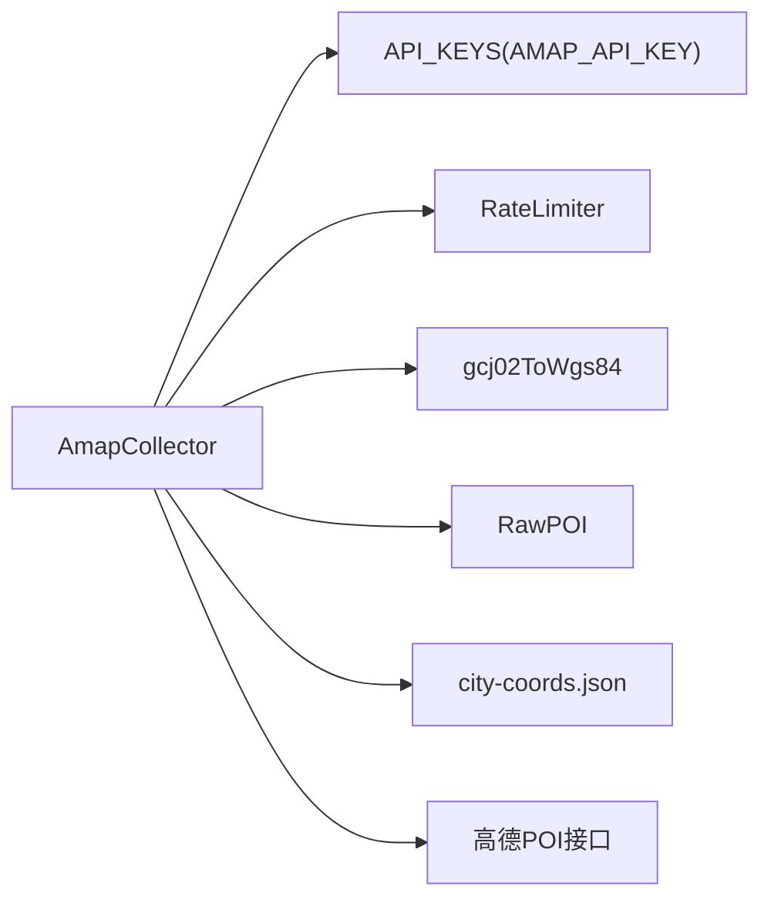

# 高德地图数据源

<cite>
**本文引用的文件**
- [agent/sources/amap.ts](file://agent/sources/amap.ts)
- [agent/config.ts](file://agent/config.ts)
- [agent/utils.ts](file://agent/utils.ts)
- [agent/sources/base.ts](file://agent/sources/base.ts)
- [agent/data/city-coords.json](file://agent/data/city-coords.json)
</cite>

## 目录
1. [简介](#简介)
2. [项目结构](#项目结构)
3. [核心组件](#核心组件)
4. [架构总览](#架构总览)
5. [详细组件分析](#详细组件分析)
6. [依赖关系分析](#依赖关系分析)
7. [性能考量](#性能考量)
8. [故障排查指南](#故障排查指南)
9. [结论](#结论)
10. [附录](#附录)

## 简介
本文件面向“高德地图数据源”的集成与使用，基于仓库中的采集器实现，系统性说明以下内容：
- 高德地图 API 的接入方式与认证机制
- 请求限制与速率控制策略
- POI 搜索接口的使用方法（周边搜索为主；支持按类型扩展）
- 数据特点与优势（中文本地化、地址解析、坐标系转换）
- API 密钥配置、请求频率控制与错误处理策略
- 结合现有代码的调用流程图与类图，帮助快速上手与排障

## 项目结构
与高德地图数据源相关的代码主要位于 agent 子模块中，核心文件如下：
- 数据源采集器：agent/sources/amap.ts
- 配置与密钥管理：agent/config.ts
- 工具函数（坐标转换、限流等）：agent/utils.ts
- 数据模型与统一接口：agent/sources/base.ts
- 城市坐标与区域判定：agent/data/city-coords.json

图表来源
- [agent/sources/amap.ts:1-232](file://agent/sources/amap.ts#L1-L232)
- [agent/config.ts:1-182](file://agent/config.ts#L1-L182)
- [agent/utils.ts:1-191](file://agent/utils.ts#L1-L191)
- [agent/sources/base.ts:1-252](file://agent/sources/base.ts#L1-L252)
- [agent/data/city-coords.json:1-800](file://agent/data/city-coords.json#L1-L800)

章节来源
- [agent/sources/amap.ts:1-232](file://agent/sources/amap.ts#L1-L232)
- [agent/config.ts:1-182](file://agent/config.ts#L1-L182)
- [agent/utils.ts:1-191](file://agent/utils.ts#L1-L191)
- [agent/sources/base.ts:1-252](file://agent/sources/base.ts#L1-L252)
- [agent/data/city-coords.json:1-800](file://agent/data/city-coords.json#L1-L800)

## 核心组件
- 高德采集器（AmapCollector）
  - 实现统一 SourceCollector 接口，负责按城市与类目发起周边搜索请求，并将结果映射为内部 RawPOI 模型。
  - 支持区域过滤（仅中国与日本城市）。
- 配置与密钥（API_KEYS、AGENT_CONFIG）
  - 从环境变量加载 AMAP_API_KEY，并设置高德请求超时与速率限制。
- 工具函数
  - 坐标转换：GCJ-02 → WGS-84（高德默认坐标系）
  - 速率限制：RateLimiter 控制请求间隔
- 数据模型
  - RawPOI 字段覆盖名称、地址、坐标、评分、营业时间、费用等，便于后续合并与展示。

章节来源
- [agent/sources/amap.ts:183-232](file://agent/sources/amap.ts#L183-L232)
- [agent/config.ts:20-77](file://agent/config.ts#L20-L77)
- [agent/utils.ts:53-66](file://agent/utils.ts#L53-L66)
- [agent/sources/base.ts:42-87](file://agent/sources/base.ts#L42-L87)

## 架构总览
下图展示了从城市信息到高德周边搜索、数据转换与最终产出 RawPOI 的整体流程。

图表来源
- [agent/sources/amap.ts:186-230](file://agent/sources/amap.ts#L186-L230)
- [agent/config.ts:20-28](file://agent/config.ts#L20-L28)
- [agent/config.ts:87-125](file://agent/config.ts#L87-L125)

## 详细组件分析

### 高德采集器（AmapCollector）
- 功能职责
  - 区域过滤：仅对 isDomestic 或国家为“日本”的城市执行采集。
  - 类目搜索：按 L1 类目映射高德类型码，最多翻页 3 页，累计提取 POI。
  - 数据转换：将高德返回的 GCJ-02 坐标转换为 WGS-84，提取标签与 L3 类目，补充评分、费用、营业时间等字段。
  - 翻译补齐：对缺失英文名的 POI 进行补齐（依赖外部翻译流程）。
- 关键实现要点
  - 请求参数：key、location、types、radius、offset=25、page、extensions=all、output=json。
  - 超时控制：AbortController + 超时清理。
  - 错误处理：HTTP 状态与业务状态校验，抛出明确错误信息。
  - 速率控制：全局 RateLimiter，间隔 1000ms。
- 输出模型：RawPOI，包含名称、地址、坐标、评分、费用、标签、营业时间、来源标识等。

图表来源
- [agent/sources/amap.ts:183-232](file://agent/sources/amap.ts#L183-L232)
- [agent/utils.ts:110-123](file://agent/utils.ts#L110-L123)
- [agent/sources/base.ts:42-87](file://agent/sources/base.ts#L42-L87)

章节来源
- [agent/sources/amap.ts:130-179](file://agent/sources/amap.ts#L130-L179)
- [agent/sources/amap.ts:183-232](file://agent/sources/amap.ts#L183-L232)
- [agent/utils.ts:110-123](file://agent/utils.ts#L110-L123)
- [agent/sources/base.ts:42-87](file://agent/sources/base.ts#L42-L87)

### 配置与密钥管理
- API 密钥来源：优先从 VITE_DASHSCOPE_API_KEY 或 DASHSCOPE_API_KEY，其他数据源同理；高德通过 AMAP_API_KEY 注入。
- 运行参数：
  - amapTimeout：30000ms
  - amapInterval：1000ms（即约 1 QPS）
  - searchRadiusKm：15km（周边搜索半径）
- 可用性检测：getSourceAvailability 返回各数据源可用状态与原因。

章节来源
- [agent/config.ts:20-28](file://agent/config.ts#L20-L28)
- [agent/config.ts:37-53](file://agent/config.ts#L37-L53)
- [agent/config.ts:87-125](file://agent/config.ts#L87-L125)

### 坐标转换与区域判定
- 坐标转换：gcj02ToWgs84 将高德 GCJ-02 坐标转换为 WGS-84，非中国大陆区域直接返回原坐标。
- 区域判定：采集器在 collect 前检查 isDomestic 或国家为“日本”，否则跳过。

章节来源
- [agent/utils.ts:53-66](file://agent/utils.ts#L53-L66)
- [agent/sources/amap.ts:190-196](file://agent/sources/amap.ts#L190-L196)

### 数据模型与字段映射
- RawPOI 字段覆盖名称、地址、坐标、评分、费用、标签、营业时间、来源标识等。
- transformPOI 将高德返回的 name、location、type、typecode、biz_ext 等字段映射到 RawPOI。

章节来源
- [agent/sources/base.ts:42-87](file://agent/sources/base.ts#L42-L87)
- [agent/sources/amap.ts:33-101](file://agent/sources/amap.ts#L33-L101)

## 依赖关系分析
- 组件耦合
  - AmapCollector 依赖 API_KEYS（来自 config）、RateLimiter（utils）、RawPOI（base）、坐标转换（utils）。
  - 城市坐标与区域信息来自 city-coords.json，用于判断是否支持采集。
- 外部依赖
  - 高德 Place Around API（周边搜索）。
  - 翻译补齐流程（fillMissingTranslations）在采集完成后执行。

图表来源
- [agent/sources/amap.ts:9-14](file://agent/sources/amap.ts#L9-L14)
- [agent/config.ts:20-28](file://agent/config.ts#L20-L28)
- [agent/utils.ts:110-123](file://agent/utils.ts#L110-L123)
- [agent/sources/base.ts:42-87](file://agent/sources/base.ts#L42-L87)
- [agent/data/city-coords.json:1-800](file://agent/data/city-coords.json#L1-L800)

章节来源
- [agent/sources/amap.ts:9-14](file://agent/sources/amap.ts#L9-L14)
- [agent/config.ts:20-28](file://agent/config.ts#L20-L28)
- [agent/utils.ts:110-123](file://agent/utils.ts#L110-L123)
- [agent/sources/base.ts:42-87](file://agent/sources/base.ts#L42-L87)
- [agent/data/city-coords.json:1-800](file://agent/data/city-coords.json#L1-L800)

## 性能考量
- 速率限制
  - 全局 1 QPS（1000ms 间隔），避免触发高德配额限制。
  - 若并发采集多城市，建议结合 AGENT_CONFIG.concurrentCities 参数进行调度。
- 搜索范围与分页
  - 默认半径 15km，每页 25 条，最多翻页 3 页，兼顾覆盖率与性能。
- 超时控制
  - 请求超时 30000ms，避免阻塞整体采集流程。
- 坐标转换成本
  - GCJ-02 → WGS-84 转换为 O(n) 成本，建议在批量 POI 处理时复用结果。

章节来源
- [agent/config.ts:48](file://agent/config.ts#L48)
- [agent/config.ts:56](file://agent/config.ts#L56)
- [agent/config.ts:41](file://agent/config.ts#L41)
- [agent/sources/amap.ts:130-179](file://agent/sources/amap.ts#L130-L179)

## 故障排查指南
- 缺少 API 密钥
  - 现象：高德数据源不可用，采集返回空集。
  - 处理：在环境变量中设置 AMAP_API_KEY，并确保 .env.local 生效。
- 请求超时
  - 现象：searchPOIs 抛出超时错误。
  - 处理：检查网络连通性与代理设置；适当提高 AGENT_CONFIG.amapTimeout。
- 业务错误
  - 现象：响应 status 非“1”或 info 异常。
  - 处理：根据 info 信息调整请求参数（如 types、radius、page）。
- 坐标异常
  - 现象：POI 坐标不在预期区域。
  - 处理：确认 location 是否为 GCJ-02 格式；使用 gcj02ToWgs84 转换。
- 区域不支持
  - 现象：某些城市被跳过。
  - 处理：检查 city-coords.json 中的 isDomestic 或国家字段。

章节来源
- [agent/config.ts:87-125](file://agent/config.ts#L87-L125)
- [agent/sources/amap.ts:152-179](file://agent/sources/amap.ts#L152-L179)
- [agent/utils.ts:53-66](file://agent/utils.ts#L53-L66)
- [agent/sources/amap.ts:190-196](file://agent/sources/amap.ts#L190-L196)

## 结论
本集成以 AmapCollector 为核心，围绕高德周边搜索 API 构建了稳定的数据采集链路。通过严格的区域过滤、速率限制与错误处理，能够在保证合规的前提下高效获取中文本地化的 POI 数据。配合坐标转换与数据模型映射，可直接进入后续的合并与展示阶段。

## 附录

### API 密钥配置指南
- 设置环境变量 AMAP_API_KEY
- 确保 .env.local 文件被正确加载（参见配置模块）
- 使用 getSourceAvailability 检查可用性

章节来源
- [agent/config.ts:20-28](file://agent/config.ts#L20-L28)
- [agent/config.ts:87-125](file://agent/config.ts#L87-L125)

### 请求频率控制与配额建议
- 建议维持 1 QPS（1000ms 间隔），避免触发高德个人版配额。
- 对于批量城市采集，结合 AGENT_CONFIG.concurrentCities 进行并发控制。

章节来源
- [agent/config.ts:48](file://agent/config.ts#L48)
- [agent/config.ts:33](file://agent/config.ts#L33)

### POI 搜索接口使用方法
- 接口路径：周边搜索（Place Around）
- 关键参数：key、location（gcj02）、types（高德类型码）、radius（米）、offset=25、page、extensions=all、output=json
- 响应校验：status 必须为“1”，否则视为业务错误
- 分页策略：最多 3 页，依据 count 判断是否继续翻页

章节来源
- [agent/sources/amap.ts:16](file://agent/sources/amap.ts#L16)
- [agent/sources/amap.ts:138-147](file://agent/sources/amap.ts#L138-L147)
- [agent/sources/amap.ts:168-175](file://agent/sources/amap.ts#L168-L175)
- [agent/sources/amap.ts:206-218](file://agent/sources/amap.ts#L206-L218)

### 数据特点与优势
- 中文本地化：名称与地址均为中文，适合中文用户场景
- 详细地址解析：高德提供 address 字段，便于定位与展示
- 坐标系转换：内置 GCJ-02 → WGS-84 转换，适配国际系统
- 营业时间与费用：biz_ext 中的 opentime、cost、rating 等字段增强实用性

章节来源
- [agent/sources/amap.ts:33-101](file://agent/sources/amap.ts#L33-L101)
- [agent/utils.ts:53-66](file://agent/utils.ts#L53-L66)