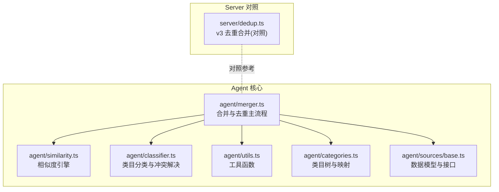
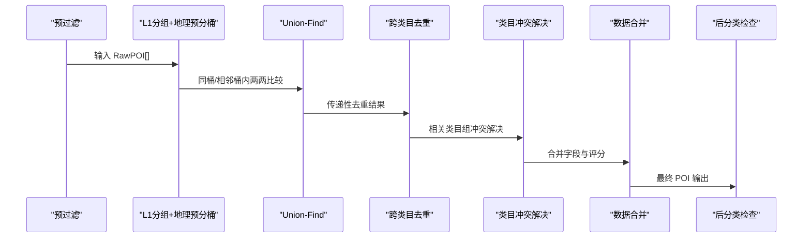
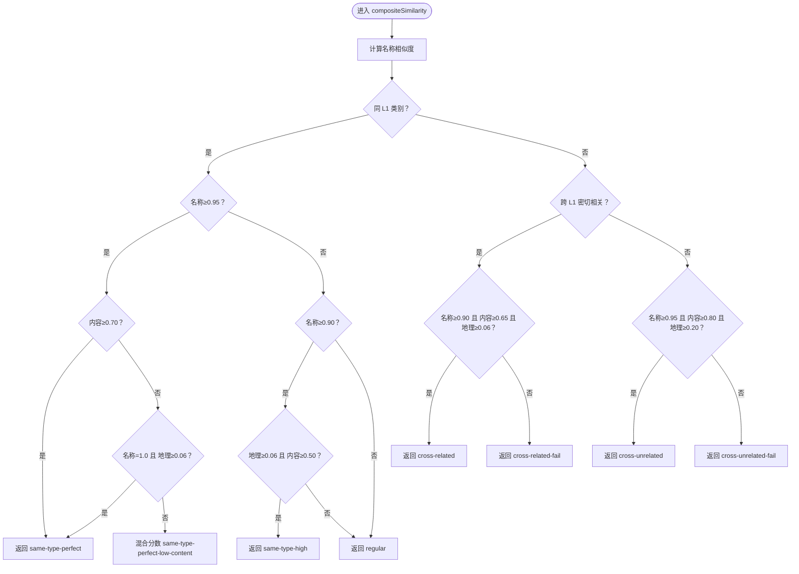
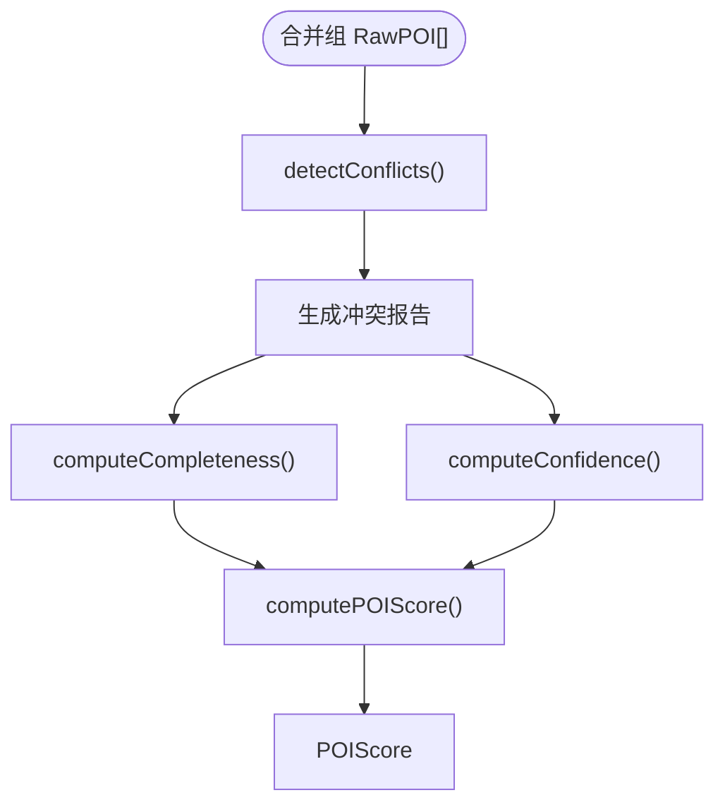
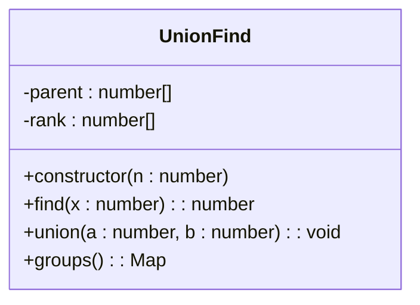
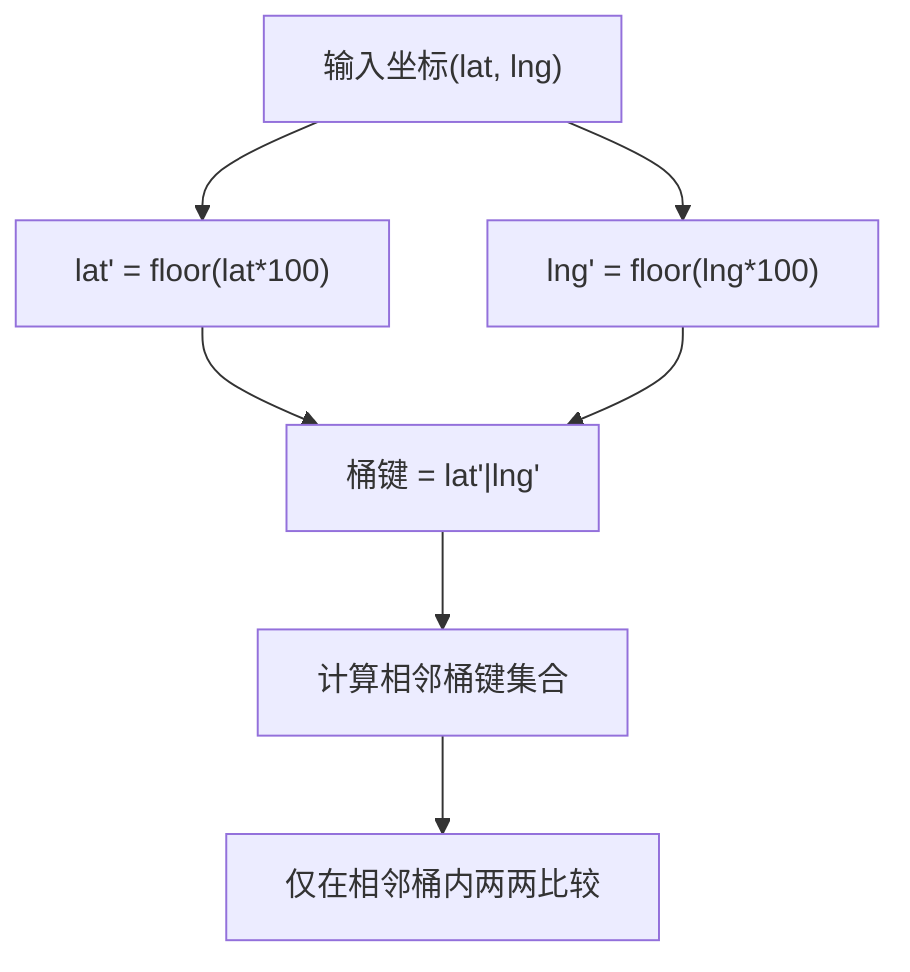
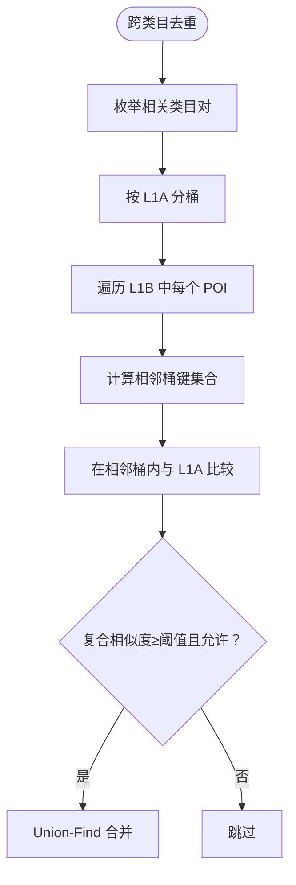
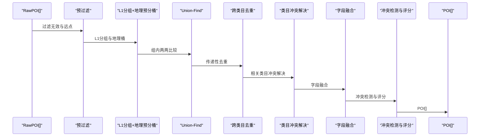
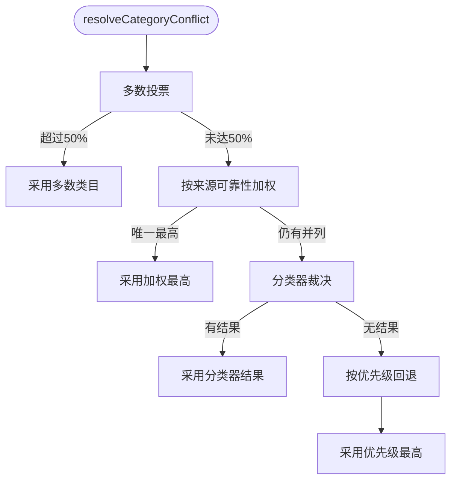
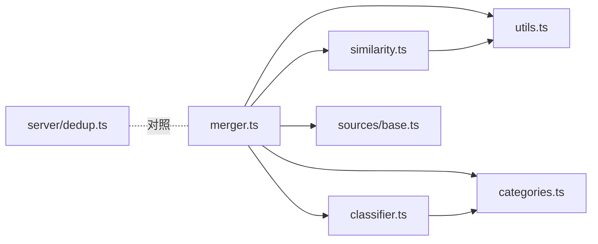

# 数据合并算法

<cite>
**本文引用的文件**
- [agent/merger.ts](file://agent/merger.ts)
- [agent/similarity.ts](file://agent/similarity.ts)
- [agent/classifier.ts](file://agent/classifier.ts)
- [agent/utils.ts](file://agent/utils.ts)
- [agent/categories.ts](file://agent/categories.ts)
- [agent/sources/base.ts](file://agent/sources/base.ts)
- [server/dedup.ts](file://server/dedup.ts)
</cite>

## 目录
1. [简介](#简介)
2. [项目结构](#项目结构)
3. [核心组件](#核心组件)
4. [架构概览](#架构概览)
5. [详细组件分析](#详细组件分析)
6. [依赖分析](#依赖分析)
7. [性能考虑](#性能考虑)
8. [故障排查指南](#故障排查指南)
9. [结论](#结论)
10. [附录](#附录)

## 简介
本技术文档围绕“数据合并算法”展开，系统阐述以下关键能力：
- 5路径决策树：名称相似度、地址相似度、地理相似度、内容相似度的综合评估与路径选择。
- 冲突检测与评分：多源字段一致性检测、完整性与置信度评分、质量加成。
- Union-Find 传递性去重：路径压缩与按秩合并优化，地理预分桶加速。
- 地理预分桶策略：坐标四舍五入规则、相邻桶计算与性能优化。
- 跨类目去重机制：相关类目组合、相似度阈值与去重策略。
- 完整数据合并流程：输入数据格式、处理步骤与输出结果。
- 复杂度分析与性能调优建议。

## 项目结构
本项目采用模块化设计，核心算法集中在 agent 目录，数据模型与类别体系在 sources/base.ts 与 categories.ts 中定义，相似度与分类器在 similarity.ts 与 classifier.ts 中实现，工具函数在 utils.ts 中提供距离与并发控制等支持。

图表来源
- [agent/merger.ts:1-1025](file://agent/merger.ts#L1-L1025)
- [agent/similarity.ts:1-415](file://agent/similarity.ts#L1-L415)
- [agent/classifier.ts:1-601](file://agent/classifier.ts#L1-L601)
- [agent/utils.ts:1-191](file://agent/utils.ts#L1-L191)
- [agent/categories.ts:1-374](file://agent/categories.ts#L1-L374)
- [agent/sources/base.ts:1-252](file://agent/sources/base.ts#L1-L252)
- [server/dedup.ts:1-753](file://server/dedup.ts#L1-L753)

章节来源
- [agent/merger.ts:1-1025](file://agent/merger.ts#L1-L1025)
- [agent/similarity.ts:1-415](file://agent/similarity.ts#L1-L415)
- [agent/classifier.ts:1-601](file://agent/classifier.ts#L1-L601)
- [agent/utils.ts:1-191](file://agent/utils.ts#L1-L191)
- [agent/categories.ts:1-374](file://agent/categories.ts#L1-L374)
- [agent/sources/base.ts:1-252](file://agent/sources/base.ts#L1-L252)
- [server/dedup.ts:1-753](file://server/dedup.ts#L1-L753)

## 核心组件
- 相似度引擎（5路径决策树）：基于名称、地址、地理、内容四个维度，结合 L1 类别关系与阈值路径，输出复合相似度与决策路径。
- 冲突检测与评分：对多源字段进行一致性检测，计算完整性与置信度，叠加质量加成，形成最终评分。
- Union-Find 传递性去重：使用路径压缩与按秩合并，结合地理预分桶，高效识别重复组并进行合并。
- 地理预分桶：将坐标四舍五入到 0.01° 作为桶键，仅在同桶与相邻桶内进行两两比较，显著降低比较次数。
- 跨类目去重：针对相关类目组合（如 scenic 与 experience、entertainment 与 experience、food 与 experience）进行定向合并。
- 数据模型与类别体系：统一的 RawPOI/POI 数据模型，支持三名系统、双语地址、月度指数与最佳季节等字段。

章节来源
- [agent/merger.ts:269-319](file://agent/merger.ts#L269-L319)
- [agent/merger.ts:523-596](file://agent/merger.ts#L523-L596)
- [agent/merger.ts:606-667](file://agent/merger.ts#L606-L667)
- [agent/similarity.ts:321-400](file://agent/similarity.ts#L321-L400)
- [agent/similarity.ts:378-389](file://agent/similarity.ts#L378-L389)
- [agent/sources/base.ts:42-87](file://agent/sources/base.ts#L42-L87)
- [agent/categories.ts:17-31](file://agent/categories.ts#L17-L31)

## 架构概览
数据合并管道分为以下阶段：
- 预过滤：剔除无效 POI，并过滤远离城市的点。
- L1 分组与地理预分桶：按一级类目分组，构建地理桶索引，仅在同桶与相邻桶内比较。
- 两两相似度与 Union-Find：计算复合相似度，满足阈值即合并，形成重复组。
- 跨类目去重：对相关类目组合进行定向合并，进一步消除跨类目重复。
- 类目冲突解决：当多源对同一 POI 的 L1 类目存在分歧时，采用多数投票、可靠性加权与分类器裁决。
- 数据合并：基于来源可靠性与字段特性进行字段融合，生成最终 POI。
- 后分类检查：对合并后的 POI 进行类型与评分的最终校验。

图表来源
- [agent/merger.ts:492-521](file://agent/merger.ts#L492-L521)
- [agent/merger.ts:523-596](file://agent/merger.ts#L523-L596)
- [agent/merger.ts:606-667](file://agent/merger.ts#L606-L667)
- [agent/merger.ts:669-789](file://agent/merger.ts#L669-L789)
- [agent/merger.ts:791-800](file://agent/merger.ts#L791-L800)

## 详细组件分析

### 5路径决策树（相似度计算与决策逻辑）
- 名称相似度：同时比对 namePrimary、nameZh、nameEn，取最大值；支持简称-全称模式与子串包含判定。
- 地址相似度：比对 address 与 addressEn，取较大者；均为空时取中性值。
- 地理相似度：基于 Haversine 距离的柔和衰减函数，0m→1.0，500m→0.5。
- 内容相似度：费用比值（35%）、标签 Jaccard 系数（45%）、时长比值（20%）。
- 决策路径：
  - 同 L1 且名称≥0.95：需内容≥0.70 才合并；若名称完全相同且地理≤2km，亦可合并。
  - 同 L1 且名称 0.90-0.95：需地理≥0.06 且内容≥0.50。
  - 同 L1 其他：常规加权（名称 0.45 + 地址 0.25 + 地理 0.30）。
  - 跨 L1 密切相关（scenic/experience、entertainment/experience、food/experience）：名称≥0.90 且内容≥0.65 且地理≥0.06。
  - 跨 L1 非相关：需名称≥0.95 且内容≥0.80 且地理≥0.20。
- 路径阻断：某些路径（如 cross-related-fail、cross-unrelated-fail、same-type-perfect-low-content）会被显式拒绝。

图表来源
- [agent/similarity.ts:321-400](file://agent/similarity.ts#L321-L400)
- [agent/similarity.ts:378-389](file://agent/similarity.ts#L378-L389)

章节来源
- [agent/similarity.ts:17-37](file://agent/similarity.ts#L17-L37)
- [agent/similarity.ts:118-172](file://agent/similarity.ts#L118-L172)
- [agent/similarity.ts:196-203](file://agent/similarity.ts#L196-L203)
- [agent/similarity.ts:212-243](file://agent/similarity.ts#L212-L243)
- [agent/similarity.ts:259-271](file://agent/similarity.ts#L259-L271)
- [agent/similarity.ts:281-296](file://agent/similarity.ts#L281-L296)
- [agent/similarity.ts:321-400](file://agent/similarity.ts#L321-L400)

### 冲突检测与评分
- 冲突检测：对组内多源字段进行成对比较，统计可比对对数、冲突对数与冲突字段数，计算一致性比率。
- 完整度评分：根据字段是否填充及其权重计算，核心四要素（坐标、主名、地址、L1 类别）权重更高。
- 置信度评分：单源时基于来源可靠性奖励；多源时基于来源数量、一致性比率与冲突数量进行加权。
- 质量加成：依据描述长度、三名齐全、标签数量、月度指数完整性等进行加分。
- 综合评分：0.55×完整度 + 0.45×置信度 + 质量加成，归一化到 0-100。

图表来源
- [agent/merger.ts:349-425](file://agent/merger.ts#L349-L425)
- [agent/merger.ts:427-453](file://agent/merger.ts#L427-L453)
- [agent/merger.ts:455-472](file://agent/merger.ts#L455-L472)
- [agent/merger.ts:474-490](file://agent/merger.ts#L474-L490)

章节来源
- [agent/merger.ts:337-490](file://agent/merger.ts#L337-L490)

### Union-Find 传递性去重（路径压缩与按秩合并）
- 并查集实现：包含父节点数组与秩数组，支持 find 与 union。
- 路径压缩：find 过程中将节点直接连接到根，提升后续查询效率。
- 按秩合并：union 时将较小秩的树合并到较大秩的树下，保持树平衡。
- 传递性去重：对满足相似度阈值的 POI 对执行 union，最终通过 groups() 聚合为重复组。

图表来源
- [agent/merger.ts:269-319](file://agent/merger.ts#L269-L319)

章节来源
- [agent/merger.ts:269-319](file://agent/merger.ts#L269-L319)

### 地理预分桶策略（坐标四舍五入与相邻桶）
- 坐标四舍五入：将纬度与经度乘以 100 并取整，得到 0.01° 级别的桶键。
- 相邻桶计算：以当前桶为中心的 3×3 邻域（包含自身）作为候选比较集合。
- 性能优化：仅在同桶与相邻桶内进行两两比较，显著降低比较次数，适合大规模数据。

图表来源
- [agent/merger.ts:525-542](file://agent/merger.ts#L525-L542)
- [agent/utils.ts:11-21](file://agent/utils.ts#L11-L21)

章节来源
- [agent/merger.ts:523-596](file://agent/merger.ts#L523-L596)
- [agent/utils.ts:1-191](file://agent/utils.ts#L1-L191)

### 跨类目去重机制（相关类目组合与阈值）
- 相关类目组合：scenic 与 experience、entertainment 与 experience、food 与 experience。
- 合并条件：名称≥0.90 且内容≥0.65 且地理≤2km；若不满足则使用较低阈值的路径。
- 与地理预分桶结合：先按地理桶分组，再在相邻桶内对相关类目进行跨类目比较。

图表来源
- [agent/merger.ts:606-667](file://agent/merger.ts#L606-L667)
- [agent/similarity.ts:298-318](file://agent/similarity.ts#L298-L318)

章节来源
- [agent/merger.ts:606-667](file://agent/merger.ts#L606-L667)
- [agent/similarity.ts:298-318](file://agent/similarity.ts#L298-L318)

### 数据合并流程（输入、处理与输出）
- 输入数据格式：RawPOI，包含主名、中文名、英文名、L1/L3 类目、坐标、地址、评分、费用、时长、描述、标签、营业时间、最佳季节、月度指数、来源等。
- 处理步骤：
  1) 预过滤：剔除无效 POI 与远离城市的点。
  2) L1 分组与地理预分桶：按 L1 类目分组，构建桶索引。
  3) 组内去重：两两比较相似度，满足阈值即 union。
  4) 跨类目去重：对相关类目组合进行定向合并。
  5) 类目冲突解决：多数投票→可靠性加权→分类器裁决。
  6) 字段融合：坐标加权平均、三名填补、描述取最长、评分加权平均、费用与时长取中位数、标签并集+双语化、地址取最长、月度指数优先非 AI，否则平均。
  7) 冲突检测与评分：生成冲突报告与 POIScore。
  8) 后分类检查：最终校验与评分。
- 输出结果：POI 数组，包含标准化字段与质量评分。

图表来源
- [agent/merger.ts:492-521](file://agent/merger.ts#L492-L521)
- [agent/merger.ts:523-596](file://agent/merger.ts#L523-L596)
- [agent/merger.ts:606-667](file://agent/merger.ts#L606-L667)
- [agent/merger.ts:669-789](file://agent/merger.ts#L669-L789)
- [agent/merger.ts:791-800](file://agent/merger.ts#L791-L800)

章节来源
- [agent/merger.ts:492-1025](file://agent/merger.ts#L492-L1025)
- [agent/sources/base.ts:42-87](file://agent/sources/base.ts#L42-L87)
- [agent/sources/base.ts:121-177](file://agent/sources/base.ts#L121-L177)

### 类目冲突解决（多数投票→可靠性加权→分类器裁决）
- 多数投票：若某一 L1 类目获得超过一半票数，则直接采用。
- 可靠性加权：若无绝对多数，按来源可靠性加权计分，最高者获胜。
- 分类器裁决：若仍平局，使用分类器对候选 POI 进行关键词打分，取最高分者。
- 回退策略：若仍无法裁决，按优先级 scenic > experience > entertainment > food > shopping > hotel 选择。

图表来源
- [agent/classifier.ts:489-552](file://agent/classifier.ts#L489-L552)

章节来源
- [agent/classifier.ts:489-552](file://agent/classifier.ts#L489-L552)

## 依赖分析
- merger.ts 依赖 similarity.ts 的复合相似度与阈值路径，依赖 classifier.ts 的类目冲突解决与 L3 解析，依赖 utils.ts 的距离与数值工具，依赖 categories.ts 的 L1 类别与路径解析，依赖 sources/base.ts 的数据模型与坐标四舍五入。
- similarity.ts 依赖 utils.ts 的距离函数与字符串预处理。
- classifier.ts 依赖 categories.ts 的类目树与路径解析。
- server/dedup.ts 提供 v3 去重合并的对照实现，便于对比相似度路径与合并策略。

图表来源
- [agent/merger.ts:12-27](file://agent/merger.ts#L12-L27)
- [agent/similarity.ts:13-13](file://agent/similarity.ts#L13-L13)
- [agent/classifier.ts:8-9](file://agent/classifier.ts#L8-L9)
- [agent/utils.ts:1-6](file://agent/utils.ts#L1-L6)
- [agent/categories.ts:8-9](file://agent/categories.ts#L8-L9)
- [agent/sources/base.ts:8-8](file://agent/sources/base.ts#L8-L8)
- [server/dedup.ts:1-25](file://server/dedup.ts#L1-L25)

章节来源
- [agent/merger.ts:12-27](file://agent/merger.ts#L12-L27)
- [agent/similarity.ts:13-13](file://agent/similarity.ts#L13-L13)
- [agent/classifier.ts:8-9](file://agent/classifier.ts#L8-L9)
- [agent/utils.ts:1-6](file://agent/utils.ts#L1-L6)
- [agent/categories.ts:8-9](file://agent/categories.ts#L8-L9)
- [agent/sources/base.ts:8-8](file://agent/sources/base.ts#L8-L8)
- [server/dedup.ts:1-25](file://server/dedup.ts#L1-L25)

## 性能考虑
- 时间复杂度
  - 相似度计算：O(mn) 对于 n 个 POI，m 为桶内平均比较数；地理预分桶将 m 控制在较小范围内。
  - Union-Find：单次 find/union 近似 O(α(n))，整体近似 O(mn·α(n))。
  - 冲突检测：对每个组进行两两比较，复杂度 O(g²)，其中 g 为组大小。
- 空间复杂度
  - 并查集：O(n)。
  - 地理桶：O(n)。
  - 冲突检测：O(g²)。
- 优化建议
  - 地理预分桶：确保桶粒度适中（0.01° 约 1.1km），避免过细导致桶过多或过粗导致比较爆炸。
  - 并发控制：对不同城市或类目的分桶并行处理，结合并发池限制资源占用。
  - 早期剪枝：在相似度计算前加入快速过滤（如名称/地址完全相等或距离过大）。
  - 内存管理：及时释放中间桶与比较缓存，避免内存峰值过高。
  - 索引优化：对高频字段（如 L1 类别、名称）建立索引，加速分组与查询。

[本节为通用性能讨论，无需特定文件引用]

## 故障排查指南
- 无效 POI 过滤过多
  - 检查预过滤逻辑与城市距离阈值，确认是否误判有效 POI。
  - 参考：[agent/merger.ts:494-521](file://agent/merger.ts#L494-L521)
- 相似度阈值设置不当
  - 调整 MERGE_THRESHOLD 与路径阈值，观察跨类目与同类型合并效果。
  - 参考：[agent/merger.ts:31-37](file://agent/merger.ts#L31-L37)、[agent/similarity.ts:321-400](file://agent/similarity.ts#L321-L400)
- Union-Find 性能瓶颈
  - 检查路径压缩与按秩合并是否生效，确认桶划分是否合理。
  - 参考：[agent/merger.ts:269-319](file://agent/merger.ts#L269-L319)
- 跨类目误合并
  - 调整相关类目组合与阈值，必要时增加内容相似度权重。
  - 参考：[agent/merger.ts:606-667](file://agent/merger.ts#L606-L667)、[agent/similarity.ts:298-318](file://agent/similarity.ts#L298-L318)
- 冲突检测误报
  - 检查冲突阈值与字段权重，适当放宽或收紧阈值。
  - 参考：[agent/merger.ts:232-239](file://agent/merger.ts#L232-L239)、[agent/merger.ts:349-425](file://agent/merger.ts#L349-L425)

章节来源
- [agent/merger.ts:31-37](file://agent/merger.ts#L31-L37)
- [agent/merger.ts:494-521](file://agent/merger.ts#L494-L521)
- [agent/merger.ts:269-319](file://agent/merger.ts#L269-L319)
- [agent/merger.ts:606-667](file://agent/merger.ts#L606-L667)
- [agent/similarity.ts:321-400](file://agent/similarity.ts#L321-L400)
- [agent/similarity.ts:298-318](file://agent/similarity.ts#L298-L318)
- [agent/merger.ts:232-239](file://agent/merger.ts#L232-L239)
- [agent/merger.ts:349-425](file://agent/merger.ts#L349-L425)

## 结论
本数据合并算法通过 5路径决策树实现精准的相似度评估，结合地理预分桶与 Union-Find 传递性去重，有效降低比较复杂度；通过冲突检测与评分体系保证合并结果的质量；跨类目去重机制进一步提升覆盖率与准确性。整体流程清晰、模块化程度高，便于扩展与维护。

[本节为总结性内容，无需特定文件引用]

## 附录
- 数据模型字段说明
  - RawPOI：主名、中文名、英文名、L1/L3 类目、坐标、地址、评分、费用、时长、描述、标签、营业时间、最佳季节、月度指数、来源等。
  - POI：与 RawPOI 类似，但字段标准化、补充图片 URL、体验类目专属字段与质量评分。
- 类目体系
  - L1 类别：scenic、food、shopping、entertainment、experience、hotel。
  - L3 类目：由 L1 与 L2 组合构成，支持路径解析与映射。

章节来源
- [agent/sources/base.ts:42-87](file://agent/sources/base.ts#L42-L87)
- [agent/sources/base.ts:121-177](file://agent/sources/base.ts#L121-L177)
- [agent/categories.ts:17-31](file://agent/categories.ts#L17-L31)