# 数据处理管道

<cite>
**本文引用的文件**
- [agent/merger.ts](file://agent/merger.ts)
- [agent/quality.ts](file://agent/quality.ts)
- [agent/similarity.ts](file://agent/similarity.ts)
- [agent/rescore.ts](file://agent/rescore.ts)
- [agent/translate.ts](file://agent/translate.ts)
- [server/dedup.ts](file://server/dedup.ts)
- [agent/utils.ts](file://agent/utils.ts)
- [agent/classifier.ts](file://agent/classifier.ts)
- [agent/categories.ts](file://agent/categories.ts)
- [agent/db.ts](file://agent/db.ts)
- [agent/init-db.ts](file://agent/init-db.ts)
- [agent/index.ts](file://agent/index.ts)
- [agent/incremental.ts](file://agent/incremental.ts)
- [agent/exporter.ts](file://agent/exporter.ts)
- [agent/sources/base.ts](file://agent/sources/base.ts)
- [agent/sources/amap.ts](file://agent/sources/amap.ts)
- [agent/sources/google.ts](file://agent/sources/google.ts)
- [agent/sources/osm.ts](file://agent/sources/osm.ts)
- [agent/sources/foursquare.ts](file://agent/sources/foursquare.ts)
- [agent/sources/spark.ts](file://agent/sources/spark.ts)
- [agent/sources/doubao.ts](file://agent/sources/doubao.ts)
- [agent/sources/ai.ts](file://agent/sources/ai.ts)
- [agent/data/city-coords.json](file://agent/data/city-coords.json)
- [scripts/merge-all-cities.ts](file://scripts/merge-all-cities.ts)
- [scripts/fetch-domestic-cities.ts](file://scripts/fetch-domestic-cities.ts)
- [scripts/fetch-domestic-extra.ts](file://scripts/fetch-domestic-extra.ts)
- [scripts/fetch-domestic-final.ts](file://scripts/fetch-domestic-final.ts)
- [wiki/knowledge/scoring-kb.md](file://wiki/knowledge/scoring-kb.md)
- [wiki/principles.md](file://wiki/principles.md)
- [wiki/knowledge/city-data-kb.md](file://wiki/knowledge/city-data-kb.md)
- [server/index.ts](file://server/index.ts)
- [server/test-dedup.ts](file://server/test-dedup.ts)
- [admin/pages/POIBrowser.tsx](file://admin/pages/POIBrowser.tsx)
- [server/admin-routes.ts](file://server/admin-routes.ts)
</cite>

## 更新摘要
**所做更改**
- 更新POI数据格式归一化系统章节，反映娱乐和体验categoryL1值映射到活动类型的重要修复
- 新增分类映射逻辑章节，详细说明前端分类映射逻辑已移动到后端数据处理层面
- 更新去重器章节，强调分类映射在去重过程中的关键作用
- 扩展POI数据格式归一化流程图，展示新的分类映射机制

## 目录
1. [简介](#简介)
2. [项目结构](#项目结构)
3. [核心组件](#核心组件)
4. [架构总览](#架构总览)
5. [详细组件分析](#详细组件分析)
6. [依赖关系分析](#依赖关系分析)
7. [性能考虑](#性能考虑)
8. [故障排除指南](#故障排除指南)
9. [结论](#结论)
10. [附录](#附录)

## 简介
本技术文档围绕数据处理管道展开，重点覆盖以下方面：
- 数据合并与去重：重复数据检测、去重策略与冲突解决机制
- 质量评估系统：评分算法、可信度计算与数据完整性检查
- 相似度计算模块：语义相似度、地理空间相似度与综合评分
- 重评分与翻译服务：重评分机制与多语言支持
- **更新** POI数据格式归一化系统：娱乐和体验categoryL1值映射到活动类型，解决113个娱乐POI被隐藏的问题
- **新增** 分类映射逻辑：前端分类映射逻辑已移动到后端数据处理层面
- **新增** Spark数据源集成：讯飞星火AI采集器的实现与优化
- **扩展** 城市覆盖率管理：双文件架构与批量城市数据校验
- 处理流程示例：输入输出格式、处理步骤与性能优化
- 质量监控与异常处理最佳实践

该管道以 TypeScript 为基础，结合多种数据源（高德、谷歌、OSM、Foursquare、**新增**讯飞星火、豆包、AI 智能体等），通过合并、去重、质量评估、相似度计算、重评分与翻译等步骤，最终产出高质量的 POI 数据。

## 项目结构
该项目采用分层与功能模块化组织方式：
- agent：核心数据处理逻辑（合并、去重、质量评估、相似度、重评分、翻译、增量更新、导出等）
- server：后端服务入口与测试脚本（去重测试、分类映射）
- scripts：批量任务与城市级数据抓取脚本
- wiki：知识库与原则文档
- admin：管理后台前端
- src：用户端前端

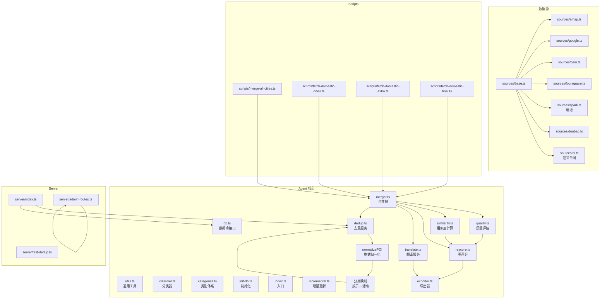

**图表来源**
- [agent/merger.ts](file://agent/merger.ts)
- [agent/quality.ts](file://agent/quality.ts)
- [agent/similarity.ts](file://agent/similarity.ts)
- [agent/rescore.ts](file://agent/rescore.ts)
- [agent/translate.ts](file://agent/translate.ts)
- [server/dedup.ts](file://server/dedup.ts)
- [agent/utils.ts](file://agent/utils.ts)
- [agent/classifier.ts](file://agent/classifier.ts)
- [agent/categories.ts](file://agent/categories.ts)
- [agent/db.ts](file://agent/db.ts)
- [agent/init-db.ts](file://agent/init-db.ts)
- [agent/index.ts](file://agent/index.ts)
- [agent/incremental.ts](file://agent/incremental.ts)
- [agent/exporter.ts](file://agent/exporter.ts)
- [agent/sources/base.ts](file://agent/sources/base.ts)
- [agent/sources/amap.ts](file://agent/sources/amap.ts)
- [agent/sources/google.ts](file://agent/sources/google.ts)
- [agent/sources/osm.ts](file://agent/sources/osm.ts)
- [agent/sources/foursquare.ts](file://agent/sources/foursquare.ts)
- [agent/sources/spark.ts](file://agent/sources/spark.ts)
- [agent/sources/doubao.ts](file://agent/sources/doubao.ts)
- [agent/sources/ai.ts](file://agent/sources/ai.ts)
- [server/index.ts](file://server/index.ts)
- [server/test-dedup.ts](file://server/test-dedup.ts)
- [server/admin-routes.ts](file://server/admin-routes.ts)
- [scripts/merge-all-cities.ts](file://scripts/merge-all-cities.ts)
- [scripts/fetch-domestic-cities.ts](file://scripts/fetch-domestic-cities.ts)
- [scripts/fetch-domestic-extra.ts](file://scripts/fetch-domestic-extra.ts)
- [scripts/fetch-domestic-final.ts](file://scripts/fetch-domestic-final.ts)

**章节来源**
- [agent/index.ts](file://agent/index.ts)
- [agent/merger.ts](file://agent/merger.ts)
- [agent/quality.ts](file://agent/quality.ts)
- [agent/similarity.ts](file://agent/similarity.ts)
- [agent/rescore.ts](file://agent/rescore.ts)
- [agent/translate.ts](file://agent/translate.ts)
- [server/dedup.ts](file://server/dedup.ts)
- [agent/utils.ts](file://agent/utils.ts)
- [agent/classifier.ts](file://agent/classifier.ts)
- [agent/categories.ts](file://agent/categories.ts)
- [agent/db.ts](file://agent/db.ts)
- [agent/init-db.ts](file://agent/init-db.ts)
- [agent/incremental.ts](file://agent/incremental.ts)
- [agent/exporter.ts](file://agent/exporter.ts)
- [agent/sources/base.ts](file://agent/sources/base.ts)
- [agent/sources/amap.ts](file://agent/sources/amap.ts)
- [agent/sources/google.ts](file://agent/sources/google.ts)
- [agent/sources/osm.ts](file://agent/sources/osm.ts)
- [agent/sources/foursquare.ts](file://agent/sources/foursquare.ts)
- [agent/sources/spark.ts](file://agent/sources/spark.ts)
- [agent/sources/doubao.ts](file://agent/sources/doubao.ts)
- [agent/sources/ai.ts](file://agent/sources/ai.ts)
- [server/index.ts](file://server/index.ts)
- [server/test-dedup.ts](file://server/test-dedup.ts)
- [scripts/merge-all-cities.ts](file://scripts/merge-all-cities.ts)
- [scripts/fetch-domestic-cities.ts](file://scripts/fetch-domestic-cities.ts)
- [scripts/fetch-domestic-extra.ts](file://scripts/fetch-domestic-extra.ts)
- [scripts/fetch-domestic-final.ts](file://scripts/fetch-domestic-final.ts)

## 核心组件
- 合并器（Merger）：聚合来自多个数据源的 POI 记录，执行字段对齐、类型转换与初步清洗
- 去重器（Deduplicator）：基于指纹与阈值进行重复检测与合并
- **更新** 格式归一化器（NormalizePOI）：统一新旧 POI 数据格式，确保Spark数据源兼容性，包含娱乐和体验到活动类型的分类映射
- **新增** 分类映射逻辑：将娱乐（entertainment）和体验（experience）类别映射到活动（activity）类型，解决113个娱乐POI被隐藏的问题
- 质量评估（Quality Evaluator）：计算可信度与完整性评分
- 相似度计算（Similarity Calculator）：语义与地理相似度融合
- 重评分（Rescoring）：根据质量与相似度结果调整权重
- 翻译服务（Translator）：多语言文本处理
- 数据源适配器：统一接入高德、谷歌、OSM、Foursquare、**新增**讯飞星火、豆包、AI 智能体
- 数据库接口与初始化：持久化与表结构准备
- 批处理与增量更新：城市级批量处理与增量同步
- 导出器：生成标准化输出

**章节来源**
- [agent/merger.ts](file://agent/merger.ts)
- [server/dedup.ts](file://server/dedup.ts)
- [agent/quality.ts](file://agent/quality.ts)
- [agent/similarity.ts](file://agent/similarity.ts)
- [agent/rescore.ts](file://agent/rescore.ts)
- [agent/translate.ts](file://agent/translate.ts)
- [agent/sources/base.ts](file://agent/sources/base.ts)
- [agent/sources/amap.ts](file://agent/sources/amap.ts)
- [agent/sources/google.ts](file://agent/sources/google.ts)
- [agent/sources/osm.ts](file://agent/sources/osm.ts)
- [agent/sources/foursquare.ts](file://agent/sources/foursquare.ts)
- [agent/sources/spark.ts](file://agent/sources/spark.ts)
- [agent/sources/doubao.ts](file://agent/sources/doubao.ts)
- [agent/sources/ai.ts](file://agent/sources/ai.ts)
- [agent/db.ts](file://agent/db.ts)
- [agent/init-db.ts](file://agent/init-db.ts)
- [agent/incremental.ts](file://agent/incremental.ts)
- [agent/exporter.ts](file://agent/exporter.ts)

## 架构总览
数据从各数据源采集，经合并与去重，进入质量评估与相似度计算，随后进行重评分与翻译，最终导出到数据库或文件系统。分类映射逻辑在去重过程中起到关键作用，确保娱乐和体验类POI正确显示为活动类型。

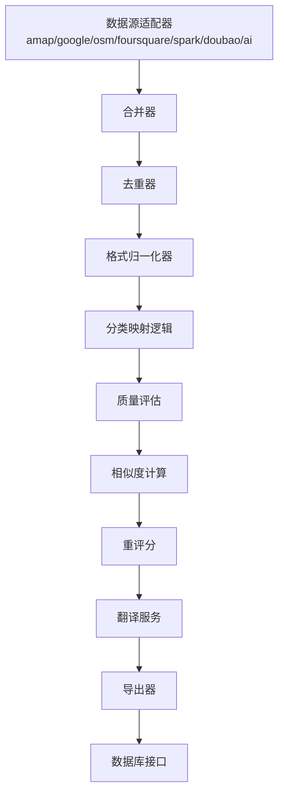

**图表来源**
- [agent/merger.ts](file://agent/merger.ts)
- [server/dedup.ts](file://server/dedup.ts)
- [agent/quality.ts](file://agent/quality.ts)
- [agent/similarity.ts](file://agent/similarity.ts)
- [agent/rescore.ts](file://agent/rescore.ts)
- [agent/translate.ts](file://agent/translate.ts)
- [agent/exporter.ts](file://agent/exporter.ts)
- [agent/db.ts](file://agent/db.ts)
- [agent/sources/base.ts](file://agent/sources/base.ts)

## 详细组件分析

### 数据合并器（Merger）
职责：
- 统一字段映射与类型转换
- 来源标识与版本控制
- 初步清洗与缺失值处理

关键流程：
- 输入：多数据源 POI 列表
- 输出：标准化 POI 列表
- 步骤：字段对齐 → 类型转换 → 缺失值填充 → 去噪 → 标准化

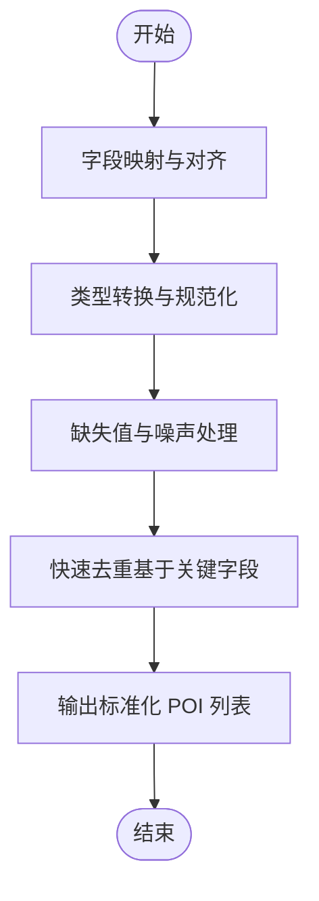

**图表来源**
- [agent/merger.ts](file://agent/merger.ts)

**章节来源**
- [agent/merger.ts](file://agent/merger.ts)

### 去重器（Deduplicator）
职责：
- 基于指纹（如名称、地址、经纬度）与阈值进行重复检测
- 冲突字段选择策略（优先级、最新版本、权威源）
- **更新** 格式归一化：兼容新旧 POI 数据格式，包含分类映射逻辑

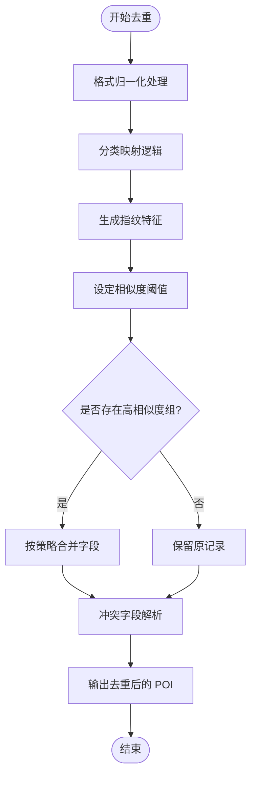

**图表来源**
- [server/dedup.ts](file://server/dedup.ts)

**章节来源**
- [server/dedup.ts](file://server/dedup.ts)

### POI数据格式归一化系统（NormalizePOI）
**更新** 职责：
- 统一新旧 POI 数据格式，确保Spark数据源兼容性
- 将新格式字段映射到旧格式字段
- **新增** 分类映射：娱乐（entertainment）和体验（experience）类别映射到活动（activity）类型
- 解析营业时间格式并提取开放/关闭时间

关键特性：
- 自动检测数据格式（新格式 vs 旧格式）
- 字段映射：namePrimary→name、categoryL1→type、visitDuration→duration
- **重要更新** 分类映射：将娱乐和体验类别统一映射到活动类型，解决113个娱乐POI被隐藏的问题
- 营业时间解析：从operatingHours提取openTime/closeTime
- 向后兼容：支持混合格式数据同时处理

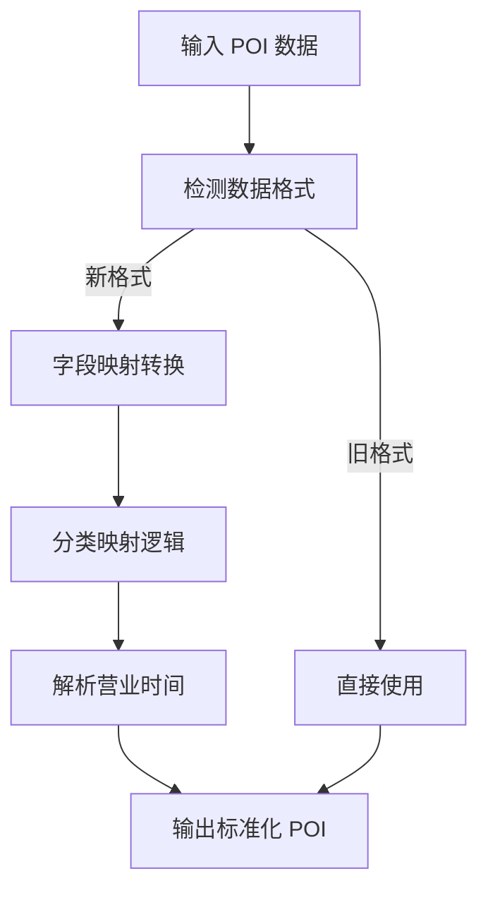

**图表来源**
- [server/dedup.ts](file://server/dedup.ts)

**章节来源**
- [server/dedup.ts](file://server/dedup.ts)

### 分类映射逻辑（娱乐→活动）
**新增** 职责：
- 将娱乐（entertainment）和体验（experience）类别映射到活动（activity）类型
- 解决113个娱乐POI被隐藏的问题
- 前端分类映射逻辑已移动到后端数据处理层面

关键实现：
- 类别映射：rawCat === 'entertainment' || rawCat === 'experience' ? 'activity' : rawCat
- 确保娱乐和体验类POI在系统中正确显示为活动类型
- 与前端分类树保持一致的分类标准

**章节来源**
- [server/dedup.ts](file://server/dedup.ts)

### 质量评估系统（Quality Evaluator）
职责：
- 可信度计算：基于字段完整性、来源权威性、历史一致性
- 完整性检查：必填字段校验、范围校验、格式校验
- 评分算法：加权求和，支持动态权重

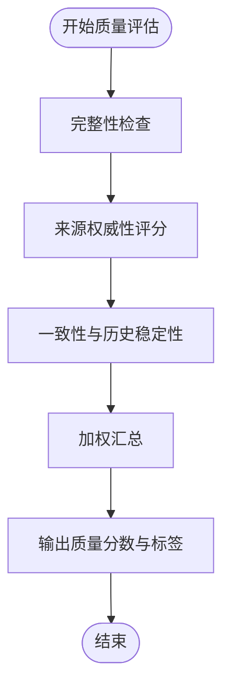

**图表来源**
- [agent/quality.ts](file://agent/quality.ts)

**章节来源**
- [agent/quality.ts](file://agent/quality.ts)
- [wiki/knowledge/scoring-kb.md](file://wiki/knowledge/scoring-kb.md)

### 相似度计算模块（Similarity Calculator）
职责：
- 语义相似度：名称、类别、描述的向量相似度
- 地理位置相似度：基于坐标与距离阈值
- 综合评分：加权融合语义与地理相似度

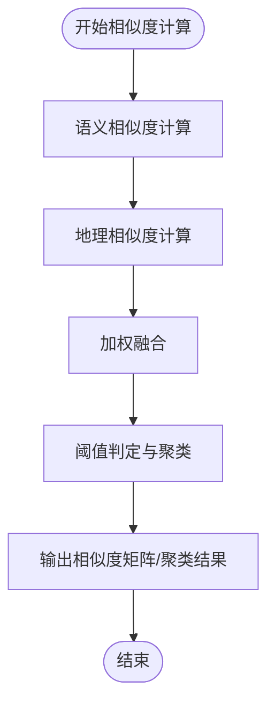

**图表来源**
- [agent/similarity.ts](file://agent/similarity.ts)

**章节来源**
- [agent/similarity.ts](file://agent/similarity.ts)

### 重评分机制（Rescoring）
职责：
- 结合质量分数与相似度结果，调整 POI 权重
- 支持多轮迭代与阈值调节

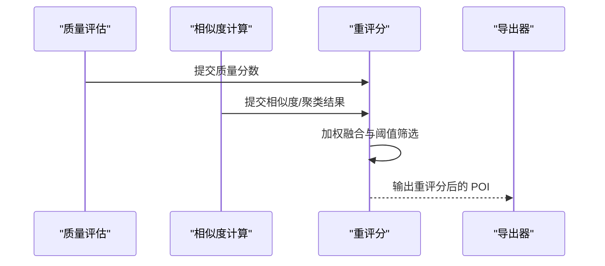

**图表来源**
- [agent/rescore.ts](file://agent/rescore.ts)
- [agent/quality.ts](file://agent/quality.ts)
- [agent/similarity.ts](file://agent/similarity.ts)
- [agent/exporter.ts](file://agent/exporter.ts)

**章节来源**
- [agent/rescore.ts](file://agent/rescore.ts)

### 翻译服务（Translator）
职责：
- 对名称、地址、描述等文本进行多语言翻译
- 支持目标语言配置与缓存

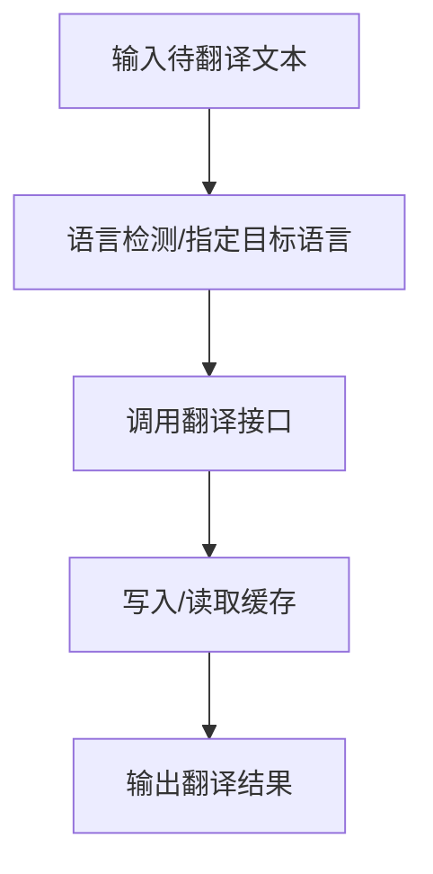

**图表来源**
- [agent/translate.ts](file://agent/translate.ts)

**章节来源**
- [agent/translate.ts](file://agent/translate.ts)

### Spark数据源集成（Spark Collector）
**新增** 职责：
- 使用讯飞星火AI接口生成POI数据
- 实现OpenAI兼容端点调用
- 支持多轮采集与去重机制

关键技术特性：
- OpenAI兼容接口：`https://spark-api-open.xf-yun.com/v1/chat/completions`
- 鉴权方式：Bearer {APIKey}:{APISecret}
- 模型选择：推荐使用lite模型
- 速率限制：基于AGENT_CONFIG.sparkCategoryDelay
- 错误处理：JSON格式修复、超时控制、重试机制

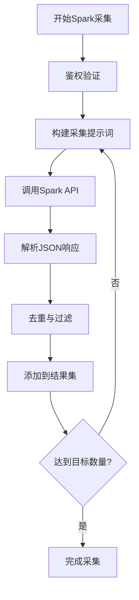

**图表来源**
- [agent/sources/spark.ts](file://agent/sources/spark.ts)

**章节来源**
- [agent/sources/spark.ts](file://agent/sources/spark.ts)

### 数据源适配器（Sources）
职责：
- 统一接口：请求、解析、错误处理
- 特定源扩展：高德、谷歌、OSM、Foursquare、**新增**讯飞星火、豆包、AI 智能体

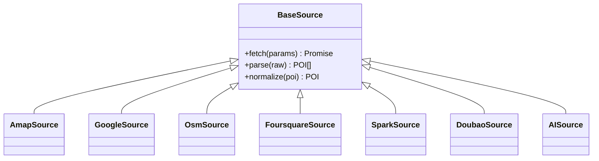

**图表来源**
- [agent/sources/base.ts](file://agent/sources/base.ts)
- [agent/sources/amap.ts](file://agent/sources/amap.ts)
- [agent/sources/google.ts](file://agent/sources/google.ts)
- [agent/sources/osm.ts](file://agent/sources/osm.ts)
- [agent/sources/foursquare.ts](file://agent/sources/foursquare.ts)
- [agent/sources/spark.ts](file://agent/sources/spark.ts)
- [agent/sources/doubao.ts](file://agent/sources/doubao.ts)
- [agent/sources/ai.ts](file://agent/sources/ai.ts)

**章节来源**
- [agent/sources/base.ts](file://agent/sources/base.ts)
- [agent/sources/amap.ts](file://agent/sources/amap.ts)
- [agent/sources/google.ts](file://agent/sources/google.ts)
- [agent/sources/osm.ts](file://agent/sources/osm.ts)
- [agent/sources/foursquare.ts](file://agent/sources/foursquare.ts)
- [agent/sources/spark.ts](file://agent/sources/spark.ts)
- [agent/sources/doubao.ts](file://agent/sources/doubao.ts)
- [agent/sources/ai.ts](file://agent/sources/ai.ts)

### 数据库接口与初始化
职责：
- 表结构定义与迁移
- 连接管理与事务
- 批量写入与查询

**章节来源**
- [agent/db.ts](file://agent/db.ts)
- [agent/init-db.ts](file://agent/init-db.ts)

### 增量更新与导出
职责：
- 增量同步：差异检测与增量写入
- 导出：CSV/JSON/数据库

**章节来源**
- [agent/incremental.ts](file://agent/incremental.ts)
- [agent/exporter.ts](file://agent/exporter.ts)

### 城市覆盖率管理
**扩展** 职责：
- 城市数据双文件架构管理
- 批量城市数据校验与维护
- 城市元数据完整性检查

#### 城市数据双文件架构
项目通过**两个独立 JSON 文件**管理城市数据，运行时合并：

| 文件 | 路径 | 条数 | 职责 |
|------|------|------|------|
| 城市注册表 | `scripts/city-registry.json` | 230 | 城市基础信息、采集顺序 |
| 城市坐标表 | `agent/data/city-coords.json` | 297 | 地理元数据、分类归属 |

**联结键**：两文件均以 `city.id`（小写英文，如 `beijing`、`paris`）作为联结键。

#### 城市数据校验脚本
提供批量城市数据校验功能，确保数据完整性：

```typescript
// 检查所有城市的坐标和地理元数据完整性
import fs from 'fs'
const registry = JSON.parse(fs.readFileSync('scripts/city-registry.json', 'utf-8'))
const coords = JSON.parse(fs.readFileSync('agent/data/city-coords.json', 'utf-8'))

let issues = 0
for (const city of registry) {
  const coord = coords[city.id]
  if (!coord) { console.log(`❌ 缺少坐标: ${city.id}`); issues++; continue }
  if (!coord.continent) { console.log(`⚠️  大洲为空: ${city.id}`); issues++ }
  if (!coord.country) { console.log(`⚠️  国家为空: ${city.id}`); issues++ }
  if (coord.isDomestic && !coord.province) { console.log(`⚠️  国内城市省份为空: ${city.id}`); issues++ }
  if (!coord.lat || !coord.lng) { console.log(`❌ 坐标缺失: ${city.id}`); issues++ }
}
console.log(`\n共 ${registry.length} 城市，发现 ${issues} 个问题`)
```

**章节来源**
- [wiki/knowledge/city-data-kb.md](file://wiki/knowledge/city-data-kb.md)

### POI 数据获取逻辑增强
**更新** 反映了页面大小限制从 20 条调整为 50 条的新容量

职责：
- 支持更大的 POI 显示容量
- 页面大小动态配置
- 服务器端页面大小限制

关键特性：
- 前端页面大小选项：20 条/页 或 50 条/页
- 服务器端页面大小限制：最大 50 条
- 动态页面大小切换不影响查询结果

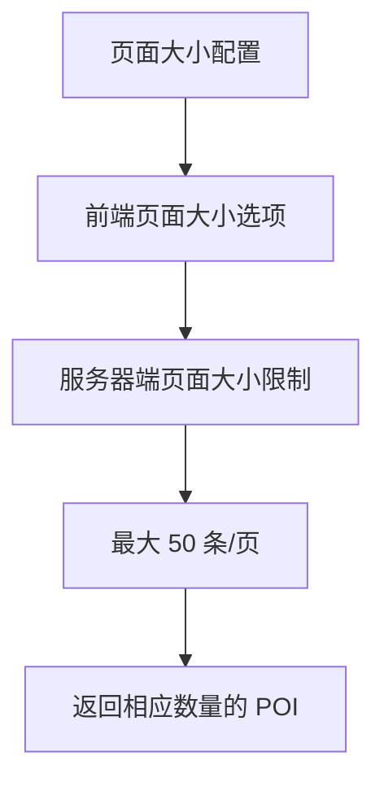

**图表来源**
- [admin/pages/POIBrowser.tsx](file://admin/pages/POIBrowser.tsx)
- [server/admin-routes.ts](file://server/admin-routes.ts)

**章节来源**
- [admin/pages/POIBrowser.tsx](file://admin/pages/POIBrowser.tsx)
- [server/admin-routes.ts](file://server/admin-routes.ts)

## 依赖关系分析
- 组件耦合：合并器为上游核心，下游依赖质量评估、相似度、重评分与翻译
- 数据源耦合：所有数据源继承自统一基类，便于扩展与替换
- **更新** 格式归一化依赖：去重器依赖normalizePOI函数处理新旧格式兼容，包含分类映射逻辑
- **新增** 分类映射依赖：前端分类映射逻辑已移动到后端，确保数据一致性
- 外部依赖：翻译服务、地图/POI API、数据库驱动
- 前端依赖：POI 浏览器页面依赖服务器路由进行数据获取

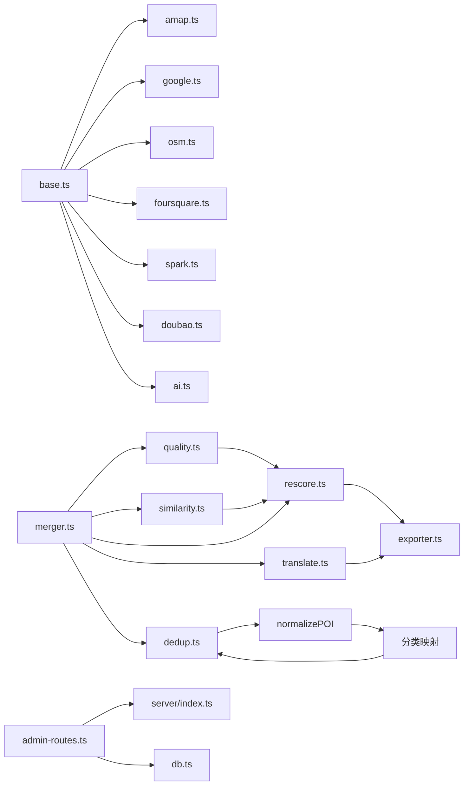

**图表来源**
- [agent/sources/base.ts](file://agent/sources/base.ts)
- [agent/sources/amap.ts](file://agent/sources/amap.ts)
- [agent/sources/google.ts](file://agent/sources/google.ts)
- [agent/sources/osm.ts](file://agent/sources/osm.ts)
- [agent/sources/foursquare.ts](file://agent/sources/foursquare.ts)
- [agent/sources/spark.ts](file://agent/sources/spark.ts)
- [agent/sources/doubao.ts](file://agent/sources/doubao.ts)
- [agent/sources/ai.ts](file://agent/sources/ai.ts)
- [agent/merger.ts](file://agent/merger.ts)
- [agent/quality.ts](file://agent/quality.ts)
- [agent/similarity.ts](file://agent/similarity.ts)
- [agent/rescore.ts](file://agent/rescore.ts)
- [agent/translate.ts](file://agent/translate.ts)
- [server/dedup.ts](file://server/dedup.ts)
- [agent/exporter.ts](file://agent/exporter.ts)
- [server/admin-routes.ts](file://server/admin-routes.ts)

**章节来源**
- [agent/merger.ts](file://agent/merger.ts)
- [agent/quality.ts](file://agent/quality.ts)
- [agent/similarity.ts](file://agent/similarity.ts)
- [agent/rescore.ts](file://agent/rescore.ts)
- [agent/translate.ts](file://agent/translate.ts)
- [server/dedup.ts](file://server/dedup.ts)
- [agent/exporter.ts](file://agent/exporter.ts)
- [agent/sources/base.ts](file://agent/sources/base.ts)
- [server/admin-routes.ts](file://server/admin-routes.ts)

## 性能考虑
- 批处理与分页：对大规模数据采用分批处理与内存限制
- 并发控制：限制并发数，避免 API 限流与资源争用
- 缓存策略：指纹与翻译结果缓存，减少重复计算
- 索引优化：数据库建立必要索引（名称、坐标、来源、时间戳）
- 增量更新：仅处理变更，降低全量扫描成本
- 异步队列：将耗时操作放入队列，提升吞吐
- **页面大小优化**：支持最大 50 条/页的显示容量，平衡加载性能与用户体验
- **Spark数据源优化**：速率限制、批量请求、智能重试机制
- **格式归一化优化**：避免重复转换，缓存转换结果
- **分类映射优化**：在去重阶段统一处理，减少后续处理开销

## 故障排除指南
- 数据源异常：检查网络、鉴权与限流；增加重试与熔断
- 合并冲突：明确字段优先级与来源权威性；记录冲突日志
- 去重误判：调整阈值与指纹特征；引入人工复核
- 质量评估异常：校验评分权重与阈值；回滚至上一版本
- 相似度计算偏差：验证向量化模型与地理阈值；交叉验证
- 翻译失败：切换备用翻译服务；本地缓存兜底
- 导出失败：检查磁盘空间与权限；分段导出
- **页面大小问题**：确认前端页面大小选项与服务器端限制一致，避免超过 50 条/页的请求
- **Spark数据源问题**：检查API密钥配置、网络连接、模型可用性
- **格式兼容性问题**：验证normalizePOI函数对新旧格式的正确处理
- **分类映射问题**：确认娱乐和体验类别已正确映射到活动类型
- **城市数据问题**：使用批量校验脚本检查城市坐标和元数据完整性

**章节来源**
- [agent/quality.ts](file://agent/quality.ts)
- [agent/similarity.ts](file://agent/similarity.ts)
- [agent/translate.ts](file://agent/translate.ts)
- [agent/exporter.ts](file://agent/exporter.ts)
- [admin/pages/POIBrowser.tsx](file://admin/pages/POIBrowser.tsx)
- [server/admin-routes.ts](file://server/admin-routes.ts)
- [agent/sources/spark.ts](file://agent/sources/spark.ts)
- [server/dedup.ts](file://server/dedup.ts)
- [wiki/knowledge/city-data-kb.md](file://wiki/knowledge/city-data-kb.md)

## 结论
该数据处理管道通过模块化设计实现了从多源采集到高质量输出的闭环。合并、去重、质量评估、相似度与重评分、翻译等环节相互协作，既保证了数据一致性与完整性，又提升了可维护性与扩展性。

**主要更新内容**：
- **更新** POI数据格式归一化系统，包含娱乐和体验到活动类型的分类映射修复，解决113个娱乐POI被隐藏的问题
- **新增** 分类映射逻辑，前端分类映射逻辑已移动到后端数据处理层面，确保数据一致性
- **新增** Spark数据源集成，提供讯飞星火AI采集能力
- **扩展** 城市覆盖率管理，通过双文件架构和批量校验脚本提升数据质量
- **增强** 页面显示容量，支持最大50条/页的POI浏览体验

这次更新特别重要，因为它解决了娱乐POI显示问题，通过将娱乐（entertainment）和体验（experience）类别统一映射到活动（activity）类型，确保了用户界面的一致性和完整性。前端分类映射逻辑的后端化进一步提升了系统的可靠性和可维护性。

建议持续完善阈值与权重策略，并加强监控与告警体系。新增的Spark数据源为项目提供了更强的数据采集能力，而格式归一化系统和分类映射逻辑确保了系统的向后兼容性和稳定性。

## 附录

### 数据处理流程示例（输入/输出与步骤）
- 输入：
  - 多数据源 POI 列表（名称、地址、经纬度、类别、描述、来源、时间戳等）
  - **新增** Spark数据源生成的POI数据（新格式字段，包含娱乐和体验类别）
  - 页面大小配置（默认 20 条/页，支持最大 50 条/页）
- 步骤：
  - 合并：字段对齐与清洗
  - 去重：基于指纹与阈值
  - **更新** 格式归一化：统一新旧POI格式，包含分类映射逻辑
  - **新增** 分类映射：娱乐和体验类别映射到活动类型
  - 质量评估：完整性、权威性、一致性评分
  - 相似度计算：语义与地理相似度融合
  - 重评分：加权筛选与阈值调整
  - 翻译：多语言文本处理
  - 导出：标准化输出
- 输出：
  - 标准化 POI 列表（含质量分数、相似度、翻译文本、去重标记等）
  - 支持不同页面大小的分页结果
  - **新增** 正确分类的POI列表，娱乐和体验类POI已映射到活动类型

**章节来源**
- [agent/merger.ts](file://agent/merger.ts)
- [server/dedup.ts](file://server/dedup.ts)
- [agent/quality.ts](file://agent/quality.ts)
- [agent/similarity.ts](file://agent/similarity.ts)
- [agent/rescore.ts](file://agent/rescore.ts)
- [agent/translate.ts](file://agent/translate.ts)
- [agent/exporter.ts](file://agent/exporter.ts)
- [admin/pages/POIBrowser.tsx](file://admin/pages/POIBrowser.tsx)

### 批量与城市级处理脚本
- 城市级合并：对全国城市执行批量合并与导出
- 国内城市抓取：分批次抓取国内城市数据
- 增量刷新：每日定时增量同步
- **新增** 城市数据校验：批量检查城市坐标和元数据完整性

**章节来源**
- [scripts/merge-all-cities.ts](file://scripts/merge-all-cities.ts)
- [scripts/fetch-domestic-cities.ts](file://scripts/fetch-domestic-cities.ts)
- [scripts/fetch-domestic-extra.ts](file://scripts/fetch-domestic-extra.ts)
- [scripts/fetch-domestic-final.ts](file://scripts/fetch-domestic-final.ts)
- [wiki/knowledge/city-data-kb.md](file://wiki/knowledge/city-data-kb.md)

### 知识库与原则
- 评分知识库：评分维度与权重参考
- 原则文档：数据治理与质量原则
- **新增** 城市数据管理知识库：双文件架构与数据校验流程
- **更新** 分类映射原则：娱乐和体验类别到活动类型的映射规则

**章节来源**
- [wiki/knowledge/scoring-kb.md](file://wiki/knowledge/scoring-kb.md)
- [wiki/principles.md](file://wiki/principles.md)
- [wiki/knowledge/city-data-kb.md](file://wiki/knowledge/city-data-kb.md)