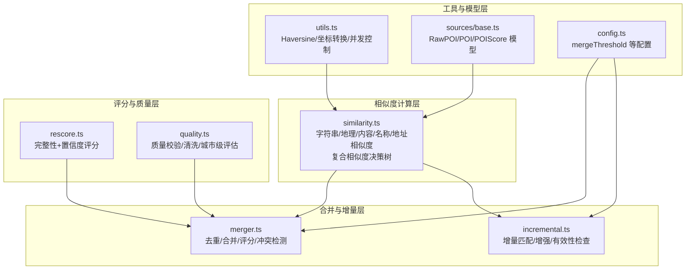
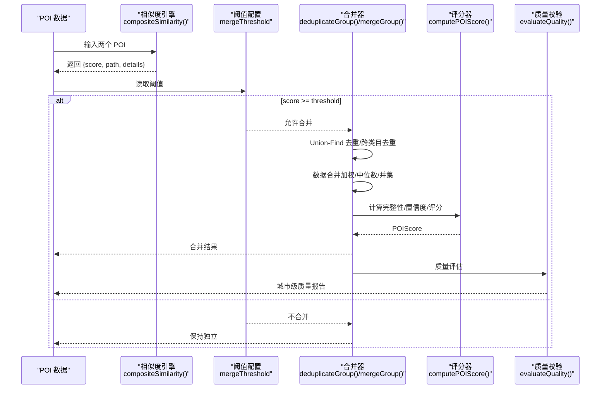
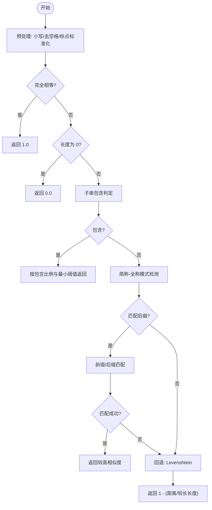
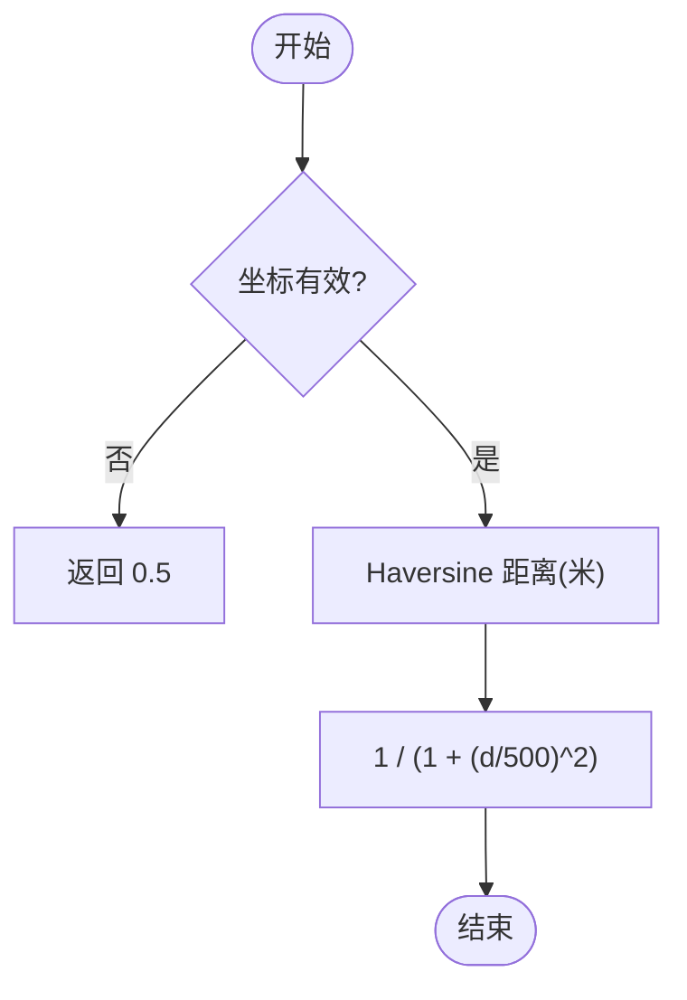
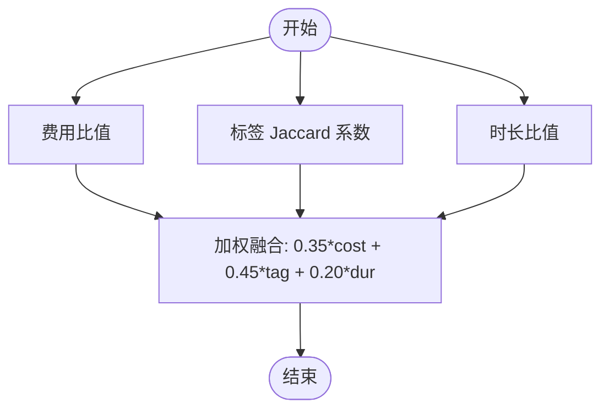
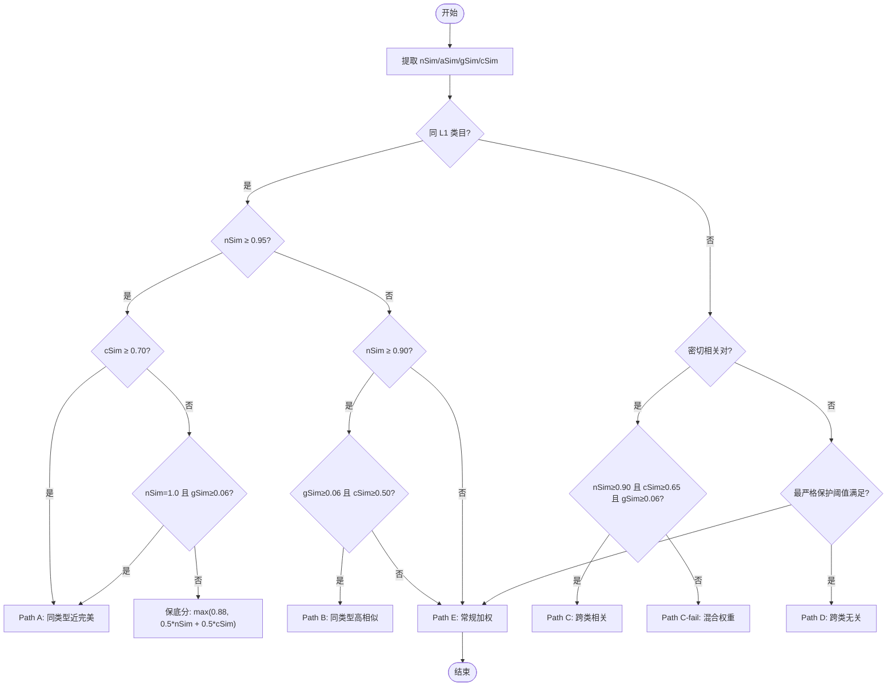
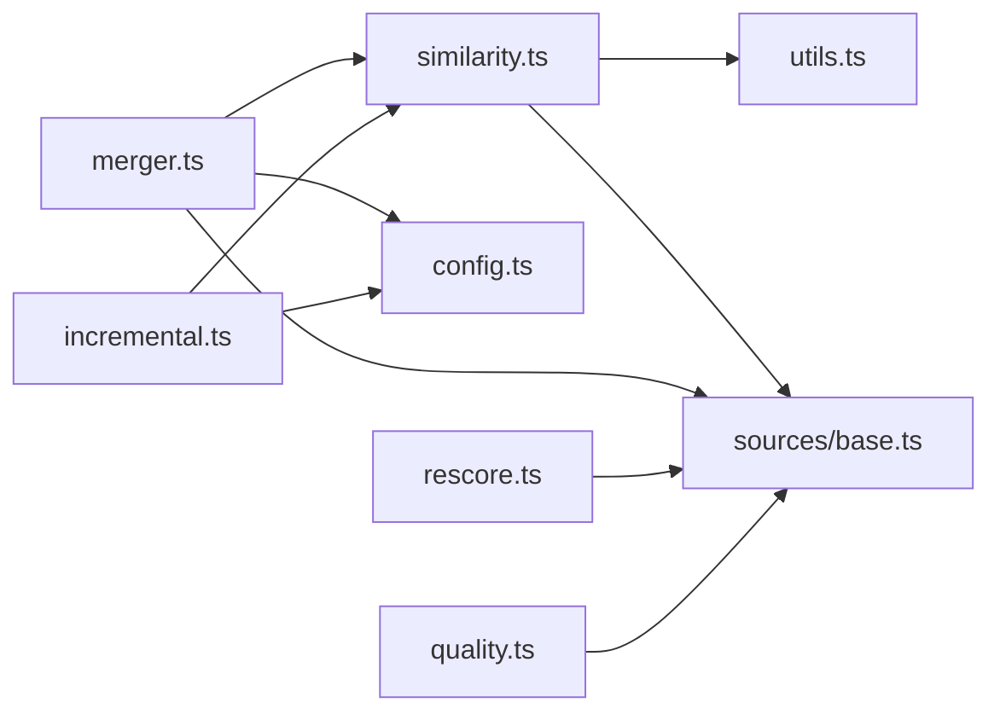

# 相似度计算模块

<cite>
**本文引用的文件**
- [agent/similarity.ts](file://agent/similarity.ts)
- [agent/merger.ts](file://agent/merger.ts)
- [agent/incremental.ts](file://agent/incremental.ts)
- [agent/utils.ts](file://agent/utils.ts)
- [agent/sources/base.ts](file://agent/sources/base.ts)
- [agent/config.ts](file://agent/config.ts)
- [agent/rescore.ts](file://agent/rescore.ts)
- [agent/quality.ts](file://agent/quality.ts)
</cite>

## 目录
1. [简介](#简介)
2. [项目结构](#项目结构)
3. [核心组件](#核心组件)
4. [架构总览](#架构总览)
5. [详细组件分析](#详细组件分析)
6. [依赖分析](#依赖分析)
7. [性能考虑](#性能考虑)
8. [故障排查指南](#故障排查指南)
9. [结论](#结论)
10. [附录](#附录)

## 简介
本技术文档聚焦于相似度计算模块，系统阐述复合相似度算法的设计与实现，涵盖字符串相似度、地理位置相似度、内容相似度以及综合评分路径决策。文档还解释了语义相似度计算方法（编辑距离、Jaccard 系数、余弦相似度的适用场景与替代策略）、地理相似度的计算公式（哈夫曼距离、经纬度误差与地理范围判断）、相似度阈值的设定原则与动态调整策略，并提供完整的计算示例与性能优化建议。

## 项目结构
相似度计算模块位于 agent 目录下，核心文件如下：
- agent/similarity.ts：字符串相似度、地理相似度、内容相似度、名称相似度、地址相似度与复合相似度决策树
- agent/merger.ts：多源数据合并流水线，调用复合相似度进行去重与合并
- agent/incremental.ts：增量更新流程，复用复合相似度进行匹配与增强
- agent/utils.ts：通用工具（Haversine 距离、坐标转换、并发控制等）
- agent/sources/base.ts：数据模型定义（RawPOI、POI、POIScore 等）
- agent/config.ts：运行参数与阈值配置（含 mergeThreshold）
- agent/rescore.ts：为已有 POI 数据补充评分（完整性与置信度）
- agent/quality.ts：数据质量校验与清洗（坐标有效性、字段合理性）

图表来源
- [agent/similarity.ts:1-414](file://agent/similarity.ts#L1-L414)
- [agent/merger.ts:1-800](file://agent/merger.ts#L1-L800)
- [agent/incremental.ts:160-359](file://agent/incremental.ts#L160-L359)
- [agent/utils.ts:1-191](file://agent/utils.ts#L1-L191)
- [agent/sources/base.ts:1-252](file://agent/sources/base.ts#L1-L252)
- [agent/config.ts:62-77](file://agent/config.ts#L62-L77)
- [agent/rescore.ts:1-158](file://agent/rescore.ts#L1-L158)
- [agent/quality.ts:1-344](file://agent/quality.ts#L1-L344)

章节来源
- [agent/similarity.ts:1-414](file://agent/similarity.ts#L1-L414)
- [agent/merger.ts:1-800](file://agent/merger.ts#L1-L800)
- [agent/incremental.ts:160-359](file://agent/incremental.ts#L160-L359)
- [agent/utils.ts:1-191](file://agent/utils.ts#L1-L191)
- [agent/sources/base.ts:1-252](file://agent/sources/base.ts#L1-L252)
- [agent/config.ts:62-77](file://agent/config.ts#L62-L77)
- [agent/rescore.ts:1-158](file://agent/rescore.ts#L1-L158)
- [agent/quality.ts:1-344](file://agent/quality.ts#L1-L344)

## 核心组件
- 字符串相似度（0-1）：包含预处理、子串包含判定、简称-全称模式检测、回退到编辑距离（Levenshtein）的多阶段策略
- 地理相似度（0-1）：基于 Haversine 距离的柔和衰减函数，无效坐标返回中性值
- 内容相似度（0-1）：费用比值、标签 Jaccard 系数、时长比值的加权融合
- 名称相似度（0-1）：三轨比对（主名、中文、英文），取最大值
- 地址相似度（0-1）：本地地址与英文地址分别比对，取较大值，都空返回中性值
- 复合相似度（0-1）：五路径决策树，结合类目关系、地理距离、内容一致性与名称相似度，输出路径与细节

章节来源
- [agent/similarity.ts:118-172](file://agent/similarity.ts#L118-L172)
- [agent/similarity.ts:196-203](file://agent/similarity.ts#L196-L203)
- [agent/similarity.ts:212-243](file://agent/similarity.ts#L212-L243)
- [agent/similarity.ts:259-271](file://agent/similarity.ts#L259-L271)
- [agent/similarity.ts:281-296](file://agent/similarity.ts#L281-L296)
- [agent/similarity.ts:331-400](file://agent/similarity.ts#L331-L400)

## 架构总览
复合相似度在合并与增量流程中被广泛使用，通过阈值控制合并行为，并在合并后进行评分与质量评估。

图表来源
- [agent/similarity.ts:331-400](file://agent/similarity.ts#L331-L400)
- [agent/merger.ts:546-604](file://agent/merger.ts#L546-L604)
- [agent/merger.ts:676-789](file://agent/merger.ts#L676-L789)
- [agent/merger.ts:474-490](file://agent/merger.ts#L474-L490)
- [agent/quality.ts:189-293](file://agent/quality.ts#L189-L293)
- [agent/config.ts:62-77](file://agent/config.ts#L62-L77)

## 详细组件分析

### 字符串相似度（编辑距离、简称-全称、回退策略）
- 预处理：统一大小写、去除空格与特定标点、括号标准化
- 子串包含：当较长字符串包含较短字符串时，按包含比例与最小阈值返回相似度
- 简称-全称：针对常见地理后缀词典，检测“前缀/后缀”匹配模式，返回较高相似度
- 回退：使用优化的单行动态规划实现的 Levenshtein 编辑距离，相似度 = 1 - (距离/较长长度)

图表来源
- [agent/similarity.ts:118-172](file://agent/similarity.ts#L118-L172)

章节来源
- [agent/similarity.ts:118-172](file://agent/similarity.ts#L118-L172)

### 地理相似度（哈夫曼距离与柔和衰减）
- 使用 Haversine 公式计算两点间球面距离（单位：米）
- 柔和衰减函数：以 500 米为特征尺度，距离越近相似度越高，无效坐标返回 0.5

图表来源
- [agent/similarity.ts:176-203](file://agent/similarity.ts#L176-L203)
- [agent/utils.ts:11-21](file://agent/utils.ts#L11-L21)

章节来源
- [agent/similarity.ts:176-203](file://agent/similarity.ts#L176-L203)
- [agent/utils.ts:11-21](file://agent/utils.ts#L11-L21)

### 内容相似度（费用/标签/时长）
- 费用比值：两数皆非零时取较小值/较大值；一零一非零时为 0；两零时为 1
- 标签 Jaccard 系数：集合交集/并集，空并集时返回 0.5
- 时长比值：两数皆正时取较小值/较大值；否则返回 0.5
- 加权融合：费用(35%) + 标签(45%) + 时长(20%)

图表来源
- [agent/similarity.ts:212-243](file://agent/similarity.ts#L212-L243)

章节来源
- [agent/similarity.ts:212-243](file://agent/similarity.ts#L212-L243)

### 名称相似度与地址相似度
- 名称相似度：对主名、中文名、英文名分别计算字符串相似度，取最大值
- 地址相似度：分别对本地地址与英文地址计算字符串相似度，取较大者；都为空返回 0.5

章节来源
- [agent/similarity.ts:259-271](file://agent/similarity.ts#L259-L271)
- [agent/similarity.ts:281-296](file://agent/similarity.ts#L281-L296)

### 复合相似度决策树（五路径）
- 同 L1 类目
  - 近完美同名（≥0.95）：需内容 ≥0.70；否则在名称完全一致且地理距离合适时仍可合并；内容缺失时给予保底分
  - 高相似名（0.90-0.95）：需地理 ≤2km 且内容 ≥0.50，否则降级到常规路径
  - 常规加权：name×0.45 + addr×0.25 + geo×0.30
- 跨 L1 类目（密切相关对 scenic/experience、entertainment/experience、food/experience）
  - 需名称 ≥0.90、内容 ≥0.65、地理 ≤2km；否则按混合权重计算
- 跨 L1 非相关对：最严格保护（0.95 + 0.80 + 0.20）
- 常规加权：name×0.20 + content×0.30 + addr×0.20 + geo×0.30

图表来源
- [agent/similarity.ts:331-400](file://agent/similarity.ts#L331-L400)

章节来源
- [agent/similarity.ts:331-400](file://agent/similarity.ts#L331-L400)

### 相似度阈值设定与动态调整
- 全局阈值：mergeThreshold（默认 0.90），用于合并与增量匹配
- 增量验证：checkValidity 使用较低阈值（0.85）进行有效性检查
- 跨类目阈值：crossCategoryThreshold（默认 0.90），允许密切相关类目的跨类合并
- AI 数据特殊处理：在分类器中对 AI 数据采用更低阈值以避免误判

章节来源
- [agent/config.ts:62-77](file://agent/config.ts#L62-L77)
- [agent/incremental.ts:252-274](file://agent/incremental.ts#L252-L274)
- [agent/merger.ts:956-958](file://agent/merger.ts#L956-L958)

### 相似度计算示例（输入-过程-输出）
- 输入参数
  - 名称：主名、中文名、英文名
  - 地址：本地地址、英文地址
  - 地理坐标：纬度、经度
  - 内容：评分、费用、时长、标签、描述、最佳季节、月度指数
- 计算过程
  - 字符串相似度：预处理 → 子串包含 → 简称-全称 → Levenshtein
  - 地理相似度：Haversine 距离 → 柔和衰减
  - 内容相似度：费用/标签/时长比值 → 加权融合
  - 名称/地址相似度：三轨/双语比对取最大值
  - 复合相似度：决策树路径选择与阈值判定
- 输出结果
  - 复合相似度得分（0-1）、触发路径、各维度得分详情

章节来源
- [agent/similarity.ts:17-37](file://agent/similarity.ts#L17-L37)
- [agent/similarity.ts:118-172](file://agent/similarity.ts#L118-L172)
- [agent/similarity.ts:196-203](file://agent/similarity.ts#L196-L203)
- [agent/similarity.ts:212-243](file://agent/similarity.ts#L212-L243)
- [agent/similarity.ts:259-296](file://agent/similarity.ts#L259-L296)
- [agent/similarity.ts:331-400](file://agent/similarity.ts#L331-L400)

## 依赖分析
- 相似度引擎依赖
  - 字符串相似度依赖编辑距离实现与地理后缀词典
  - 地理相似度依赖 Haversine 距离工具
  - 内容相似度依赖 RawPOI 字段（费用、标签、时长）
  - 名称/地址相似度依赖字符串相似度
  - 复合相似度依赖类目关系判定与阈值配置
- 合并与增量流程依赖
  - 合并器：Union-Find 去重、跨类目去重、数据合并、评分计算
  - 增量器：匹配最佳现有 POI、增强已有 POI、有效性检查
- 工具与模型
  - Haversine 距离、坐标转换、并发控制
  - RawPOI/POI/POIScore 数据模型
  - 配置项 mergeThreshold、crossCategoryThreshold

图表来源
- [agent/similarity.ts:13-13](file://agent/similarity.ts#L13-L13)
- [agent/merger.ts:12-27](file://agent/merger.ts#L12-L27)
- [agent/incremental.ts:160-169](file://agent/incremental.ts#L160-L169)
- [agent/utils.ts:11-21](file://agent/utils.ts#L11-L21)
- [agent/sources/base.ts:42-87](file://agent/sources/base.ts#L42-L87)
- [agent/config.ts:62-77](file://agent/config.ts#L62-L77)
- [agent/rescore.ts:11-16](file://agent/rescore.ts#L11-L16)
- [agent/quality.ts:8-11](file://agent/quality.ts#L8-L11)

章节来源
- [agent/similarity.ts:1-414](file://agent/similarity.ts#L1-L414)
- [agent/merger.ts:1-800](file://agent/merger.ts#L1-L800)
- [agent/incremental.ts:160-359](file://agent/incremental.ts#L160-L359)
- [agent/utils.ts:1-191](file://agent/utils.ts#L1-L191)
- [agent/sources/base.ts:1-252](file://agent/sources/base.ts#L1-L252)
- [agent/config.ts:62-77](file://agent/config.ts#L62-L77)
- [agent/rescore.ts:1-158](file://agent/rescore.ts#L1-L158)
- [agent/quality.ts:1-344](file://agent/quality.ts#L1-L344)

## 性能考虑
- 时间复杂度
  - 字符串相似度：预处理 O(m+n)，子串包含 O(min(m,n))，简称-全称 O(k)（k 为后缀词典大小），Levenshtein O(mn)
  - 地理相似度：O(1)
  - 内容相似度：费用/时长比值 O(1)，标签 Jaccard 系数 O(|A|+|B|)（集合操作）
  - 复合相似度：O(1)（各子相似度 O(1) 或 O(mn)）
- 空间复杂度
  - Levenshtein 使用单行 DP，空间 O(min(m,n))
  - 标签集合操作 O(|A|+|B|)
- 优化策略
  - 预过滤：先剔除无效 POI（坐标为 (0,0)、名称过短或纯数字）以减少后续计算
  - 地理预分桶：将坐标四舍五入到 0.01°（约 1.1km）作为桶键，仅在同桶/邻桶内两两比较，显著降低比较次数
  - 早停：在字符串相似度中优先进行快速判定（相等、空串、子串包含、简称-全称），减少昂贵的编辑距离计算
  - 并发控制：使用并发池与速率限制器控制外部 API 请求，避免超时与限流
  - 缓存：城市信息与类目映射可缓存，减少重复加载

章节来源
- [agent/similarity.ts:44-73](file://agent/similarity.ts#L44-L73)
- [agent/merger.ts:529-542](file://agent/merger.ts#L529-L542)
- [agent/merger.ts:546-596](file://agent/merger.ts#L546-L596)
- [agent/utils.ts:79-106](file://agent/utils.ts#L79-L106)
- [agent/utils.ts:110-123](file://agent/utils.ts#L110-L123)

## 故障排查指南
- 常见问题
  - 名称无效：名称为空、长度小于等于 1、仅包含数字
  - 地理坐标异常：(0,0) 或超出城市中心 100km
  - 地址缺失：本地地址与英文地址均为空
  - 字段不合理：评分不在 1-5、费用为负、时长过短或过长
- 自动修复
  - 评分、费用、时长、坐标精度与月度指数进行范围约束与规范化
- 质量评估
  - 城市级报告包含完整性、准确性、丰富度、多样性四个维度，便于定位问题领域

章节来源
- [agent/similarity.ts:407-413](file://agent/similarity.ts#L407-L413)
- [agent/quality.ts:23-125](file://agent/quality.ts#L23-L125)
- [agent/quality.ts:135-154](file://agent/quality.ts#L135-L154)
- [agent/quality.ts:189-293](file://agent/quality.ts#L189-L293)

## 结论
相似度计算模块通过多阶段字符串相似度、地理相似度与内容相似度的协同，结合严格的阈值与路径决策，实现了高精度的去重与合并。模块在工程上具备良好的可维护性与扩展性，支持增量更新、跨类目合并与评分质量评估。通过地理预分桶、早停策略与并发控制，整体性能表现优异，适用于大规模 POI 数据的去重与合并场景。

## 附录
- 数据模型要点
  - RawPOI：包含名称三轨、地址双语、地理坐标、评分、费用、时长、标签、描述、最佳季节、月度指数、来源标识
  - POI：最终格式，包含类目层级、图片 URL、推荐理由、体验项目等
  - POIScore：完整性、置信度、来源数量与冲突字段数
- 评分与质量
  - 完整度权重：核心四要素（3分）、重要字段（1分）、锦上添花（0.5分）
  - 置信度：单源奖励、多源一致性与冲突惩罚
  - 城市级质量：完整性、准确性、丰富度、多样性综合评分

章节来源
- [agent/sources/base.ts:42-87](file://agent/sources/base.ts#L42-L87)
- [agent/sources/base.ts:121-177](file://agent/sources/base.ts#L121-L177)
- [agent/rescore.ts:22-54](file://agent/rescore.ts#L22-L54)
- [agent/rescore.ts:56-61](file://agent/rescore.ts#L56-L61)
- [agent/rescore.ts:63-85](file://agent/rescore.ts#L63-L85)
- [agent/quality.ts:210-271](file://agent/quality.ts#L210-L271)