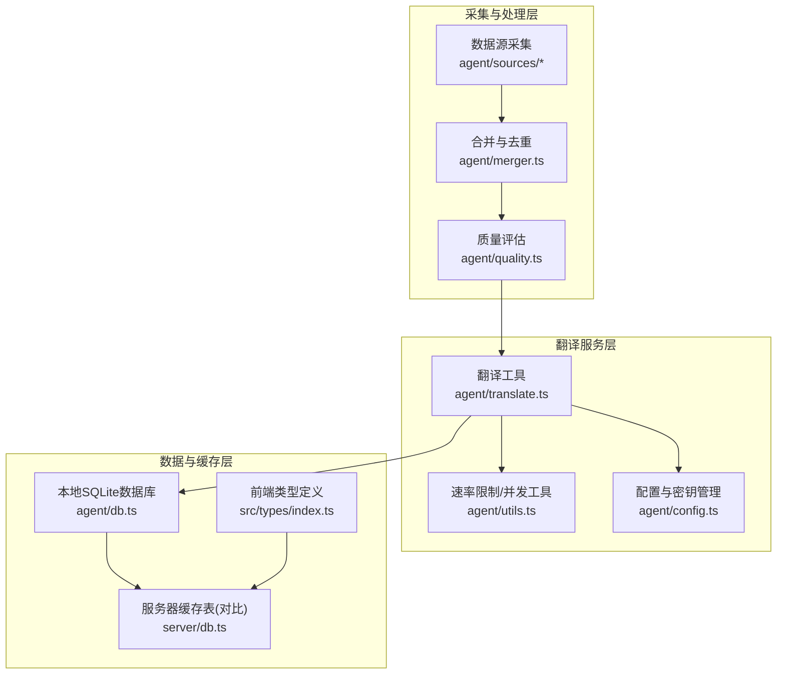
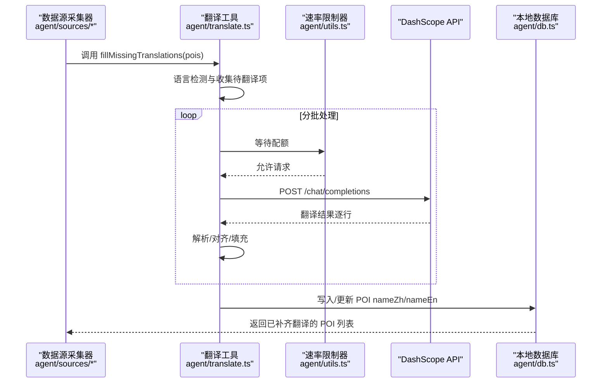
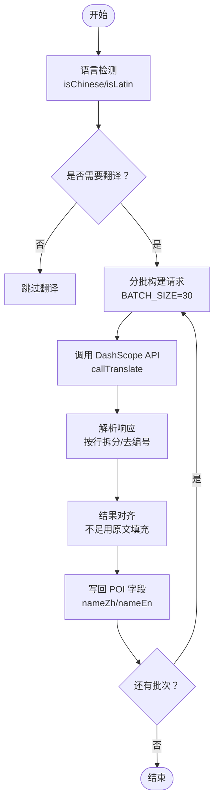
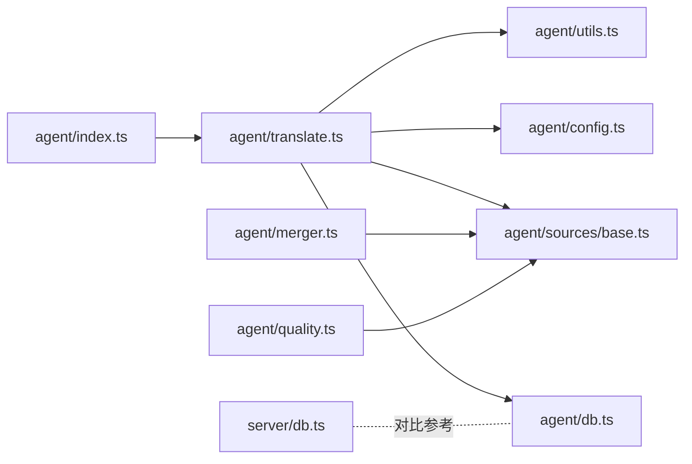

# 翻译服务

<cite>
**本文引用的文件**
- [agent/translate.ts](file://agent/translate.ts)
- [agent/utils.ts](file://agent/utils.ts)
- [agent/config.ts](file://agent/config.ts)
- [agent/sources/base.ts](file://agent/sources/base.ts)
- [agent/quality.ts](file://agent/quality.ts)
- [agent/db.ts](file://agent/db.ts)
- [agent/index.ts](file://agent/index.ts)
- [agent/merger.ts](file://agent/merger.ts)
- [src/types/index.ts](file://src/types/index.ts)
- [server/db.ts](file://server/db.ts)
</cite>

## 目录
1. [简介](#简介)
2. [项目结构](#项目结构)
3. [核心组件](#核心组件)
4. [架构概览](#架构概览)
5. [详细组件分析](#详细组件分析)
6. [依赖分析](#依赖分析)
7. [性能考虑](#性能考虑)
8. [故障排查指南](#故障排查指南)
9. [结论](#结论)
10. [附录](#附录)

## 简介
本文件面向“翻译服务”的技术文档，聚焦于 POI 名称的双语化处理机制与实现细节，涵盖中英对照表、自动翻译与人工校验流程、翻译质量评估标准、缓存策略与性能优化、多语言支持的端到端流程（文本提取、翻译执行、回写更新），以及完整的使用示例与扩展性建议。翻译服务基于 DashScope（通义千问）实现，采用批量化请求与速率限制，确保稳定与高效。

## 项目结构
翻译服务位于 agent 子模块中，围绕以下关键文件展开：
- 翻译入口与实现：agent/translate.ts
- 速率限制与并发工具：agent/utils.ts
- 配置与 API Key 管理：agent/config.ts
- 数据模型与字段定义：agent/sources/base.ts
- 质量评估与一致性保障：agent/quality.ts
- 本地数据库与缓存：agent/db.ts
- CLI 流程编排与调用链：agent/index.ts
- 标签双语化与一致性：agent/merger.ts
- 前端类型定义（与翻译字段相关）：src/types/index.ts
- 服务器侧缓存表结构（对比参考）：server/db.ts

图表来源
- [agent/translate.ts:1-195](file://agent/translate.ts#L1-L195)
- [agent/utils.ts:108-129](file://agent/utils.ts#L108-L129)
- [agent/config.ts:20-28](file://agent/config.ts#L20-L28)
- [agent/db.ts:34-131](file://agent/db.ts#L34-L131)
- [server/db.ts:42-118](file://server/db.ts#L42-L118)
- [agent/merger.ts:183-208](file://agent/merger.ts#L183-L208)
- [src/types/index.ts:77-100](file://src/types/index.ts#L77-L100)

章节来源
- [agent/translate.ts:1-195](file://agent/translate.ts#L1-L195)
- [agent/utils.ts:108-129](file://agent/utils.ts#L108-L129)
- [agent/config.ts:20-28](file://agent/config.ts#L20-L28)
- [agent/db.ts:34-131](file://agent/db.ts#L34-L131)
- [server/db.ts:42-118](file://server/db.ts#L42-L118)
- [agent/merger.ts:183-208](file://agent/merger.ts#L183-L208)
- [src/types/index.ts:77-100](file://src/types/index.ts#L77-L100)

## 核心组件
- 翻译工具（fillMissingTranslations）：根据主名称语言特征，自动补齐缺失的 nameZh 与 nameEn，并以批处理方式调用 DashScope API。
- 语言检测（isChinese / isLatin）：基于 Unicode 区间与字母占比判断文本语言，避免对已为中文/英文的名称重复翻译。
- 批量翻译（batchTranslate）：构造统一提示词，调用 callTranslate，解析返回结果并对齐输出长度。
- 速率限制（RateLimiter）：保证翻译请求频率不超过设定阈值，避免触发上游限流。
- 配置与密钥（API Keys）：集中管理 DashScope 等第三方 API 的密钥与超时参数。
- 质量评估（evaluateQuality）：在翻译后进行一致性与完整性检查，作为人工校验的依据。
- 标签双语化（bilingualizeTag）：将单语标签转换为“中文|English”格式，提升一致性与可读性。
- 数据模型（RawPOI/POI）：定义 namePrimary、nameZh、nameEn 等字段，支撑翻译与质量评估。

章节来源
- [agent/translate.ts:24-36](file://agent/translate.ts#L24-L36)
- [agent/translate.ts:92-110](file://agent/translate.ts#L92-L110)
- [agent/translate.ts:122-195](file://agent/translate.ts#L122-L195)
- [agent/utils.ts:110-123](file://agent/utils.ts#L110-L123)
- [agent/config.ts:20-28](file://agent/config.ts#L20-L28)
- [agent/quality.ts:189-293](file://agent/quality.ts#L189-L293)
- [agent/merger.ts:183-208](file://agent/merger.ts#L183-L208)
- [agent/sources/base.ts:42-87](file://agent/sources/base.ts#L42-L87)

## 架构概览
翻译服务在采集流程中被多数据源调用，形成如下端到端链路：

图表来源
- [agent/translate.ts:122-195](file://agent/translate.ts#L122-L195)
- [agent/utils.ts:110-123](file://agent/utils.ts#L110-L123)
- [agent/db.ts:135-150](file://agent/db.ts#L135-L150)

章节来源
- [agent/translate.ts:122-195](file://agent/translate.ts#L122-L195)
- [agent/utils.ts:110-123](file://agent/utils.ts#L110-L123)
- [agent/db.ts:135-150](file://agent/db.ts#L135-L150)

## 详细组件分析

### 翻译工具与流程
- 输入：RawPOI[]，包含 namePrimary、nameZh、nameEn 等字段。
- 语言检测：isChinese / isLatin 基于 Unicode 与字母占比，过滤已为目标语言的名称。
- 批处理：BATCH_SIZE=30，分批调用 batchTranslate，降低 API 调用次数。
- 提示词设计：统一指令，要求“逐行输出、不要编号”，便于解析与对齐。
- 结果解析：按换行拆分，去除编号前缀，不足部分用原文填充，保证一一对应。
- 错误处理：HTTP 异常与超时处理，失败批次记录日志并跳过，不影响整体流程。

图表来源
- [agent/translate.ts:24-36](file://agent/translate.ts#L24-L36)
- [agent/translate.ts:92-110](file://agent/translate.ts#L92-L110)
- [agent/translate.ts:122-195](file://agent/translate.ts#L122-L195)

章节来源
- [agent/translate.ts:24-36](file://agent/translate.ts#L24-L36)
- [agent/translate.ts:92-110](file://agent/translate.ts#L92-L110)
- [agent/translate.ts:122-195](file://agent/translate.ts#L122-L195)

### 速率限制与并发控制
- RateLimiter：基于固定间隔等待，确保翻译请求频率不超过 2 req/s。
- delay：批次间短暂延时，缓解上游压力与突发流量。
- 并发控制：在采集阶段由 runWithConcurrency 控制城市级并发，翻译阶段通过速率限制器控制 API 请求节奏。

章节来源
- [agent/utils.ts:110-123](file://agent/utils.ts#L110-L123)
- [agent/utils.ts:127-129](file://agent/utils.ts#L127-L129)
- [agent/index.ts:342-343](file://agent/index.ts#L342-L343)

### 配置与密钥管理
- API Keys：集中从环境变量加载 DashScope 等密钥，未配置时跳过翻译。
- 超时与间隔：配置翻译请求超时与各数据源的请求间隔，平衡稳定性与吞吐。
- 城市与导出路径：统一管理数据库路径、导出文件路径等运行参数。

章节来源
- [agent/config.ts:20-28](file://agent/config.ts#L20-L28)
- [agent/config.ts:37-53](file://agent/config.ts#L37-L53)
- [agent/config.ts:127-181](file://agent/config.ts#L127-L181)

### 数据模型与字段定义
- RawPOI：采集阶段的原始 POI，包含 namePrimary、nameZh、nameEn、address、addressEn 等。
- POI：最终网站使用的 POI，字段更丰富，包含评分、标签、月度指数等。
- 前端类型：Attraction 等类型包含 name、nameZh 等字段，体现翻译结果在前端的使用。

章节来源
- [agent/sources/base.ts:42-87](file://agent/sources/base.ts#L42-L87)
- [agent/sources/base.ts:121-177](file://agent/sources/base.ts#L121-L177)
- [src/types/index.ts:77-100](file://src/types/index.ts#L77-L100)

### 质量评估与一致性保障
- 评分维度：完整性、准确性、丰富度、多样性，综合得出总体评分。
- 一致性检查：坐标合理性、名称有效性、类目一致性（结合分类器）。
- 翻译后评估：nameZh/nameEn 缺失计数、自动修复（如精度、范围约束）。
- 发布标准：按城市与类目的合格率门槛，确保上线质量。

章节来源
- [agent/quality.ts:189-293](file://agent/quality.ts#L189-L293)
- [agent/quality.ts:236-271](file://agent/quality.ts#L236-L271)

### 标签双语化与术语统一
- bilingualizeTag：将单语标签转换为“中文|English”格式；若映射表存在则补全；否则按纯中文/纯英文简单复制。
- bilingualizeTags：批量应用，过滤空值，提升一致性与可读性。
- 与翻译协同：在翻译完成后，标签双语化进一步统一术语表达，便于人工校验与发布。

章节来源
- [agent/merger.ts:183-208](file://agent/merger.ts#L183-L208)

### 缓存策略与性能优化
- 本地数据库缓存：city_pois 表按城市分组存储 POI 数据，支持版本号与更新时间，便于增量与回放。
- 服务器侧缓存：服务器端也有 city_pois 表（简化版），用于前端缓存与查询。
- 性能优化点：
  - 批量翻译：BATCH_SIZE=30，减少 API 调用次数。
  - 速率限制：固定间隔等待，避免触发上游限流。
  - 结果对齐：不足用原文填充，避免下游解析失败。
  - 语言检测：提前过滤，减少无效请求。

章节来源
- [agent/db.ts:34-131](file://agent/db.ts#L34-L131)
- [server/db.ts:42-118](file://server/db.ts#L42-L118)
- [agent/translate.ts:19](file://agent/translate.ts#L19)
- [agent/utils.ts:110-123](file://agent/utils.ts#L110-L123)

### 多语言支持的实现方式
- 文本提取：从各数据源采集的 RawPOI 中提取 namePrimary 作为翻译源。
- 翻译执行：根据主名称语言特征选择翻译方向（外语文本→中文或中文→英文）。
- 回写更新：将翻译结果写回 nameZh/nameEn，并持久化到本地数据库。
- 前端使用：Attraction 等类型包含 name、nameZh 等字段，前端渲染时优先使用双语名称。

章节来源
- [agent/translate.ts:122-195](file://agent/translate.ts#L122-L195)
- [agent/db.ts:135-150](file://agent/db.ts#L135-L150)
- [src/types/index.ts:77-100](file://src/types/index.ts#L77-L100)

### 使用示例与最佳实践
- 支持的语言对：
  - 外语 → 中文：当 namePrimary 非中文且 nameZh 缺失时补齐。
  - 中文 → 英文：当 namePrimary 非英文且 nameEn 缺失时补齐。
- 翻译质量：
  - 通过质量评估报告查看 nameZh/nameEn 缺失计数与修复情况。
  - 结合标签双语化，统一术语表达，提升一致性。
- 错误处理：
  - API 调用失败会记录错误并跳过当前批次，不影响后续处理。
  - 未配置 DashScope 密钥时，跳过翻译并输出提示。
- 扩展性与维护：
  - 新增数据源时，在采集完成后调用 fillMissingTranslations。
  - 可根据业务需求调整 BATCH_SIZE 与速率限制参数。
  - 通过 reprocess 重跑处理流程，无需再次采集。

章节来源
- [agent/translate.ts:122-195](file://agent/translate.ts#L122-L195)
- [agent/quality.ts:189-293](file://agent/quality.ts#L189-L293)
- [agent/index.ts:374-450](file://agent/index.ts#L374-L450)

## 依赖分析
翻译服务的关键依赖关系如下：

图表来源
- [agent/translate.ts:12-14](file://agent/translate.ts#L12-L14)
- [agent/utils.ts:1-10](file://agent/utils.ts#L1-10)
- [agent/config.ts:12-13](file://agent/config.ts#L12-L13)
- [agent/sources/base.ts:8-9](file://agent/sources/base.ts#L8-L9)
- [agent/db.ts:8-13](file://agent/db.ts#L8-L13)
- [agent/index.ts:24-51](file://agent/index.ts#L24-L51)
- [agent/merger.ts:8-11](file://agent/merger.ts#L8-L11)
- [agent/quality.ts:8-11](file://agent/quality.ts#L8-L11)
- [server/db.ts:8-12](file://server/db.ts#L8-L12)

章节来源
- [agent/translate.ts:12-14](file://agent/translate.ts#L12-L14)
- [agent/utils.ts:1-10](file://agent/utils.ts#L1-10)
- [agent/config.ts:12-13](file://agent/config.ts#L12-L13)
- [agent/sources/base.ts:8-9](file://agent/sources/base.ts#L8-L9)
- [agent/db.ts:8-13](file://agent/db.ts#L8-L13)
- [agent/index.ts:24-51](file://agent/index.ts#L24-L51)
- [agent/merger.ts:8-11](file://agent/merger.ts#L8-L11)
- [agent/quality.ts:8-11](file://agent/quality.ts#L8-L11)
- [server/db.ts:8-12](file://server/db.ts#L8-L12)

## 性能考虑
- 批量大小：BATCH_SIZE=30 在稳定性与吞吐之间取得平衡，可根据 API 限额与网络状况调整。
- 速率限制：固定间隔等待，避免突发流量导致的超时或限流。
- 结果对齐：不足用原文填充，减少下游解析成本。
- 语言检测：提前过滤，减少无效请求，提高整体效率。
- 数据库写入：按城市分组写入，支持版本号与更新时间，便于增量与回放。

## 故障排查指南
- DashScope 密钥未配置：跳过翻译并输出提示，检查环境变量配置。
- 翻译 API 调用失败：记录 HTTP 状态码与错误消息，检查网络与配额。
- 结果解析异常：检查提示词格式与响应行数，必要时调整提示词或启用容错逻辑。
- 质量评估异常：查看质量报告中的错误计数与修复情况，定位具体问题字段。

章节来源
- [agent/translate.ts:123-126](file://agent/translate.ts#L123-L126)
- [agent/translate.ts:67-70](file://agent/translate.ts#L67-L70)
- [agent/quality.ts:189-293](file://agent/quality.ts#L189-L293)

## 结论
翻译服务通过语言检测、批量翻译与速率限制，实现了稳定高效的 POI 名称双语化处理。配合质量评估与标签双语化，确保了翻译结果的一致性与可读性。本地数据库缓存与服务器侧缓存共同支撑了数据的持久化与查询。未来可在提示词工程、术语库与人工校验流程上持续优化，进一步提升翻译质量与用户体验。

## 附录
- 支持的语言对：外语→中文、中文→英文（基于主名称语言特征自动判定）。
- 翻译质量评估：完整性、准确性、丰富度、多样性，综合评分与等级。
- 使用建议：在新增数据源时统一调用翻译工具；定期复核质量报告；根据业务需求调整批处理与速率限制参数。