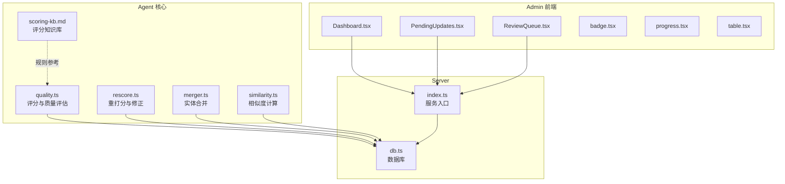
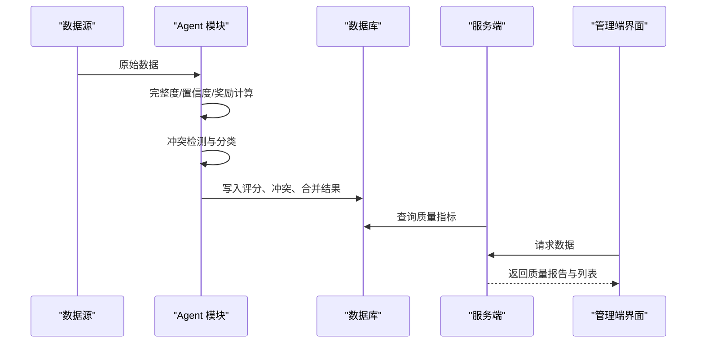
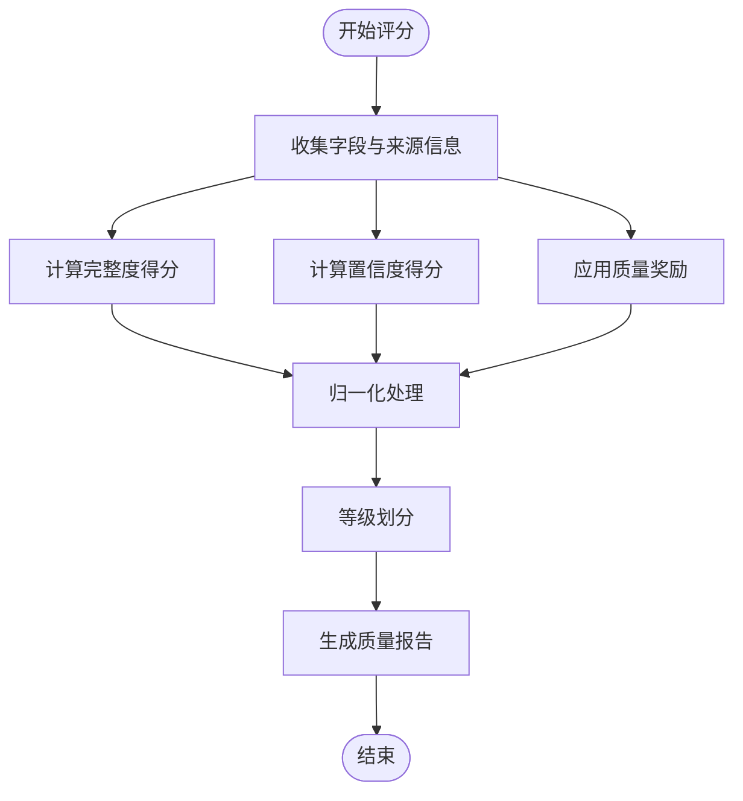
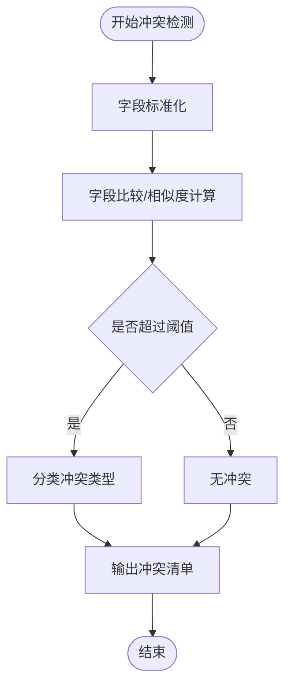
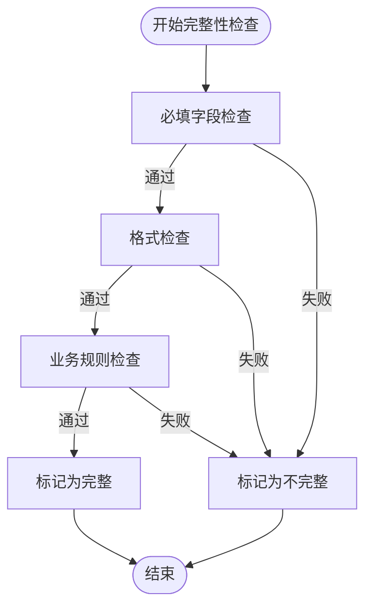
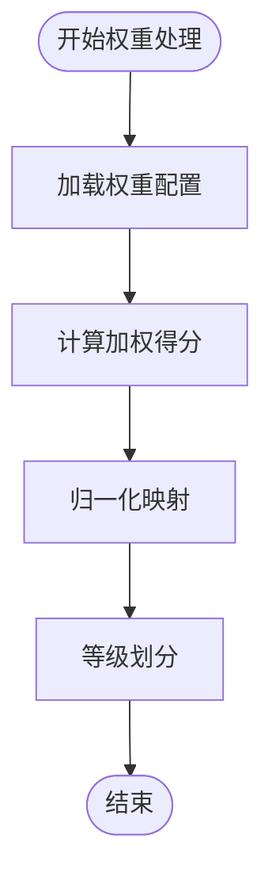
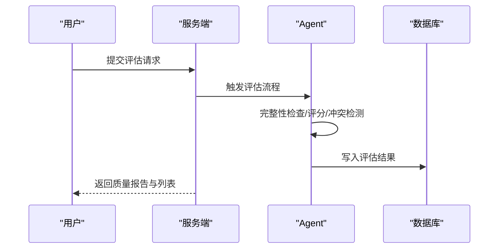
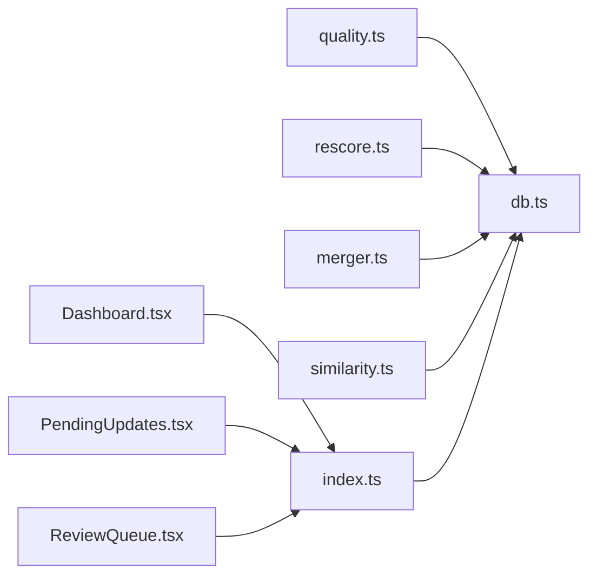

# 质量评估系统

<cite>
**本文档引用的文件**
- [agent/quality.ts](file://agent/quality.ts)
- [agent/rescore.ts](file://agent/rescore.ts)
- [agent/merger.ts](file://agent/merger.ts)
- [agent/similarity.ts](file://agent/similarity.ts)
- [wiki/knowledge/scoring-kb.md](file://wiki/knowledge/scoring-kb.md)
- [agent/data/city-coords.json](file://agent/data/city-coords.json)
- [agent/sources/base.ts](file://agent/sources/base.ts)
- [agent/classifier.ts](file://agent/classifier.ts)
- [agent/categories.ts](file://agent/categories.ts)
- [agent/utils.ts](file://agent/utils.ts)
- [server/db.ts](file://server/db.ts)
- [server/index.ts](file://server/index.ts)
- [admin/pages/Dashboard.tsx](file://admin/pages/Dashboard.tsx)
- [admin/pages/PendingUpdates.tsx](file://admin/pages/PendingUpdates.tsx)
- [admin/pages/ReviewQueue.tsx](file://admin/pages/ReviewQueue.tsx)
- [admin/components/ui/badge.tsx](file://admin/components/ui/badge.tsx)
- [admin/components/ui/progress.tsx](file://admin/components/ui/progress.tsx)
- [admin/components/ui/table.tsx](file://admin/components/ui/table.tsx)
</cite>

## 目录
1. [简介](#简介)
2. [项目结构](#项目结构)
3. [核心组件](#核心组件)
4. [架构总览](#架构总览)
5. [详细组件分析](#详细组件分析)
6. [依赖关系分析](#依赖关系分析)
7. [性能考虑](#性能考虑)
8. [故障排除指南](#故障排除指南)
9. [结论](#结论)
10. [附录](#附录)

## 简介
本技术文档面向质量评估系统，围绕评分算法设计（完整度、置信度、质量奖励）、冲突检测机制（字段比较策略、阈值与分类）、数据完整性检查规则（必填字段、格式与业务规则）、权重分配与归一化处理、完整评估流程示例（指标计算、等级划分、报告生成），以及质量改进策略与异常数据处理方案进行系统性阐述。文档基于仓库中的实际实现文件进行分析，并提供可视化图示帮助理解。

## 项目结构
质量评估系统主要分布在以下模块：
- agent：核心质量评估与数据处理逻辑，包含评分、重打分、相似度、合并等模块
- wiki/knowledge：评分知识库文档，提供评分规则与权重参考
- server：数据库与服务端入口，支撑数据持久化与接口
- admin：管理端前端，展示质量指标、冲突与待审数据
- 其他辅助模块：分类器、类别定义、工具函数等

**图表来源**
- [agent/quality.ts](file://agent/quality.ts)
- [agent/rescore.ts](file://agent/rescore.ts)
- [agent/merger.ts](file://agent/merger.ts)
- [agent/similarity.ts](file://agent/similarity.ts)
- [wiki/knowledge/scoring-kb.md](file://wiki/knowledge/scoring-kb.md)
- [server/db.ts](file://server/db.ts)
- [server/index.ts](file://server/index.ts)
- [admin/pages/Dashboard.tsx](file://admin/pages/Dashboard.tsx)
- [admin/pages/PendingUpdates.tsx](file://admin/pages/PendingUpdates.tsx)
- [admin/pages/ReviewQueue.tsx](file://admin/pages/ReviewQueue.tsx)

**章节来源**
- [agent/quality.ts](file://agent/quality.ts)
- [agent/rescore.ts](file://agent/rescore.ts)
- [agent/merger.ts](file://agent/merger.ts)
- [agent/similarity.ts](file://agent/similarity.ts)
- [wiki/knowledge/scoring-kb.md](file://wiki/knowledge/scoring-kb.md)
- [server/db.ts](file://server/db.ts)
- [server/index.ts](file://server/index.ts)
- [admin/pages/Dashboard.tsx](file://admin/pages/Dashboard.tsx)
- [admin/pages/PendingUpdates.tsx](file://admin/pages/PendingUpdates.tsx)
- [admin/pages/ReviewQueue.tsx](file://admin/pages/ReviewQueue.tsx)

## 核心组件
- 质量评分模块：负责完整度计算、置信度评估、质量奖励机制与归一化处理
- 冲突检测模块：基于字段比较策略与阈值，识别并分类冲突
- 数据完整性检查：必填字段、格式校验与业务规则约束
- 实体合并与相似度：用于去重与聚合，提升数据一致性
- 重打分与修正：对低质量或异常数据进行再评估与修正
- 知识库与规则：提供权重、阈值与等级划分依据

**章节来源**
- [agent/quality.ts](file://agent/quality.ts)
- [agent/rescore.ts](file://agent/rescore.ts)
- [agent/merger.ts](file://agent/merger.ts)
- [agent/similarity.ts](file://agent/similarity.ts)
- [wiki/knowledge/scoring-kb.md](file://wiki/knowledge/scoring-kb.md)

## 架构总览
质量评估系统采用“数据源 → 评分/冲突/合并 → 存储 → 展示”的流水线式架构。评分与冲突检测在 Agent 层完成，结果写入数据库并通过服务端接口暴露给管理端前端展示。

**图表来源**
- [agent/quality.ts](file://agent/quality.ts)
- [agent/rescore.ts](file://agent/rescore.ts)
- [agent/merger.ts](file://agent/merger.ts)
- [server/db.ts](file://server/db.ts)
- [server/index.ts](file://server/index.ts)
- [admin/pages/Dashboard.tsx](file://admin/pages/Dashboard.tsx)

## 详细组件分析

### 质量评分算法设计
- 完整度计算：统计字段覆盖率与必填字段填充率，结合权重得出基础得分
- 置信度评估：基于来源可信度、历史一致性、格式规范性与相似度一致性综合评分
- 质量奖励机制：对高完整性、高一致性和高质量来源给予额外奖励
- 归一化处理：将各维度得分映射到统一区间，便于横向比较与等级划分

**图表来源**
- [agent/quality.ts](file://agent/quality.ts)
- [wiki/knowledge/scoring-kb.md](file://wiki/knowledge/scoring-kb.md)

**章节来源**
- [agent/quality.ts](file://agent/quality.ts)
- [wiki/knowledge/scoring-kb.md](file://wiki/knowledge/scoring-kb.md)

### 冲突检测机制
- 字段比较策略：对关键字段（如名称、坐标、地址）进行标准化后比较；对类别与标签进行语义相似度比对
- 冲突阈值设置：基于领域知识设定相似度阈值与差异阈值，区分轻微冲突、中等冲突与严重冲突
- 冲突类型分类：同一实体不同来源的重复、名称/地址不一致、类别冲突、坐标漂移等

**图表来源**
- [agent/merger.ts](file://agent/merger.ts)
- [agent/similarity.ts](file://agent/similarity.ts)
- [agent/quality.ts](file://agent/quality.ts)

**章节来源**
- [agent/merger.ts](file://agent/merger.ts)
- [agent/similarity.ts](file://agent/similarity.ts)
- [agent/quality.ts](file://agent/quality.ts)

### 数据完整性检查规则
- 必填字段验证：确保 ID、名称、坐标、来源等关键字段存在且非空
- 格式检查：验证坐标范围、URL 格式、电话号码格式、时间戳格式等
- 业务规则约束：类别与名称匹配、城市与坐标一致性、图片链接有效性等

**图表来源**
- [agent/quality.ts](file://agent/quality.ts)
- [agent/utils.ts](file://agent/utils.ts)
- [agent/data/city-coords.json](file://agent/data/city-coords.json)

**章节来源**
- [agent/quality.ts](file://agent/quality.ts)
- [agent/utils.ts](file://agent/utils.ts)
- [agent/data/city-coords.json](file://agent/data/city-coords.json)

### 权重分配与归一化处理
- 权重分配：来自评分知识库，涵盖字段权重、来源权重、奖励权重等
- 归一化：将加权得分映射至 0-1 区间，便于跨实体与跨来源对比
- 等级划分：根据阈值将归一化得分划分为优秀、良好、一般、较差等等级

**图表来源**
- [agent/quality.ts](file://agent/quality.ts)
- [wiki/knowledge/scoring-kb.md](file://wiki/knowledge/scoring-kb.md)

**章节来源**
- [agent/quality.ts](file://agent/quality.ts)
- [wiki/knowledge/scoring-kb.md](file://wiki/knowledge/scoring-kb.md)

### 质量评估流程示例
- 输入：原始 POI 数据（含字段、来源、坐标等）
- 处理：完整性检查 → 评分计算 → 冲突检测 → 合并与相似度比对 → 重打分与修正
- 输出：质量报告（得分、等级、冲突清单、建议修正项）

**图表来源**
- [server/index.ts](file://server/index.ts)
- [agent/quality.ts](file://agent/quality.ts)
- [agent/rescore.ts](file://agent/rescore.ts)
- [admin/pages/Dashboard.tsx](file://admin/pages/Dashboard.tsx)

**章节来源**
- [server/index.ts](file://server/index.ts)
- [agent/quality.ts](file://agent/quality.ts)
- [agent/rescore.ts](file://agent/rescore.ts)
- [admin/pages/Dashboard.tsx](file://admin/pages/Dashboard.tsx)

### 质量改进策略与异常数据处理
- 改进策略：针对低分实体优先补充缺失字段、修正格式错误、统一命名与类别、引入高质量来源
- 异常数据处理：对异常坐标、重复实体、来源不可信数据进行隔离与人工复核，必要时降权或拒绝入库

**章节来源**
- [agent/quality.ts](file://agent/quality.ts)
- [agent/rescore.ts](file://agent/rescore.ts)
- [agent/merger.ts](file://agent/merger.ts)

## 依赖关系分析
- Agent 模块之间耦合度较低，职责清晰：评分独立于冲突检测，冲突检测独立于合并与相似度
- 与数据库交互集中在服务端层，Agent 通过接口访问
- 管理端前端通过服务端接口消费质量评估结果

**图表来源**
- [agent/quality.ts](file://agent/quality.ts)
- [agent/rescore.ts](file://agent/rescore.ts)
- [agent/merger.ts](file://agent/merger.ts)
- [agent/similarity.ts](file://agent/similarity.ts)
- [server/db.ts](file://server/db.ts)
- [server/index.ts](file://server/index.ts)
- [admin/pages/Dashboard.tsx](file://admin/pages/Dashboard.tsx)
- [admin/pages/PendingUpdates.tsx](file://admin/pages/PendingUpdates.tsx)
- [admin/pages/ReviewQueue.tsx](file://admin/pages/ReviewQueue.tsx)

**章节来源**
- [agent/quality.ts](file://agent/quality.ts)
- [agent/rescore.ts](file://agent/rescore.ts)
- [agent/merger.ts](file://agent/merger.ts)
- [agent/similarity.ts](file://agent/similarity.ts)
- [server/db.ts](file://server/db.ts)
- [server/index.ts](file://server/index.ts)
- [admin/pages/Dashboard.tsx](file://admin/pages/Dashboard.tsx)
- [admin/pages/PendingUpdates.tsx](file://admin/pages/PendingUpdates.tsx)
- [admin/pages/ReviewQueue.tsx](file://admin/pages/ReviewQueue.tsx)

## 性能考虑
- 批量处理：对大量实体进行评分与冲突检测时，应采用分批与并发策略，避免阻塞
- 缓存与索引：对常用规则与阈值进行缓存，对数据库查询建立必要索引
- 降采样与抽样：对极高基数字段（如名称）采用抽样与近似算法以降低复杂度
- 可观测性：记录评分耗时、冲突数量、重打分比例等指标，持续优化算法参数

## 故障排除指南
- 评分异常偏低：检查权重配置与阈值设置，确认必填字段与格式是否满足要求
- 冲突误报：调整相似度阈值与字段权重，增加人工复核环节
- 数据库写入失败：检查连接状态与事务回滚策略，确保幂等性
- 前端展示异常：核对服务端接口返回格式与权限控制

**章节来源**
- [agent/quality.ts](file://agent/quality.ts)
- [agent/rescore.ts](file://agent/rescore.ts)
- [server/db.ts](file://server/db.ts)
- [server/index.ts](file://server/index.ts)

## 结论
质量评估系统通过可配置的评分算法、严谨的冲突检测与完善的完整性检查，实现了对多源 POI 数据的自动化质量管控。配合知识库驱动的权重与阈值，系统具备良好的可扩展性与可维护性。建议持续优化阈值与权重，完善异常处理与人工复核流程，以进一步提升评估准确性与效率。

## 附录
- 评分知识库参考：见评分知识库文档，提供权重与阈值配置依据
- 常用字段与来源：见数据目录与分类器模块，明确字段含义与来源可信度

**章节来源**
- [wiki/knowledge/scoring-kb.md](file://wiki/knowledge/scoring-kb.md)
- [agent/classifier.ts](file://agent/classifier.ts)
- [agent/categories.ts](file://agent/categories.ts)
- [agent/data/city-coords.json](file://agent/data/city-coords.json)