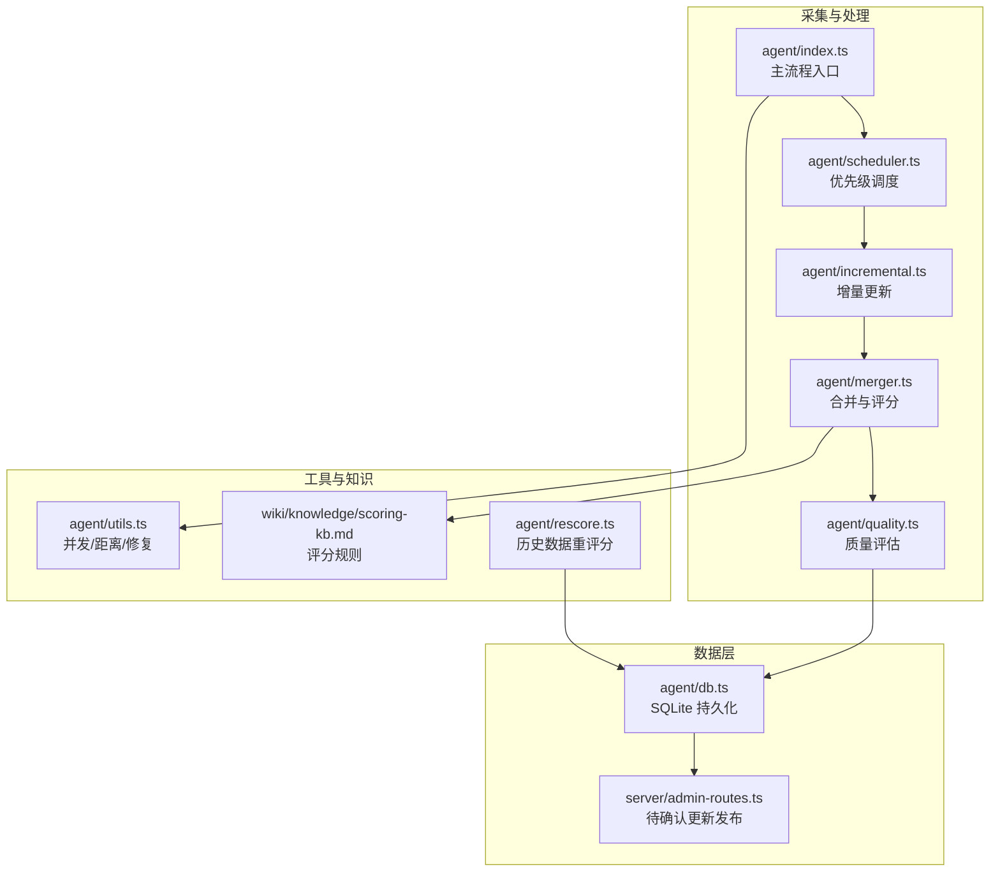
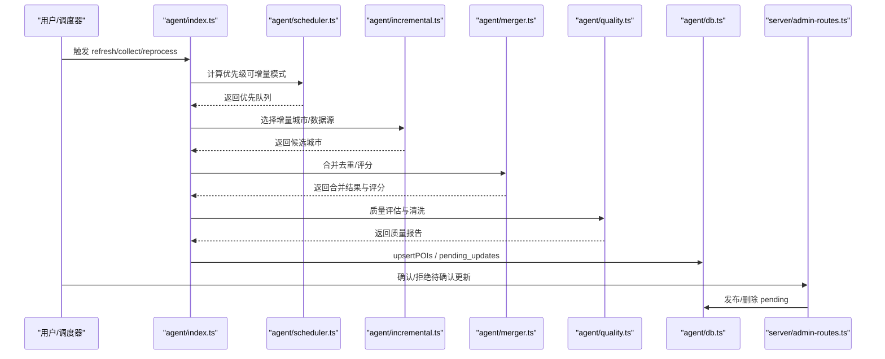
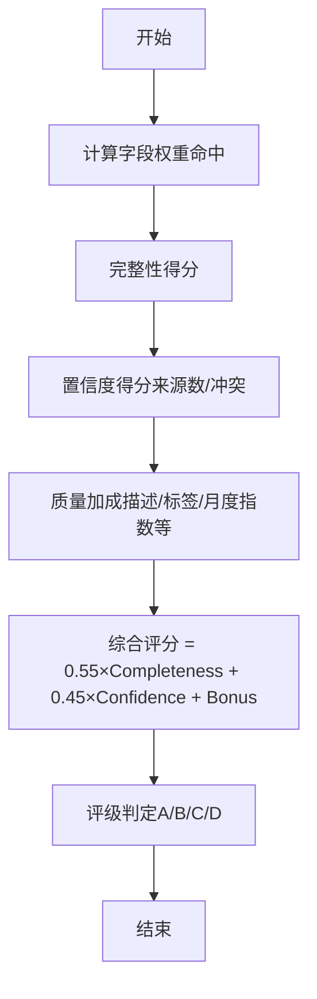
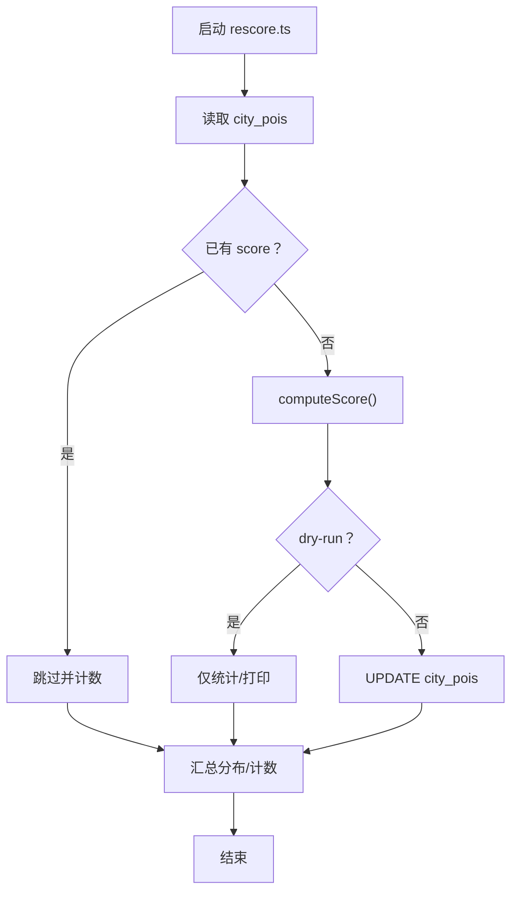
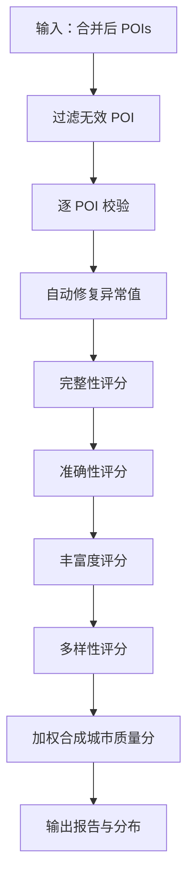
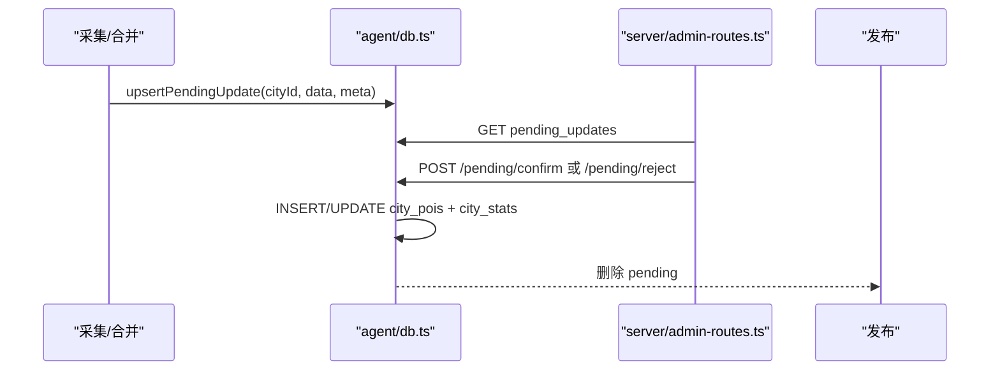
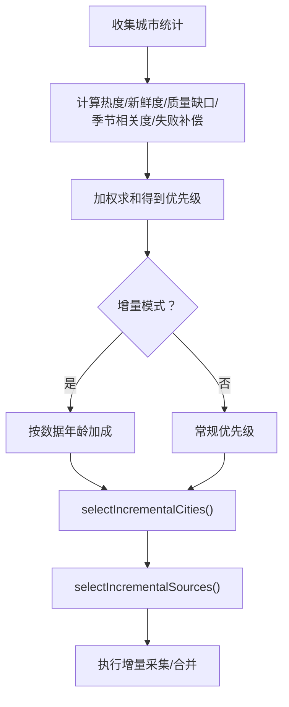
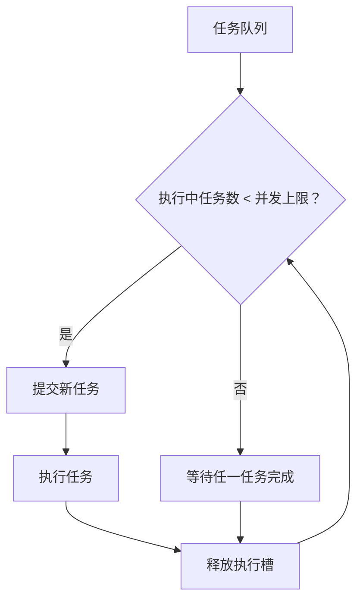
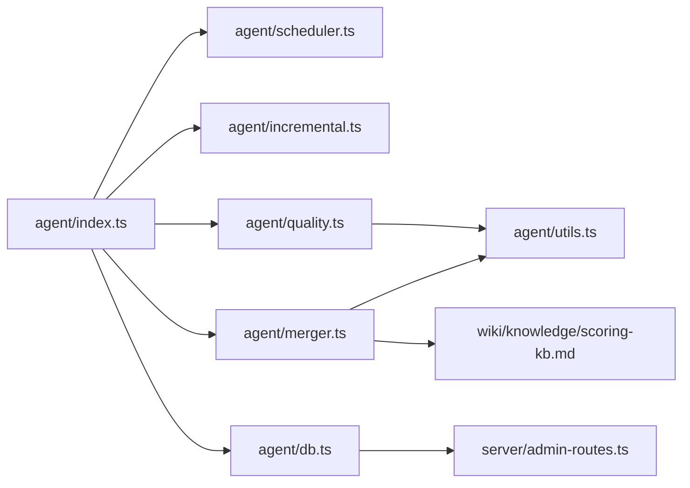

# 重评分机制

<cite>
**本文档引用的文件**
- [agent/rescore.ts](file://agent/rescore.ts)
- [agent/merger.ts](file://agent/merger.ts)
- [agent/quality.ts](file://agent/quality.ts)
- [agent/db.ts](file://agent/db.ts)
- [agent/index.ts](file://agent/index.ts)
- [agent/scheduler.ts](file://agent/scheduler.ts)
- [agent/incremental.ts](file://agent/incremental.ts)
- [agent/utils.ts](file://agent/utils.ts)
- [server/admin-routes.ts](file://server/admin-routes.ts)
- [wiki/knowledge/scoring-kb.md](file://wiki/knowledge/scoring-kb.md)
</cite>

## 目录
1. [简介](#简介)
2. [项目结构](#项目结构)
3. [核心组件](#核心组件)
4. [架构概览](#架构概览)
5. [详细组件分析](#详细组件分析)
6. [依赖关系分析](#依赖关系分析)
7. [性能考虑](#性能考虑)
8. [故障排查指南](#故障排查指南)
9. [结论](#结论)
10. [附录](#附录)

## 简介
本文件系统性阐述“重评分机制”的设计与实现，涵盖评分衰减、权重调整、动态重算策略、触发条件、优先级排序与并发处理、性能影响与优化、监控指标与故障恢复等。重评分贯穿于采集、合并、质量清洗与发布流程，确保 POI 数据质量稳定提升与可追溯。

## 项目结构
围绕重评分的关键模块与文件如下：
- 评分计算与迁移：agent/rescore.ts、agent/merger.ts
- 质量评估与清洗：agent/quality.ts
- 数据持久化与待确认更新：agent/db.ts、server/admin-routes.ts
- 调度与增量更新：agent/scheduler.ts、agent/incremental.ts
- 并发与工具：agent/utils.ts
- 知识库与评分规则：wiki/knowledge/scoring-kb.md

图表来源
- [agent/index.ts:1-1132](file://agent/index.ts#L1-L1132)
- [agent/scheduler.ts:1-98](file://agent/scheduler.ts#L1-L98)
- [agent/incremental.ts:1-150](file://agent/incremental.ts#L1-L150)
- [agent/merger.ts:1-1026](file://agent/merger.ts#L1-L1026)
- [agent/quality.ts:1-344](file://agent/quality.ts#L1-L344)
- [agent/db.ts:1-459](file://agent/db.ts#L1-L459)
- [server/admin-routes.ts:1294-1479](file://server/admin-routes.ts#L1294-L1479)
- [agent/utils.ts:1-191](file://agent/utils.ts#L1-L191)
- [wiki/knowledge/scoring-kb.md:1-161](file://wiki/knowledge/scoring-kb.md#L1-L161)
- [agent/rescore.ts:1-158](file://agent/rescore.ts#L1-L158)

章节来源
- [agent/index.ts:1-1132](file://agent/index.ts#L1-L1132)
- [agent/db.ts:1-459](file://agent/db.ts#L1-L459)

## 核心组件
- 评分计算引擎
  - 完整度（Completeness）：基于字段权重与命中情况计算，最高 100 分。
  - 置信度（Confidence）：基于来源数量与冲突检测，结合来源可靠性奖励。
  - 质量加成（Quality Bonus）：描述长度、三名齐全、标签丰富度、月度指数等。
  - 综合评分：completeness 与 confidence 的加权求和，并取整至 0-100。
- 历史重评分迁移器：为已有 POI 数据补充评分，支持干跑（dry-run）验证。
- 质量评估与清洗：对合并后 POI 进行逐条校验与自动修复，产出城市级质量报告。
- 待确认更新与发布：增量/全量更新结果先落盘为 pending，经人工审核后发布。
- 调度与增量：基于热度、数据新鲜度、质量缺口、季节相关度与失败补偿计算优先级，支持增量/全量刷新决策。

章节来源
- [agent/merger.ts:427-490](file://agent/merger.ts#L427-L490)
- [agent/rescore.ts:32-85](file://agent/rescore.ts#L32-L85)
- [agent/quality.ts:189-293](file://agent/quality.ts#L189-L293)
- [agent/db.ts:379-448](file://agent/db.ts#L379-L448)
- [agent/scheduler.ts:18-87](file://agent/scheduler.ts#L18-L87)
- [agent/incremental.ts:24-107](file://agent/incremental.ts#L24-L107)

## 架构概览
重评分贯穿“采集-合并-清洗-发布”链路，形成闭环的质量保障与动态重算能力。

图表来源
- [agent/index.ts:655-800](file://agent/index.ts#L655-L800)
- [agent/scheduler.ts:18-87](file://agent/scheduler.ts#L18-L87)
- [agent/incremental.ts:115-148](file://agent/incremental.ts#L115-L148)
- [agent/merger.ts:676-789](file://agent/merger.ts#L676-L789)
- [agent/quality.ts:189-293](file://agent/quality.ts#L189-L293)
- [agent/db.ts:135-155](file://agent/db.ts#L135-L155)
- [server/admin-routes.ts:1399-1479](file://server/admin-routes.ts#L1399-L1479)

## 详细组件分析

### 评分算法与权重设计
- 完整度（Completeness）
  - 核心字段（coords/name/address/category）权重更高，命中即得分。
  - 重要字段（nameZh/nameEn/description/rating/tags/operatingHours）与锦上添花字段（addressEn/cost/visitDuration/bestSeasons/monthlyIndex）分别赋予不同权重。
  - 最终得分按权重归一化至 0-100。
- 置信度（Confidence）
  - 单源：基于来源可靠性奖励，居中约 55-70。
  - 多源：base + 源数量奖励 + 一致性加成 - 冲突惩罚，上限 100，下限 30。
- 质量加成（Quality Bonus）
  - 描述长度、三名齐全、标签丰富度、月度指数等，上限 +15。
- 综合评分
  - total = completeness × 0.55 + confidence × 0.45 + quality_bonus，取整至 0-100。
  - 评级：A≥85，B≥65，C≥45，D<45。

图表来源
- [agent/merger.ts:427-490](file://agent/merger.ts#L427-L490)
- [wiki/knowledge/scoring-kb.md:8-78](file://wiki/knowledge/scoring-kb.md#L8-L78)

章节来源
- [agent/merger.ts:427-490](file://agent/merger.ts#L427-L490)
- [wiki/knowledge/scoring-kb.md:8-78](file://wiki/knowledge/scoring-kb.md#L8-L78)

### 历史数据重评分（迁移）
- 作用：为已有 POI 数据补充评分字段，统一评分口径。
- 流程：遍历城市 POI，跳过已评分项，计算并回写 score 字段；支持 dry-run 验证。
- 触发：离线脚本，适合大规模补丁式重算。

图表来源
- [agent/rescore.ts:94-158](file://agent/rescore.ts#L94-L158)

章节来源
- [agent/rescore.ts:1-158](file://agent/rescore.ts#L1-L158)

### 质量评估与清洗
- 逐 POI 校验：坐标有效性、精度、主名合法性、评分/费用/时长范围、描述质量、地址缺失、月度指数校验、类目一致性。
- 自动修复：对异常值进行裁剪或规范化（如评分 1-5、费用≥0、时长范围、坐标精度、月度指数范围）。
- 城市级评分：完整性、准确性、丰富度、多样性维度加权，输出整体质量分数与分布。

图表来源
- [agent/quality.ts:189-293](file://agent/quality.ts#L189-L293)

章节来源
- [agent/quality.ts:1-344](file://agent/quality.ts#L1-L344)

### 待确认更新与发布
- 增量/全量更新后，结果先写入 pending_updates，包含质量分数、类别分布、总 POI 数、使用来源、问题计数等元数据。
- 管理端接口支持：
  - 查询待确认更新详情
  - 批量确认（apply）与拒绝（reject）
  - 确认后写入 city_pois 并更新 city_stats

图表来源
- [agent/db.ts:379-448](file://agent/db.ts#L379-L448)
- [server/admin-routes.ts:1294-1479](file://server/admin-routes.ts#L1294-L1479)

章节来源
- [agent/db.ts:379-448](file://agent/db.ts#L379-L448)
- [server/admin-routes.ts:1294-1479](file://server/admin-routes.ts#L1294-L1479)

### 调度与增量更新
- 优先级计算：热度（30%）、新鲜度（25%）、质量缺口（20%）、季节相关度（15%）、失败补偿（10%），支持增量模式下的数据年龄加成。
- 增量决策：根据 stale 城市比例自动选择 incremental/full_refresh，避免全局风暴。
- 增量城市选择：复用调度器优先级，跳过近期已采集城市。
- 增量数据源：优先 OSM/AI 等免费源，降低成本。

图表来源
- [agent/scheduler.ts:18-87](file://agent/scheduler.ts#L18-L87)
- [agent/incremental.ts:77-148](file://agent/incremental.ts#L77-L148)

章节来源
- [agent/scheduler.ts:18-87](file://agent/scheduler.ts#L18-L87)
- [agent/incremental.ts:1-150](file://agent/incremental.ts#L1-L150)

### 并发处理与性能
- 并发池：控制最大并发任务数，避免资源争用与超卖。
- 距离计算：Haversine 公式用于地理邻域优化与坐标校验。
- 速率限制器：可选的 RateLimiter，避免外部 API 限流。
- SQLite WAL：提升写入吞吐，配合事务批处理。

图表来源
- [agent/utils.ts:79-106](file://agent/utils.ts#L79-L106)

章节来源
- [agent/utils.ts:1-191](file://agent/utils.ts#L1-L191)

## 依赖关系分析
- agent/index.ts 依赖调度器、增量模块、合并器、质量评估器与数据库层。
- agent/merger.ts 依赖相似度、分类器、工具函数与评分规则。
- agent/db.ts 提供统一的数据访问接口，支撑待确认更新与发布。
- server/admin-routes.ts 依赖 agent/db.ts 实现管理端操作。
- wiki/knowledge/scoring-kb.md 为评分规则权威来源，指导实现一致性。

图表来源
- [agent/index.ts:1-1132](file://agent/index.ts#L1-L1132)
- [agent/merger.ts:1-1026](file://agent/merger.ts#L1-L1026)
- [agent/db.ts:1-459](file://agent/db.ts#L1-L459)
- [server/admin-routes.ts:1294-1479](file://server/admin-routes.ts#L1294-L1479)
- [wiki/knowledge/scoring-kb.md:1-161](file://wiki/knowledge/scoring-kb.md#L1-L161)

章节来源
- [agent/index.ts:1-1132](file://agent/index.ts#L1-L1132)
- [agent/merger.ts:1-1026](file://agent/merger.ts#L1-L1026)
- [agent/db.ts:1-459](file://agent/db.ts#L1-L459)
- [server/admin-routes.ts:1294-1479](file://server/admin-routes.ts#L1294-L1479)
- [wiki/knowledge/scoring-kb.md:1-161](file://wiki/knowledge/scoring-kb.md#L1-L161)

## 性能考虑
- 评分计算复杂度
  - 完整度：O(F)（F 为字段数），单 POI 常数级。
  - 置信度：O(S×C)（S 为来源数，C 为可比较字段对数），受冲突检测影响。
  - 建议：对大型集合采用分页/批处理，避免一次性全量扫描。
- 地理邻域优化
  - 合并阶段使用地理分桶与相邻桶邻接比较，显著降低两两比较次数。
- 并发与 IO
  - 并发池与 WAL 模式提升吞吐；批量写入 pending_updates 与 city_pois。
- 内存与序列化
  - 大 JSON 文本解析与 stringify 需注意内存峰值，建议分块处理与及时释放。

## 故障排查指南
- 评分异常
  - 全部 D 级或 NaN：检查冲突检测中的 sourceCount 计算（需使用 Set.size）。
  - 大量 C/D 级：关注 address 缺失、类别不一致、多源冲突高等问题。
- 待确认更新
  - 无法确认：检查 pending_updates 是否存在、字段是否完整。
  - 确认后未生效：核对发布流程与 city_pois 版本号更新。
- 调度与增量
  - 未触发增量：检查 stale 城市比例与阈值配置。
  - 增量失败：查看失败计数与最近日志，必要时切换为全量刷新。

章节来源
- [wiki/knowledge/scoring-kb.md:109-118](file://wiki/knowledge/scoring-kb.md#L109-L118)
- [agent/db.ts:379-448](file://agent/db.ts#L379-L448)
- [server/admin-routes.ts:1399-1479](file://server/admin-routes.ts#L1399-L1479)
- [agent/incremental.ts:77-107](file://agent/incremental.ts#L77-L107)

## 结论
重评分机制以“评分规则权威化 + 动态重算 + 待确认发布 + 调度驱动”为核心，既保证评分一致性，又兼顾成本与稳定性。通过地理邻域优化、并发控制与 WAL 写入，系统在大规模数据场景下具备良好性能。建议持续监控质量分布、发布成功率与增量触发率，以迭代优化评分权重与调度策略。

## 附录

### 评分更新触发条件
- 数据变更检测
  - 新增/更新 POI、合并后字段变化、来源变化。
- 时间窗口设置
  - 新鲜度衰减：基于 updatedAt 与最大天数阈值（默认 30 天）线性衰减。
- 批量重算机制
  - 历史重评分迁移：离线脚本，支持 dry-run。
  - 动态重算：reprocess 命令基于 raw_pois 重新合并/评分。

章节来源
- [agent/rescore.ts:94-158](file://agent/rescore.ts#L94-L158)
- [agent/index.ts:368-450](file://agent/index.ts#L368-L450)
- [agent/quality.ts:321-343](file://agent/quality.ts#L321-L343)

### 优先级排序与并发策略
- 优先级：热度（30%）、新鲜度（25%）、质量缺口（20%）、季节相关度（15%）、失败补偿（10%），增量模式下叠加数据年龄加成。
- 并发：runWithConcurrency 控制最大并发，避免资源争用；地理邻域优化减少比较次数。

章节来源
- [agent/scheduler.ts:18-87](file://agent/scheduler.ts#L18-L87)
- [agent/utils.ts:79-106](file://agent/utils.ts#L79-L106)
- [agent/merger.ts:523-596](file://agent/merger.ts#L523-L596)

### 监控指标与故障恢复
- 监控指标
  - 城市质量分布（A/B/C/D 比例）、平均质量分、待确认更新数量、发布成功率、增量触发次数。
- 故障恢复
  - 重跑 reprocess 修复评分；切换全量刷新；人工确认 pending；检查数据库索引与 WAL 配置。

章节来源
- [agent/db.ts:398-448](file://agent/db.ts#L398-L448)
- [agent/index.ts:538-639](file://agent/index.ts#L538-L639)
- [agent/incremental.ts:77-107](file://agent/incremental.ts#L77-L107)