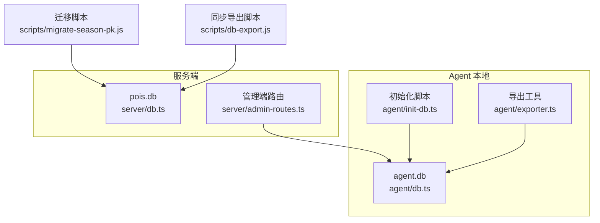
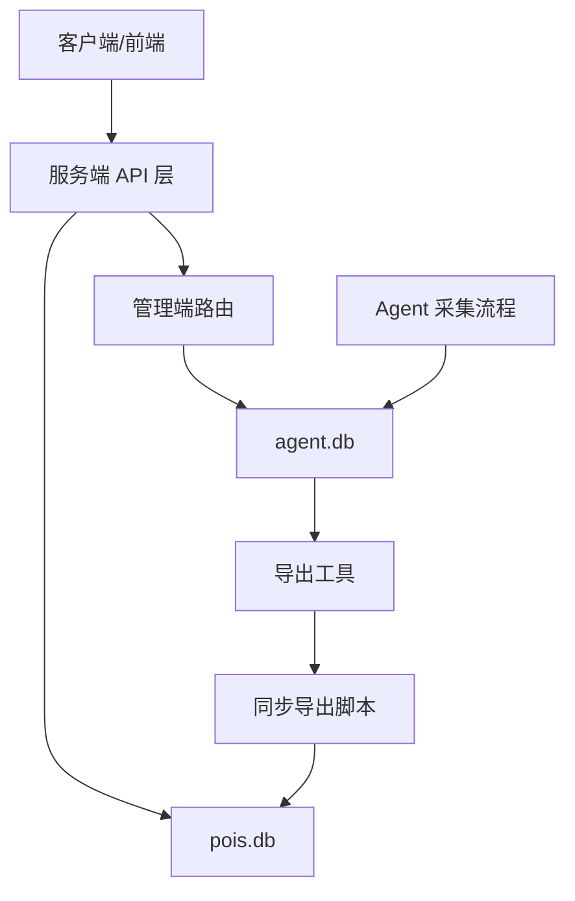
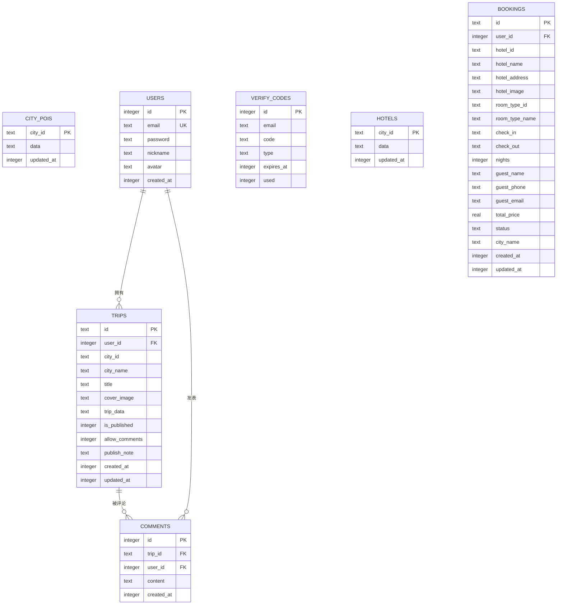
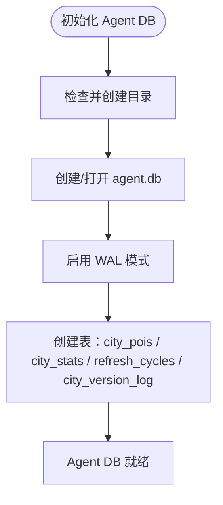
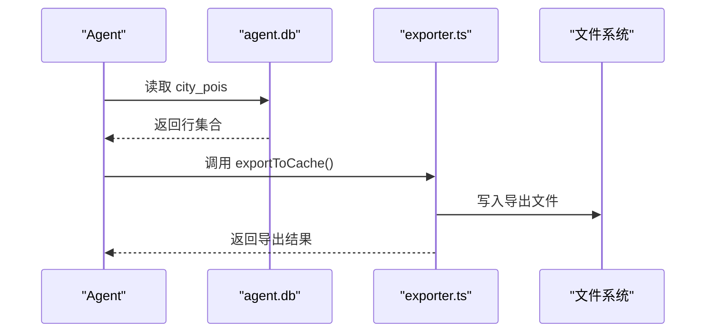
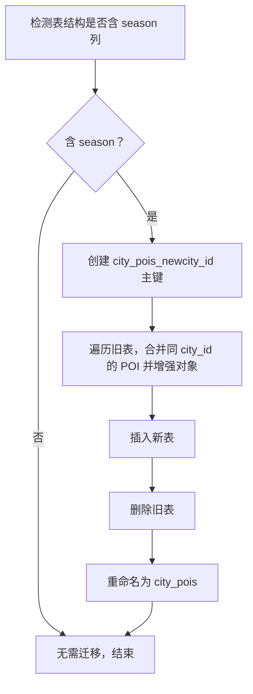
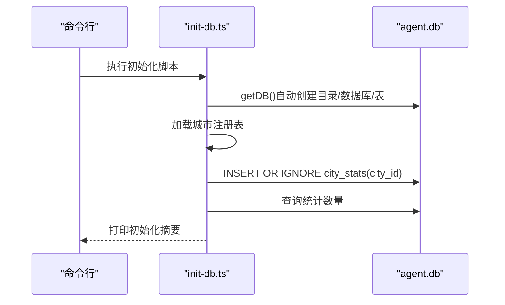
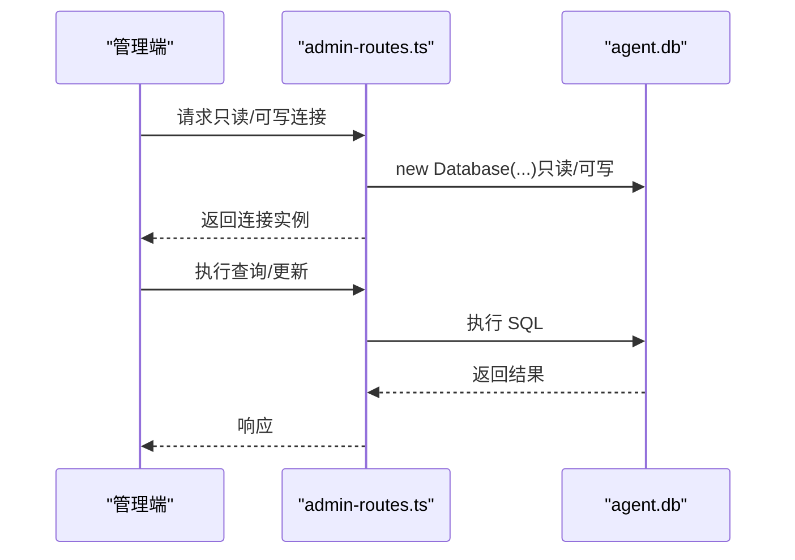
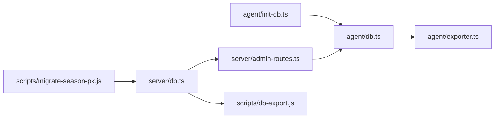

# 数据库管理

<cite>
**本文引用的文件**
- [agent/db.ts](file://agent/db.ts)
- [agent/init-db.ts](file://agent/init-db.ts)
- [agent/exporter.ts](file://agent/exporter.ts)
- [scripts/migrate-season-pk.js](file://scripts/migrate-season-pk.js)
- [scripts/db-export.js](file://scripts/db-export.js)
- [server/db.ts](file://server/db.ts)
- [server/admin-routes.ts](file://server/admin-routes.ts)
</cite>

## 目录
1. [简介](#简介)
2. [项目结构](#项目结构)
3. [核心组件](#核心组件)
4. [架构总览](#架构总览)
5. [详细组件分析](#详细组件分析)
6. [依赖关系分析](#依赖关系分析)
7. [性能考量](#性能考量)
8. [故障排查指南](#故障排查指南)
9. [结论](#结论)
10. [附录](#附录)

## 简介
本技术文档围绕数据库管理系统展开，重点覆盖以下方面：
- SQLite 设计架构：表结构、索引策略与查询优化
- 数据初始化流程：数据库迁移、表创建与初始数据加载
- 数据导出功能：批量导出、格式转换与压缩处理
- 连接池管理、事务处理与并发控制机制
- 维护与监控最佳实践：备份策略、性能调优与故障恢复
- 具体 SQL 查询示例与数据库 schema 说明

系统采用 better-sqlite3 作为 SQLite 客户端，分别在服务端与 Agent 端维护独立数据库：
- 服务端数据库：pois.db，用于用户、行程、评论、验证码、酒店缓存等业务数据
- Agent 本地数据库：agent.db，用于采集数据与日志，POI 数据按城市分组并以 JSON 文本存储

## 项目结构
数据库相关代码分布于以下模块：
- 服务端数据库层：server/db.ts
- Agent 本地数据库层：agent/db.ts
- Agent 初始化脚本：agent/init-db.ts
- 数据导出工具：agent/exporter.ts、scripts/db-export.js
- 数据库迁移脚本：scripts/migrate-season-pk.js
- 管理端路由（连接 Agent DB）：server/admin-routes.ts

图表来源
- [server/db.ts:37-147](file://server/db.ts#L37-L147)
- [agent/db.ts:19-32](file://agent/db.ts#L19-L32)
- [agent/init-db.ts:15-40](file://agent/init-db.ts#L15-L40)
- [agent/exporter.ts:21-72](file://agent/exporter.ts#L21-L72)
- [scripts/migrate-season-pk.js:35-125](file://scripts/migrate-season-pk.js#L35-L125)
- [scripts/db-export.js:29-38](file://scripts/db-export.js#L29-L38)
- [server/admin-routes.ts:44-62](file://server/admin-routes.ts#L44-L62)

章节来源
- [server/db.ts:1-147](file://server/db.ts#L1-L147)
- [agent/db.ts:1-32](file://agent/db.ts#L1-L32)
- [agent/init-db.ts:1-40](file://agent/init-db.ts#L1-L40)
- [agent/exporter.ts:1-72](file://agent/exporter.ts#L1-L72)
- [scripts/migrate-season-pk.js:1-125](file://scripts/migrate-season-pk.js#L1-L125)
- [scripts/db-export.js:1-38](file://scripts/db-export.js#L1-L38)
- [server/admin-routes.ts:1-66](file://server/admin-routes.ts#L1-L66)

## 核心组件
- 服务端数据库层（pois.db）
  - 提供数据库初始化、表创建、CRUD 接口
  - 关键表：city_pois、users、trips、comments、verify_codes、hotels、bookings
  - 使用 WAL 日志模式与外键约束，支持 upsert、JSON 字段存储与时间戳字段
- Agent 本地数据库层（agent.db）
  - 提供 POI 缓存、版本号管理、刷新周期记录、原始 POI CRUD
  - 表：city_pois、city_stats、refresh_cycles、city_version_log 等
- 数据导出工具
  - Agent 端导出：将 POI 数据导出为与网站导入兼容的 JSON
  - 同步导出：从服务端数据库导出 POI 与酒店缓存至 data-sync
- 数据库迁移
  - 将 city_pois 旧 schema（含 season 列）迁移为单主键 city_id，并将季节性数据嵌入 POI 对象

章节来源
- [server/db.ts:37-147](file://server/db.ts#L37-L147)
- [agent/db.ts:34-323](file://agent/db.ts#L34-L323)
- [agent/exporter.ts:21-72](file://agent/exporter.ts#L21-L72)
- [scripts/db-export.js:29-38](file://scripts/db-export.js#L29-L38)
- [scripts/migrate-season-pk.js:38-125](file://scripts/migrate-season-pk.js#L38-L125)

## 架构总览
系统采用“服务端 + Agent 本地”的双数据库架构：
- 服务端负责用户、行程、评论、验证码、酒店缓存与预订等业务数据
- Agent 本地负责采集数据与日志，定期导出供服务端导入或同步

图表来源
- [server/db.ts:37-147](file://server/db.ts#L37-L147)
- [server/admin-routes.ts:44-62](file://server/admin-routes.ts#L44-L62)
- [agent/db.ts:34-323](file://agent/db.ts#L34-L323)
- [agent/exporter.ts:21-72](file://agent/exporter.ts#L21-L72)
- [scripts/db-export.js:29-38](file://scripts/db-export.js#L29-L38)

## 详细组件分析

### 服务端数据库层（pois.db）
- 初始化与表创建
  - 在指定目录创建数据库文件，启用 WAL 与外键约束
  - 创建 city_pois、users、trips、comments、verify_codes、hotels、bookings 等表
- 数据模型要点
  - city_pois：以 city_id 为主键，data 为 JSON 文本，updated_at 记录更新时间
  - users：自增 id 主键，email 唯一，包含密码、昵称、头像与创建时间
  - trips：以 id 为主键，外键关联 users；trip_data 存储完整行程 JSON
  - comments：外键关联 trips 与 users
  - verify_codes：邮箱验证码表，带过期与使用标记
  - hotels：酒店缓存，结构与 city_pois 类似
  - bookings：酒店预订，外键关联 users
- 查询与更新
  - upsertPOIs：按 city_id upsert，更新 data 与 updated_at
  - 获取缓存年龄：计算 updated_at 与当前时间差
  - 用户相关：按 email 或 id 查询用户

图表来源
- [server/db.ts:46-144](file://server/db.ts#L46-L144)

章节来源
- [server/db.ts:37-147](file://server/db.ts#L37-L147)
- [server/db.ts:237-261](file://server/db.ts#L237-L261)
- [server/db.ts:263-289](file://server/db.ts#L263-L289)
- [server/db.ts:428-444](file://server/db.ts#L428-L444)

### Agent 本地数据库层（agent.db）
- 初始化与表创建
  - 自动创建目录与数据库文件，启用 WAL 与外键
  - 创建 city_pois、city_stats、refresh_cycles、city_version_log 等表
- 数据模型要点
  - city_pois：city_id 主键，data 为 JSON 文本，updated_at 记录更新时间
  - city_stats：城市统计，INSERT OR IGNORE 预填充
  - refresh_cycles：记录刷新周期状态与结果
  - city_version_log：版本号变更日志
- 版本与刷新
  - 城市版本号递增与查询
  - 刷新历史查询与最新周期获取
- 原始 POI CRUD
  - 支持插入、更新、删除与查询

图表来源
- [agent/db.ts:19-32](file://agent/db.ts#L19-L32)
- [agent/db.ts:34-323](file://agent/db.ts#L34-L323)

章节来源
- [agent/db.ts:19-32](file://agent/db.ts#L19-L32)
- [agent/db.ts:34-323](file://agent/db.ts#L34-L323)

### 数据导出功能
- Agent 端导出（exportToCache）
  - 读取所有城市的 POI 数据（JSON 文本）
  - 构造导出对象：版本号、导出时间、来源、城市数、POI 数、列表
  - 写入文件，返回导出结果（路径、城市数、POI 总数、大小 KB）
- 同步导出（scripts/db-export.js）
  - 从服务端数据库读取 city_pois 与 hotels
  - 输出统计信息并写入 data-sync/cache-export.json

图表来源
- [agent/exporter.ts:21-72](file://agent/exporter.ts#L21-L72)
- [agent/db.ts:309-321](file://agent/db.ts#L309-L321)

章节来源
- [agent/exporter.ts:21-72](file://agent/exporter.ts#L21-L72)
- [scripts/db-export.js:29-38](file://scripts/db-export.js#L29-L38)

### 数据库迁移（city_pois 主键迁移）
- 目标
  - 从旧 schema（含 season 列）迁移到新 schema（city_id 单主键）
  - 合并同一 city_id 下多个 season 的 POI 数据
  - 为缺失的 seasonScores 与 seasonHighlight 设置默认值
- 流程
  - 检测列是否存在 season
  - 创建新表 city_pois_new（city_id 主键）
  - 遍历旧表，合并数据并增强 POI 对象
  - 插入新表，删除旧表并重命名新表

图表来源
- [scripts/migrate-season-pk.js:38-125](file://scripts/migrate-season-pk.js#L38-L125)

章节来源
- [scripts/migrate-season-pk.js:38-125](file://scripts/migrate-season-pk.js#L38-L125)

### 数据初始化流程（Agent）
- agent/init-db.ts
  - 调用 getDB() 自动创建 agent.db 与所有表
  - 读取城市注册表，向 city_stats 预填充（INSERT OR IGNORE）
  - 统计 city_stats 与 city_pois 的数量并打印摘要

图表来源
- [agent/init-db.ts:15-40](file://agent/init-db.ts#L15-L40)
- [agent/db.ts:19-32](file://agent/db.ts#L19-L32)

章节来源
- [agent/init-db.ts:15-40](file://agent/init-db.ts#L15-L40)
- [agent/db.ts:19-32](file://agent/db.ts#L19-L32)

### 管理端数据库连接与并发
- server/admin-routes.ts
  - 通过 better-sqlite3 连接 agent.db
  - 提供只读连接与可写连接两种模式
  - 在只读模式下避免写操作，确保并发安全
  - 与服务端 db.ts 的 upsertPOIs 结合，支持发布/同步操作

图表来源
- [server/admin-routes.ts:44-62](file://server/admin-routes.ts#L44-L62)

章节来源
- [server/admin-routes.ts:44-62](file://server/admin-routes.ts#L44-L62)

## 依赖关系分析
- 组件耦合
  - server/db.ts 与 server/admin-routes.ts 通过 getDB()/upsertPOIs 协作
  - agent/exporter.ts 依赖 agent/db.ts 的查询接口
  - scripts/db-export.js 依赖 server/db.ts 的表结构进行导出
  - scripts/migrate-season-pk.js 依赖 better-sqlite3 直接操作服务端数据库
- 外部依赖
  - better-sqlite3：SQLite 客户端
  - path/fs：文件系统与路径操作
  - child_process/spawn：管理端路由中用于子进程调用

图表来源
- [agent/db.ts:19-32](file://agent/db.ts#L19-L32)
- [agent/exporter.ts:21-72](file://agent/exporter.ts#L21-L72)
- [agent/init-db.ts:15-40](file://agent/init-db.ts#L15-L40)
- [server/admin-routes.ts:44-62](file://server/admin-routes.ts#L44-L62)
- [server/db.ts:37-147](file://server/db.ts#L37-L147)
- [scripts/db-export.js:29-38](file://scripts/db-export.js#L29-L38)
- [scripts/migrate-season-pk.js:35-125](file://scripts/migrate-season-pk.js#L35-L125)

章节来源
- [agent/db.ts:19-32](file://agent/db.ts#L19-L32)
- [agent/exporter.ts:21-72](file://agent/exporter.ts#L21-L72)
- [agent/init-db.ts:15-40](file://agent/init-db.ts#L15-L40)
- [server/admin-routes.ts:44-62](file://server/admin-routes.ts#L44-L62)
- [server/db.ts:37-147](file://server/db.ts#L37-L147)
- [scripts/db-export.js:29-38](file://scripts/db-export.js#L29-L38)
- [scripts/migrate-season-pk.js:35-125](file://scripts/migrate-season-pk.js#L35-L125)

## 性能考量
- WAL 模式
  - 服务端与 Agent 均启用 WAL，提升并发读写性能与崩溃恢复能力
- JSON 字段存储
  - city_pois、hotels 等表以 JSON 文本存储复杂对象，便于扩展但需注意查询限制
- upsert 与冲突处理
  - 使用 INSERT ... ON CONFLICT 实现高效 upsert，减少重复写入
- 索引策略建议
  - 当前 schema 未显式创建二级索引
  - 若频繁按 city_id 查询，可考虑为 city_id 添加索引（视实际查询模式评估）
  - 若需要按 updated_at 排序或过滤，可考虑添加索引
- 批量导出与 IO
  - 导出时一次性读取全量数据，建议在低峰时段执行，避免阻塞
  - 导出文件写入磁盘，建议使用 SSD 与合适的目录权限

## 故障排查指南
- 数据库文件不存在
  - 现象：启动时报错或无法连接
  - 处理：确认 DB_DIR 与 DB_PATH 是否正确；首次运行时由 initDB()/getDB() 自动创建
- 迁移失败或中断
  - 现象：迁移脚本报错或表结构异常
  - 处理：检查旧表是否含 season 列；确保 WAL 已启用；迁移过程中不要中断
- 导出失败
  - 现象：导出文件为空或路径错误
  - 处理：确认数据库中存在数据；检查输出目录权限；验证导出脚本参数
- 并发访问问题
  - 现象：只读连接出现写操作报错
  - 处理：管理端路由明确区分只读与可写连接；避免在只读连接上执行写操作

章节来源
- [server/db.ts:37-44](file://server/db.ts#L37-L44)
- [agent/db.ts:27-30](file://agent/db.ts#L27-L30)
- [scripts/migrate-season-pk.js:28-46](file://scripts/migrate-season-pk.js#L28-L46)
- [scripts/db-export.js:21-25](file://scripts/db-export.js#L21-L25)
- [server/admin-routes.ts:44-62](file://server/admin-routes.ts#L44-L62)

## 结论
本系统采用双数据库架构，服务端负责业务数据，Agent 本地负责采集与导出。通过 WAL 模式、JSON 字段存储与 upsert 机制，系统在易扩展与高并发之间取得平衡。建议后续根据查询模式引入必要的二级索引，并完善备份与监控策略，持续优化性能与可靠性。

## 附录

### SQL 查询示例与 Schema 说明
- 查询城市 POI 缓存
  - 示例：按 city_id 获取 data 与 updated_at
  - 路径参考：[server/db.ts:237-243](file://server/db.ts#L237-L243)
- upsert POI 缓存
  - 示例：按 city_id upsert，更新 data 与 updated_at
  - 路径参考：[server/db.ts:253-261](file://server/db.ts#L253-L261)
- 获取用户信息
  - 示例：按 email 或 id 查询用户
  - 路径参考：[server/db.ts:283-289](file://server/db.ts#L283-L289)
- Agent 查询城市版本
  - 示例：查询 city_id 对应版本号
  - 路径参考：[agent/db.ts:317-321](file://agent/db.ts#L317-L321)
- Agent 刷新历史
  - 示例：查询最近 N 条刷新记录
  - 路径参考：[agent/db.ts:302-305](file://agent/db.ts#L302-L305)

### 备份与恢复建议
- 备份策略
  - 定期复制 DB_DIR 下的数据库文件（pois.db、agent.db）
  - 结合 WAL 模式，在空闲时段执行备份，确保一致性
- 恢复流程
  - 停止服务，替换数据库文件，重启服务
  - 如遇迁移后问题，使用迁移脚本回滚或重新迁移

### 性能调优清单
- 引入必要索引：city_id、updated_at 等高频查询字段
- 控制 JSON 字段大小：避免单条记录过大导致 IO 压力
- 批量操作：导出与导入尽量在低峰时段执行
- 监控 WAL 文件：定期清理或归档，避免占用过多磁盘空间