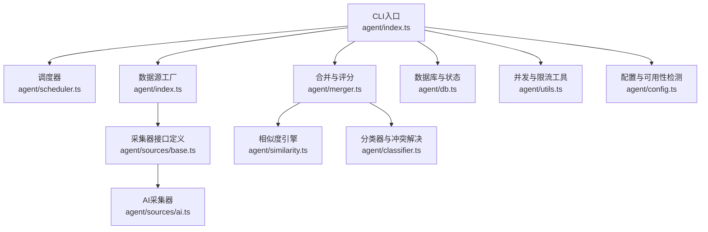
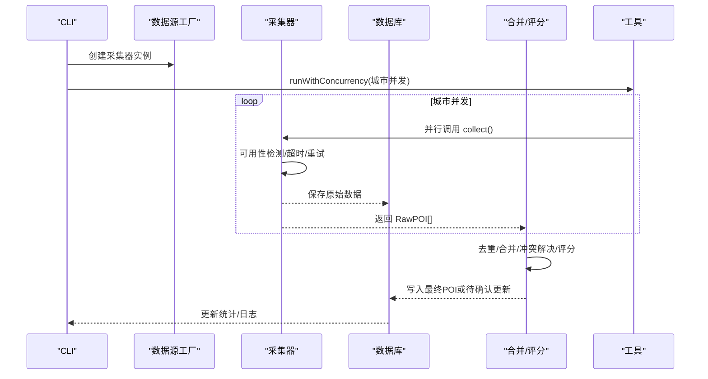
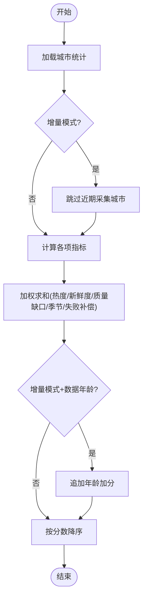
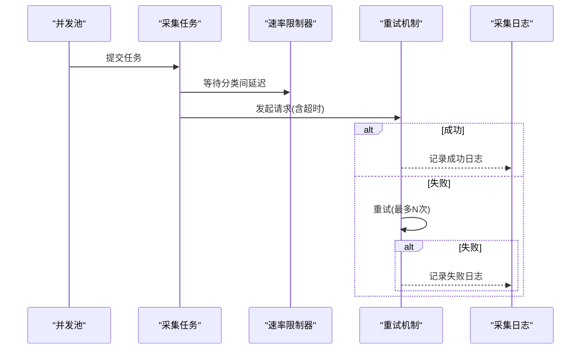
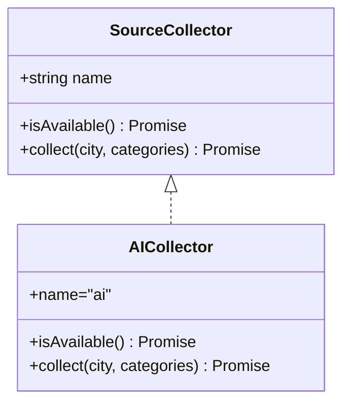
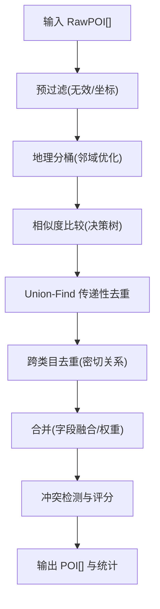
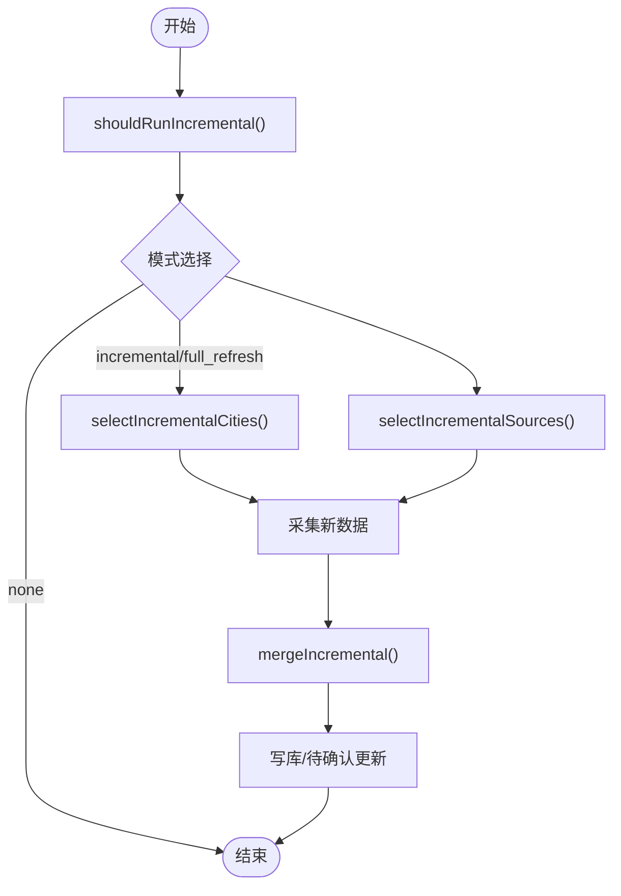
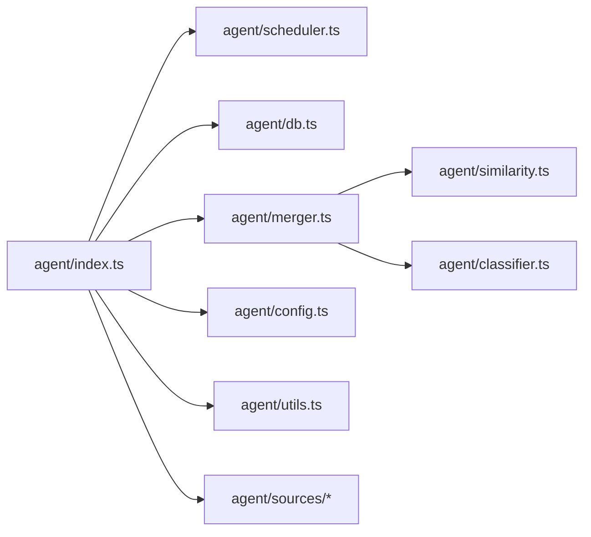

# 数据采集核心

<cite>
**本文引用的文件**
- [agent/index.ts](file://agent/index.ts)
- [agent/scheduler.ts](file://agent/scheduler.ts)
- [agent/config.ts](file://agent/config.ts)
- [agent/sources/base.ts](file://agent/sources/base.ts)
- [agent/sources/ai.ts](file://agent/sources/ai.ts)
- [agent/utils.ts](file://agent/utils.ts)
- [agent/db.ts](file://agent/db.ts)
- [agent/merger.ts](file://agent/merger.ts)
- [agent/incremental.ts](file://agent/incremental.ts)
- [agent/categories.ts](file://agent/categories.ts)
- [agent/similarity.ts](file://agent/similarity.ts)
- [agent/classifier.ts](file://agent/classifier.ts)
</cite>

## 目录
1. [引言](#引言)
2. [项目结构](#项目结构)
3. [核心组件](#核心组件)
4. [架构总览](#架构总览)
5. [详细组件分析](#详细组件分析)
6. [依赖分析](#依赖分析)
7. [性能考虑](#性能考虑)
8. [故障排除指南](#故障排除指南)
9. [结论](#结论)
10. [附录](#附录)

## 引言
本技术文档围绕“AI数据采集核心模块”展开，系统阐述采集器的整体架构设计、任务调度与并发控制、错误恢复策略、多数据源任务队列管理（优先级、重试与超时）、配置管理系统（API密钥、请求频率限制、代理设置）、以及性能优化与故障排除实践。文档面向开发者与运维人员，既提供代码级细节，也给出可视化图示与操作指引。

## 项目结构
Agent子系统采用“命令行驱动 + 多数据源采集 + 合并与质量评估”的分层架构：
- CLI入口负责参数解析与命令分发
- 任务调度器负责城市优先级与批次选择
- 数据源采集器实现统一接口，支持并发与重试
- 合并与质量评估模块负责去重、冲突解决与评分
- 数据库模块负责采集日志、统计、待确认更新与增量刷新周期
- 工具模块提供并发控制、速率限制、坐标转换与JSON修复

图表来源
- [agent/index.ts:115-130](file://agent/index.ts#L115-L130)
- [agent/scheduler.ts:18-87](file://agent/scheduler.ts#L18-L87)
- [agent/sources/base.ts:91-100](file://agent/sources/base.ts#L91-L100)
- [agent/sources/ai.ts:246-341](file://agent/sources/ai.ts#L246-L341)
- [agent/merger.ts:12-31](file://agent/merger.ts#L12-L31)
- [agent/similarity.ts:331-414](file://agent/similarity.ts#L331-L414)
- [agent/classifier.ts:489-552](file://agent/classifier.ts#L489-L552)
- [agent/db.ts:19-32](file://agent/db.ts#L19-L32)
- [agent/utils.ts:79-106](file://agent/utils.ts#L79-L106)
- [agent/config.ts:32-77](file://agent/config.ts#L32-L77)

章节来源
- [agent/index.ts:57-130](file://agent/index.ts#L57-L130)
- [agent/scheduler.ts:18-87](file://agent/scheduler.ts#L18-L87)
- [agent/config.ts:32-77](file://agent/config.ts#L32-L77)

## 核心组件
- CLI与命令分发：解析参数、选择命令、调用相应处理流程（采集、重处理、导出、质量、状态、数据源状态、刷新）
- 任务调度器：基于热度、数据新鲜度、质量缺口、季节相关度与失败补偿计算城市优先级，支持增量模式跳过近期采集城市
- 数据源采集器：统一接口SourceCollector，内置可用性检测、超时与重试、分类间延迟、JSON修复
- 并发与限流：runWithConcurrency控制城市并发，RateLimiter控制分类间延迟
- 合并与质量评估：基于相似度决策树、分类器与冲突解决、评分与去重
- 数据库：采集日志、城市统计、待确认更新、增量刷新周期、版本管理
- 配置管理：API密钥、超时与速率限制、城市加载与来源可用性检测

章节来源
- [agent/index.ts:285-366](file://agent/index.ts#L285-L366)
- [agent/scheduler.ts:18-87](file://agent/scheduler.ts#L18-L87)
- [agent/sources/ai.ts:246-341](file://agent/sources/ai.ts#L246-L341)
- [agent/utils.ts:79-123](file://agent/utils.ts#L79-L123)
- [agent/merger.ts:428-490](file://agent/merger.ts#L428-L490)
- [agent/db.ts:135-155](file://agent/db.ts#L135-L155)
- [agent/config.ts:32-77](file://agent/config.ts#L32-L77)

## 架构总览
采集流程概览：CLI解析参数 → 选择数据源 → 并发采集 → 保存原始数据 → 合并与清洗 → 质量评估 → 写库或存待确认更新 → 记录日志与统计。

图表来源
- [agent/index.ts:134-208](file://agent/index.ts#L134-L208)
- [agent/index.ts:218-281](file://agent/index.ts#L218-L281)
- [agent/utils.ts:79-106](file://agent/utils.ts#L79-L106)
- [agent/db.ts:329-335](file://agent/db.ts#L329-L335)
- [agent/merger.ts:494-521](file://agent/merger.ts#L494-L521)

## 详细组件分析

### 任务调度器与优先级
- 计算指标：热度(30%)、数据新鲜度(25%)、质量缺口(20%)、季节相关度(15%)、失败补偿(10%)
- 增量模式：跳过minGapMs内已采集城市，对数据年龄追加加分
- 输出：按分数降序的城市优先级列表，selectNextBatch截取批次

图表来源
- [agent/scheduler.ts:18-87](file://agent/scheduler.ts#L18-L87)

章节来源
- [agent/scheduler.ts:18-87](file://agent/scheduler.ts#L18-L87)

### 并发控制与错误恢复
- 城市级并发：runWithConcurrency(tasks, maxConcurrent)，保证最大并发，等待任一任务完成再推进
- 采集器内部重试：AI采集器对单轮请求进行retryCount次重试，间隔retryDelayMs
- 超时控制：AI单批请求超时90s，整体单类目超时300s
- 错误恢复：记录采集日志、失败计数、增量模式下将结果存入pending_updates

图表来源
- [agent/utils.ts:79-106](file://agent/utils.ts#L79-L106)
- [agent/sources/ai.ts:17-18](file://agent/sources/ai.ts#L17-L18)
- [agent/sources/ai.ts:274-321](file://agent/sources/ai.ts#L274-L321)
- [agent/db.ts:159-174](file://agent/db.ts#L159-L174)

章节来源
- [agent/utils.ts:79-123](file://agent/utils.ts#L79-L123)
- [agent/sources/ai.ts:119-164](file://agent/sources/ai.ts#L119-L164)
- [agent/db.ts:159-174](file://agent/db.ts#L159-L174)

### 采集器接口与AI采集器实现
- SourceCollector接口：name、isAvailable、collect
- AI采集器：构建prompt、调用DashScope、JSON修复、批量与轮次控制、去重与名称归一化

图表来源
- [agent/sources/base.ts:91-100](file://agent/sources/base.ts#L91-L100)
- [agent/sources/ai.ts:246-341](file://agent/sources/ai.ts#L246-L341)

章节来源
- [agent/sources/base.ts:91-100](file://agent/sources/base.ts#L91-L100)
- [agent/sources/ai.ts:246-341](file://agent/sources/ai.ts#L246-L341)

### 合并与质量评估
- 预过滤：无效POI与坐标偏移过滤
- 地理预分桶：按经纬度桶与邻域桶两两比较
- Union-Find去重：传递性去重，支持跨类目密切关系
- 冲突检测与评分：完整性、置信度、来源可靠性奖励、冲突惩罚
- 分类器与冲突解决：多数投票→来源权重→分类器裁决

图表来源
- [agent/merger.ts:494-521](file://agent/merger.ts#L494-L521)
- [agent/merger.ts:546-596](file://agent/merger.ts#L546-L596)
- [agent/merger.ts:608-667](file://agent/merger.ts#L608-L667)
- [agent/merger.ts:676-789](file://agent/merger.ts#L676-L789)
- [agent/similarity.ts:331-400](file://agent/similarity.ts#L331-L400)
- [agent/classifier.ts:489-552](file://agent/classifier.ts#L489-L552)

章节来源
- [agent/merger.ts:428-490](file://agent/merger.ts#L428-L490)
- [agent/similarity.ts:331-414](file://agent/similarity.ts#L331-L414)
- [agent/classifier.ts:489-552](file://agent/classifier.ts#L489-L552)

### 增量更新系统
- 自动决策：根据数据新鲜度比例判断增量/全量刷新
- 城市选择：复用调度器优先级，跳过近期采集城市
- 数据源选择：增量模式优先OSM与AI等低成本来源
- 增量合并：匹配已有POI增强、未匹配新POI补充、保留未匹配POI

图表来源
- [agent/incremental.ts:49-107](file://agent/incremental.ts#L49-L107)
- [agent/incremental.ts:115-124](file://agent/incremental.ts#L115-L124)
- [agent/incremental.ts:134-148](file://agent/incremental.ts#L134-L148)
- [agent/incremental.ts:160-239](file://agent/incremental.ts#L160-L239)

章节来源
- [agent/incremental.ts:49-107](file://agent/incremental.ts#L49-L107)
- [agent/incremental.ts:115-148](file://agent/incremental.ts#L115-L148)
- [agent/incremental.ts:160-239](file://agent/incremental.ts#L160-L239)

### 配置管理系统
- API密钥：从.env.local加载，支持DashScope、Foursquare、Google、高德、Spark、豆包
- 运行参数：并发城市数、导出路径、数据库路径、超时与速率限制、目标POI数、重试次数与间隔、合并阈值、增量参数、来源可靠性权重
- 城市加载：从city-registry.json与city-coords.json加载基础与地理信息
- 数据源可用性：检测各来源API Key配置状态

章节来源
- [agent/config.ts:20-28](file://agent/config.ts#L20-L28)
- [agent/config.ts:32-77](file://agent/config.ts#L32-L77)
- [agent/config.ts:144-181](file://agent/config.ts#L144-L181)
- [agent/config.ts:87-125](file://agent/config.ts#L87-L125)

## 依赖分析
- 组件耦合
  - CLI依赖调度器、数据源工厂、数据库、合并器、导出器
  - 数据源采集器依赖配置与工具模块
  - 合并器依赖相似度与分类器
  - 数据库模块被CLI、合并器、增量模块广泛使用
- 外部依赖
  - better-sqlite3：本地SQLite存储
  - fetch：HTTP请求（DashScope等）
  - dotenv：环境变量加载

图表来源
- [agent/index.ts:24-52](file://agent/index.ts#L24-L52)
- [agent/merger.ts:12-28](file://agent/merger.ts#L12-L28)
- [agent/similarity.ts:13-21](file://agent/similarity.ts#L13-L21)
- [agent/classifier.ts:8-10](file://agent/classifier.ts#L8-L10)
- [agent/config.ts:8-17](file://agent/config.ts#L8-L17)
- [agent/utils.ts:1-6](file://agent/utils.ts#L1-L6)

章节来源
- [agent/index.ts:24-52](file://agent/index.ts#L24-L52)
- [agent/merger.ts:12-28](file://agent/merger.ts#L12-L28)

## 性能考虑
- 并发控制
  - 城市并发：通过runWithConcurrency限制最大并发，避免资源争用
  - 分类间延迟：AI/Spark/豆包设置分类间延迟，平衡吞吐与稳定性
- 地理优化
  - 合并阶段采用地理分桶与邻域桶，显著减少比较对数
- 评分与去重
  - 评分权重与冲突惩罚鼓励高质量、多源数据
- I/O与存储
  - SQLite WAL模式提升并发写入性能
  - 原始数据覆盖式保存，便于重处理与复现

章节来源
- [agent/utils.ts:79-106](file://agent/utils.ts#L79-L106)
- [agent/merger.ts:529-542](file://agent/merger.ts#L529-L542)
- [agent/db.ts:28-29](file://agent/db.ts#L28-L29)

## 故障排除指南
- API密钥未配置
  - 现象：数据源不可用，采集跳过
  - 处理：在.env.local中配置对应API Key，或在命令行指定sources
- 采集超时
  - 现象：DashScope请求超时或空响应
  - 处理：检查网络与代理设置；适当提高超时与重试间隔
- 重复采集与数据质量差
  - 现象：合并后仍有重复或评分偏低
  - 处理：调整相似度阈值与合并策略；检查分类器关键词与排除规则
- 增量更新未生效
  - 现象：未触发增量/全量刷新
  - 处理：检查数据新鲜度分布与调度器决策；必要时强制全量刷新
- 待确认更新堆积
  - 现象：pending_updates数量较多
  - 处理：通过Admin UI或命令行确认应用更新

章节来源
- [agent/config.ts:87-125](file://agent/config.ts#L87-L125)
- [agent/sources/ai.ts:119-164](file://agent/sources/ai.ts#L119-L164)
- [agent/merger.ts:428-490](file://agent/merger.ts#L428-L490)
- [agent/incremental.ts:49-107](file://agent/incremental.ts#L49-L107)
- [agent/db.ts:379-448](file://agent/db.ts#L379-L448)

## 结论
本模块通过清晰的分层架构、完善的调度与并发控制、稳健的错误恢复与增量更新机制，实现了多数据源的高效采集与高质量数据治理。配置系统与工具模块进一步增强了可维护性与可扩展性。建议在生产环境中结合监控与告警，持续优化阈值与并发参数，确保稳定与高性能。

## 附录

### 添加新的数据源步骤
- 实现SourceCollector接口：提供name、isAvailable、collect方法
- 在数据源工厂中注册：在createCollectors中加入新采集器实例
- 配置可用性检测：在getSourceAvailability中添加新来源的可用性判断
- 配置超时与速率限制：在AGENT_CONFIG中添加对应项
- 测试与验证：使用命令行参数--sources选择新来源进行测试

章节来源
- [agent/sources/base.ts:91-100](file://agent/sources/base.ts#L91-L100)
- [agent/index.ts:115-130](file://agent/index.ts#L115-L130)
- [agent/config.ts:87-125](file://agent/config.ts#L87-L125)
- [agent/config.ts:32-77](file://agent/config.ts#L32-L77)

### 配置采集参数示例
- 设置并发城市数：AGENT_CONCURRENT_CITIES
- 设置目标每类目POI数：AGENT_TARGET_POIS_PER_CATEGORY
- 设置重试次数与间隔：AGENT_RETRY_COUNT、AGENT_RETRY_DELAY_MS
- 设置合并阈值：AGENT_MERGE_THRESHOLD
- 设置增量参数：AGENT_INCREMENTAL_MAX_CITIES、AGENT_INCREMENTAL_MIN_DAYS_GAP

章节来源
- [agent/config.ts:32-77](file://agent/config.ts#L32-L77)

### 监控采集进度
- 查看状态：status命令显示数据库大小、城市覆盖率、待确认更新、数据年龄分布、最近采集与刷新周期
- 查看质量：quality命令生成全局与单城市质量报告
- 查看数据源状态：sources命令显示各来源可用性

章节来源
- [agent/index.ts:538-639](file://agent/index.ts#L538-L639)
- [agent/index.ts:458-534](file://agent/index.ts#L458-L534)
- [agent/index.ts:641-651](file://agent/index.ts#L641-L651)