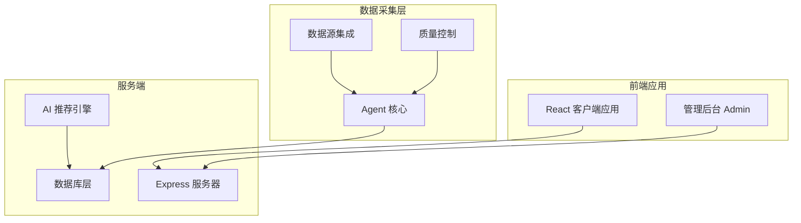
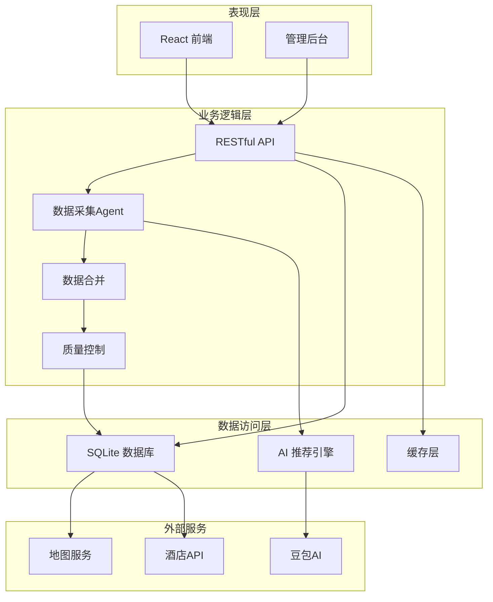
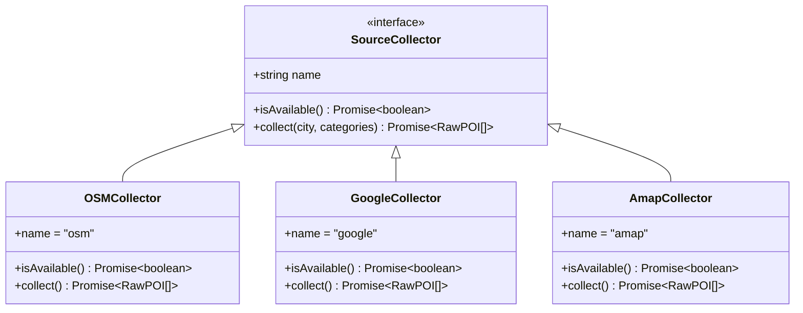
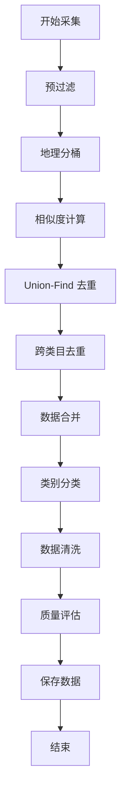
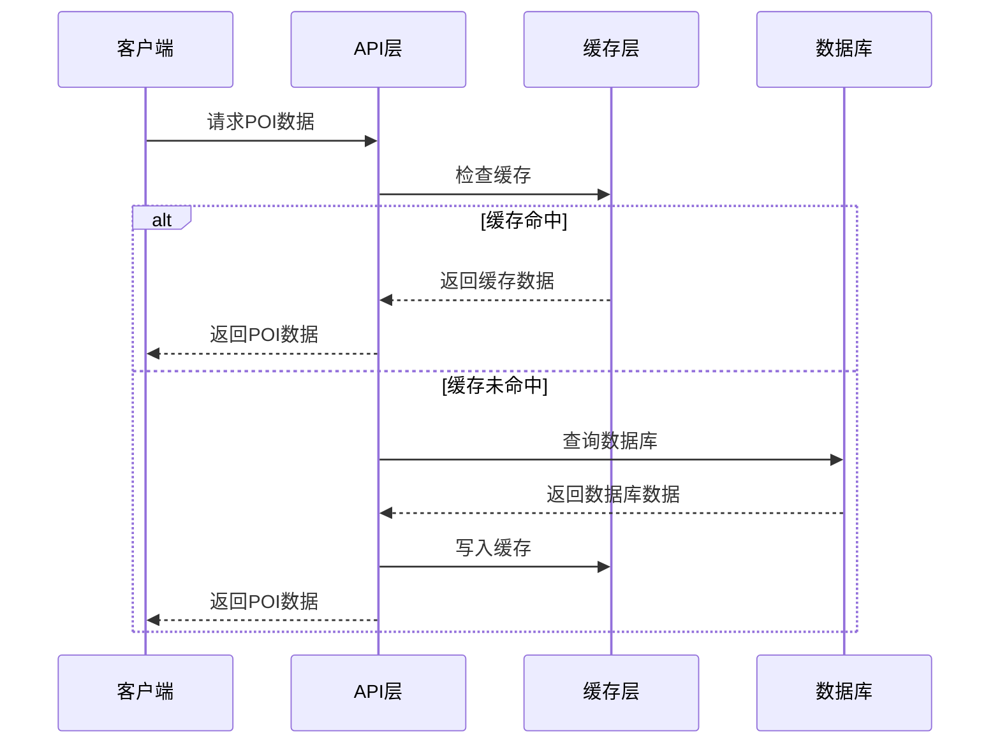
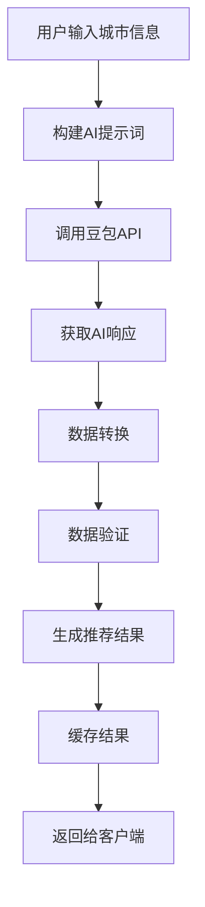
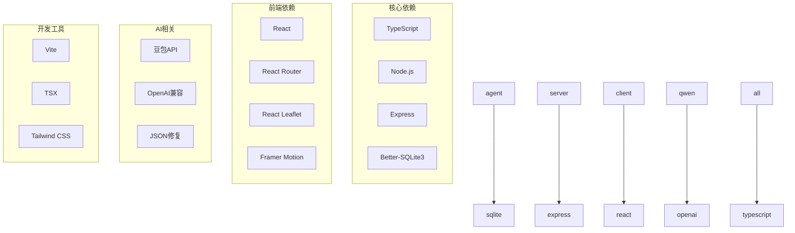

# 酒店数据增强系统

<cite>
**本文档引用的文件**
- [package.json](file://package.json)
- [agent/index.ts](file://agent/index.ts)
- [server/index.ts](file://server/index.ts)
- [agent/db.ts](file://agent/db.ts)
- [server/db.ts](file://server/db.ts)
- [agent/sources/base.ts](file://agent/sources/base.ts)
- [agent/merger.ts](file://agent/merger.ts)
- [agent/quality.ts](file://agent/quality.ts)
- [agent/categories.ts](file://agent/categories.ts)
- [agent/scheduler.ts](file://agent/scheduler.ts)
- [agent/exporter.ts](file://agent/exporter.ts)
- [server/qwen.ts](file://server/qwen.ts)
- [server/qwen-hotels.ts](file://server/qwen-hotels.ts)
- [src/App.tsx](file://src/App.tsx)
- [admin/App.tsx](file://admin/App.tsx)
</cite>

## 目录
1. [项目概述](#项目概述)
2. [项目结构](#项目结构)
3. [核心组件](#核心组件)
4. [架构概览](#架构概览)
5. [详细组件分析](#详细组件分析)
6. [依赖关系分析](#依赖关系分析)
7. [性能考虑](#性能考虑)
8. [故障排除指南](#故障排除指南)
9. [结论](#结论)

## 项目概述

酒店数据增强系统是一个基于人工智能的旅游数据处理平台，专注于为用户提供高质量的酒店和旅游目的地数据。该系统通过多种数据源收集、处理和增强POI（兴趣点）数据，特别是酒店相关信息，为行程规划应用提供准确、丰富的数据支持。

系统采用前后端分离架构，包含数据采集Agent、Web服务端和客户端应用三个主要部分。核心功能包括多源数据采集、智能数据合并、质量评估、实时酒店推荐等。

## 项目结构

项目采用模块化的目录结构，主要分为以下几个核心部分：



**图表来源**
- [package.json:1-60](file://package.json#L1-L60)
- [agent/index.ts:1-800](file://agent/index.ts#L1-L800)
- [server/index.ts:1-800](file://server/index.ts#L1-L800)

**章节来源**
- [package.json:1-60](file://package.json#L1-L60)
- [agent/index.ts:1-800](file://agent/index.ts#L1-L800)
- [server/index.ts:1-800](file://server/index.ts#L1-L800)

## 核心组件

### 数据采集Agent

Agent系统负责从多个数据源收集和处理POI数据，具有以下核心功能：

- **多源数据采集**：支持OSM、Foursquare、Google、高德地图、AI生成等多种数据源
- **智能合并去重**：使用Union-Find算法进行高效的数据去重
- **质量评估**：对采集的数据进行全面的质量检查和评分
- **增量更新**：支持按城市和时间维度的增量数据更新

### Web服务端

服务端提供RESTful API接口，支持以下功能：

- **POI数据查询**：提供城市级别的POI数据查询服务
- **酒店推荐**：基于AI模型生成酒店推荐列表
- **用户管理**：支持用户注册、登录和行程管理
- **缓存机制**：实现多层次的数据缓存策略

### 客户端应用

前端应用采用React技术栈，提供现代化的用户界面：

- **行程规划**：支持用户创建和管理旅行行程
- **酒店搜索**：提供酒店信息查询和预订功能
- **数据可视化**：展示POI数据和推荐结果
- **响应式设计**：适配多种设备和屏幕尺寸

**章节来源**
- [agent/index.ts:295-405](file://agent/index.ts#L295-L405)
- [server/index.ts:122-139](file://server/index.ts#L122-L139)
- [src/App.tsx:1-65](file://src/App.tsx#L1-L65)

## 架构概览

系统采用分层架构设计，确保各组件间的松耦合和高内聚：



**图表来源**
- [server/index.ts:1-800](file://server/index.ts#L1-L800)
- [agent/index.ts:1-800](file://agent/index.ts#L1-L800)
- [server/qwen.ts:1-492](file://server/qwen.ts#L1-L492)

## 详细组件分析

### Agent数据采集系统

Agent系统是整个系统的核心数据处理引擎，负责从多个数据源收集和处理POI数据。

#### 数据源集成架构



**图表来源**
- [agent/sources/base.ts:91-100](file://agent/sources/base.ts#L91-L100)
- [agent/index.ts:117-132](file://agent/index.ts#L117-L132)

#### 数据合并流程

Agent系统采用多阶段的数据合并策略：



**图表来源**
- [agent/merger.ts:552-800](file://agent/merger.ts#L552-L800)
- [agent/quality.ts:189-293](file://agent/quality.ts#L189-L293)

#### 数据质量控制

系统实现了全面的数据质量控制机制：

| 质量维度 | 指标 | 阈值 | 处理方式 |
|---------|------|------|----------|
| 完整性 | 字段覆盖率 | ≥80% | 自动补全 |
| 准确性 | 坐标精度 | ≤4位小数 | 自动修正 |
| 丰富度 | 描述长度 | ≥30字符 | 提示补充 |
| 多样性 | 类目分布 | 均匀分布 | 采样调整 |

**章节来源**
- [agent/merger.ts:487-550](file://agent/merger.ts#L487-L550)
- [agent/quality.ts:171-293](file://agent/quality.ts#L171-L293)

### 服务端API架构

服务端采用Express框架构建RESTful API，提供统一的数据访问接口。

#### API路由设计

```mermaid
graph LR
subgraph "POI相关路由"
POI1[/api/pois/:cityId]
POI2[/api/pois/:cityId/refresh]
end
subgraph "酒店相关路由"
HOTEL1[/api/hotels/:cityId]
HOTEL2[/api/bookings]
end
subgraph "用户相关路由"
USER1[/api/auth/register]
USER2[/api/auth/login]
USER3[/api/auth/me]
end
subgraph "行程相关路由"
TRIP1[/api/trips]
TRIP2[/api/trips/:id]
TRIP3[/api/trips/:id/publish]
end
```

**图表来源**
- [server/index.ts:122-183](file://server/index.ts#L122-L183)
- [server/index.ts:288-381](file://server/index.ts#L288-L381)

#### 缓存策略

服务端实现了三层缓存机制以提高性能：



**图表来源**
- [server/index.ts:122-139](file://server/index.ts#L122-L139)
- [server/db.ts:237-261](file://server/db.ts#L237-L261)

**章节来源**
- [server/index.ts:1-800](file://server/index.ts#L1-L800)
- [server/db.ts:1-582](file://server/db.ts#L1-L582)

### AI推荐引擎

系统集成了基于豆包（Doubao）AI模型的推荐引擎，提供智能化的数据增强功能。

#### 酒店推荐流程



**图表来源**
- [server/qwen-hotels.ts:208-283](file://server/qwen-hotels.ts#L208-L283)
- [server/qwen.ts:367-491](file://server/qwen.ts#L367-L491)

#### 多模态数据处理

系统支持多种数据类型的处理和转换：

| 数据类型 | 处理方式 | 输出格式 |
|---------|----------|----------|
| POI数据 | AI生成 + 多源融合 | 标准化POI格式 |
| 酒店数据 | AI生成 + 房型分析 | 酒店+房型结构 |
| 用户数据 | 注册认证 + 权限管理 | 用户信息结构 |
| 行程数据 | 创建编辑 + 状态管理 | 行程计划结构 |

**章节来源**
- [server/qwen-hotels.ts:1-284](file://server/qwen-hotels.ts#L1-L284)
- [server/qwen.ts:1-492](file://server/qwen.ts#L1-L492)

## 依赖关系分析

系统采用模块化设计，各组件间通过清晰的接口进行交互。



**图表来源**
- [package.json:26-58](file://package.json#L26-L58)
- [agent/index.ts:24-54](file://agent/index.ts#L24-L54)

**章节来源**
- [package.json:1-60](file://package.json#L1-L60)
- [agent/index.ts:1-800](file://agent/index.ts#L1-L800)

## 性能考虑

系统在设计时充分考虑了性能优化，采用了多种策略来提升响应速度和用户体验。

### 数据库优化

- **索引优化**：为常用查询字段建立索引，包括城市ID、更新时间等
- **连接池管理**：使用Better-SQLite3的连接池机制，减少连接开销
- **事务处理**：批量操作使用事务，确保数据一致性和性能

### 缓存策略

- **多级缓存**：内存缓存 + 文件缓存 + 数据库缓存
- **智能过期**：根据数据类型设置不同的缓存过期策略
- **预热机制**：启动时预加载热门数据

### API优化

- **并发控制**：限制同时进行的数据采集任务数量
- **错误重试**：对外部API调用实现智能重试机制
- **超时控制**：为所有网络请求设置合理的超时时间

## 故障排除指南

### 常见问题及解决方案

#### 数据采集失败

**问题症状**：Agent运行时报错，无法从数据源获取数据

**可能原因**：
- API密钥配置错误
- 网络连接异常
- 数据源服务不可用

**解决步骤**：
1. 检查API密钥配置
2. 验证网络连接
3. 查看数据源可用性状态

#### 数据质量异常

**问题症状**：POI数据质量评分较低或存在明显错误

**可能原因**：
- 数据源质量差
- 合并算法冲突
- 清洗规则过于严格

**解决步骤**：
1. 检查数据源质量
2. 调整合并参数
3. 优化清洗规则

#### 性能问题

**问题症状**：系统响应缓慢，API调用超时

**可能原因**：
- 数据库查询性能不足
- 缓存配置不当
- 并发请求过多

**解决步骤**：
1. 分析慢查询日志
2. 优化缓存策略
3. 调整并发限制

**章节来源**
- [agent/index.ts:575-678](file://agent/index.ts#L575-L678)
- [server/index.ts:724-728](file://server/index.ts#L724-L728)

## 结论

酒店数据增强系统通过先进的技术架构和完善的质量控制机制，成功实现了多源数据的智能整合和增强。系统的主要优势包括：

1. **技术先进性**：采用最新的AI技术和数据处理算法
2. **架构合理性**：模块化设计便于维护和扩展
3. **性能优异**：多层缓存和优化策略确保良好的用户体验
4. **质量可靠**：全面的质量控制和验证机制保证数据准确性

该系统为旅行规划应用提供了坚实的数据基础，能够有效提升用户的旅行体验和满意度。未来可以进一步优化AI推荐算法，扩展更多数据源，以及增强移动端的用户体验。