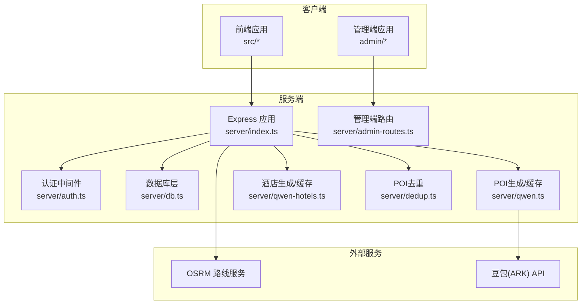
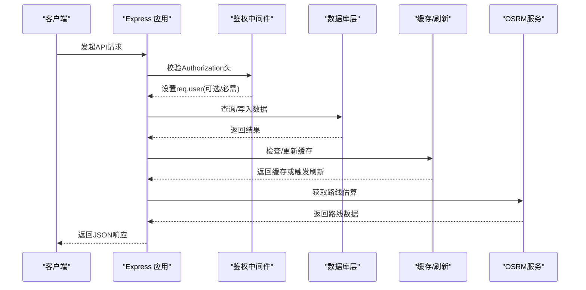
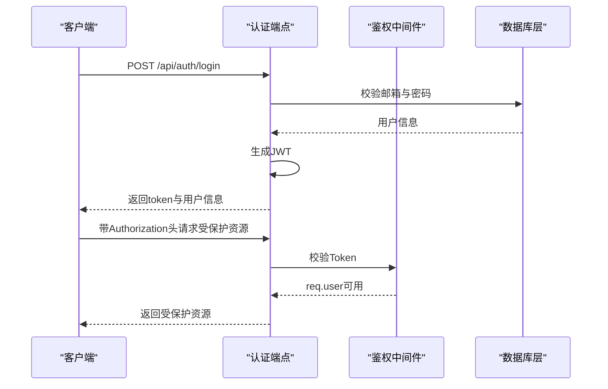
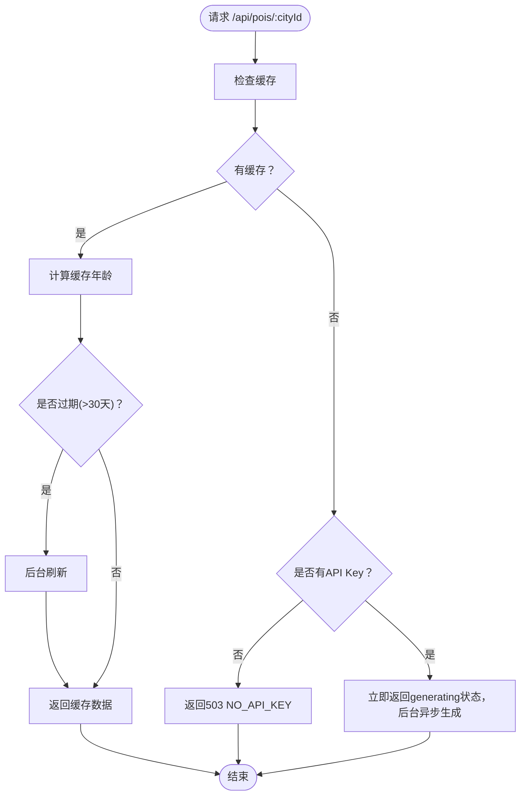
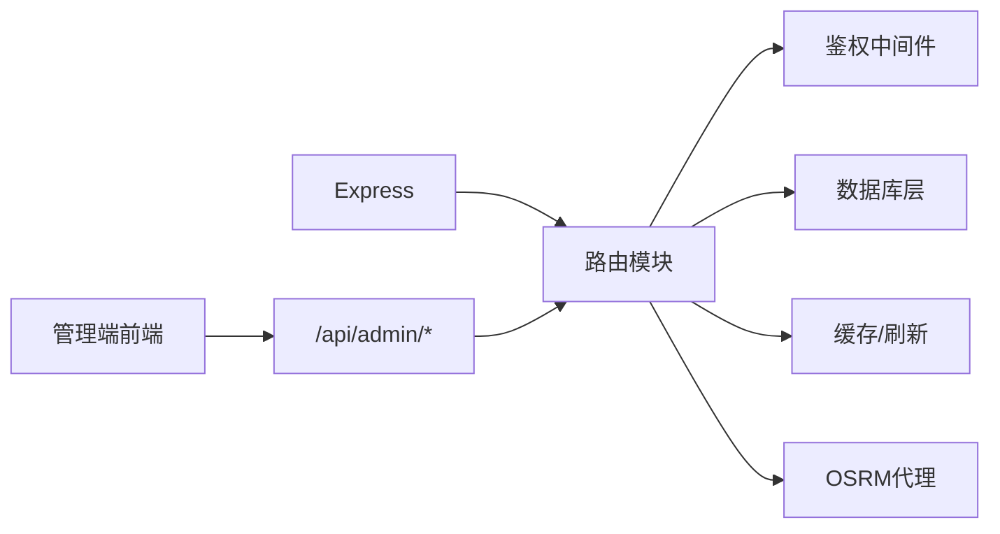

# API参考文档

<cite>
**本文档引用的文件**
- [server/index.ts](file://server/index.ts)
- [server/admin-routes.ts](file://server/admin-routes.ts)
- [server/auth.ts](file://server/auth.ts)
- [server/db.ts](file://server/db.ts)
- [server/qwen.ts](file://server/qwen.ts)
- [server/qwen-hotels.ts](file://server/qwen-hotels.ts)
- [server/dedup.ts](file://server/dedup.ts)
- [api/index.ts](file://api/index.ts)
- [admin/lib/api.ts](file://admin/lib/api.ts)
- [src/types/index.ts](file://src/types/index.ts)
- [package.json](file://package.json)
- [vercel.json](file://vercel.json)
</cite>

## 目录
1. [简介](#简介)
2. [项目结构](#项目结构)
3. [核心组件](#核心组件)
4. [架构总览](#架构总览)
5. [详细组件分析](#详细组件分析)
6. [依赖关系分析](#依赖关系分析)
7. [性能与缓存策略](#性能与缓存策略)
8. [故障排查与错误处理](#故障排查与错误处理)
9. [结论](#结论)
10. [附录](#附录)

## 简介
本API参考文档面向旅行规划Demo的后端服务，覆盖POI查询、旅行规划、用户管理、游记与评论、酒店预订、路线导航等核心能力。文档详细列出所有RESTful端点、请求参数、响应格式、鉴权方式、分页与过滤、错误码说明、版本控制策略与兼容性、以及客户端集成建议。

## 项目结构
后端采用Express + better-sqlite3，按功能模块划分路由与数据层：
- 服务入口与路由：server/index.ts
- 管理端路由：server/admin-routes.ts
- 认证与鉴权：server/auth.ts
- 数据库层：server/db.ts
- AI数据源与缓存：server/qwen.ts、server/qwen-hotels.ts、server/dedup.ts
- 客户端入口：api/index.ts
- 管理端HTTP封装：admin/lib/api.ts
- 类型定义：src/types/index.ts
- 版本与部署：package.json、vercel.json

图表来源
- [server/index.ts:1-790](file://server/index.ts#L1-L790)
- [server/admin-routes.ts:1-800](file://server/admin-routes.ts#L1-L800)
- [server/auth.ts:1-133](file://server/auth.ts#L1-L133)
- [server/db.ts:1-513](file://server/db.ts#L1-L513)
- [server/qwen.ts](file://server/qwen.ts)
- [server/qwen-hotels.ts](file://server/qwen-hotels.ts)
- [server/dedup.ts](file://server/dedup.ts)

章节来源
- [server/index.ts:1-790](file://server/index.ts#L1-L790)
- [server/admin-routes.ts:1-800](file://server/admin-routes.ts#L1-L800)
- [server/auth.ts:1-133](file://server/auth.ts#L1-L133)
- [server/db.ts:1-513](file://server/db.ts#L1-L513)
- [api/index.ts:1-8](file://api/index.ts#L1-L8)
- [vercel.json:1-5](file://vercel.json#L1-L5)

## 核心组件
- 路由与端点：提供POI、酒店、用户、旅行计划、游记与评论、预订、路线导航等REST接口
- 认证与授权：基于JWT的可选/必需鉴权中间件
- 数据库层：SQLite表结构与CRUD操作封装
- 缓存策略：POI/酒店三段式缓存（新鲜/陈旧/过期）与后台刷新
- 管理端：POI浏览、搜索、评分过滤、发布与对比
- 外部集成：OSRM路线服务、豆包(ARK)API

章节来源
- [server/index.ts:108-160](file://server/index.ts#L108-L160)
- [server/admin-routes.ts:707-798](file://server/admin-routes.ts#L707-L798)
- [server/auth.ts:87-113](file://server/auth.ts#L87-L113)
- [server/db.ts:37-147](file://server/db.ts#L37-L147)

## 架构总览
- 请求进入Express应用，经鉴权中间件处理后路由到各业务模块
- POI/酒店数据通过AI生成并缓存至SQLite；若缓存陈旧则触发后台刷新
- 管理端通过独立路由对Agent DB与Server DB进行对比与发布
- OSRM用于路线估算；外部API用于POI/酒店生成

图表来源
- [server/index.ts:287-308](file://server/index.ts#L287-L308)
- [server/auth.ts:87-113](file://server/auth.ts#L87-L113)
- [server/db.ts:237-261](file://server/db.ts#L237-L261)

## 详细组件分析

### 认证与授权
- 可选鉴权：在请求头携带Bearer Token时设置req.user，否则放行
- 必需鉴权：要求有效Token，否则返回401
- 密码哈希：PBKDF2 + 随机盐
- JWT签名：HS256，有效期7天
- 邮箱验证码：10分钟有效期，一次性使用

图表来源
- [server/auth.ts:37-113](file://server/auth.ts#L37-L113)
- [server/index.ts:318-401](file://server/index.ts#L318-L401)

章节来源
- [server/auth.ts:19-81](file://server/auth.ts#L19-L81)
- [server/auth.ts:87-113](file://server/auth.ts#L87-L113)
- [server/index.ts:318-401](file://server/index.ts#L318-L401)

### POI查询与缓存
- 端点：GET /api/pois/:cityId
- 参数：cityName、cityNameEn（查询字符串）
- 响应：包含fromCache、refreshing、stale、cacheAgeHours、currentSeason等元信息
- 缓存策略：新鲜(≤15天)、陈旧(≤30天)、过期(>30天)，过期时后台刷新
- 无缓存且无API Key时返回503

图表来源
- [server/index.ts:108-144](file://server/index.ts#L108-L144)
- [server/db.ts:237-261](file://server/db.ts#L237-L261)

章节来源
- [server/index.ts:108-144](file://server/index.ts#L108-L144)
- [server/db.ts:237-261](file://server/db.ts#L237-L261)

### 强制刷新POI
- 端点：POST /api/pois/:cityId/refresh
- 参数：cityName、cityNameEn（查询或请求体）
- 行为：调用豆包API拉取最新POI并入库

章节来源
- [server/index.ts:146-160](file://server/index.ts#L146-L160)
- [server/qwen.ts](file://server/qwen.ts)

### 酒店查询与缓存
- 端点：GET /api/hotels/:cityId
- 参数：cityName、cityNameEn（查询字符串）
- 行为：与POI类似，支持缓存与后台刷新

章节来源
- [server/index.ts:186-212](file://server/index.ts#L186-L212)
- [server/db.ts:430-454](file://server/db.ts#L430-L454)

### 用户与会话
- 注册：POST /api/auth/register（邮箱、密码、昵称）
- 登录：POST /api/auth/login（邮箱、密码）
- 当前用户：GET /api/auth/me（需鉴权）
- 发送验证码：POST /api/auth/send-code（邮箱）
- 重置密码：POST /api/auth/reset-password（邮箱、验证码、新密码）
- 修改昵称：PUT /api/auth/nickname（需鉴权）

章节来源
- [server/index.ts:318-410](file://server/index.ts#L318-L410)
- [server/auth.ts:19-81](file://server/auth.ts#L19-L81)

### 旅行计划与游记
- 列表：GET /api/trips（需鉴权）
- 保存：POST /api/trips（需鉴权）
- 加载：GET /api/trips/:id（需鉴权）
- 更新：PUT /api/trips/:id（需鉴权）
- 删除：DELETE /api/trips/:id（需鉴权）
- 发布：POST /api/trips/:id/publish（需鉴权，需至少一条微游记）
- 取消发布：POST /api/trips/:id/unpublish（需鉴权）
- 开关评论：PUT /api/trips/:id/comments-toggle（需鉴权）

- 公开展示
  - 列表：GET /api/notes（可匿名，但仅公开发布）
  - 详情：GET /api/notes/:id（可匿名，未公开需作者可见）
  - 评论列表：GET /api/notes/:id/comments
  - 新增评论：POST /api/notes/:id/comments（需鉴权）
  - 删除评论：DELETE /api/notes/:id/comments/:cid（作者或游记作者可删）

- 微游记（微笔记）
  - 列表：GET /api/trips/:id/micro-notes（可匿名）
  - 创建/更新：POST /api/trips/:id/micro-notes（需鉴权）
  - 删除：DELETE /api/trips/:id/micro-notes/:noteId（需鉴权）

章节来源
- [server/index.ts:413-665](file://server/index.ts#L413-L665)
- [server/db.ts:149-233](file://server/db.ts#L149-L233)

### 预订与支付
- 创建预订：POST /api/bookings（需鉴权）
- 列表：GET /api/bookings（需鉴权）
- 详情：GET /api/bookings/:id（需鉴权，仅本人可见）
- 取消：PUT /api/bookings/:id/cancel（需鉴权，仅本人可见）
- 更新状态：PUT /api/bookings/:id/status（需鉴权，仅本人可见）

章节来源
- [server/index.ts:216-283](file://server/index.ts#L216-L283)
- [server/db.ts:458-512](file://server/db.ts#L458-L512)

### 路线导航
- 端点：GET /api/transit/route
- 参数：coords（经度,纬度,经度,纬度，逗号分隔）
- 行为：代理OSRM服务，返回驾车与公共交通估算

章节来源
- [server/index.ts:287-308](file://server/index.ts#L287-L308)

### 管理端API
- 统计：GET /api/admin/stats
- 城市：GET /api/admin/cities、POST /api/admin/cities、PUT /api/admin/cities/:id、DELETE /api/admin/cities/:id
- 分类树：GET /api/admin/categories
- POI列表：GET /api/admin/pois（支持city/l1/l2/l3/scoreGrade/page/pageSize过滤）
- POI搜索：GET /api/admin/pois/search（支持q、city、l1/l2/l3、scoreGrade、分页）
- POI详情：GET /api/admin/pois/:id
- 批量更新：POST /api/admin/updates/batch
- 单点更新：POST /api/admin/updates/targeted
- 更新作业：GET /api/admin/updates、GET /api/admin/updates/:id
- 审核概览：GET /api/admin/review/summary
- 审核详情：GET /api/admin/review/city/:id
- 发布：POST /api/admin/publish/city、POST /api/admin/publish/pois
- 发布校验：GET /api/admin/publish/validate/:id

章节来源
- [server/admin-routes.ts:444-798](file://server/admin-routes.ts#L444-L798)

### 数据模型与类型
- 用户、旅行计划、游记、评论、微游记、酒店、预订等类型定义见前端类型文件

章节来源
- [src/types/index.ts:154-239](file://src/types/index.ts#L154-L239)

## 依赖关系分析
- 服务端依赖：Express、better-sqlite3、cors、dotenv
- 管理端HTTP封装：admin/lib/api.ts统一前缀与错误处理
- 部署重写：vercel.json将/api/*重写到/api

图表来源
- [server/index.ts:29-53](file://server/index.ts#L29-L53)
- [admin/lib/api.ts:1-33](file://admin/lib/api.ts#L1-L33)
- [vercel.json:1-5](file://vercel.json#L1-L5)

章节来源
- [package.json:26-43](file://package.json#L26-L43)
- [admin/lib/api.ts:1-33](file://admin/lib/api.ts#L1-L33)
- [vercel.json:1-5](file://vercel.json#L1-L5)

## 性能与缓存策略
- 缓存 TTL
  - 新鲜：15天
  - 陈旧：30天
  - 过期：>30天
- 后台刷新：过期时立即返回旧数据，后台异步刷新，避免超时
- 响应字段：fromCache、refreshing、stale、cacheAgeHours、currentSeason
- 管理端搜索：支持关键词、分类、评分等级过滤与分页

章节来源
- [server/index.ts:64-100](file://server/index.ts#L64-L100)
- [server/index.ts:116-126](file://server/index.ts#L116-L126)
- [server/admin-routes.ts:707-798](file://server/admin-routes.ts#L707-L798)

## 故障排查与错误处理
- 通用错误结构：success、error、message、warning（部分场景）
- 常见HTTP状态
  - 400：缺少字段、非法状态、评论内容为空、不可取消等
  - 401：未提供有效Token
  - 403：禁止访问（非本人资源）
  - 404：资源不存在
  - 500：内部错误
  - 503：服务端未配置API Key且无缓存
- 鉴权失败：返回“AUTH_REQUIRED”或“TOKEN_INVALID”
- 验证码：10分钟有效期，一次性使用

章节来源
- [server/index.ts:129-143](file://server/index.ts#L129-L143)
- [server/index.ts:219-221](file://server/index.ts#L219-L221)
- [server/index.ts:261-268](file://server/index.ts#L261-L268)
- [server/index.ts:370-394](file://server/index.ts#L370-L394)
- [server/auth.ts:102-113](file://server/auth.ts#L102-L113)

## 结论
本API以模块化设计实现旅行规划核心能力，结合三段式缓存与后台刷新提升可用性，提供可选/必需鉴权与完善的错误处理。管理端提供POI浏览、搜索、评分过滤与发布流程，便于内容治理。客户端可通过统一的HTTP封装与类型定义快速集成。

## 附录

### API端点一览与参数
- POI
  - GET /api/pois/:cityId?cityName=&cityNameEn=
  - POST /api/pois/:cityId/refresh?cityName=&cityNameEn=
- 酒店
  - GET /api/hotels/:cityId?cityName=&cityNameEn=
- 用户与会话
  - POST /api/auth/register
  - POST /api/auth/login
  - GET /api/auth/me
  - POST /api/auth/send-code
  - POST /api/auth/reset-password
  - PUT /api/auth/nickname
- 旅行计划
  - GET /api/trips
  - POST /api/trips
  - GET /api/trips/:id
  - PUT /api/trips/:id
  - DELETE /api/trips/:id
  - POST /api/trips/:id/publish
  - POST /api/trips/:id/unpublish
  - PUT /api/trips/:id/comments-toggle
- 游记与评论
  - GET /api/notes?limit=&offset=
  - GET /api/notes/:id
  - GET /api/notes/:id/comments
  - POST /api/notes/:id/comments
  - DELETE /api/notes/:id/comments/:cid
- 微游记
  - GET /api/trips/:id/micro-notes
  - POST /api/trips/:id/micro-notes
  - DELETE /api/trips/:id/micro-notes/:noteId
- 预订
  - POST /api/bookings
  - GET /api/bookings
  - GET /api/bookings/:id
  - PUT /api/bookings/:id/cancel
  - PUT /api/bookings/:id/status
- 路线导航
  - GET /api/transit/route?coords=lon,lat,lon,lat
- 管理端
  - GET /api/admin/stats
  - GET /api/admin/cities
  - POST /api/admin/cities
  - PUT /api/admin/cities/:id
  - DELETE /api/admin/cities/:id
  - GET /api/admin/categories
  - GET /api/admin/pois?city=&l1=&l2=&l3=&page=&pageSize=&scoreMin=&scoreMax=&scoreGrade=
  - GET /api/admin/pois/search?q=&city=&l1=&l2=&l3=&page=&pageSize=&scoreGrade=
  - GET /api/admin/pois/:id
  - POST /api/admin/updates/batch
  - POST /api/admin/updates/targeted
  - GET /api/admin/updates
  - GET /api/admin/updates/:id
  - GET /api/admin/review/summary
  - GET /api/admin/review/city/:id
  - POST /api/admin/publish/city
  - POST /api/admin/publish/pois
  - GET /api/admin/publish/validate/:id

章节来源
- [server/index.ts:108-665](file://server/index.ts#L108-L665)
- [server/admin-routes.ts:444-798](file://server/admin-routes.ts#L444-L798)

### 认证与权限
- 可选鉴权：Authorization: Bearer <token>
- 必需鉴权：同上，缺失或过期返回401
- 资源归属：旅行计划、微游记、评论、预订均按用户ID校验

章节来源
- [server/auth.ts:87-113](file://server/auth.ts#L87-L113)
- [server/index.ts:414-416](file://server/index.ts#L414-L416)
- [server/index.ts:464-466](file://server/index.ts#L464-L466)
- [server/index.ts:637-640](file://server/index.ts#L637-L640)
- [server/index.ts:652-664](file://server/index.ts#L652-L664)
- [server/index.ts:253-258](file://server/index.ts#L253-L258)
- [server/index.ts:261-271](file://server/index.ts#L261-L271)

### 分页、排序与过滤
- 分页：limit/offset（游记列表），page/pageSize（管理端POI）
- 排序：管理端支持按评分等级过滤（A/B/C/D）
- 过滤：城市、分类(L1/L2/L3)、关键词搜索、评分范围

章节来源
- [server/index.ts:560-564](file://server/index.ts#L560-L564)
- [server/admin-routes.ts:707-798](file://server/admin-routes.ts#L707-L798)

### 错误码说明
- 成功：success=true
- 常见错误：MISSING_FIELDS、INVALID_EMAIL、WEAK_PASSWORD、EMAIL_EXISTS、INVALID_CREDENTIALS、USER_NOT_FOUND、MISSING_NICKNAME、INVALID_STATUS、ALREADY_CANCELLED、CANNOT_CANCEL、NOT_FOUND、FORBIDDEN、COMMENTS_DISABLED、EMPTY_CONTENT、COMMENT_NOT_FOUND、NO_API_KEY、API_ERROR、AUTH_REQUIRED、TOKEN_INVALID
- 警告：warning字段提示降级使用缓存

章节来源
- [server/index.ts:319-401](file://server/index.ts#L319-L401)
- [server/index.ts:219-221](file://server/index.ts#L219-L221)
- [server/index.ts:261-268](file://server/index.ts#L261-L268)
- [server/index.ts:637-640](file://server/index.ts#L637-L640)
- [server/index.ts:129-143](file://server/index.ts#L129-L143)

### 版本控制与兼容性
- 项目版本：0.3.2
- 部署重写：/api/* 重写到 /api，保持单一入口
- 建议：未来新增端点以 /api/v1/ 前缀扩展，保留现有端点不变

章节来源
- [package.json:4](file://package.json#L4)
- [vercel.json:2-4](file://vercel.json#L2-L4)

### 客户端集成示例与SDK
- 管理端HTTP封装：admin/lib/api.ts 提供统一的GET/POST/PUT/DELETE方法，自动拼接 /api/admin 前缀并抛出带状态码的异常
- 建议：前端在拦截器中统一注入Authorization头，捕获ApiError并提示用户

章节来源
- [admin/lib/api.ts:1-33](file://admin/lib/api.ts#L1-L33)

### 限流、错误处理与调试技巧
- 限流：可在客户端或网关层增加请求频率限制
- 错误处理：统一解析4xx/5xx响应，读取message或error字段
- 调试：关注服务端日志中的缓存去重统计、后台刷新触发、OSRM代理错误

章节来源
- [server/index.ts:122-125](file://server/index.ts#L122-L125)
- [server/index.ts:290-307](file://server/index.ts#L290-L307)