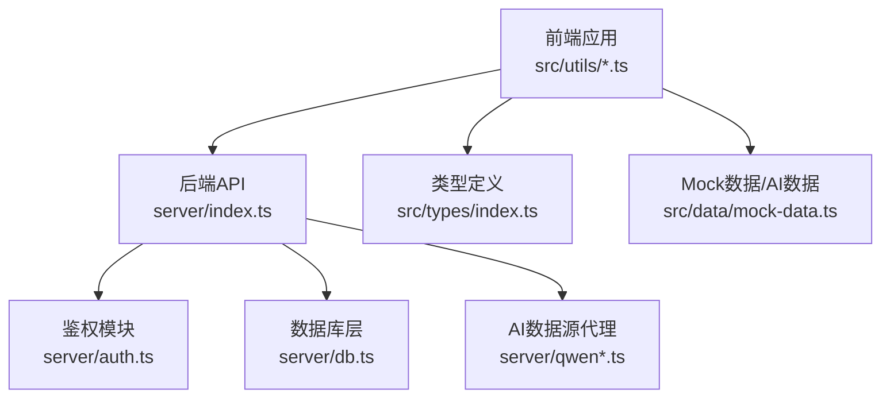
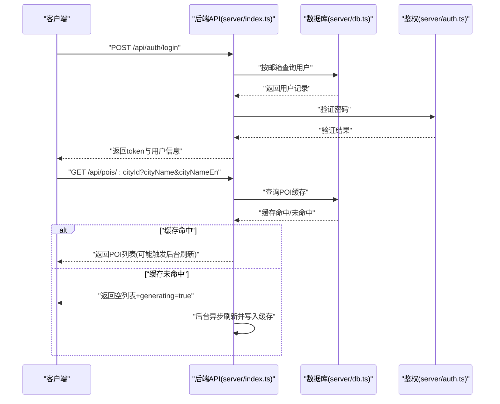
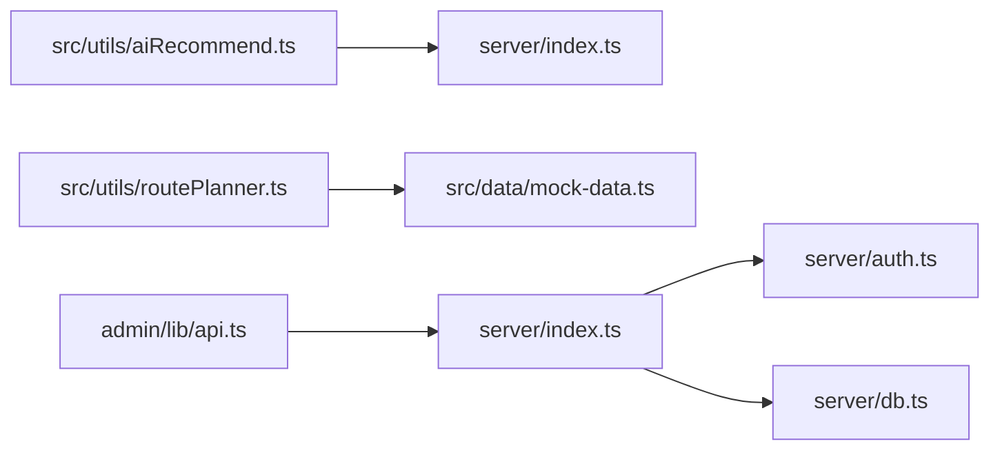

# 客户端API

<cite>
**本文引用的文件**
- [server/index.ts](file://server/index.ts)
- [src/utils/aiRecommend.ts](file://src/utils/aiRecommend.ts)
- [src/utils/routePlanner.ts](file://src/utils/routePlanner.ts)
- [src/types/index.ts](file://src/types/index.ts)
- [src/data/mock-data.ts](file://src/data/mock-data.ts)
- [server/auth.ts](file://server/auth.ts)
- [server/db.ts](file://server/db.ts)
- [admin/lib/api.ts](file://admin/lib/api.ts)
- [api/index.ts](file://api/index.ts)
</cite>

## 目录
1. [简介](#简介)
2. [项目结构](#项目结构)
3. [核心组件](#核心组件)
4. [架构总览](#架构总览)
5. [详细组件分析](#详细组件分析)
6. [依赖关系分析](#依赖关系分析)
7. [性能考量](#性能考量)
8. [故障排查指南](#故障排查指南)
9. [结论](#结论)
10. [附录](#附录)

## 简介
本文件面向前端开发者，系统性梳理客户端可直接使用的API端点与交互规范，覆盖POI查询、旅行规划、用户管理、地图服务、酒店与预订、游记与评论等核心能力。文档同时说明HTTP方法、URL模式、请求参数、响应格式、错误码、鉴权方式、版本控制策略与向后兼容性，并提供客户端集成要点、SDK使用建议、性能优化与调试技巧。

## 项目结构
- 后端服务入口位于 server/index.ts，统一暴露REST API。
- 前端通过 src/utils/aiRecommend.ts 与 src/utils/routePlanner.ts 调用后端API。
- 数据模型定义于 src/types/index.ts，用于前后端契约一致。
- Mock数据与AI推荐数据由 src/data/mock-data.ts 提供，支持离线演示与AI数据回填。
- 鉴权逻辑位于 server/auth.ts，数据库层位于 server/db.ts。
- 管理端API封装位于 admin/lib/api.ts。

图表来源
- [server/index.ts:1-790](file://server/index.ts#L1-L790)
- [src/utils/aiRecommend.ts:1-251](file://src/utils/aiRecommend.ts#L1-L251)
- [src/utils/routePlanner.ts:1-800](file://src/utils/routePlanner.ts#L1-L800)
- [src/types/index.ts:1-239](file://src/types/index.ts#L1-L239)
- [src/data/mock-data.ts:1-800](file://src/data/mock-data.ts#L1-L800)
- [server/auth.ts:1-133](file://server/auth.ts#L1-L133)
- [server/db.ts:1-200](file://server/db.ts#L1-L200)

章节来源
- [server/index.ts:1-790](file://server/index.ts#L1-L790)
- [api/index.ts:1-8](file://api/index.ts#L1-L8)

## 核心组件
- POI推荐与缓存：后端提供城市级POI列表查询与强制刷新接口；前端通过轮询实现“后台刷新”体验。
- 旅行规划：前端路由规划器基于POI数据生成多日行程，支持餐食插入、自动填充与时间窗约束。
- 用户与鉴权：注册、登录、获取当前用户、发送/校验验证码、重置密码、修改昵称。
- 行程与游记：保存/更新/删除行程；发布/取消发布为游记；评论与回复。
- 地图与路线：OSRM代理，计算驾车段距离与时间，并估算公共交通耗时。
- 酒店与预订：查询城市酒店、创建/查询/取消/更新预订状态。
- 微游记：为行程中的POI添加短评、图片与心情。

章节来源
- [server/index.ts:108-160](file://server/index.ts#L108-L160)
- [server/index.ts:186-212](file://server/index.ts#L186-L212)
- [server/index.ts:318-410](file://server/index.ts#L318-L410)
- [server/index.ts:413-555](file://server/index.ts#L413-L555)
- [server/index.ts:287-314](file://server/index.ts#L287-L314)
- [server/index.ts:216-283](file://server/index.ts#L216-L283)
- [server/index.ts:669-751](file://server/index.ts#L669-L751)

## 架构总览
后端采用Express + SQLite方案，提供统一REST API；前端通过fetch调用后端接口，部分流程包含轮询与缓存策略，确保用户体验与性能平衡。

图表来源
- [server/index.ts:108-160](file://server/index.ts#L108-L160)
- [server/index.ts:339-357](file://server/index.ts#L339-L357)
- [server/auth.ts:102-113](file://server/auth.ts#L102-L113)
- [server/db.ts:37-147](file://server/db.ts#L37-L147)

## 详细组件分析

### POI查询与刷新
- 端点
  - GET /api/pois/:cityId
    - 查询参数：cityName、cityNameEn（字符串）
    - 返回字段：success、data（POI数组）、fromCache、refreshing、generating、stale、cacheAgeHours、currentSeason、dedupStats（可选）
  - POST /api/pois/:cityId/refresh
    - 请求体：cityName、cityNameEn（可选）
    - 返回字段：success、data（POI数组）、fromCache、refreshing、currentSeason
- 特性
  - 三层缓存策略：15天内直接返回；15-30天返回旧数据并触发后台刷新；30天以上则先刷新再返回。
  - 首次生成或后台刷新时，返回 generating=true；刷新完成后前端可通过轮询检测 refreshing=false。
- 错误码
  - NO_API_KEY：服务端未配置API Key且无缓存
  - API_ERROR：API调用异常
- 响应示例
  - 成功（缓存命中）：包含fromCache=true、refreshing标识是否正在刷新
  - 成功（首次生成）：返回空data并generating=true
  - 失败：返回error字段与message

章节来源
- [server/index.ts:108-160](file://server/index.ts#L108-L160)
- [src/utils/aiRecommend.ts:44-94](file://src/utils/aiRecommend.ts#L44-L94)
- [src/utils/aiRecommend.ts:99-143](file://src/utils/aiRecommend.ts#L99-L143)

### 酒店查询与刷新
- 端点
  - GET /api/hotels/:cityId
    - 查询参数：cityName、cityNameEn（字符串）
    - 返回字段：success、data（酒店数组）、fromCache、refreshing、stale、cacheAgeHours
- 特性
  - 与POI相同的三层缓存策略；无缓存时返回generating=true并触发后台刷新。
- 错误码
  - NO_API_KEY：服务端未配置API Key且无缓存
  - API_ERROR：API调用异常

章节来源
- [server/index.ts:186-212](file://server/index.ts#L186-L212)

### 地图与路线
- 端点
  - GET /api/transit/route
    - 查询参数：coords（经度,纬度字符串，例如 "120.123,30.456,120.789,31.012"）
    - 返回字段：success、legs（每个leg包含driving与transit字段）
- 特性
  - 代理Project OSRM，返回驾车段距离与时间，并估算公共交通耗时与方式。
- 错误码
  - coords参数缺失
  - OSRM不可用或返回非Ok状态

章节来源
- [server/index.ts:287-314](file://server/index.ts#L287-L314)

### 用户与鉴权
- 端点
  - POST /api/auth/register
    - 请求体：email、password、nickname（可选）
    - 返回：success、token、user
  - POST /api/auth/login
    - 请求体：email、password
    - 返回：success、token、user
  - GET /api/auth/me
    - 需要Bearer Token
    - 返回：success、user
  - POST /api/auth/send-code
    - 请求体：email
    - 返回：success、message
  - POST /api/auth/reset-password
    - 请求体：email、code、newPassword
    - 返回：success、message
  - PUT /api/auth/nickname
    - 请求体：nickname
    - 需要Bearer Token
    - 返回：success
- 鉴权机制
  - 使用JWT，有效期7天；optionalAuth允许匿名访问，requireAuth要求有效token。
- 错误码
  - MISSING_FIELDS、INVALID_EMAIL、WEAK_PASSWORD、EMAIL_EXISTS、INVALID_CREDENTIALS、USER_NOT_FOUND、MISSING_EMAIL、INVALID_CODE、MISSING_NICKNAME

章节来源
- [server/index.ts:318-410](file://server/index.ts#L318-L410)
- [server/auth.ts:87-113](file://server/auth.ts#L87-L113)

### 行程与游记
- 端点
  - GET /api/trips
    - 需要Bearer Token
    - 返回：success、trips（摘要列表）
  - POST /api/trips
    - 请求体：tripData（字符串或对象）、title、coverImage
    - 返回：success、tripId
  - GET /api/trips/:id
    - 需要Bearer Token
    - 返回：success、trip（完整tripData）
  - PUT /api/trips/:id
    - 请求体：tripData、title、coverImage
    - 返回：success
  - DELETE /api/trips/:id
    - 返回：success
  - POST /api/trips/:id/publish
    - 请求体：publishNote（可选）
    - 返回：success
  - POST /api/trips/:id/unpublish
    - 返回：success
  - PUT /api/trips/:id/comments-toggle
    - 请求体：allow（布尔）
    - 返回：success
- 游记公开列表
  - GET /api/notes
    - 查询参数：limit（默认20，最大50）、offset
    - 返回：success、notes（列表）、total
  - GET /api/notes/:id
    - 返回：success、note（完整数据，含作者信息、tripData）
- 评论
  - GET /api/notes/:id/comments
    - 返回：success、comments
  - POST /api/notes/:id/comments
    - 请求体：content
    - 需要Bearer Token
    - 返回：success、comment（含昵称与头像）
  - DELETE /api/notes/:id/comments/:cid
    - 需要Bearer Token
    - 返回：success
- 微游记
  - GET /api/trips/:id/micro-notes
    - 返回：success、data（微游记列表）
  - POST /api/trips/:id/micro-notes
    - 请求体：poiId、poiName、poiLat、poiLng、poiType、dayNumber、content、images、mood
    - 需要Bearer Token
    - 返回：success、data（微游记）
  - DELETE /api/trips/:id/micro-notes/:noteId
    - 需要Bearer Token
    - 返回：success
- 错误码
  - FORBIDDEN、NOT_FOUND、ALREADY_CANCELLED、CANNOT_CANCEL、INVALID_STATUS、NO_CONTENT、COMMENTS_DISABLED、EMPTY_CONTENT、COMMENT_NOT_FOUND

章节来源
- [server/index.ts:413-555](file://server/index.ts#L413-L555)
- [server/index.ts:559-665](file://server/index.ts#L559-L665)
- [server/index.ts:669-751](file://server/index.ts#L669-L751)

### 酒店预订
- 端点
  - POST /api/bookings
    - 请求体：hotelId、hotelName、hotelAddress、hotelImage、roomTypeId、roomTypeName、checkIn、checkOut、nights、guestName、guestPhone、guestEmail、totalPrice、cityName
    - 需要Bearer Token
    - 返回：success、booking
  - GET /api/bookings
    - 需要Bearer Token
    - 返回：success、bookings
  - GET /api/bookings/:id
    - 需要Bearer Token
    - 返回：success、booking 或 403/404
  - PUT /api/bookings/:id/cancel
    - 需要Bearer Token
    - 返回：success 或 400（已入住/已完成无法取消）
  - PUT /api/bookings/:id/status
    - 请求体：status（pending/confirmed/checked-in/completed/cancelled）
    - 需要Bearer Token
    - 返回：success

章节来源
- [server/index.ts:216-283](file://server/index.ts#L216-L283)

### 健康检查
- 端点
  - GET /api/health
  - 返回：status、hasApiKey

章节来源
- [server/index.ts:755-757](file://server/index.ts#L755-L757)

### 前端集成与SDK使用
- 基础URL
  - 前端通过 /api 基础路径调用后端接口。
- POI加载与轮询
  - 使用 loadPOIRecommendations 获取POI；当返回 refreshing=true 或 generating=true 时，使用轮询直到刷新完成。
- 管理端API封装
  - admin/lib/api.ts 提供统一的请求封装，自动处理错误与JSON解析。
- 类型与数据模型
  - 所有数据模型定义于 src/types/index.ts，前端可直接引用以保证类型安全。

章节来源
- [src/utils/aiRecommend.ts:16-94](file://src/utils/aiRecommend.ts#L16-L94)
- [src/utils/aiRecommend.ts:170-205](file://src/utils/aiRecommend.ts#L170-L205)
- [admin/lib/api.ts:1-33](file://admin/lib/api.ts#L1-L33)
- [src/types/index.ts:1-239](file://src/types/index.ts#L1-L239)

### API版本控制与向后兼容
- 当前API未显式标注版本号（如 /api/v1/），但具备良好的向后兼容策略：
  - 新增字段以扩展响应（如 POI 的 seasonalIndex、微游记的 mood 等）。
  - 旧字段保留，新增字段可选，避免破坏既有客户端逻辑。
  - 缓存与刷新策略在服务端实现，前端无需感知细节变化。
- 建议
  - 前端在解析响应时对新增字段进行可选处理，避免因字段缺失导致崩溃。
  - 对于新增端点，保持请求/响应字段命名风格一致，便于迁移。

章节来源
- [src/utils/aiRecommend.ts:212-238](file://src/utils/aiRecommend.ts#L212-L238)
- [src/types/index.ts:77-100](file://src/types/index.ts#L77-L100)

## 依赖关系分析

图表来源
- [src/utils/aiRecommend.ts:1-251](file://src/utils/aiRecommend.ts#L1-L251)
- [src/utils/routePlanner.ts:1-800](file://src/utils/routePlanner.ts#L1-L800)
- [src/data/mock-data.ts:1-800](file://src/data/mock-data.ts#L1-L800)
- [server/index.ts:1-790](file://server/index.ts#L1-L790)
- [server/auth.ts:1-133](file://server/auth.ts#L1-L133)
- [server/db.ts:1-200](file://server/db.ts#L1-L200)
- [admin/lib/api.ts:1-33](file://admin/lib/api.ts#L1-L33)

章节来源
- [server/index.ts:1-790](file://server/index.ts#L1-L790)

## 性能考量
- 缓存策略
  - POI与酒店采用三层缓存：15天内直接返回、15-30天返回旧数据并触发后台刷新、30天以上先刷新再返回。
  - 前端在 generating=true 或 refreshing=true 时进行轮询，避免长时间等待。
- 轮询与超时
  - POI轮询间隔建议5秒，最多尝试20次（约100秒）。
  - OSRM代理设置10秒超时，避免Nginx 504。
- 数据体积
  - 列表接口仅返回必要字段，避免传输冗余数据。
- 并发与幂等
  - 酒店/POI刷新使用Set去重，避免并发重复任务。
- 前端优化
  - 使用本地存储缓存常用城市数据，减少网络请求。
  - 对评论与微游记采用懒加载与分页策略。

章节来源
- [server/index.ts:64-100](file://server/index.ts#L64-L100)
- [src/utils/aiRecommend.ts:170-205](file://src/utils/aiRecommend.ts#L170-L205)
- [server/index.ts:287-308](file://server/index.ts#L287-L308)

## 故障排查指南
- 常见错误码
  - 认证类：AUTH_REQUIRED、TOKEN_INVALID
  - 注册/登录：MISSING_FIELDS、INVALID_EMAIL、WEAK_PASSWORD、EMAIL_EXISTS、INVALID_CREDENTIALS、USER_NOT_FOUND
  - 验证码：MISSING_EMAIL、INVALID_CODE
  - 行程/游记：FORBIDDEN、NOT_FOUND、NO_CONTENT、COMMENTS_DISABLED、EMPTY_CONTENT、COMMENT_NOT_FOUND
  - 预订：ALREADY_CANCELLED、CANNOT_CANCEL、INVALID_STATUS
  - 通用：API_ERROR、NO_API_KEY
- 排查步骤
  - 确认鉴权头Authorization是否携带Bearer Token。
  - 检查网络请求是否超时（特别是OSRM代理）。
  - 对于POI/酒店无缓存情况，确认服务端是否配置了API Key。
  - 若出现“缓存警告”，可忽略并继续使用旧数据，直到刷新完成。
- 日志与监控
  - 服务端会在刷新失败时输出错误日志，便于定位问题。

章节来源
- [server/index.ts:318-410](file://server/index.ts#L318-L410)
- [server/index.ts:413-555](file://server/index.ts#L413-L555)
- [server/index.ts:559-665](file://server/index.ts#L559-L665)
- [server/index.ts:216-283](file://server/index.ts#L216-L283)

## 结论
本API体系以Express+SQLite为基础，围绕POI推荐、旅行规划、用户管理、地图服务、酒店预订与游记生态构建了完整的前端可用接口。通过三层缓存与后台刷新机制，兼顾性能与数据新鲜度；通过明确的错误码与向后兼容策略，降低前端集成成本。建议在生产环境中结合缓存与轮询策略，持续优化用户体验与稳定性。

## 附录
- 数据模型速览
  - POI/Attraction：包含id、name、type、rating、duration、cost、address、经纬度、标签、开放时间、推荐理由、季节指数等。
  - 用户/User：id、email、nickname、avatar。
  - 行程/Trip：id、cityId、cityName、日期范围、天数、预算、行程数据。
  - 游记/TravelNote：id、cityName、title、封面、作者信息、发布时间、允许评论等。
  - 酒店/HotelPOI：id、name、地址、经纬度、评分、星级、价格区间、设施、图片、电话、入住/退房时间、房型列表等。
  - 预订/Booking：id、酒店信息、房型、入住/退房、客人信息、总价、状态、城市名。
  - 微游记/MicroNote：id、tripId、poiId、poi名称/坐标/类型、日序、内容、图片、心情、作者信息、时间戳。
- 前端工具函数
  - aiRecommend：封装POI加载、强制刷新、轮询刷新、类型转换与兼容处理。
  - routePlanner：提供智能行程生成算法，支持餐食插入、自动填充与时间窗约束。

章节来源
- [src/types/index.ts:77-239](file://src/types/index.ts#L77-L239)
- [src/utils/aiRecommend.ts:18-94](file://src/utils/aiRecommend.ts#L18-L94)
- [src/utils/routePlanner.ts:652-671](file://src/utils/routePlanner.ts#L652-L671)