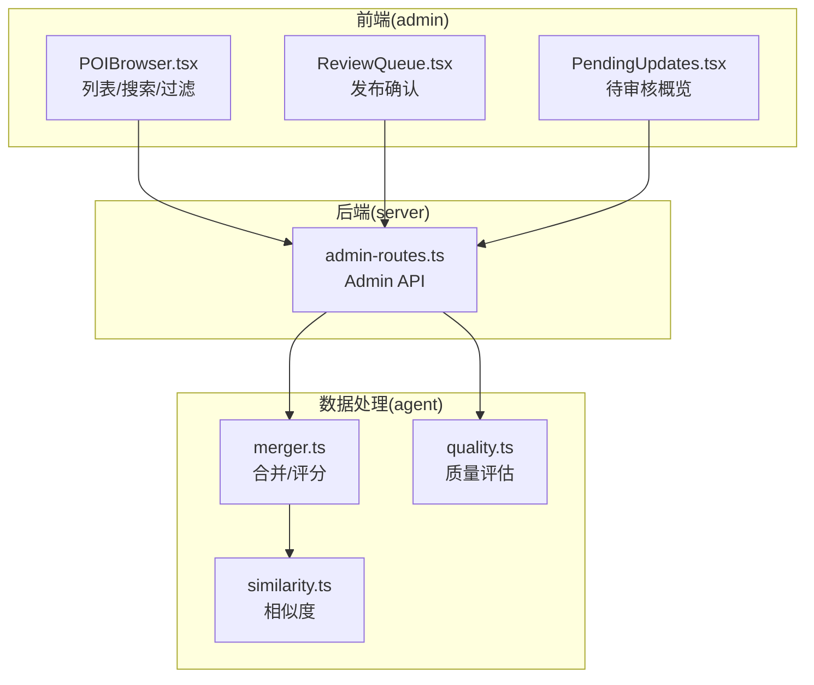
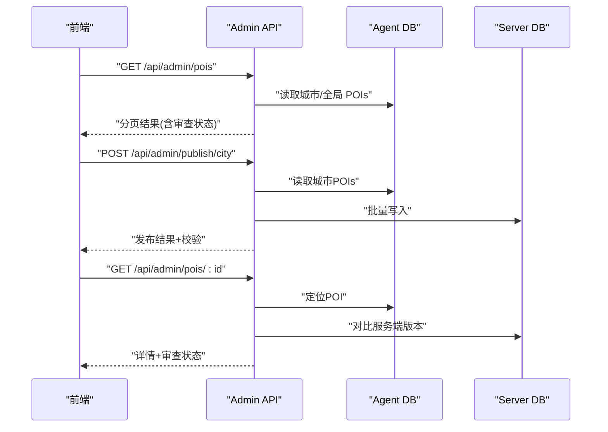
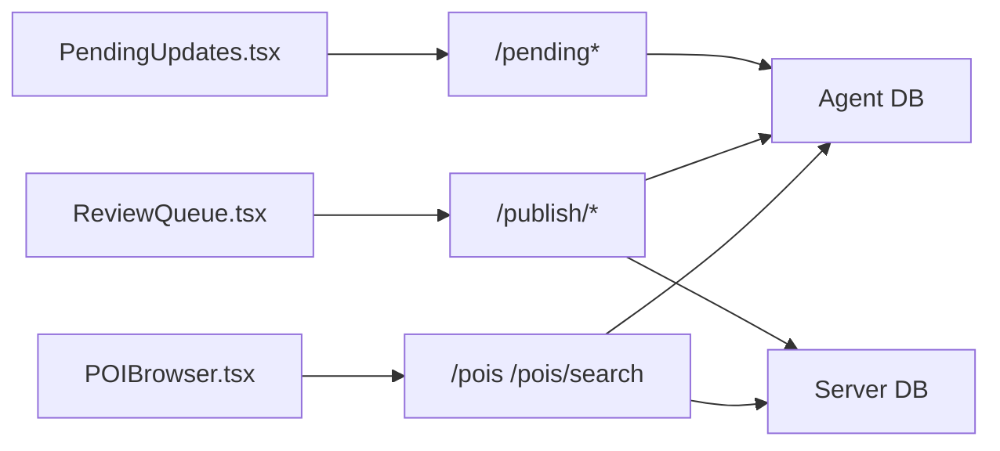

# POI管理API

<cite>
**本文档引用的文件**
- [server/admin-routes.ts](file://server/admin-routes.ts)
- [admin/pages/POIBrowser.tsx](file://admin/pages/POIBrowser.tsx)
- [admin/pages/ReviewQueue.tsx](file://admin/pages/ReviewQueue.tsx)
- [admin/pages/PendingUpdates.tsx](file://admin/pages/PendingUpdates.tsx)
- [agent/quality.ts](file://agent/quality.ts)
- [agent/merger.ts](file://agent/merger.ts)
- [agent/similarity.ts](file://agent/similarity.ts)
- [wiki/knowledge/scoring-kb.md](file://wiki/knowledge/scoring-kb.md)
</cite>

## 目录
1. [简介](#简介)
2. [项目结构](#项目结构)
3. [核心组件](#核心组件)
4. [架构总览](#架构总览)
5. [详细组件分析](#详细组件分析)
6. [依赖关系分析](#依赖关系分析)
7. [性能考虑](#性能考虑)
8. [故障排除指南](#故障排除指南)
9. [结论](#结论)
10. [附录](#附录)

## 简介
本文件面向管理员与开发者，系统化梳理 POI 管理相关 API，覆盖以下能力：
- POI 查询与搜索：支持分页、过滤（城市/分类/评分）、排序（基于相关性）
- POI 详情查看：含字段来源、审查状态、服务端版本对比
- 批量更新与发布：支持整城发布、按评分区间发布、选择性发布
- 质量评估：城市级质量报告、评分维度、等级划分
- 去重与合并：相似度阈值、冲突检测与评分算法
- 审核队列：待审核更新概览与确认流程

## 项目结构
- 后端路由集中在 server/admin-routes.ts，提供 Admin API
- 前端页面在 admin/pages 下，调用 Admin API 并展示数据
- 质量评估与评分算法位于 agent 目录，供后台处理与前端筛选使用

图表来源
- [server/admin-routes.ts:1-1445](file://server/admin-routes.ts#L1-L1445)
- [admin/pages/POIBrowser.tsx:25-142](file://admin/pages/POIBrowser.tsx#L25-L142)
- [admin/pages/ReviewQueue.tsx:292-320](file://admin/pages/ReviewQueue.tsx#L292-L320)
- [admin/pages/PendingUpdates.tsx:1-37](file://admin/pages/PendingUpdates.tsx#L1-L37)
- [agent/merger.ts:339-490](file://agent/merger.ts#L339-L490)
- [agent/similarity.ts](file://agent/similarity.ts)
- [agent/quality.ts:173-293](file://agent/quality.ts#L173-L293)

章节来源
- [server/admin-routes.ts:1-1445](file://server/admin-routes.ts#L1-L1445)
- [admin/pages/POIBrowser.tsx:25-142](file://admin/pages/POIBrowser.tsx#L25-L142)
- [admin/pages/ReviewQueue.tsx:292-320](file://admin/pages/ReviewQueue.tsx#L292-L320)
- [admin/pages/PendingUpdates.tsx:1-37](file://admin/pages/PendingUpdates.tsx#L1-L37)

## 核心组件
- POI 列表与搜索：支持按城市、分类层级、评分等级或数值范围过滤，支持关键词搜索与分页
- POI 详情：返回字段来源、审查状态（新增/更新/已发布）、服务端版本
- 发布流程：整城发布、按评分区间发布、选择性发布，并提供发布后校验
- 质量评估：城市级评分维度、等级分布、问题清单
- 合并与去重：基于相似度阈值与冲突检测的评分算法

章节来源
- [server/admin-routes.ts:711-802](file://server/admin-routes.ts#L711-L802)
- [server/admin-routes.ts:806-860](file://server/admin-routes.ts#L806-L860)
- [server/admin-routes.ts:1058-1198](file://server/admin-routes.ts#L1058-L1198)
- [agent/quality.ts:173-293](file://agent/quality.ts#L173-L293)
- [agent/merger.ts:339-490](file://agent/merger.ts#L339-L490)

## 架构总览
Admin API 作为统一入口，聚合 Agent DB 与 Server DB 数据，提供 POI 管理全链路能力。

图表来源
- [server/admin-routes.ts:711-802](file://server/admin-routes.ts#L711-L802)
- [server/admin-routes.ts:806-860](file://server/admin-routes.ts#L806-L860)
- [server/admin-routes.ts:1058-1198](file://server/admin-routes.ts#L1058-L1198)

## 详细组件分析

### 1) POI 列表与搜索
- 接口定义
  - 方法与路径：GET /api/admin/pois
  - 查询参数
    - city: 城市 ID（可选）
    - l1/l2/l3: 分类层级（可选）
    - page/pageSize: 分页（默认 1/20，最大 50）
    - scoreMin/scoreMax: 评分范围（二选一或配合 scoreGrade）
    - scoreGrade: 评分等级（A/B/C/D）
    - q: 关键词搜索（可选）
  - 响应结构
    - data: POI 数组（附加审查状态）
    - total/page/pageSize: 分页统计
- 行为说明
  - 若提供 city，则仅从该城市加载；否则加载全量
  - 分类与评分过滤在内存完成
  - 搜索接口支持关键词匹配并按相关性打分排序
- 请求示例
  - GET /api/admin/pois?city=beijing&page=1&pageSize=20&l1=scenic&scoreGrade=A
  - GET /api/admin/pois/search?q=长城&city=beijing&page=1&pageSize=20&scoreGrade=B
- 响应示例
  - 成功时返回 { success: true, data, total, page, pageSize }

章节来源
- [server/admin-routes.ts:711-754](file://server/admin-routes.ts#L711-L754)
- [server/admin-routes.ts:758-802](file://server/admin-routes.ts#L758-L802)
- [admin/pages/POIBrowser.tsx:60-82](file://admin/pages/POIBrowser.tsx#L60-L82)

### 2) POI 详情查看
- 接口定义
  - 方法与路径：GET /api/admin/pois/:id
  - 查询参数
    - city: 可选，限定搜索范围
  - 响应结构
    - 返回 POI 详情、所属城市、创建时间、审查状态(reviewStatus)、服务端版本(serverVersion)
- 行为说明
  - 若未指定 city，将在所有城市中查找
  - 审查状态根据与服务端版本的差异判定
- 请求示例
  - GET /api/admin/pois/123456?city=beijing
- 响应示例
  - 成功时返回 { success: true, data: POI详情 }

章节来源
- [server/admin-routes.ts:806-860](file://server/admin-routes.ts#L806-L860)

### 3) 批量发布
- 整城发布
  - 方法与路径：POST /api/admin/publish/city
  - 请求体：{ cityId }
  - 行为：将 Agent DB 中该城市的 POIs 写入 Server DB，并进行数量一致性校验
- 选择性发布
  - 方法与路径：POST /api/admin/publish/pois
  - 请求体：{ cityId, poiIds[] }
  - 行为：发布指定 POIs，并校验是否全部写入
- 按评分发布
  - 方法与路径：POST /api/admin/publish/pois-by-score
  - 请求体：{ cityId, scoreMin?, scoreMax?, scoreGrades[]? }
  - 行为：发布满足评分条件的 POIs，并校验
- 发布后校验
  - 方法与路径：GET /api/admin/publish/validate/:cityId
  - 行为：检查缺失 ID、关键字段完整性与坐标有效性
- 请求示例
  - POST /api/admin/publish/city { cityId: "beijing" }
  - POST /api/admin/publish/pois { cityId: "beijing", poiIds: ["1","2","3"] }
  - POST /api/admin/publish/pois-by-score { cityId: "beijing", scoreMin: 80, scoreGrades: ["A","B"] }
  - GET /api/admin/publish/validate/beijing
- 响应示例
  - 成功时返回 { success: true, data: { publishedCount, totalServerPOIs, validationPassed, validationMessage } }

章节来源
- [server/admin-routes.ts:1058-1198](file://server/admin-routes.ts#L1058-L1198)
- [server/admin-routes.ts:1200-1230](file://server/admin-routes.ts#L1200-L1230)

### 4) 审核队列与待发布更新
- 待发布概览
  - 方法与路径：GET /api/admin/pending
  - 行为：列出待发布城市及其对比统计（新旧 POIs 数量、质量分数、类别分布、评分分布、问题数）
- 确认发布
  - 方法与路径：POST /api/admin/pending/confirm-batch
  - 请求体：{ cityIds[] }
  - 行为：将多个城市的待发布数据写入正式表
- 前端交互
  - ReviewQueue 页面支持按城市、按 POIs、按评分发布，并提供批量发布序列化执行
- 请求示例
  - GET /api/admin/pending
  - POST /api/admin/pending/confirm-batch { cityIds: ["beijing","shanghai"] }

章节来源
- [server/admin-routes.ts:1234-1445](file://server/admin-routes.ts#L1234-L1445)
- [admin/pages/ReviewQueue.tsx:292-320](file://admin/pages/ReviewQueue.tsx#L292-L320)
- [admin/pages/PendingUpdates.tsx:1-37](file://admin/pages/PendingUpdates.tsx#L1-L37)

### 5) 质量评估与评分
- 城市级质量评估
  - 维度：完整性、准确性、丰富度、多样性
  - 结果：overallScore、issues、byCategory、discard/fixed 统计
- 评分等级
  - A: ≥85，B: ≥65，C: ≥45，D: <45
- 评分算法（合并阶段）
  - 组件：completeness、confidence（基于冲突检测）、qualityBonus
  - 总分：加权求和并裁剪到 0-100
- 相似度与去重
  - 基于相似度阈值（如 0.90）进行聚类与合并
  - 冲突检测：统计可比较对数与冲突对数，计算协议一致率
- 前端筛选
  - POIBrowser 支持按 scoreGrade 过滤
- 请求示例
  - GET /api/admin/pois?city=beijing&scoreGrade=A
- 响应示例
  - 质量评估返回 { cityId, overallScore, dimensions, issues, totalPOIs, ... }

章节来源
- [agent/quality.ts:173-293](file://agent/quality.ts#L173-L293)
- [agent/merger.ts:339-490](file://agent/merger.ts#L339-L490)
- [agent/similarity.ts](file://agent/similarity.ts)
- [admin/pages/POIBrowser.tsx:43-45](file://admin/pages/POIBrowser.tsx#L43-L45)
- [wiki/knowledge/scoring-kb.md:75-131](file://wiki/knowledge/scoring-kb.md#L75-L131)

### 6) 错误码与状态
- 常见错误
  - 400 INVALID/MISSING_CITY：缺少必要参数
  - 404 NOT_FOUND：资源不存在（城市/POI）
  - 404 POI_NOT_FOUND：指定 POI 不存在
  - 500：内部错误（异常消息）
- 成功响应
  - success: true，data: 具体数据，可能包含校验信息与统计

章节来源
- [server/admin-routes.ts:1097-1135](file://server/admin-routes.ts#L1097-L1135)
- [server/admin-routes.ts:1138-1198](file://server/admin-routes.ts#L1138-L1198)
- [server/admin-routes.ts:1200-1230](file://server/admin-routes.ts#L1200-L1230)

## 依赖关系分析
- 前端组件依赖 Admin API 提供的数据与状态
- Admin API 依赖 Agent DB（city_pois、pending_updates、city_stats）与 Server DB（最终发布目标）
- 质量评估与评分算法由 agent 子模块提供，供后台处理与前端筛选使用

图表来源
- [server/admin-routes.ts:711-802](file://server/admin-routes.ts#L711-L802)
- [server/admin-routes.ts:1058-1198](file://server/admin-routes.ts#L1058-L1198)
- [server/admin-routes.ts:1234-1445](file://server/admin-routes.ts#L1234-L1445)

## 性能考虑
- 列表与搜索接口在内存中进行分类与评分过滤，建议合理设置 pageSize（上限 50），并优先使用关键词搜索以减少数据量
- 发布流程涉及跨库写入与校验，建议批量发布时控制城市数量，避免超时
- 质量评估与评分算法复杂度与 POIs 数量线性相关，建议在后台异步执行并缓存结果

## 故障排除指南
- 发布后校验失败
  - 检查缺失 ID 列表与关键字段（名称、坐标）是否完整
  - 确认 Agent DB 与 Server DB 的数据一致性
- 评分过低
  - 检查是否存在大量冲突字段或单源数据
  - 优先补充高质量数据源（如 amap/google）
- 无法找到 POI
  - 确认 city 参数是否正确
  - 使用详情接口在未指定 city 时进行全局查找

章节来源
- [server/admin-routes.ts:1200-1230](file://server/admin-routes.ts#L1200-L1230)
- [wiki/knowledge/scoring-kb.md:110-131](file://wiki/knowledge/scoring-kb.md#L110-L131)

## 结论
本文档系统化梳理了 POI 管理 API 的端点、参数、响应与流程，结合质量评估与评分算法，帮助管理员高效完成 POI 的查询、筛选、发布与质量把控。建议在生产环境中配合前端页面与后台脚本，形成“采集-合并-评估-发布-校验”的闭环。

## 附录

### A. API 端点一览
- GET /api/admin/pois
  - 查询参数：city, l1, l2, l3, page, pageSize, scoreMin, scoreMax, scoreGrade, q
  - 响应：分页 POI 列表（含审查状态）
- GET /api/admin/pois/search
  - 查询参数：q, city, l1, l2, l3, page, pageSize, scoreGrade
  - 响应：按相关性排序的分页结果
- GET /api/admin/pois/:id
  - 查询参数：city
  - 响应：POI 详情 + 审查状态 + 服务端版本
- POST /api/admin/publish/city
  - 请求体：{ cityId }
  - 响应：发布统计与校验信息
- POST /api/admin/publish/pois
  - 请求体：{ cityId, poiIds[] }
  - 响应：发布统计与校验信息
- POST /api/admin/publish/pois-by-score
  - 请求体：{ cityId, scoreMin?, scoreMax?, scoreGrades[]? }
  - 响应：发布统计与校验信息
- GET /api/admin/publish/validate/:cityId
  - 响应：缺失 ID 与关键字段问题清单
- GET /api/admin/pending
  - 响应：待发布城市对比统计
- POST /api/admin/pending/confirm-batch
  - 请求体：{ cityIds[] }
  - 响应：批量确认结果

章节来源
- [server/admin-routes.ts:711-802](file://server/admin-routes.ts#L711-L802)
- [server/admin-routes.ts:806-860](file://server/admin-routes.ts#L806-L860)
- [server/admin-routes.ts:1058-1198](file://server/admin-routes.ts#L1058-L1198)
- [server/admin-routes.ts:1200-1230](file://server/admin-routes.ts#L1200-L1230)
- [server/admin-routes.ts:1234-1445](file://server/admin-routes.ts#L1234-L1445)