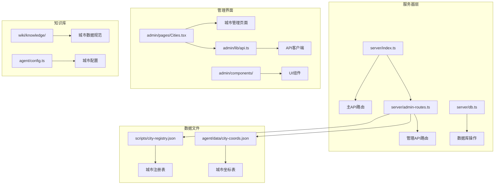
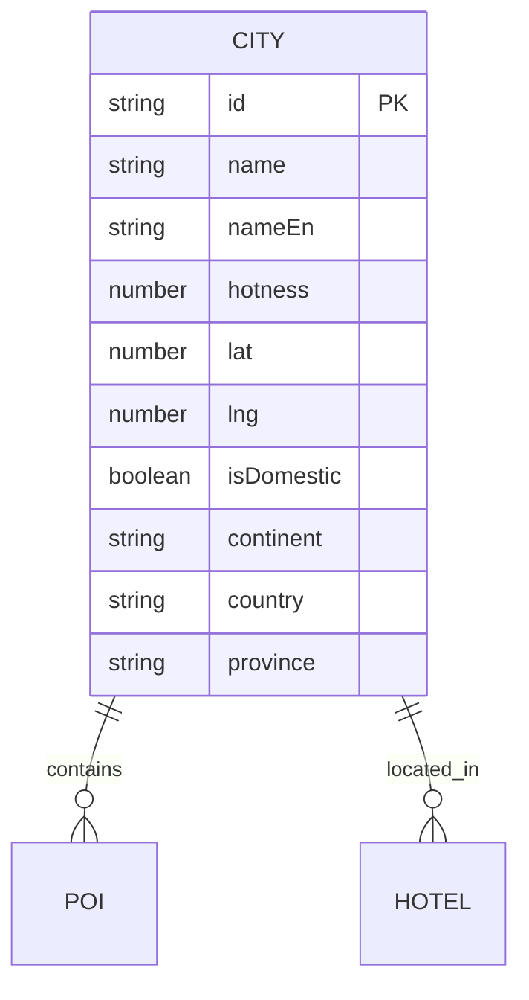
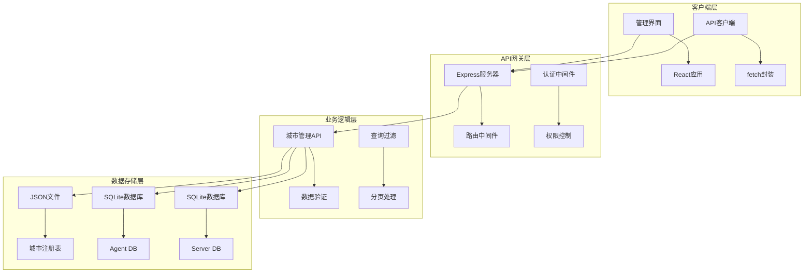
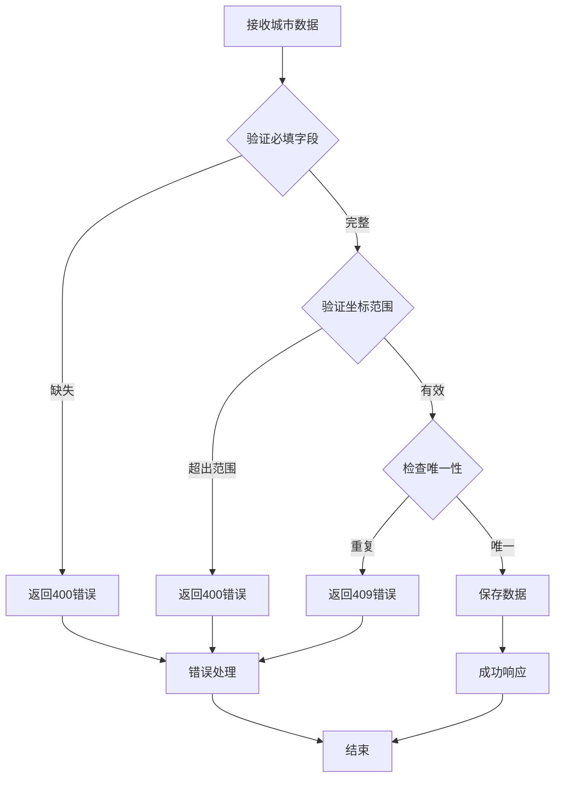
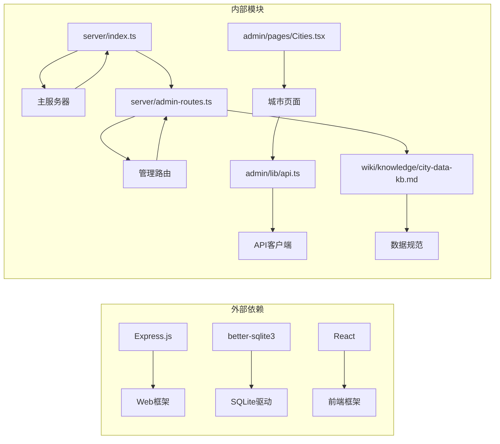
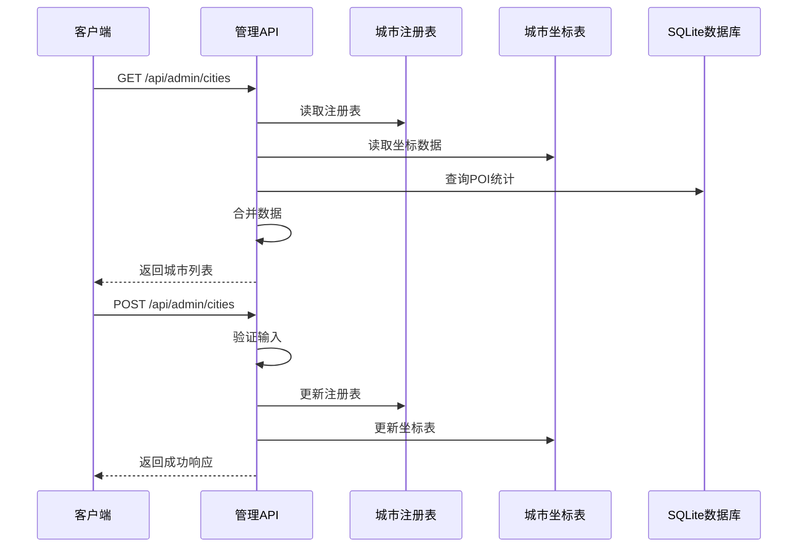

# 城市管理API

<cite>
**本文档引用的文件**
- [server/index.ts](file://server/index.ts)
- [server/admin-routes.ts](file://server/admin-routes.ts)
- [admin/pages/Cities.tsx](file://admin/pages/Cities.tsx)
- [admin/lib/api.ts](file://admin/lib/api.ts)
- [wiki/knowledge/city-data-kb.md](file://wiki/knowledge/city-data-kb.md)
- [agent/config.ts](file://agent/config.ts)
- [api/index.ts](file://api/index.ts)
</cite>

## 目录
1. [简介](#简介)
2. [项目结构](#项目结构)
3. [核心组件](#核心组件)
4. [架构概览](#架构概览)
5. [详细组件分析](#详细组件分析)
6. [依赖关系分析](#依赖关系分析)
7. [性能考虑](#性能考虑)
8. [故障排除指南](#故障排除指南)
9. [结论](#结论)

## 简介

城市管理API是行程规划系统的核心组件之一，负责管理城市数据的增删改查操作。该API基于Express.js构建，采用双文件架构管理城市信息，包括城市注册表和城市坐标表。系统支持完整的CRUD操作，提供分页查询、模糊搜索、区域筛选等功能，并集成了数据验证和约束检查机制。

## 项目结构

项目采用模块化架构，主要包含以下核心目录：



**图表来源**
- [server/index.ts:1-790](file://server/index.ts#L1-L790)
- [server/admin-routes.ts:1-1476](file://server/admin-routes.ts#L1-L1476)
- [admin/pages/Cities.tsx:1-251](file://admin/pages/Cities.tsx#L1-L251)

**章节来源**
- [server/index.ts:1-790](file://server/index.ts#L1-L790)
- [server/admin-routes.ts:1-1476](file://server/admin-routes.ts#L1-L1476)

## 核心组件

### 城市数据模型

系统采用双文件架构管理城市数据：

| 文件 | 路径 | 职责 | 字段数量 |
|------|------|------|----------|
| 城市注册表 | `scripts/city-registry.json` | 城市基础信息、采集顺序 | 230条 |
| 城市坐标表 | `agent/data/city-coords.json` | 地理元数据、分类归属 | 297条 |

### 城市字段规范



**图表来源**
- [wiki/knowledge/city-data-kb.md:21-73](file://wiki/knowledge/city-data-kb.md#L21-L73)

**章节来源**
- [wiki/knowledge/city-data-kb.md:1-198](file://wiki/knowledge/city-data-kb.md#L1-L198)
- [agent/config.ts:129-181](file://agent/config.ts#L129-L181)

## 架构概览

系统采用三层架构设计：



**图表来源**
- [server/index.ts:29-53](file://server/index.ts#L29-L53)
- [server/admin-routes.ts:34-62](file://server/admin-routes.ts#L34-L62)

## 详细组件分析

### 城市管理API

#### GET /api/admin/cities - 获取城市列表

**功能描述**: 返回所有城市的完整信息，包括地理坐标、行政区划和POI统计

**查询参数**:
- `page` (可选): 页码，默认1
- `pageSize` (可选): 每页大小，默认20，最大50

**响应格式**:
```json
{
  "success": true,
  "data": [
    {
      "id": "beijing",
      "name": "北京",
      "nameEn": "Beijing",
      "continent": "亚洲",
      "country": "中国",
      "province": "北京",
      "lat": 39.9042,
      "lng": 116.4074,
      "poiCount": 1542,
      "lastUpdated": 1678886400000
    }
  ],
  "total": 230,
  "page": 1,
  "pageSize": 20
}
```

**章节来源**
- [server/admin-routes.ts:500-557](file://server/admin-routes.ts#L500-L557)

#### POST /api/admin/cities - 添加新城市

**功能描述**: 创建新的城市记录，同时更新城市注册表和坐标表

**请求体参数**:
- `id` (必需): 城市ID（小写英文）
- `name` (必需): 城市中文名
- `nameEn` (可选): 城市英文名
- `continent` (可选): 大洲
- `country` (必需): 国家
- `province` (可选): 省份
- `lat` (可选): 纬度
- `lng` (可选): 经度

**数据验证规则**:
- 城市ID必须唯一且非空
- 城市名称必须非空
- 国家字段必须非空
- 纬度范围：-90到90
- 经度范围：-180到180

**章节来源**
- [server/admin-routes.ts:559-586](file://server/admin-routes.ts#L559-L586)
- [admin/pages/Cities.tsx:166-196](file://admin/pages/Cities.tsx#L166-L196)

#### PUT /api/admin/cities/:id - 更新城市信息

**功能描述**: 更新现有城市的属性信息

**路径参数**:
- `id`: 城市ID

**请求体参数**:
支持更新以下字段：
- `name`: 城市名称
- `nameEn`: 英文名称
- `continent`: 大洲
- `country`: 国家
- `province`: 省份
- `lat`: 纬度
- `lng`: 经度

**章节来源**
- [server/admin-routes.ts:588-618](file://server/admin-routes.ts#L588-L618)

#### DELETE /api/admin/cities/:id - 删除城市

**功能描述**: 删除指定城市及其相关数据

**路径参数**:
- `id`: 城市ID

**清理操作**:
删除操作会清理以下数据：
1. 城市注册表中的记录
2. 城市坐标表中的记录
3. Agent DB中的POI数据
4. Server DB中的酒店数据

**章节来源**
- [server/admin-routes.ts:620-667](file://server/admin-routes.ts#L620-L667)

### 查询和过滤功能

#### 模糊搜索

系统支持基于城市名称的模糊搜索：

**搜索规则**:
- 支持中文全名、拼音首字母、英文名搜索
- 精确匹配优先级最高（100分）
- 前缀匹配次之（70分）
- 包含匹配（50分）

**章节来源**
- [admin/pages/Cities.tsx:33-38](file://admin/pages/Cities.tsx#L33-L38)

#### 区域筛选

**筛选条件**:
- `continent`: 大洲筛选
- `country`: 国家筛选  
- `province`: 省份筛选
- `city`: 城市ID筛选

**章节来源**
- [server/admin-routes.ts:707-750](file://server/admin-routes.ts#L707-L750)

### 数据验证和约束

#### 城市坐标验证



**图表来源**
- [server/admin-routes.ts:560-568](file://server/admin-routes.ts#L560-L568)
- [admin/pages/Cities.tsx:171-176](file://admin/pages/Cities.tsx#L171-L176)

#### 数据一致性保证

系统通过以下机制确保数据一致性：
1. **双文件同步**: 注册表和坐标表同时更新
2. **事务性操作**: 批量删除操作的原子性
3. **数据完整性检查**: 城市ID关联验证

**章节来源**
- [server/admin-routes.ts:636-660](file://server/admin-routes.ts#L636-L660)

## 依赖关系分析

### 组件依赖图



**图表来源**
- [server/index.ts:29-53](file://server/index.ts#L29-L53)
- [admin/lib/api.ts:1-33](file://admin/lib/api.ts#L1-L33)

### 数据流分析



**图表来源**
- [server/admin-routes.ts:500-557](file://server/admin-routes.ts#L500-L557)
- [server/admin-routes.ts:559-586](file://server/admin-routes.ts#L559-L586)

**章节来源**
- [server/admin-routes.ts:115-140](file://server/admin-routes.ts#L115-L140)

## 性能考虑

### 缓存策略

系统采用多层缓存机制：
1. **内存缓存**: 城市数据的内存缓存
2. **文件缓存**: JSON文件的读取缓存
3. **数据库缓存**: SQLite查询结果缓存

### 查询优化

- **索引优化**: 城市ID和国家字段建立索引
- **分页查询**: 默认每页20条记录，最大50条
- **条件过滤**: 支持多维度筛选减少数据传输

### 并发控制

- **写操作串行化**: 城市数据的写操作采用队列处理
- **读操作并发化**: 读操作允许多线程并发执行
- **文件锁机制**: 防止多个进程同时修改同一文件

## 故障排除指南

### 常见错误码

| 错误码 | 描述 | 解决方案 |
|--------|------|----------|
| 400 | 请求参数错误 | 检查必填字段和数据格式 |
| 404 | 资源不存在 | 确认城市ID是否正确 |
| 409 | 资源冲突 | 检查城市ID是否已存在 |
| 500 | 服务器内部错误 | 查看服务器日志 |

### 数据验证错误

**坐标范围错误**:
- 纬度必须在-90到90之间
- 经度必须在-180到180之间

**唯一性约束**:
- 城市ID必须全局唯一
- 城市名称在同一国家内唯一

### 系统集成问题

**文件路径问题**:
- 开发环境使用`process.cwd()`获取项目根路径
- 生产环境确保文件权限正确

**章节来源**
- [server/admin-routes.ts:560-568](file://server/admin-routes.ts#L560-L568)
- [admin/pages/Cities.tsx:171-176](file://admin/pages/Cities.tsx#L171-L176)

## 结论

城市管理API提供了完整的城市数据管理功能，具有以下特点：

1. **完整的CRUD操作**: 支持城市数据的增删改查
2. **灵活的查询能力**: 支持分页、筛选、模糊搜索
3. **严格的数据验证**: 多层次的数据完整性检查
4. **双文件架构**: 独立管理城市基础信息和地理元数据
5. **良好的扩展性**: 模块化设计便于功能扩展

该API为行程规划系统的城市数据管理奠定了坚实基础，支持后续的POI管理和旅行规划功能。