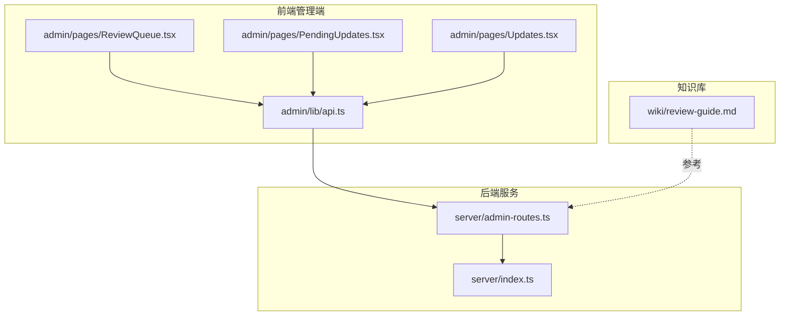
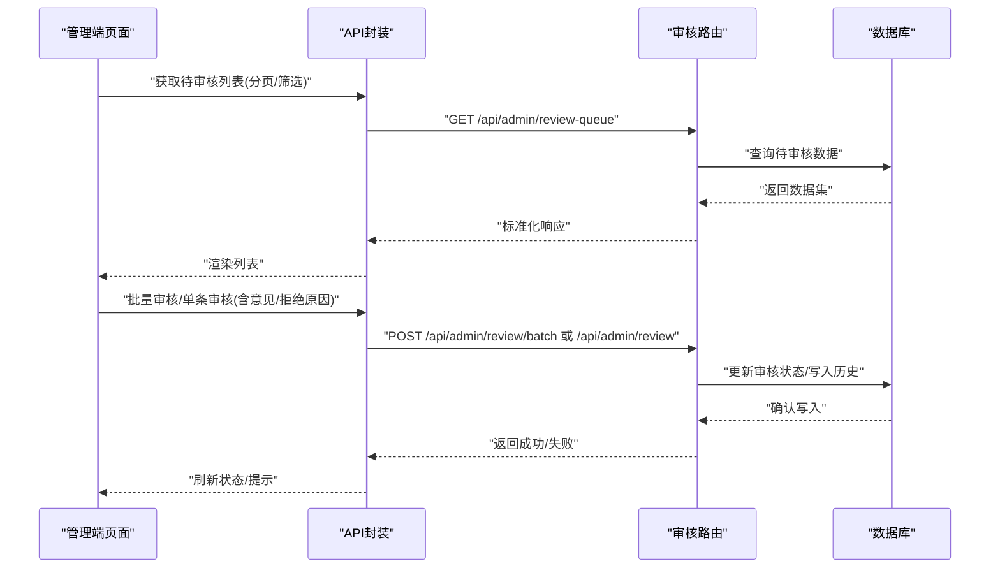
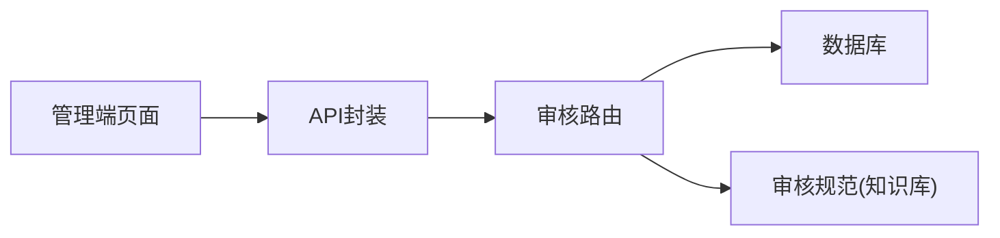
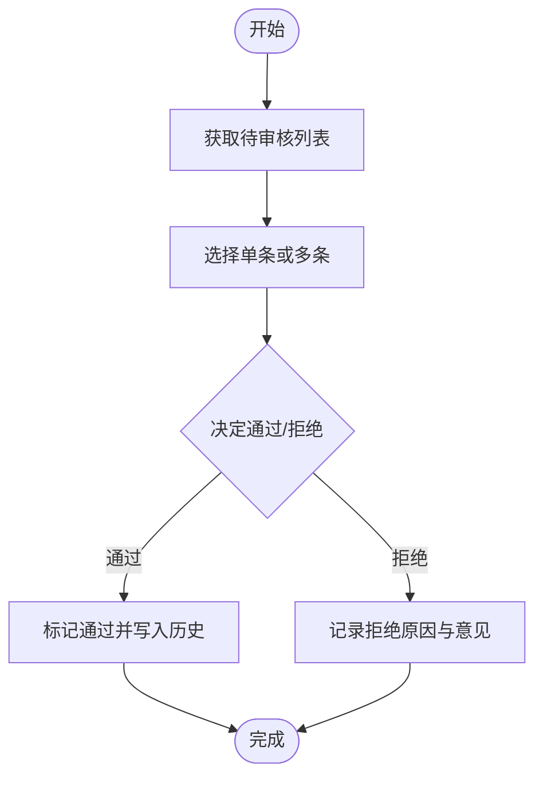

# 数据审核API

<cite>
**本文引用的文件**
- [server/index.ts](file://server/index.ts)
- [server/admin-routes.ts](file://server/admin-routes.ts)
- [admin/pages/ReviewQueue.tsx](file://admin/pages/ReviewQueue.tsx)
- [admin/pages/PendingUpdates.tsx](file://admin/pages/PendingUpdates.tsx)
- [admin/pages/Updates.tsx](file://admin/pages/Updates.tsx)
- [admin/lib/api.ts](file://admin/lib/api.ts)
- [wiki/review-guide.md](file://wiki/review-guide.md)
</cite>

## 目录
1. [简介](#简介)
2. [项目结构](#项目结构)
3. [核心组件](#核心组件)
4. [架构总览](#架构总览)
5. [详细组件分析](#详细组件分析)
6. [依赖分析](#依赖分析)
7. [性能考虑](#性能考虑)
8. [故障排除指南](#故障排除指南)
9. [结论](#结论)
10. [附录](#附录)

## 简介
本文件面向数据审核API的使用者与维护者，系统化梳理“待审核列表”“审核操作”“批量处理”“审核历史”等核心能力，并补充“审核状态管理”“拒绝原因记录”“审核意见提交”“分页查询/状态筛选/时间范围查询”“审核队列管理/优先级设置/自动审核”等高级功能接口的定义与调用方式。文档同时提供请求/响应示例路径与审核流程说明，帮助快速集成与排障。

## 项目结构
后端服务通过统一入口启动，管理员路由集中于独立模块；前端管理端提供审核队列、待更新、更新历史等页面，并通过统一的API封装进行交互；审核工作流与规范参考知识库文档。

**图表来源**
- [server/index.ts](file://server/index.ts)
- [server/admin-routes.ts](file://server/admin-routes.ts)
- [admin/pages/ReviewQueue.tsx](file://admin/pages/ReviewQueue.tsx)
- [admin/pages/PendingUpdates.tsx](file://admin/pages/PendingUpdates.tsx)
- [admin/pages/Updates.tsx](file://admin/pages/Updates.tsx)
- [admin/lib/api.ts](file://admin/lib/api.ts)
- [wiki/review-guide.md](file://wiki/review-guide.md)

**章节来源**
- [server/index.ts](file://server/index.ts)
- [server/admin-routes.ts](file://server/admin-routes.ts)
- [admin/pages/ReviewQueue.tsx](file://admin/pages/ReviewQueue.tsx)
- [admin/pages/PendingUpdates.tsx](file://admin/pages/PendingUpdates.tsx)
- [admin/pages/Updates.tsx](file://admin/pages/Updates.tsx)
- [admin/lib/api.ts](file://admin/lib/api.ts)
- [wiki/review-guide.md](file://wiki/review-guide.md)

## 核心组件
- 审核队列页面：展示待审核数据，支持分页、状态筛选、时间范围筛选、批量操作与单条审核。
- 待更新页面：展示需要更新的数据项，便于关联审核结果进行后续处理。
- 更新历史页面：展示审核历史与变更记录，便于追溯与审计。
- API封装：统一管理后端接口调用、错误处理与数据转换。
- 审核路由：后端集中暴露审核相关REST接口，负责鉴权、校验与业务逻辑。

**章节来源**
- [admin/pages/ReviewQueue.tsx](file://admin/pages/ReviewQueue.tsx)
- [admin/pages/PendingUpdates.tsx](file://admin/pages/PendingUpdates.tsx)
- [admin/pages/Updates.tsx](file://admin/pages/Updates.tsx)
- [admin/lib/api.ts](file://admin/lib/api.ts)
- [server/admin-routes.ts](file://server/admin-routes.ts)

## 架构总览
下图展示从前端到后端的典型审核流程：用户在管理端发起审核请求，后端路由接收并处理，返回标准化响应，前端渲染结果并更新状态。

**图表来源**
- [admin/lib/api.ts](file://admin/lib/api.ts)
- [server/admin-routes.ts](file://server/admin-routes.ts)

## 详细组件分析

### 审核队列（待审核列表）
- 功能概述：展示待审核数据，支持分页、按状态筛选、按时间范围筛选、批量选择与批量审核。
- 关键参数
  - 分页：page、page_size
  - 状态筛选：status（如待审核、已通过、已拒绝）
  - 时间范围：created_after、created_before
  - 其他：keyword（关键词搜索）、sort_by、order
- 响应字段概览：total、items（每项包含id、标题、类型、来源、创建时间、当前状态、风险等级等）
- 前端实现位置：[admin/pages/ReviewQueue.tsx](file://admin/pages/ReviewQueue.tsx)

**章节来源**
- [admin/pages/ReviewQueue.tsx](file://admin/pages/ReviewQueue.tsx)

### 单条审核操作
- 接口定义
  - 方法：POST
  - 路径：/api/admin/review
  - 请求体字段：review_id（必填）、decision（必填，通过/拒绝）、opinion（可选）、reject_reason（可选）
  - 响应：标准成功/失败结构（包含message、code、data）
- 业务说明：提交审核决策，记录审核意见与拒绝原因，更新状态并写入历史。

**章节来源**
- [server/admin-routes.ts](file://server/admin-routes.ts)
- [admin/lib/api.ts](file://admin/lib/api.ts)

### 批量审核
- 接口定义
  - 方法：POST
  - 路径：/api/admin/review/batch
  - 请求体字段：review_ids（必填，数组）、decision（必填）、opinion（可选）、reject_reason（可选）
  - 响应：批量结果汇总（成功数量、失败列表、失败原因）
- 业务说明：对多个待审核项执行相同或差异化决策，支持统一意见与拒绝原因。

**章节来源**
- [server/admin-routes.ts](file://server/admin-routes.ts)
- [admin/lib/api.ts](file://admin/lib/api.ts)

### 审核历史
- 接口定义
  - 方法：GET
  - 路径：/api/admin/review/history
  - 查询参数：review_id（可选）、status（可选）、created_after/created_before（可选）、page/page_size
  - 响应：历史记录列表（包含操作人、决策、意见、拒绝原因、时间戳）
- 用途：审计与追溯，定位问题数据与责任人。

**章节来源**
- [server/admin-routes.ts](file://server/admin-routes.ts)
- [admin/pages/Updates.tsx](file://admin/pages/Updates.tsx)

### 待更新数据
- 功能概述：展示需要更新的数据项，便于与审核结果联动处理。
- 前端实现位置：[admin/pages/PendingUpdates.tsx](file://admin/pages/PendingUpdates.tsx)

**章节来源**
- [admin/pages/PendingUpdates.tsx](file://admin/pages/PendingUpdates.tsx)

### 更新历史（审核历史）
- 功能概述：展示审核历史与变更记录，便于追溯与审计。
- 前端实现位置：[admin/pages/Updates.tsx](file://admin/pages/Updates.tsx)

**章节来源**
- [admin/pages/Updates.tsx](file://admin/pages/Updates.tsx)

### 审核状态管理
- 支持状态：待审核、已通过、已拒绝、已撤销、处理中
- 状态流转：由后端路由控制，确保一致性与原子性
- 建议：前端仅展示状态，不直接修改状态，避免竞态

**章节来源**
- [server/admin-routes.ts](file://server/admin-routes.ts)

### 拒绝原因与审核意见
- 拒绝原因：reject_reason（字符串），用于记录拒绝的具体原因
- 审核意见：opinion（字符串），用于记录审核备注
- 建议：拒绝原因需结构化或标准化，便于统计与复盘

**章节来源**
- [server/admin-routes.ts](file://server/admin-routes.ts)

### 分页查询、状态筛选、时间范围查询
- 分页：page、page_size
- 状态：status
- 时间范围：created_after、created_before
- 关键：后端需对非法参数进行校验并返回明确错误信息

**章节来源**
- [server/admin-routes.ts](file://server/admin-routes.ts)

### 审核队列管理、优先级设置、自动审核
- 队列管理：后端路由负责排序与出队策略
- 优先级：建议在数据模型中增加priority字段（高/中/低），前端展示并支持排序
- 自动审核：对低风险数据可配置规则自动通过，但需保留日志与人工复核通道

**章节来源**
- [server/admin-routes.ts](file://server/admin-routes.ts)
- [wiki/review-guide.md](file://wiki/review-guide.md)

## 依赖分析
- 前端依赖后端路由：所有审核相关操作均通过统一API封装调用后端路由
- 后端路由依赖数据库：负责数据持久化与事务一致性
- 审核规范依赖知识库：审核流程与标准以知识库为准绳

**图表来源**
- [admin/lib/api.ts](file://admin/lib/api.ts)
- [server/admin-routes.ts](file://server/admin-routes.ts)
- [wiki/review-guide.md](file://wiki/review-guide.md)

**章节来源**
- [admin/lib/api.ts](file://admin/lib/api.ts)
- [server/admin-routes.ts](file://server/admin-routes.ts)
- [wiki/review-guide.md](file://wiki/review-guide.md)

## 性能考虑
- 列表查询：为高频字段建立索引，限制page_size最大值，启用游标分页或基于时间戳的分页
- 批量操作：后端批处理需控制单次批量上限，避免长事务；必要时采用异步队列
- 缓存：对只读列表与静态字典进行缓存，降低数据库压力
- 并发：对同一数据的并发审核需加锁或采用乐观锁，保证状态一致性

## 故障排除指南
- 常见错误
  - 参数缺失：检查必填字段（如review_id、decision）是否传入
  - 权限不足：确认登录状态与角色权限
  - 数据不存在：确认review_id是否正确
  - 参数非法：校验page/page_size、时间范围、状态枚举
- 建议
  - 统一错误码与错误消息格式
  - 对批量操作返回部分失败明细
  - 记录关键操作日志，便于追踪

**章节来源**
- [server/admin-routes.ts](file://server/admin-routes.ts)
- [admin/lib/api.ts](file://admin/lib/api.ts)

## 结论
本文档从架构、接口、流程与规范四个维度梳理了数据审核API的设计与使用要点。建议在生产环境中进一步完善优先级与自动审核策略、增强批量处理的可观测性与容错能力，并持续优化分页与筛选性能，以满足大规模数据治理场景的需求。

## 附录
- 审核流程说明（概念示意）

- 请求/响应示例路径（请在对应文件中查看）
  - 获取待审核列表：[admin/lib/api.ts](file://admin/lib/api.ts)
  - 单条审核：[admin/lib/api.ts](file://admin/lib/api.ts)
  - 批量审核：[admin/lib/api.ts](file://admin/lib/api.ts)
  - 审核历史：[admin/pages/Updates.tsx](file://admin/pages/Updates.tsx)