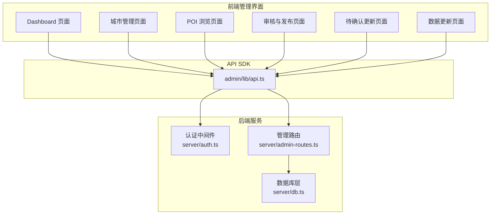
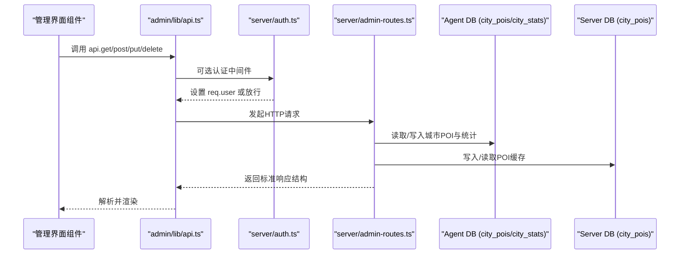
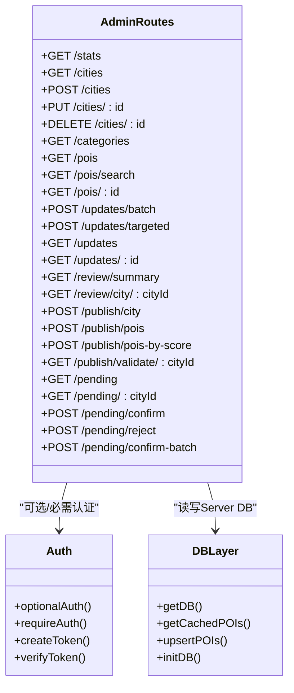

# 管理员API

<cite>
**本文档引用的文件**
- [server/admin-routes.ts](file://server/admin-routes.ts)
- [server/auth.ts](file://server/auth.ts)
- [server/db.ts](file://server/db.ts)
- [admin/lib/api.ts](file://admin/lib/api.ts)
- [admin/types/index.ts](file://admin/types/index.ts)
- [admin/pages/Dashboard.tsx](file://admin/pages/Dashboard.tsx)
- [admin/pages/Cities.tsx](file://admin/pages/Cities.tsx)
- [admin/pages/POIBrowser.tsx](file://admin/pages/POIBrowser.tsx)
- [admin/pages/ReviewQueue.tsx](file://admin/pages/ReviewQueue.tsx)
- [admin/pages/PendingUpdates.tsx](file://admin/pages/PendingUpdates.tsx)
- [admin/pages/Updates.tsx](file://admin/pages/Updates.tsx)
</cite>

## 目录
1. [简介](#简介)
2. [项目结构](#项目结构)
3. [核心组件](#核心组件)
4. [架构总览](#架构总览)
5. [详细组件分析](#详细组件分析)
6. [依赖关系分析](#依赖关系分析)
7. [性能考虑](#性能考虑)
8. [故障排除指南](#故障排除指南)
9. [结论](#结论)
10. [附录](#附录)

## 简介
本文件为后台管理系统管理员API的完整技术文档，涵盖城市、POI、分类、数据审核与发布等核心功能。文档详细说明了各API的HTTP方法、URL模式、请求参数、响应格式，并提供错误码说明、权限控制与安全机制、分页/过滤/排序等查询参数使用方法，以及API集成示例与最佳实践。

## 项目结构
后台管理系统的API主要由以下模块构成：
- 后端路由层：负责业务逻辑与数据访问，位于 server/admin-routes.ts
- 认证与授权：基于JWT的可选认证中间件，位于 server/auth.ts
- 数据库层：SQLite封装与Schema定义，位于 server/db.ts
- 前端SDK：统一的API调用封装，位于 admin/lib/api.ts
- 类型定义：前后端共享的数据模型与枚举，位于 admin/types/index.ts
- 管理界面：Dashboard、城市、POI浏览、审核队列、待确认更新、数据更新等页面组件

图表来源
- [server/admin-routes.ts:1-1476](file://server/admin-routes.ts#L1-L1476)
- [server/auth.ts:1-133](file://server/auth.ts#L1-L133)
- [server/db.ts:1-513](file://server/db.ts#L1-L513)
- [admin/lib/api.ts:1-33](file://admin/lib/api.ts#L1-L33)

章节来源
- [server/admin-routes.ts:1-1476](file://server/admin-routes.ts#L1-L1476)
- [server/auth.ts:1-133](file://server/auth.ts#L1-L133)
- [server/db.ts:1-513](file://server/db.ts#L1-L513)
- [admin/lib/api.ts:1-33](file://admin/lib/api.ts#L1-L33)

## 核心组件
- 管理路由模块：提供统计、城市、分类、POI列表/搜索、更新作业、审核与发布、待确认更新等接口
- 认证模块：提供可选认证与必需认证中间件，支持JWT签名验证
- 数据库模块：封装SQLite，提供POI缓存、用户、旅行笔记、评论、验证码、酒店缓存、预订等表操作
- 前端SDK：统一封装fetch请求，自动处理错误与响应结构
- 类型定义：定义POI、城市、分类树、更新作业、审核发布、评分等级等类型

章节来源
- [server/admin-routes.ts:1-1476](file://server/admin-routes.ts#L1-L1476)
- [server/auth.ts:1-133](file://server/auth.ts#L1-L133)
- [server/db.ts:1-513](file://server/db.ts#L1-L513)
- [admin/lib/api.ts:1-33](file://admin/lib/api.ts#L1-L33)
- [admin/types/index.ts:1-277](file://admin/types/index.ts#L1-L277)

## 架构总览
管理员API采用“前端React组件 + 统一SDK + 后端Express路由 + SQLite数据库”的分层架构。前端通过SDK发起REST请求，后端路由根据业务需求连接Agent DB（城市POI与统计）与Server DB（POI缓存与用户数据）。认证中间件可选地对请求进行鉴权。

图表来源
- [server/admin-routes.ts:1-1476](file://server/admin-routes.ts#L1-L1476)
- [server/auth.ts:87-113](file://server/auth.ts#L87-L113)
- [server/db.ts:235-261](file://server/db.ts#L235-L261)
- [admin/lib/api.ts:10-20](file://admin/lib/api.ts#L10-L20)

## 详细组件分析

### 统计与概览
- 接口：GET /api/admin/stats
- 功能：聚合城市POI总数、最后更新时间、数据新鲜度分布、待审核城市与POI数量
- 查询参数：无
- 响应字段：success、data（包含totalPOIs、totalCities、categories、lastUpdate、freshness、pendingReviewCities、pendingReviewPOIs）

章节来源
- [server/admin-routes.ts:444-496](file://server/admin-routes.ts#L444-L496)

### 城市管理
- 列表与搜索
  - GET /api/admin/cities
  - 功能：列出所有城市，合并注册表与Agent DB统计信息；按有数据优先、名称排序
  - 查询参数：无
  - 响应字段：success、data（数组，包含id、name、nameEn、continent、country、province、lat、lng、poiCount、lastUpdated）
- 新增城市
  - POST /api/admin/cities
  - 请求体字段：id、name、nameEn、continent、country、province、lat、lng
  - 响应字段：success、data（新增城市信息）
  - 错误：400（缺少字段）、409（重复ID）
- 更新城市
  - PUT /api/admin/cities/:id
  - 请求体字段：name、nameEn、continent、country、province、lat、lng
  - 响应字段：success
  - 错误：404（未找到）
- 删除城市
  - DELETE /api/admin/cities/:id
  - 功能：清理注册表、坐标、Agent DB（city_pois、city_stats、raw_pois、collection_logs、pending_updates）、Server DB（city_pois、hotels）
  - 响应字段：success
  - 错误：404（若注册表、坐标、Agent DB、Server DB均不存在）

章节来源
- [server/admin-routes.ts:500-667](file://server/admin-routes.ts#L500-L667)

### 分类管理
- 获取分类树
  - GET /api/admin/categories
  - 响应字段：success、data（CategoryNode树形结构，含id、label、labelEn、children）

章节来源
- [server/admin-routes.ts:669-673](file://server/admin-routes.ts#L669-L673)

### POI管理
- POI列表（分页/过滤）
  - GET /api/admin/pois
  - 查询参数：
    - city：按城市过滤
    - l1/l2/l3：按一级/二级/三级分类过滤
    - page/pageSize：分页（默认1/20，最大50）
    - scoreMin/scoreMax：按评分区间过滤
    - scoreGrade：按评分等级过滤（A/B/C/D）
  - 响应字段：success、data（POI数组，附加reviewStatus）、total、page、pageSize
- POI搜索（全文检索）
  - GET /api/admin/pois/search
  - 查询参数：
    - q：关键词
    - city：限定城市
    - l1/l2/l3：分类过滤
    - scoreGrade：评分等级过滤
    - page/pageSize：分页
  - 响应字段：success、data（POI数组，附加reviewStatus）、total、page、pageSize
- POI详情
  - GET /api/admin/pois/:id?city=...
  - 功能：在指定或所有城市中查找POI，计算reviewStatus并与Server DB比对
  - 响应字段：success、data（POI详情，包含cityId、cityName、createdAt、reviewStatus、serverVersion）

章节来源
- [server/admin-routes.ts:707-856](file://server/admin-routes.ts#L707-L856)

### 数据更新与作业
- 触发批量更新
  - POST /api/admin/updates/batch
  - 请求体字段：country、city、l1
  - 响应字段：success、data（jobId）
- 触发定向更新
  - POST /api/admin/updates/targeted
  - 请求体字段：poiId、cityId
  - 响应字段：success、data（jobId）
- 查询更新作业列表
  - GET /api/admin/updates?limit=...
  - 响应字段：success、data（作业数组）
- 查询单个作业状态
  - GET /api/admin/updates/:id
  - 响应字段：success、data（作业详情）
- 作业执行流程（后端内部）
  - 创建作业记录，异步执行Agent CLI（tsx agent/index.ts ...），流式输出进度，更新作业状态与结果

章节来源
- [server/admin-routes.ts:858-960](file://server/admin-routes.ts#L858-L960)

### 审核与发布
- 城市级审核概览
  - GET /api/admin/review/summary
  - 响应字段：success、data（cities数组、totals）
- 城市级审核详情
  - GET /api/admin/review/city/:cityId
  - 响应字段：success、data（cityId、cityName、pois、summary）
- 发布整座城市
  - POST /api/admin/publish/city
  - 请求体字段：cityId
  - 响应字段：success、data（包含发布数量、Server DB总数、校验结果与消息）
- 发布指定POI
  - POST /api/admin/publish/pois
  - 请求体字段：cityId、poiIds（数组）
  - 响应字段：success、data（发布数量、Server DB总数、校验结果与消息）
- 按评分发布POI
  - POST /api/admin/publish/pois-by-score
  - 请求体字段：cityId、scoreMin、scoreMax、scoreGrades（数组，如['A','B']）
  - 响应字段：success、data（发布数量、Server DB总数、校验结果与消息）
- 发布后校验
  - GET /api/admin/publish/validate/:cityId
  - 响应字段：success、data（serverPOICount、agentPOICount、allPOIsSynced、issues）

章节来源
- [server/admin-routes.ts:962-1226](file://server/admin-routes.ts#L962-L1226)

### 待确认更新
- 列出待确认更新
  - GET /api/admin/pending
  - 响应字段：success、data（PendingUpdate数组）
- 查看某城市待确认更新详情
  - GET /api/admin/pending/:cityId
  - 响应字段：success、data（PendingUpdateDetail）
- 确认应用
  - POST /api/admin/pending/confirm
  - 请求体字段：cityId
  - 响应字段：success、data（应用数量）
- 丢弃
  - POST /api/admin/pending/reject
  - 请求体字段：cityId
  - 响应字段：success
- 批量确认
  - POST /api/admin/pending/confirm-batch
  - 请求体字段：cityIds（数组）
  - 响应字段：success、data（results数组）

章节来源
- [server/admin-routes.ts:1228-1416](file://server/admin-routes.ts#L1228-L1416)

### 认证与安全
- 可选认证中间件
  - optionalAuth：从Authorization头提取Bearer Token，解码并设置req.user，不强制要求
- 必需认证中间件
  - requireAuth：要求Bearer Token，校验签名与过期时间，否则返回401
- 密钥与过期策略
  - JWT_SECRET来自环境变量，默认值用于开发
  - 默认过期时间为7天

章节来源
- [server/auth.ts:87-113](file://server/auth.ts#L87-L113)

### 数据模型与类型
- POI模型：包含id、name、aliases、category、categoryL1/L2/L3、description、address、坐标、评分、成本、时长、标签、最佳季节、开放时间、图片、来源、updatedAt、reviewStatus、score等
- 城市模型：id、name、nameEn、continent、country、province、lat、lng、poiCount、lastUpdated
- 分类节点：id、label、labelEn、children
- 更新作业：id、type、status、config、progress、result、error、pid、created_at、started_at、completed_at
- 审核发布相关：城市审核概览、城市审核详情、发布结果、评分等级配置

章节来源
- [admin/types/index.ts:1-277](file://admin/types/index.ts#L1-L277)

## 依赖关系分析

图表来源
- [server/admin-routes.ts:1-1476](file://server/admin-routes.ts#L1-L1476)
- [server/auth.ts:87-113](file://server/auth.ts#L87-L113)
- [server/db.ts:235-261](file://server/db.ts#L235-L261)

章节来源
- [server/admin-routes.ts:1-1476](file://server/admin-routes.ts#L1-L1476)
- [server/auth.ts:1-133](file://server/auth.ts#L1-L133)
- [server/db.ts:1-513](file://server/db.ts#L1-L513)

## 性能考虑
- 分页与限制
  - POI列表与搜索默认每页20条，最大50条，避免一次性传输大量数据
- 查询优化
  - POI搜索采用评分函数与阈值过滤，减少无关匹配
  - 审核发布比较采用Map映射与字符串序列化对比，提升效率
- 数据新鲜度
  - 统计接口按最后采集时间计算新鲜度分布，便于监控数据时效性
- 并发与批处理
  - 待确认更新支持批量确认，减少多次写入开销

[本节为通用指导，无需特定文件引用]

## 故障排除指南
- 常见错误码
  - 400：缺少必要字段、参数非法、城市无POI数据、评分范围不匹配
  - 401：未提供有效Token或Token已过期
  - 404：资源不存在（城市、POI、作业、待确认更新）
  - 409：城市ID重复
  - 500：服务器内部错误（待确认更新确认/拒绝时）
- 常见问题定位
  - Agent DB初始化：首次运行需执行初始化命令以生成agent.db
  - Server DB持久化：生产环境建议使用持久化目录，避免数据丢失
  - 发布校验：发布后可通过validate接口检查同步完整性与数据质量
- 日志与调试
  - 作业执行过程中会输出进度与错误信息，可在前端更新历史中查看
  - 建议开启后端日志以便追踪异常

章节来源
- [server/admin-routes.ts:559-586](file://server/admin-routes.ts#L559-L586)
- [server/admin-routes.ts:930-948](file://server/admin-routes.ts#L930-L948)
- [server/admin-routes.ts:1054-1090](file://server/admin-routes.ts#L1054-L1090)
- [server/admin-routes.ts:1134-1194](file://server/admin-routes.ts#L1134-L1194)
- [server/admin-routes.ts:1196-1226](file://server/admin-routes.ts#L1196-L1226)

## 结论
管理员API围绕“城市、POI、分类、审核发布、待确认更新、数据更新”六大核心域构建，提供完整的后台管理能力。通过可选认证、严格的参数校验与响应结构、完善的分页/过滤/排序支持，以及清晰的错误码与校验机制，确保了系统的可用性与安全性。建议在生产环境中结合持久化存储与监控告警，持续优化数据新鲜度与发布流程。

[本节为总结性内容，无需特定文件引用]

## 附录

### API集成示例与最佳实践
- 基础请求封装
  - 使用admin/lib/api.ts提供的api对象进行统一请求，自动处理错误与响应结构
  - 示例：api.get('/cities')、api.post('/updates/batch', { city: 'tokyo' })
- 分页与过滤
  - POI列表：设置page、pageSize、l1/l2/l3、scoreGrade/scoreMin/scoreMax
  - POI搜索：设置q、city、l1/l2/l3、scoreGrade、page/pageSize
- 审核发布
  - 建议先查看审核概览与详情，再按城市或评分级别发布
  - 发布后立即执行validate，确保数据一致性
- 待确认更新
  - 支持逐项确认、批量确认与丢弃，谨慎操作以免覆盖现有数据
- 认证
  - 对敏感操作（发布、确认、删除）建议使用必需认证中间件
  - 开发环境可使用可选认证中间件进行快速测试

章节来源
- [admin/lib/api.ts:10-32](file://admin/lib/api.ts#L10-L32)
- [admin/pages/POIBrowser.tsx:60-82](file://admin/pages/POIBrowser.tsx#L60-L82)
- [admin/pages/ReviewQueue.tsx:84-109](file://admin/pages/ReviewQueue.tsx#L84-L109)
- [admin/pages/PendingUpdates.tsx:83-122](file://admin/pages/PendingUpdates.tsx#L83-L122)