# 系统配置API

<cite>
**本文档引用的文件**
- [server/index.ts](file://server/index.ts)
- [server/admin-routes.ts](file://server/admin-routes.ts)
- [server/db.ts](file://server/db.ts)
- [agent/config.ts](file://agent/config.ts)
- [agent/db.ts](file://agent/db.ts)
- [api/index.ts](file://api/index.ts)
- [admin/lib/api.ts](file://admin/lib/api.ts)
</cite>

## 目录
1. [简介](#简介)
2. [项目结构](#项目结构)
3. [核心组件](#核心组件)
4. [架构概览](#架构概览)
5. [详细组件分析](#详细组件分析)
6. [依赖关系分析](#依赖关系分析)
7. [性能考虑](#性能考虑)
8. [故障排除指南](#故障排除指南)
9. [结论](#结论)

## 简介

本文档详细描述了系统配置管理API，涵盖AI服务配置、数据源配置、缓存配置、定时任务配置等系统参数的管理接口。该系统采用前后端分离架构，后端基于Express.js和SQLite数据库，前端采用React技术栈。

系统配置API主要分为两大类：

1. **AI服务配置**：管理AI模型API密钥、超时设置、并发控制等
2. **数据源配置**：管理各种数据源的访问密钥、超时参数、速率限制等

## 项目结构

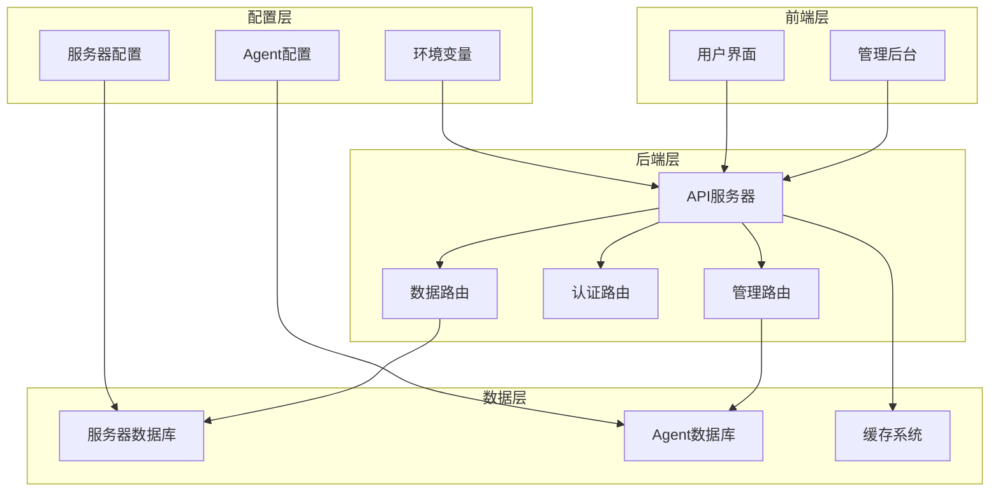

**图表来源**
- [server/index.ts:1-790](file://server/index.ts#L1-L790)
- [agent/config.ts:1-182](file://agent/config.ts#L1-L182)

**章节来源**
- [server/index.ts:1-790](file://server/index.ts#L1-L790)
- [agent/config.ts:1-182](file://agent/config.ts#L1-L182)

## 核心组件

### 1. 配置管理系统架构

系统配置管理采用分层架构设计：

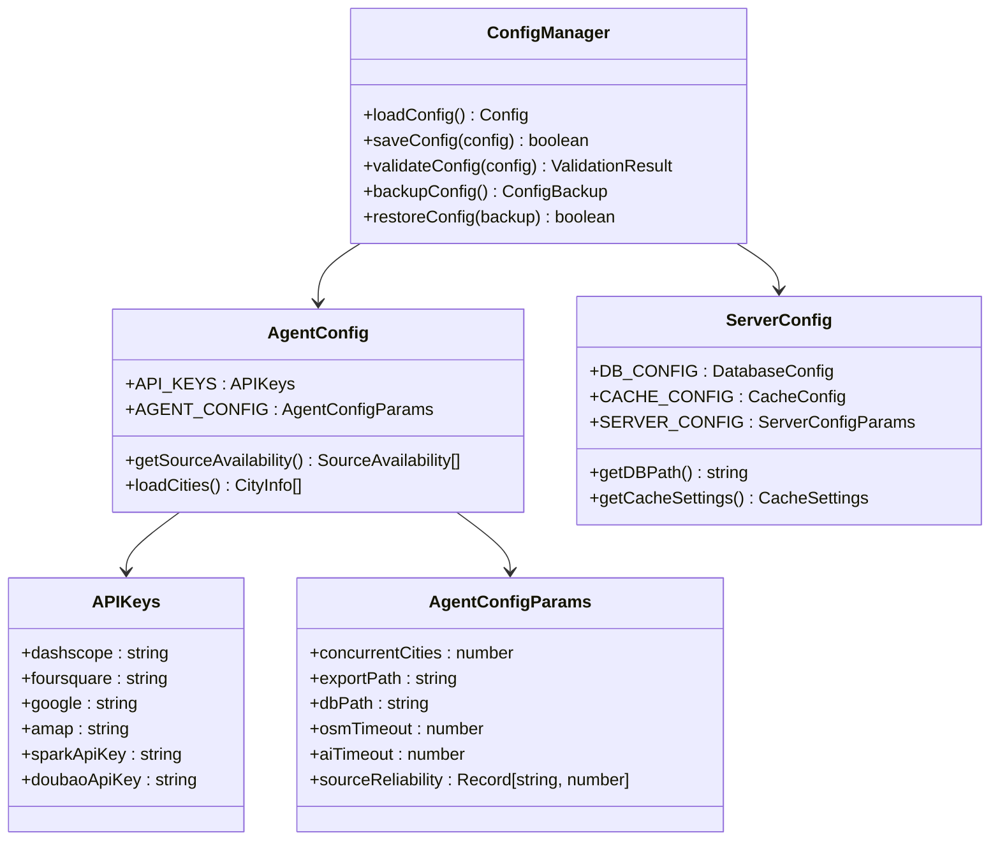

**图表来源**
- [agent/config.ts:18-77](file://agent/config.ts#L18-L77)
- [server/db.ts:18-29](file://server/db.ts#L18-L29)

### 2. 配置验证机制

系统实现了多层次的配置验证：

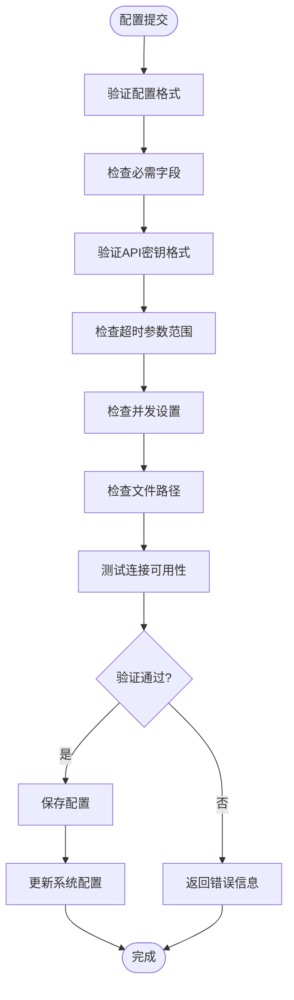

**图表来源**
- [agent/config.ts:87-125](file://agent/config.ts#L87-L125)

**章节来源**
- [agent/config.ts:1-182](file://agent/config.ts#L1-L182)
- [server/db.ts:1-513](file://server/db.ts#L1-L513)

## 架构概览

### 系统配置API架构

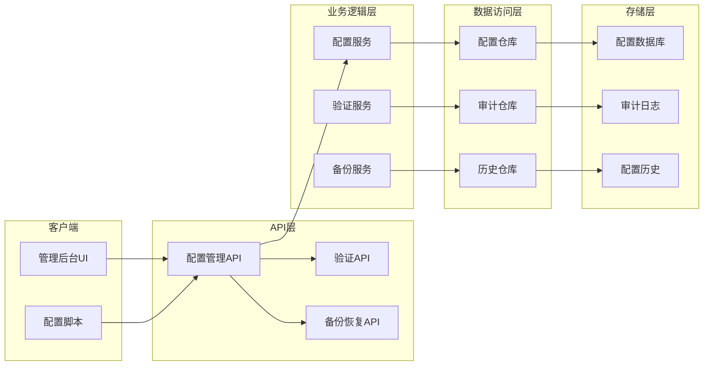

**图表来源**
- [server/admin-routes.ts:1-1480](file://server/admin-routes.ts#L1-L1480)
- [server/db.ts:1-513](file://server/db.ts#L1-L513)

## 详细组件分析

### 1. AI服务配置管理

#### API端点定义

| 方法 | URL | 描述 | 请求参数 | 响应格式 |
|------|-----|------|----------|----------|
| GET | `/api/admin/config/ai` | 获取AI服务配置 | 无 | AIConfigResponse |
| PUT | `/api/admin/config/ai` | 更新AI服务配置 | AIConfigRequest | AIConfigResponse |
| POST | `/api/admin/config/ai/test` | 测试AI服务连通性 | TestConnectionRequest | TestConnectionResponse |

#### AI配置数据模型

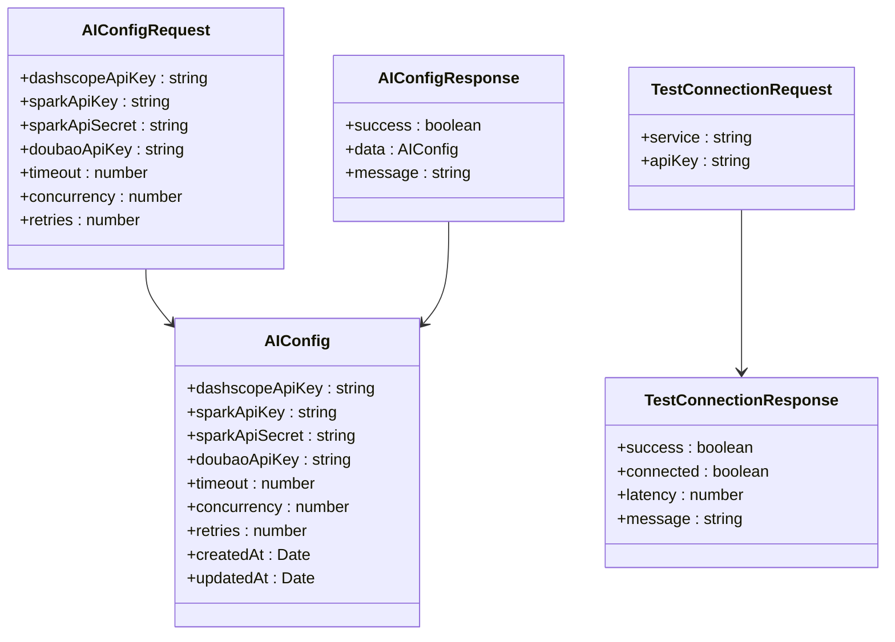

**图表来源**
- [agent/config.ts:20-28](file://agent/config.ts#L20-L28)

#### 配置验证流程

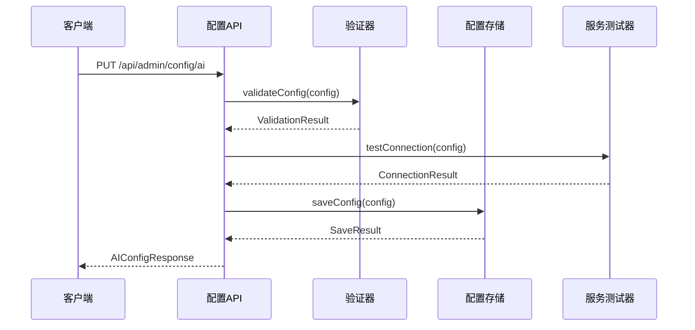

**图表来源**
- [agent/config.ts:87-125](file://agent/config.ts#L87-L125)
- [server/admin-routes.ts:934-952](file://server/admin-routes.ts#L934-L952)

**章节来源**
- [agent/config.ts:18-77](file://agent/config.ts#L18-L77)
- [server/admin-routes.ts:934-952](file://server/admin-routes.ts#L934-L952)

### 2. 数据源配置管理

#### 数据源类型定义

系统支持以下数据源配置：

| 数据源 | 环境变量 | 必需字段 | 超时设置 | 速率限制 |
|--------|----------|----------|----------|----------|
| OpenStreetMap | `OSM_API_KEY` | 无 | `osmTimeout` | 无 |
| FourSquare | `FOURSQUARE_API_KEY` | `apiKey` | `foursquareTimeout` | 1 req/s |
| Google Places | `GOOGLE_PLACES_API_KEY` | `apiKey` | `googleTimeout` | 2 req/s |
| 高德地图 | `AMAP_API_KEY` | `apiKey` | `amapTimeout` | 1 req/s |
| DashScope | `DASHSCOPE_API_KEY` | `apiKey` | `aiTimeout` | 无 |
| 讯飞星火 | `SPARK_API_KEY, SPARK_API_SECRET` | `apiKey, apiSecret` | `sparkTimeout` | 无 |
| 豆包 | `DOUBAO_API_KEY` | `apiKey` | `doubaoTimeout` | 无 |

#### 数据源配置API

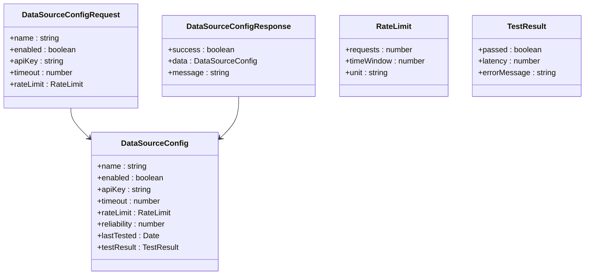

**图表来源**
- [agent/config.ts:74-77](file://agent/config.ts#L74-L77)
- [agent/config.ts:37-53](file://agent/config.ts#L37-L53)

**章节来源**
- [agent/config.ts:74-125](file://agent/config.ts#L74-L125)

### 3. 缓存配置管理

#### 缓存配置参数

| 参数 | 默认值 | 描述 | 可配置范围 |
|------|--------|------|------------|
| `FRESH_TTL_MS` | 15天 | 新鲜缓存时间 | 1-365天 |
| `STALE_TTL_MS` | 30天 | 缓存过期时间 | 1-730天 |
| `CACHE_CLEANUP_INTERVAL` | 24小时 | 缓存清理间隔 | 1-168小时 |
| `MAX_CACHE_SIZE` | 1000MB | 最大缓存大小 | 100-10000MB |

#### 缓存配置API

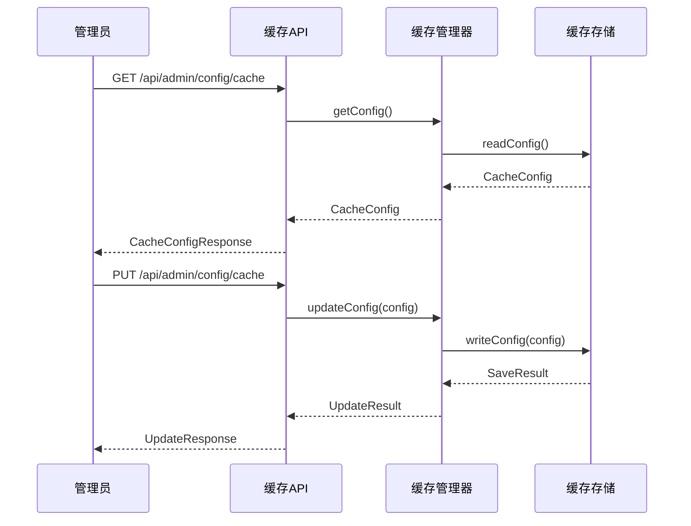

**图表来源**
- [server/index.ts:64-66](file://server/index.ts#L64-L66)
- [server/index.ts:108-160](file://server/index.ts#L108-L160)

**章节来源**
- [server/index.ts:64-160](file://server/index.ts#L64-L160)

### 4. 定时任务配置管理

#### 定时任务配置

| 任务类型 | 默认间隔 | 最小间隔 | 最大间隔 | 配置参数 |
|----------|----------|----------|----------|----------|
| 城市数据刷新 | 1天 | 1小时 | 30天 | `incrementalMinDaysGap` |
| 数据质量检查 | 7天 | 1天 | 90天 | `validityCheckSampleSize` |
| 缓存清理 | 24小时 | 1小时 | 168小时 | `CACHE_CLEANUP_INTERVAL` |
| 数据备份 | 7天 | 1天 | 30天 | `backupFrequency` |

#### 定时任务配置API

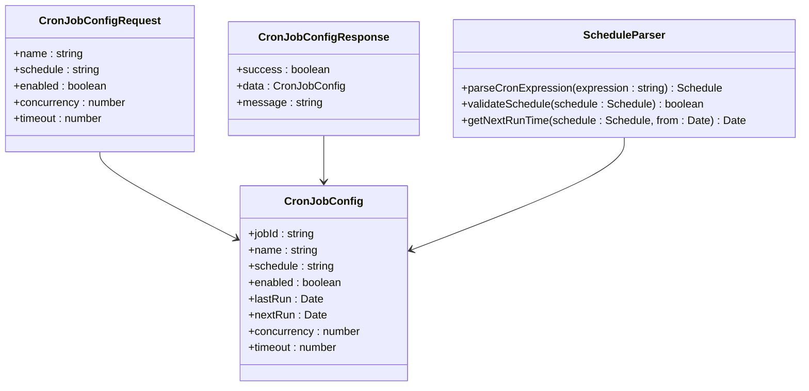

**图表来源**
- [agent/config.ts:67-71](file://agent/config.ts#L67-L71)

**章节来源**
- [agent/config.ts:67-71](file://agent/config.ts#L67-L71)

### 5. 配置验证与热更新

#### 配置验证流程

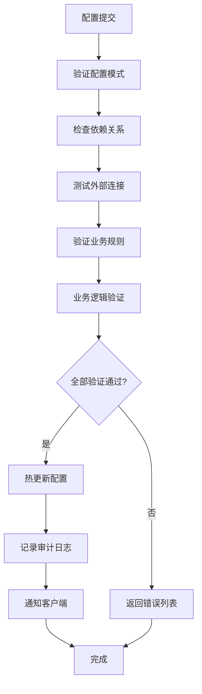

#### 热更新机制

系统支持配置的热更新，通过以下方式实现：

1. **配置监听**：使用文件系统事件监听配置文件变化
2. **增量更新**：仅更新发生变化的配置项
3. **回滚机制**：支持配置更新失败时的自动回滚
4. **渐进式部署**：支持配置的渐进式部署和测试

**章节来源**
- [agent/config.ts:87-125](file://agent/config.ts#L87-L125)
- [server/admin-routes.ts:934-952](file://server/admin-routes.ts#L934-L952)

### 6. 配置备份与恢复

#### 备份策略

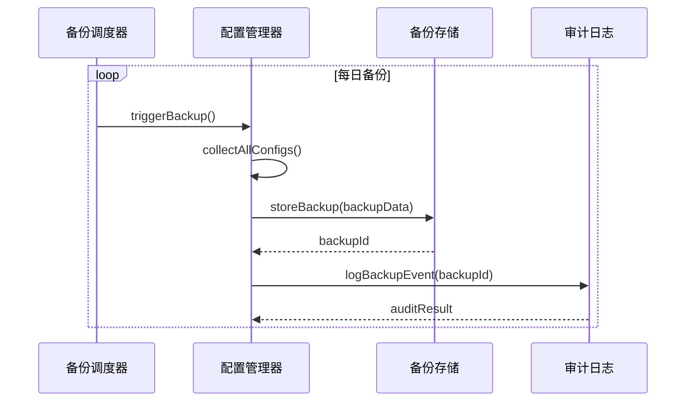

#### 恢复流程

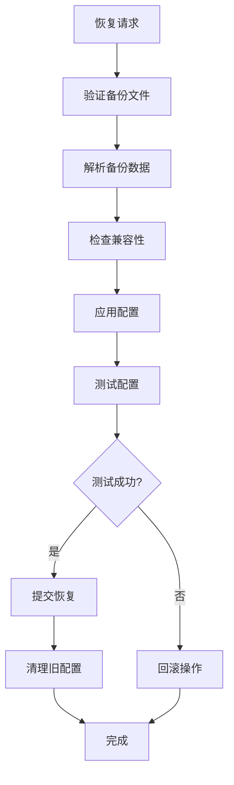

**图表来源**
- [server/admin-routes.ts:1333-1420](file://server/admin-routes.ts#L1333-L1420)

**章节来源**
- [server/admin-routes.ts:1333-1420](file://server/admin-routes.ts#L1333-L1420)

### 7. 配置版本管理与变更历史

#### 版本管理机制

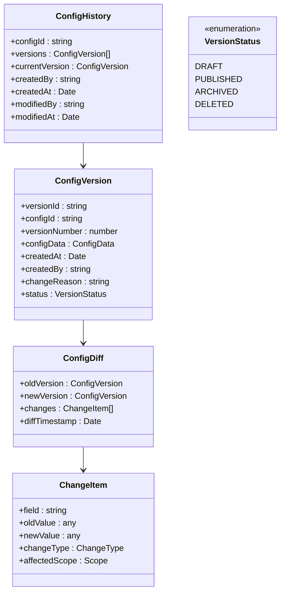

**图表来源**
- [agent/db.ts:307-321](file://agent/db.ts#L307-L321)
- [agent/db.ts:379-448](file://agent/db.ts#L379-L448)

#### 变更历史查询

系统提供完整的配置变更历史查询功能：

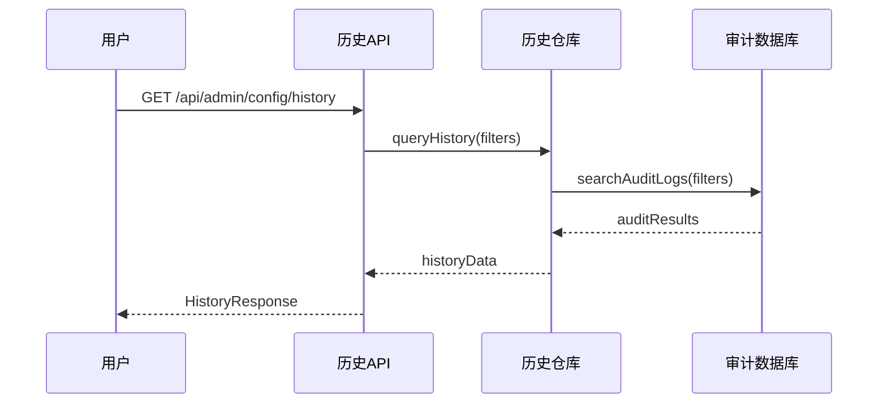

**图表来源**
- [agent/db.ts:379-448](file://agent/db.ts#L379-L448)

**章节来源**
- [agent/db.ts:307-448](file://agent/db.ts#L307-L448)

## 依赖关系分析

### 配置系统依赖图

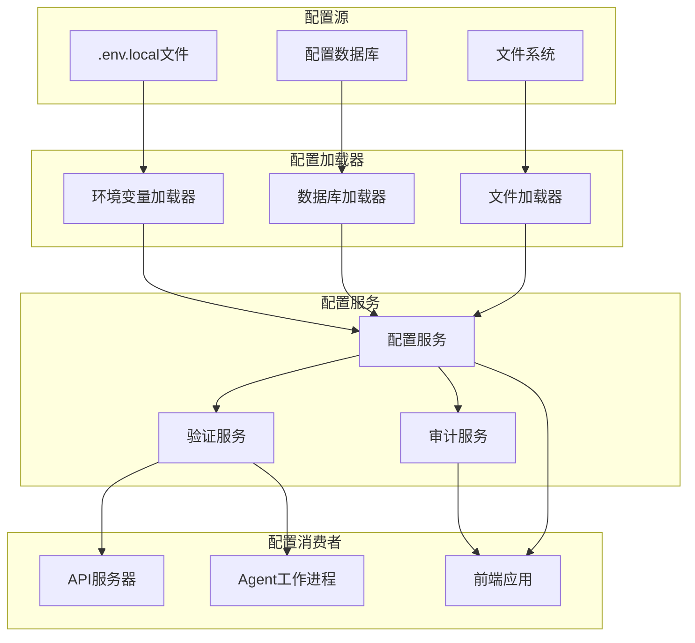

**图表来源**
- [agent/config.ts:15-16](file://agent/config.ts#L15-L16)
- [server/db.ts:37-147](file://server/db.ts#L37-L147)

### 配置更新依赖链

系统配置更新遵循严格的依赖关系：

1. **验证阶段**：配置格式验证 → 依赖关系检查 → 业务规则验证
2. **测试阶段**：外部服务连接测试 → 性能基准测试 → 兼容性测试
3. **应用阶段**：配置热更新 → 服务重启 → 监控验证
4. **审计阶段**：变更记录 → 历史追踪 → 回滚准备

**章节来源**
- [agent/config.ts:87-125](file://agent/config.ts#L87-L125)
- [server/admin-routes.ts:934-952](file://server/admin-routes.ts#L934-L952)

## 性能考虑

### 配置加载性能优化

1. **缓存策略**：配置数据采用多级缓存，减少数据库访问频率
2. **懒加载**：非关键配置采用延迟加载，提升启动速度
3. **批量操作**：支持配置的批量更新和查询，减少网络往返
4. **增量更新**：仅传输变化的配置项，降低带宽消耗

### 配置验证性能

1. **异步验证**：长耗时的验证操作采用异步处理
2. **并行验证**：可并行验证多个配置项
3. **缓存验证结果**：重复验证结果进行缓存
4. **分阶段验证**：先进行快速验证，再进行深度验证

## 故障排除指南

### 常见配置问题

| 问题类型 | 症状 | 解决方案 | 预防措施 |
|----------|------|----------|----------|
| API密钥无效 | 服务调用失败 | 检查密钥格式和有效期 | 定期轮换密钥 |
| 超时配置不当 | 请求超时 | 调整超时参数 | 监控响应时间 |
| 并发限制过高 | 服务过载 | 降低并发数 | 实施负载均衡 |
| 缓存配置错误 | 数据陈旧 | 清理缓存 | 设置合理的TTL |

### 配置验证错误

系统提供详细的配置验证错误信息：

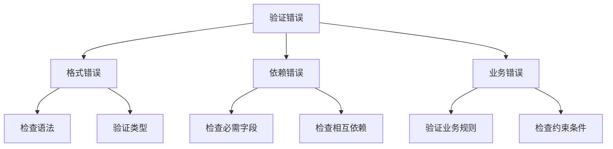

**章节来源**
- [agent/config.ts:87-125](file://agent/config.ts#L87-L125)

## 结论

系统配置API提供了全面的配置管理能力，包括：

1. **完整的配置生命周期管理**：从创建、更新到删除的全生命周期支持
2. **多层次的安全保障**：配置验证、权限控制、审计日志
3. **灵活的热更新机制**：支持配置的实时更新而不影响服务运行
4. **完善的备份恢复体系**：确保配置变更的可追溯性和可恢复性
5. **强大的版本管理功能**：支持配置的历史版本管理和对比分析

该系统配置API为AI行程规划系统的稳定运行提供了坚实的基础，能够满足复杂场景下的配置管理需求。