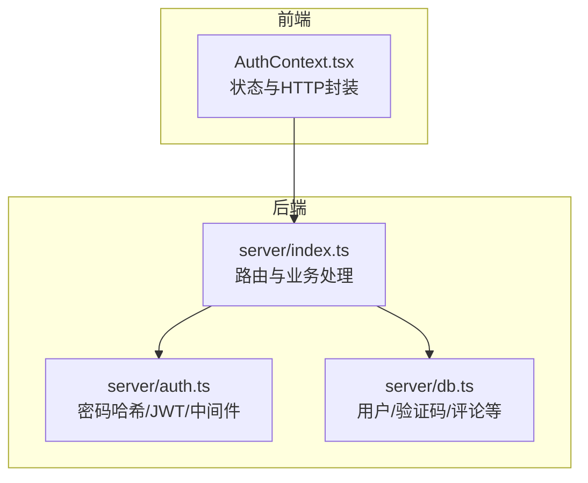
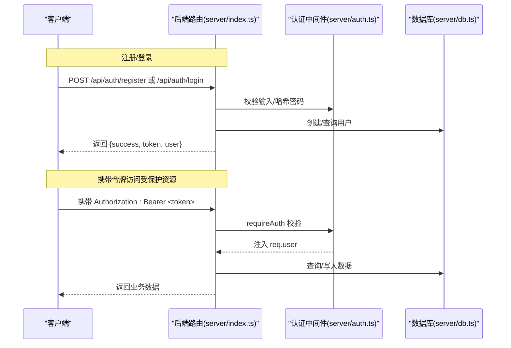
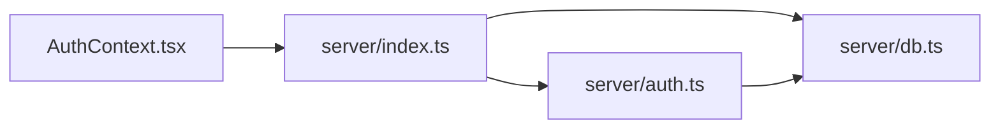

# 认证API

<cite>
**本文引用的文件**
- [server/auth.ts](file://server/auth.ts)
- [server/index.ts](file://server/index.ts)
- [src/context/AuthContext.tsx](file://src/context/AuthContext.tsx)
- [server/db.ts](file://server/db.ts)
- [admin/lib/api.ts](file://admin/lib/api.ts)
</cite>

## 目录
1. [简介](#简介)
2. [项目结构](#项目结构)
3. [核心组件](#核心组件)
4. [架构总览](#架构总览)
5. [详细组件分析](#详细组件分析)
6. [依赖关系分析](#依赖关系分析)
7. [性能考虑](#性能考虑)
8. [故障排查指南](#故障排查指南)
9. [结论](#结论)
10. [附录](#附录)

## 简介
本文件系统性梳理并记录了“行程规划”项目的认证与授权API，覆盖用户注册、登录、当前用户信息查询、验证码发送与密码重置、昵称更新等端点；同时说明JWT令牌管理、权限控制与会话管理机制，并提供请求/响应示例、错误码说明、客户端集成步骤与最佳安全实践。

## 项目结构
认证相关能力由后端Express服务器统一暴露REST接口，前端React应用通过上下文封装进行状态管理与HTTP调用。数据库层提供用户、验证码等基础能力。

图表来源
- [server/index.ts:316-410](file://server/index.ts#L316-L410)
- [server/auth.ts:1-133](file://server/auth.ts#L1-L133)
- [server/db.ts:263-426](file://server/db.ts#L263-L426)
- [src/context/AuthContext.tsx:1-218](file://src/context/AuthContext.tsx#L1-L218)

章节来源
- [server/index.ts:1-790](file://server/index.ts#L1-L790)
- [server/auth.ts:1-133](file://server/auth.ts#L1-L133)
- [src/context/AuthContext.tsx:1-218](file://src/context/AuthContext.tsx#L1-L218)

## 核心组件
- 认证中间件
  - 可选认证：在请求头中提取并校验JWT，成功则注入用户信息，否则放行（允许匿名访问）。
  - 强制认证：要求携带有效Bearer Token，否则返回401。
- JWT工具
  - 生成与校验：基于HS256签名，包含签发时间与过期时间。
  - 过期策略：默认7天。
- 密码处理
  - 注册/登录时使用PBKDF2+随机盐进行哈希存储。
- 验证码
  - 生成6位数字验证码，保存至数据库并设置有效期（演示场景下通过控制台输出）。
- 前端上下文
  - 统一封装登录/注册/登出/获取鉴权头等方法，本地持久化JWT于localStorage。

章节来源
- [server/auth.ts:83-113](file://server/auth.ts#L83-L113)
- [server/auth.ts:47-81](file://server/auth.ts#L47-L81)
- [server/auth.ts:19-33](file://server/auth.ts#L19-L33)
- [server/auth.ts:120-122](file://server/auth.ts#L120-L122)
- [src/context/AuthContext.tsx:54-76](file://src/context/AuthContext.tsx#L54-L76)
- [src/context/AuthContext.tsx:143-146](file://src/context/AuthContext.tsx#L143-L146)

## 架构总览
认证流程涉及客户端、后端路由、JWT中间件与数据库四部分协作。

图表来源
- [server/index.ts:318-367](file://server/index.ts#L318-L367)
- [server/auth.ts:102-113](file://server/auth.ts#L102-L113)
- [server/db.ts:274-288](file://server/db.ts#L274-L288)

## 详细组件分析

### 登录 API
- 方法与路径
  - POST /api/auth/login
- 请求体字段
  - email: 字符串，必填
  - password: 字符串，必填
- 成功响应
  - token: JWT字符串
  - user: 用户对象（id, email, nickname, avatar）
- 失败响应
  - 400: 缺少字段或邮箱格式/密码强度不合法
  - 401: 凭据无效（邮箱或密码错误）
- 客户端集成要点
  - 将返回的token保存在本地存储中，并在后续请求头中携带Authorization: Bearer <token>

章节来源
- [server/index.ts:339-357](file://server/index.ts#L339-L357)

### 注册 API
- 方法与路径
  - POST /api/auth/register
- 请求体字段
  - email: 字符串，必填
  - password: 字符串，必填（至少6位）
  - nickname: 字符串，可选
- 成功响应
  - token: JWT字符串
  - user: 用户对象
- 失败响应
  - 400: 缺少字段或邮箱格式/密码强度不合法
  - 409: 邮箱已存在

章节来源
- [server/index.ts:318-337](file://server/index.ts#L318-L337)

### 当前用户信息 API
- 方法与路径
  - GET /api/auth/me
- 鉴权要求
  - 需要携带有效Bearer Token
- 成功响应
  - user: 用户对象
- 失败响应
  - 401: 缺少或无效令牌
  - 404: 用户不存在

章节来源
- [server/index.ts:359-367](file://server/index.ts#L359-L367)
- [server/auth.ts:102-113](file://server/auth.ts#L102-L113)

### 发送验证码 API
- 方法与路径
  - POST /api/auth/send-code
- 请求体字段
  - email: 字符串，必填
- 成功响应
  - message: 提示信息
- 失败响应
  - 400: 缺少邮箱
  - 404: 用户不存在

章节来源
- [server/index.ts:369-384](file://server/index.ts#L369-L384)

### 重置密码 API
- 方法与路径
  - POST /api/auth/reset-password
- 请求体字段
  - email: 字符串，必填
  - code: 字符串，必填（6位数字）
  - newPassword: 字符串，必填（至少6位）
- 成功响应
  - message: 提示信息
- 失败响应
  - 400: 缺少字段/密码强度不足/验证码无效或已过期
  - 404: 用户不存在

章节来源
- [server/index.ts:386-401](file://server/index.ts#L386-L401)
- [server/db.ts:412-426](file://server/db.ts#L412-L426)

### 更新昵称 API
- 方法与路径
  - PUT /api/auth/nickname
- 鉴权要求
  - 需要携带有效Bearer Token
- 请求体字段
  - nickname: 字符串，必填
- 成功响应
  - 无额外字段
- 失败响应
  - 400: 昵称为空
  - 401: 缺少或无效令牌

章节来源
- [server/index.ts:403-409](file://server/index.ts#L403-L409)
- [server/auth.ts:102-113](file://server/auth.ts#L102-L113)

### 前端鉴权上下文（客户端集成）
- 关键能力
  - 登录/注册：自动保存token并更新用户状态
  - 获取鉴权头：返回包含Authorization头的对象
  - 弹窗式登录：在未登录时弹出登录提示
  - 退出登录：清除本地token
- 使用建议
  - 在发起受保护请求前，优先调用requireAuth确保已登录
  - 使用getAuthHeaders将Authorization头注入fetch请求

章节来源
- [src/context/AuthContext.tsx:78-121](file://src/context/AuthContext.tsx#L78-L121)
- [src/context/AuthContext.tsx:128-137](file://src/context/AuthContext.tsx#L128-L137)
- [src/context/AuthContext.tsx:143-146](file://src/context/AuthContext.tsx#L143-L146)
- [src/context/AuthContext.tsx:176-193](file://src/context/AuthContext.tsx#L176-L193)

### 管理端API封装（Admin）
- 基础路径
  - /api/admin
- 能力
  - 统一的GET/POST/PUT/DELETE封装，自动处理非2xx响应抛错
- 使用建议
  - 通过该封装在管理端页面中统一发起请求

章节来源
- [admin/lib/api.ts:1-33](file://admin/lib/api.ts#L1-L33)

## 依赖关系分析
- 后端路由依赖认证中间件与数据库模块
- 认证中间件依赖JWT工具与数据库（验证码校验）
- 前端上下文依赖后端路由与浏览器本地存储

图表来源
- [server/index.ts:318-410](file://server/index.ts#L318-L410)
- [server/auth.ts:1-133](file://server/auth.ts#L1-L133)
- [server/db.ts:263-426](file://server/db.ts#L263-L426)
- [src/context/AuthContext.tsx:1-218](file://src/context/AuthContext.tsx#L1-L218)

章节来源
- [server/index.ts:318-410](file://server/index.ts#L318-L410)
- [server/auth.ts:1-133](file://server/auth.ts#L1-L133)
- [server/db.ts:263-426](file://server/db.ts#L263-L426)
- [src/context/AuthContext.tsx:1-218](file://src/context/AuthContext.tsx#L1-L218)

## 性能考虑
- JWT过期时间较长（7天），可降低频繁刷新成本，但需结合安全策略评估。
- 前端在挂载时尝试一次性校验本地token有效性，减少后续请求失败重试。
- 验证码仅用于演示场景，生产环境应接入邮件/短信通道并优化存储索引。

## 故障排查指南
- 常见错误码
  - 400: 缺少字段/邮箱格式/密码强度/验证码无效/昵称为空
  - 401: 缺少Authorization头/令牌无效/登录过期
  - 404: 用户不存在/资源不存在
  - 403: 权限不足（如非本人资源）
  - 409: 邮箱已存在
- 排查步骤
  - 确认请求头是否包含Authorization: Bearer <token>
  - 检查token是否过期（默认7天）
  - 确认邮箱格式与密码长度符合要求
  - 验证码是否在有效期内且未被使用
- 日志定位
  - 后端在发送验证码时会打印日志（演示用途）

章节来源
- [server/index.ts:318-409](file://server/index.ts#L318-L409)
- [server/auth.ts:102-113](file://server/auth.ts#L102-L113)
- [server/db.ts:412-426](file://server/db.ts#L412-L426)

## 结论
本项目采用轻量级JWT方案实现认证与授权，前后端职责清晰：后端负责安全校验与数据持久化，前端负责状态管理与请求封装。通过可选/强制两种认证中间件满足不同端点的安全需求；通过验证码流程支持密码找回。建议在生产环境中完善令牌刷新、防暴力破解、传输加密与密钥管理等安全措施。

## 附录

### 请求/响应示例（路径参考）
- 登录
  - 请求：POST /api/auth/login
  - 成功响应：包含token与user
  - 参考路径：[server/index.ts:339-357](file://server/index.ts#L339-L357)
- 注册
  - 请求：POST /api/auth/register
  - 成功响应：包含token与user
  - 参考路径：[server/index.ts:318-337](file://server/index.ts#L318-L337)
- 当前用户
  - 请求：GET /api/auth/me
  - 成功响应：包含user
  - 参考路径：[server/index.ts:359-367](file://server/index.ts#L359-L367)
- 发送验证码
  - 请求：POST /api/auth/send-code
  - 成功响应：包含message
  - 参考路径：[server/index.ts:369-384](file://server/index.ts#L369-L384)
- 重置密码
  - 请求：POST /api/auth/reset-password
  - 成功响应：包含message
  - 参考路径：[server/index.ts:386-401](file://server/index.ts#L386-L401)
- 更新昵称
  - 请求：PUT /api/auth/nickname
  - 成功响应：空对象
  - 参考路径：[server/index.ts:403-409](file://server/index.ts#L403-L409)

### 安全最佳实践
- 令牌管理
  - 前端仅在内存与localStorage中保存token，避免长期暴露
  - 建议增加刷新令牌机制与短期访问令牌
- 传输安全
  - 生产环境必须启用HTTPS
- 存储安全
  - 密码使用PBKDF2+盐存储，避免明文或弱哈希
- 验证码
  - 生产环境接入邮件/短信通道，限制发送频率与有效期
- 中间件使用
  - 对敏感操作统一使用requireAuth，公开资源使用optionalAuth