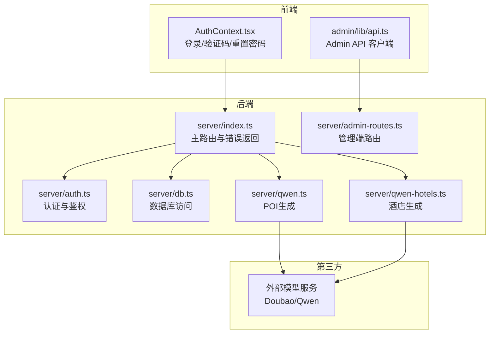
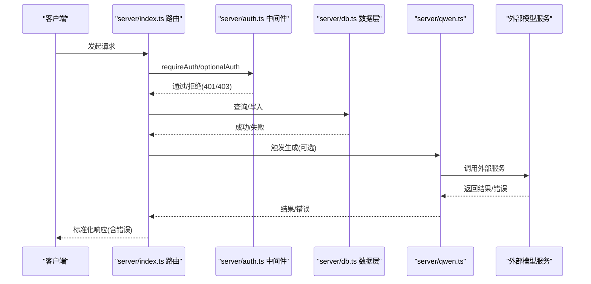
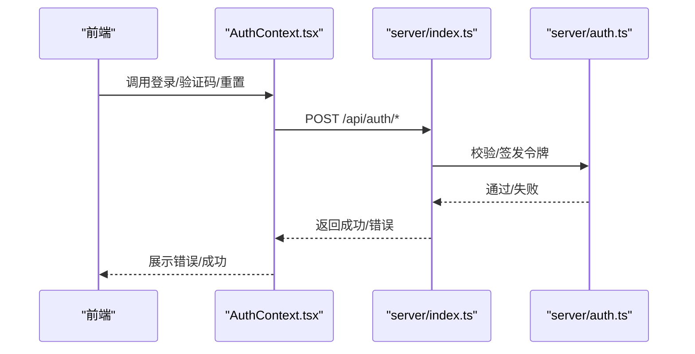
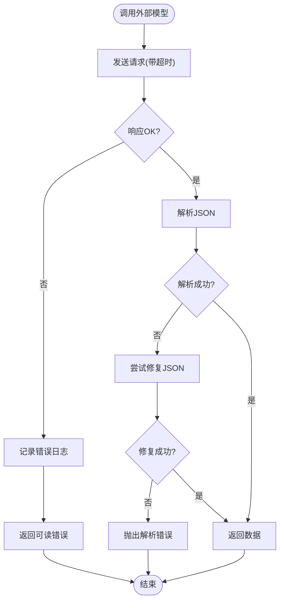
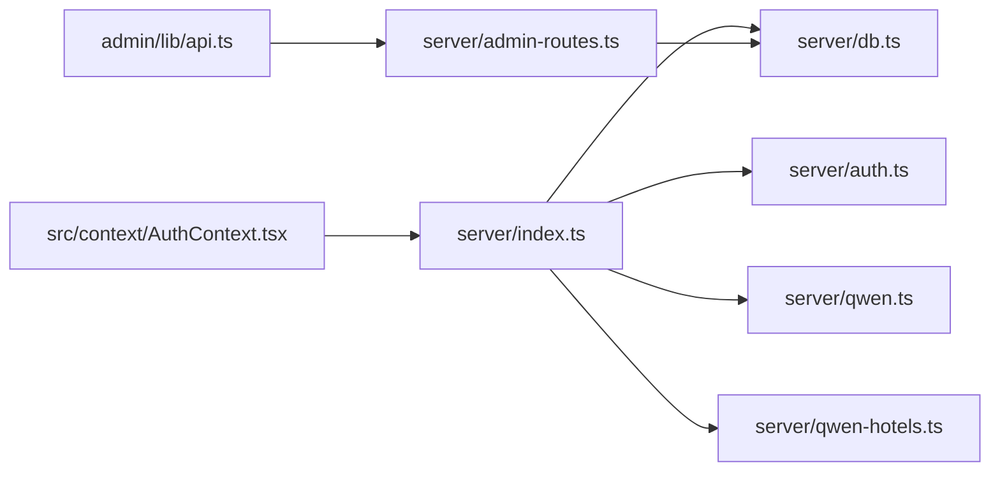

# 错误处理

<cite>
**本文引用的文件**
- [server/index.ts](file://server/index.ts)
- [server/auth.ts](file://server/auth.ts)
- [server/db.ts](file://server/db.ts)
- [server/admin-routes.ts](file://server/admin-routes.ts)
- [server/qwen.ts](file://server/qwen.ts)
- [server/qwen-hotels.ts](file://server/qwen-hotels.ts)
- [src/context/AuthContext.tsx](file://src/context/AuthContext.tsx)
- [admin/lib/api.ts](file://admin/lib/api.ts)
- [scripts/daily-refresh.js](file://scripts/daily-refresh.js)
- [agent/sources/ai.ts](file://agent/sources/ai.ts)
- [wiki/ops-agent-role.md](file://wiki/ops-agent-role.md)
</cite>

## 目录
1. [引言](#引言)
2. [项目结构](#项目结构)
3. [核心组件](#核心组件)
4. [架构总览](#架构总览)
5. [详细组件分析](#详细组件分析)
6. [依赖关系分析](#依赖关系分析)
7. [性能考量](#性能考量)
8. [故障排查指南](#故障排查指南)
9. [结论](#结论)
10. [附录](#附录)

## 引言
本文件系统性梳理本项目的 API 错误处理机制，覆盖 HTTP 状态码映射、业务逻辑错误、数据校验错误、第三方服务错误、日志与监控、客户端错误处理最佳实践与调试指南，并提供常见错误场景的排查步骤与解决方案。

## 项目结构
- 后端服务入口与路由集中在 server/index.ts，统一处理认证中间件、数据库访问、第三方接口调用与错误返回。
- 认证模块在 server/auth.ts，提供密码哈希、JWT 签发与校验、鉴权中间件。
- 数据层在 server/db.ts，封装 SQLite 访问、表结构初始化与常用 CRUD。
- 管理端路由在 server/admin-routes.ts，提供城市、POI、更新作业等管理能力。
- 第三方模型调用在 server/qwen.ts 与 server/qwen-hotels.ts，负责向外部服务发起请求并处理错误。
- 前端在 src/context/AuthContext.tsx 与 admin/lib/api.ts 中实现错误捕获与提示。
- 运维与监控参考 wiki/ops-agent-role.md。

图表来源
- [server/index.ts:1-790](file://server/index.ts#L1-L790)
- [server/auth.ts:1-133](file://server/auth.ts#L1-L133)
- [server/db.ts:1-513](file://server/db.ts#L1-L513)
- [server/admin-routes.ts:1-1476](file://server/admin-routes.ts#L1-L1476)
- [server/qwen.ts:384-403](file://server/qwen.ts#L384-L403)
- [server/qwen-hotels.ts:161-192](file://server/qwen-hotels.ts#L161-L192)

章节来源
- [server/index.ts:1-790](file://server/index.ts#L1-L790)
- [server/auth.ts:1-133](file://server/auth.ts#L1-L133)
- [server/db.ts:1-513](file://server/db.ts#L1-L513)
- [server/admin-routes.ts:1-1476](file://server/admin-routes.ts#L1-L1476)
- [server/qwen.ts:384-403](file://server/qwen.ts#L384-L403)
- [server/qwen-hotels.ts:161-192](file://server/qwen-hotels.ts#L161-L192)

## 核心组件
- 主路由与错误返回：统一在 server/index.ts 中处理业务错误、缓存与第三方调用异常，返回标准化错误对象与 HTTP 状态码。
- 认证与鉴权：server/auth.ts 提供 requireAuth/optionalAuth 中间件与令牌校验，错误通过 401/403 等状态返回。
- 数据层：server/db.ts 初始化表结构与常用查询，错误通过上层路由捕获并转换为 500 或业务错误。
- 管理端：server/admin-routes.ts 提供城市、POI、更新作业等管理接口，错误统一返回标准化错误对象。
- 第三方调用：server/qwen.ts 与 server/qwen-hotels.ts 处理外部服务错误，记录日志并返回可读错误信息。
- 前端错误处理：src/context/AuthContext.tsx 与 admin/lib/api.ts 捕获后端错误并反馈给用户。

章节来源
- [server/index.ts:108-160](file://server/index.ts#L108-L160)
- [server/auth.ts:87-113](file://server/auth.ts#L87-L113)
- [server/db.ts:37-147](file://server/db.ts#L37-L147)
- [server/admin-routes.ts:500-667](file://server/admin-routes.ts#L500-L667)
- [server/qwen.ts:384-403](file://server/qwen.ts#L384-L403)
- [src/context/AuthContext.tsx:54-174](file://src/context/AuthContext.tsx#L54-L174)
- [admin/lib/api.ts:1-32](file://admin/lib/api.ts#L1-L32)

## 架构总览
下图展示典型请求链路与错误传播路径，包括认证、业务校验、缓存与第三方调用。

图表来源
- [server/index.ts:108-160](file://server/index.ts#L108-L160)
- [server/auth.ts:87-113](file://server/auth.ts#L87-L113)
- [server/db.ts:237-261](file://server/db.ts#L237-L261)
- [server/qwen.ts:384-403](file://server/qwen.ts#L384-L403)

## 详细组件分析

### 1) HTTP 状态码与错误响应规范
- 统一响应结构
  - 成功：包含 success:true 与 data/notes/trips 等字段。
  - 失败：包含 success:false 或 error 字段与 message 描述。
- 常见状态码映射
  - 400：缺少参数、字段非法、状态非法、内容为空等。
  - 401：未提供有效令牌、令牌无效或过期。
  - 403：无权限访问（非本人资源）。
  - 404：资源不存在。
  - 409：冲突（如邮箱已存在）。
  - 500：内部错误（如解析失败、数据库异常）。
  - 503：服务不可用（如未配置 API Key）。
- 示例映射（节选）
  - 登录/注册/验证码/重置密码：400/401/404/409 等。
  - 订单与评论：400/401/403/404。
  - POI/酒店缓存：503（无 API Key 且无缓存）、500（异常回退缓存）。
  - Transit 路线：500（OSRM 失败时返回可读错误）。

章节来源
- [server/index.ts:129-142](file://server/index.ts#L129-L142)
- [server/index.ts:200-210](file://server/index.ts#L200-L210)
- [server/index.ts:287-308](file://server/index.ts#L287-L308)
- [server/auth.ts:104-113](file://server/auth.ts#L104-L113)
- [server/admin-routes.ts:561-568](file://server/admin-routes.ts#L561-L568)

### 2) 认证与鉴权错误
- requireAuth：缺少 Authorization 或令牌无效/过期时返回 401。
- optionalAuth：仅提取用户信息，允许匿名访问。
- 用户信息：404 表示用户不存在。
- 前端处理：AuthContext.tsx 在登录、发送验证码、重置密码时捕获错误并提示。

图表来源
- [src/context/AuthContext.tsx:78-174](file://src/context/AuthContext.tsx#L78-L174)
- [server/auth.ts:87-113](file://server/auth.ts#L87-L113)
- [server/index.ts:318-401](file://server/index.ts#L318-L401)

章节来源
- [server/auth.ts:87-113](file://server/auth.ts#L87-L113)
- [src/context/AuthContext.tsx:78-174](file://src/context/AuthContext.tsx#L78-L174)
- [server/index.ts:318-401](file://server/index.ts#L318-L401)

### 3) 业务逻辑与数据校验错误
- 注册：邮箱格式、密码长度、邮箱已存在。
- 登录：邮箱或密码错误。
- 预订：必填字段缺失；取消/状态变更：状态非法、已入住/完成无法取消。
- 评论：未发布游记、禁用评论、内容为空。
- POI/酒店：无缓存且未配置 API Key 返回 503；缓存回退时返回 warning。
- 订单：状态枚举校验、用户权限校验。

章节来源
- [server/index.ts:318-401](file://server/index.ts#L318-L401)
- [server/index.ts:216-283](file://server/index.ts#L216-L283)
- [server/index.ts:628-665](file://server/index.ts#L628-L665)
- [server/index.ts:129-142](file://server/index.ts#L129-L142)

### 4) 第三方服务错误处理
- POI/酒店生成：外部服务返回非 OK 时记录错误日志并返回可读错误。
- JSON 解析：当外部返回非预期 JSON 时尝试修复，否则抛出明确错误。
- 超时控制：使用 AbortController 控制请求超时，避免 Nginx 504。

图表来源
- [server/qwen.ts:384-403](file://server/qwen.ts#L384-L403)
- [scripts/daily-refresh.js:160-202](file://scripts/daily-refresh.js#L160-L202)
- [agent/sources/ai.ts:149-171](file://agent/sources/ai.ts#L149-L171)

章节来源
- [server/qwen.ts:384-403](file://server/qwen.ts#L384-L403)
- [server/qwen-hotels.ts:186-192](file://server/qwen-hotels.ts#L186-L192)
- [scripts/daily-refresh.js:160-202](file://scripts/daily-refresh.js#L160-L202)
- [agent/sources/ai.ts:149-171](file://agent/sources/ai.ts#L149-L171)

### 5) 管理端错误处理
- 城市增删改：400/404/409 等错误，包含明确 message。
- POI 列表/搜索：评分过滤、分页、评分等级映射。
- 更新作业：400/404 等错误，支持批量与单点触发。

章节来源
- [server/admin-routes.ts:500-667](file://server/admin-routes.ts#L500-L667)
- [server/admin-routes.ts:707-798](file://server/admin-routes.ts#L707-L798)
- [server/admin-routes.ts:941-1173](file://server/admin-routes.ts#L941-L1173)

### 6) 前端错误处理与最佳实践
- Admin API 客户端：统一拦截 4xx/5xx 并抛出 ApiError，便于上层捕获。
- 登录/验证码/重置密码：前端分别处理 400/401/404 等错误并提示用户。
- 建议
  - 对 401 统一跳转登录或刷新令牌。
  - 对 403 提示“无权限”并引导联系管理员。
  - 对 404 提示“资源不存在”，并提供返回按钮。
  - 对 500/503 提示“服务暂时不可用”，建议稍后重试。

章节来源
- [admin/lib/api.ts:1-32](file://admin/lib/api.ts#L1-L32)
- [src/context/AuthContext.tsx:78-174](file://src/context/AuthContext.tsx#L78-L174)

## 依赖关系分析
- server/index.ts 依赖 server/auth.ts、server/db.ts、server/qwen.ts/server/qwen-hotels.ts。
- server/admin-routes.ts 依赖 server/db.ts 与 agent 数据库。
- 前端通过 admin/lib/api.ts 与管理端交互，通过 AuthContext.tsx 与认证端交互。

图表来源
- [server/index.ts:1-790](file://server/index.ts#L1-L790)
- [server/admin-routes.ts:1-1476](file://server/admin-routes.ts#L1-L1476)
- [admin/lib/api.ts:1-32](file://admin/lib/api.ts#L1-L32)
- [src/context/AuthContext.tsx:54-174](file://src/context/AuthContext.tsx#L54-L174)

章节来源
- [server/index.ts:1-790](file://server/index.ts#L1-L790)
- [server/admin-routes.ts:1-1476](file://server/admin-routes.ts#L1-L1476)
- [admin/lib/api.ts:1-32](file://admin/lib/api.ts#L1-L32)
- [src/context/AuthContext.tsx:54-174](file://src/context/AuthContext.tsx#L54-L174)

## 性能考量
- 缓存策略：POI/酒店采用三层缓存与异步刷新，避免 Nginx 超时与长连接阻塞。
- 超时控制：外部请求设置 AbortController 超时，防止阻塞。
- 分页与限制：管理端 POI 列表默认每页最多 50，减少一次性传输压力。

章节来源
- [server/index.ts:108-160](file://server/index.ts#L108-L160)
- [server/index.ts:287-308](file://server/index.ts#L287-L308)
- [server/admin-routes.ts:707-798](file://server/admin-routes.ts#L707-L798)

## 故障排查指南
- 常见错误与定位
  - 503 无 API Key：检查环境变量与健康检查 /api/health。
  - 401/403：检查 Authorization 头与令牌有效期。
  - 400 参数错误：核对必填字段与格式（邮箱、密码、状态枚举）。
  - 500 解析失败：关注外部服务返回 JSON 是否可修复。
  - OSRM 不可用：检查 /api/transit/route 的返回与日志。
- 日志与监控
  - 外部服务错误会打印日志，便于定位。
  - 运维侧通过 wiki/ops-agent-role.md 的健康检查与 PM2/Nginx 日志进行监控。
- 前端调试
  - 使用 admin/lib/api.ts 的 ApiError 获取状态与错误信息。
  - 在 AuthContext.tsx 中捕获登录/验证码/重置失败并提示。

章节来源
- [server/index.ts:129-142](file://server/index.ts#L129-L142)
- [server/index.ts:287-308](file://server/index.ts#L287-L308)
- [server/qwen.ts:384-403](file://server/qwen.ts#L384-L403)
- [admin/lib/api.ts:1-32](file://admin/lib/api.ts#L1-L32)
- [src/context/AuthContext.tsx:78-174](file://src/context/AuthContext.tsx#L78-L174)
- [wiki/ops-agent-role.md:52-86](file://wiki/ops-agent-role.md#L52-L86)

## 结论
本项目在服务端与前端均实现了统一的错误处理与响应规范，结合缓存与超时控制提升了稳定性。通过标准化的错误码与错误信息，配合运维监控与前端提示，能够快速定位与解决问题。

## 附录

### A. 错误码对照表（按模块）
- 认证与用户
  - 400：MISSING_FIELDS、INVALID_EMAIL、WEAK_PASSWORD、MISSING_NICKNAME
  - 401：AUTH_REQUIRED、INVALID_CREDENTIALS
  - 403：FORBIDDEN
  - 404：USER_NOT_FOUND、NOT_FOUND
  - 409：EMAIL_EXISTS
  - 500：API_ERROR
- 订单与评论
  - 400：MISSING_FIELDS、INVALID_STATUS、ALREADY_CANCELLED、CANNOT_CANCEL、EMPTY_CONTENT
  - 403：FORBIDDEN、COMMENTS_DISABLED
  - 404：NOT_FOUND、COMMENT_NOT_FOUND
- POI/酒店/路线
  - 503：NO_API_KEY
  - 500：API_ERROR、OSRM unavailable、CORRUPT_DATA
- 管理端
  - 400：MISSING_FIELDS、MISSING_CITY、INVALID、EMPTY、NO_MATCH
  - 404：NOT_FOUND、USER_NOT_FOUND
  - 409：DUPLICATE

章节来源
- [server/index.ts:129-142](file://server/index.ts#L129-L142)
- [server/index.ts:200-210](file://server/index.ts#L200-L210)
- [server/index.ts:219-268](file://server/index.ts#L219-L268)
- [server/index.ts:318-401](file://server/index.ts#L318-L401)
- [server/index.ts:628-665](file://server/index.ts#L628-L665)
- [server/admin-routes.ts:561-568](file://server/admin-routes.ts#L561-L568)
- [server/admin-routes.ts:941-1173](file://server/admin-routes.ts#L941-L1173)

### B. HTTP 状态码与错误映射速查
- 400：参数缺失/非法、状态非法、内容为空、评分范围/等级非法
- 401：未提供令牌、令牌无效/过期
- 403：无权限、评论已关闭
- 404：资源不存在、用户不存在、评论不存在
- 409：邮箱已存在
- 500：内部错误、解析失败、缓存回退失败
- 503：服务不可用（未配置 API Key）

章节来源
- [server/index.ts:129-142](file://server/index.ts#L129-L142)
- [server/index.ts:200-210](file://server/index.ts#L200-L210)
- [server/index.ts:219-268](file://server/index.ts#L219-L268)
- [server/index.ts:318-401](file://server/index.ts#L318-L401)
- [server/index.ts:628-665](file://server/index.ts#L628-L665)
- [server/admin-routes.ts:561-568](file://server/admin-routes.ts#L561-L568)
- [server/admin-routes.ts:941-1173](file://server/admin-routes.ts#L941-L1173)

### C. 常见错误场景与解决步骤
- 场景1：登录失败
  - 步骤：检查邮箱/密码格式；确认用户是否存在；查看 401/404。
  - 解决：修正凭据或引导注册。
- 场景2：预订失败
  - 步骤：检查必填字段；确认状态枚举；查看 400/403。
  - 解决：补齐字段或调整状态。
- 场景3：POI/酒店无数据
  - 步骤：检查 API Key；查看 503；确认缓存回退。
  - 解决：配置 API Key 或等待异步刷新。
- 场景4：外部服务错误
  - 步骤：查看日志；确认超时与 JSON 解析；必要时修复 JSON。
  - 解决：重试或修复上游响应。

章节来源
- [server/index.ts:129-142](file://server/index.ts#L129-L142)
- [server/index.ts:219-268](file://server/index.ts#L219-L268)
- [server/qwen.ts:384-403](file://server/qwen.ts#L384-L403)
- [scripts/daily-refresh.js:160-202](file://scripts/daily-refresh.js#L160-L202)