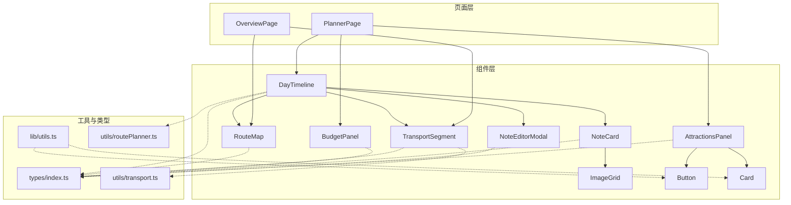
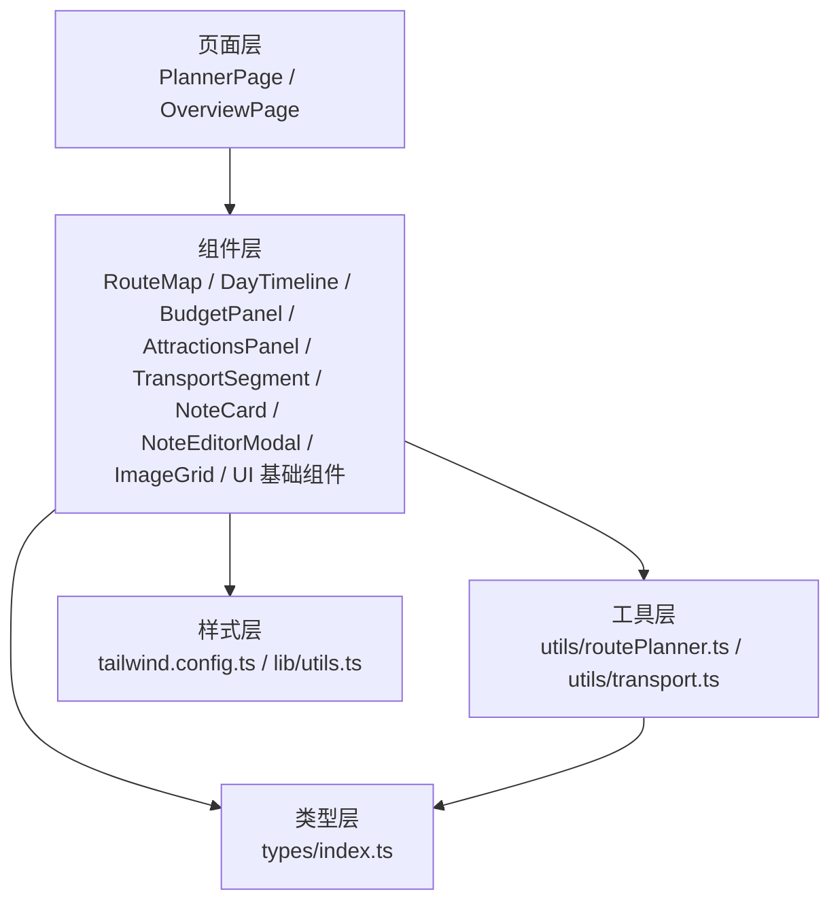
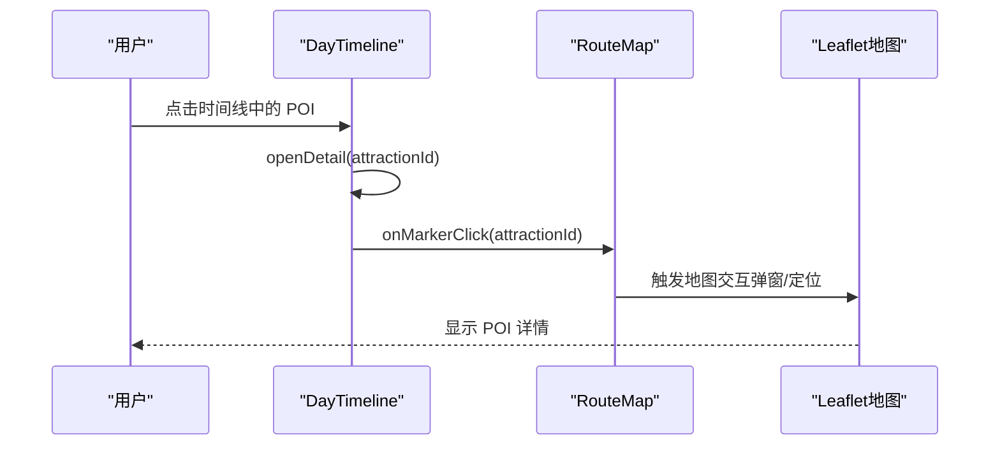
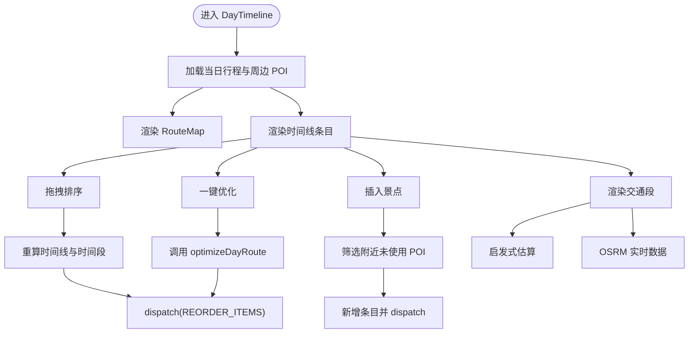
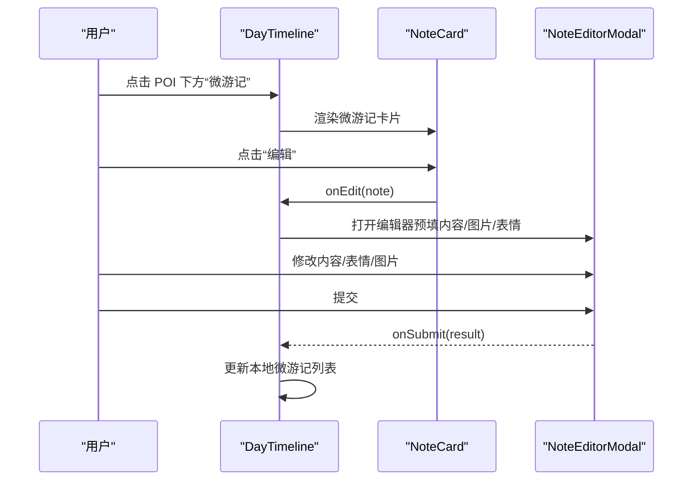
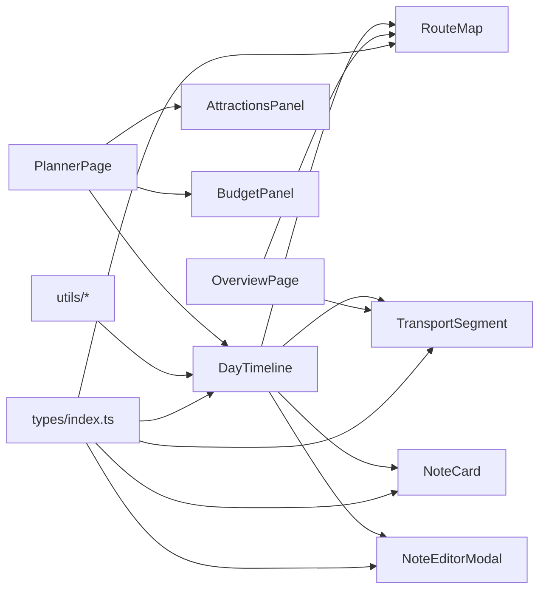

# UI组件系统

<cite>
**本文档引用的文件**
- [src/components/ui/button.tsx](file://src/components/ui/button.tsx)
- [src/components/ui/card.tsx](file://src/components/ui/card.tsx)
- [src/components/RouteMap.tsx](file://src/components/RouteMap.tsx)
- [src/components/DayTimeline.tsx](file://src/components/DayTimeline.tsx)
- [src/components/BudgetPanel.tsx](file://src/components/BudgetPanel.tsx)
- [src/components/AttractionsPanel.tsx](file://src/components/AttractionsPanel.tsx)
- [src/components/ImageGrid.tsx](file://src/components/ImageGrid.tsx)
- [src/components/NoteCard.tsx](file://src/components/NoteCard.tsx)
- [src/components/NoteEditorModal.tsx](file://src/components/NoteEditorModal.tsx)
- [src/components/TransportSegment.tsx](file://src/components/TransportSegment.tsx)
- [src/pages/PlannerPage.tsx](file://src/pages/PlannerPage.tsx)
- [src/pages/OverviewPage.tsx](file://src/pages/OverviewPage.tsx)
- [src/types/index.ts](file://src/types/index.ts)
- [src/lib/utils.ts](file://src/lib/utils.ts)
- [src/utils/routePlanner.ts](file://src/utils/routePlanner.ts)
- [src/utils/transport.ts](file://src/utils/transport.ts)
- [package.json](file://package.json)
- [tailwind.config.ts](file://tailwind.config.ts)
</cite>

## 目录
1. [简介](#简介)
2. [项目结构](#项目结构)
3. [核心组件](#核心组件)
4. [架构总览](#架构总览)
5. [组件详解](#组件详解)
6. [依赖关系分析](#依赖关系分析)
7. [性能与可用性](#性能与可用性)
8. [故障排查指南](#故障排查指南)
9. [结论](#结论)
10. [附录](#附录)

## 简介
本项目是一个基于 React 的旅行规划 Demo，采用组件化设计，围绕“行程规划”场景构建了完整的 UI 组件系统。系统包含地图组件（POI 标记、路线绘制、交互）、旅行计划组件（时间线展示、预算管理、行程调整）、表单与社交组件（游记编辑与展示），以及通用 UI 基础组件（按钮、卡片等）。通过上下文状态管理与工具函数，实现了高复用、可维护、可扩展的前端架构。

## 项目结构
- 组件层：位于 src/components，按功能拆分，如 RouteMap、DayTimeline、BudgetPanel、AttractionsPanel、NoteCard/NoteEditorModal、TransportSegment、ImageGrid，以及基础 UI 组件 ui/button、ui/card。
- 页面层：位于 src/pages，如 PlannerPage、OverviewPage，负责组合组件与路由导航。
- 类型定义：src/types/index.ts 提供统一的数据模型。
- 工具与算法：src/utils 下包含路线规划与交通估算等工具。
- 样式与主题：tailwind.config.ts 定义颜色、阴影、动画等主题变量；src/lib/utils.ts 提供类名合并工具。

图表来源
- [src/pages/PlannerPage.tsx:15-388](file://src/pages/PlannerPage.tsx#L15-L388)
- [src/pages/OverviewPage.tsx:27-719](file://src/pages/OverviewPage.tsx#L27-L719)
- [src/components/DayTimeline.tsx:49-979](file://src/components/DayTimeline.tsx#L49-L979)
- [src/components/RouteMap.tsx:79-180](file://src/components/RouteMap.tsx#L79-L180)
- [src/components/BudgetPanel.tsx:5-134](file://src/components/BudgetPanel.tsx#L5-L134)
- [src/components/AttractionsPanel.tsx:23-298](file://src/components/AttractionsPanel.tsx#L23-L298)
- [src/components/TransportSegment.tsx:16-57](file://src/components/TransportSegment.tsx#L16-L57)
- [src/components/NoteCard.tsx:60-194](file://src/components/NoteCard.tsx#L60-L194)
- [src/components/NoteEditorModal.tsx:53-287](file://src/components/NoteEditorModal.tsx#L53-L287)
- [src/components/ImageGrid.tsx:16-129](file://src/components/ImageGrid.tsx#L16-L129)
- [src/components/ui/button.tsx:34-51](file://src/components/ui/button.tsx#L34-L51)
- [src/components/ui/card.tsx:4-78](file://src/components/ui/card.tsx#L4-L78)
- [src/types/index.ts:77-134](file://src/types/index.ts#L77-L134)
- [src/lib/utils.ts:4-6](file://src/lib/utils.ts#L4-L6)
- [src/utils/routePlanner.ts:652-671](file://src/utils/routePlanner.ts#L652-L671)
- [src/utils/transport.ts:13-35](file://src/utils/transport.ts#L13-L35)

章节来源
- [src/pages/PlannerPage.tsx:15-388](file://src/pages/PlannerPage.tsx#L15-L388)
- [src/pages/OverviewPage.tsx:27-719](file://src/pages/OverviewPage.tsx#L27-L719)

## 核心组件
- 基础 UI 组件：Button、Card，提供变体与尺寸控制，统一视觉风格与交互反馈。
- 地图组件：RouteMap，集成 Leaflet，支持 POI 标记、酒店标记、路线折线、弹窗信息与图例。
- 时间线组件：DayTimeline，展示单日行程，支持拖拽排序、一键优化、插入景点、交通段渲染、微游记编辑。
- 预算面板：BudgetPanel，统计总预算、日均花费、分类支出与每日明细。
- 景点面板：AttractionsPanel，提供搜索、筛选、批量添加到当前日期。
- 交通段：TransportSegment，基于启发式估算与真实路由数据，展示步行/地铁/公交/打车等信息。
- 微游记：NoteCard、NoteEditorModal，支持表情选择、图片上传、编辑/删除、作者态控制。
- 图片网格：ImageGrid，支持 1-9 张图片的自适应布局与全屏查看器。

章节来源
- [src/components/ui/button.tsx:34-51](file://src/components/ui/button.tsx#L34-L51)
- [src/components/ui/card.tsx:4-78](file://src/components/ui/card.tsx#L4-L78)
- [src/components/RouteMap.tsx:79-180](file://src/components/RouteMap.tsx#L79-L180)
- [src/components/DayTimeline.tsx:49-979](file://src/components/DayTimeline.tsx#L49-L979)
- [src/components/BudgetPanel.tsx:5-134](file://src/components/BudgetPanel.tsx#L5-L134)
- [src/components/AttractionsPanel.tsx:23-298](file://src/components/AttractionsPanel.tsx#L23-L298)
- [src/components/TransportSegment.tsx:16-57](file://src/components/TransportSegment.tsx#L16-L57)
- [src/components/NoteCard.tsx:60-194](file://src/components/NoteCard.tsx#L60-L194)
- [src/components/NoteEditorModal.tsx:53-287](file://src/components/NoteEditorModal.tsx#L53-L287)
- [src/components/ImageGrid.tsx:16-129](file://src/components/ImageGrid.tsx#L16-L129)

## 架构总览
系统采用“页面-组件-工具函数-类型定义”的分层架构：
- 页面层负责视图切换与用户交互入口；
- 组件层封装业务能力与 UI 行为；
- 工具层提供算法与数据处理（路线规划、交通估算）；
- 类型层保证数据一致性与可维护性；
- 样式层通过 Tailwind 主题变量统一风格与动效。

图表来源
- [src/pages/PlannerPage.tsx:15-388](file://src/pages/PlannerPage.tsx#L15-L388)
- [src/pages/OverviewPage.tsx:27-719](file://src/pages/OverviewPage.tsx#L27-L719)
- [src/components/RouteMap.tsx:79-180](file://src/components/RouteMap.tsx#L79-L180)
- [src/components/DayTimeline.tsx:49-979](file://src/components/DayTimeline.tsx#L49-L979)
- [src/utils/routePlanner.ts:652-671](file://src/utils/routePlanner.ts#L652-L671)
- [src/utils/transport.ts:13-35](file://src/utils/transport.ts#L13-L35)
- [src/types/index.ts:77-134](file://src/types/index.ts#L77-L134)
- [tailwind.config.ts:20-134](file://tailwind.config.ts#L20-L134)
- [src/lib/utils.ts:4-6](file://src/lib/utils.ts#L4-L6)

## 组件详解

### 地图组件 RouteMap
- 功能特性
  - POI 标记：按类型着色，带序号图标，点击弹窗显示名称与时间段。
  - 酒店标记：特殊图标，弹窗显示名称与“酒店”标签。
  - 路线绘制：根据行程顺序生成折线，首尾连接酒店。
  - 自适应缩放：首次渲染后触发容器尺寸刷新并适配边界。
  - 图例：按类型显示颜色说明。
- 关键参数
  - items：行程条目数组
  - hotel：当前酒店
  - cityId：城市标识，用于推荐与估算
  - onMarkerClick：标记点击回调
  - className：高度样式类
- 交互与事件
  - Marker 点击触发 onMarkerClick(attractionId)
  - FitBounds 在 bounds 变化时自动调整视野
- 使用示例路径
  - [PlannerPage 中的 RouteMap 使用:213-222](file://src/pages/PlannerPage.tsx#L213-L222)
  - [OverviewPage 中的 RouteMap 使用:213-223](file://src/pages/OverviewPage.tsx#L213-L223)

图表来源
- [src/components/DayTimeline.tsx:283-283](file://src/components/DayTimeline.tsx#L283-L283)
- [src/components/RouteMap.tsx:144-152](file://src/components/RouteMap.tsx#L144-L152)

章节来源
- [src/components/RouteMap.tsx:79-180](file://src/components/RouteMap.tsx#L79-L180)
- [src/pages/PlannerPage.tsx:213-222](file://src/pages/PlannerPage.tsx#L213-L222)
- [src/pages/OverviewPage.tsx:213-223](file://src/pages/OverviewPage.tsx#L213-L223)

### 旅行计划组件 DayTimeline
- 功能特性
  - 日常行程展示：时间轴样式，含酒店卡片、POI 卡片、交通段、微游记卡片。
  - 拖拽排序：支持在时间线上拖拽重排条目，自动计算新时间段。
  - 一键优化：调用路线规划算法重新排序当日 POI。
  - 插入景点：在任意两个条目之间插入附近未使用的景点。
  - 实时交通：基于启发式估算与 OSRM 数据，展示步行/地铁/公交/打车信息。
  - 微游记：支持打开编辑器、提交、删除、作者态控制。
- 关键状态与逻辑
  - 拖拽索引、拖拽覆盖指示、插入弹窗索引
  - transitData：OSRM 返回的连续段信息
  - microNotes：当前行程的微游记集合
  - 优化流程：调用 optimizeDayRoute 后通过 dispatch 更新
- 使用示例路径
  - [PlannerPage 中的 DayTimeline 渲染:247-247](file://src/pages/PlannerPage.tsx#L247-L247)

图表来源
- [src/components/DayTimeline.tsx:221-241](file://src/components/DayTimeline.tsx#L221-L241)
- [src/components/DayTimeline.tsx:243-276](file://src/components/DayTimeline.tsx#L243-L276)
- [src/components/DayTimeline.tsx:285-314](file://src/components/DayTimeline.tsx#L285-L314)
- [src/utils/routePlanner.ts:652-671](file://src/utils/routePlanner.ts#L652-L671)
- [src/utils/transport.ts:142-162](file://src/utils/transport.ts#L142-L162)

章节来源
- [src/components/DayTimeline.tsx:49-979](file://src/components/DayTimeline.tsx#L49-L979)
- [src/pages/PlannerPage.tsx:247-247](file://src/pages/PlannerPage.tsx#L247-L247)
- [src/utils/routePlanner.ts:652-671](file://src/utils/routePlanner.ts#L652-L671)
- [src/utils/transport.ts:142-162](file://src/utils/transport.ts#L142-L162)

### 预算面板 BudgetPanel
- 功能特性
  - 总预算与日均花费展示
  - 参考预算对比（按城市平均日消费）
  - 分类支出统计（景点、餐饮、住宿、体验、购物、交通）
  - 每日明细列表，支持跳转到对应日期
- 计算逻辑
  - breakdown：按类型汇总当日支出
  - avgPerDay：总预算/天数
  - estimatedTotal：城市平均日预算×天数
- 使用示例路径
  - [PlannerPage 中的 BudgetPanel 渲染:279-282](file://src/pages/PlannerPage.tsx#L279-L282)
  - [OverviewPage 中的每日明细:517-527](file://src/pages/OverviewPage.tsx#L517-L527)

章节来源
- [src/components/BudgetPanel.tsx:5-134](file://src/components/BudgetPanel.tsx#L5-L134)
- [src/pages/PlannerPage.tsx:279-282](file://src/pages/PlannerPage.tsx#L279-L282)
- [src/pages/OverviewPage.tsx:517-527](file://src/pages/OverviewPage.tsx#L517-L527)

### 景点面板 AttractionsPanel
- 功能特性
  - 全量 POI 列表（排除酒店）
  - 搜索与筛选（类型、关键词、标签）
  - 排序策略：季节指数降序、未添加优先、评分降序
  - 批量添加到当前日期，自动计算开始/结束时间
  - 已添加状态提示（当前日/其他日）
- 关键逻辑
  - usedAttractionIds：当前日已添加
  - allUsedIds：所有日已添加
  - 过滤与排序在 useMemo 中缓存
- 使用示例路径
  - [PlannerPage 中的 AttractionsPanel 渲染:277-279](file://src/pages/PlannerPage.tsx#L277-L279)

章节来源
- [src/components/AttractionsPanel.tsx:23-298](file://src/components/AttractionsPanel.tsx#L23-L298)
- [src/pages/PlannerPage.tsx:277-279](file://src/pages/PlannerPage.tsx#L277-L279)

### 交通段 TransportSegment
- 功能特性
  - 启发式估算：步行/地铁/公交/打车，输出距离、耗时、费用与提示
  - 实际路由：通过 OSRM 获取驾车与公共交通数据
- 使用示例路径
  - [DayTimeline 中的交通段渲染:382-416](file://src/components/DayTimeline.tsx#L382-L416)
  - [OverviewPage 中的每日视图:238-248](file://src/pages/OverviewPage.tsx#L238-L248)

章节来源
- [src/components/TransportSegment.tsx:16-57](file://src/components/TransportSegment.tsx#L16-L57)
- [src/utils/transport.ts:56-131](file://src/utils/transport.ts#L56-L131)
- [src/utils/transport.ts:142-162](file://src/utils/transport.ts#L142-L162)

### 微游记组件 NoteCard 与 NoteEditorModal
- 功能特性
  - NoteCard：紧凑/完整两种变体，支持作者头像、表情、时间、图片网格、操作按钮（编辑/删除）
  - NoteEditorModal：底部弹层，支持文本输入（280 字限制）、图片上传（最多 9 张）、表情选择、只读 POI 信息、提交/编辑态
- 交互与权限
  - 仅作者可见编辑/删除按钮
  - 登录态校验与鉴权头注入
- 使用示例路径
  - [DayTimeline 中的微游记卡片与编辑器:126-220](file://src/components/DayTimeline.tsx#L126-L220)
  - [NoteCard 的变体与渲染:60-194](file://src/components/NoteCard.tsx#L60-L194)
  - [NoteEditorModal 的弹层与提交:53-287](file://src/components/NoteEditorModal.tsx#L53-L287)

图表来源
- [src/components/DayTimeline.tsx:160-204](file://src/components/DayTimeline.tsx#L160-L204)
- [src/components/NoteCard.tsx:99-118](file://src/components/NoteCard.tsx#L99-L118)
- [src/components/NoteEditorModal.tsx:118-126](file://src/components/NoteEditorModal.tsx#L118-L126)

章节来源
- [src/components/NoteCard.tsx:60-194](file://src/components/NoteCard.tsx#L60-L194)
- [src/components/NoteEditorModal.tsx:53-287](file://src/components/NoteEditorModal.tsx#L53-L287)
- [src/components/DayTimeline.tsx:126-220](file://src/components/DayTimeline.tsx#L126-L220)

### 图片网格 ImageGrid
- 功能特性
  - 支持 1-9 张图片的自适应网格布局（1/2/3/4/5-9 列）
  - 点击放大全屏查看，支持左右切换与计数
  - 支持紧凑模式与可点击开关
- 使用示例路径
  - [NoteCard 中的图片网格:87-91](file://src/components/NoteCard.tsx#L87-L91)
  - [NoteEditorModal 中的图片预览:180-196](file://src/components/NoteEditorModal.tsx#L180-L196)

章节来源
- [src/components/ImageGrid.tsx:16-129](file://src/components/ImageGrid.tsx#L16-L129)
- [src/components/NoteCard.tsx:87-91](file://src/components/NoteCard.tsx#L87-L91)
- [src/components/NoteEditorModal.tsx:180-196](file://src/components/NoteEditorModal.tsx#L180-L196)

### 基础 UI 组件 Button 与 Card
- Button
  - 变体：default、destructive、outline、secondary、ghost、link、coral、warm
  - 尺寸：default、sm、lg、xl、icon
  - 支持类名合并与焦点环、悬停、禁用态
- Card
  - Card/CardHeader/CardTitle/CardDescription/CardContent/CardFooter 组合使用
  - 统一圆角、阴影、过渡与悬停效果
- 使用示例路径
  - [AttractionsPanel 中的按钮:265-283](file://src/components/AttractionsPanel.tsx#L265-L283)
  - [PlannerPage 中的按钮:63-131](file://src/pages/PlannerPage.tsx#L63-L131)

章节来源
- [src/components/ui/button.tsx:34-51](file://src/components/ui/button.tsx#L34-L51)
- [src/components/ui/card.tsx:4-78](file://src/components/ui/card.tsx#L4-L78)
- [src/components/AttractionsPanel.tsx:265-283](file://src/components/AttractionsPanel.tsx#L265-L283)
- [src/pages/PlannerPage.tsx:63-131](file://src/pages/PlannerPage.tsx#L63-L131)

## 依赖关系分析
- 组件耦合
  - DayTimeline 依赖 RouteMap、TransportSegment、NoteCard、NoteEditorModal，形成“时间线-地图-交通-社交”的紧密协作。
  - PlannerPage/OverviewPage 作为页面容器，组合多个组件并传递数据与事件。
- 外部依赖
  - react-leaflet、leaflet：地图渲染与交互
  - lucide-react：图标库
  - class-variance-authority、clsx、tailwind-merge：变体与类名合并
  - framer-motion：动画（在主题中定义关键帧）
- 类型约束
  - types/index.ts 定义了行程、POI、酒店、微游记等核心类型，确保组件间数据一致。

图表来源
- [src/components/DayTimeline.tsx:27-31](file://src/components/DayTimeline.tsx#L27-L31)
- [src/components/RouteMap.tsx:10-11](file://src/components/RouteMap.tsx#L10-L11)
- [src/components/TransportSegment.tsx:4-5](file://src/components/TransportSegment.tsx#L4-L5)
- [src/components/NoteCard.tsx:8-9](file://src/components/NoteCard.tsx#L8-L9)
- [src/components/NoteEditorModal.tsx:13-13](file://src/components/NoteEditorModal.tsx#L13-L13)
- [src/pages/PlannerPage.tsx:4-7](file://src/pages/PlannerPage.tsx#L4-L7)
- [src/pages/OverviewPage.tsx:5-13](file://src/pages/OverviewPage.tsx#L5-L13)
- [src/types/index.ts:77-134](file://src/types/index.ts#L77-L134)

章节来源
- [package.json:26-42](file://package.json#L26-L42)
- [tailwind.config.ts:20-134](file://tailwind.config.ts#L20-L134)

## 性能与可用性
- 性能优化
  - useMemo 缓存昂贵计算（POI 查询、坐标序列、边界、分类统计）
  - 图片懒加载与错误兜底（默认占位图）
  - 地图首次渲染后延迟刷新尺寸，避免瓦片加载异常
- 交互体验
  - 悬停/激活态过渡、脉冲动画、浮动动画提升反馈
  - 底部弹层编辑器，减少页面跳转
  - 移动端适配：横向日历、底部动作栏、抽屉式面板
- 可访问性
  - 键盘可达性（按钮、输入框、弹层）
  - 语义化标签与焦点管理（通过原生 HTML 属性）

[本节为通用指导，不直接分析具体文件]

## 故障排查指南
- 地图不显示或瓦片加载失败
  - 检查容器尺寸变化后是否调用 map.invalidateSize
  - 确认 TileLayer URL 与子域配置
- POI 标记缺失或顺序异常
  - 确认 items 与 lookup 的映射关系
  - 检查 coords 生成逻辑（酒店往返）
- 一键优化无效
  - 确认 optimizeDayRoute 输入参数（items、attractions、start/end hotel、cityId）
  - 检查 dispatch 是否正确更新
- 交通段显示异常
  - 启发式估算与 OSRM 数据切换时机
  - 跨域代理与 /api/transit/route 路由可用性
- 微游记无法提交/删除
  - 登录态与鉴权头注入
  - 提交接口字段与服务端一致

章节来源
- [src/components/RouteMap.tsx:45-57](file://src/components/RouteMap.tsx#L45-L57)
- [src/components/DayTimeline.tsx:221-241](file://src/components/DayTimeline.tsx#L221-L241)
- [src/utils/transport.ts:142-162](file://src/utils/transport.ts#L142-L162)
- [src/components/NoteEditorModal.tsx:172-126](file://src/components/NoteEditorModal.tsx#L172-L126)

## 结论
该 UI 组件系统以清晰的分层与强类型约束为基础，结合地图、时间线、预算、社交等核心能力，形成了可复用、可维护且具有良好用户体验的旅行规划界面。通过工具函数与上下文状态管理，组件间协作高效，具备良好的扩展性与跨平台兼容性。

[本节为总结性内容，不直接分析具体文件]

## 附录

### 组件属性与事件清单（节选）
- RouteMap
  - 属性：items、hotel、cityId、onMarkerClick、className
  - 事件：Marker 点击回调
- DayTimeline
  - 属性：无（通过上下文与 props 获取行程数据）
  - 事件：拖拽排序、一键优化、插入景点、打开/编辑/删除微游记
- BudgetPanel
  - 属性：无（通过上下文获取行程）
  - 事件：点击每日明细跳转
- AttractionsPanel
  - 属性：onClose
  - 事件：搜索、筛选、添加到当前日
- TransportSegment
  - 属性：fromLat、fromLng、toLat、toLng、cityId
- NoteCard/NoteEditorModal
  - 属性：note、variant、isOwner、onEdit、onDelete、open、onClose、onSubmit
  - 事件：编辑、删除、提交
- ImageGrid
  - 属性：images、clickable、compact
- Button/Card
  - 属性：variant、size、className 等（详见源码）

章节来源
- [src/components/RouteMap.tsx:60-68](file://src/components/RouteMap.tsx#L60-L68)
- [src/components/DayTimeline.tsx:126-220](file://src/components/DayTimeline.tsx#L126-L220)
- [src/components/BudgetPanel.tsx:5-134](file://src/components/BudgetPanel.tsx#L5-L134)
- [src/components/AttractionsPanel.tsx:9-11](file://src/components/AttractionsPanel.tsx#L9-L11)
- [src/components/TransportSegment.tsx:8-14](file://src/components/TransportSegment.tsx#L8-L14)
- [src/components/NoteCard.tsx:12-22](file://src/components/NoteCard.tsx#L12-L22)
- [src/components/NoteEditorModal.tsx:31-51](file://src/components/NoteEditorModal.tsx#L31-L51)
- [src/components/ImageGrid.tsx:8-14](file://src/components/ImageGrid.tsx#L8-L14)
- [src/components/ui/button.tsx:34-36](file://src/components/ui/button.tsx#L34-L36)
- [src/components/ui/card.tsx:1-3](file://src/components/ui/card.tsx#L1-L3)

### 响应式设计与主题定制
- 响应式断点与布局
  - 移动端：横向日历、底部动作栏、抽屉式面板
  - 桌面端：垂直日历、右侧固定面板
- 主题变量
  - 颜色体系：primary、secondary、destructive、muted、accent、card、journal 等
  - 阴影与动画：elegant、glow、card、card-hover、float 等
  - 动画：fade-in、slide-in-right、scale-in、pulse-soft、float
- 类名合并
  - cn(...) 统一处理条件类名与冲突修复

章节来源
- [tailwind.config.ts:20-134](file://tailwind.config.ts#L20-L134)
- [src/lib/utils.ts:4-6](file://src/lib/utils.ts#L4-L6)
- [src/pages/PlannerPage.tsx:150-288](file://src/pages/PlannerPage.tsx#L150-L288)