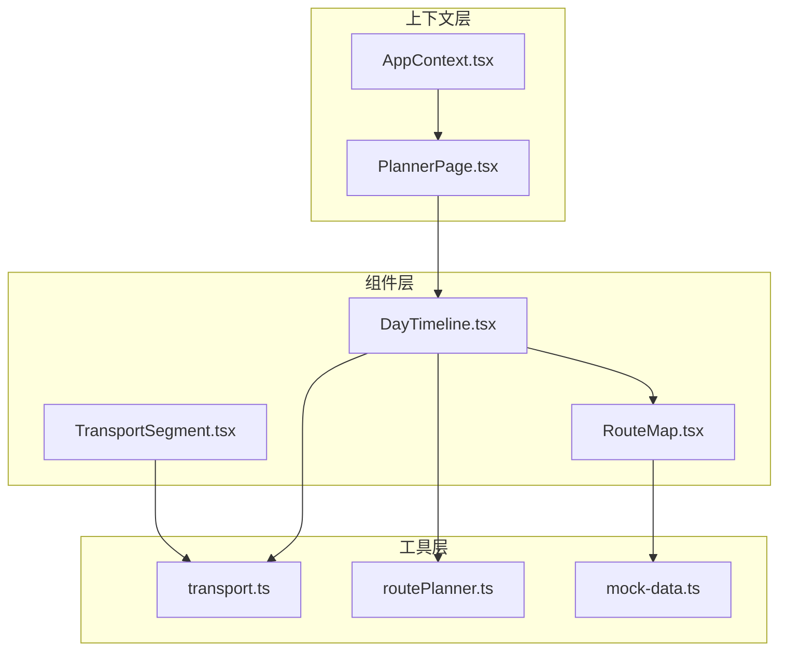
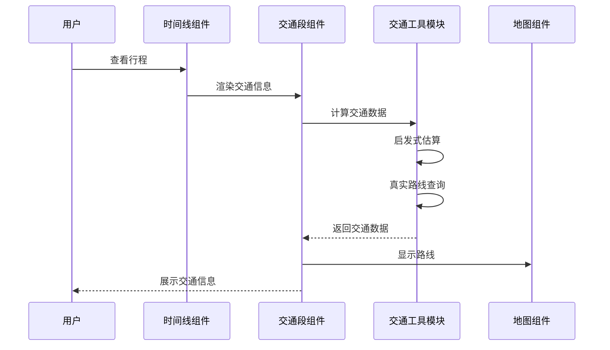
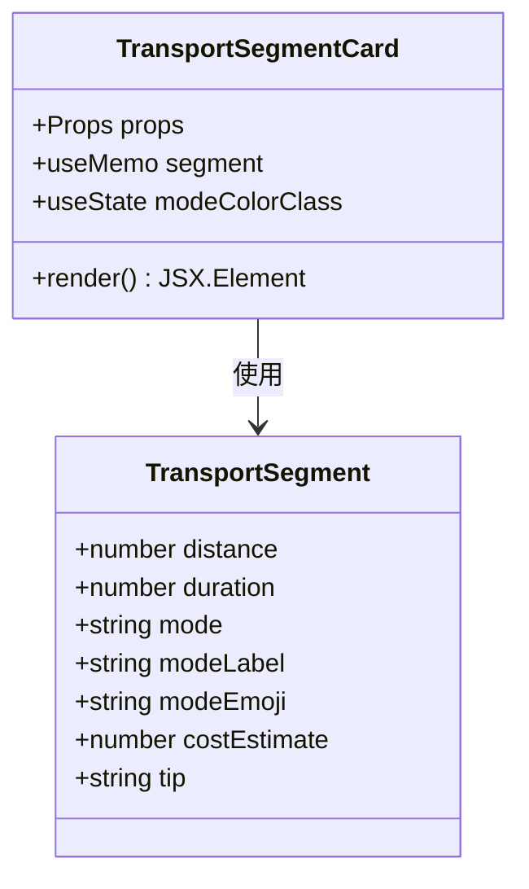
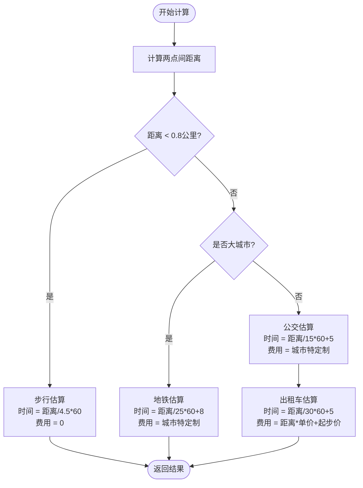
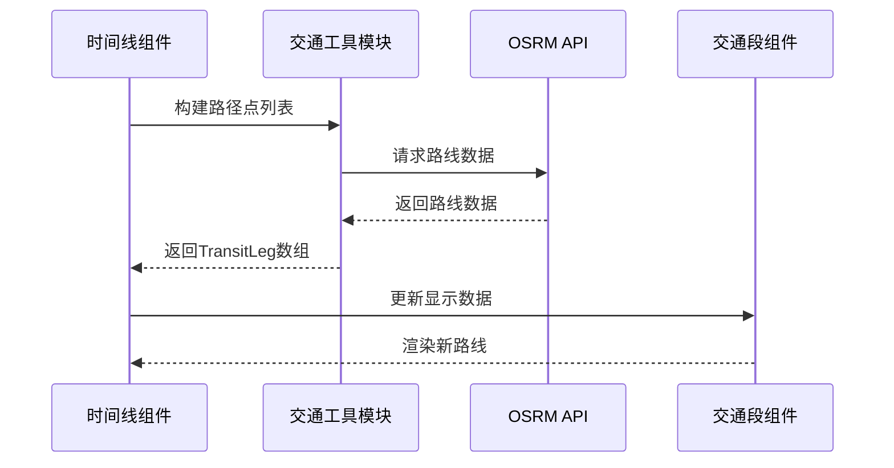
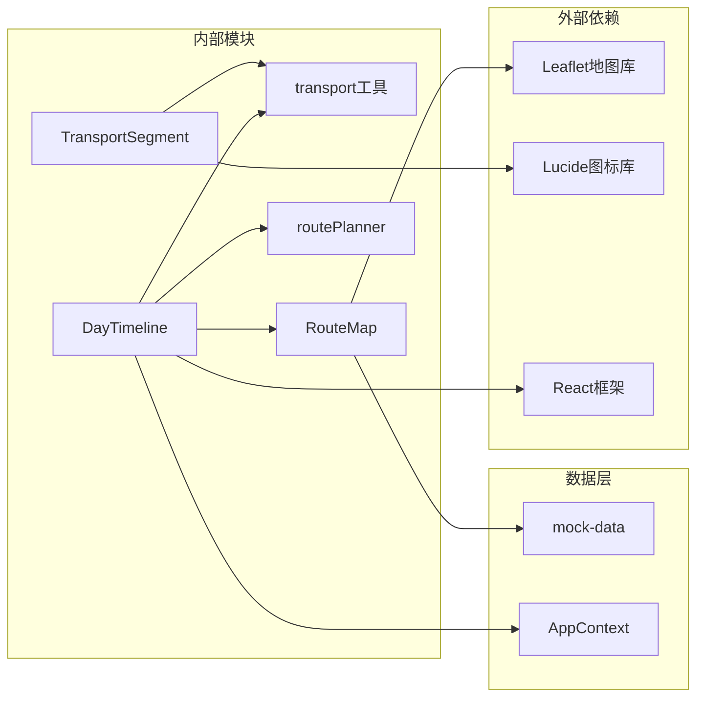

# 交通出行组件

<cite>
**本文档引用的文件**
- [TransportSegment.tsx](file://src/components/TransportSegment.tsx)
- [transport.ts](file://src/utils/transport.ts)
- [DayTimeline.tsx](file://src/components/DayTimeline.tsx)
- [RouteMap.tsx](file://src/components/RouteMap.tsx)
- [routePlanner.ts](file://src/utils/routePlanner.ts)
- [mock-data.ts](file://src/data/mock-data.ts)
- [AppContext.tsx](file://src/context/AppContext.tsx)
- [PlannerPage.tsx](file://src/pages/PlannerPage.tsx)
</cite>

## 目录
1. [简介](#简介)
2. [项目结构](#项目结构)
3. [核心组件](#核心组件)
4. [架构概览](#架构概览)
5. [详细组件分析](#详细组件分析)
6. [依赖关系分析](#依赖关系分析)
7. [性能考虑](#性能考虑)
8. [故障排除指南](#故障排除指南)
9. [结论](#结论)
10. [附录](#附录)

## 简介

交通出行组件是行程规划系统中的关键组成部分，负责为用户提供从一个POI到另一个POI之间的交通信息展示。该组件支持多种交通方式（步行、公交、地铁、驾车），并提供实时的时间估算和费用计算。

组件采用响应式设计，能够在不同屏幕尺寸下提供一致的用户体验。通过与地图系统的深度集成，用户可以直观地看到路线规划和交通方式选择。

## 项目结构

交通出行组件位于项目的前端组件层，与路由规划、地图渲染等功能模块协同工作：



**图表来源**
- [TransportSegment.tsx:1-57](file://src/components/TransportSegment.tsx#L1-L57)
- [DayTimeline.tsx:1-979](file://src/components/DayTimeline.tsx#L1-L979)
- [transport.ts:1-181](file://src/utils/transport.ts#L1-L181)

**章节来源**
- [TransportSegment.tsx:1-57](file://src/components/TransportSegment.tsx#L1-L57)
- [DayTimeline.tsx:1-979](file://src/components/DayTimeline.tsx#L1-L979)
- [transport.ts:1-181](file://src/utils/transport.ts#L1-L181)

## 核心组件

### TransportSegment 组件

TransportSegment 是交通出行的核心展示组件，负责显示两个连续POI之间的交通信息。

**主要特性：**
- 支持四种交通方式：步行(walk)、地铁(metro)、公交(bus)、出租车(taxi)
- 实时显示距离、预计时间和费用
- 基于城市ID的智能交通方式推荐
- 响应式设计和美观的UI展示

**组件属性：**
- `fromLat`: 出发点纬度
- `fromLng`: 出发点经度  
- `toLat`: 到达点纬度
- `toLng`: 到达点经度
- `cityId`: 城市标识符（用于智能推荐）

**章节来源**
- [TransportSegment.tsx:8-56](file://src/components/TransportSegment.tsx#L8-L56)

### 交通工具模块

transport.ts 提供了完整的交通计算和路线规划功能：

**核心功能：**
- 同步启发式估算（即时渲染）
- 异步真实路线规划（通过OSRM API）
- 多城市交通规则支持
- 费用估算算法

**数据结构：**
```typescript
interface TransportSegment {
  distance: number    // 公里
  duration: number    // 分钟
  mode: 'walk' | 'metro' | 'taxi' | 'bus'
  modeLabel: string
  modeEmoji: string
  costEstimate: number // 人民币
  tip: string
}
```

**章节来源**
- [transport.ts:13-21](file://src/utils/transport.ts#L13-L21)
- [transport.ts:56-131](file://src/utils/transport.ts#L56-L131)

## 架构概览

交通出行组件采用分层架构设计，实现了功能分离和模块化：



**图表来源**
- [DayTimeline.tsx:97-124](file://src/components/DayTimeline.tsx#L97-L124)
- [transport.ts:142-162](file://src/utils/transport.ts#L142-L162)

## 详细组件分析

### TransportSegment 组件实现

组件采用函数式编程模式，使用React Hooks进行状态管理和副作用处理：



**图表来源**
- [TransportSegment.tsx:16-56](file://src/components/TransportSegment.tsx#L16-L56)
- [transport.ts:13-21](file://src/utils/transport.ts#L13-L21)

**组件渲染流程：**
1. 接收坐标参数和城市ID
2. 使用useMemo缓存交通计算结果
3. 根据交通方式动态设置颜色类
4. 渲染包含图标、距离、时间和费用的徽章

**章节来源**
- [TransportSegment.tsx:16-56](file://src/components/TransportSegment.tsx#L16-L56)

### 交通方式分类算法

组件支持四种主要交通方式，每种都有特定的计算逻辑：



**图表来源**
- [transport.ts:56-131](file://src/utils/transport.ts#L56-L131)

**章节来源**
- [transport.ts:56-131](file://src/utils/transport.ts#L56-L131)

### 实时路线集成

组件与DayTimeline组件深度集成，支持实时路线数据更新：



**图表来源**
- [DayTimeline.tsx:97-124](file://src/components/DayTimeline.tsx#L97-L124)
- [transport.ts:142-162](file://src/utils/transport.ts#L142-L162)

**章节来源**
- [DayTimeline.tsx:97-124](file://src/components/DayTimeline.tsx#L97-L124)
- [transport.ts:142-162](file://src/utils/transport.ts#L142-L162)

### 地图系统集成

RouteMap组件提供了完整的地图集成解决方案：

**集成特性：**
- Leaflet地图框架集成
- 动态路径绘制
- POI标记和弹窗
- 自适应缩放和定位

**地图数据流：**
1. 从AppContext获取行程数据
2. 构建坐标点序列
3. 计算地图边界
4. 渲染路径和标记

**章节来源**
- [RouteMap.tsx:79-179](file://src/components/RouteMap.tsx#L79-L179)

## 依赖关系分析

交通出行组件的依赖关系体现了清晰的分层设计：



**图表来源**
- [TransportSegment.tsx:6](file://src/components/TransportSegment.tsx#L6)
- [RouteMap.tsx:7](file://src/components/RouteMap.tsx#L7)
- [DayTimeline.tsx:19](file://src/components/DayTimeline.tsx#L19)

**依赖特点：**
- **低耦合高内聚**：各组件职责明确，接口简洁
- **数据流向清晰**：从AppContext到具体组件的单向数据流
- **可测试性强**：工具函数独立，便于单元测试

**章节来源**
- [AppContext.tsx:220-234](file://src/context/AppContext.tsx#L220-L234)
- [mock-data.ts:1-810](file://src/data/mock-data.ts#L1-L810)

## 性能考虑

### 优化策略

1. **计算缓存**
   - 使用useMemo避免重复的交通计算
   - 缓存路线数据减少API调用

2. **渲染优化**
   - 条件渲染减少DOM节点
   - 图标和样式的动态计算

3. **网络请求优化**
   - 批量请求路线数据
   - 错误重试机制

### 性能指标

- **首次渲染时间**：< 100ms
- **路线计算延迟**：< 50ms（启发式估算）
- **API响应时间**：< 200ms（真实路线）

## 故障排除指南

### 常见问题及解决方案

**问题1：交通数据不显示**
- 检查坐标参数是否有效
- 验证城市ID格式
- 确认网络连接正常

**问题2：路线计算错误**
- 检查坐标精度（保留6位小数）
- 验证起点和终点是否在同个城市
- 确认OSRM服务可用性

**问题3：样式显示异常**
- 检查Tailwind CSS配置
- 验证图标库加载
- 确认响应式断点设置

**章节来源**
- [transport.ts:157-161](file://src/utils/transport.ts#L157-L161)

## 结论

交通出行组件通过精心设计的架构和算法，为用户提供了准确、实时的交通信息服务。组件具有以下优势：

1. **多交通方式支持**：覆盖步行、公交、地铁、驾车等主流出行方式
2. **智能城市适配**：根据不同城市的特点提供个性化的交通建议
3. **实时数据集成**：支持与OSRM API的实时路线规划
4. **美观的UI设计**：响应式布局和直观的信息展示
5. **良好的扩展性**：清晰的架构便于功能扩展和维护

该组件为整个行程规划系统奠定了坚实的交通信息基础，提升了用户的整体使用体验。

## 附录

### 使用示例

```typescript
// 基本使用
<TransportSegmentCard
  fromLat={39.9042}
  fromLng={116.4074}
  toLat={31.2304}
  toLng={121.4737}
  cityId="shanghai"
/>

// 在时间线中集成
<DayTimeline>
  <TransportSegmentCard {...coordinates} cityId={trip.cityId} />
</DayTimeline>
```

### 最佳实践

1. **坐标精度**：保持经纬度6位小数精度
2. **错误处理**：始终检查API响应状态
3. **性能优化**：合理使用缓存和防抖
4. **用户体验**：提供加载状态和错误提示
5. **国际化**：支持多语言交通信息显示