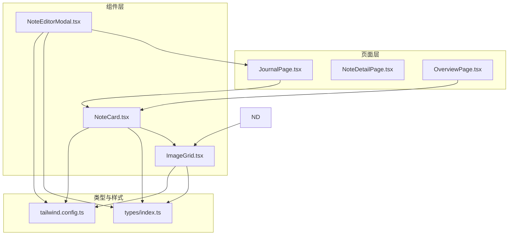
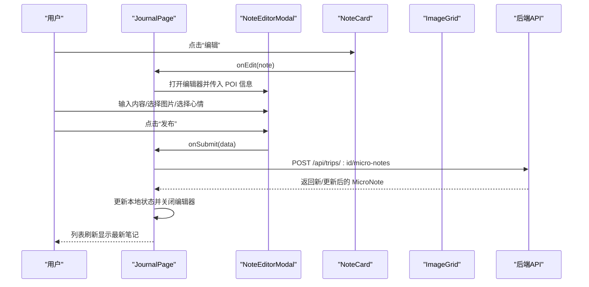
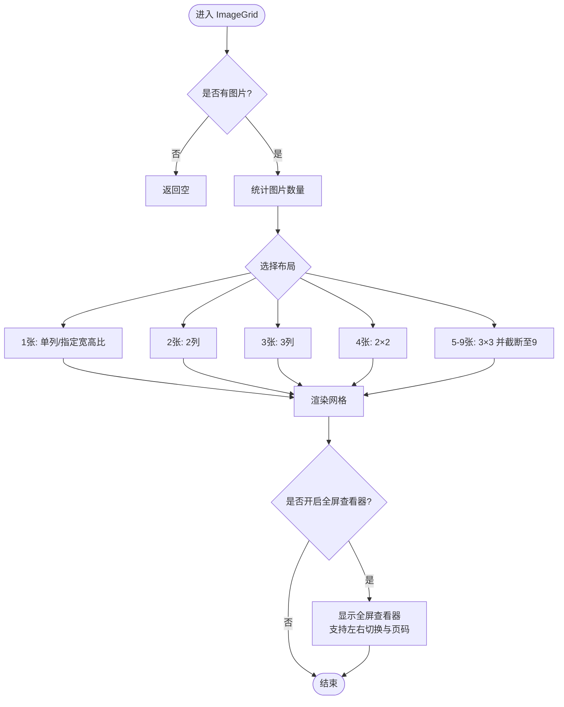
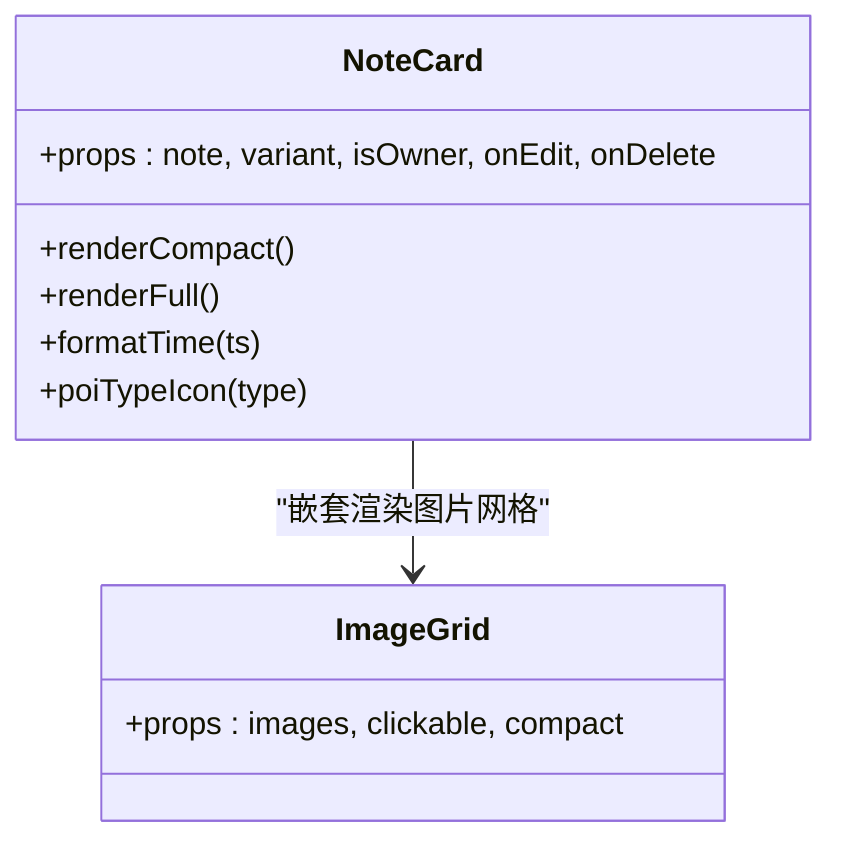
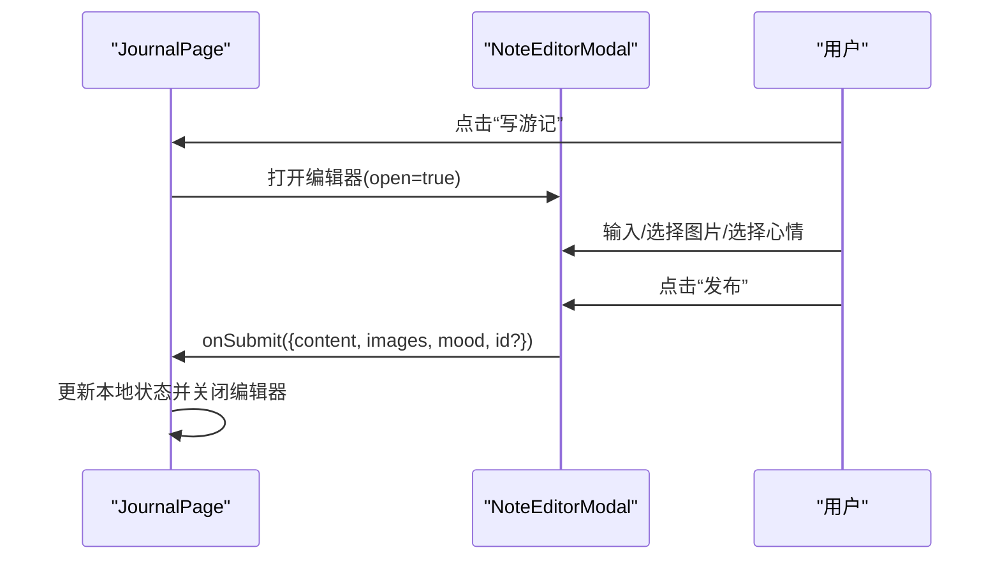
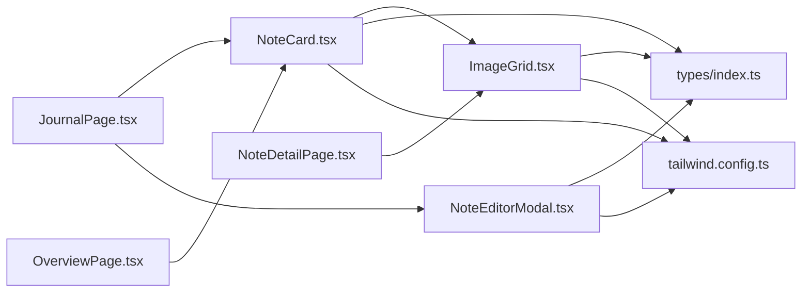

# 内容展示组件

<cite>
**本文档引用的文件**
- [ImageGrid.tsx](file://src/components/ImageGrid.tsx)
- [NoteCard.tsx](file://src/components/NoteCard.tsx)
- [NoteEditorModal.tsx](file://src/components/NoteEditorModal.tsx)
- [JournalPage.tsx](file://src/pages/JournalPage.tsx)
- [NoteDetailPage.tsx](file://src/pages/NoteDetailPage.tsx)
- [OverviewPage.tsx](file://src/pages/OverviewPage.tsx)
- [index.ts](file://src/types/index.ts)
- [tailwind.config.ts](file://tailwind.config.ts)
</cite>

## 目录
1. [简介](#简介)
2. [项目结构](#项目结构)
3. [核心组件](#核心组件)
4. [架构概览](#架构概览)
5. [详细组件分析](#详细组件分析)
6. [依赖关系分析](#依赖关系分析)
7. [性能考虑](#性能考虑)
8. [故障排查指南](#故障排查指南)
9. [结论](#结论)
10. [附录](#附录)

## 简介
本文件聚焦于内容展示组件，重点解析两个核心组件：ImageGrid（图片网格）与 NoteCard（笔记卡片）。文档从设计理念、实现细节、数据绑定、事件处理、用户交互、样式定制、主题适配、可访问性与性能优化、与后端 API 的数据交互与错误处理等方面进行系统化说明，并提供使用示例与集成指南。

## 项目结构
- 组件层：src/components 下包含 ImageGrid、NoteCard、NoteEditorModal 等组件。
- 页面层：src/pages 下包含 JournalPage、NoteDetailPage、OverviewPage 等页面，它们是组件的主要使用场景。
- 类型定义：src/types/index.ts 提供 MicroNote、NoteMood 等类型，支撑组件的数据契约。
- 样式与主题：tailwind.config.ts 定义颜色、阴影、动画等主题变量，为组件提供一致的视觉风格。

图表来源
- [JournalPage.tsx:137-338](file://src/pages/JournalPage.tsx#L137-L338)
- [NoteDetailPage.tsx:199-425](file://src/pages/NoteDetailPage.tsx#L199-L425)
- [OverviewPage.tsx:27-718](file://src/pages/OverviewPage.tsx#L27-L718)
- [ImageGrid.tsx:1-128](file://src/components/ImageGrid.tsx#L1-L128)
- [NoteCard.tsx:1-193](file://src/components/NoteCard.tsx#L1-L193)
- [NoteEditorModal.tsx:1-286](file://src/components/NoteEditorModal.tsx#L1-L286)
- [index.ts:210-239](file://src/types/index.ts#L210-L239)
- [tailwind.config.ts:20-134](file://tailwind.config.ts#L20-L134)

章节来源
- [JournalPage.tsx:1-340](file://src/pages/JournalPage.tsx#L1-L340)
- [NoteDetailPage.tsx:1-464](file://src/pages/NoteDetailPage.tsx#L1-L464)
- [OverviewPage.tsx:1-719](file://src/pages/OverviewPage.tsx#L1-L719)
- [ImageGrid.tsx:1-128](file://src/components/ImageGrid.tsx#L1-L128)
- [NoteCard.tsx:1-193](file://src/components/NoteCard.tsx#L1-L193)
- [NoteEditorModal.tsx:1-286](file://src/components/NoteEditorModal.tsx#L1-L286)
- [index.ts:210-239](file://src/types/index.ts#L210-L239)
- [tailwind.config.ts:1-139](file://tailwind.config.ts#L1-L139)

## 核心组件
- ImageGrid：微信朋友圈风格的图片网格，支持 1-9 张图片自适应布局，带懒加载与全屏查看器。
- NoteCard：社交风格的微游记卡片，支持紧凑与完整两种变体，内嵌 ImageGrid，提供编辑/删除入口。
- NoteEditorModal：底部弹出式编辑器，支持文本、图片上传（最多 9 张）、心情标签、提交与加载态。

章节来源
- [ImageGrid.tsx:1-128](file://src/components/ImageGrid.tsx#L1-L128)
- [NoteCard.tsx:1-193](file://src/components/NoteCard.tsx#L1-L193)
- [NoteEditorModal.tsx:1-286](file://src/components/NoteEditorModal.tsx#L1-L286)

## 架构概览
组件间协作关系：
- NoteCard 作为容器，内部组合 ImageGrid 展示图片；在 JournalPage 中以“完整”变体呈现，在 OverviewPage 的 DayTimeline 场景中以“紧凑”变体呈现。
- NoteEditorModal 由 JournalPage 打开，负责创建/更新 MicroNote，并通过回调与页面交互。
- 类型系统由 types/index.ts 提供，确保组件间数据一致性。

图表来源
- [JournalPage.tsx:76-130](file://src/pages/JournalPage.tsx#L76-L130)
- [NoteEditorModal.tsx:118-126](file://src/components/NoteEditorModal.tsx#L118-L126)
- [NoteCard.tsx:99-118](file://src/components/NoteCard.tsx#L99-L118)

## 详细组件分析

### ImageGrid 组件分析
- 设计理念
  - 微信朋友圈风格：1-9 张图片自适应网格布局，紧凑与完整两种尺寸变体，支持点击放大浏览。
- 实现要点
  - 布局算法：根据图片数量选择 1/2/3/2×2 或 3×3 网格，限制最多 9 张。
  - 懒加载：img 标签使用延迟加载属性，减少首屏资源压力。
  - 响应式适配：通过 Tailwind 类控制间距、圆角、最大宽度与宽高比，适配不同屏幕尺寸。
  - 全屏查看器：点击任意图片打开全屏查看器，支持左右切换与页码指示。
- 数据绑定与事件处理
  - 接收 images 数组，内部通过 ImgCell 渲染单元格；点击单元格触发 viewerIndex 状态变化。
  - 支持 clickable 与 compact 属性控制交互与外观。
- 可访问性与性能
  - 图片 alt 为空字符串，避免重复语义；全屏查看器使用固定定位与遮罩层，保证层级与交互。
  - 懒加载与缩放过渡提升体验与性能。

图表来源
- [ImageGrid.tsx:16-78](file://src/components/ImageGrid.tsx#L16-L78)
- [ImageGrid.tsx:84-125](file://src/components/ImageGrid.tsx#L84-L125)

章节来源
- [ImageGrid.tsx:1-128](file://src/components/ImageGrid.tsx#L1-L128)

### NoteCard 组件分析
- 设计理念
  - 社交风格：紧凑变体用于行程日程中的 POI 下方，完整变体用于游记页面，强调内容优先。
- 实现要点
  - 变体切换：通过 variant 属性在紧凑与完整之间切换，影响排版、字体大小与留白。
  - 内容渲染：作者头像/昵称、时间戳、心情标签、正文、地点徽章（完整变体）。
  - 图片展示：内部嵌套 ImageGrid，紧凑模式下使用 compact 变体。
  - 编辑/删除：仅对作者可见，悬停显示操作按钮，点击回调由父组件提供。
- 数据绑定与事件处理
  - 使用 MicroNote 类型，格式化时间与 POI 类型图标；支持 mood 映射中文标签。
  - 回调 onEdit/onDelete 通过 props 注入，阻止事件冒泡以避免误触。
- 用户交互模式
  - 悬停显示操作按钮，透明度过渡；点击编辑/删除分别触发对应回调。

图表来源
- [NoteCard.tsx:60-193](file://src/components/NoteCard.tsx#L60-L193)
- [ImageGrid.tsx:8-14](file://src/components/ImageGrid.tsx#L8-L14)

章节来源
- [NoteCard.tsx:1-193](file://src/components/NoteCard.tsx#L1-L193)

### NoteEditorModal 组件分析
- 设计理念
  - 底部弹出式编辑器：适合移动端与桌面端，提供沉浸式编辑体验。
- 实现要点
  - 文本输入：字符上限 280，实时计数与危险色提示。
  - 图片上传：最多 9 张，使用 FileReader 转为 base64 数据 URI 存储。
  - 心情标签：内置 10 种表情，支持展开选择与移除。
  - POI 信息：只读显示，来源于上下文（如当前 POI 名称、类型、所在天数）。
  - 提交流程：校验必填项，调用 onSubmit 回调，支持提交中状态。
- 状态管理
  - 内部维护 content、images、mood、showMoodPicker、submitting 等状态。
  - 打开时根据 editingNote 初始化内容；自动聚焦文本域。
- 用户交互模式
  - 通过 open/close 控制显隐；点击遮罩或关闭按钮关闭。
  - 图片预览区支持删除单张图片；提交按钮禁用条件明确。

图表来源
- [NoteEditorModal.tsx:53-62](file://src/components/NoteEditorModal.tsx#L53-L62)
- [NoteEditorModal.tsx:118-126](file://src/components/NoteEditorModal.tsx#L118-L126)
- [JournalPage.tsx:327-336](file://src/pages/JournalPage.tsx#L327-L336)

章节来源
- [NoteEditorModal.tsx:1-286](file://src/components/NoteEditorModal.tsx#L1-L286)

## 依赖关系分析
- 组件依赖
  - NoteCard 依赖 ImageGrid 进行图片展示。
  - NoteEditorModal 依赖 MicroNote、NoteMood 类型。
  - 页面层（JournalPage、NoteDetailPage、OverviewPage）依赖上述组件完成业务场景。
- 类型依赖
  - MicroNote、NoteMood 定义在 types/index.ts，贯穿组件与页面层。
- 样式依赖
  - tailwind.config.ts 提供颜色、圆角、阴影、动画等主题变量，组件通过类名统一风格。

图表来源
- [NoteCard.tsx:8-9](file://src/components/NoteCard.tsx#L8-L9)
- [ImageGrid.tsx:5-6](file://src/components/ImageGrid.tsx#L5-L6)
- [NoteEditorModal.tsx:11-13](file://src/components/NoteEditorModal.tsx#L11-L13)
- [JournalPage.tsx:18-19](file://src/pages/JournalPage.tsx#L18-L19)
- [NoteDetailPage.tsx](file://src/pages/NoteDetailPage.tsx#L24)
- [OverviewPage.tsx:1-3](file://src/pages/OverviewPage.tsx#L1-L3)
- [index.ts:210-239](file://src/types/index.ts#L210-L239)
- [tailwind.config.ts:20-134](file://tailwind.config.ts#L20-L134)

章节来源
- [index.ts:210-239](file://src/types/index.ts#L210-L239)
- [tailwind.config.ts:1-139](file://tailwind.config.ts#L1-L139)

## 性能考虑
- 图片加载
  - ImageGrid 使用延迟加载属性，减少首屏资源消耗；全屏查看器按需渲染，避免不必要的 DOM。
- 状态与重渲染
  - NoteEditorModal 使用 useMemo 与 useCallback 优化分组与过滤逻辑（在 JournalPage 中），减少不必要重渲染。
- 动画与过渡
  - 使用 Tailwind 动画类实现平滑过渡，避免复杂 JS 动画带来的性能开销。
- 图片上传
  - 使用 FileReader 将图片转为 base64，便于前端预览与提交；注意内存占用，建议在移动端谨慎处理大图。

章节来源
- [ImageGrid.tsx:33-37](file://src/components/ImageGrid.tsx#L33-L37)
- [JournalPage.tsx:54-74](file://src/pages/JournalPage.tsx#L54-L74)
- [NoteEditorModal.tsx:90-112](file://src/components/NoteEditorModal.tsx#L90-L112)

## 故障排查指南
- 图片不显示
  - 检查 images 数组是否为空；确认图片 URL 可访问；查看浏览器网络面板与控制台错误。
- 全屏查看器无法关闭
  - 确认点击区域未被事件冒泡覆盖；检查遮罩层与按钮的点击处理逻辑。
- 编辑器无法提交
  - 确认 content 非空且未超过字符上限；检查 submitting 状态；查看后端返回的 success 字段。
- 删除失败
  - 确认 savedTripId 存在；检查鉴权头是否正确；查看网络请求状态码与错误信息。
- 时间显示异常
  - 检查 createdAt 时间戳格式；确认本地时间与服务器时区差异。

章节来源
- [ImageGrid.tsx:84-125](file://src/components/ImageGrid.tsx#L84-L125)
- [NoteEditorModal.tsx:118-126](file://src/components/NoteEditorModal.tsx#L118-L126)
- [JournalPage.tsx:84-97](file://src/pages/JournalPage.tsx#L84-L97)

## 结论
ImageGrid 与 NoteCard 构成了行程与游记场景下的核心内容展示能力：前者提供灵活的图片网格布局与全屏浏览，后者承载社交化的笔记卡片与编辑入口。二者配合 NoteEditorModal，形成从“浏览—编辑—提交”的完整闭环。通过类型约束、主题变量与合理的状态管理，组件在可维护性与可扩展性上具备良好基础。

## 附录

### 组件属性配置与使用示例

- ImageGrid
  - 属性
    - images: string[] — 图片 URL 数组
    - clickable?: boolean — 是否启用全屏查看器（默认 true）
    - compact?: boolean — 紧凑模式（默认 false）
  - 使用示例
    - 在 NoteCard 中：用于展示笔记图片，compact 为 true
    - 在 JournalPage/NoteDetailPage 中：用于文章风格的图片展示，compact 为 false
  - 参考路径
    - [ImageGrid.tsx:8-14](file://src/components/ImageGrid.tsx#L8-L14)

- NoteCard
  - 属性
    - note: MicroNote — 笔记数据
    - variant?: 'compact' | 'full' — 变体（默认 'compact'）
    - isOwner?: boolean — 当前用户是否为作者
    - onEdit?: (note: MicroNote) => void — 编辑回调
    - onDelete?: (noteId: string) => void — 删除回调
  - 使用示例
    - JournalPage 中以 full 变体展示，包含 POI 位置徽章与作者信息
    - OverviewPage 中以 compact 变体展示，用于日程条目下方
  - 参考路径
    - [NoteCard.tsx:12-22](file://src/components/NoteCard.tsx#L12-L22)

- NoteEditorModal
  - 属性
    - open: boolean — 是否显示
    - onClose: () => void — 关闭回调
    - onSubmit: (data) => Promise<void> — 提交回调
    - poiName: string — POI 名称（只读）
    - poiType: string — POI 类型（只读）
    - dayNumber: number — 所在天数（只读）
    - editingNote?: MicroNote | null — 编辑模式下的笔记
    - submitting?: boolean — 提交中状态
  - 使用示例
    - JournalPage 中打开编辑器，传入 POI 信息与回调
  - 参考路径
    - [NoteEditorModal.tsx:31-51](file://src/components/NoteEditorModal.tsx#L31-L51)

### 样式定制与主题适配
- 主题变量
  - tailwind.config.ts 定义了 journal、card、border、foreground 等颜色与阴影、圆角、动画等主题变量，组件通过类名使用这些变量。
- 自定义建议
  - 如需调整图片网格间距与圆角，可在组件内通过类名覆盖；如需修改全屏查看器背景色，可调整遮罩层类名。
  - 若需更换心情标签样式，可在 NoteEditorModal 中调整 mood 标签的类名组合。
- 参考路径
  - [tailwind.config.ts:24-94](file://tailwind.config.ts#L24-L94)

### 可访问性特性
- 图片 alt
  - ImageGrid 中图片 alt 为空字符串，避免重复语义；建议在业务层补充合适的 alt 文本。
- 键盘与焦点
  - NoteEditorModal 自动聚焦文本域；建议为按钮添加 aria-label 或标题属性以增强可访问性。
- 对比度与色彩
  - 使用主题变量确保前景/背景对比度满足可读性要求；在暗色模式下验证颜色一致性。

章节来源
- [ImageGrid.tsx:33-37](file://src/components/ImageGrid.tsx#L33-L37)
- [NoteEditorModal.tsx:84-88](file://src/components/NoteEditorModal.tsx#L84-L88)
- [tailwind.config.ts:24-94](file://tailwind.config.ts#L24-L94)

### 与后端 API 的数据交互与错误处理
- 数据模型
  - MicroNote、NoteMood 等类型定义在 types/index.ts，确保前后端数据契约一致。
- API 调用
  - JournalPage 中通过 fetch 获取游记列表、提交新笔记、删除笔记；NoteDetailPage 中获取游记详情、评论列表与微游记列表；均使用鉴权头。
- 错误处理
  - 统一使用 try/catch 包裹异步请求；在失败时忽略错误并保持界面稳定；加载态通过 loading/submitting 状态控制。
- 参考路径
  - [JournalPage.tsx:40-50](file://src/pages/JournalPage.tsx#L40-L50)
  - [JournalPage.tsx:99-130](file://src/pages/JournalPage.tsx#L99-L130)
  - [NoteDetailPage.tsx:64-92](file://src/pages/NoteDetailPage.tsx#L64-L92)
  - [index.ts:210-239](file://src/types/index.ts#L210-L239)