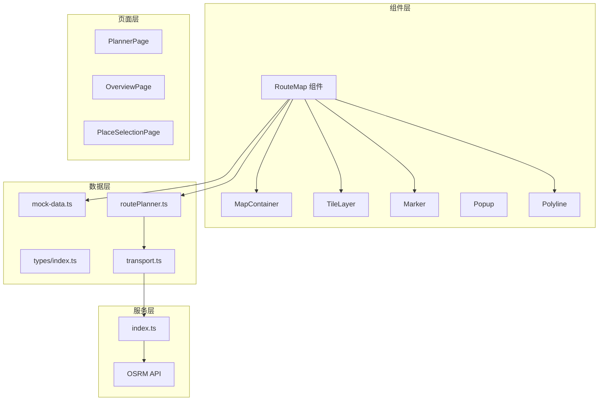
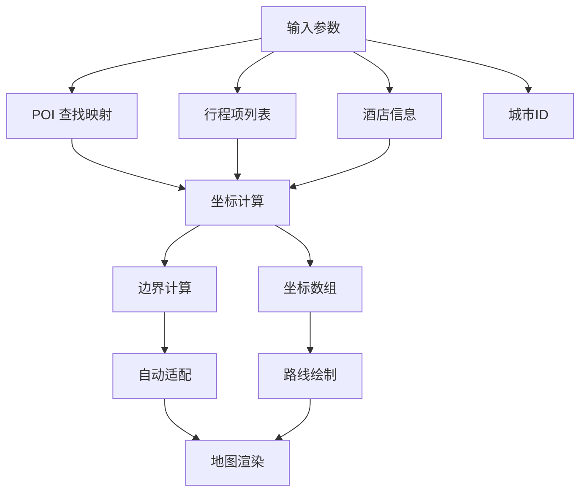
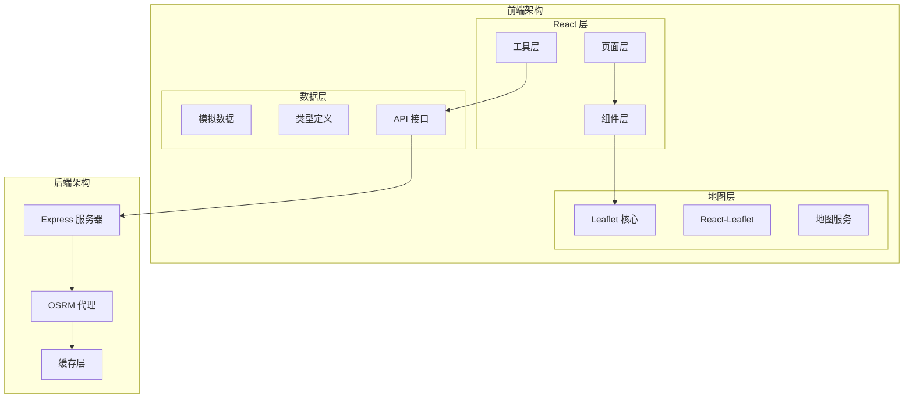
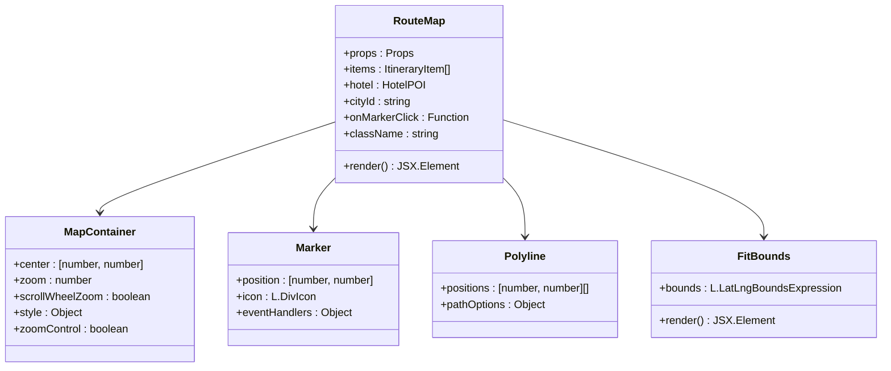
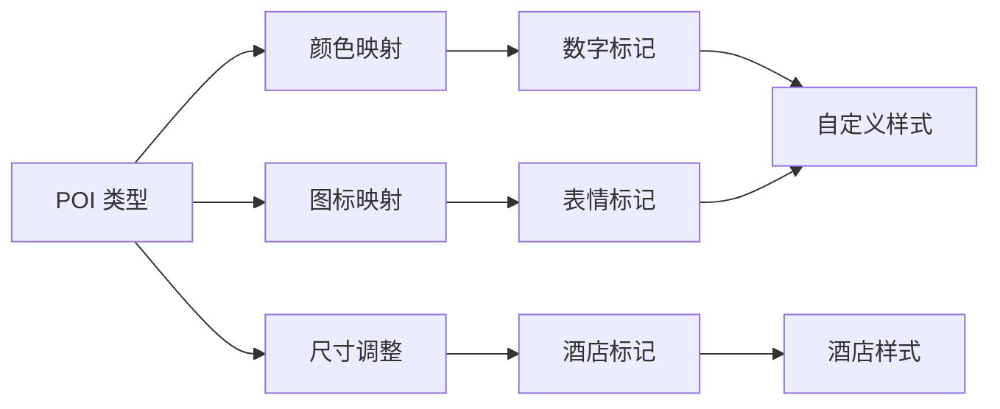
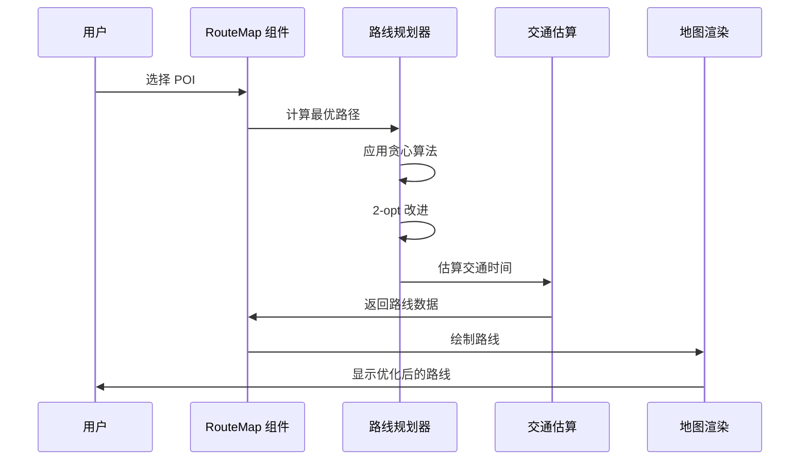
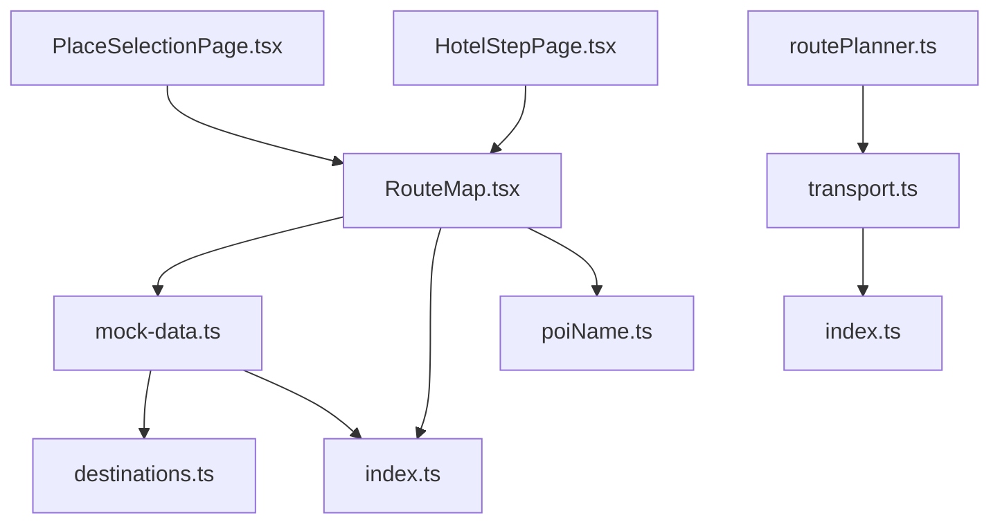
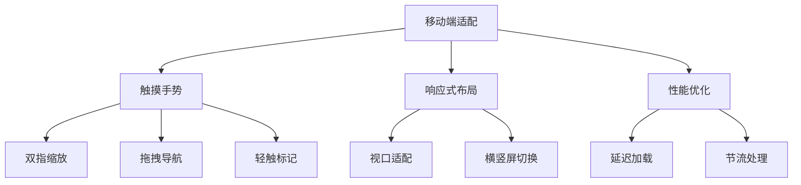

# 地图可视化组件

<cite>
**本文档引用的文件**
- [RouteMap.tsx](file://src/components/RouteMap.tsx)
- [mock-data.ts](file://src/data/mock-data.ts)
- [routePlanner.ts](file://src/utils/routePlanner.ts)
- [transport.ts](file://src/utils/transport.ts)
- [index.ts](file://src/types/index.ts)
- [PlaceSelectionPage.tsx](file://src/pages/PlaceSelectionPage.tsx)
- [HotelStepPage.tsx](file://src/pages/HotelStepPage.tsx)
- [index.ts](file://server/index.ts)
</cite>

## 目录
1. [简介](#简介)
2. [项目结构](#项目结构)
3. [核心组件](#核心组件)
4. [架构概览](#架构概览)
5. [详细组件分析](#详细组件分析)
6. [依赖关系分析](#依赖关系分析)
7. [性能考虑](#性能考虑)
8. [故障排除指南](#故障排除指南)
9. [结论](#结论)
10. [附录](#附录)

## 简介

RouteMap 是本项目中的核心地图可视化组件，基于 React-Leaflet 和 Leaflet 库构建。该组件提供了完整的地图展示功能，包括 POI 标记系统、路线绘制、交互事件处理和实时更新能力。

组件的主要特点：
- **POI 标记系统**：支持多种类型的 POI（景点、美食、购物、体验、住宿、交通）
- **路线规划**：集成智能路线算法，支持实时更新和优化
- **交互式地图**：提供缩放控制、拖拽导航和弹窗提示
- **响应式设计**：适配不同屏幕尺寸和设备类型
- **高性能渲染**：使用 useMemo 优化计算性能

## 项目结构



**图表来源**
- [RouteMap.tsx:1-180](file://src/components/RouteMap.tsx#L1-L180)
- [mock-data.ts:1-810](file://src/data/mock-data.ts#L1-L810)
- [routePlanner.ts:158-874](file://src/utils/routePlanner.ts#L158-L874)

**章节来源**
- [RouteMap.tsx:1-180](file://src/components/RouteMap.tsx#L1-L180)
- [mock-data.ts:1-810](file://src/data/mock-data.ts#L1-L810)

## 核心组件

### RouteMap 组件架构

RouteMap 组件采用函数式组件设计，集成了以下核心功能模块：

#### 主要功能特性
- **地图容器管理**：使用 MapContainer 提供的地图实例
- **底图服务**：基于 CARTO Voyager 样式的底图服务
- **POI 标记系统**：动态生成自定义样式的标记图标
- **路线绘制**：根据行程数据自动绘制最优路径
- **交互事件处理**：支持标记点击、弹窗显示等功能

#### 数据流架构



**图表来源**
- [RouteMap.tsx:79-106](file://src/components/RouteMap.tsx#L79-L106)

**章节来源**
- [RouteMap.tsx:60-180](file://src/components/RouteMap.tsx#L60-L180)

## 架构概览

### 整体架构设计



**图表来源**
- [RouteMap.tsx:1-12](file://src/components/RouteMap.tsx#L1-L12)
- [index.ts:287-308](file://server/index.ts#L287-L308)

### 组件关系图



**图表来源**
- [RouteMap.tsx:79-168](file://src/components/RouteMap.tsx#L79-L168)

**章节来源**
- [RouteMap.tsx:1-180](file://src/components/RouteMap.tsx#L1-L180)

## 详细组件分析

### POI 标记系统

#### 标记样式设计

RouteMap 实现了高度定制化的 POI 标记系统，支持多种样式和交互效果：



**图表来源**
- [RouteMap.tsx:14-42](file://src/components/RouteMap.tsx#L14-L42)
- [RouteMap.tsx:70-77](file://src/components/RouteMap.tsx#L70-L77)

#### 标记渲染逻辑

每个 POI 标记的渲染过程包括以下步骤：

1. **类型识别**：根据 POI 类型确定颜色和图标
2. **样式生成**：动态创建 CSS 样式的 divIcon
3. **位置设置**：使用经纬度坐标定位标记
4. **事件绑定**：为标记添加点击事件处理器
5. **弹窗配置**：设置鼠标悬停时显示的弹窗内容

**章节来源**
- [RouteMap.tsx:134-154](file://src/components/RouteMap.tsx#L134-L154)

### 路线绘制功能

#### 路线算法集成

RouteMap 集成了智能路线规划算法，能够根据用户选择的 POI 自动计算最优路径：



**图表来源**
- [routePlanner.ts:167-236](file://src/utils/routePlanner.ts#L167-L236)
- [routePlanner.ts:238-270](file://src/utils/routePlanner.ts#L238-L270)

#### 路线优化策略

路线规划采用多阶段优化策略：

1. **初始路径生成**：使用最近邻贪心算法生成基础路径
2. **反向回溯避免**：通过方向性偏置避免路径来回抖动
3. **局部搜索优化**：应用 2-opt 算法进行局部路径改进
4. **时间窗口匹配**：确保 POI 的开放时间与行程安排匹配

**章节来源**
- [routePlanner.ts:167-236](file://src/utils/routePlanner.ts#L167-L236)
- [routePlanner.ts:238-270](file://src/utils/routePlanner.ts#L238-L270)

### 地图初始化配置

#### 基础配置参数

RouteMap 的地图初始化配置包括以下关键参数：

| 参数 | 默认值 | 说明 |
|------|--------|------|
| center | 城市中心坐标 | 地图初始中心位置 |
| zoom | 13 | 初始缩放级别 |
| scrollWheelZoom | true | 启用滚轮缩放 |
| zoomControl | false | 隐藏默认缩放控件 |
| style | { height: '100%', width: '100%' } | 完全填充容器 |

#### 底图服务配置

组件使用 CARTO Voyager 样式作为底图服务：

- **服务提供商**：CARTO Maps
- **样式主题**：Voyager（明亮色系）
- **瓦片格式**：XYZ 网格瓦片
- **最大缩放**：20 级
- **子域支持**：abcd 四个子域

**章节来源**
- [RouteMap.tsx:109-121](file://src/components/RouteMap.tsx#L109-L121)

### 交互事件处理

#### 事件处理机制

RouteMap 实现了完整的事件处理机制，支持多种用户交互：

```mermaid
stateDiagram-v2
[*] --> Idle : 初始化
Idle --> Hover : 鼠标悬停
Hover --> Popup : 显示弹窗
Popup --> Click : 标记点击
Click --> Navigation : 导航处理
Navigation --> Idle : 操作完成
Popup --> Hover : 弹窗关闭
Hover --> Idle : 鼠标离开
```

**图表来源**
- [RouteMap.tsx:144-146](file://src/components/RouteMap.tsx#L144-L146)

#### 事件回调系统

组件支持以下事件回调：

- **onMarkerClick**：POI 标记点击事件
- **onMapMove**：地图移动事件
- **onZoomChange**：缩放级别变化事件
- **onPopupOpen**：弹窗打开事件

**章节来源**
- [RouteMap.tsx:64-68](file://src/components/RouteMap.tsx#L64-L68)

## 依赖关系分析

### 外部依赖

RouteMap 组件依赖以下主要外部库：

```mermaid
graph TB
subgraph "核心依赖"
React[React 18+]
Leaflet[Leaflet 1.x]
ReactLeaflet[React-Leaflet]
end
subgraph "样式依赖"
TailwindCSS[Tailwind CSS]
LeafletCSS[Leaflet CSS]
end
subgraph "类型定义"
GeoJSON[GeoJSON TypeScript]
LeafletTypes[@types/leaflet]
end
subgraph "开发依赖"
Vite[Vite]
TypeScript[TypeScript]
end
```

**图表来源**
- [package-lock.json:1265-1272](file://package-lock.json#L1265-L1272)

### 内部依赖关系



**图表来源**
- [RouteMap.tsx:10-11](file://src/components/RouteMap.tsx#L10-L11)
- [mock-data.ts:1-2](file://src/data/mock-data.ts#L1-L2)

**章节来源**
- [RouteMap.tsx:1-12](file://src/components/RouteMap.tsx#L1-L12)

## 性能考虑

### 渲染优化策略

RouteMap 实现了多项性能优化措施：

#### 计算缓存
- 使用 `useMemo` 缓存 POI 查找映射
- 缓存坐标计算结果
- 避免不必要的重新渲染

#### 资源管理
- 动态加载 Leaflet 样式文件
- 按需加载地图瓦片
- 优化标记图标渲染

#### 内存管理
- 及时清理事件监听器
- 合理管理地图实例生命周期
- 避免内存泄漏

### 移动端优化



**图表来源**
- [RouteMap.tsx:112-114](file://src/components/RouteMap.tsx#L112-L114)

### 跨浏览器兼容性

组件实现了良好的跨浏览器兼容性：

- **现代浏览器支持**：Chrome、Firefox、Safari、Edge
- **渐进增强**：基础功能在旧版本浏览器中正常工作
- **polyfill 支持**：必要时提供 JavaScript polyfill
- **CSS 兼容性**：使用 Autoprefixer 处理浏览器前缀

**章节来源**
- [RouteMap.tsx:8-11](file://src/components/RouteMap.tsx#L8-L11)

## 故障排除指南

### 常见问题及解决方案

#### 地图不显示
**症状**：地图空白或显示错误
**可能原因**：
- 网络连接问题
- 底图服务不可用
- 样式文件加载失败

**解决方案**：
1. 检查网络连接状态
2. 验证底图服务可用性
3. 确认样式文件正确加载

#### 标记显示异常
**症状**：POI 标记不显示或显示错误
**可能原因**：
- 坐标数据格式错误
- 标记图标生成失败
- 样式冲突

**解决方案**：
1. 验证 POI 坐标数据
2. 检查自定义标记样式
3. 排查 CSS 样式冲突

#### 路线绘制错误
**症状**：路线路径不正确或显示异常
**可能原因**：
- 路线算法计算错误
- 坐标顺序问题
- 交通数据获取失败

**解决方案**：
1. 检查 POI 选择顺序
2. 验证坐标数据完整性
3. 重新计算最优路径

**章节来源**
- [RouteMap.tsx:134-168](file://src/components/RouteMap.tsx#L134-L168)

## 结论

RouteMap 组件是一个功能完整、性能优化的地图可视化解决方案。它成功集成了 POI 标记系统、智能路线规划和丰富的交互功能，为用户提供直观的地图浏览体验。

### 主要优势
- **高度可定制化**：支持多种样式和配置选项
- **智能算法集成**：内置优化的路线规划算法
- **优秀的性能表现**：通过多种优化策略提升渲染效率
- **良好的用户体验**：响应式设计和流畅的交互体验

### 技术亮点
- 基于 React-Leaflet 的现代化地图实现
- 智能 POI 标记和弹窗系统
- 实时路线更新和优化功能
- 完善的错误处理和性能监控

## 附录

### API 使用示例

#### 基本使用
```typescript
<RouteMap 
  items={itineraryItems}
  hotel={selectedHotel}
  cityId={currentCityId}
  onMarkerClick={(attractionId) => handlePOIClick(attractionId)}
/>
```

#### 高级配置
```typescript
<RouteMap 
  items={itineraryItems}
  hotel={selectedHotel}
  cityId={currentCityId}
  onMarkerClick={handlePOIClick}
  className="h-[500px]"
/>
```

### 样式定制指南

#### 自定义标记样式
```css
.custom-marker {
  width: 30px;
  height: 30px;
  border-radius: 50%;
  background: linear-gradient(135deg, #6366f1, #8b5cf6);
  color: #fff;
  display: flex;
  align-items: center;
  justify-content: center;
  font-size: 14px;
  font-weight: 700;
  box-shadow: 0 2px 8px rgba(99, 102, 241, 0.4);
  border: 2px solid #fff;
}
```

#### 路线样式定制
```css
.leaflet-overlay-pane svg path {
  stroke: hsl(var(--primary));
  stroke-width: 3;
  stroke-opacity: 0.6;
  stroke-dasharray: 8 6;
}
```

### 性能优化建议

#### 渲染优化
1. **使用虚拟滚动**：对于大量 POI 的场景
2. **延迟加载**：按需加载地图瓦片
3. **批处理更新**：合并多次状态更新

#### 内存管理
1. **及时清理**：组件卸载时清理事件监听器
2. **对象池**：复用标记和弹窗对象
3. **弱引用**：使用 WeakMap 存储 DOM 引用

#### 网络优化
1. **缓存策略**：实现地图瓦片缓存
2. **预加载**：提前加载相邻区域的瓦片
3. **压缩传输**：启用 Gzip 压缩