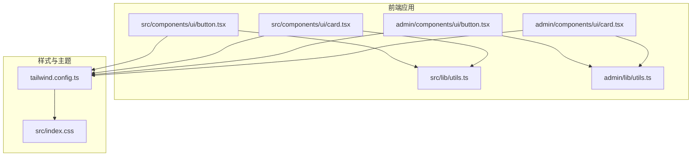
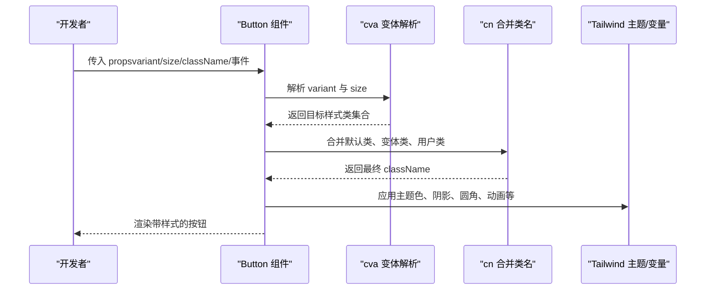
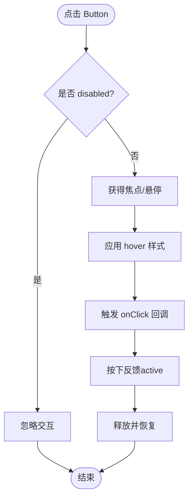
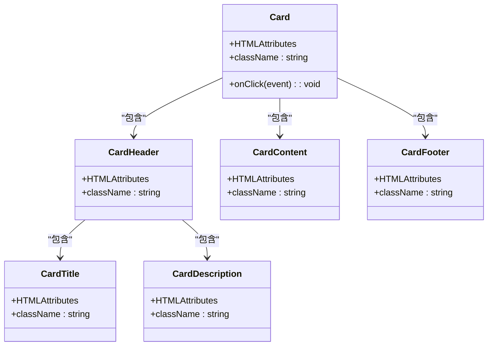
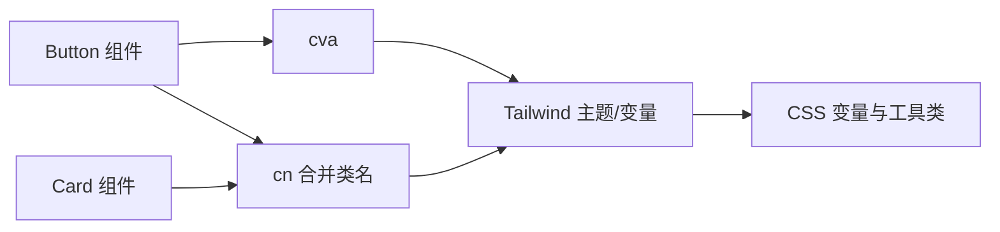

# 核心UI组件

<cite>
**本文引用的文件**
- [src/components/ui/button.tsx](file://src/components/ui/button.tsx)
- [src/components/ui/card.tsx](file://src/components/ui/card.tsx)
- [admin/components/ui/button.tsx](file://admin/components/ui/button.tsx)
- [admin/components/ui/card.tsx](file://admin/components/ui/card.tsx)
- [src/lib/utils.ts](file://src/lib/utils.ts)
- [admin/lib/utils.ts](file://admin/lib/utils.ts)
- [tailwind.config.ts](file://tailwind.config.ts)
- [src/index.css](file://src/index.css)
- [admin/pages/Cities.tsx](file://admin/pages/Cities.tsx)
- [admin/pages/ReviewQueue.tsx](file://admin/pages/ReviewQueue.tsx)
- [admin/pages/Dashboard.tsx](file://admin/pages/Dashboard.tsx)
</cite>

## 目录
1. [简介](#简介)
2. [项目结构](#项目结构)
3. [核心组件](#核心组件)
4. [架构总览](#架构总览)
5. [组件详解](#组件详解)
6. [依赖关系分析](#依赖关系分析)
7. [性能与可用性](#性能与可用性)
8. [故障排查指南](#故障排查指南)
9. [结论](#结论)
10. [附录：API 参考](#附录api-参考)

## 简介
本文件聚焦于项目中的核心UI组件：Button（按钮）与 Card（卡片）。我们将从设计理念、实现细节、属性配置、样式定制、事件处理、可访问性与响应式支持等方面进行系统化说明，并提供API参考、使用示例与最佳实践，帮助你在不同页面与场景中一致、可靠地复用这些组件。

## 项目结构
Button 与 Card 组件在两个子应用中分别实现，共享统一的样式体系与工具函数，保证跨模块一致性。

图表来源
- [src/components/ui/button.tsx:1-51](file://src/components/ui/button.tsx#L1-L51)
- [src/components/ui/card.tsx:1-78](file://src/components/ui/card.tsx#L1-L78)
- [admin/components/ui/button.tsx:1-43](file://admin/components/ui/button.tsx#L1-L43)
- [admin/components/ui/card.tsx:1-47](file://admin/components/ui/card.tsx#L1-L47)
- [src/lib/utils.ts:1-6](file://src/lib/utils.ts#L1-L6)
- [admin/lib/utils.ts:1-7](file://admin/lib/utils.ts#L1-L7)
- [tailwind.config.ts:1-139](file://tailwind.config.ts#L1-L139)
- [src/index.css:50-175](file://src/index.css#L50-L175)

章节来源
- [src/components/ui/button.tsx:1-51](file://src/components/ui/button.tsx#L1-L51)
- [src/components/ui/card.tsx:1-78](file://src/components/ui/card.tsx#L1-L78)
- [admin/components/ui/button.tsx:1-43](file://admin/components/ui/button.tsx#L1-L43)
- [admin/components/ui/card.tsx:1-47](file://admin/components/ui/card.tsx#L1-L47)
- [src/lib/utils.ts:1-6](file://src/lib/utils.ts#L1-L6)
- [admin/lib/utils.ts:1-7](file://admin/lib/utils.ts#L1-L7)
- [tailwind.config.ts:1-139](file://tailwind.config.ts#L1-L139)
- [src/index.css:50-175](file://src/index.css#L50-L175)

## 核心组件
- Button：基于变体与尺寸的可复用交互元素，支持多种视觉风格与交互反馈。
- Card：容器型布局组件，包含头部、标题、描述、内容区与底部等语义化子组件，便于快速搭建信息区块。

章节来源
- [src/components/ui/button.tsx:34-51](file://src/components/ui/button.tsx#L34-L51)
- [src/components/ui/card.tsx:4-78](file://src/components/ui/card.tsx#L4-L78)

## 架构总览
组件通过 class-variance-authority（cva）定义变体与尺寸，结合 Tailwind CSS 的原子化样式与自定义CSS变量，形成一致的外观与交互体验。工具函数 cn 负责合并与去重类名，确保最终渲染结果稳定。

图表来源
- [src/components/ui/button.tsx:5-32](file://src/components/ui/button.tsx#L5-L32)
- [src/lib/utils.ts:4-6](file://src/lib/utils.ts#L4-L6)
- [tailwind.config.ts:24-94](file://tailwind.config.ts#L24-L94)

## 组件详解

### Button 按钮组件
- 设计理念
  - 通过变体（variant）与尺寸（size）解耦视觉风格与布局，降低重复样式代码。
  - 使用过渡与交互反馈（如 hover、focus、active），提升可用性与感知。
  - 支持渐变背景与阴影等装饰性样式，满足品牌化需求。
- 实现要点
  - 使用 cva 定义变体与尺寸映射，结合默认变体与尺寸，确保零配置可用。
  - 通过 forwardRef 暴露原生 button 的 DOM 引用，兼容受控表单与无障碍属性。
  - 使用 cn 合并类名，避免冲突并支持用户自定义覆盖。
- 属性配置
  - 继承原生 button 的所有属性（如 onClick、disabled、type 等）。
  - 扩展属性：variant（字符串）、size（字符串）。
  - 默认值：variant="default"、size="default"。
- 样式定制
  - 通过 variant 控制主色、边框、悬停效果与特殊装饰（如 gradient-hero、shadow-glow）。
  - 通过 size 控制高度、内边距、字号与图标尺寸。
  - 可叠加 className 进行局部微调。
- 事件处理
  - 支持 onClick、onFocus、onBlur 等原生事件回调。
  - 保持 disabled 状态下的交互禁用与视觉降权。
- 可访问性
  - 内置焦点可见性样式（focus-visible），确保键盘可达。
  - 保持原生 button 的语义与行为。
- 响应式设计
  - 尺寸变体适配移动端与桌面端；配合容器布局实现自适应。
- 使用示例
  - 在管理端页面中，Button 被广泛用于对话框确认、发布流程、导航返回等场景。
  - 示例路径：[admin/pages/Cities.tsx:243-245](file://admin/pages/Cities.tsx#L243-L245)、[admin/pages/ReviewQueue.tsx:535-543](file://admin/pages/ReviewQueue.tsx#L535-L543)、[admin/pages/Dashboard.tsx:91-93](file://admin/pages/Dashboard.tsx#L91-L93)。

图表来源
- [src/components/ui/button.tsx:5-32](file://src/components/ui/button.tsx#L5-L32)

章节来源
- [src/components/ui/button.tsx:1-51](file://src/components/ui/button.tsx#L1-L51)
- [admin/components/ui/button.tsx:1-43](file://admin/components/ui/button.tsx#L1-L43)
- [admin/pages/Cities.tsx:243-245](file://admin/pages/Cities.tsx#L243-L245)
- [admin/pages/ReviewQueue.tsx:535-543](file://admin/pages/ReviewQueue.tsx#L535-L543)
- [admin/pages/Dashboard.tsx:91-93](file://admin/pages/Dashboard.tsx#L91-L93)

### Card 卡片组件
- 设计理念
  - 以语义化子组件（Header、Title、Description、Content、Footer）组织卡片结构，便于组合与扩展。
  - 提供统一的圆角、边框、阴影与过渡，营造层级感与呼吸感。
- 实现要点
  - 通过 forwardRef 暴露 div 引用，支持 className 透传与事件冒泡控制。
  - 子组件按需导出，便于按需引入，减少打包体积。
- 属性配置
  - 继承原生 div 的所有属性（如 onClick、className 等）。
  - 默认提供统一的容器样式与 hover 效果。
- 样式定制
  - 通过 className 叠加布局与间距类，实现复杂布局。
  - 结合主题变量与 Tailwind 工具类，实现品牌化与暗色模式适配。
- 事件处理
  - 支持 onClick 等事件，内部内容点击可通过事件冒泡控制。
- 可访问性
  - 作为静态容器，不强制语义角色；若需要更强语义，可在上层包裹合适的语义标签。
- 响应式设计
  - 通过网格与容器布局在不同屏幕尺寸下自适应展示。
- 使用示例
  - 在仪表盘中，Card 用于统计卡片、状态提示与列表项容器。
  - 示例路径：[admin/pages/Dashboard.tsx:34-38](file://admin/pages/Dashboard.tsx#L34-L38)、[admin/pages/Dashboard.tsx:66-76](file://admin/pages/Dashboard.tsx#L66-L76)、[admin/pages/ReviewQueue.tsx:572-580](file://admin/pages/ReviewQueue.tsx#L572-L580)。

图表来源
- [src/components/ui/card.tsx:4-78](file://src/components/ui/card.tsx#L4-L78)

章节来源
- [src/components/ui/card.tsx:1-78](file://src/components/ui/card.tsx#L1-L78)
- [admin/components/ui/card.tsx:1-47](file://admin/components/ui/card.tsx#L1-L47)
- [admin/pages/Dashboard.tsx:34-38](file://admin/pages/Dashboard.tsx#L34-L38)
- [admin/pages/Dashboard.tsx:66-76](file://admin/pages/Dashboard.tsx#L66-L76)
- [admin/pages/ReviewQueue.tsx:572-580](file://admin/pages/ReviewQueue.tsx#L572-L580)

## 依赖关系分析
- 组件依赖
  - Button 与 Card 均依赖 cva 进行变体/尺寸解析，依赖 cn 合并类名。
  - 主题与变量由 Tailwind 配置与 CSS 变量共同提供。
- 外部依赖
  - class-variance-authority：变体系统。
  - clsx 与 tailwind-merge：类名合并与冲突修复。
  - Tailwind CSS：原子化样式与动画。
- 潜在风险
  - 不同子应用的 Button/ Card 变体略有差异，需在升级时对齐。
  - 自定义 className 叠加顺序影响最终样式，需遵循“先默认、后变体、再自定义”的原则。

图表来源
- [src/components/ui/button.tsx:2-3](file://src/components/ui/button.tsx#L2-L3)
- [src/components/ui/card.tsx](file://src/components/ui/card.tsx#L2)
- [src/lib/utils.ts:4-6](file://src/lib/utils.ts#L4-L6)
- [tailwind.config.ts:24-94](file://tailwind.config.ts#L24-L94)
- [src/index.css:50-175](file://src/index.css#L50-L175)

章节来源
- [src/components/ui/button.tsx:1-51](file://src/components/ui/button.tsx#L1-L51)
- [src/components/ui/card.tsx:1-78](file://src/components/ui/card.tsx#L1-L78)
- [src/lib/utils.ts:1-6](file://src/lib/utils.ts#L1-L6)
- [tailwind.config.ts:1-139](file://tailwind.config.ts#L1-L139)
- [src/index.css:50-175](file://src/index.css#L50-L175)

## 性能与可用性
- 性能
  - 使用原子化样式与变体系统，避免运行时样式计算开销。
  - 合理拆分子组件，按需引入，减少不必要的渲染与打包体积。
- 可用性
  - 内置焦点可见性与过渡动画，改善交互反馈。
  - 通过尺寸变体适配不同输入设备与屏幕密度。
- 可访问性
  - Button 保持原生语义与键盘可达；建议在复杂交互中补充 aria-label 或 role。
  - Card 作为容器，建议在需要强调区域语义时，为其包裹适当的语义标签或添加 aria-labelledby。

## 故障排查指南
- 样式未生效
  - 检查 className 叠加顺序与 Tailwind 配置是否正确。
  - 确认主题变量与 CSS 变量已在全局生效。
- 变体/尺寸无效
  - 确认传入的 variant/size 是否在定义范围内。
  - 检查是否存在自定义 className 覆盖了变体类。
- 交互异常
  - 确认 disabled 状态不会阻止必要的事件冒泡。
  - 检查 onClick 等事件是否被上层容器拦截。

章节来源
- [src/lib/utils.ts:4-6](file://src/lib/utils.ts#L4-L6)
- [admin/lib/utils.ts:4-6](file://admin/lib/utils.ts#L4-L6)
- [tailwind.config.ts:24-94](file://tailwind.config.ts#L24-L94)
- [src/index.css:50-175](file://src/index.css#L50-L175)

## 结论
Button 与 Card 通过统一的变体系统、样式策略与工具函数，实现了高内聚、低耦合且易于扩展的UI基础能力。它们在多个页面中被广泛复用，既保证了一致性，也提升了开发效率。建议在后续迭代中保持变体与尺寸的收敛，并持续完善可访问性与暗色模式支持。

## 附录：API 参考

### Button API
- 继承原生 button 属性
  - type、disabled、onClick、aria-*、form* 等
- 扩展属性
  - variant: 字符串（可选值见下表）
  - size: 字符串（可选值见下表）
- 默认值
  - variant: default
  - size: default
- 可选值
  - variant: default、destructive、outline、secondary、ghost、link、coral、warm
  - size: default、sm、lg、xl、icon
- 最佳实践
  - 优先使用 outline/secondary 表示次要操作；destructive 仅用于危险操作。
  - 图标按钮使用 icon 尺寸，确保视觉平衡。
  - 在表单中明确设置 type（如 submit/reset）。

章节来源
- [src/components/ui/button.tsx:34-51](file://src/components/ui/button.tsx#L34-L51)
- [admin/components/ui/button.tsx:31-33](file://admin/components/ui/button.tsx#L31-L33)

### Card API
- 继承原生 div 属性
  - className、onClick、children 等
- 子组件
  - CardHeader、CardTitle、CardDescription、CardContent、CardFooter
- 最佳实践
  - 使用 CardHeader + CardTitle + CardDescription 组织卡片头部信息。
  - 在需要强调的卡片中，通过 className 添加边框与背景色。
  - 避免在 Card 内部直接写死固定宽高，保持内容自适应。

章节来源
- [src/components/ui/card.tsx:4-78](file://src/components/ui/card.tsx#L4-L78)
- [admin/components/ui/card.tsx:4-46](file://admin/components/ui/card.tsx#L4-L46)

### 使用示例与组合建议
- 与表单/对话框组合
  - 在表单提交、取消、删除等场景中，使用 Button 的 outline/ghost/secondary 变体与对应尺寸。
  - 示例路径：[admin/pages/Cities.tsx:243-245](file://admin/pages/Cities.tsx#L243-L245)、[admin/pages/ReviewQueue.tsx:535-543](file://admin/pages/ReviewQueue.tsx#L535-L543)
- 与布局/网格组合
  - 在 Dashboard 中，使用 Card 作为统计卡片容器，配合网格布局实现响应式展示。
  - 示例路径：[admin/pages/Dashboard.tsx:66-76](file://admin/pages/Dashboard.tsx#L66-L76)
- 与表格/列表组合
  - 在详情弹窗中，使用 Card 包裹表格对比区域，配合 Button 提供关闭与操作入口。
  - 示例路径：[admin/pages/ReviewQueue.tsx:572-580](file://admin/pages/ReviewQueue.tsx#L572-L580)

章节来源
- [admin/pages/Cities.tsx:243-245](file://admin/pages/Cities.tsx#L243-L245)
- [admin/pages/ReviewQueue.tsx:535-543](file://admin/pages/ReviewQueue.tsx#L535-L543)
- [admin/pages/Dashboard.tsx:66-76](file://admin/pages/Dashboard.tsx#L66-L76)
- [admin/pages/ReviewQueue.tsx:572-580](file://admin/pages/ReviewQueue.tsx#L572-L580)