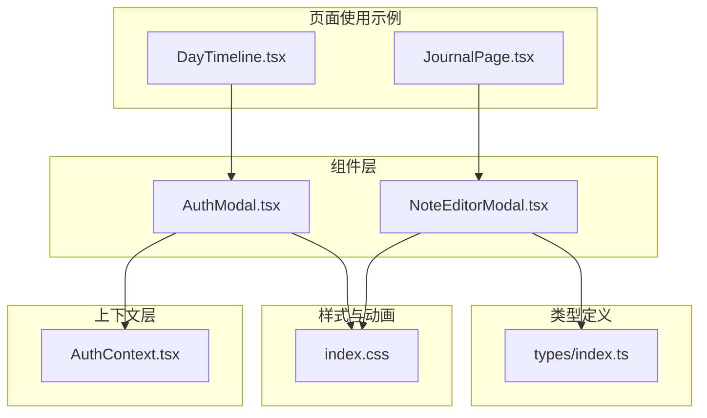
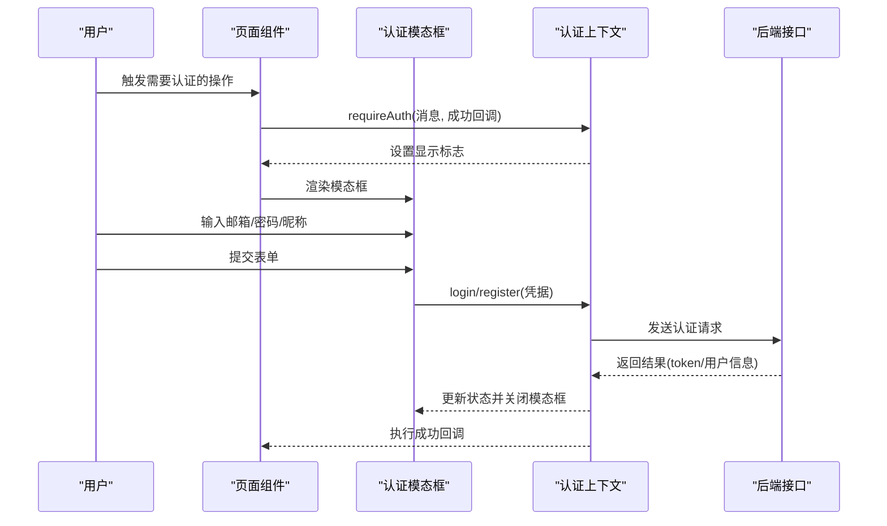
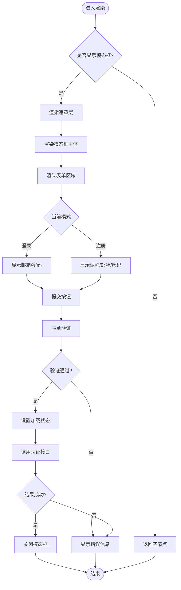
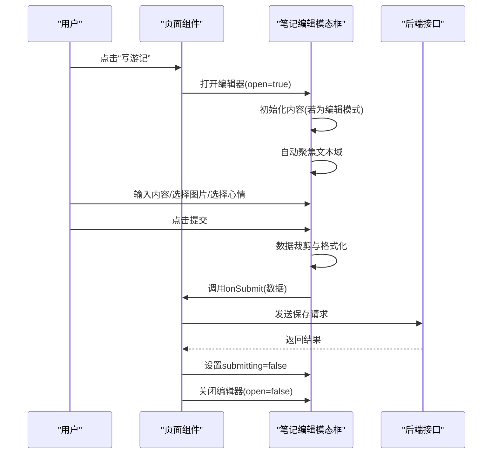
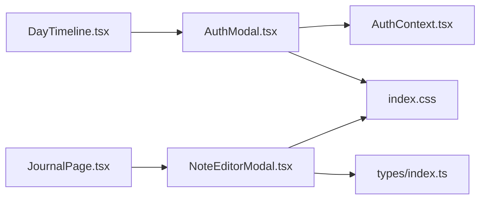

# 模态对话框组件

<cite>
**本文档引用的文件**
- [AuthModal.tsx](file://src/components/AuthModal.tsx)
- [NoteEditorModal.tsx](file://src/components/NoteEditorModal.tsx)
- [AuthContext.tsx](file://src/context/AuthContext.tsx)
- [index.ts](file://src/types/index.ts)
- [index.css](file://src/index.css)
- [DayTimeline.tsx](file://src/components/DayTimeline.tsx)
- [JournalPage.tsx](file://src/pages/JournalPage.tsx)
</cite>

## 目录
1. [简介](#简介)
2. [项目结构](#项目结构)
3. [核心组件](#核心组件)
4. [架构概览](#架构概览)
5. [详细组件分析](#详细组件分析)
6. [依赖关系分析](#依赖关系分析)
7. [性能考虑](#性能考虑)
8. [故障排除指南](#故障排除指南)
9. [结论](#结论)
10. [附录](#附录)

## 简介
本文件详细解析项目中的两个关键模态对话框组件：认证模态框（AuthModal）和笔记编辑模态框（NoteEditorModal）。文档涵盖组件的设计理念、实现细节、生命周期管理、遮罩层处理、焦点管理、表单验证、用户交互与状态同步、富文本编辑、内容保存与撤销机制、属性配置、事件回调、动画效果、键盘导航、屏幕阅读器支持、无障碍访问实现以及嵌套使用和层级管理策略。同时提供完整的使用示例和最佳实践建议。

## 项目结构
这两个模态框组件位于前端源码目录中，分别承担不同的业务职责：
- 认证模态框：负责用户登录/注册流程，通过全局认证上下文进行状态管理。
- 笔记编辑模态框：提供底部弹出式编辑器，用于微游记的创建与编辑。

**图表来源**
- [AuthModal.tsx:1-141](file://src/components/AuthModal.tsx#L1-L141)
- [NoteEditorModal.tsx:1-287](file://src/components/NoteEditorModal.tsx#L1-L287)
- [AuthContext.tsx:1-218](file://src/context/AuthContext.tsx#L1-L218)
- [index.ts:210-239](file://src/types/index.ts#L210-L239)
- [index.css:175-232](file://src/index.css#L175-L232)
- [DayTimeline.tsx:150-349](file://src/components/DayTimeline.tsx#L150-L349)
- [JournalPage.tsx:320-340](file://src/pages/JournalPage.tsx#L320-L340)

**章节来源**
- [AuthModal.tsx:1-141](file://src/components/AuthModal.tsx#L1-L141)
- [NoteEditorModal.tsx:1-287](file://src/components/NoteEditorModal.tsx#L1-L287)
- [AuthContext.tsx:1-218](file://src/context/AuthContext.tsx#L1-L218)
- [index.ts:210-239](file://src/types/index.ts#L210-L239)
- [index.css:175-232](file://src/index.css#L175-L232)
- [DayTimeline.tsx:150-349](file://src/components/DayTimeline.tsx#L150-L349)
- [JournalPage.tsx:320-340](file://src/pages/JournalPage.tsx#L320-L340)

## 核心组件
本节概述两个模态框的核心功能与设计目标：
- 认证模态框（AuthModal）
  - 职责：在用户需要登录或注册时弹出，提供邮箱、密码输入及昵称输入（注册模式），支持登录/注册切换。
  - 状态：由全局认证上下文驱动，包含显示控制、消息提示、回调函数等。
  - 表单验证：内置必填字段与最小密码长度校验；异步提交时显示加载状态与错误提示。
  - 交互：点击遮罩关闭、切换登录/注册模式、提交按钮禁用逻辑。
- 笔记编辑模态框（NoteEditorModal）
  - 职责：底部弹出式编辑器，支持微游记内容输入（字符限制）、图片上传（最多9张，base64存储）、心情表情选择、预填充POI信息、编辑/创建模式切换。
  - 状态：内部维护内容、图片列表、心情状态、表情面板开关等。
  - 交互：自动聚焦文本域、图片上传与移除、提交按钮禁用逻辑、提交时的数据裁剪与格式化。

**章节来源**
- [AuthModal.tsx:9-33](file://src/components/AuthModal.tsx#L9-L33)
- [NoteEditorModal.tsx:53-88](file://src/components/NoteEditorModal.tsx#L53-L88)

## 架构概览
两个模态框均采用“固定定位 + 遮罩层 + 动画”的通用模式，通过CSS类名实现统一的视觉与交互体验。认证模态框依赖全局认证上下文进行状态同步，笔记编辑模态框通过props接收外部状态与回调。

**图表来源**
- [AuthContext.tsx:128-141](file://src/context/AuthContext.tsx#L128-L141)
- [AuthModal.tsx:20-33](file://src/components/AuthModal.tsx#L20-L33)
- [AuthContext.tsx:78-121](file://src/context/AuthContext.tsx#L78-L121)

## 详细组件分析

### 认证模态框（AuthModal）分析
- 设计要点
  - 固定定位与遮罩层：使用绝对定位覆盖全屏，点击遮罩触发关闭。
  - 双模式切换：通过状态在登录与注册之间切换，动态渲染昵称输入框。
  - 表单验证：邮箱必填、密码必填且最小长度为6；注册模式下昵称必填。
  - 加载与错误处理：提交过程中禁用按钮并显示加载指示；失败时展示错误信息。
- 生命周期管理
  - 条件渲染：当上下文标记不显示时直接返回空节点，避免无意义渲染。
  - 关闭逻辑：点击遮罩或关闭按钮时清除消息与回调，恢复页面交互。
- 焦点管理
  - 通过上下文提供的关闭函数确保模态框关闭时焦点回到触发元素（通常由调用方负责）。
- 属性与事件
  - 属性：无（仅从上下文读取状态）。
  - 事件：表单提交、遮罩点击、切换模式按钮点击。
- 动画效果
  - 使用CSS类名实现淡入动画，提升用户体验。
- 键盘导航与无障碍
  - 当前实现未显式设置aria-*属性或tabIndex，建议补充aria-modal、aria-labelledby等以增强可访问性。
- 嵌套与层级
  - 使用高z-index确保模态框在所有页面元素之上显示，避免层级冲突。

**图表来源**
- [AuthModal.tsx:18-33](file://src/components/AuthModal.tsx#L18-L33)
- [AuthContext.tsx:139-141](file://src/context/AuthContext.tsx#L139-L141)

**章节来源**
- [AuthModal.tsx:9-141](file://src/components/AuthModal.tsx#L9-L141)
- [AuthContext.tsx:128-141](file://src/context/AuthContext.tsx#L128-L141)

### 笔记编辑模态框（NoteEditorModal）分析
- 设计要点
  - 底部弹出式设计：使用固定定位并从底部滑入，符合移动端交互习惯。
  - 内容限制：文本最大280字符，图片最多9张，超出部分自动忽略。
  - 图片处理：通过FileReader将图片转为base64数据URI，便于本地预览与提交。
  - 快捷工具：表情选择器、图片上传按钮、提交按钮，支持禁用状态。
- 生命周期管理
  - 条件渲染：当open为false时直接返回空节点。
  - 初始化：打开时根据editingNote决定初始化内容；关闭时清理状态。
  - 自动聚焦：打开后延迟聚焦文本域，提升输入体验。
- 焦点管理
  - 通过ref在打开时主动聚焦文本域；关闭时焦点应回到触发元素（由调用方负责）。
- 属性与事件
  - 属性：open、onClose、onSubmit、poiName、poiType、dayNumber、editingNote、submitting。
  - 事件：图片上传、表情选择、提交、关闭。
- 动画效果
  - 使用slide-up与fade-in动画，配合CSS关键帧实现流畅过渡。
- 键盘导航与无障碍
  - 文本域具备原生可访问性；建议为按钮添加aria-label或title以增强可读性。
- 嵌套与层级
  - 使用z-index确保模态框在页面其他元素之上显示，避免被覆盖。

**图表来源**
- [NoteEditorModal.tsx:70-88](file://src/components/NoteEditorModal.tsx#L70-L88)
- [NoteEditorModal.tsx:118-126](file://src/components/NoteEditorModal.tsx#L118-L126)
- [DayTimeline.tsx:172-204](file://src/components/DayTimeline.tsx#L172-L204)

**章节来源**
- [NoteEditorModal.tsx:1-287](file://src/components/NoteEditorModal.tsx#L1-L287)
- [DayTimeline.tsx:172-204](file://src/components/DayTimeline.tsx#L172-L204)

## 依赖关系分析
- 认证模态框依赖认证上下文提供状态与方法，实现与页面的解耦。
- 笔记编辑模态框依赖类型定义（NoteMood、MicroNote）保证数据结构一致性。
- 两者均依赖全局样式与动画类名，确保视觉风格统一。

**图表来源**
- [AuthModal.tsx:6-10](file://src/components/AuthModal.tsx#L6-L10)
- [NoteEditorModal.tsx:12-13](file://src/components/NoteEditorModal.tsx#L12-L13)
- [index.ts:212-238](file://src/types/index.ts#L212-L238)
- [index.css:205-232](file://src/index.css#L205-L232)
- [DayTimeline.tsx:154-158](file://src/components/DayTimeline.tsx#L154-L158)
- [JournalPage.tsx:327-336](file://src/pages/JournalPage.tsx#L327-L336)

**章节来源**
- [AuthModal.tsx:6-10](file://src/components/AuthModal.tsx#L6-L10)
- [NoteEditorModal.tsx:12-13](file://src/components/NoteEditorModal.tsx#L12-L13)
- [index.ts:212-238](file://src/types/index.ts#L212-L238)
- [index.css:205-232](file://src/index.css#L205-L232)
- [DayTimeline.tsx:154-158](file://src/components/DayTimeline.tsx#L154-L158)
- [JournalPage.tsx:327-336](file://src/pages/JournalPage.tsx#L327-L336)

## 性能考虑
- 渲染优化
  - 条件渲染：在不显示时直接返回空节点，减少DOM树深度与重绘。
  - 图片处理：base64存储适合小图预览，但会增加内存占用；建议对大图进行压缩或分页加载。
- 交互优化
  - 提交按钮禁用：在提交过程中禁用按钮，避免重复提交。
  - 加载指示：异步操作时显示加载状态，提升用户感知。
- 动画性能
  - 使用transform与opacity动画，避免触发布局与重排。
- 网络优化
  - 认证与笔记提交使用异步请求，建议结合缓存与错误重试策略。

## 故障排除指南
- 认证失败
  - 检查网络请求是否成功返回token与用户信息；确认本地存储键值正确。
  - 若回调未执行，检查上下文中回调函数是否正确传递与调用。
- 提交失败
  - 笔记编辑提交时需确保内容非空且未超过字符限制；检查API响应与错误信息。
- 焦点问题
  - 模态框关闭后焦点应回到触发元素；若出现焦点丢失，检查调用方的焦点管理逻辑。
- 动画异常
  - 确认CSS类名与关键帧定义正确；检查z-index层级是否被其他元素覆盖。

**章节来源**
- [AuthContext.tsx:78-121](file://src/context/AuthContext.tsx#L78-L121)
- [NoteEditorModal.tsx:118-126](file://src/components/NoteEditorModal.tsx#L118-L126)

## 结论
AuthModal与NoteEditorModal通过清晰的职责划分与统一的UI/UX设计，为用户提供可靠的认证与内容编辑能力。前者通过全局上下文实现状态共享与回调同步，后者通过严格的输入限制与便捷的工具栏提升创作效率。建议在现有基础上进一步完善无障碍访问与焦点管理，以提升整体用户体验。

## 附录
- 使用示例路径
  - 认证模态框：在需要认证的页面中调用requireAuth，并在成功后执行回调。
    - 示例参考：[DayTimeline.tsx:154-158](file://src/components/DayTimeline.tsx#L154-L158)
  - 笔记编辑模态框：在页面中渲染并传入必要的props，处理提交与关闭逻辑。
    - 示例参考：[JournalPage.tsx:327-336](file://src/pages/JournalPage.tsx#L327-L336)
- 最佳实践
  - 认证模态框：保持消息简洁明确，提供清晰的错误提示；在提交后及时关闭并执行回调。
  - 笔记编辑模态框：严格遵守字符与图片数量限制；提供实时字符计数与预览；在提交完成后清理状态并关闭。