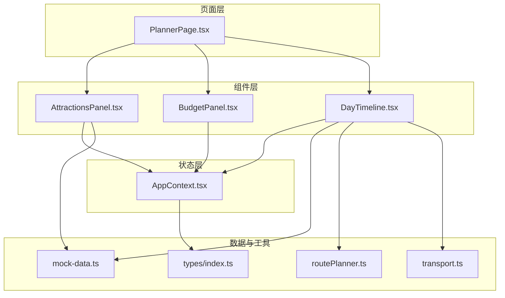
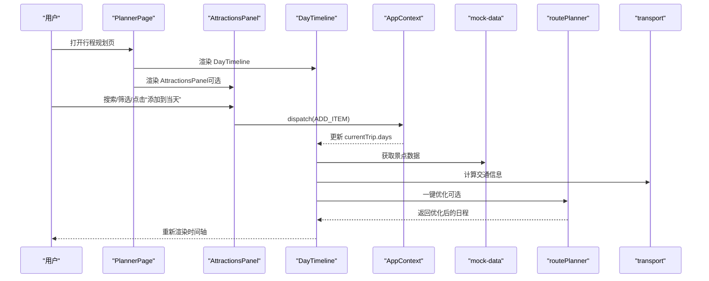
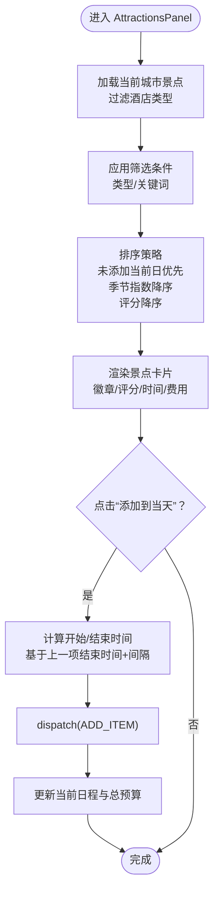
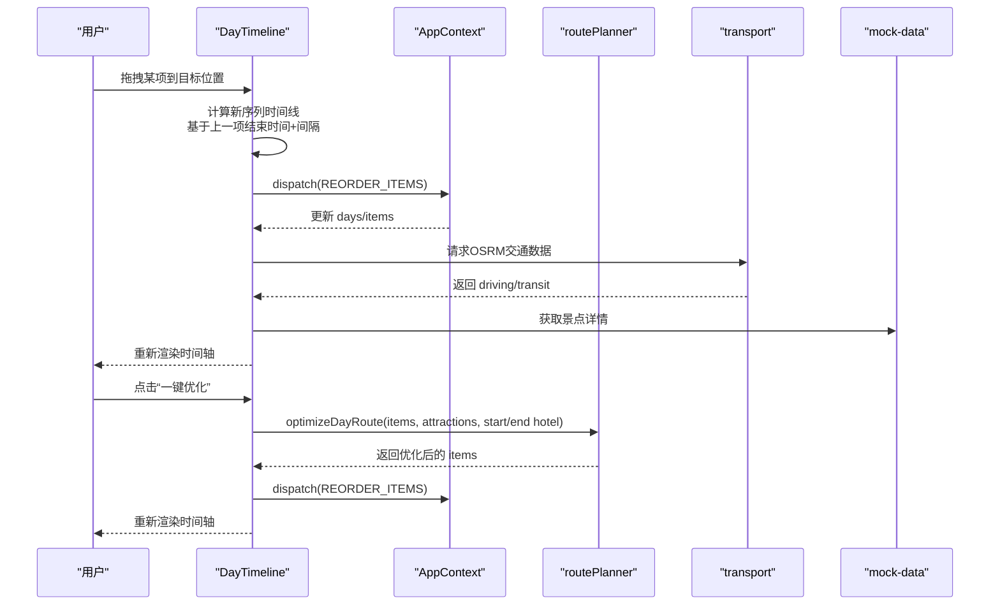
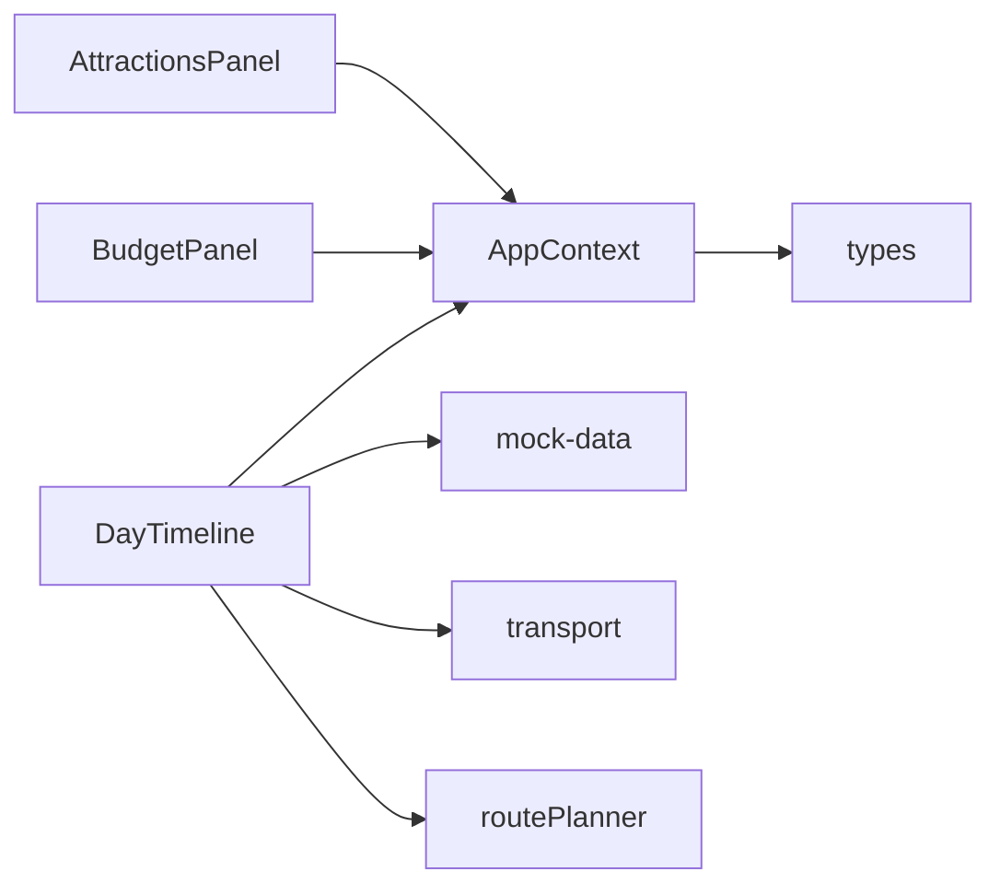

# 行程规划组件

<cite>
**本文引用的文件**
- [AttractionsPanel.tsx](file://src/components/AttractionsPanel.tsx)
- [BudgetPanel.tsx](file://src/components/BudgetPanel.tsx)
- [DayTimeline.tsx](file://src/components/DayTimeline.tsx)
- [PlannerPage.tsx](file://src/pages/PlannerPage.tsx)
- [AppContext.tsx](file://src/context/AppContext.tsx)
- [mock-data.ts](file://src/data/mock-data.ts)
- [routePlanner.ts](file://src/utils/routePlanner.ts)
- [transport.ts](file://src/utils/transport.ts)
- [button.tsx](file://src/components/ui/button.tsx)
- [card.tsx](file://src/components/ui/card.tsx)
- [index.ts](file://src/types/index.ts)
</cite>

## 目录
1. [简介](#简介)
2. [项目结构](#项目结构)
3. [核心组件](#核心组件)
4. [架构总览](#架构总览)
5. [详细组件分析](#详细组件分析)
6. [依赖关系分析](#依赖关系分析)
7. [性能考量](#性能考量)
8. [故障排查指南](#故障排查指南)
9. [结论](#结论)
10. [附录](#附录)

## 简介
本文件系统化梳理“行程规划”相关组件，重点覆盖以下三个核心组件：
- 景点面板（AttractionsPanel）：负责景点数据展示、筛选与排序，并支持一键添加到当前日期行程。
- 预算面板（BudgetPanel）：负责预算概览、分类统计与每日明细，提供预算使用进度可视化。
- 时间线组件（DayTimeline）：负责单日行程的时间轴渲染、拖拽重排、插入景点、地图展示、酒店推荐与微游记集成。

同时，文档阐述组件间通信机制（AppContext 状态机）、事件处理流程、样式与交互定制方案，并给出实际使用示例与扩展建议。

## 项目结构
- 组件层：位于 src/components，包含 AttractionsPanel、BudgetPanel、DayTimeline 等。
- 页面层：PlannerPage 负责组织三大组件与导航控制。
- 状态层：AppContext 提供全局状态与派发动作。
- 数据与工具：mock-data 提供城市与景点数据；transport 提供交通估算；routePlanner 提供智能排程算法。
- 类型定义：types/index.ts 定义行程、日程、POI 等类型。

图表来源
- [PlannerPage.tsx:15-388](file://src/pages/PlannerPage.tsx#L15-L388)
- [AttractionsPanel.tsx:23-298](file://src/components/AttractionsPanel.tsx#L23-L298)
- [BudgetPanel.tsx:5-134](file://src/components/BudgetPanel.tsx#L5-L134)
- [DayTimeline.tsx:49-979](file://src/components/DayTimeline.tsx#L49-L979)
- [AppContext.tsx:83-213](file://src/context/AppContext.tsx#L83-L213)
- [mock-data.ts:720-792](file://src/data/mock-data.ts#L720-L792)
- [routePlanner.ts:652-671](file://src/utils/routePlanner.ts#L652-L671)
- [transport.ts:142-162](file://src/utils/transport.ts#L142-L162)
- [index.ts:77-134](file://src/types/index.ts#L77-L134)

章节来源
- [PlannerPage.tsx:15-388](file://src/pages/PlannerPage.tsx#L15-L388)

## 核心组件
- AttractionsPanel：提供按类型过滤、关键词搜索、按热度/是否已添加/评分排序的景点列表，支持一键添加到当前日程。
- BudgetPanel：展示总预算、日均预算、预算使用百分比、分类支出与每日明细，便于实时掌控开销。
- DayTimeline：渲染单日完整时间轴，支持拖拽重排、插入景点、地图展示、酒店推荐与微游记。

章节来源
- [AttractionsPanel.tsx:23-298](file://src/components/AttractionsPanel.tsx#L23-L298)
- [BudgetPanel.tsx:5-134](file://src/components/BudgetPanel.tsx#L5-L134)
- [DayTimeline.tsx:49-979](file://src/components/DayTimeline.tsx#L49-L979)

## 架构总览
组件通过 AppContext 的 useApp 钩子访问全局状态 state 与派发器 dispatch，实现跨组件的状态同步与事件驱动更新。PlannerPage 作为容器页面协调 AttractionsPanel、BudgetPanel 与 DayTimeline 的显示与交互。

图表来源
- [PlannerPage.tsx:247-286](file://src/pages/PlannerPage.tsx#L247-L286)
- [AttractionsPanel.tsx:80-113](file://src/components/AttractionsPanel.tsx#L80-L113)
- [AppContext.tsx:101-111](file://src/context/AppContext.tsx#L101-L111)
- [DayTimeline.tsx:221-241](file://src/components/DayTimeline.tsx#L221-L241)
- [routePlanner.ts:652-671](file://src/utils/routePlanner.ts#L652-L671)
- [transport.ts:142-162](file://src/utils/transport.ts#L142-L162)
- [mock-data.ts:776-792](file://src/data/mock-data.ts#L776-L792)

## 详细组件分析

### 景点面板 AttractionsPanel
- 功能特性
  - 数据来源：根据当前行程城市加载景点集合，排除酒店类型。
  - 筛选与排序：按类型过滤、关键词搜索；排序规则优先级为“是否已添加当前日”→“季节指数降序”→“评分降序”。
  - 添加到日程：基于当前日程末项结束时间推算下一个开始时间，自动计算结束时间，确保不越界。
  - 状态提示：已添加当前日、已添加其他日的视觉区分。
  - 类型徽章与评分展示：按类型动态设置徽章样式，显示评分与季节指数。
- 关键实现要点
  - 使用 useMemo 缓存景点列表、已用 ID 集合与过滤结果，减少重复计算。
  - 通过 AppContext 的 dispatch 发送 ADD_ITEM 动作，更新当前日程项数组与总预算。
  - 支持“已添加当前日”的禁用按钮与文案切换。
- 交互与样式
  - 使用 lucide-react 图标与自定义徽章组件（如 SeasonalBadge）增强信息密度。
  - 响应式布局适配移动端与桌面端，滚动区域与间距统一。

图表来源
- [AttractionsPanel.tsx:29-78](file://src/components/AttractionsPanel.tsx#L29-L78)
- [AttractionsPanel.tsx:80-113](file://src/components/AttractionsPanel.tsx#L80-L113)
- [AppContext.tsx:101-111](file://src/context/AppContext.tsx#L101-L111)

章节来源
- [AttractionsPanel.tsx:23-298](file://src/components/AttractionsPanel.tsx#L23-L298)
- [mock-data.ts:720-792](file://src/data/mock-data.ts#L720-L792)
- [AppContext.tsx:83-111](file://src/context/AppContext.tsx#L83-L111)

### 预算面板 BudgetPanel
- 功能特性
  - 预算概览：展示已规划总费用、日均费用与参考日均预算。
  - 预算使用进度：根据城市平均日预算计算占比，可视化进度条。
  - 分类统计：按景点、美食、住宿、体验、购物、交通分类汇总费用。
  - 每日明细：点击某日可切换到该日视图，显示当日活动数量与花费。
- 计算逻辑
  - 总预算：遍历所有日程项累加 cost。
  - 日均预算：总预算除以天数（若天数大于 0）。
  - 进度条：总预算与城市平均日预算×天数的比值，上限 100%。
- 交互与样式
  - 使用渐变色背景与图标增强可读性。
  - 每日明细项支持点击切换当前日。

图表来源
- [BudgetPanel.tsx:13-27](file://src/components/BudgetPanel.tsx#L13-L27)
- [BudgetPanel.tsx:89-103](file://src/components/BudgetPanel.tsx#L89-L103)
- [BudgetPanel.tsx:110-130](file://src/components/BudgetPanel.tsx#L110-L130)

章节来源
- [BudgetPanel.tsx:5-134](file://src/components/BudgetPanel.tsx#L5-L134)
- [mock-data.ts:6-6](file://src/data/mock-data.ts#L6-L6)

### 时间线组件 DayTimeline
- 功能特性
  - 时间轴渲染：以时间线形式展示当日酒店、POI、餐食与交通段。
  - 拖拽重排：支持拖拽交换顺序，自动重算时间窗口与相邻项间隔。
  - 插入景点：在任意两个项之间弹出可用景点列表进行插入。
  - 地图展示：可切换地图视图，标注 POI 与路线。
  - 酒店推荐：基于当日路线聚类中心推荐就近酒店。
  - 微游记：支持为 POI 写游记、查看与编辑，需登录态。
  - 一键优化：调用智能排程算法，综合考虑起点/终点、反向回溯惩罚、餐食地理与时间约束。
- 关键实现要点
  - 交通信息：先用启发式估算即时渲染，再异步请求真实 OSRM 数据替换。
  - 酒店卡片：支持查看详情、更换与移除，首日卡片显示“从昨晚酒店出发”，非首日显示“入住酒店”。
  - 餐食插槽：根据 POI 的 mealType 或标签推断早餐/午餐/晚餐/下午茶，插入时考虑地理与时间偏差。
  - 优化算法：greedy + 2-opt，结合起止酒店方向性惩罚，避免回溯。
- 交互与样式
  - 使用时间轴线与节点徽章标识类型与序号。
  - 悬停显示操作按钮，拖拽时高亮指示位。
  - 响应式布局，移动端支持底部操作栏与抽屉式面板。

图表来源
- [DayTimeline.tsx:244-277](file://src/components/DayTimeline.tsx#L244-L277)
- [DayTimeline.tsx:221-241](file://src/components/DayTimeline.tsx#L221-L241)
- [DayTimeline.tsx:98-124](file://src/components/DayTimeline.tsx#L98-L124)
- [AppContext.tsx:125-130](file://src/context/AppContext.tsx#L125-L130)
- [routePlanner.ts:652-671](file://src/utils/routePlanner.ts#L652-L671)
- [transport.ts:142-162](file://src/utils/transport.ts#L142-L162)
- [mock-data.ts:776-792](file://src/data/mock-data.ts#L776-L792)

章节来源
- [DayTimeline.tsx:49-979](file://src/components/DayTimeline.tsx#L49-L979)
- [routePlanner.ts:169-236](file://src/utils/routePlanner.ts#L169-L236)
- [transport.ts:142-162](file://src/utils/transport.ts#L142-L162)
- [mock-data.ts:720-792](file://src/data/mock-data.ts#L720-L792)

## 依赖关系分析
- 组件耦合
  - AttractionsPanel 与 AppContext 强耦合，通过 dispatch(ADD_ITEM) 更新行程。
  - DayTimeline 与 AppContext、mock-data、transport、routePlanner 强耦合，承担较多业务逻辑。
  - BudgetPanel 与 AppContext、mock-data 弱耦合，主要消费 state.currentTrip。
- 外部依赖
  - 交通估算依赖 transport 工具与 OSRM 后端代理。
  - 智能排程依赖 routePlanner 算法。
  - 类型定义来自 types/index.ts，保证数据结构一致性。

图表来源
- [AttractionsPanel.tsx:24-24](file://src/components/AttractionsPanel.tsx#L24-L24)
- [BudgetPanel.tsx:6-6](file://src/components/BudgetPanel.tsx#L6-L6)
- [DayTimeline.tsx:50-50](file://src/components/DayTimeline.tsx#L50-L50)
- [AppContext.tsx:215-233](file://src/context/AppContext.tsx#L215-L233)
- [mock-data.ts:720-792](file://src/data/mock-data.ts#L720-L792)
- [routePlanner.ts:652-671](file://src/utils/routePlanner.ts#L652-L671)
- [transport.ts:142-162](file://src/utils/transport.ts#L142-L162)
- [index.ts:77-134](file://src/types/index.ts#L77-L134)

章节来源
- [AppContext.tsx:83-213](file://src/context/AppContext.tsx#L83-L213)

## 性能考量
- 渲染优化
  - AttractionsPanel 使用 useMemo 缓存过滤与排序结果，避免每次渲染重复计算。
  - DayTimeline 对 POI 列表与酒店推荐使用 useMemo，减少不必要的重渲染。
- 计算优化
  - 预算面板按需计算分类汇总，避免在每次变更时全量重算。
  - 交通估算采用启发式预估先行，随后异步替换真实数据，提升首屏体验。
- 算法优化
  - routePlanner 的 greedy + 2-opt 在合理迭代次数内收敛，避免过度计算。
  - 一键优化增加小延迟以提供视觉反馈，避免频繁触发。

## 故障排查指南
- 景点面板无数据
  - 检查 state.currentTrip 是否存在，以及 cityId 是否正确。
  - 确认 mock-data 中是否存在对应城市的景点数据。
- 预算显示异常
  - 确认 state.currentTrip.days 存在且 items 包含 cost 字段。
  - 检查城市平均日预算数据是否存在。
- 时间线拖拽无效
  - 确认浏览器支持 HTML5 拖拽事件。
  - 检查 dispatch(REORDER_ITEMS) 是否被正确派发。
- 一键优化无响应
  - 确认 items 数量≥2，否则不启用优化。
  - 检查 routePlanner 返回的 items 是否合法。
- 交通信息缺失
  - 确认 OSRM 后端代理可用，且坐标格式正确（经度/纬度）。
  - 检查 waypoints 数组长度是否≥2。

章节来源
- [AttractionsPanel.tsx:29-32](file://src/components/AttractionsPanel.tsx#L29-L32)
- [BudgetPanel.tsx:13-27](file://src/components/BudgetPanel.tsx#L13-L27)
- [DayTimeline.tsx:244-277](file://src/components/DayTimeline.tsx#L244-L277)
- [DayTimeline.tsx:221-241](file://src/components/DayTimeline.tsx#L221-L241)
- [transport.ts:142-162](file://src/utils/transport.ts#L142-L162)

## 结论
AttractionsPanel、BudgetPanel 与 DayTimeline 共同构成行程规划的核心交互闭环：前者负责“发现与添加”，后者负责“预算与可视化”，中间件 DayTimeline 负责“时间轴与智能排程”。它们通过 AppContext 实现状态共享与事件驱动，配合 mock-data、transport 与 routePlanner 提供丰富的数据与算法支撑。整体设计清晰、职责明确，具备良好的可扩展性与可维护性。

## 附录

### 组件属性配置与事件处理
- AttractionsPanel
  - 属性：onClose（关闭侧边面板回调）
  - 事件：搜索框输入、类型切换、添加到当天按钮点击
  - 状态：searchQuery、filterType、usedAttractionIds、allUsedIds
- BudgetPanel
  - 属性：无
  - 事件：点击每日明细项切换当前日
  - 状态：依赖 AppContext.state.currentTrip
- DayTimeline
  - 属性：无
  - 事件：拖拽开始/进入/离开/放置、删除项、编辑备注、打开详情、一键优化、展开/收起地图、插入景点
  - 状态：dragIndex、dragOverIndex、editingId、editNotes、showMap、transitData、isOptimizing、insertIndex、showHotelRec、microNotes

章节来源
- [AttractionsPanel.tsx:9-11](file://src/components/AttractionsPanel.tsx#L9-L11)
- [BudgetPanel.tsx:5-8](file://src/components/BudgetPanel.tsx#L5-L8)
- [DayTimeline.tsx:49-73](file://src/components/DayTimeline.tsx#L49-L73)

### 样式定制选项
- 按钮组件（Button）
  - 变体：default、destructive、outline、secondary、ghost、link、coral、warm
  - 尺寸：default、sm、lg、xl、icon
- 卡片组件（Card）
  - 默认卡片样式，支持 hover 阴影变化
- 自定义徽章
  - 按类型设置不同徽章样式（如 badge-spot、badge-food、badge-hotel 等）

章节来源
- [button.tsx:5-32](file://src/components/ui/button.tsx#L5-L32)
- [card.tsx:4-16](file://src/components/ui/card.tsx#L4-L16)

### 实际使用示例与集成指南
- 在页面中引入 PlannerPage 并确保 AppProvider 包裹根组件，以便各组件通过 useApp 访问状态。
- 在 AttractionsPanel 中，通过 onClose 回调控制右侧面板显隐。
- 在 DayTimeline 中，一键优化按钮仅在 items 数量≥2 时启用。
- 在 BudgetPanel 中，每日明细项点击后通过 dispatch(SELECT_DAY) 切换当前日。

章节来源
- [PlannerPage.tsx:247-286](file://src/pages/PlannerPage.tsx#L247-L286)
- [DayTimeline.tsx:608-621](file://src/components/DayTimeline.tsx#L608-L621)
- [AppContext.tsx:98-99](file://src/context/AppContext.tsx#L98-L99)

### 可扩展性与自定义能力
- 新增类型支持：在 types/index.ts 中扩展 Attraction.type，并在 mock-data.ts 中补充类型标签与图标映射。
- 自定义排序规则：在 AttractionsPanel 的排序函数中加入新的权重因子。
- 预算分类扩展：在 BudgetPanel.categories 中新增分类项，或通过外部配置注入。
- 优化算法定制：在 routePlanner.ts 中调整贪心评分、2-opt 迭代次数或餐食插入策略。
- 交互行为扩展：在 DayTimeline 中新增插入点、操作按钮或微游记编辑器。

章节来源
- [index.ts:77-100](file://src/types/index.ts#L77-L100)
- [mock-data.ts:720-742](file://src/data/mock-data.ts#L720-L742)
- [routePlanner.ts:169-236](file://src/utils/routePlanner.ts#L169-L236)