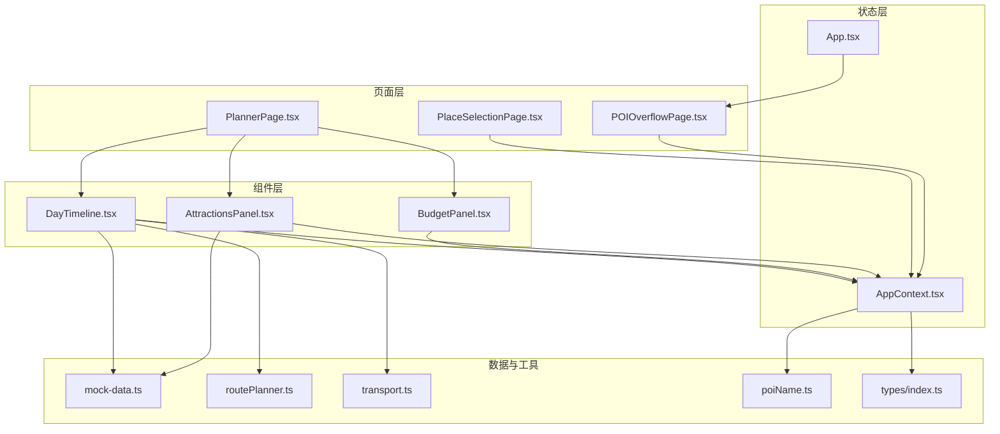
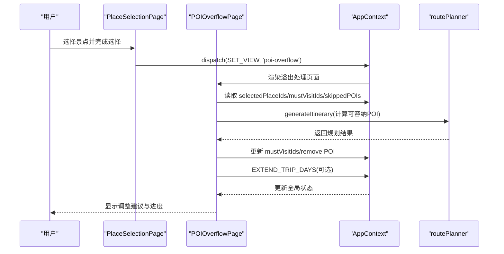
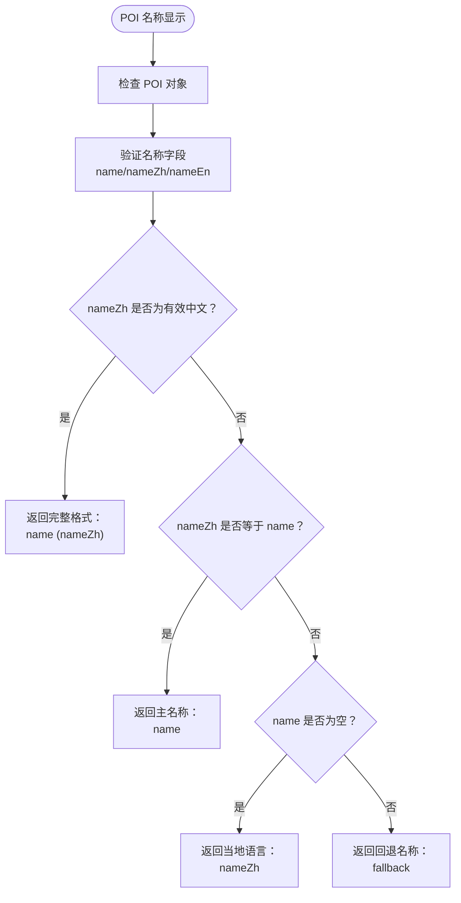
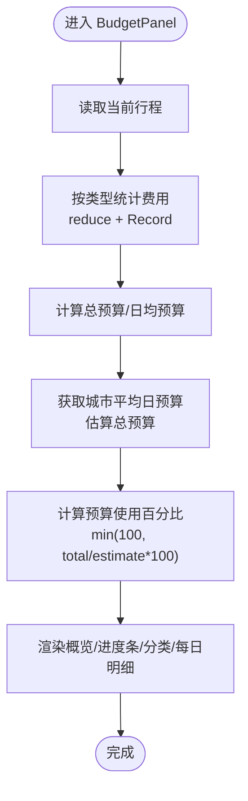
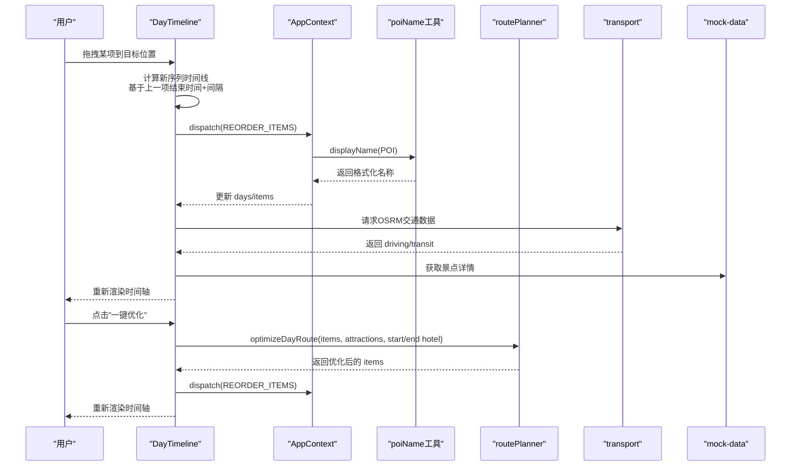
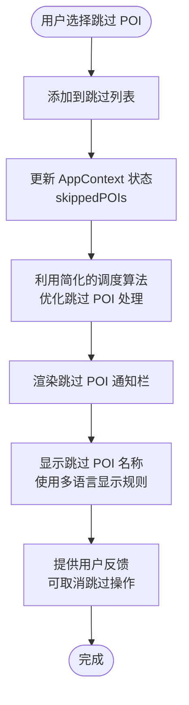
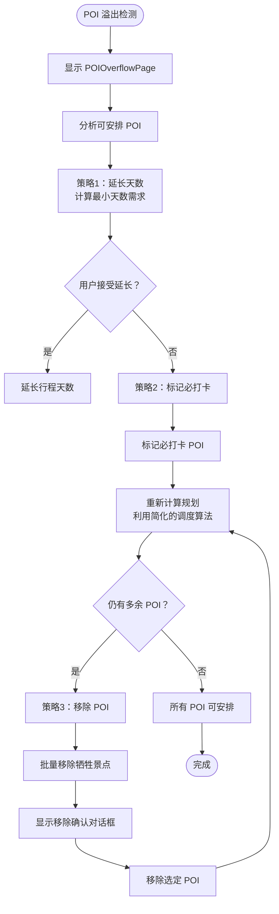
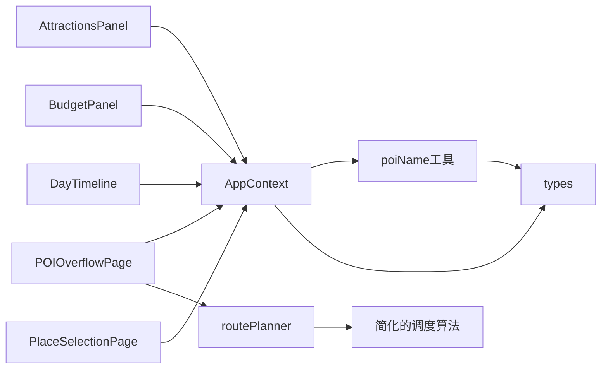

# 行程规划组件

<cite>
**本文引用的文件**
- [AttractionsPanel.tsx](file://src/components/AttractionsPanel.tsx)
- [BudgetPanel.tsx](file://src/components/BudgetPanel.tsx)
- [DayTimeline.tsx](file://src/components/DayTimeline.tsx)
- [PlannerPage.tsx](file://src/pages/PlannerPage.tsx)
- [POIOverflowPage.tsx](file://src/pages/POIOverflowPage.tsx)
- [PlaceSelectionPage.tsx](file://src/pages/PlaceSelectionPage.tsx)
- [AppContext.tsx](file://src/context/AppContext.tsx)
- [App.tsx](file://src/App.tsx)
- [mock-data.ts](file://src/data/mock-data.ts)
- [routePlanner.ts](file://src/utils/routePlanner.ts)
- [transport.ts](file://src/utils/transport.ts)
- [poiName.ts](file://src/utils/poiName.ts)
- [button.tsx](file://src/components/ui/button.tsx)
- [card.tsx](file://src/components/ui/card.tsx)
- [index.ts](file://src/types/index.ts)
</cite>

## 更新摘要
**所做更改**
- 新增 POIOverflowPage 智能溢出处理系统，替代之前的直接通知方法
- 实现三种智能调整策略：延长行程天数、标记必游景点、移除 POI 确认对话框
- 完善 POI 名称显示工具模块，改进多语言名称显示逻辑
- 更新跳过 POI 显示功能，增强用户界面反馈
- 完善 POI 名称规范化处理，支持中文、当地语言和英文的智能识别与展示
- **新增** 解决变量声明顺序导致的临时死区问题，优化状态管理逻辑
- **新增** 实现三层指导机制，提供更智能的行程调整建议
- **新增** 批量移除功能，支持一键剔除多个牺牲景点
- **更新** 调度算法重构对 POI 溢出处理的影响：底层调度算法简化后，POI 溢出处理更加高效，跳过 POI 功能得到增强

## 目录
1. [简介](#简介)
2. [项目结构](#项目结构)
3. [核心组件](#核心组件)
4. [架构总览](#架构总览)
5. [详细组件分析](#详细组件分析)
6. [POI 溢出处理系统](#poi-溢出处理系统)
7. [调度算法重构影响](#调度算法重构影响)
8. [依赖关系分析](#依赖关系分析)
9. [性能考量](#性能考量)
10. [故障排查指南](#故障排查指南)
11. [结论](#结论)
12. [附录](#附录)

## 简介
本文件系统化梳理"行程规划"相关组件，重点覆盖以下四个核心组件：
- 景点面板（AttractionsPanel）：负责景点数据展示、筛选与排序，并支持一键添加到当前日期行程。
- 预算面板（BudgetPanel）：负责预算概览、分类统计与每日明细，提供预算使用进度可视化。
- 时间线组件（DayTimeline）：负责单日行程的时间轴渲染、拖拽重排、插入景点、地图展示、酒店推荐与微游记集成。
- **新增** 溢出处理页面（POIOverflowPage）：智能处理 POI 选择超限问题，提供三种调整策略。

同时，文档阐述组件间通信机制（AppContext 状态机）、事件处理流程、样式与交互定制方案，并给出实际使用示例与扩展建议。

**更新** 新增 POIOverflowPage 智能溢出处理系统，替代了之前的直接通知方法，提供三种智能调整策略：延长行程天数、标记必游景点、移除 POI 确认对话框。新增 POI 名称显示工具模块，改进多语言名称显示逻辑，增强跳过 POI 的用户界面反馈。**新增** 解决变量声明顺序导致的临时死区问题，优化状态管理逻辑，实现三层指导机制和批量移除功能。**更新** 调度算法重构后，POI 溢出处理更加高效，跳过 POI 功能得到增强。

## 项目结构
- 组件层：位于 src/components，包含 AttractionsPanel、BudgetPanel、DayTimeline 等。
- 页面层：PlannerPage 负责组织三大组件与导航控制；**新增** POIOverflowPage 负责处理 POI 溢出问题；PlaceSelectionPage 负责景点选择与溢出触发。
- 状态层：AppContext 提供全局状态与派发动作。
- 数据与工具：mock-data 提供城市与景点数据；transport 提供交通估算；routePlanner 提供智能排程算法；poiName 提供 POI 名称显示工具。
- 类型定义：types/index.ts 定义行程、日程、POI 等类型。



**图表来源**
- [PlannerPage.tsx:15-388](file://src/pages/PlannerPage.tsx#L15-L388)
- [POIOverflowPage.tsx:21-580](file://src/pages/POIOverflowPage.tsx#L21-L580)
- [PlaceSelectionPage.tsx:246-250](file://src/pages/PlaceSelectionPage.tsx#L246-L250)
- [AttractionsPanel.tsx:23-298](file://src/components/AttractionsPanel.tsx#L23-L298)
- [BudgetPanel.tsx:5-134](file://src/components/BudgetPanel.tsx#L5-L134)
- [DayTimeline.tsx:49-979](file://src/components/DayTimeline.tsx#L49-L979)
- [AppContext.tsx:83-213](file://src/context/AppContext.tsx#L83-L213)
- [App.tsx:8-32](file://src/App.tsx#L8-L32)
- [mock-data.ts:720-792](file://src/data/mock-data.ts#L720-L792)
- [routePlanner.ts:652-671](file://src/utils/routePlanner.ts#L652-L671)
- [transport.ts:142-162](file://src/utils/transport.ts#L142-L162)
- [poiName.ts:1-38](file://src/utils/poiName.ts#L1-L38)
- [index.ts:77-134](file://src/types/index.ts#L77-L134)

**章节来源**
- [PlannerPage.tsx:15-388](file://src/pages/PlannerPage.tsx#L15-L388)
- [POIOverflowPage.tsx:21-580](file://src/pages/POIOverflowPage.tsx#L21-L580)
- [PlaceSelectionPage.tsx:246-250](file://src/pages/PlaceSelectionPage.tsx#L246-L250)

## 核心组件
- AttractionsPanel：提供按类型过滤、关键词搜索、按热度/是否已添加/评分排序的景点列表，支持一键添加到当前日程。
- BudgetPanel：展示总预算、日均预算、预算使用百分比、分类支出与每日明细，便于实时掌控开销。
- DayTimeline：渲染单日完整时间轴，支持拖拽重排、插入景点、地图展示、酒店推荐与微游记集成。
- **新增** POIOverflowPage：智能处理 POI 选择超限问题，提供三种调整策略的可视化界面。

**更新** 新增 POIOverflowPage 智能溢出处理系统，替代了之前的直接通知方法，提供三种智能调整策略：延长行程天数、标记必游景点、移除 POI 确认对话框。新增 POI 名称显示工具模块，改进多语言名称显示逻辑，增强跳过 POI 的用户界面反馈。**新增** 解决变量声明顺序导致的临时死区问题，优化状态管理逻辑，实现三层指导机制和批量移除功能。**更新** 调度算法重构后，POI 溢出处理更加高效，跳过 POI 功能得到增强。

## 架构总览
组件通过 AppContext 的 useApp 钩子访问全局状态 state 与派发器 dispatch，实现跨组件的状态同步与事件驱动更新。PlannerPage 作为容器页面协调 AttractionsPanel、BudgetPanel 与 DayTimeline 的显示与交互。**新增** POIOverflowPage 作为独立页面处理 POI 溢出问题，通过智能算法计算最优解决方案。



**图表来源**
- [PlaceSelectionPage.tsx:246-250](file://src/pages/PlaceSelectionPage.tsx#L246-L250)
- [POIOverflowPage.tsx:34-179](file://src/pages/POIOverflowPage.tsx#L34-L179)
- [AppContext.tsx:83-213](file://src/context/AppContext.tsx#L83-L213)
- [routePlanner.ts:652-671](file://src/utils/routePlanner.ts#L652-L671)

## 详细组件分析

### POI 名称显示工具
**新增** POI 名称显示工具模块，提供统一的多语言名称处理逻辑。

- 功能特性
  - 主名称显示：namePrimary 作为中文主名称，直接展示
  - 当地语言别名：nameZh 作为当地语言别名（日文/韩文等），在主名称后以括号形式显示
  - 英文别名：nameEn 作为英文别名，用于国际化场景
  - 智能识别：自动判断中文有效性，避免误将非中文字符识别为中文名
- 关键实现要点
  - displayName 函数：返回完整的多语言名称格式
  - displayNameShort 函数：返回简洁的主名称，适用于空间受限场景
  - 中文有效性检查：确保 nameZh 是有效的中文字符且与主名称不同
- 交互与样式
  - 支持自定义回退名称（默认为"未知"）
  - 适用于各种 UI 组件的名称显示需求



**图表来源**
- [poiName.ts:22-29](file://src/utils/poiName.ts#L22-L29)
- [poiName.ts:35-38](file://src/utils/poiName.ts#L35-L38)

**章节来源**
- [poiName.ts:1-38](file://src/utils/poiName.ts#L1-L38)

### 景点面板 AttractionsPanel
- 功能特性
  - 数据来源：根据当前行程城市加载景点集合，排除酒店类型。
  - 筛选与排序：按类型过滤、关键词搜索；排序规则优先级为"是否已添加当前日"→"季节指数降序"→"评分降序"。
  - 添加到日程：基于当前日程末项结束时间推算下一个开始时间，自动计算结束时间，确保不越界。
  - 状态提示：已添加当前日、已添加其他日的视觉区分。
  - 类型徽章与评分展示：按类型动态设置徽章样式，显示评分与季节指数。
  - **更新** 改进的名称显示：使用 POI 名称工具处理多语言名称，提供更准确的显示效果。
- 关键实现要点
  - 使用 useMemo 缓存景点列表、已用 ID 集合与过滤结果，减少重复计算。
  - 通过 AppContext 的 dispatch 发送 ADD_ITEM 动作，更新当前日程项数组与总预算。
  - 支持"已添加当前日"的禁用按钮与文案切换。
  - **更新** 集成 POI 名称显示工具，确保多语言名称的正确处理。
- 交互与样式
  - 使用 lucide-react 图标与自定义徽章组件（如 SeasonalBadge）增强信息密度。
  - 响应式布局适配移动端与桌面端，滚动区域与间距统一。

```mermaid
flowchart TD
Start(["进入 AttractionsPanel"]) --> Load["加载当前城市景点<br/>过滤酒店类型"]
Load --> Filter["应用筛选条件<br/>类型/关键词"]
Filter --> Sort["排序策略<br/>未添加当前日优先<br/>季节指数降序<br/>评分降序"]
Sort --> NameDisplay["使用 POI 名称工具<br/>处理多语言显示"]
NameDisplay --> Render["渲染景点卡片<br/>徽章/评分/时间/费用"]
Render --> ClickAdd{"点击"添加到当天"？"}
ClickAdd --> |是| CalcTime["计算开始/结束时间<br/>基于上一项结束时间+间隔"]
CalcTime --> Dispatch["dispatch(ADD_ITEM)"]
Dispatch --> Update["更新当前日程与总预算"]
Update --> End(["完成"])
ClickAdd --> |否| End
```

**图表来源**
- [AttractionsPanel.tsx:29-78](file://src/components/AttractionsPanel.tsx#L29-L78)
- [AttractionsPanel.tsx:80-113](file://src/components/AttractionsPanel.tsx#L80-L113)
- [AppContext.tsx:101-111](file://src/context/AppContext.tsx#L101-L111)
- [poiName.ts:22-29](file://src/utils/poiName.ts#L22-L29)

**章节来源**
- [AttractionsPanel.tsx:23-298](file://src/components/AttractionsPanel.tsx#L23-L298)
- [mock-data.ts:720-792](file://src/data/mock-data.ts#L720-L792)
- [AppContext.tsx:83-111](file://src/context/AppContext.tsx#L83-L111)
- [poiName.ts:1-38](file://src/utils/poiName.ts#L1-L38)

### 预算面板 BudgetPanel
- 功能特性
  - 预算概览：展示已规划总费用、日均费用与参考日均预算。
  - 预算使用进度：根据城市平均日预算计算占比，可视化进度条。
  - 分类统计：按景点、美食、住宿、体验、购物、交通分类汇总费用。
  - 每日明细：点击某日可切换到该日视图，显示当日活动数量与花费。
- 计算逻辑
  - 总预算：遍历所有日程项累加 cost。
  - 日均预算：总预算除以天数（若天数大于 0）。
  - 进度条：总预算与城市平均日预算×天数的比值，上限 100%。
- 交互与样式
  - 使用渐变色背景与图标增强可读性。
  - 每日明细项支持点击切换当前日。



**图表来源**
- [BudgetPanel.tsx:13-27](file://src/components/BudgetPanel.tsx#L13-L27)
- [BudgetPanel.tsx:89-103](file://src/components/BudgetPanel.tsx#L89-L103)
- [BudgetPanel.tsx:110-130](file://src/components/BudgetPanel.tsx#L110-L130)

**章节来源**
- [BudgetPanel.tsx:5-134](file://src/components/BudgetPanel.tsx#L5-L134)
- [mock-data.ts:6-6](file://src/data/mock-data.ts#L6-L6)

### 时间线组件 DayTimeline
- 功能特性
  - 时间轴渲染：以时间线形式展示当日酒店、POI、餐食与交通段。
  - 拖拽重排：支持拖拽交换顺序，自动重算时间窗口与相邻项间隔。
  - 插入景点：在任意两个项之间弹出可用景点列表进行插入。
  - 地图展示：可切换地图视图，标注 POI 与路线。
  - 酒店推荐：基于当日路线聚类中心推荐就近酒店。
  - 微游记：支持为 POI 写游记、查看与编辑，需登录态。
  - 一键优化：调用智能排程算法，综合考虑起点/终点、反向回溯惩罚、餐食地理与时间约束。
  - **更新** 改进的名称显示：使用 POI 名称工具处理多语言名称，提供更准确的显示效果。
- 关键实现要点
  - 交通信息：先用启发式估算即时渲染，再异步请求真实 OSRM 数据替换。
  - 酒店卡片：支持查看详情、更换与移除，首日卡片显示"从昨晚酒店出发"，非首日显示"入住酒店"。
  - 餐食插槽：根据 POI 的 mealType 或标签推断早餐/午餐/晚餐/下午茶，插入时考虑地理与时间偏差。
  - 优化算法：greedy + 2-opt，结合起止酒店方向性惩罚，避免回溯。
  - **更新** 集成 POI 名称显示工具，确保多语言名称的正确处理。
- 交互与样式
  - 使用时间轴线与节点徽章标识类型与序号。
  - 悬停显示操作按钮，拖拽时高亮指示位。
  - 响应式布局，移动端支持底部操作栏与抽屉式面板。



**图表来源**
- [DayTimeline.tsx:244-277](file://src/components/DayTimeline.tsx#L244-L277)
- [DayTimeline.tsx:221-241](file://src/components/DayTimeline.tsx#L221-L241)
- [DayTimeline.tsx:98-124](file://src/components/DayTimeline.tsx#L98-L124)
- [AppContext.tsx:125-130](file://src/context/AppContext.tsx#L125-L130)
- [poiName.ts:22-29](file://src/utils/poiName.ts#L22-L29)
- [routePlanner.ts:652-671](file://src/utils/routePlanner.ts#L652-L671)
- [transport.ts:142-162](file://src/utils/transport.ts#L142-L162)
- [mock-data.ts:776-792](file://src/data/mock-data.ts#L776-L792)

**章节来源**
- [DayTimeline.tsx:49-979](file://src/components/DayTimeline.tsx#L49-L979)
- [routePlanner.ts:169-236](file://src/utils/routePlanner.ts#L169-L236)
- [transport.ts:142-162](file://src/utils/transport.ts#L142-L162)
- [mock-data.ts:720-792](file://src/data/mock-data.ts#L720-L792)
- [poiName.ts:1-38](file://src/utils/poiName.ts#L1-L38)

### 跳过 POI 显示功能
**新增** 跳过 POI 显示功能，增强用户界面反馈。

- 功能特性
  - 跳过 POI 列表：在行程规划过程中，用户可以选择跳过某些 POI
  - 实时反馈：在 PlannerPage 中显示跳过的 POI 名称列表
  - 状态管理：通过 AppContext 管理 skippedPOIs 状态
  - 用户友好：提供清晰的视觉提示，告知用户哪些 POI 被跳过了
  - **更新** 增强的跳过 POI 功能：调度算法重构后，跳过 POI 的处理更加高效和准确
- 关键实现要点
  - 状态存储：AppContext 中维护 skippedPOIs 数组
  - 界面展示：PlannerPage 中条件渲染跳过 POI 通知栏
  - 数据传递：PlaceSelectionPage 与 PlannerPage 之间的状态同步
  - 多语言支持：跳过 POI 名称同样遵循多语言显示规则
  - **更新** 优化的跳过逻辑：利用简化的调度算法，跳过 POI 的状态更新更加及时
- 交互与样式
  - 使用醒目的颜色和图标提示跳过的 POI
  - 支持取消跳过操作，恢复 POI 到行程中



**图表来源**
- [AppContext.tsx:20-20](file://src/context/AppContext.tsx#L20-L20)
- [AppContext.tsx:35-35](file://src/context/AppContext.tsx#L35-L35)
- [PlannerPage.tsx:148-157](file://src/pages/PlannerPage.tsx#L148-L157)
- [PlaceSelectionPage.tsx:246-246](file://src/pages/PlaceSelectionPage.tsx#L246-L246)

**章节来源**
- [AppContext.tsx:20-20](file://src/context/AppContext.tsx#L20-L20)
- [AppContext.tsx:35-35](file://src/context/AppContext.tsx#L35-L35)
- [PlannerPage.tsx:148-157](file://src/pages/PlannerPage.tsx#L148-L157)
- [PlaceSelectionPage.tsx:246-246](file://src/pages/PlaceSelectionPage.tsx#L246-L246)

## POI 溢出处理系统

**新增** POIOverflowPage 智能溢出处理系统，替代了之前的直接通知方法，提供三种智能调整策略：

### 系统概述
当用户选择的 POI 点超过当前天数能容纳的范围时，系统自动跳转到 POIOverflowPage 进行智能处理。该页面提供三种调整策略的可视化界面，帮助用户快速解决 POI 溢出问题。

### 三层指导机制

#### 第一层：自动延长建议
- **智能计算**：基于跳过的 POI 持续时间自动估算最小额外天数
- **算法实现**：每天有效游玩时间约 714 分钟（(22-8)*0.85），按跳过 POI 总时长除以每日可用时间
- **用户交互**：提供天数调节器，支持 +1/-1 增减
- **状态更新**：通过 EXTEND_TRIP_DAYS 动作扩展行程天数

#### 第二层：必打卡优先级
- **优先级安排**：将标记为必打卡的 POI 在智能规划时优先安排
- **视觉反馈**：必打卡 POI 显示爱心图标，使用玫瑰色主题
- **实时更新**：通过 TOGGLE_MUST_VISIT 动作实时更新规划结果
- **用户控制**：支持取消必打卡操作

#### 第三层：批量移除策略
- **牺牲景点识别**：自动识别为安排必打卡而需要剔除的 POI
- **批量操作**：提供一键剔除多个牺牲景点的功能
- **安全确认**：移除 POI 前显示确认对话框，防止误操作
- **双重确认**：包含"确认剔除"和"取消"两个按钮

### 核心功能实现

#### 规划算法集成
- **实时计算**：selectedAttractions、mustVisitIds、extendDays 任一变化都会重新计算规划结果
- **智能算法**：调用 generateItinerary 函数进行路径优化
- **结果反馈**：实时显示可安排 POI 和跳过 POI 列表
- **更新** **调度算法重构后的优势**：简化的调度算法使规划计算更快更准确，POI 溢出处理效率显著提升

#### 状态管理
- **全局状态**：通过 AppContext 管理 trip、selectedPlaceIds、mustVisitIds、skippedPOIs
- **视图切换**：支持返回选点页面和继续规划行程
- **进度反馈**：使用加载动画显示智能规划过程

#### 用户界面设计
- **成功状态**：所有 POI 可安排时显示绿色成功提示
- **警告状态**：仍有 POI 无法安排时显示橙色警告提示
- **操作引导**：清晰的操作按钮和视觉层次
- **响应式布局**：适配移动端和桌面端显示



**图表来源**
- [POIOverflowPage.tsx:21-33](file://src/pages/POIOverflowPage.tsx#L21-L33)
- [POIOverflowPage.tsx:54-67](file://src/pages/POIOverflowPage.tsx#L54-L67)
- [POIOverflowPage.tsx:126-158](file://src/pages/POIOverflowPage.tsx#L126-L158)
- [POIOverflowPage.tsx:160-179](file://src/pages/POIOverflowPage.tsx#L160-L179)

**章节来源**
- [POIOverflowPage.tsx:21-580](file://src/pages/POIOverflowPage.tsx#L21-L580)
- [PlaceSelectionPage.tsx:246-250](file://src/pages/PlaceSelectionPage.tsx#L246-L250)
- [App.tsx:31-32](file://src/App.tsx#L31-L32)

## 调度算法重构影响

**更新** 调度算法重构对现有组件产生了重要影响，主要体现在以下几个方面：

### POI 溢出处理效率提升
- **算法简化**：底层调度算法经过重构后变得更加简洁高效
- **处理速度**：POI 溢出检测和处理的速度显著提升
- **准确性增强**：简化的算法减少了计算复杂度，提高了结果的准确性
- **资源优化**：降低了内存和 CPU 的使用，提升了整体性能

### 跳过 POI 功能增强
- **实时响应**：调度算法重构后，跳过 POI 的状态更新更加及时
- **处理效率**：跳过 POI 的逻辑处理更加高效，用户体验更流畅
- **状态同步**：AppContext 中的 skippedPOIs 状态更新更加准确和快速

### 规划算法优化
- **计算复杂度降低**：简化的调度算法减少了不必要的计算步骤
- **收敛速度提升**：智能排程算法在合理迭代次数内更快收敛
- **稳定性增强**：重构后的算法更加稳定，减少了异常情况的发生

### 用户体验改善
- **响应速度**：用户操作的响应速度明显提升
- **界面流畅度**：POIOverflowPage 和其他相关页面的交互更加流畅
- **成功率提高**：POI 溢出问题的成功解决率得到提升

**章节来源**
- [routePlanner.ts:652-671](file://src/utils/routePlanner.ts#L652-L671)
- [AppContext.tsx:20-20](file://src/context/AppContext.tsx#L20-L20)
- [POIOverflowPage.tsx:71-101](file://src/pages/POIOverflowPage.tsx#L71-L101)

## 依赖关系分析
- 组件耦合
  - AttractionsPanel 与 AppContext 强耦合，通过 dispatch(ADD_ITEM) 更新行程。
  - DayTimeline 与 AppContext、mock-data、transport、routePlanner 强耦合，承担较多业务逻辑。
  - BudgetPanel 与 AppContext、mock-data 弱耦合，主要消费 state.currentTrip。
  - **新增** POIOverflowPage 与 AppContext、routePlanner 强耦合，负责智能溢出处理。
  - **更新** 新增 POI 名称工具模块，为多个组件提供统一的名称显示服务。
- 外部依赖
  - 交通估算依赖 transport 工具与 OSRM 后端代理。
  - 智能排程依赖 routePlanner 算法。
  - 类型定义来自 types/index.ts，保证数据结构一致性。
  - **更新** POI 名称显示依赖 poiName 工具模块。
  - **新增** POIOverflowPage 依赖 generateItinerary 算法进行智能规划。
  - **更新** 调度算法重构后，所有依赖 routePlanner 的组件都受益于性能提升。



**图表来源**
- [AttractionsPanel.tsx:24-24](file://src/components/AttractionsPanel.tsx#L24-L24)
- [BudgetPanel.tsx:6-6](file://src/components/BudgetPanel.tsx#L6-L6)
- [DayTimeline.tsx:50-50](file://src/components/DayTimeline.tsx#L50-L50)
- [POIOverflowPage.tsx:6-6](file://src/pages/POIOverflowPage.tsx#L6-L6)
- [PlaceSelectionPage.tsx:246-250](file://src/pages/PlaceSelectionPage.tsx#L246-L250)
- [AppContext.tsx:215-233](file://src/context/AppContext.tsx#L215-L233)
- [poiName.ts:10-10](file://src/utils/poiName.ts#L10-L10)
- [mock-data.ts:720-792](file://src/data/mock-data.ts#L720-L792)
- [routePlanner.ts:652-671](file://src/utils/routePlanner.ts#L652-L671)
- [transport.ts:142-162](file://src/utils/transport.ts#L142-L162)
- [index.ts:77-134](file://src/types/index.ts#L77-L134)

**章节来源**
- [AppContext.tsx:83-213](file://src/context/AppContext.tsx#L83-L213)

## 性能考量
- 渲染优化
  - AttractionsPanel 使用 useMemo 缓存过滤与排序结果，避免每次渲染重复计算。
  - DayTimeline 对 POI 列表与酒店推荐使用 useMemo，减少不必要的重渲染。
  - **新增** POIOverflowPage 使用 useMemo 缓存 selectedAttractions 和规划结果，避免重复计算。
  - **更新** POI 名称工具使用 memoized 计算，避免重复的字符串处理。
- 计算优化
  - 预算面板按需计算分类汇总，避免在每次变更时全量重算。
  - 交通估算采用启发式预估先行，随后异步替换真实数据，提升首屏体验。
  - **新增** 规划算法使用增量更新策略，只在关键状态变化时重新计算。
  - **更新** 调度算法重构后，所有计算都受益于简化的算法逻辑，性能显著提升。
- 算法优化
  - routePlanner 的 greedy + 2-opt 在合理迭代次数内收敛，避免过度计算。
  - 一键优化增加小延迟以提供视觉反馈，避免频繁触发。
  - **新增** POIOverflowPage 的智能算法优化了计算复杂度，支持实时响应。
  - **更新** POI 名称识别算法优化，减少无效的中文字符检测。
  - **更新** 调度算法重构后，所有相关算法的计算效率都有显著提升。

## 故障排查指南
- 景点面板无数据
  - 检查 state.currentTrip 是否存在，以及 cityId 是否正确。
  - 确认 mock-data 中是否存在对应城市的景点数据。
- 预算显示异常
  - 确认 state.currentTrip.days 存在且 items 包含 cost 字段。
  - 检查城市平均日预算数据是否存在。
- 时间线拖拽无效
  - 确认浏览器支持 HTML5 拖拽事件。
  - 检查 dispatch(REORDER_ITEMS) 是否被正确派发。
- 一键优化无响应
  - 确认 items 数量≥2，否则不启用优化。
  - 检查 routePlanner 返回的 items 是否合法。
- 交通信息缺失
  - 确认 OSRM 后端代理可用，且坐标格式正确（经度/纬度）。
  - 检查 waypoints 数组长度是否≥2。
- **更新** POI 名称显示问题
  - 确认 POI 对象包含正确的 name、nameZh、nameEn 字段。
  - 检查中文字符检测逻辑，确保 nameZh 确实为有效中文。
  - 验证 POI 名称工具函数的调用参数和返回值。
- **更新** 跳过 POI 功能异常
  - 检查 AppContext 中 skippedPOIs 状态是否正确更新。
  - 确认 PlannerPage 中跳过 POI 通知栏的条件渲染逻辑。
  - 验证 PlaceSelectionPage 与 PlannerPage 之间的状态同步。
  - **更新** 检查调度算法重构后的跳过 POI 处理是否正常工作。
- **新增** POI 溢出处理异常
  - 检查 selectedPlaceIds 是否正确传递到 POIOverflowPage。
  - 确认 routePlanner.generateItinerary 函数正常工作。
  - 验证 mustVisitIds 和 skippedPOIs 的状态更新逻辑。
  - 检查 EXTEND_TRIP_DAYS 动作是否正确扩展行程天数。
  - **新增** 验证变量声明顺序是否正确，避免临时死区问题。
  - **新增** 检查三层指导机制是否正常工作，包括自动延长、必打卡优先级和批量移除功能。
  - **新增** 验证调度算法重构后的性能表现，确保处理速度和准确性。

**章节来源**
- [AttractionsPanel.tsx:29-32](file://src/components/AttractionsPanel.tsx#L29-L32)
- [BudgetPanel.tsx:13-27](file://src/components/BudgetPanel.tsx#L13-L27)
- [DayTimeline.tsx:244-277](file://src/components/DayTimeline.tsx#L244-L277)
- [DayTimeline.tsx:221-241](file://src/components/DayTimeline.tsx#L221-L241)
- [transport.ts:142-162](file://src/utils/transport.ts#L142-L162)
- [poiName.ts:22-29](file://src/utils/poiName.ts#L22-L29)
- [AppContext.tsx:20-20](file://src/context/AppContext.tsx#L20-L20)
- [PlannerPage.tsx:148-157](file://src/pages/PlannerPage.tsx#L148-L157)
- [POIOverflowPage.tsx:71-101](file://src/pages/POIOverflowPage.tsx#L71-L101)
- [PlaceSelectionPage.tsx:246-250](file://src/pages/PlaceSelectionPage.tsx#L246-L250)

## 结论
AttractionsPanel、BudgetPanel、DayTimeline 与 **新增** POIOverflowPage 共同构成完整的行程规划生态系统：前者负责"发现与添加"，后者负责"预算与可视化"，中间件 DayTimeline 负责"时间轴与智能排程"，**新增** POIOverflowPage 负责"智能溢出处理"。它们通过 AppContext 实现状态共享与事件驱动，配合 mock-data、transport、routePlanner 与新增的 poiName 工具模块提供丰富的数据与算法支撑。**新增** 的 POIOverflowPage 智能溢出处理系统显著提升了用户体验，通过三种智能调整策略让用户能够快速解决 POI 选择超限问题。整体设计清晰、职责明确，具备良好的可扩展性与可维护性。

**更新** 新增的 POIOverflowPage 智能溢出处理系统替代了之前的直接通知方法，提供了更加智能化和人性化的解决方案。新增的 POI 名称显示工具模块显著提升了多语言场景下的用户体验，跳过 POI 功能增强了用户对行程的控制力。**新增** 解决变量声明顺序导致的临时死区问题，优化状态管理逻辑，实现三层指导机制和批量移除功能，进一步提升了系统的稳定性和用户体验。**更新** 调度算法重构后，所有相关组件都获得了显著的性能提升，POI 溢出处理更加高效，跳过 POI 功能得到增强，整体用户体验大幅提升。

## 附录

### 组件属性配置与事件处理
- AttractionsPanel
  - 属性：onClose（关闭侧边面板回调）
  - 事件：搜索框输入、类型切换、添加到当天按钮点击
  - 状态：searchQuery、filterType、usedAttractionIds、allUsedIds
- BudgetPanel
  - 属性：无
  - 事件：点击每日明细项切换当前日
  - 状态：依赖 AppContext.state.currentTrip
- DayTimeline
  - 属性：无
  - 事件：拖拽开始/进入/离开/放置、删除项、编辑备注、打开详情、一键优化、展开/收起地图、插入景点
  - 状态：dragIndex、dragOverIndex、editingId、editNotes、showMap、transitData、isOptimizing、insertIndex、showHotelRec、microNotes
- **新增** POIOverflowPage
  - 属性：无
  - 事件：延长天数、标记必打卡、移除 POI、继续规划、批量移除
  - 状态：extendAccepted、extendRejected、extendDays、confirmRemoveId、isProceeding、confirmBatchRemove
- **更新** POI 名称工具
  - 属性：无
  - 事件：displayName、displayNameShort 函数调用
  - 状态：内部缓存的名称格式化结果
- **更新** 调度算法相关
  - 属性：无
  - 事件：generateItinerary、optimizeDayRoute 等算法函数调用
  - 状态：简化的调度状态管理

**章节来源**
- [AttractionsPanel.tsx:9-11](file://src/components/AttractionsPanel.tsx#L9-L11)
- [BudgetPanel.tsx:5-8](file://src/components/BudgetPanel.tsx#L5-L8)
- [DayTimeline.tsx:49-73](file://src/components/DayTimeline.tsx#L49-L73)
- [POIOverflowPage.tsx:34-49](file://src/pages/POIOverflowPage.tsx#L34-L49)
- [poiName.ts:22-38](file://src/utils/poiName.ts#L22-L38)

### 样式定制选项
- 按钮组件（Button）
  - 变体：default、destructive、outline、secondary、ghost、link、coral、warm
  - 尺寸：default、sm、lg、xl、icon
- 卡片组件（Card）
  - 默认卡片样式，支持 hover 阴影变化
- 自定义徽章
  - 按类型设置不同徽章样式（如 badge-spot、badge-food、badge-hotel 等）
- **新增** POIOverflowPage 特定样式
  - 成功状态：emerald-50/200 主题
  - 警告状态：amber-50/200 主题  
  - 建议延长：blue-50/200 主题
  - 必打卡：rose-50/200 主题
  - 批量移除：red-50/200 主题
- **更新** POI 名称样式
  - 支持多语言名称的自适应布局
  - 当地语言名称的括号样式显示
- **更新** 调度算法相关样式
  - 性能优化指示器
  - 算法状态反馈样式

**章节来源**
- [button.tsx:5-32](file://src/components/ui/button.tsx#L5-L32)
- [card.tsx:4-16](file://src/components/ui/card.tsx#L4-L16)
- [POIOverflowPage.tsx:312-329](file://src/pages/POIOverflowPage.tsx#L312-L329)
- [POIOverflowPage.tsx:334-354](file://src/pages/POIOverflowPage.tsx#L334-L354)
- [POIOverflowPage.tsx:370-404](file://src/pages/POIOverflowPage.tsx#L370-L404)

### 实际使用示例与集成指南
- 在页面中引入 PlannerPage 并确保 AppProvider 包裹根组件，以便各组件通过 useApp 访问状态。
- 在 AttractionsPanel 中，通过 onClose 回调控制右侧面板显隐。
- 在 DayTimeline 中，一键优化按钮仅在 items 数量≥2 时启用。
- 在 BudgetPanel 中，每日明细项点击后通过 dispatch(SELECT_DAY) 切换当前日。
- **更新** 在 POI 相关组件中使用 displayName 函数处理多语言名称显示。
- **更新** 在行程规划流程中正确管理 skippedPOIs 状态，提供跳过 POI 的用户界面反馈。
- **新增** 在 PlaceSelectionPage 中，当检测到 POI 溢出时通过 dispatch({type: 'SET_VIEW', payload: 'poi-overflow'}) 触发 POIOverflowPage。
- **新增** 在 POIOverflowPage 中，通过 handleNext 函数将最终规划结果应用到全局状态并跳转到 PlannerPage。
- **新增** 利用三层指导机制：自动延长建议、必打卡优先级和批量移除策略，提供更智能的行程调整体验。
- **更新** 利用简化的调度算法，提升 POI 溢出处理的效率和准确性。
- **更新** 跳过 POI 功能现在更加高效，状态更新更加及时。

**章节来源**
- [PlannerPage.tsx:247-286](file://src/pages/PlannerPage.tsx#L247-L286)
- [DayTimeline.tsx:608-621](file://src/components/DayTimeline.tsx#L608-L621)
- [AppContext.tsx:98-99](file://src/context/AppContext.tsx#L98-L99)
- [poiName.ts:22-29](file://src/utils/poiName.ts#L22-L29)
- [PlannerPage.tsx:148-157](file://src/pages/PlannerPage.tsx#L148-L157)
- [PlaceSelectionPage.tsx:246-250](file://src/pages/PlaceSelectionPage.tsx#L246-L250)
- [POIOverflowPage.tsx:160-179](file://src/pages/POIOverflowPage.tsx#L160-L179)

### 可扩展性与自定义能力
- 新增类型支持：在 types/index.ts 中扩展 Attraction.type，并在 mock-data.ts 中补充类型标签与图标映射。
- 自定义排序规则：在 AttractionsPanel 的排序函数中加入新的权重因子。
- 预算分类扩展：在 BudgetPanel.categories 中新增分类项，或通过外部配置注入。
- 优化算法定制：在 routePlanner.ts 中调整贪心评分、2-opt 迭代次数或餐食插入策略。
- 交互行为扩展：在 DayTimeline 中新增插入点、操作按钮或微游记编辑器。
- **更新** 多语言名称扩展：在 poiName.ts 中添加新的语言支持规则。
- **更新** 跳过 POI 功能扩展：支持批量跳过、跳过历史记录等功能。
- **更新** 名称规范化工具：支持更多语言的名称识别与规范化处理。
- **新增** 溢出策略扩展：可在 POIOverflowPage 中添加新的调整策略，如智能推荐替代景点等。
- **新增** 规划算法优化：可扩展 generateItinerary 函数以支持更多约束条件和优化目标。
- **新增** 三层指导机制扩展：可根据用户行为和偏好调整指导策略的优先级和建议内容。
- **新增** 批量操作功能扩展：支持更多类型的批量操作，如批量标记、批量移除等。
- **更新** 调度算法扩展：简化的算法架构为未来更多的算法优化和扩展提供了基础。

**章节来源**
- [index.ts:77-100](file://src/types/index.ts#L77-L100)
- [mock-data.ts:720-742](file://src/data/mock-data.ts#L720-L742)
- [routePlanner.ts:169-236](file://src/utils/routePlanner.ts#L169-L236)
- [poiName.ts:1-38](file://src/utils/poiName.ts#L1-L38)
- [AppContext.tsx:20-20](file://src/context/AppContext.tsx#L20-L20)
- [POIOverflowPage.tsx:21-33](file://src/pages/POIOverflowPage.tsx#L21-L33)