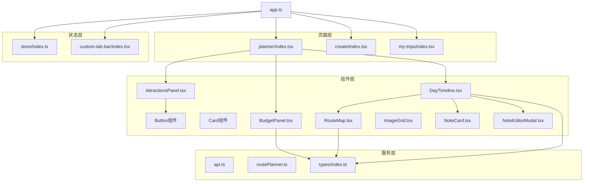
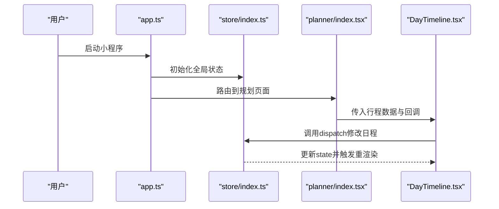
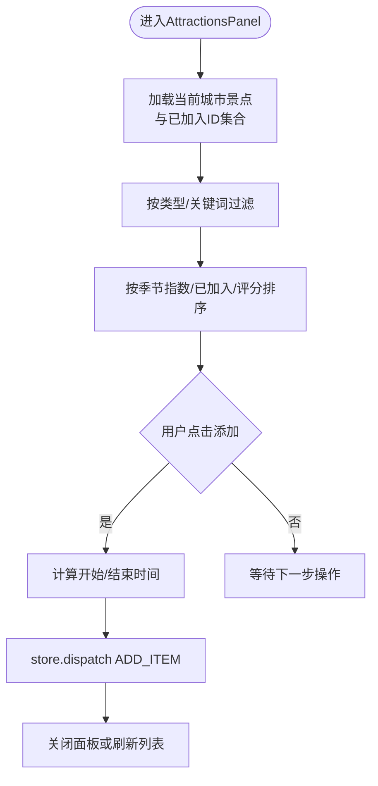
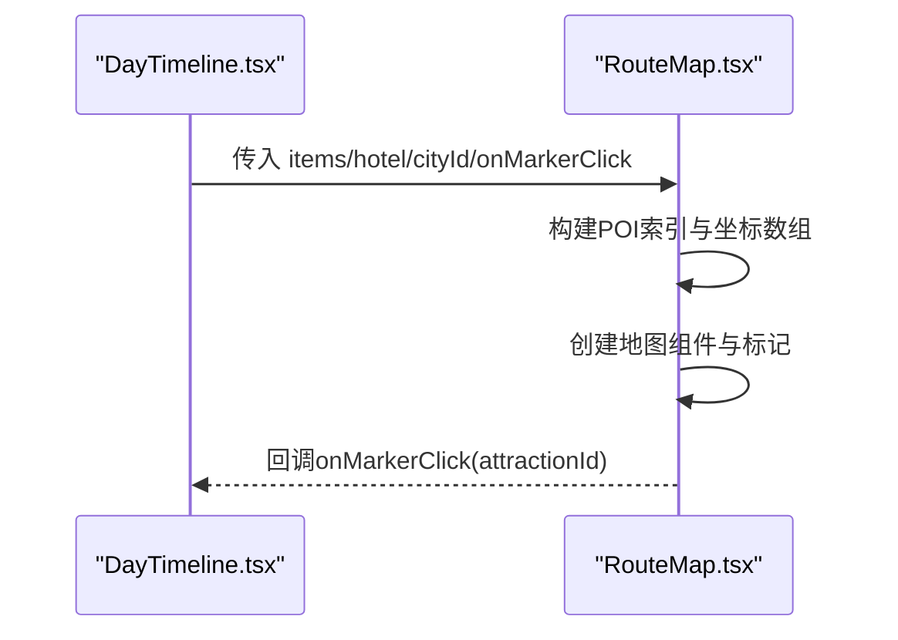
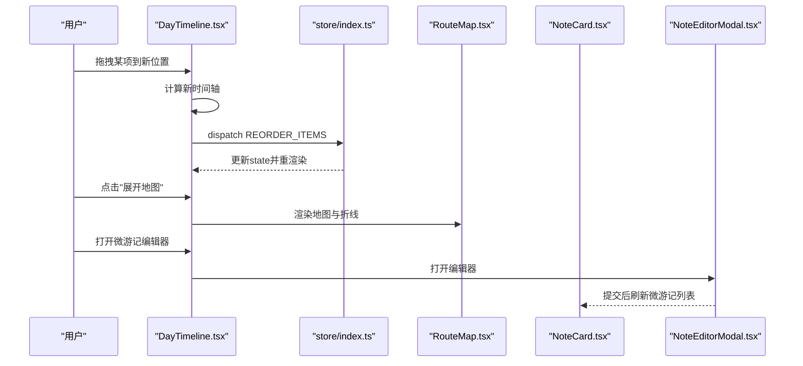
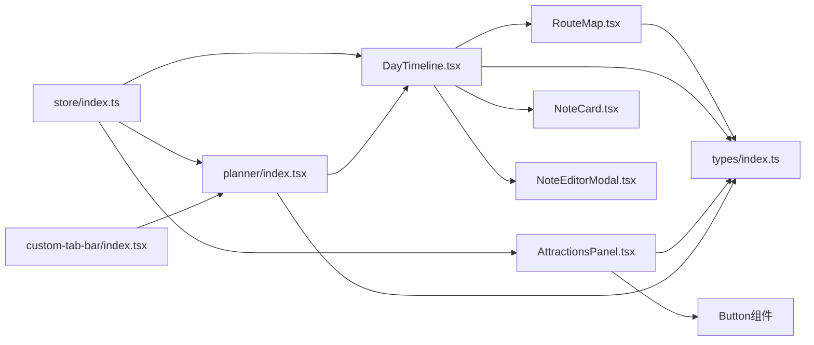

# Taro小程序组件体系

<cite>
**本文档引用的文件**
- [miniprogram/src/app.ts](file://miniprogram/src/app.ts)
- [miniprogram/src/store/index.ts](file://miniprogram/src/store/index.ts)
- [miniprogram/src/pages/planner/index.tsx](file://miniprogram/src/pages/planner/index.tsx)
- [miniprogram/src/pages/create/index.tsx](file://miniprogram/src/pages/create/index.tsx)
- [miniprogram/src/pages/my-trips/index.tsx](file://miniprogram/src/pages/my-trips/index.tsx)
- [miniprogram/src/services/api.ts](file://miniprogram/src/services/api.ts)
- [miniprogram/src/utils/routePlanner.ts](file://miniprogram/src/utils/routePlanner.ts)
- [miniprogram/src/types/index.ts](file://miniprogram/src/types/index.ts)
- [miniprogram/src/custom-tab-bar/index.tsx](file://miniprogram/src/custom-tab-bar/index.tsx)
- [miniprogram/src/components/AttractionsPanel.tsx](file://miniprogram/src/components/AttractionsPanel.tsx)
- [miniprogram/src/components/RouteMap.tsx](file://miniprogram/src/components/RouteMap.tsx)
- [miniprogram/src/components/DayTimeline.tsx](file://miniprogram/src/components/DayTimeline.tsx)
- [miniprogram/src/components/BudgetPanel.tsx](file://miniprogram/src/components/BudgetPanel.tsx)
- [miniprogram/src/components/ImageGrid.tsx](file://miniprogram/src/components/ImageGrid.tsx)
- [miniprogram/src/components/NoteCard.tsx](file://miniprogram/src/components/NoteCard.tsx)
- [miniprogram/src/components/NoteEditorModal.tsx](file://miniprogram/src/components/NoteEditorModal.tsx)
</cite>

## 更新摘要
**所做更改**
- 完全重构文档以反映从React Web组件体系向Taro小程序组件体系的架构迁移
- 新增Taro小程序特有的页面路由、状态管理和组件架构说明
- 更新组件组织结构以符合小程序的目录规范
- 重新设计组件交互模式以适应小程序环境
- 新增小程序特有的性能优化和调试指南

## 目录
1. [简介](#简介)
2. [项目结构](#项目结构)
3. [核心组件](#核心组件)
4. [架构总览](#架构总览)
5. [组件详解](#组件详解)
6. [依赖关系分析](#依赖关系分析)
7. [性能与可维护性](#性能与可维护性)
8. [故障排查指南](#故障排查指南)
9. [结论](#结论)
10. [附录](#附录)

## 简介
本文档系统梳理旅行规划Demo的Taro小程序组件体系，围绕小程序页面架构、状态管理、组件复用策略进行深入解析；重点阐述基础UI组件（Button、Card）的设计与定制，以及业务组件（AttractionsPanel、RouteMap、DayTimeline等）的职责划分与交互流程；总结小程序特有的页面路由、事件处理和状态提升机制；给出组件组合范式与可测试性、可维护性的设计建议，并提供小程序性能优化与最佳实践。

## 项目结构
该应用采用Taro小程序的标准目录结构，基于页面-组件-服务的状态管理模式：
- 页面层：planner、create、my-trips等页面负责视图切换与路由导航
- 组件层：通用UI组件（Button、Card）、业务组件（AttractionsPanel、RouteMap、DayTimeline等）
- 服务层：API封装、路由规划工具、类型定义
- 状态层：全局store管理行程状态

**图表来源**
- [miniprogram/src/app.ts:1-50](file://miniprogram/src/app.ts#L1-L50)
- [miniprogram/src/store/index.ts:1-100](file://miniprogram/src/store/index.ts#L1-L100)
- [miniprogram/src/pages/planner/index.tsx:1-150](file://miniprogram/src/pages/planner/index.tsx#L1-L150)
- [miniprogram/src/components/AttractionsPanel.tsx:1-200](file://miniprogram/src/components/AttractionsPanel.tsx#L1-L200)
- [miniprogram/src/components/RouteMap.tsx:1-150](file://miniprogram/src/components/RouteMap.tsx#L1-L150)
- [miniprogram/src/components/DayTimeline.tsx:1-200](file://miniprogram/src/components/DayTimeline.tsx#L1-L200)
- [miniprogram/src/components/BudgetPanel.tsx:1-100](file://miniprogram/src/components/BudgetPanel.tsx#L1-L100)
- [miniprogram/src/components/NoteCard.tsx:1-150](file://miniprogram/src/components/NoteCard.tsx#L1-L150)
- [miniprogram/src/components/NoteEditorModal.tsx:1-200](file://miniprogram/src/components/NoteEditorModal.tsx#L1-L200)
- [miniprogram/src/services/api.ts:1-100](file://miniprogram/src/services/api.ts#L1-L100)
- [miniprogram/src/utils/routePlanner.ts:1-80](file://miniprogram/src/utils/routePlanner.ts#L1-L80)
- [miniprogram/src/types/index.ts:1-100](file://miniprogram/src/types/index.ts#L1-L100)
- [miniprogram/src/custom-tab-bar/index.tsx:1-80](file://miniprogram/src/custom-tab-bar/index.tsx#L1-L80)

**章节来源**
- [miniprogram/src/app.ts:1-50](file://miniprogram/src/app.ts#L1-L50)
- [miniprogram/src/store/index.ts:1-100](file://miniprogram/src/store/index.ts#L1-L100)
- [miniprogram/src/custom-tab-bar/index.tsx:1-80](file://miniprogram/src/custom-tab-bar/index.tsx#L1-L80)

## 核心组件
- 基础UI组件
  - Button：小程序原生组件封装，支持多种尺寸与风格，统一入口通过props暴露原生属性
  - Card：卡片容器及子块（Header/Title/Description/Content/Footer），统一样式与过渡效果
- 业务组件
  - AttractionsPanel：景点面板，支持搜索、筛选、排序、批量加入当前日程
  - RouteMap：地图组件，绘制POI标记、路线折线与图例，支持点击回调
  - DayTimeline：日程时间轴，支持拖拽重排、插入POI、一键优化、微游记、交通段渲染
  - BudgetPanel：预算概览与分类统计
  - NoteCard/NoteEditorModal：微游记卡片与底部编辑器
  - ImageGrid：朋友圈风格图片网格

**章节来源**
- [miniprogram/src/components/AttractionsPanel.tsx:1-200](file://miniprogram/src/components/AttractionsPanel.tsx#L1-L200)
- [miniprogram/src/components/RouteMap.tsx:1-150](file://miniprogram/src/components/RouteMap.tsx#L1-L150)
- [miniprogram/src/components/DayTimeline.tsx:1-200](file://miniprogram/src/components/DayTimeline.tsx#L1-L200)
- [miniprogram/src/components/BudgetPanel.tsx:1-100](file://miniprogram/src/components/BudgetPanel.tsx#L1-L100)
- [miniprogram/src/components/NoteCard.tsx:1-150](file://miniprogram/src/components/NoteCard.tsx#L1-L150)
- [miniprogram/src/components/NoteEditorModal.tsx:1-200](file://miniprogram/src/components/NoteEditorModal.tsx#L1-L200)
- [miniprogram/src/components/ImageGrid.tsx:1-100](file://miniprogram/src/components/ImageGrid.tsx#L1-L100)

## 架构总览
应用通过Taro框架提供的小程序生命周期和页面路由系统，结合自定义store实现全局状态管理。页面组件通过props和事件系统与业务组件通信，实现完整的旅行规划功能。

**图表来源**
- [miniprogram/src/app.ts:1-50](file://miniprogram/src/app.ts#L1-L50)
- [miniprogram/src/store/index.ts:1-100](file://miniprogram/src/store/index.ts#L1-L100)
- [miniprogram/src/pages/planner/index.tsx:1-150](file://miniprogram/src/pages/planner/index.tsx#L1-L150)
- [miniprogram/src/components/DayTimeline.tsx:1-200](file://miniprogram/src/components/DayTimeline.tsx#L1-L200)

## 组件详解

### 基础UI组件：Button 与 Card
- 设计理念
  - Button：封装小程序原生button组件，通过props透传配置，支持尺寸、颜色与交互状态
  - Card：模块化子组件，统一边框、背景、阴影与动画效果，便于在不同场景复用
- 使用模式
  - 在AttractionsPanel中作为"添加到日程"按钮
  - 在planner页面中作为导航与操作按钮
- 定制策略
  - 通过props扩展更多风格，满足小程序主题色板
  - 通过样式覆盖局部样式，保持默认主题一致性

**章节来源**
- [miniprogram/src/components/AttractionsPanel.tsx:150-180](file://miniprogram/src/components/AttractionsPanel.tsx#L150-L180)
- [miniprogram/src/pages/planner/index.tsx:80-120](file://miniprogram/src/pages/planner/index.tsx#L80-L120)

### 业务组件：AttractionsPanel（景点面板）
- 功能职责
  - 展示城市景点列表，支持搜索、类型筛选、排序（按季节指数、是否已加入、评分）
  - 将景点加入当前日程，自动计算开始/结束时间
  - 标识"已在当天/其他日"状态，提供视觉反馈
- 关键逻辑
  - 使用useMemo缓存景点集合与过滤结果，避免重复计算
  - 通过store.dispatch触发ADD_ITEM动作，写入行程状态
- 交互细节
  - 支持"推荐理由""评分""地址""费用"等信息展示
  - 提供"添加到第N天"按钮，禁用已加入项

**图表来源**
- [miniprogram/src/components/AttractionsPanel.tsx:20-120](file://miniprogram/src/components/AttractionsPanel.tsx#L20-L120)
- [miniprogram/src/store/index.ts:60-90](file://miniprogram/src/store/index.ts#L60-L90)

**章节来源**
- [miniprogram/src/components/AttractionsPanel.tsx:1-200](file://miniprogram/src/components/AttractionsPanel.tsx#L1-L200)
- [miniprogram/src/store/index.ts:1-100](file://miniprogram/src/store/index.ts#L1-L100)

### 业务组件：RouteMap（路线地图）
- 功能职责
  - 基于小程序地图组件渲染，标注酒店与POI，绘制折线路径
  - 支持自定义图标（数字标记、酒店图标）
  - 提供图例与边界适配
- 关键逻辑
  - 使用useMemo建立POI索引与坐标序列
  - 计算边界并动态适配容器尺寸
- 交互细节
  - Marker点击回调onMarkerClick用于打开详情

**图表来源**
- [miniprogram/src/components/RouteMap.tsx:60-140](file://miniprogram/src/components/RouteMap.tsx#L60-L140)
- [miniprogram/src/components/DayTimeline.tsx:150-180](file://miniprogram/src/components/DayTimeline.tsx#L150-L180)

**章节来源**
- [miniprogram/src/components/RouteMap.tsx:1-150](file://miniprogram/src/components/RouteMap.tsx#L1-L150)
- [miniprogram/src/components/DayTimeline.tsx:150-180](file://miniprogram/src/components/DayTimeline.tsx#L150-L180)

### 业务组件：DayTimeline（日程时间轴）
- 功能职责
  - 展示单日行程，支持拖拽重排、插入POI、一键优化
  - 渲染酒店卡片、交通段、微游记
  - 加载真实交通数据，支持地图/列表视图切换
- 关键逻辑
  - 使用useMemo缓存POI集合与索引
  - 拖拽时重新计算时间轴并store.dispatch REORDER_ITEMS
  - 一键优化调用optimizeDayRoute并回写状态
- 微游记生态
  - NoteCard/NoteEditorModal配合，支持作者识别、表情、图片、删除与编辑

**图表来源**
- [miniprogram/src/components/DayTimeline.tsx:120-160](file://miniprogram/src/components/DayTimeline.tsx#L120-L160)
- [miniprogram/src/components/DayTimeline.tsx:100-120](file://miniprogram/src/components/DayTimeline.tsx#L100-L120)
- [miniprogram/src/store/index.ts:70-90](file://miniprogram/src/store/index.ts#L70-L90)
- [miniprogram/src/components/RouteMap.tsx:80-140](file://miniprogram/src/components/RouteMap.tsx#L80-L140)
- [miniprogram/src/components/NoteCard.tsx:40-120](file://miniprogram/src/components/NoteCard.tsx#L40-L120)
- [miniprogram/src/components/NoteEditorModal.tsx:40-160](file://miniprogram/src/components/NoteEditorModal.tsx#L40-L160)

**章节来源**
- [miniprogram/src/components/DayTimeline.tsx:1-200](file://miniprogram/src/components/DayTimeline.tsx#L1-L200)
- [miniprogram/src/components/NoteCard.tsx:1-150](file://miniprogram/src/components/NoteCard.tsx#L1-L150)
- [miniprogram/src/components/NoteEditorModal.tsx:1-200](file://miniprogram/src/components/NoteEditorModal.tsx#L1-L200)

### 业务组件：BudgetPanel（预算面板）
- 功能职责
  - 统计总花费、日均花费、参考预算占比
  - 分类汇总（景点、美食、住宿、体验、购物、交通）
  - 列出每日花费并支持跳转到对应日
- 关键逻辑
  - 基于行程数据reduce计算分类与日合计
  - 与destinations联动展示参考预算

**章节来源**
- [miniprogram/src/components/BudgetPanel.tsx:1-100](file://miniprogram/src/components/BudgetPanel.tsx#L1-L100)

### 业务组件：NoteCard 与 NoteEditorModal
- 设计要点
  - NoteCard支持紧凑与完整两种变体，适配时间轴与日记页
  - NoteEditorModal提供底部弹层、表情选择、图片上传、字数限制与提交状态
- 交互流程
  - 编辑/删除按钮仅对作者可见
  - 提交后通过service层写入服务端并更新本地状态

**章节来源**
- [miniprogram/src/components/NoteCard.tsx:1-150](file://miniprogram/src/components/NoteCard.tsx#L1-L150)
- [miniprogram/src/components/NoteEditorModal.tsx:1-200](file://miniprogram/src/components/NoteEditorModal.tsx#L1-L200)

### 业务组件：ImageGrid（图片网格）
- 设计要点
  - 支持1-9张图片的自适应网格布局
  - 全屏查看器，支持左右切换与关闭
- 使用场景
  - 微游记图片预览、详情页缩略图

**章节来源**
- [miniprogram/src/components/ImageGrid.tsx:1-100](file://miniprogram/src/components/ImageGrid.tsx#L1-L100)

### 页面组件：planner 与 create
- planner页面
  - 顶部工具栏：返回、预算、总览、保存
  - 左侧日历条：移动端横向滚动，桌面端纵向排列
  - 中部主体：DayTimeline、AttractionsPanel、BudgetPanel
  - 保存行程：通过service层POST至服务端，成功后跳转总览
- create页面
  - 搜索主导的首页，支持国内/国际目的地分组与快速标签
  - 导航菜单、登录态处理

**章节来源**
- [miniprogram/src/pages/planner/index.tsx:1-150](file://miniprogram/src/pages/planner/index.tsx#L1-L150)
- [miniprogram/src/pages/create/index.tsx:1-150](file://miniprogram/src/pages/create/index.tsx#L1-L150)

## 依赖关系分析
- 组件间依赖
  - planner页面组合DayTimeline、AttractionsPanel、BudgetPanel
  - DayTimeline依赖RouteMap、NoteCard、NoteEditorModal
  - AttractionsPanel依赖Button、mock数据与store
  - RouteMap依赖类型定义与地图服务
- 状态管理依赖
  - store提供行程状态与dispatch
  - 自定义tabbar提供底部导航
- 类型依赖
  - types/index.ts定义了行程、POI、微游记等核心类型

**图表来源**
- [miniprogram/src/store/index.ts:1-100](file://miniprogram/src/store/index.ts#L1-L100)
- [miniprogram/src/components/DayTimeline.tsx:1-200](file://miniprogram/src/components/DayTimeline.tsx#L1-L200)
- [miniprogram/src/components/RouteMap.tsx:1-150](file://miniprogram/src/components/RouteMap.tsx#L1-L150)
- [miniprogram/src/components/AttractionsPanel.tsx:1-200](file://miniprogram/src/components/AttractionsPanel.tsx#L1-L200)
- [miniprogram/src/pages/planner/index.tsx:1-150](file://miniprogram/src/pages/planner/index.tsx#L1-L150)
- [miniprogram/src/types/index.ts:1-100](file://miniprogram/src/types/index.ts#L1-L100)
- [miniprogram/src/custom-tab-bar/index.tsx:1-80](file://miniprogram/src/custom-tab-bar/index.tsx#L1-L80)

**章节来源**
- [miniprogram/src/types/index.ts:1-100](file://miniprogram/src/types/index.ts#L1-L100)

## 性能与可维护性
- 性能优化
  - 使用useMemo缓存昂贵计算（过滤、排序、索引、地图坐标、酒店推荐）
  - 使用useCallback稳定回调，减少子组件重渲染
  - 图片懒加载与错误兜底（DayTimeline中的图片加载失败回退）
  - 地图初始化延迟与invalidateSize修复，避免首次渲染尺寸异常
- 可维护性
  - 组件职责单一：UI组件专注展示，业务组件专注流程
  - Hooks集中：状态与逻辑集中在store，组件只负责渲染
  - 类型驱动：通过types/index.ts约束数据结构，降低运行期风险
  - 小程序优化：利用小程序原生组件性能优势

**章节来源**
- [miniprogram/src/components/AttractionsPanel.tsx:25-60](file://miniprogram/src/components/AttractionsPanel.tsx#L25-L60)
- [miniprogram/src/components/DayTimeline.tsx:80-110](file://miniprogram/src/components/DayTimeline.tsx#L80-L110)
- [miniprogram/src/components/RouteMap.tsx:30-50](file://miniprogram/src/components/RouteMap.tsx#L30-L50)
- [miniprogram/src/components/DayTimeline.tsx:600-650](file://miniprogram/src/components/DayTimeline.tsx#L600-L650)

## 故障排查指南
- 地图不显示或尺寸异常
  - 检查容器尺寸变化后的invalidateSize调用时机
  - 确认地图组件的markers与polyline数据格式
- 拖拽后时间错乱
  - 确认REORDER_ITEMS后重新计算每个item的startTime/endTime
  - 检查分钟进位与小时上限（23:59）
- 微游记无法提交
  - 确认用户登录状态后再发起请求
  - 检查网络请求与API响应格式
- 保存行程失败
  - 检查store状态与POST /api/trips的响应字段映射
  - 确认保存成功后页面跳转

**章节来源**
- [miniprogram/src/components/RouteMap.tsx:30-50](file://miniprogram/src/components/RouteMap.tsx#L30-L50)
- [miniprogram/src/components/DayTimeline.tsx:130-160](file://miniprogram/src/components/DayTimeline.tsx#L130-L160)
- [miniprogram/src/services/api.ts:1-100](file://miniprogram/src/services/api.ts#L1-L100)
- [miniprogram/src/pages/planner/index.tsx:20-50](file://miniprogram/src/pages/planner/index.tsx#L20-L50)

## 结论
该组件体系以Taro小程序为核心，通过store实现状态管理；基础UI组件提供一致的外观与交互，业务组件聚焦具体流程；通过useMemo/useCallback等优化手段保障性能；类型系统与清晰的职责划分提升了可维护性。整体架构适合扩展更多城市、更多POI类型与更丰富的社交功能。

## 附录
- 组件组合范式
  - 页面级组合：planner页面组合DayTimeline、AttractionsPanel、BudgetPanel
  - 业务级组合：DayTimeline组合RouteMap、NoteCard、NoteEditorModal
  - UI级组合：Button/Card在多个组件中复用
- 测试建议
  - 对useMemo/useCallback包裹的计算逻辑进行单元测试
  - 对事件流（拖拽、插入、优化）进行集成测试
  - 对API交互进行端到端测试
- 小程序特有优化
  - 利用小程序原生组件性能优势
  - 优化页面路由与缓存策略
  - 使用小程序开发者工具进行调试

**章节来源**
- [miniprogram/src/components/AttractionsPanel.tsx:150-180](file://miniprogram/src/components/AttractionsPanel.tsx#L150-L180)
- [miniprogram/src/components/DayTimeline.tsx:120-160](file://miniprogram/src/components/DayTimeline.tsx#L120-L160)
- [miniprogram/src/services/api.ts:1-100](file://miniprogram/src/services/api.ts#L1-L100)