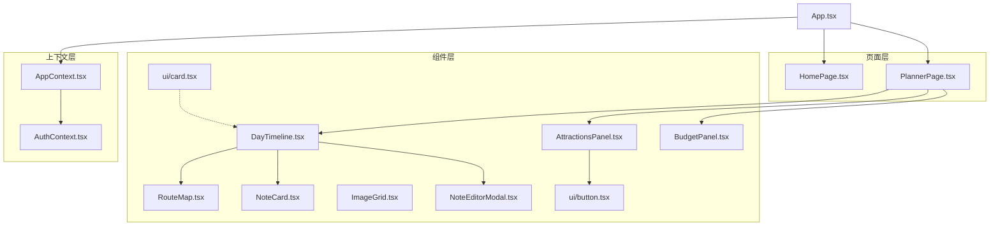
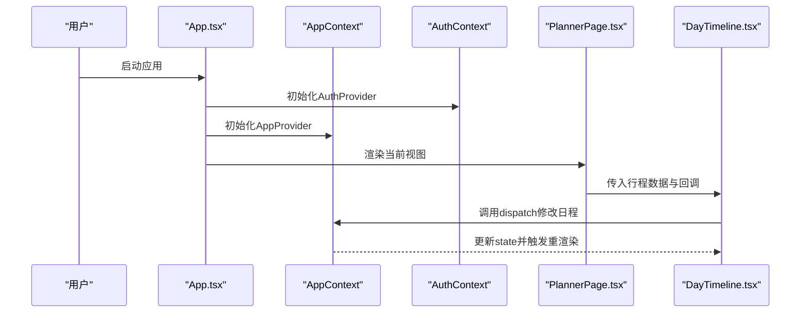
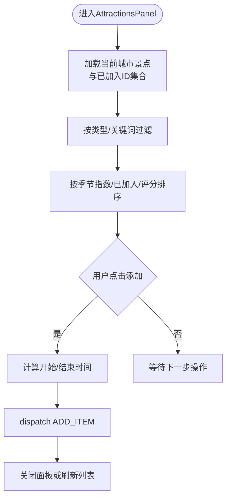
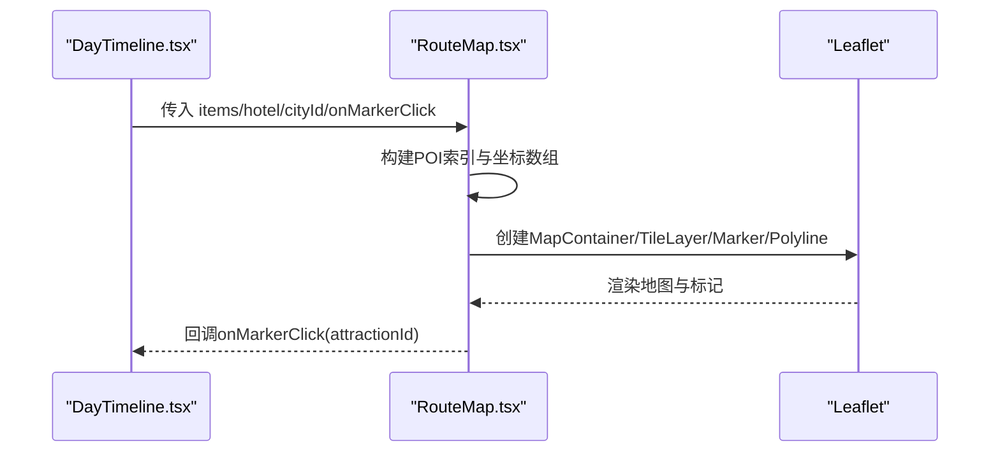
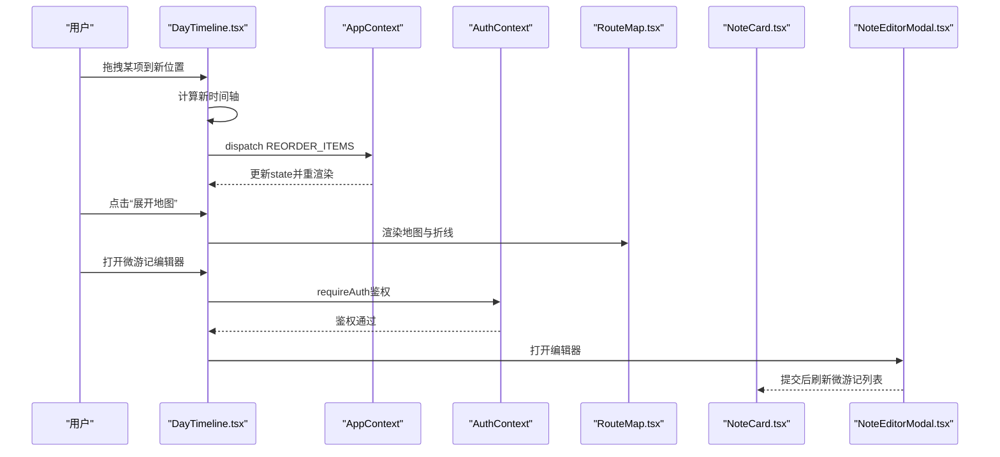
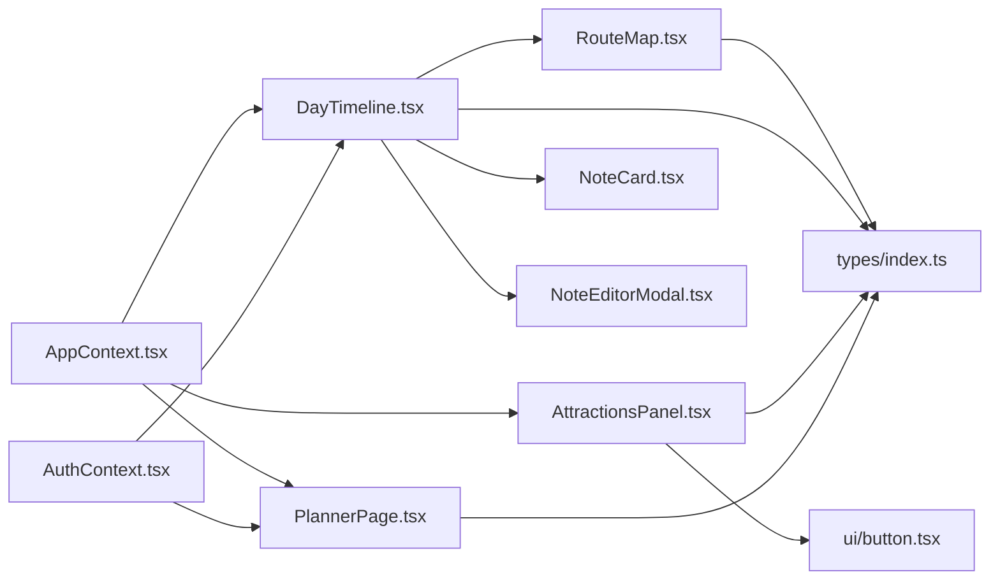

# React组件体系

<cite>
**本文引用的文件**
- [src/App.tsx](file://src/App.tsx)
- [src/context/AppContext.tsx](file://src/context/AppContext.tsx)
- [src/context/AuthContext.tsx](file://src/context/AuthContext.tsx)
- [src/components/ui/button.tsx](file://src/components/ui/button.tsx)
- [src/components/ui/card.tsx](file://src/components/ui/card.tsx)
- [src/components/AttractionsPanel.tsx](file://src/components/AttractionsPanel.tsx)
- [src/components/RouteMap.tsx](file://src/components/RouteMap.tsx)
- [src/components/DayTimeline.tsx](file://src/components/DayTimeline.tsx)
- [src/components/BudgetPanel.tsx](file://src/components/BudgetPanel.tsx)
- [src/components/ImageGrid.tsx](file://src/components/ImageGrid.tsx)
- [src/components/NoteCard.tsx](file://src/components/NoteCard.tsx)
- [src/components/NoteEditorModal.tsx](file://src/components/NoteEditorModal.tsx)
- [src/pages/PlannerPage.tsx](file://src/pages/PlannerPage.tsx)
- [src/pages/HomePage.tsx](file://src/pages/HomePage.tsx)
- [src/types/index.ts](file://src/types/index.ts)
</cite>

## 目录
1. [简介](#简介)
2. [项目结构](#项目结构)
3. [核心组件](#核心组件)
4. [架构总览](#架构总览)
5. [组件详解](#组件详解)
6. [依赖关系分析](#依赖关系分析)
7. [性能与可维护性](#性能与可维护性)
8. [故障排查指南](#故障排查指南)
9. [结论](#结论)
10. [附录](#附录)

## 简介
本文件系统梳理旅行规划Demo的React组件体系，围绕函数组件、Hooks使用模式、组件复用策略进行深入解析；重点阐述基础UI组件（Button、Card）的设计与定制，以及业务组件（AttractionsPanel、RouteMap、DayTimeline等）的职责划分与交互流程；总结props传递、事件冒泡与状态提升机制；给出组件组合范式与可测试性、可维护性的设计建议，并提供性能优化与最佳实践。

## 项目结构
该应用采用“页面+组件+上下文”的分层组织方式：
- 页面层：HomePage、PlannerPage等负责视图切换与顶层布局
- 组件层：通用UI组件（ui/button、ui/card）、业务组件（AttractionsPanel、RouteMap、DayTimeline等）
- 上下文层：AppContext（全局行程状态）、AuthContext（认证态）

图表来源
- [src/App.tsx:1-62](file://src/App.tsx#L1-L62)
- [src/context/AppContext.tsx:1-234](file://src/context/AppContext.tsx#L1-L234)
- [src/context/AuthContext.tsx:1-218](file://src/context/AuthContext.tsx#L1-L218)
- [src/pages/PlannerPage.tsx:1-200](file://src/pages/PlannerPage.tsx#L1-L200)
- [src/components/AttractionsPanel.tsx:1-298](file://src/components/AttractionsPanel.tsx#L1-L298)
- [src/components/RouteMap.tsx:1-180](file://src/components/RouteMap.tsx#L1-L180)
- [src/components/DayTimeline.tsx:1-979](file://src/components/DayTimeline.tsx#L1-L979)
- [src/components/BudgetPanel.tsx:1-134](file://src/components/BudgetPanel.tsx#L1-L134)
- [src/components/ImageGrid.tsx:1-129](file://src/components/ImageGrid.tsx#L1-L129)
- [src/components/NoteCard.tsx:1-194](file://src/components/NoteCard.tsx#L1-L194)
- [src/components/NoteEditorModal.tsx:1-287](file://src/components/NoteEditorModal.tsx#L1-L287)

章节来源
- [src/App.tsx:1-62](file://src/App.tsx#L1-L62)
- [src/context/AppContext.tsx:1-234](file://src/context/AppContext.tsx#L1-L234)
- [src/context/AuthContext.tsx:1-218](file://src/context/AuthContext.tsx#L1-L218)

## 核心组件
- 基础UI组件
  - Button：基于class-variance-authority的变体系统，支持多种尺寸与风格，统一入口通过forwardRef暴露原生button属性
  - Card：卡片容器及子块（Header/Title/Description/Content/Footer），统一阴影与过渡效果
- 业务组件
  - AttractionsPanel：景点面板，支持搜索、筛选、排序、批量加入当前日程
  - RouteMap：地图组件，绘制POI标记、路线折线与图例，支持点击回调
  - DayTimeline：日程时间轴，支持拖拽重排、插入POI、一键优化、微游记、交通段渲染
  - BudgetPanel：预算概览与分类统计
  - NoteCard/NoteEditorModal：微游记卡片与底部编辑器
  - ImageGrid：朋友圈风格图片网格

章节来源
- [src/components/ui/button.tsx:1-51](file://src/components/ui/button.tsx#L1-L51)
- [src/components/ui/card.tsx:1-78](file://src/components/ui/card.tsx#L1-L78)
- [src/components/AttractionsPanel.tsx:1-298](file://src/components/AttractionsPanel.tsx#L1-L298)
- [src/components/RouteMap.tsx:1-180](file://src/components/RouteMap.tsx#L1-L180)
- [src/components/DayTimeline.tsx:1-979](file://src/components/DayTimeline.tsx#L1-L979)
- [src/components/BudgetPanel.tsx:1-134](file://src/components/BudgetPanel.tsx#L1-L134)
- [src/components/NoteCard.tsx:1-194](file://src/components/NoteCard.tsx#L1-L194)
- [src/components/NoteEditorModal.tsx:1-287](file://src/components/NoteEditorModal.tsx#L1-L287)
- [src/components/ImageGrid.tsx:1-129](file://src/components/ImageGrid.tsx#L1-L129)

## 架构总览
应用通过AppProvider与AuthProvider提供全局状态与认证能力，AppContent根据当前视图渲染对应页面；页面内再组合业务组件完成具体功能。

图表来源
- [src/App.tsx:1-62](file://src/App.tsx#L1-L62)
- [src/context/AppContext.tsx:220-234](file://src/context/AppContext.tsx#L220-L234)
- [src/context/AuthContext.tsx:45-211](file://src/context/AuthContext.tsx#L45-L211)
- [src/pages/PlannerPage.tsx:1-200](file://src/pages/PlannerPage.tsx#L1-L200)
- [src/components/DayTimeline.tsx:1-979](file://src/components/DayTimeline.tsx#L1-L979)

## 组件详解

### 基础UI组件：Button 与 Card
- 设计理念
  - Button：通过变体系统统一管理样式，支持尺寸、颜色与交互状态；通过forwardRef透传DOM属性，便于表单集成
  - Card：模块化子组件，统一边框、背景、阴影与悬停过渡，便于在不同场景复用
- 使用模式
  - 在AttractionsPanel中作为“添加到日程”按钮
  - 在PlannerPage中作为导航与操作按钮
- 定制策略
  - 通过VariantProps扩展更多风格（如coral、warm），满足品牌色板
  - 通过className覆盖局部样式，保持默认主题一致性

章节来源
- [src/components/ui/button.tsx:1-51](file://src/components/ui/button.tsx#L1-L51)
- [src/components/ui/card.tsx:1-78](file://src/components/ui/card.tsx#L1-L78)
- [src/components/AttractionsPanel.tsx:265-283](file://src/components/AttractionsPanel.tsx#L265-L283)
- [src/pages/PlannerPage.tsx:63-131](file://src/pages/PlannerPage.tsx#L63-L131)

### 业务组件：AttractionsPanel（景点面板）
- 功能职责
  - 展示城市景点列表，支持搜索、类型筛选、排序（按季节指数、是否已加入、评分）
  - 将景点加入当前日程，自动计算开始/结束时间
  - 标识“已在当天/其他日”状态，提供视觉反馈
- 关键逻辑
  - 使用useMemo缓存景点集合与过滤结果，避免重复计算
  - 使用dispatch触发ADD_ITEM动作，写入行程状态
- 交互细节
  - 支持“推荐理由”“评分”“地址”“费用”等信息展示
  - 提供“添加到第N天”按钮，禁用已加入项

图表来源
- [src/components/AttractionsPanel.tsx:23-113](file://src/components/AttractionsPanel.tsx#L23-L113)
- [src/context/AppContext.tsx:101-111](file://src/context/AppContext.tsx#L101-L111)

章节来源
- [src/components/AttractionsPanel.tsx:1-298](file://src/components/AttractionsPanel.tsx#L1-L298)
- [src/context/AppContext.tsx:83-213](file://src/context/AppContext.tsx#L83-L213)

### 业务组件：RouteMap（路线地图）
- 功能职责
  - 基于Leaflet渲染地图，标注酒店与POI，绘制折线路径
  - 支持自定义图标（数字标记、酒店图标）
  - 提供图例与边界适配（FitBounds）
- 关键逻辑
  - 使用useMemo建立POI索引与坐标序列
  - 计算边界并动态适配容器尺寸
- 交互细节
  - Marker点击回调onMarkerClick用于打开详情

图表来源
- [src/components/RouteMap.tsx:79-179](file://src/components/RouteMap.tsx#L79-L179)
- [src/components/DayTimeline.tsx:648-658](file://src/components/DayTimeline.tsx#L648-L658)

章节来源
- [src/components/RouteMap.tsx:1-180](file://src/components/RouteMap.tsx#L1-L180)
- [src/components/DayTimeline.tsx:648-658](file://src/components/DayTimeline.tsx#L648-L658)

### 业务组件：DayTimeline（日程时间轴）
- 功能职责
  - 展示单日行程，支持拖拽重排、插入POI、一键优化
  - 渲染酒店卡片、交通段、微游记
  - 加载真实交通数据（OSRM），支持地图/列表视图切换
- 关键逻辑
  - 使用useMemo缓存POI集合与索引
  - 拖拽时重新计算时间轴并dispatch REORDER_ITEMS
  - 一键优化调用optimizeDayRoute并回写状态
- 微游记生态
  - NoteCard/NoteEditorModal配合，支持作者识别、表情、图片、删除与编辑
  - 通过AuthContext鉴权，提交/删除微游记

图表来源
- [src/components/DayTimeline.tsx:243-277](file://src/components/DayTimeline.tsx#L243-L277)
- [src/components/DayTimeline.tsx:221-241](file://src/components/DayTimeline.tsx#L221-L241)
- [src/context/AppContext.tsx:125-130](file://src/context/AppContext.tsx#L125-L130)
- [src/context/AuthContext.tsx:128-137](file://src/context/AuthContext.tsx#L128-L137)
- [src/components/RouteMap.tsx:108-179](file://src/components/RouteMap.tsx#L108-L179)
- [src/components/NoteCard.tsx:60-194](file://src/components/NoteCard.tsx#L60-L194)
- [src/components/NoteEditorModal.tsx:53-287](file://src/components/NoteEditorModal.tsx#L53-L287)

章节来源
- [src/components/DayTimeline.tsx:1-979](file://src/components/DayTimeline.tsx#L1-L979)
- [src/context/AuthContext.tsx:1-218](file://src/context/AuthContext.tsx#L1-L218)
- [src/components/NoteCard.tsx:1-194](file://src/components/NoteCard.tsx#L1-L194)
- [src/components/NoteEditorModal.tsx:1-287](file://src/components/NoteEditorModal.tsx#L1-L287)

### 业务组件：BudgetPanel（预算面板）
- 功能职责
  - 统计总花费、日均花费、参考预算占比
  - 分类汇总（景点、美食、住宿、体验、购物、交通）
  - 列出每日花费并支持跳转到对应日
- 关键逻辑
  - 基于行程数据reduce计算分类与日合计
  - 与popularCities联动展示参考预算

章节来源
- [src/components/BudgetPanel.tsx:1-134](file://src/components/BudgetPanel.tsx#L1-L134)

### 业务组件：NoteCard 与 NoteEditorModal
- 设计要点
  - NoteCard支持紧凑与完整两种变体，适配时间轴与日记页
  - NoteEditorModal提供底部弹层、表情选择、图片上传、字数限制与提交状态
- 交互流程
  - 编辑/删除按钮仅对作者可见
  - 提交后通过fetch写入服务端并更新本地状态

章节来源
- [src/components/NoteCard.tsx:1-194](file://src/components/NoteCard.tsx#L1-L194)
- [src/components/NoteEditorModal.tsx:1-287](file://src/components/NoteEditorModal.tsx#L1-L287)

### 业务组件：ImageGrid（图片网格）
- 设计要点
  - 支持1-9张图片的自适应网格布局
  - 全屏查看器，支持左右切换与关闭
- 使用场景
  - 微游记图片预览、详情页缩略图

章节来源
- [src/components/ImageGrid.tsx:1-129](file://src/components/ImageGrid.tsx#L1-L129)

### 页面组件：PlannerPage 与 HomePage
- PlannerPage
  - 顶部工具栏：返回、预算、总览、保存
  - 左侧日历条：移动端横向滚动，桌面端纵向排列
  - 中部主体：DayTimeline、AttractionsPanel、BudgetPanel
  - 保存行程：鉴权后POST至服务端，成功后跳转总览
- HomePage
  - 搜索主导的首页，支持国内/国际目的地分组与快速标签
  - 导航菜单、登录态处理

章节来源
- [src/pages/PlannerPage.tsx:1-200](file://src/pages/PlannerPage.tsx#L1-L200)
- [src/pages/HomePage.tsx:1-200](file://src/pages/HomePage.tsx#L1-L200)

## 依赖关系分析
- 组件间依赖
  - PlannerPage组合DayTimeline、AttractionsPanel、BudgetPanel
  - DayTimeline依赖RouteMap、NoteCard、NoteEditorModal
  - AttractionsPanel依赖Button、mock数据与AppContext
  - RouteMap依赖类型定义与地图库
- 上下文依赖
  - AppContext提供行程状态与dispatch
  - AuthContext提供鉴权与API头
- 类型依赖
  - types/index.ts定义了行程、POI、微游记等核心类型

图表来源
- [src/context/AppContext.tsx:1-234](file://src/context/AppContext.tsx#L1-L234)
- [src/context/AuthContext.tsx:1-218](file://src/context/AuthContext.tsx#L1-L218)
- [src/components/DayTimeline.tsx:1-979](file://src/components/DayTimeline.tsx#L1-L979)
- [src/components/RouteMap.tsx:1-180](file://src/components/RouteMap.tsx#L1-L180)
- [src/components/AttractionsPanel.tsx:1-298](file://src/components/AttractionsPanel.tsx#L1-L298)
- [src/pages/PlannerPage.tsx:1-200](file://src/pages/PlannerPage.tsx#L1-L200)
- [src/types/index.ts:1-239](file://src/types/index.ts#L1-L239)

章节来源
- [src/types/index.ts:1-239](file://src/types/index.ts#L1-L239)

## 性能与可维护性
- 性能优化
  - 使用useMemo缓存昂贵计算（过滤、排序、索引、地图坐标、酒店推荐）
  - 使用useCallback稳定回调，减少子组件重渲染
  - 图片懒加载与错误兜底（DayTimeline中的图片加载失败回退）
  - 地图初始化延迟与invalidateSize修复，避免首次渲染尺寸异常
- 可维护性
  - 组件职责单一：UI组件专注展示，业务组件专注流程
  - Hooks集中：状态与逻辑集中在AppContext/AuthContext，组件只负责渲染
  - 类型驱动：通过types/index.ts约束数据结构，降低运行期风险
  - 变体系统：Button/variants统一风格，便于扩展与一致性维护

章节来源
- [src/components/AttractionsPanel.tsx:29-78](file://src/components/AttractionsPanel.tsx#L29-L78)
- [src/components/DayTimeline.tsx:97-124](file://src/components/DayTimeline.tsx#L97-L124)
- [src/components/RouteMap.tsx:45-57](file://src/components/RouteMap.tsx#L45-L57)
- [src/components/DayTimeline.tsx:756-768](file://src/components/DayTimeline.tsx#L756-L768)
- [src/components/ui/button.tsx:5-32](file://src/components/ui/button.tsx#L5-L32)

## 故障排查指南
- 地图不显示或尺寸异常
  - 检查容器尺寸变化后的invalidateSize调用时机
  - 确认FitBounds的bounds参数与地图实例绑定
- 拖拽后时间错乱
  - 确认REORDER_ITEMS后重新计算每个item的startTime/endTime
  - 检查分钟进位与小时上限（23:59）
- 微游记无法提交
  - 确认requireAuth鉴权通过后再发起请求
  - 检查getAuthHeaders是否正确携带Authorization
- 保存行程失败
  - 检查鉴权与POST /api/trips的响应字段映射
  - 确认保存成功后SET_SAVED_TRIP_ID与视图切换

章节来源
- [src/components/RouteMap.tsx:45-57](file://src/components/RouteMap.tsx#L45-L57)
- [src/components/DayTimeline.tsx:249-274](file://src/components/DayTimeline.tsx#L249-L274)
- [src/context/AuthContext.tsx:128-137](file://src/context/AuthContext.tsx#L128-L137)
- [src/pages/PlannerPage.tsx:26-52](file://src/pages/PlannerPage.tsx#L26-L52)

## 结论
该组件体系以函数组件与Hooks为核心，通过AppContext/AuthContext实现状态与认证的集中管理；基础UI组件提供一致的外观与交互，业务组件聚焦具体流程；通过useMemo/useCallback等优化手段保障性能；类型系统与清晰的职责划分提升了可维护性。整体架构适合扩展更多城市、更多POI类型与更丰富的社交功能。

## 附录
- 组件组合范式
  - 页面级组合：PlannerPage组合DayTimeline、AttractionsPanel、BudgetPanel
  - 业务级组合：DayTimeline组合RouteMap、NoteCard、NoteEditorModal
  - UI级组合：Button/Card在多个组件中复用
- 测试建议
  - 对useMemo/useCallback包裹的计算逻辑进行单元测试
  - 对事件流（拖拽、插入、优化）进行集成测试
  - 对鉴权流程（requireAuth）与API交互进行端到端测试