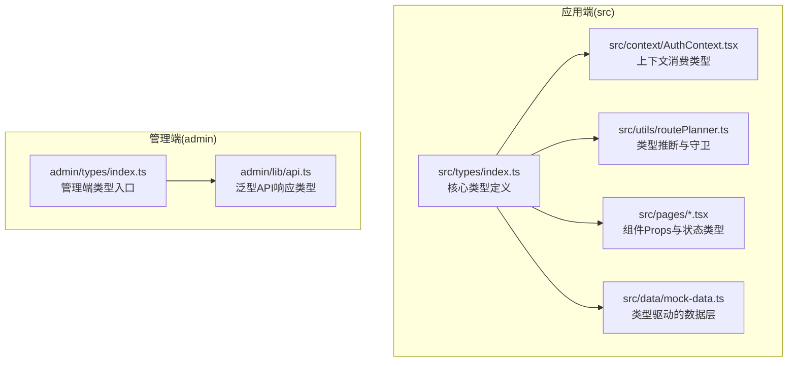
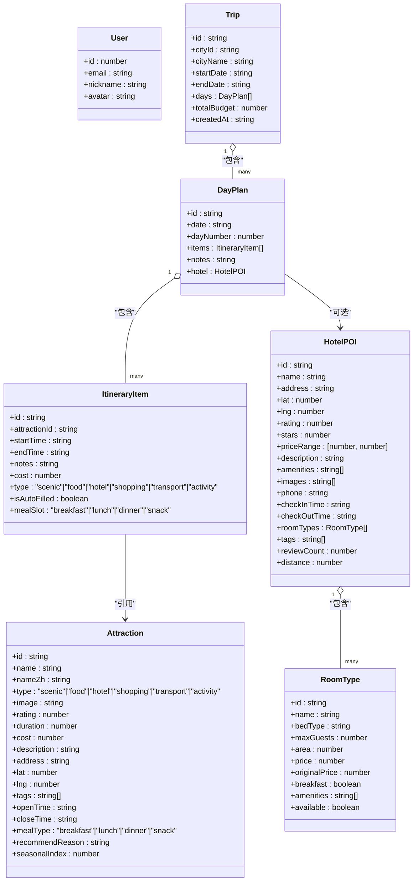
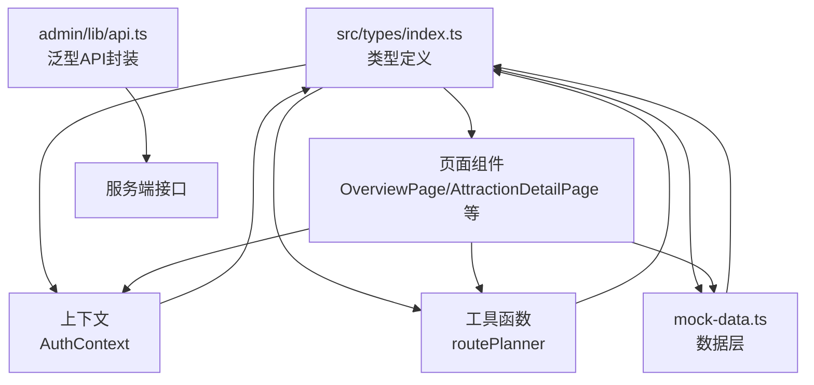
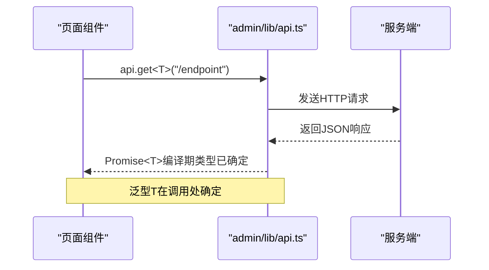
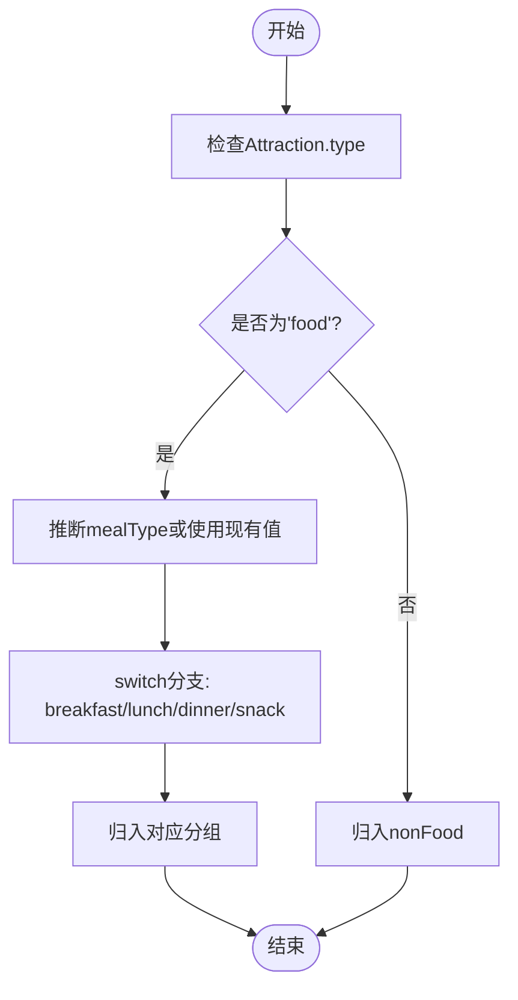
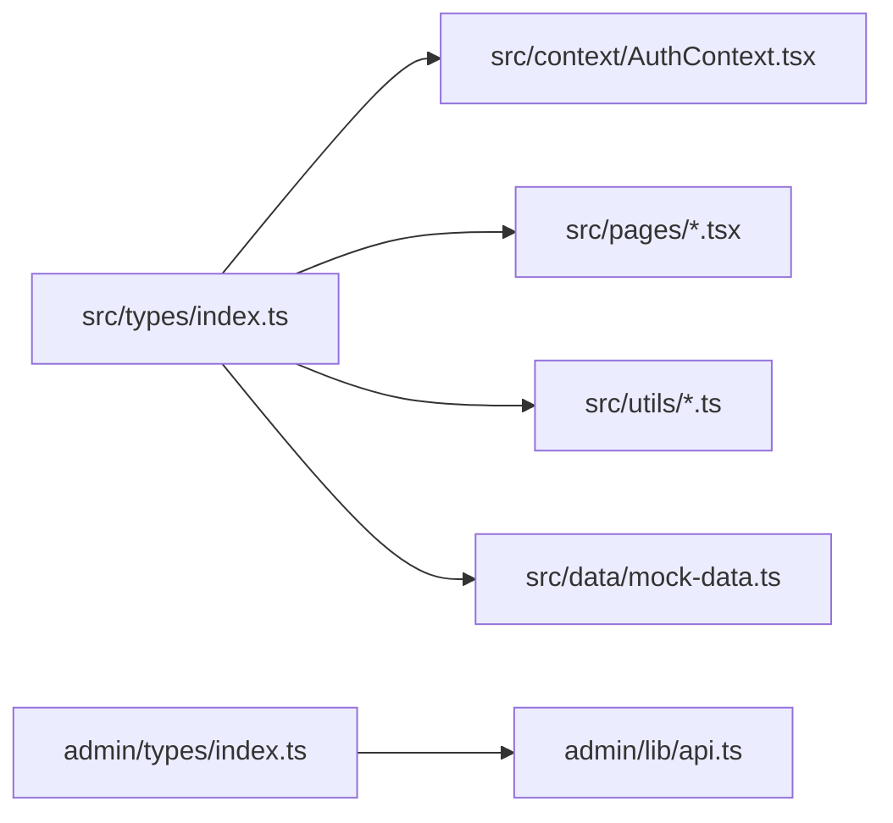

# TypeScript类型系统

<cite>
**本文引用的文件**
- [src/types/index.ts](file://src/types/index.ts)
- [admin/types/index.ts](file://admin/types/index.ts)
- [src/context/AuthContext.tsx](file://src/context/AuthContext.tsx)
- [admin/lib/api.ts](file://admin/lib/api.ts)
- [src/utils/routePlanner.ts](file://src/utils/routePlanner.ts)
- [src/components/AttractionsPanel.tsx](file://src/components/AttractionsPanel.tsx)
- [src/pages/OverviewPage.tsx](file://src/pages/OverviewPage.tsx)
- [src/pages/AttractionDetailPage.tsx](file://src/pages/AttractionDetailPage.tsx)
- [src/data/mock-data.ts](file://src/data/mock-data.ts)
- [src/lib/utils.ts](file://src/lib/utils.ts)
- [src/vite-env.d.ts](file://src/vite-env.d.ts)
- [package.json](file://package.json)
- [tsconfig.json](file://tsconfig.json)
</cite>

## 目录
1. [引言](#引言)
2. [项目结构](#项目结构)
3. [核心组件](#核心组件)
4. [架构总览](#架构总览)
5. [详细组件分析](#详细组件分析)
6. [依赖分析](#依赖分析)
7. [性能考量](#性能考量)
8. [故障排查指南](#故障排查指南)
9. [结论](#结论)
10. [附录](#附录)

## 引言
本文件面向旅行规划Demo的TypeScript类型系统，系统化梳理类型定义的设计原则与实现策略，覆盖接口、类型别名与泛型的使用；深入解析核心数据模型（如User、Place、TravelPlan等）的结构与约束；总结类型推断、类型守卫与条件类型的高级用法；归纳组件Props类型、Hook返回值类型与API响应类型的定义模式；给出类型安全编程最佳实践，并提供类型测试与兼容性检查方法，帮助提升开发效率与代码质量。

## 项目结构
前端类型定义主要集中在两个入口：
- 应用端类型：src/types/index.ts，定义旅行计划、POI、用户与社交相关的核心类型。
- 管理端类型：admin/types/index.ts，定义管理端通用类型（当前仓库中为空，可作为扩展点）。

此外，类型在以下位置被广泛使用：
- 上下文与页面：通过上下文与页面组件消费类型，确保状态与渲染一致。
- 工具函数：如路线规划器对POI进行分类与时间窗口计算，体现类型在算法中的约束与推断。
- API封装：管理端API工具通过泛型请求函数统一处理响应类型。

**图表来源**
- [src/types/index.ts](file://src/types/index.ts)
- [src/context/AuthContext.tsx](file://src/context/AuthContext.tsx)
- [src/utils/routePlanner.ts](file://src/utils/routePlanner.ts)
- [src/pages/OverviewPage.tsx](file://src/pages/OverviewPage.tsx)
- [src/data/mock-data.ts](file://src/data/mock-data.ts)
- [admin/types/index.ts](file://admin/types/index.ts)
- [admin/lib/api.ts](file://admin/lib/api.ts)

**章节来源**
- [src/types/index.ts](file://src/types/index.ts)
- [admin/types/index.ts](file://admin/types/index.ts)

## 核心组件
本节聚焦于旅行规划Demo中的核心数据模型类型，解释其设计原则与约束关系。

- 用户(User)
  - 字段：标识、邮箱、昵称、头像。
  - 设计要点：最小可用字段集合，便于跨模块复用；避免冗余信息导致耦合。
  - 使用场景：认证上下文、评论作者信息、笔记作者信息等。

- 酒店POI(HotelPOI)与房间类型(RoomType)
  - 字段：基础POI信息（经纬度、地址、评分、星级、价格区间等），以及房间类型数组。
  - 设计要点：通过RoomType聚合房间配置，支持早餐、面积、设施等细粒度描述；可选字段用于富化数据。
  - 使用场景：酒店详情页、预算面板、行程中的住宿安排。

- POI与行程项(Attraction、ItineraryItem、DayPlan、Trip)
  - Attraction：景点、美食、购物、交通、活动等多类型统一建模；通过字面量联合类型约束type字段；支持中英文名、开放时间、推荐理由、季节指数等。
  - ItineraryItem：行程条目，记录开始/结束时间、备注、成本、是否自动填充、餐食时段等；与Attraction形成“引用+本地化”的组合。
  - DayPlan：按天组织的行程，包含日期、序号、条目列表、备注与可选酒店。
  - Trip：整体旅行计划，包含城市信息、起止日期、天数、预算、创建时间与每日计划。
  - 设计要点：通过字面量联合类型限制type取值，保证运行期一致性；可选字段表达“富化数据”而非强制约束；时间采用字符串格式（HH:mm）以简化解析。

- 视图类型(AppView)
  - 通过联合类型枚举所有页面视图，避免魔法字符串，提升导航与路由健壮性。

- 社交与笔记类型
  - TripSummary：旅行摘要，包含封面图、发布时间戳、是否发布等。
  - TravelNote与TravelNoteDetail：旅行笔记的列表与详情，包含作者信息、允许评论、时间范围、预算等；详情扩展了tripData与所有权标记。

- 预订状态(BookingStatus)
  - 通过字面量联合类型约束预订状态，避免状态漂移。

**图表来源**
- [src/types/index.ts](file://src/types/index.ts)

**章节来源**
- [src/types/index.ts](file://src/types/index.ts)

## 架构总览
类型系统在前端的协作方式如下：
- 类型定义集中于src/types/index.ts，作为单一事实来源。
- 页面与组件通过上下文与props消费类型，确保数据流一致。
- 工具函数（如routePlanner）基于类型进行推断与守卫，保障算法正确性。
- 管理端API通过泛型函数统一封装响应类型，减少样板代码。

**图表来源**
- [src/types/index.ts](file://src/types/index.ts)
- [src/context/AuthContext.tsx](file://src/context/AuthContext.tsx)
- [src/utils/routePlanner.ts](file://src/utils/routePlanner.ts)
- [src/pages/OverviewPage.tsx](file://src/pages/OverviewPage.tsx)
- [src/pages/AttractionDetailPage.tsx](file://src/pages/AttractionDetailPage.tsx)
- [src/data/mock-data.ts](file://src/data/mock-data.ts)
- [admin/lib/api.ts](file://admin/lib/api.ts)

## 详细组件分析

### 接口与类型别名的设计策略
- 接口优先：对复杂对象（如User、HotelPOI、Attraction）使用接口，便于后续扩展与继承。
- 类型别名：对简单标量或联合类型（如AppView、BookingStatus、mealType）使用类型别名，保持轻量与可读。
- 可选字段：对富化数据（如HotelPOI的可选字段、Attraction的可选开放时间）使用可选属性，避免强制约束影响灵活性。
- 字面量联合类型：对枚举值（如type、mealSlot、status）使用字面量联合类型，防止拼写错误与非法值进入运行时。

**章节来源**
- [src/types/index.ts](file://src/types/index.ts)

### 泛型在API响应中的应用
管理端API封装通过泛型函数request<T>与api.get/post/put/delete<T>，在编译期约束响应类型，避免运行时类型错误。调用方无需手动断言，即可获得强类型响应。

**图表来源**
- [admin/lib/api.ts](file://admin/lib/api.ts)

**章节来源**
- [admin/lib/api.ts](file://admin/lib/api.ts)

### 类型推断与类型守卫
- 类型推断：在工具函数中，根据输入参数与上下文推断返回类型，减少显式声明。
- 类型守卫：在运行时对联合类型进行分支判断，缩小类型范围，确保后续操作的安全性。
- 条件类型：可用于根据属性存在性或值域生成派生类型，但当前Demo未大规模使用，建议在复杂映射场景引入。

示例场景（POI分类与时间窗口）：
- 分类：根据Attraction的type与mealType，将POI分为早餐、午餐、晚餐、零食与非食品类别，体现类型守卫在分支逻辑中的作用。
- 时间窗口：根据开放时间与持续时间计算可访问时间段，结合字面量联合类型约束输入。

**图表来源**
- [src/utils/routePlanner.ts](file://src/utils/routePlanner.ts)

**章节来源**
- [src/utils/routePlanner.ts](file://src/utils/routePlanner.ts)

### 组件Props类型与Hook返回值类型
- 页面组件Props：通过类型定义明确传入的数据结构，例如OverviewPage中对行程项、地图坐标与POI的引用，确保渲染逻辑与数据结构一致。
- 上下文类型：AuthContext中的AuthState明确用户、加载状态与弹窗控制字段，避免在多处分散的状态定义。
- Hook返回值：useDebounce等自定义Hook返回泛型值，保持类型安全的同时提供复用能力。

**章节来源**
- [src/context/AuthContext.tsx](file://src/context/AuthContext.tsx)
- [src/pages/OverviewPage.tsx](file://src/pages/OverviewPage.tsx)
- [src/pages/AttractionDetailPage.tsx](file://src/pages/AttractionDetailPage.tsx)
- [src/data/mock-data.ts](file://src/data/mock-data.ts)

### API响应类型定义模式
- 统一基类与错误处理：通过ApiError与泛型request<T>，在失败时抛出结构化错误，成功时返回Promise<T>。
- 调用约定：GET/POST/PUT/DELETE均以<T>显式声明期望响应类型，避免any与手动断言。

**章节来源**
- [admin/lib/api.ts](file://admin/lib/api.ts)

### 类型安全编程最佳实践
- 避免any：优先使用具体类型或泛型，必要时再考虑unknown。
- 使用字面量联合类型：对枚举值与状态机使用字面量联合类型，防止拼写错误。
- 可选链与非空断言：谨慎使用!，优先通过类型守卫与默认值消除空值风险。
- 类型扩展：通过交叉类型或接口扩展实现行为复用，避免重复字段。
- 模块声明：在vite-env.d.ts中声明环境变量与模块，确保构建期类型检查。

**章节来源**
- [src/vite-env.d.ts](file://src/vite-env.d.ts)

### 类型测试与兼容性检查
- 编译期检查：通过严格模式与noImplicitAny等配置，确保类型完整性。
- 单元测试：对类型定义进行契约测试（如接口满足性），验证类型与实现的一致性。
- 兼容性检查：在升级依赖或TS版本时，使用--noEmit仅做类型检查，定位潜在问题。

**章节来源**
- [tsconfig.json](file://tsconfig.json)
- [package.json](file://package.json)

## 依赖分析
类型系统的依赖关系围绕src/types/index.ts展开，其他模块通过导入与使用类型建立耦合。

**图表来源**
- [src/types/index.ts](file://src/types/index.ts)
- [src/context/AuthContext.tsx](file://src/context/AuthContext.tsx)
- [src/pages/OverviewPage.tsx](file://src/pages/OverviewPage.tsx)
- [src/utils/routePlanner.ts](file://src/utils/routePlanner.ts)
- [src/data/mock-data.ts](file://src/data/mock-data.ts)
- [admin/types/index.ts](file://admin/types/index.ts)
- [admin/lib/api.ts](file://admin/lib/api.ts)

**章节来源**
- [src/types/index.ts](file://src/types/index.ts)
- [admin/types/index.ts](file://admin/types/index.ts)

## 性能考量
- 类型推断与守卫：合理使用类型守卫可减少不必要的运行时检查，提升性能。
- 泛型约束：通过精确的泛型约束减少运行时类型转换开销。
- 可选字段：在数据层使用可选字段，避免无谓的序列化与传输。

## 故障排查指南
- 类型不匹配：检查联合类型是否遗漏某个字面量，或可选字段是否被误用为必填。
- 泛型未推断：确认调用处是否显式指定<T>，或函数签名是否足够具体。
- 上下文类型错误：核对AuthState字段与实际使用是否一致，避免遗漏或多余字段。
- API响应异常：检查ApiError的构造与错误分支，确保错误消息结构化且可读。

**章节来源**
- [admin/lib/api.ts](file://admin/lib/api.ts)
- [src/context/AuthContext.tsx](file://src/context/AuthContext.tsx)

## 结论
本类型系统以接口与类型别名为核心，配合字面量联合类型与可选字段，实现了对旅行计划、POI与用户数据的强约束建模。通过泛型API封装与类型守卫，提升了组件与工具函数的类型安全性与可维护性。建议在复杂映射场景引入条件类型，在数据层进一步完善类型驱动的校验与测试，持续提升开发效率与代码质量。

## 附录
- 管理端类型入口：admin/types/index.ts（当前为空，可扩展为管理端专用类型集合）
- 环境声明：src/vite-env.d.ts（声明全局环境变量与模块）
- 严格配置：tsconfig.json（启用严格模式与相关检查）

**章节来源**
- [admin/types/index.ts](file://admin/types/index.ts)
- [src/vite-env.d.ts](file://src/vite-env.d.ts)
- [tsconfig.json](file://tsconfig.json)