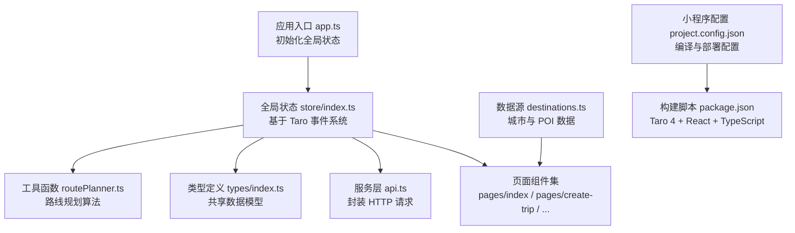
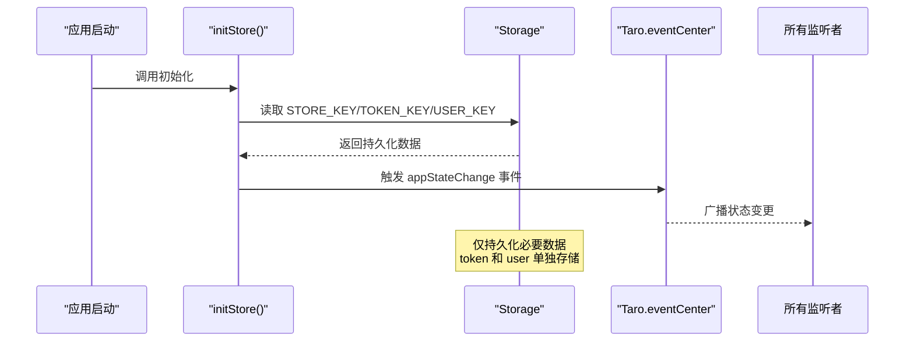
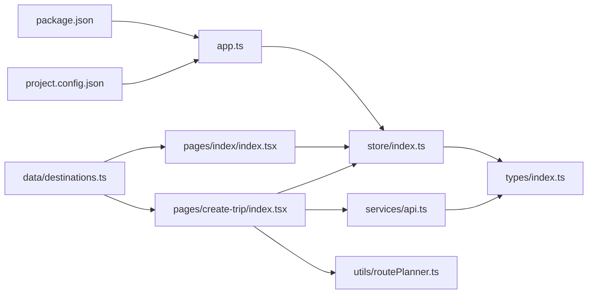

# 前端架构

<cite>
**本文引用的文件**
- [miniprogram/src/app.ts](file://miniprogram/src/app.ts)
- [miniprogram/src/store/index.ts](file://miniprogram/src/store/index.ts)
- [miniprogram/src/types/index.ts](file://miniprogram/src/types/index.ts)
- [miniprogram/src/pages/index/index.tsx](file://miniprogram/src/pages/index/index.tsx)
- [miniprogram/src/pages/create-trip/index.tsx](file://miniprogram/src/pages/create-trip/index.tsx)
- [miniprogram/src/services/api.ts](file://miniprogram/src/services/api.ts)
- [miniprogram/src/data/destinations.ts](file://miniprogram/src/data/destinations.ts)
- [miniprogram/src/utils/routePlanner.ts](file://miniprogram/src/utils/routePlanner.ts)
- [miniprogram/package.json](file://miniprogram/package.json)
- [miniprogram/project.config.json](file://miniprogram/project.config.json)
</cite>

## 目录
1. [简介](#简介)
2. [项目结构](#项目结构)
3. [核心组件](#核心组件)
4. [架构总览](#架构总览)
5. [组件与状态详解](#组件与状态详解)
6. [依赖关系分析](#依赖关系分析)
7. [性能考量](#性能考量)
8. [故障排查指南](#故障排查指南)
9. [结论](#结论)
10. [附录](#附录)

## 简介
本文件面向旅行规划 Demo 的前端架构，围绕基于 Taro 4 + React + TypeScript 的小程序架构进行系统性技术说明。重点涵盖：
- 小程序页面结构与路由系统
- 基于 Taro 事件系统 + Storage 的全局状态管理
- 组件化结构与页面组织
- TypeScript 类型体系与类型安全
- 组件间通信、事件处理与生命周期管理
- 构建配置、开发工具链与性能优化策略
- 面向不同经验层次开发者的分层解读

## 项目结构
前端采用 Taro 4 的小程序架构，基于 React 组件体系：
- 应用入口与根组件：在 app.ts 中初始化全局状态，通过 Provider 层包裹应用
- 状态管理层：基于 Taro 事件系统和 Storage 的全局状态管理
- 页面层：各页面组件负责具体业务视图，如首页、行程创建、规划器等
- 类型层：集中定义数据模型与枚举，确保跨模块类型一致
- 服务层：封装 API 请求与业务逻辑
- 工具层：包含路线规划算法等核心业务逻辑



**图表来源**
- [miniprogram/src/app.ts:1-11](file://miniprogram/src/app.ts#L1-L11)
- [miniprogram/src/store/index.ts:1-175](file://miniprogram/src/store/index.ts#L1-L175)
- [miniprogram/src/services/api.ts:1-102](file://miniprogram/src/services/api.ts#L1-L102)
- [miniprogram/src/types/index.ts:1-180](file://miniprogram/src/types/index.ts#L1-L180)
- [miniprogram/src/utils/routePlanner.ts:1-800](file://miniprogram/src/utils/routePlanner.ts#L1-L800)
- [miniprogram/src/data/destinations.ts:1-800](file://miniprogram/src/data/destinations.ts#L1-L800)
- [miniprogram/package.json:1-61](file://miniprogram/package.json#L1-L61)
- [miniprogram/project.config.json:1-44](file://miniprogram/project.config.json#L1-L44)

**章节来源**
- [miniprogram/src/app.ts:1-11](file://miniprogram/src/app.ts#L1-L11)
- [miniprogram/src/store/index.ts:1-175](file://miniprogram/src/store/index.ts#L1-L175)

## 核心组件
- 全局状态管理：基于 Taro 事件系统和 Storage 的状态管理，替代 Web 端的 React Context
- 页面组件：基于 Taro Components 的小程序组件，支持 JSX 语法
- API 服务：封装 Taro.request 的统一请求层，处理认证和错误
- 类型系统：集中定义 Trip、DayPlan、ItineraryItem、HotelPOI、User 等核心类型
- 路线规划：复杂的多目标优化算法，包含地理聚类、贪心路由、2-opt 改进等

**章节来源**
- [miniprogram/src/store/index.ts:1-175](file://miniprogram/src/store/index.ts#L1-L175)
- [miniprogram/src/services/api.ts:1-102](file://miniprogram/src/services/api.ts#L1-L102)
- [miniprogram/src/types/index.ts:1-180](file://miniprogram/src/types/index.ts#L1-L180)
- [miniprogram/src/utils/routePlanner.ts:1-800](file://miniprogram/src/utils/routePlanner.ts#L1-L800)

## 架构总览
整体采用"全局状态 + 页面组件 + 服务层"的三层架构：
- 全局状态层：基于 Taro 事件系统实现跨页面状态共享，结合 Storage 实现持久化
- 视图层：各页面组件负责具体业务视图，通过全局状态进行数据绑定
- 交互层：组件通过状态管理 API 获取状态与派发动作，实现跨组件通信
- 类型层：所有状态与 API 数据均以类型约束，降低运行期风险

```mermaid
graph TB
subgraph "应用入口"
APP["app.ts<br/>初始化全局状态"]
END
subgraph "全局状态管理"
STORE["store/index.ts<br/>基于 Taro 事件系统 + Storage"]
END
subgraph "页面组件"
HOME["pages/index/index.tsx<br/>首页搜索与推荐"]
CREATE["pages/create-trip/index.tsx<br/>行程创建流程"]
DETAIL["pages/detail/index.tsx<br/>POI 详情"]
HOTEL["pages/hotel-detail/index.tsx<br/>酒店详情"]
END
subgraph "服务层"
API["services/api.ts<br/>HTTP 请求封装"]
DATA["data/destinations.ts<br/>城市与 POI 数据"]
UTIL["utils/routePlanner.ts<br/>路线规划算法"]
END
subgraph "类型系统"
TYPES["types/index.ts<br/>共享数据模型"]
END
APP --> STORE
STORE --> HOME
STORE --> CREATE
STORE --> DETAIL
STORE --> HOTEL
HOME --> DATA
CREATE --> API
CREATE --> UTIL
STORE --> TYPES
API --> TYPES
```

**图表来源**
- [miniprogram/src/app.ts:1-11](file://miniprogram/src/app.ts#L1-L11)
- [miniprogram/src/store/index.ts:1-175](file://miniprogram/src/store/index.ts#L1-L175)
- [miniprogram/src/pages/index/index.tsx:1-393](file://miniprogram/src/pages/index/index.tsx#L1-L393)
- [miniprogram/src/pages/create-trip/index.tsx:1-800](file://miniprogram/src/pages/create-trip/index.tsx#L1-L800)
- [miniprogram/src/services/api.ts:1-102](file://miniprogram/src/services/api.ts#L1-L102)
- [miniprogram/src/data/destinations.ts:1-800](file://miniprogram/src/data/destinations.ts#L1-L800)
- [miniprogram/src/utils/routePlanner.ts:1-800](file://miniprogram/src/utils/routePlanner.ts#L1-L800)
- [miniprogram/src/types/index.ts:1-180](file://miniprogram/src/types/index.ts#L1-L180)

## 组件与状态详解

### 全局状态管理：基于 Taro 事件系统
- 设计要点
  - 使用 Taro.eventCenter 实现跨页面状态通知，替代 Web 端的 React Context
  - 结合 Taro.getStorage/Taro.setStorage 实现状态持久化
  - 通过事件总线实现状态变更的广播机制
- 关键能力
  - initStore：应用启动时从 Storage 恢复状态
  - getState/setState：获取和更新状态，自动持久化非运行时数据
  - onStateChange：订阅状态变化事件
  - clearStore：清理所有状态
- 最佳实践
  - 仅持久化必要的状态数据，避免 Storage 泄漏
  - 使用事件命名空间避免冲突
  - 在组件卸载时及时清理事件监听



**图表来源**
- [miniprogram/src/store/index.ts:58-123](file://miniprogram/src/store/index.ts#L58-L123)

**章节来源**
- [miniprogram/src/store/index.ts:1-175](file://miniprogram/src/store/index.ts#L1-L175)

### 页面组件：基于 Taro Components
- 设计要点
  - 使用 @tarojs/components 提供的原生小程序组件
  - 通过 Taro.useDidShow 等生命周期钩子处理页面显示逻辑
  - 使用 setState/getState 进行状态管理
- 关键流程
  - 首页：城市搜索、推荐、标签快速选择
  - 创建行程：7 步流程，包含目的地选择、日期设置、住宿选择、POI 选择、路线规划、预览、保存
  - 详情页：POI 和酒店详情展示
- 最佳实践
  - 合理使用 useMemo/useCallback 优化渲染性能
  - 使用 Taro.showToast/Taro.showLoading 等 API 提升用户体验
  - 通过 Taro.switchTab 实现页面跳转

**章节来源**
- [miniprogram/src/pages/index/index.tsx:1-393](file://miniprogram/src/pages/index/index.tsx#L1-L393)
- [miniprogram/src/pages/create-trip/index.tsx:1-800](file://miniprogram/src/pages/create-trip/index.tsx#L1-L800)

### API 服务：统一请求封装
- 设计要点
  - 基于 Taro.request 封装统一的 HTTP 客户端
  - 自动注入认证头信息
  - 统一处理 401 未授权状态
- 关键能力
  - request 函数：通用请求封装
  - api 对象：包含所有业务 API 方法
  - 错误处理：网络异常和业务错误统一处理
- 最佳实践
  - 在请求前检查 token 状态
  - 使用 Promise 风格处理异步操作
  - 合理设置超时时间和重试机制

**章节来源**
- [miniprogram/src/services/api.ts:1-102](file://miniprogram/src/services/api.ts#L1-L102)

### 类型系统：共享数据模型
- 设计要点
  - 集中定义所有业务数据类型的接口
  - 包含 Trip、DayPlan、ItineraryItem、HotelPOI、User 等核心类型
  - 支持小程序和 Web 端的类型兼容
- 关键能力
  - 完整的数据结构定义
  - 可选字段和默认值处理
  - 类型推导和编译时检查
- 最佳实践
  - 优先使用只读属性
  - 明确字段的可空性和默认值
  - 通过接口继承实现类型复用

**章节来源**
- [miniprogram/src/types/index.ts:1-180](file://miniprogram/src/types/index.ts#L1-L180)

### 路线规划：智能算法引擎
- 设计要点
  - 多目标优化：地理聚类、时间窗口、反向回溯惩罚
  - 智能餐食插入：基于地理位置和时间的三餐安排
  - 自动填充：空闲时间段的推荐景点填充
  - 2-opt 局部搜索：优化整体路线距离
- 关键能力
  - generateItinerary：主要调度算法入口
  - classifyPOIs：POI 分类和预处理
  - greedyRouteWithDirection：带方向性的贪心路由
  - twoOptImprove：2-opt 局部搜索改进
- 最佳实践
  - 合理设置时间窗口和开放时间约束
  - 通过 mustVisitIds 确保必打卡景点不被遗漏
  - 使用 autoFillGaps 填充空闲时间段

**章节来源**
- [miniprogram/src/utils/routePlanner.ts:1-800](file://miniprogram/src/utils/routePlanner.ts#L1-L800)

## 依赖关系分析
- 组件依赖
  - 页面组件依赖全局状态管理 API
  - API 服务依赖全局状态获取认证信息
  - 路线规划算法依赖类型定义和数据源
- 类型依赖
  - 所有模块均依赖 types/index.ts 中的类型定义
- 构建与配置
  - Taro 4 + React + TypeScript 技术栈
  - 微信小程序平台特定的编译和部署配置



**图表来源**
- [miniprogram/src/app.ts:1-11](file://miniprogram/src/app.ts#L1-L11)
- [miniprogram/src/store/index.ts:1-175](file://miniprogram/src/store/index.ts#L1-L175)
- [miniprogram/src/pages/index/index.tsx:1-393](file://miniprogram/src/pages/index/index.tsx#L1-L393)
- [miniprogram/src/pages/create-trip/index.tsx:1-800](file://miniprogram/src/pages/create-trip/index.tsx#L1-L800)
- [miniprogram/src/services/api.ts:1-102](file://miniprogram/src/services/api.ts#L1-L102)
- [miniprogram/src/utils/routePlanner.ts:1-800](file://miniprogram/src/utils/routePlanner.ts#L1-L800)
- [miniprogram/src/types/index.ts:1-180](file://miniprogram/src/types/index.ts#L1-L180)
- [miniprogram/src/data/destinations.ts:1-800](file://miniprogram/src/data/destinations.ts#L1-L800)
- [miniprogram/package.json:1-61](file://miniprogram/package.json#L1-L61)
- [miniprogram/project.config.json:1-44](file://miniprogram/project.config.json#L1-L44)

**章节来源**
- [miniprogram/package.json:1-61](file://miniprogram/package.json#L1-L61)
- [miniprogram/project.config.json:1-44](file://miniprogram/project.config.json#L1-L44)

## 性能考量
- 状态持久化优化
  - 仅持久化必要的状态数据，避免 Storage 泄漏
  - 使用事件通知机制减少不必要的状态同步
- 渲染性能优化
  - 页面组件使用 useMemo/useCallback 缓存计算结果
  - 合理使用 Taro 的虚拟列表和懒加载
- 网络请求优化
  - API 服务层统一处理缓存和去重
  - 合理设置请求超时和重试策略
- 算法性能优化
  - 路线规划算法使用贪心 + 局部搜索的混合策略
  - 通过地理聚类减少搜索空间

**章节来源**
- [miniprogram/src/store/index.ts:80-123](file://miniprogram/src/store/index.ts#L80-L123)
- [miniprogram/src/pages/index/index.tsx:44-51](file://miniprogram/src/pages/index/index.tsx#L44-L51)
- [miniprogram/src/services/api.ts:15-47](file://miniprogram/src/services/api.ts#L15-L47)
- [miniprogram/src/utils/routePlanner.ts:173-250](file://miniprogram/src/utils/routePlanner.ts#L173-L250)

## 故障排查指南
- 状态不同步问题
  - 检查 Taro.eventCenter 的事件监听是否正确注册
  - 确认状态持久化的键名是否一致
  - 验证 initStore 是否在应用启动时正确调用
- 页面跳转异常
  - 检查 Taro.switchTab 的 URL 格式是否正确
  - 确认页面配置文件中的路径映射
  - 验证页面组件的生命周期钩子是否正确处理
- API 请求失败
  - 查看网络请求的日志输出
  - 检查认证头信息是否正确注入
  - 确认服务器响应格式是否符合预期
- 路线规划异常
  - 检查 POI 数据的完整性和有效性
  - 验证时间窗口和开放时间约束
  - 确认地理坐标数据的准确性

**章节来源**
- [miniprogram/src/store/index.ts:112-123](file://miniprogram/src/store/index.ts#L112-L123)
- [miniprogram/src/services/api.ts:33-47](file://miniprogram/src/services/api.ts#L33-L47)
- [miniprogram/src/utils/routePlanner.ts:86-111](file://miniprogram/src/utils/routePlanner.ts#L86-L111)

## 结论
该前端架构以 Taro 4 + React + TypeScript 为基础，通过基于事件系统和 Storage 的全局状态管理，实现了小程序端的高效开发。相比 Web 端的 React Context，小程序架构具有更好的性能表现和更低的内存占用。建议在后续迭代中持续完善：
- 增加状态管理的单元测试覆盖
- 优化路线规划算法的性能和准确性
- 完善错误处理和用户反馈机制
- 考虑引入状态快照和撤销重做功能

## 附录
- 构建与开发脚本
  - build:weapp：构建微信小程序版本
  - dev:weapp：开发模式构建并监听文件变化
  - build:h5：构建 H5 版本（用于对比测试）
  - dev:h5：H5 开发模式
- Taro 4 配置要点
  - React 18 + TypeScript 技术栈
  - 微信小程序平台特定的编译选项
  - TailwindCSS 与小程序的集成配置
- 小程序平台特性
  - 基于原生组件的高性能渲染
  - 事件系统和 Storage 的本地存储
  - 生命周期钩子的页面管理

**章节来源**
- [miniprogram/package.json:11-16](file://miniprogram/package.json#L11-L16)
- [miniprogram/project.config.json:1-44](file://miniprogram/project.config.json#L1-L44)