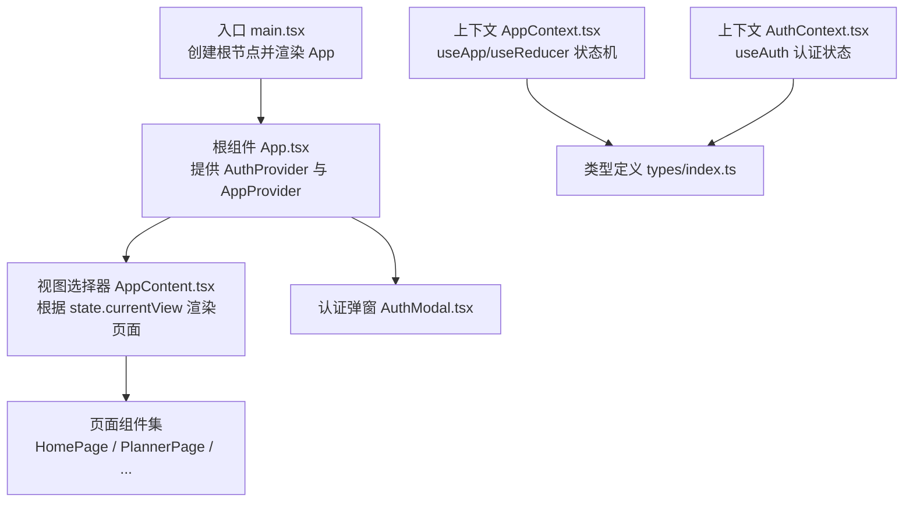
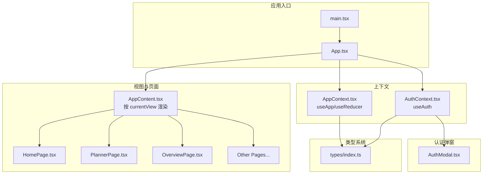
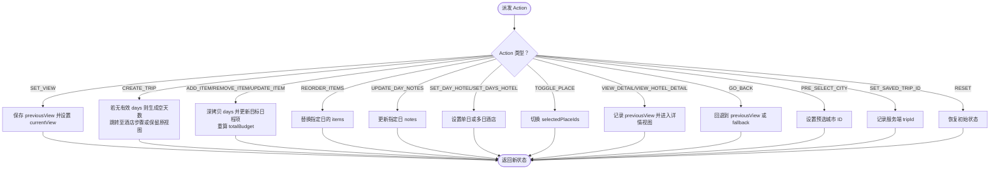
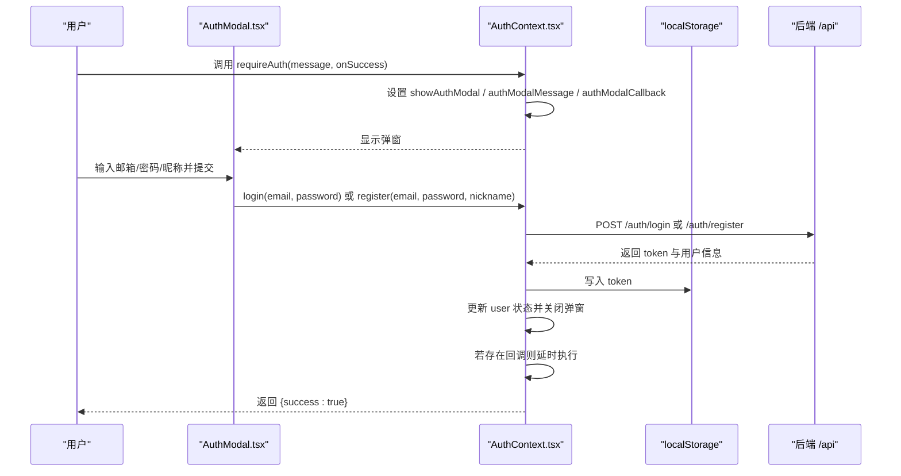
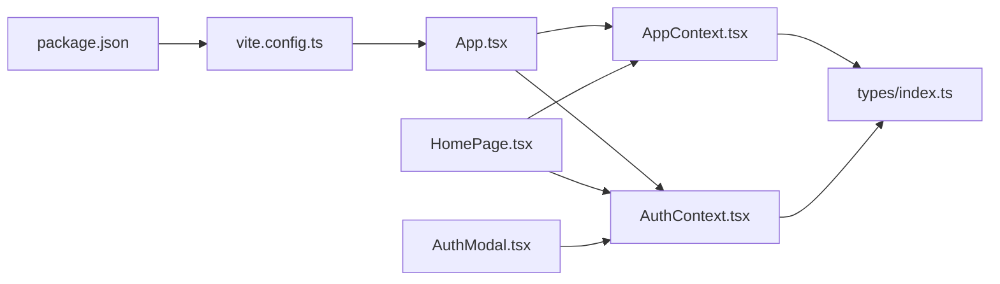

# 前端架构

<cite>
**本文引用的文件**
- [src/App.tsx](file://src/App.tsx)
- [src/main.tsx](file://src/main.tsx)
- [src/context/AppContext.tsx](file://src/context/AppContext.tsx)
- [src/context/AuthContext.tsx](file://src/context/AuthContext.tsx)
- [src/components/AuthModal.tsx](file://src/components/AuthModal.tsx)
- [src/types/index.ts](file://src/types/index.ts)
- [src/pages/HomePage.tsx](file://src/pages/HomePage.tsx)
- [vite.config.ts](file://vite.config.ts)
- [package.json](file://package.json)
</cite>

## 目录
1. [简介](#简介)
2. [项目结构](#项目结构)
3. [核心组件](#核心组件)
4. [架构总览](#架构总览)
5. [组件与状态详解](#组件与状态详解)
6. [依赖关系分析](#依赖关系分析)
7. [性能考量](#性能考量)
8. [故障排查指南](#故障排查指南)
9. [结论](#结论)
10. [附录](#附录)

## 简介
本文件面向旅行规划 Demo 的前端架构，围绕基于 React 18 的应用进行系统性技术说明。重点涵盖：
- 组件化结构与页面组织
- 全局状态管理（AppContext 与 AuthContext）
- 视图切换与导航控制
- TypeScript 类型体系与类型安全
- 组件间通信、事件处理与生命周期管理
- 构建配置、开发工具链与性能优化策略
- 面向不同经验层次开发者的分层解读

## 项目结构
前端采用“按功能域分层 + 路由驱动”的组织方式：
- 应用入口与根组件：在入口文件中挂载 StrictMode，并通过 Provider 层包裹应用；根组件根据当前视图渲染对应页面。
- 上下文层：AppContext 提供行程与视图状态，AuthContext 提供认证与用户态。
- 页面层：各页面组件负责具体业务视图，如首页、行程创建、规划器等。
- 类型层：集中定义数据模型与枚举，确保跨模块类型一致。
- UI 组件：通用 UI 组件封装于 components/ui 与 admin/components/ui，便于复用。

图表来源
- [src/main.tsx:1-10](file://src/main.tsx#L1-L10)
- [src/App.tsx:1-62](file://src/App.tsx#L1-L62)
- [src/context/AppContext.tsx:1-234](file://src/context/AppContext.tsx#L1-L234)
- [src/context/AuthContext.tsx:1-218](file://src/context/AuthContext.tsx#L1-L218)
- [src/components/AuthModal.tsx:1-141](file://src/components/AuthModal.tsx#L1-L141)
- [src/types/index.ts:1-239](file://src/types/index.ts#L1-L239)

章节来源
- [src/main.tsx:1-10](file://src/main.tsx#L1-L10)
- [src/App.tsx:1-62](file://src/App.tsx#L1-L62)

## 核心组件
- AppProvider 与 useApp：基于 useReducer 的行程状态机，统一管理视图、行程、日程、预算、详情页等状态。
- AuthProvider 与 useAuth：基于 useState 的认证状态机，负责登录、注册、登出、令牌持久化与鉴权头注入。
- AuthModal：受控显示的认证弹窗，支持登录/注册切换与表单校验反馈。
- 类型系统：集中定义 Trip、DayPlan、ItineraryItem、HotelPOI、User 等核心类型，配合 AppView 枚举保障视图切换类型安全。

章节来源
- [src/context/AppContext.tsx:1-234](file://src/context/AppContext.tsx#L1-L234)
- [src/context/AuthContext.tsx:1-218](file://src/context/AuthContext.tsx#L1-L218)
- [src/components/AuthModal.tsx:1-141](file://src/components/AuthModal.tsx#L1-L141)
- [src/types/index.ts:1-239](file://src/types/index.ts#L1-L239)

## 架构总览
整体采用“Provider 包裹 + Context 分层 + 页面路由式渲染”的架构：
- Provider 层：在根组件中同时提供 AppProvider 与 AuthProvider，保证全局状态可用。
- 视图层：AppContent 根据 state.currentView 切换页面，形成“单页多视图”的导航模式。
- 交互层：组件通过 useApp/useAuth 获取状态与派发动作，实现跨组件通信。
- 类型层：所有状态与 API 数据均以类型约束，降低运行期风险。

图表来源
- [src/main.tsx:1-10](file://src/main.tsx#L1-L10)
- [src/App.tsx:1-62](file://src/App.tsx#L1-L62)
- [src/context/AppContext.tsx:1-234](file://src/context/AppContext.tsx#L1-L234)
- [src/context/AuthContext.tsx:1-218](file://src/context/AuthContext.tsx#L1-L218)
- [src/components/AuthModal.tsx:1-141](file://src/components/AuthModal.tsx#L1-L141)
- [src/types/index.ts:1-239](file://src/types/index.ts#L1-L239)

## 组件与状态详解

### AppContext：行程与视图状态管理
- 设计要点
  - 使用 useReducer 将复杂状态与派发逻辑集中在 reducer 中，便于追踪状态变更与调试。
  - 通过 Action 类型约束派发动作，避免误用与遗漏分支。
  - 将“视图状态”与“业务数据”解耦：currentView/previousView 控制导航；currentTrip/days/items 管理行程数据。
- 关键能力
  - 视图切换：SET_VIEW、GO_BACK、PRE_SELECT_CITY
  - 行程编辑：ADD_ITEM/REMOVE_ITEM/UPDATE_ITEM/REORDER_ITEMS
  - 日程管理：UPDATE_DAY_NOTES/SET_DAY_HOTEL/SET_DAYS_HOTEL
  - 预算计算：recalcBudget 在每次变更后自动重算
  - 详情页：VIEW_DETAIL/VIEW_HOTEL_DETAIL
- 最佳实践
  - 所有对 currentTrip 的修改均返回新对象或新数组，保持不可变性。
  - 对批量更新（如 SET_ALL_DAYS_ITEMS）进行索引范围检查，避免越界。
  - 在 CREATE_TRIP 时智能判断是否需要自动生成空天数列表。

图表来源
- [src/context/AppContext.tsx:83-212](file://src/context/AppContext.tsx#L83-L212)

章节来源
- [src/context/AppContext.tsx:1-234](file://src/context/AppContext.tsx#L1-L234)

### AuthContext：认证与用户态
- 设计要点
  - 初始化阶段从 localStorage 读取 token 并调用 /auth/me 校验，失败则清理本地存储。
  - 提供 login/register/logout 三大核心动作，以及 requireAuth 弹窗触发与回调队列。
  - getAuthHeaders 自动注入 Authorization 头，简化 API 调用。
- 关键流程
  - 登录成功后写入 token，关闭弹窗并执行 pending 回调。
  - 支持发送验证码与重置密码，支持更新昵称。
- 最佳实践
  - 将 token 存储在 localStorage，注意生产环境建议使用 HttpOnly Cookie。
  - 对 API 错误进行统一提示，区分网络异常与业务错误。

图表来源
- [src/context/AuthContext.tsx:78-121](file://src/context/AuthContext.tsx#L78-L121)
- [src/context/AuthContext.tsx:128-141](file://src/context/AuthContext.tsx#L128-L141)
- [src/components/AuthModal.tsx:20-33](file://src/components/AuthModal.tsx#L20-L33)

章节来源
- [src/context/AuthContext.tsx:1-218](file://src/context/AuthContext.tsx#L1-L218)
- [src/components/AuthModal.tsx:1-141](file://src/components/AuthModal.tsx#L1-L141)

### App.tsx 与视图切换
- 设计要点
  - AppContent 根据 AppContext.state.currentView 进行 switch-case 渲染，default 回退到首页。
  - 在 App 根部同时提供 AuthProvider 与 AppProvider，保证任意子树可访问认证与应用状态。
  - 在 AppContent 下方挂载 AuthModal，统一处理登录/注册弹窗。
- 最佳实践
  - 将“视图常量”收敛在 AppView 枚举中，避免魔法字符串。
  - 详情页回退使用 previousView，结合 GO_BACK 动作实现智能返回。

章节来源
- [src/App.tsx:1-62](file://src/App.tsx#L1-L62)

### HomePage：搜索与推荐
- 设计要点
  - 使用 useApp/useAuth 获取状态与动作，实现搜索、标签快速选择、国际/国内推荐切换。
  - 通过 useMemo 缓存搜索结果与分组数据，减少重复计算。
  - 通过 useCallback 优化事件处理器，降低子组件重渲染。
- 交互细节
  - 点击城市卡片触发 PRE_SELECT_CITY 与 SET_VIEW 切换到创建行程页。
  - requireAuth 可在未登录时弹出认证框，并在登录后回调执行导航。

章节来源
- [src/pages/HomePage.tsx:1-688](file://src/pages/HomePage.tsx#L1-L688)

### 类型系统：接口与枚举
- 设计要点
  - 以 types/index.ts 为中心，集中定义 Trip、DayPlan、ItineraryItem、HotelPOI、User、AppView 等核心类型。
  - 使用字面量联合类型（如 AppView）与接口组合，确保跨模块一致性。
  - 通过导出类型供上下文与页面组件使用，避免类型漂移。
- 最佳实践
  - 优先使用只读属性与可选字段，明确数据可空性。
  - 对日期、金额等数值字段明确单位与精度，避免歧义。

章节来源
- [src/types/index.ts:1-239](file://src/types/index.ts#L1-L239)

## 依赖关系分析
- 组件依赖
  - App.tsx 依赖 AppContext 与 AuthContext，用于视图切换与认证控制。
  - HomePage 同时依赖 AppContext 与 AuthContext，实现搜索、导航与认证拦截。
  - AuthModal 依赖 AuthContext，负责弹窗与表单提交。
- 类型依赖
  - AppContext 与 AuthContext 均依赖 types/index.ts 中的类型定义。
- 构建与代理
  - Vite 配置启用 React 插件、路径别名、开发代理与多入口打包（主站与 admin）。

图表来源
- [src/App.tsx:1-62](file://src/App.tsx#L1-L62)
- [src/context/AppContext.tsx:1-234](file://src/context/AppContext.tsx#L1-L234)
- [src/context/AuthContext.tsx:1-218](file://src/context/AuthContext.tsx#L1-L218)
- [src/components/AuthModal.tsx:1-141](file://src/components/AuthModal.tsx#L1-L141)
- [src/types/index.ts:1-239](file://src/types/index.ts#L1-L239)
- [vite.config.ts:1-46](file://vite.config.ts#L1-L46)
- [package.json:1-59](file://package.json#L1-L59)

章节来源
- [vite.config.ts:1-46](file://vite.config.ts#L1-L46)
- [package.json:1-59](file://package.json#L1-L59)

## 性能考量
- 状态不可变与浅比较
  - AppContext 的 reducer 始终返回新对象/新数组，利于 React 浅比较优化。
- 计算缓存
  - HomePage 使用 useMemo 缓存搜索结果与分组数据，减少渲染成本。
- 事件优化
  - 使用 useCallback 包装事件处理器，避免子组件不必要的重渲染。
- 构建与代理
  - Vite 开发服务器启用代理转发 /api 请求，减少跨域问题与调试复杂度。
  - 多入口打包支持主站与 admin 独立构建，提升开发效率。

章节来源
- [src/context/AppContext.tsx:83-212](file://src/context/AppContext.tsx#L83-L212)
- [src/pages/HomePage.tsx:49-55](file://src/pages/HomePage.tsx#L49-L55)
- [vite.config.ts:36-44](file://vite.config.ts#L36-L44)

## 故障排查指南
- 认证弹窗不出现
  - 检查 requireAuth 是否被正确调用，确认 showAuthModal 与 authModalMessage 是否被设置。
  - 确认 AuthProvider 是否包裹在 App.tsx 根部。
- 登录失败
  - 查看 AuthContext 的 login 实现与后端 /auth/login 接口响应，关注错误消息与网络异常分支。
  - 确认 localStorage 中是否存在 token，必要时清理后重试。
- 视图切换异常
  - 检查 AppContent 的 switch-case 与 AppView 枚举是否匹配。
  - 确认 GO_BACK 的 fallback 是否合理，避免回退到未知视图。
- 预选城市无效
  - 确认 PRE_SELECT_CITY 是否在 CreateTripPage 中被消费，以及 SET_VIEW 是否切换到 create。

章节来源
- [src/context/AuthContext.tsx:128-141](file://src/context/AuthContext.tsx#L128-L141)
- [src/context/AuthContext.tsx:78-99](file://src/context/AuthContext.tsx#L78-L99)
- [src/App.tsx:17-48](file://src/App.tsx#L17-L48)

## 结论
该前端架构以 React 18 为基础，通过 AppContext 与 AuthContext 实现清晰的状态分层与跨组件通信，结合类型系统与构建工具链，提供了良好的开发体验与可维护性。建议在后续迭代中持续完善：
- 将路由系统引入，进一步解耦视图切换与页面渲染。
- 对关键 reducer 分支增加单元测试，保障状态机稳定性。
- 在生产环境替换 localStorage 为更安全的令牌存储方案。

## 附录
- 构建与开发脚本
  - dev：启动 Vite 开发服务器
  - dev:all：并行启动前端与后端服务
  - build：构建前端与服务端
  - server：启动后端服务
  - admin:dev：启动 admin 子站开发
- Vite 配置要点
  - 路径别名 @ 与 @admin
  - 代理 /api 到后端
  - 多入口：main 与 admin
  - 开发中间件重写 /admin 与 /admin/ 到 admin.html

章节来源
- [package.json:6-25](file://package.json#L6-L25)
- [vite.config.ts:20-45](file://vite.config.ts#L20-L45)