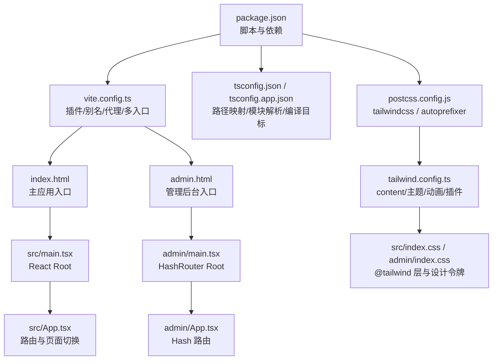
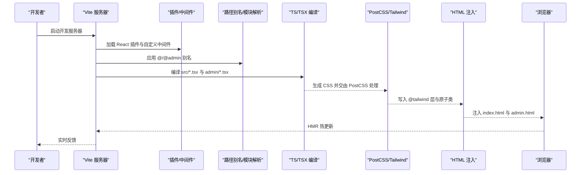
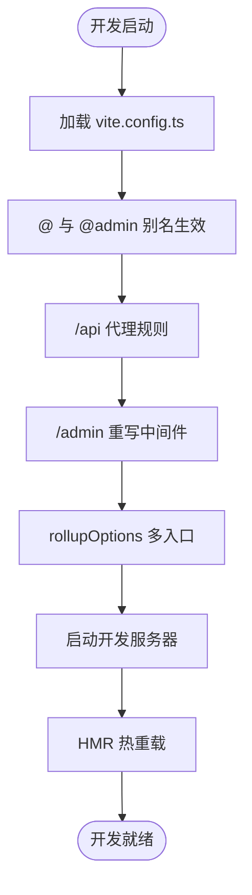
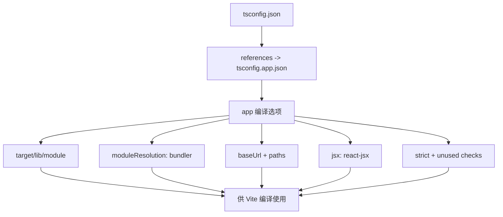
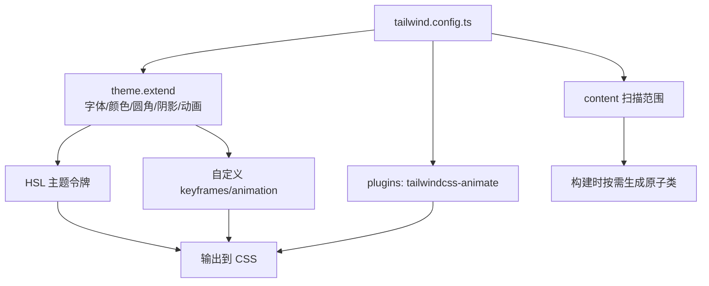
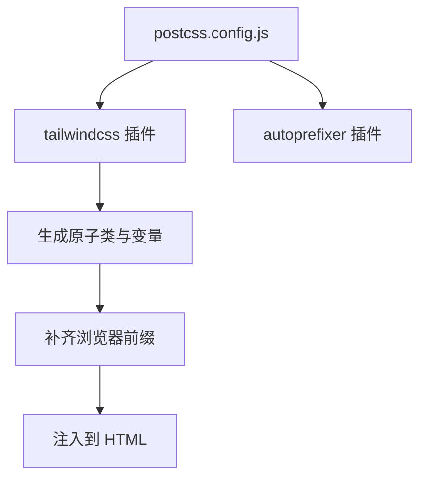
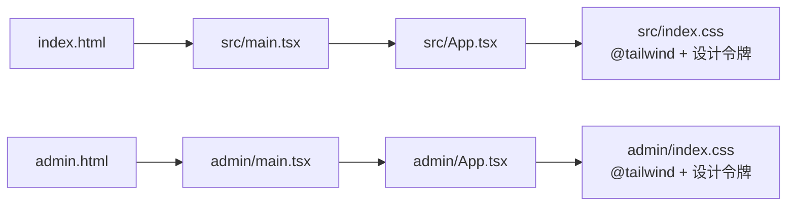
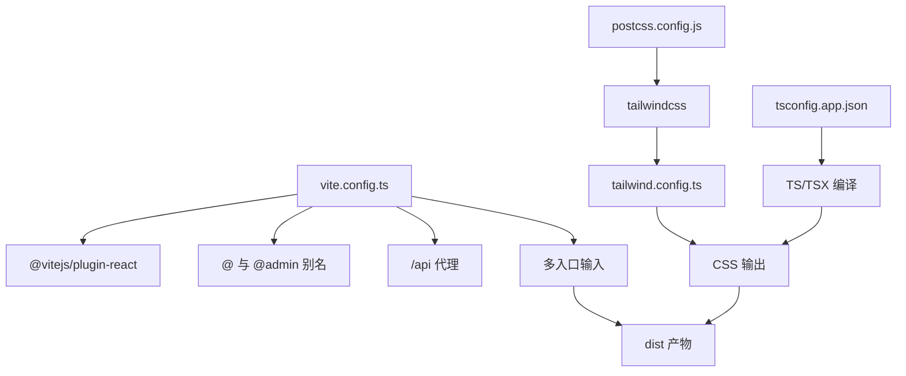

# 构建配置

<cite>
**本文引用的文件**
- [vite.config.ts](file://vite.config.ts)
- [package.json](file://package.json)
- [postcss.config.js](file://postcss.config.js)
- [tailwind.config.ts](file://tailwind.config.ts)
- [tsconfig.json](file://tsconfig.json)
- [tsconfig.app.json](file://tsconfig.app.json)
- [index.html](file://index.html)
- [admin.html](file://admin.html)
- [src/main.tsx](file://src/main.tsx)
- [admin/main.tsx](file://admin/main.tsx)
- [src/index.css](file://src/index.css)
- [admin/index.css](file://admin/index.css)
- [src/App.tsx](file://src/App.tsx)
- [admin/App.tsx](file://admin/App.tsx)
</cite>

## 目录
1. [简介](#简介)
2. [项目结构](#项目结构)
3. [核心组件](#核心组件)
4. [架构总览](#架构总览)
5. [详细组件分析](#详细组件分析)
6. [依赖关系分析](#依赖关系分析)
7. [性能考量](#性能考量)
8. [故障排查指南](#故障排查指南)
9. [结论](#结论)
10. [附录](#附录)

## 简介
本文件面向旅行规划 Demo 的前端构建配置，围绕 Vite 构建工具、TypeScript 编译、Tailwind CSS 与 PostCSS 处理链路进行系统化说明，并结合项目实际配置（开发服务器、代理、热重载、路径别名、多入口打包、样式主题与动画体系）给出可操作的优化建议与问题排查方法。文档同时覆盖开发与生产环境差异、构建产物分析与性能监控实践。

## 项目结构
该工程采用“单仓库多页面”结构：根目录下包含主应用与管理后台两个独立入口，分别对应不同的 HTML 入口与路由模式；样式通过 Tailwind CSS 按层组织，TypeScript 使用路径映射与严格编译选项；构建由 Vite 驱动，PostCSS 负责自动前缀与 Tailwind 处理。

图表来源
- [package.json:1-59](file://package.json#L1-L59)
- [vite.config.ts:1-46](file://vite.config.ts#L1-L46)
- [index.html:1-17](file://index.html#L1-L17)
- [admin.html:1-18](file://admin.html#L1-L18)
- [src/main.tsx:1-10](file://src/main.tsx#L1-L10)
- [admin/main.tsx:1-14](file://admin/main.tsx#L1-L14)
- [src/App.tsx:1-62](file://src/App.tsx#L1-L62)
- [admin/App.tsx:1-27](file://admin/App.tsx#L1-L27)
- [tsconfig.json:1-6](file://tsconfig.json#L1-L6)
- [tsconfig.app.json:1-27](file://tsconfig.app.json#L1-L27)
- [postcss.config.js:1-6](file://postcss.config.js#L1-L6)
- [tailwind.config.ts:1-139](file://tailwind.config.ts#L1-L139)
- [src/index.css:1-233](file://src/index.css#L1-L233)
- [admin/index.css:1-68](file://admin/index.css#L1-L68)

章节来源
- [package.json:1-59](file://package.json#L1-L59)
- [vite.config.ts:1-46](file://vite.config.ts#L1-L46)
- [index.html:1-17](file://index.html#L1-L17)
- [admin.html:1-18](file://admin.html#L1-L18)

## 核心组件
- Vite 配置与插件
  - 插件：React 插件用于 JSX 转换与 HMR；自定义中间件用于开发时将 /admin 与 /admin/ 重写到 admin.html，确保 SPA 访问体验。
  - 别名：@ 指向 src，@admin 指向 admin，便于跨域模块共享与路径统一。
  - 多入口：rollupOptions.input 明确 index.html 与 admin.html 对应的入口，实现双页分离构建。
  - 开发服务器：配置 /api 代理到本地后端服务地址，支持 changeOrigin 与非安全证书场景。
- TypeScript 配置
  - 根 tsconfig 引用 app 配置，避免重复声明。
  - app 配置：ESNext 模块系统、bundler 解析器、严格模式、React JSX、路径映射与 baseUrl。
- Tailwind CSS
  - content 覆盖主应用与管理后台源码与模板文件；主题扩展包含字体、颜色、圆角、阴影、动画；启用 tailwindcss-animate 插件。
- PostCSS
  - 启用 tailwindcss 与 autoprefixer，保证原子类与浏览器兼容性。

章节来源
- [vite.config.ts:1-46](file://vite.config.ts#L1-L46)
- [tsconfig.json:1-6](file://tsconfig.json#L1-L6)
- [tsconfig.app.json:1-27](file://tsconfig.app.json#L1-L27)
- [tailwind.config.ts:1-139](file://tailwind.config.ts#L1-L139)
- [postcss.config.js:1-6](file://postcss.config.js#L1-L6)

## 架构总览
下图展示了从开发启动到构建完成的关键流程：Vite 读取配置、加载插件与别名、启动开发服务器与代理、编译 TS/TSX、处理 CSS（PostCSS/Tailwind）、注入 HTML、以及最终的多入口产物输出。

图表来源
- [vite.config.ts:1-46](file://vite.config.ts#L1-L46)
- [postcss.config.js:1-6](file://postcss.config.js#L1-L6)
- [tsconfig.app.json:1-27](file://tsconfig.app.json#L1-L27)
- [index.html:1-17](file://index.html#L1-L17)
- [admin.html:1-18](file://admin.html#L1-L18)

## 详细组件分析

### Vite 配置与开发服务器
- 自定义中间件：在开发阶段拦截 /admin 与 /admin/ 请求，将其重写为 admin.html，避免刷新后 404 或路由不生效的问题。
- 别名与解析：@ 指向 src，@admin 指向 admin，提升导入一致性与可维护性。
- 多入口与 Rollup：明确 main 与 admin 两个入口，分别对应 index.html 与 admin.html，实现双页独立构建。
- 代理：/api 代理至本地后端（127.0.0.1:3001），changeOrigin 与 secure 适配常见开发环境。
- 热重载：React 插件与 TS/TSX 文件变更触发 HMR，提升迭代效率。

图表来源
- [vite.config.ts:1-46](file://vite.config.ts#L1-L46)

章节来源
- [vite.config.ts:1-46](file://vite.config.ts#L1-L46)

### TypeScript 编译配置
- 根配置：通过 references 引入 app 配置，避免重复定义。
- app 配置要点：
  - 目标与库：ES2020 + DOM 扩展，适配现代浏览器与新特性。
  - 模块系统：ESNext + bundler 解析器，利于 Vite/打包器进行 Tree Shaking。
  - JSX：react-jsx，配合 React 18 与 Vite 生态。
  - 路径映射：baseUrl 与 paths，与 Vite 别名保持一致，减少路径错误。
  - 严格性：开启严格模式与多项检查，降低运行期风险。
  - 仅编译：noEmit，由 Vite/Rollup 输出产物。

图表来源
- [tsconfig.json:1-6](file://tsconfig.json#L1-L6)
- [tsconfig.app.json:1-27](file://tsconfig.app.json#L1-L27)

章节来源
- [tsconfig.json:1-6](file://tsconfig.json#L1-L6)
- [tsconfig.app.json:1-27](file://tsconfig.app.json#L1-L27)

### Tailwind CSS 定制配置
- 内容扫描：覆盖 index.html、src/**/*.{ts,tsx}、admin.html、admin/**/*.{ts,tsx}，确保按需生成原子类。
- 设计系统：
  - 字体：sans 使用 Inter 与 Noto Sans SC 系列，提升中英文排版一致性。
  - 颜色：基于 HSL 变量的主题令牌，支持 primary/secondary/muted 等语义色与品牌色（coral/sunset/ocean/sand/journal）。
  - 圆角与阴影：统一的 border-radius 与多种阴影变体，支撑卡片、浮层与笔记等组件风格。
  - 动画：扩展 keyframes 与 animation，提供 accordion/fade/slide/scale/pulse/float 等常用动效。
- 插件：启用 tailwindcss-animate，增强动画类与过渡控制。

图表来源
- [tailwind.config.ts:1-139](file://tailwind.config.ts#L1-L139)

章节来源
- [tailwind.config.ts:1-139](file://tailwind.config.ts#L1-L139)

### PostCSS 处理流程与插件
- 插件链：tailwindcss → autoprefixer。
- 流程：先由 Tailwind 生成原子类与设计系统变量，再由 Autoprefixer 补齐浏览器前缀，最终注入到 HTML 中。

图表来源
- [postcss.config.js:1-6](file://postcss.config.js#L1-L6)

章节来源
- [postcss.config.js:1-6](file://postcss.config.js#L1-L6)

### 样式体系与入口
- 主应用样式：通过 @tailwind base/components/utilities 分层引入，定义全局设计令牌、滚动条、渐变、阴影、动效与工具类。
- 管理后台样式：独立的 @tailwind 基础层，定义后台专用主题令牌（如 sidebar/header 尺寸、成功/警告/信息色）。
- 入口脚本：主应用与管理后台分别在 index.html 与 admin.html 中挂载各自的 React Root，并选择合适的路由模式（BrowserRouter vs HashRouter）。

图表来源
- [index.html:1-17](file://index.html#L1-L17)
- [admin.html:1-18](file://admin.html#L1-L18)
- [src/main.tsx:1-10](file://src/main.tsx#L1-L10)
- [admin/main.tsx:1-14](file://admin/main.tsx#L1-L14)
- [src/App.tsx:1-62](file://src/App.tsx#L1-L62)
- [admin/App.tsx:1-27](file://admin/App.tsx#L1-L27)
- [src/index.css:1-233](file://src/index.css#L1-L233)
- [admin/index.css:1-68](file://admin/index.css#L1-L68)

章节来源
- [index.html:1-17](file://index.html#L1-L17)
- [admin.html:1-18](file://admin.html#L1-L18)
- [src/main.tsx:1-10](file://src/main.tsx#L1-L10)
- [admin/main.tsx:1-14](file://admin/main.tsx#L1-L14)
- [src/App.tsx:1-62](file://src/App.tsx#L1-L62)
- [admin/App.tsx:1-27](file://admin/App.tsx#L1-L27)
- [src/index.css:1-233](file://src/index.css#L1-L233)
- [admin/index.css:1-68](file://admin/index.css#L1-L68)

## 依赖关系分析
- 构建链路依赖：Vite 依赖 React 插件与自定义中间件；TypeScript 依赖 tsconfig.app.json 提供的编译参数；Tailwind 依赖 postcss.config.js 与 tailwind.config.ts；CSS 依赖 @tailwind 指令与设计令牌。
- 运行时依赖：主应用与管理后台分别挂载不同路由模式与页面集合，样式分层隔离，互不影响。

图表来源
- [vite.config.ts:1-46](file://vite.config.ts#L1-L46)
- [tsconfig.app.json:1-27](file://tsconfig.app.json#L1-L27)
- [postcss.config.js:1-6](file://postcss.config.js#L1-L6)
- [tailwind.config.ts:1-139](file://tailwind.config.ts#L1-L139)

章节来源
- [vite.config.ts:1-46](file://vite.config.ts#L1-L46)
- [tsconfig.app.json:1-27](file://tsconfig.app.json#L1-L27)
- [postcss.config.js:1-6](file://postcss.config.js#L1-L6)
- [tailwind.config.ts:1-139](file://tailwind.config.ts#L1-L139)

## 性能考量
- 代码分割与懒加载
  - 页面级路由建议使用 React.lazy 与 Suspense，结合动态 import，实现按需加载与更小的首屏包体。
  - 组件库与第三方包尽量拆分为独立 chunk，避免将大体积依赖打入公共入口。
- Tree Shaking
  - 使用 ES Module 导出与 bundler 解析器，确保未使用的导出被移除；避免副作用与命名空间导入导致的全量打包。
- Bundle 分析
  - 在 Vite 中集成可视化分析工具（如 rollup-plugin-visualizer），在构建后生成 bundle 报告，定位大体积依赖与重复模块。
- 资源优化
  - 图片与字体资源建议预压缩与按需加载；CSS 采用按需生成，避免冗余原子类。
- 开发与生产差异
  - 开发环境强调 HMR 与调试友好；生产环境启用压缩、最小化与长缓存策略，确保加载速度与稳定性。

## 故障排查指南
- /admin 访问 404 或路由不生效
  - 确认开发服务器已加载自定义中间件，/admin 与 /admin/ 已被重写为 admin.html。
  - 检查 admin.html 是否正确挂载 HashRouter。
- 代理 /api 失败
  - 确认后端服务已启动且监听地址与代理 target 一致；若为 HTTPS，secure 配置需根据实际情况调整。
- 别名导入报错
  - 确保 tsconfig.app.json 的 baseUrl 与 paths 与 Vite 别名一致；重启编辑器或重新加载 TS 服务。
- Tailwind 原子类未生效
  - 检查 tailwind.config.ts 的 content 范围是否包含对应源文件；确认 postcss.config.js 启用了 tailwindcss 与 autoprefixer。
- 样式冲突
  - 主应用与管理后台样式分层清晰，避免跨层污染；如需共享样式，建议抽象为通用组件或工具类。

章节来源
- [vite.config.ts:1-46](file://vite.config.ts#L1-L46)
- [admin.html:1-18](file://admin.html#L1-L18)
- [tailwind.config.ts:1-139](file://tailwind.config.ts#L1-L139)
- [postcss.config.js:1-6](file://postcss.config.js#L1-L6)
- [tsconfig.app.json:1-27](file://tsconfig.app.json#L1-L27)

## 结论
本项目以 Vite 为核心，结合 TypeScript、Tailwind CSS 与 PostCSS 形成高效、可维护的前端构建体系。通过多入口、路径别名、代理与 HMR，兼顾主应用与管理后台的开发体验；通过严格编译与按需 CSS 生成，保障产物质量与性能。建议在现有基础上进一步引入懒加载、可视化分析与资源优化策略，持续提升开发效率与用户体验。

## 附录
- 开发与生产脚本参考
  - 开发：vite（主应用）、vite --open /admin/（管理后台）
  - 预览：vite preview
  - 构建：vite build（前端）+ tsc -p server/tsconfig.build.json（后端）
- 关键配置清单
  - Vite：插件、别名、代理、多入口
  - TypeScript：target/lib/moduleResolution/jsx/paths
  - Tailwind：content/theme/extend/plugins
  - PostCSS：tailwindcss/autoprefixer