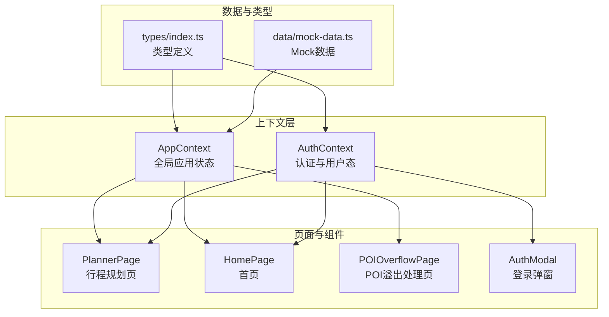
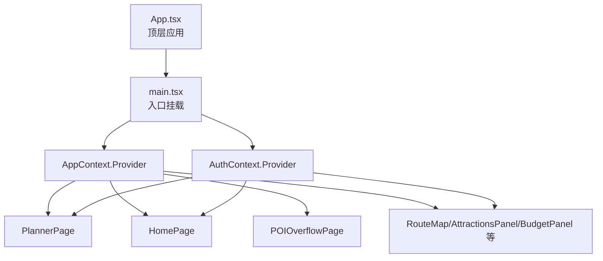
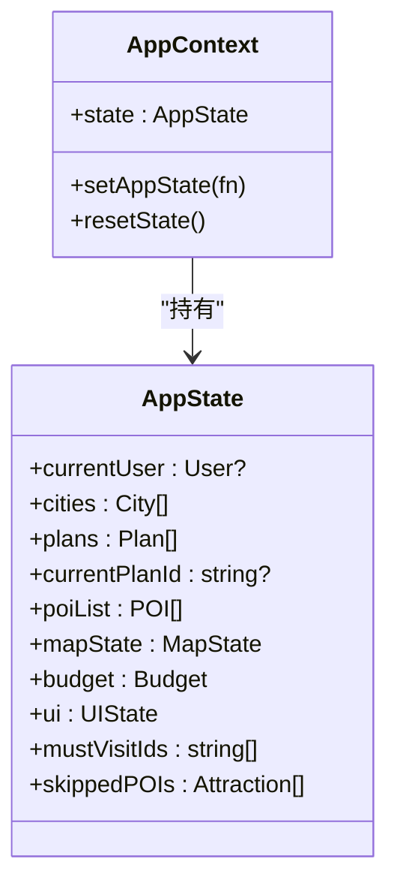
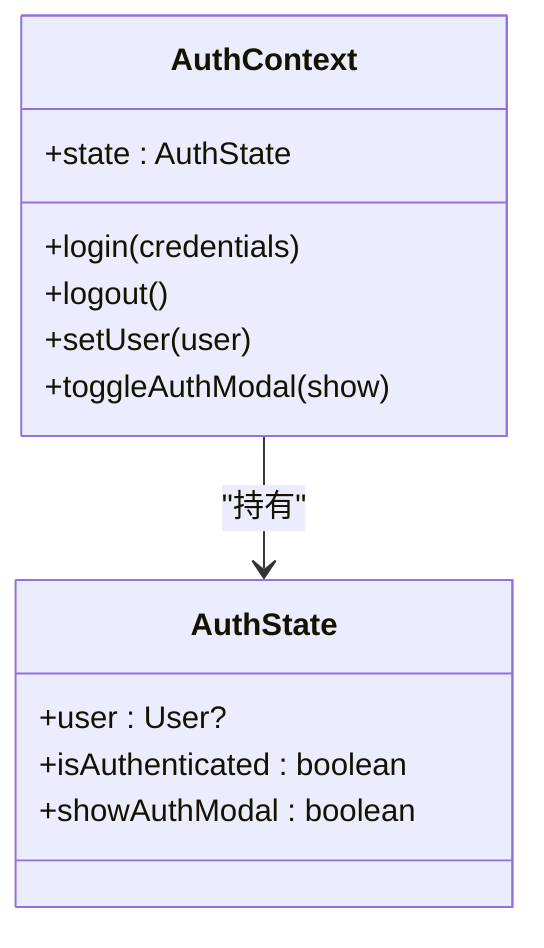
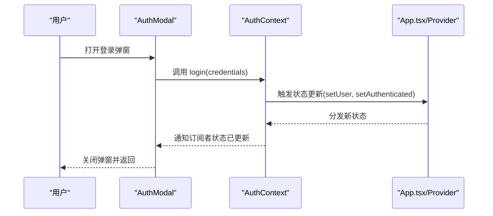
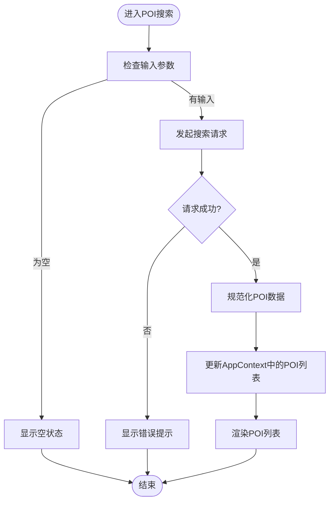
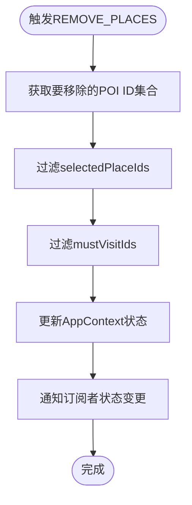
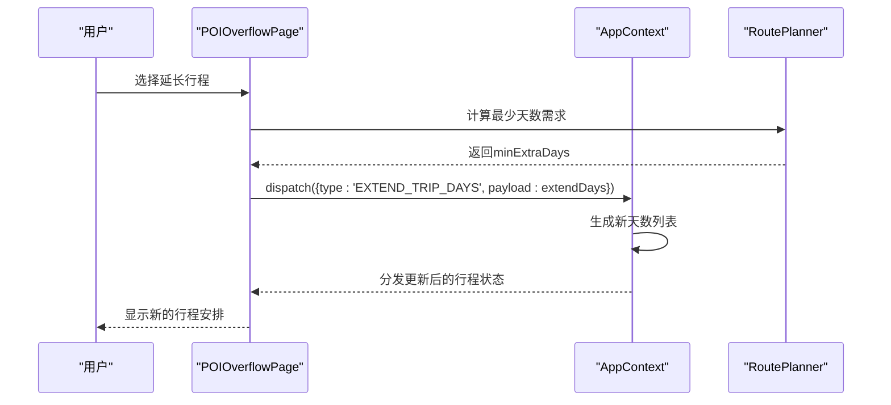
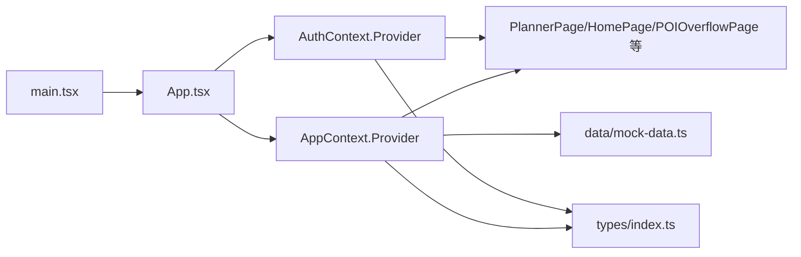

# 状态管理

<cite>
**本文引用的文件**
- [src/context/AppContext.tsx](file://src/context/AppContext.tsx)
- [src/context/AuthContext.tsx](file://src/context/AuthContext.tsx)
- [src/types/index.ts](file://src/types/index.ts)
- [src/data/mock-data.ts](file://src/data/mock-data.ts)
- [src/pages/PlannerPage.tsx](file://src/pages/PlannerPage.tsx)
- [src/pages/HomePage.tsx](file://src/pages/HomePage.tsx)
- [src/pages/POIOverflowPage.tsx](file://src/pages/POIOverflowPage.tsx)
- [src/components/AuthModal.tsx](file://src/components/AuthModal.tsx)
- [src/main.tsx](file://src/main.tsx)
- [src/App.tsx](file://src/App.tsx)
</cite>

## 更新摘要
**所做更改**
- 新增mustVisitIds状态跟踪机制的详细说明
- 完善REMOVE_PLACES动作处理的实现细节
- 新增EXTEND_TRIP_DAYS功能的完整流程分析
- 增强自动must-visit清理机制的技术说明
- 更新POI溢出处理系统的状态管理架构

## 目录
1. [简介](#简介)
2. [项目结构](#项目结构)
3. [核心组件](#核心组件)
4. [架构总览](#架构总览)
5. [详细组件分析](#详细组件分析)
6. [POI溢出处理系统](#poi溢出处理系统)
7. [依赖关系分析](#依赖关系分析)
8. [性能考量](#性能考量)
9. [故障排查指南](#故障排查指南)
10. [结论](#结论)
11. [附录](#附录)

## 简介
本文件围绕旅行规划Demo的状态管理架构展开，系统性阐述基于React Context的全局状态设计与实现，重点覆盖以下方面：
- AppContext与AuthContext的设计原理与职责边界
- 全局状态的组织结构（用户信息、旅行计划、POI数据等）
- 状态更新机制、订阅模式与性能优化策略
- Context Provider的嵌套结构与状态隔离原则
- 最佳实践：状态规范化、异步状态处理、错误边界
- 调试技巧与开发工具使用
- 持久化与跨页面状态同步方案

**更新** 本次更新重点关注POI溢出处理系统的增强，包括mustVisitIds跟踪、自动清理机制和EXTEND_TRIP_DAYS功能的完整实现。

## 项目结构
本项目的前端状态管理集中在src/context目录，配合类型定义、Mock数据与页面组件共同构成完整的状态流闭环。

**图表来源**
- [src/context/AppContext.tsx](file://src/context/AppContext.tsx)
- [src/context/AuthContext.tsx](file://src/context/AuthContext.tsx)
- [src/types/index.ts](file://src/types/index.ts)
- [src/data/mock-data.ts](file://src/data/mock-data.ts)
- [src/pages/PlannerPage.tsx](file://src/pages/PlannerPage.tsx)
- [src/pages/HomePage.tsx](file://src/pages/HomePage.tsx)
- [src/pages/POIOverflowPage.tsx](file://src/pages/POIOverflowPage.tsx)
- [src/components/AuthModal.tsx](file://src/components/AuthModal.tsx)

**章节来源**
- [src/context/AppContext.tsx](file://src/context/AppContext.tsx)
- [src/context/AuthContext.tsx](file://src/context/AuthContext.tsx)
- [src/types/index.ts](file://src/types/index.ts)
- [src/data/mock-data.ts](file://src/data/mock-data.ts)

## 核心组件
本节聚焦于两个核心Context：AppContext与AuthContext，解释其职责、导出的值与典型用法场景。

- AppContext
  - 职责：承载全局应用状态，如当前城市、旅行计划、POI列表、地图状态、预算与日程等。
  - 关键能力：提供状态读取、状态更新函数、重置逻辑；在Provider内部维护状态树并进行分发。
  - 使用场景：行程规划页、首页、路线图、预算面板等页面共享状态。
  - 订阅方式：通过useContext消费；组件可选择性订阅部分状态以减少重渲染。

- AuthContext
  - 职责：管理用户认证状态与登录流程，包括用户信息、登录态、登录弹窗控制等。
  - 关键能力：提供登录、登出、设置用户信息、切换登录弹窗显示等方法。
  - 使用场景：登录弹窗、个人资料页、需要鉴权的页面或功能。

**更新** AppContext现已增强POI溢出处理能力，新增mustVisitIds状态管理和自动清理机制。

**章节来源**
- [src/context/AppContext.tsx](file://src/context/AppContext.tsx)
- [src/context/AuthContext.tsx](file://src/context/AuthContext.tsx)

## 架构总览
下图展示了Provider的嵌套结构、消费者组件以及数据流向：

**图表来源**
- [src/App.tsx](file://src/App.tsx)
- [src/main.tsx](file://src/main.tsx)
- [src/context/AppContext.tsx](file://src/context/AppContext.tsx)
- [src/context/AuthContext.tsx](file://src/context/AuthContext.tsx)
- [src/pages/PlannerPage.tsx](file://src/pages/PlannerPage.tsx)
- [src/pages/HomePage.tsx](file://src/pages/HomePage.tsx)
- [src/pages/POIOverflowPage.tsx](file://src/pages/POIOverflowPage.tsx)
- [src/components/AuthModal.tsx](file://src/components/AuthModal.tsx)

## 详细组件分析

### AppContext 设计与实现
- 状态模型
  - 用户相关：当前用户（可选）、登录态标志
  - 行程相关：当前城市、旅行计划集合、当前计划索引、日程片段、预算配置
  - 数据相关：POI列表、搜索条件、排序与筛选、地图状态
  - UI相关：加载状态、错误信息、提示消息
  - **新增** POI溢出处理：mustVisitIds跟踪、skippedPOIs记录
- 更新机制
  - 提供统一的状态更新函数，支持部分字段更新与全量替换
  - 对复杂状态（如行程计划）采用不可变更新策略，避免意外共享引用
  - **新增** 自动清理机制：当POI被移除或取消选择时，自动清理对应的mustVisitIds
- 订阅模式
  - 组件通过useContext按需订阅所需状态，降低无关重渲染
  - 对高频变化的状态进行拆分，提升订阅粒度
- 性能优化
  - 使用memo化包装高开销组件
  - 将不随状态变化的回调函数稳定化（例如使用useCallback）
  - 对长列表渲染采用虚拟化或分页策略（如适用）

**图表来源**
- [src/context/AppContext.tsx](file://src/context/AppContext.tsx)
- [src/types/index.ts](file://src/types/index.ts)

**章节来源**
- [src/context/AppContext.tsx](file://src/context/AppContext.tsx)
- [src/types/index.ts](file://src/types/index.ts)

### AuthContext 设计与实现
- 状态模型
  - 用户信息：用户标识、昵称、头像等（可选）
  - 登录态：布尔标志
  - UI控制：是否显示登录弹窗
- 更新机制
  - 提供login、logout、setUser等方法
  - 登录成功后写入用户信息并关闭弹窗
- 订阅模式
  - 登录弹窗组件与需要鉴权的页面均订阅该Context
  - 通过条件渲染与路由守卫结合实现访问控制

**图表来源**
- [src/context/AuthContext.tsx](file://src/context/AuthContext.tsx)
- [src/types/index.ts](file://src/types/index.ts)

**章节来源**
- [src/context/AuthContext.tsx](file://src/context/AuthContext.tsx)
- [src/types/index.ts](file://src/types/index.ts)

### 状态更新与订阅序列
以下序列图展示从用户触发到状态更新再到UI响应的完整流程（以登录为例）：

**图表来源**
- [src/components/AuthModal.tsx](file://src/components/AuthModal.tsx)
- [src/context/AuthContext.tsx](file://src/context/AuthContext.tsx)
- [src/App.tsx](file://src/App.tsx)

### 复杂逻辑流程（示例：POI搜索与列表渲染）
以下流程图展示POI搜索与列表渲染的关键决策点：

**图表来源**
- [src/context/AppContext.tsx](file://src/context/AppContext.tsx)
- [src/data/mock-data.ts](file://src/data/mock-data.ts)

**章节来源**
- [src/context/AppContext.tsx](file://src/context/AppContext.tsx)
- [src/data/mock-data.ts](file://src/data/mock-data.ts)

### 页面与组件的使用示例
- 行程规划页（PlannerPage）
  - 订阅AppContext中的当前计划、POI列表与地图状态
  - 通过更新函数修改日程片段、预算与筛选条件
- 首页（HomePage）
  - 订阅城市列表与当前城市
  - 切换城市时更新AppContext中的当前城市
- 登录弹窗（AuthModal）
  - 订阅AuthContext中的登录态与弹窗显示标志
  - 登录成功后调用AuthContext提供的方法更新状态

**章节来源**
- [src/pages/PlannerPage.tsx](file://src/pages/PlannerPage.tsx)
- [src/pages/HomePage.tsx](file://src/pages/HomePage.tsx)
- [src/components/AuthModal.tsx](file://src/components/AuthModal.tsx)

## POI溢出处理系统

### mustVisitIds跟踪机制
POI溢出处理系统的核心是mustVisitIds状态跟踪，用于管理用户标记的必打卡POI。

- **状态定义**：mustVisitIds是一个字符串数组，存储用户标记为必打卡的POI ID集合
- **自动清理**：当用户取消选择某个POI或从行程中移除POI时，系统会自动清理对应的mustVisitIds条目
- **实时同步**：POI选择状态与mustVisitIds保持实时同步，确保数据一致性

### REMOVE_PLACES动作处理
REMOVE_PLACES动作提供了批量移除POI的功能，包含完整的mustVisitIds清理逻辑。

**图表来源**
- [src/context/AppContext.tsx:186-193](file://src/context/AppContext.tsx#L186-L193)

### EXTEND_TRIP_DAYS功能实现
EXTEND_TRIP_DAYS功能允许用户动态延长行程天数，系统会自动重新规划行程。

- **天数计算**：根据skippedPOIs数量计算最少需要延长的天数
- **自动扩展**：在用户确认延长后，系统自动生成新的行程天数
- **状态更新**：更新trip.enddate和days数组，保持酒店信息一致

**图表来源**
- [src/pages/POIOverflowPage.tsx:54-67](file://src/pages/POIOverflowPage.tsx#L54-L67)
- [src/context/AppContext.tsx:219-251](file://src/context/AppContext.tsx#L219-L251)

### 自动must-visit清理机制
系统实现了智能的must-visit清理机制，确保状态完整性。

- **TOGGLE_PLACE动作**：当用户取消选择POI时，自动清理对应的mustVisitIds
- **REMOVE_PLACES动作**：批量移除POI时，同步清理mustVisitIds
- **状态一致性**：确保mustVisitIds只包含当前已选择的POI

**章节来源**
- [src/context/AppContext.tsx:175-193](file://src/context/AppContext.tsx#L175-L193)
- [src/pages/POIOverflowPage.tsx:68-101](file://src/pages/POIOverflowPage.tsx#L68-L101)

## 依赖关系分析
- Provider嵌套与隔离
  - main.tsx中同时挂载AppContext.Provider与AuthContext.Provider，确保两者独立工作
  - App.tsx作为顶层容器，负责组合Provider并注入初始状态
- 组件耦合与内聚
  - 页面组件仅依赖Context提供的状态与方法，不直接依赖外部存储
  - 低耦合：组件通过Context解耦，高内聚：每个Context专注单一领域
- 外部依赖
  - 类型定义来自types/index.ts，保证状态结构一致性
  - Mock数据来自data/mock-data.ts，便于开发与测试

**图表来源**
- [src/main.tsx](file://src/main.tsx)
- [src/App.tsx](file://src/App.tsx)
- [src/context/AppContext.tsx](file://src/context/AppContext.tsx)
- [src/context/AuthContext.tsx](file://src/context/AuthContext.tsx)
- [src/types/index.ts](file://src/types/index.ts)
- [src/data/mock-data.ts](file://src/data/mock-data.ts)

**章节来源**
- [src/main.tsx](file://src/main.tsx)
- [src/App.tsx](file://src/App.tsx)
- [src/context/AppContext.tsx](file://src/context/AppContext.tsx)
- [src/context/AuthContext.tsx](file://src/context/AuthContext.tsx)
- [src/types/index.ts](file://src/types/index.ts)
- [src/data/mock-data.ts](file://src/data/mock-data.ts)

## 性能考量
- 订阅粒度
  - 将大对象拆分为多个小状态，组件仅订阅必要字段，减少重渲染
  - **新增** POI溢出处理状态分离，避免不必要的重渲染
- 回调稳定化
  - 使用useCallback包裹传给子组件的回调，避免因引用变化导致子组件重渲染
- 渲染优化
  - 对长列表采用虚拟化或分页策略
  - 使用memo化包装高成本组件
- 异步状态处理
  - 在发起网络请求前设置"加载中"状态，请求完成后清理状态
  - 对并发请求进行去重或取消，避免竞态与重复渲染
  - **新增** POI溢出处理采用useMemo优化重新规划计算
- 内存与泄漏
  - 在组件卸载时清理定时器、订阅与副作用
  - 避免在Context中存放大型二进制数据或频繁变动的大数组

## 故障排查指南
- 常见问题
  - Provider未正确嵌套：确认main.tsx与App.tsx中均已挂载对应Provider
  - 订阅不到状态：检查组件是否位于对应Context的Provider作用域内
  - 状态未更新：确认使用了正确的更新函数，并且更新逻辑遵循不可变更新
  - 重渲染过多：检查订阅范围与回调稳定性，必要时拆分状态或使用memo
  - **新增** mustVisitIds不同步：检查TOGGLE_PLACE和REMOVE_PLACES动作的清理逻辑
- 调试技巧
  - 使用React DevTools Profiler观察渲染热点
  - 在更新函数中打印状态快照，定位异常更新
  - 使用useDebugValue为自定义Hook提供调试标签
  - **新增** 监控POI溢出处理状态变化，验证自动清理机制
- 错误边界
  - 在页面级组件中添加错误边界，捕获并展示友好错误信息
  - 对异步操作设置超时与重试策略，避免卡死UI

## 结论
本项目采用清晰的Context分层设计：AppContext负责全局业务状态，AuthContext负责认证与用户态。通过合理的状态建模、细粒度订阅与性能优化策略，实现了可维护、可扩展的状态管理架构。

**更新** 新增的POI溢出处理系统显著增强了状态管理能力，包括mustVisitIds跟踪、自动清理机制和动态天数延长功能。这些改进使得系统能够更好地处理POI溢出场景，提供更智能的行程规划体验。

建议在后续迭代中进一步引入规范化库与持久化方案，以增强跨页面状态同步与调试能力。

## 附录
- 状态持久化与跨页面同步
  - 可选方案：localStorage/sessionStorage用于轻量数据；IndexedDB用于结构化数据
  - 同步策略：在App初始化时从本地恢复状态，在状态变更时同步写入
  - 注意事项：对敏感数据加密存储；对大体量数据分片存储并设置过期策略
- 开发工具与最佳实践
  - 使用React DevTools与Redux DevTools（如集成）辅助调试
  - 对异步状态引入中间件或自定义Hook封装，统一处理loading/error/success
  - 对复杂状态迁移编写迁移脚本，保证版本升级时的数据兼容性
- **新增** POI溢出处理最佳实践
  - 合理使用mustVisitIds状态，避免过度标记
  - 利用自动清理机制，保持状态一致性
  - 通过EXTEND_TRIP_DAYS功能优化用户体验
  - 监控skippedPOIs变化，及时调整行程安排