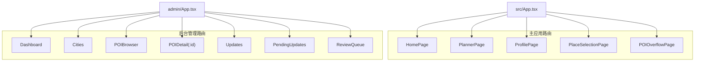
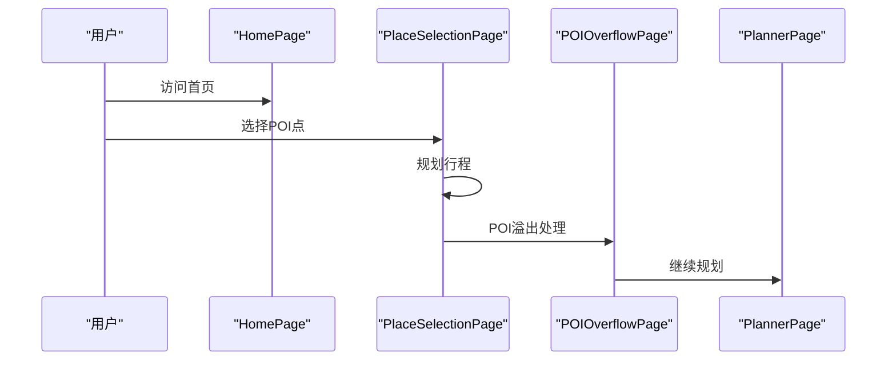
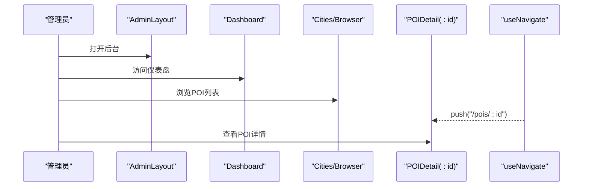
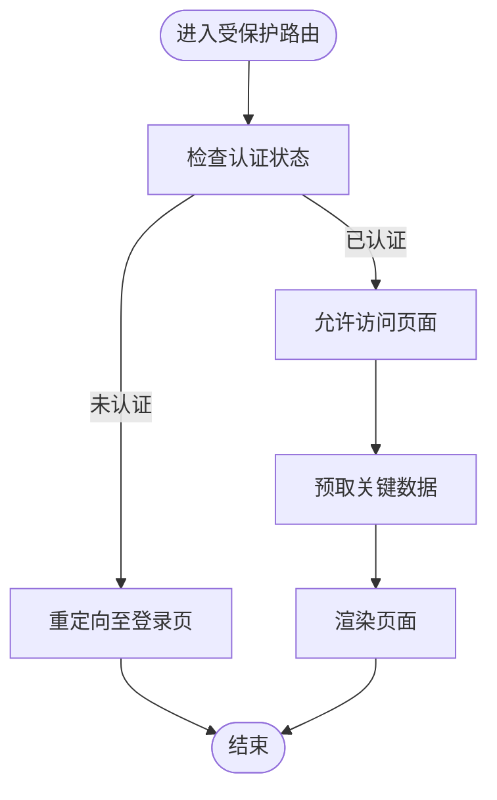
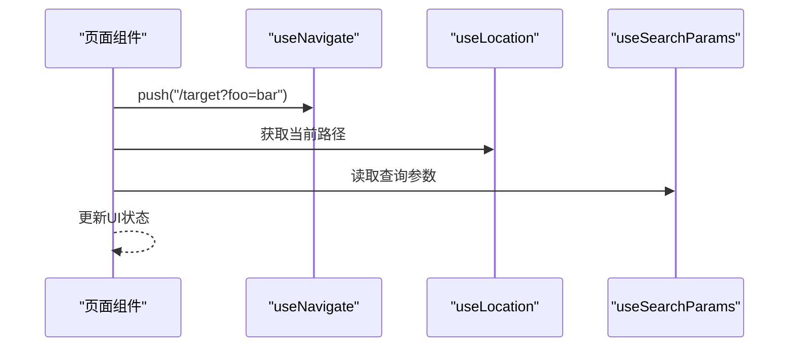
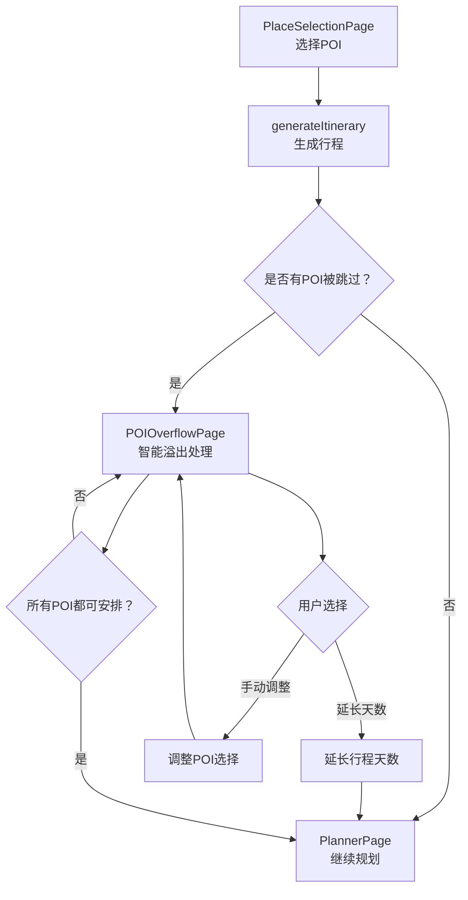
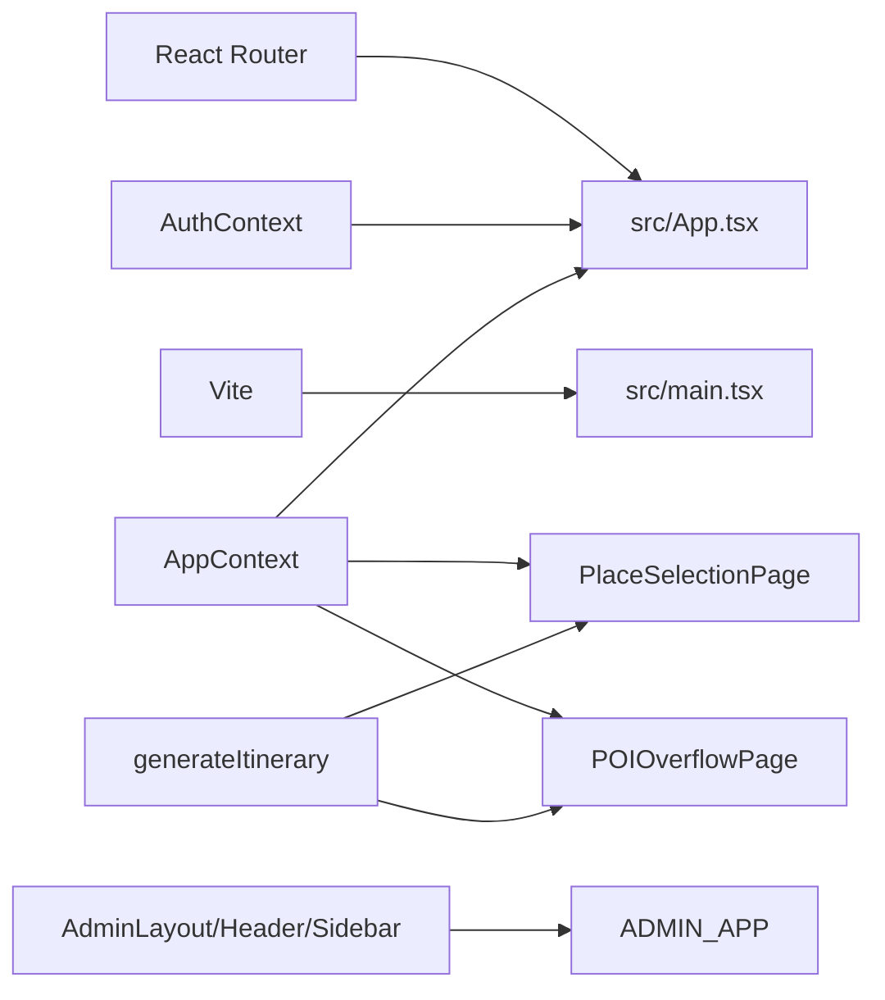

# 路由与导航

<cite>
**本文引用的文件**
- [src/App.tsx](file://src/App.tsx)
- [src/main.tsx](file://src/main.tsx)
- [vite.config.ts](file://vite.config.ts)
- [admin/App.tsx](file://admin/App.tsx)
- [admin/main.tsx](file://admin/main.tsx)
- [admin/components/layout/AdminLayout.tsx](file://admin/components/layout/AdminLayout.tsx)
- [admin/components/layout/Header.tsx](file://admin/components/layout/Header.tsx)
- [admin/components/layout/Sidebar.tsx](file://admin/components/layout/Sidebar.tsx)
- [admin/pages/Cities.tsx](file://admin/pages/Cities.tsx)
- [admin/pages/Dashboard.tsx](file://admin/pages/Dashboard.tsx)
- [admin/pages/POIBrowser.tsx](file://admin/pages/POIBrowser.tsx)
- [admin/pages/POIDetail.tsx](file://admin/pages/POIDetail.tsx)
- [src/context/AuthContext.tsx](file://src/context/AuthContext.tsx)
- [src/context/AppContext.tsx](file://src/context/AppContext.tsx)
- [src/pages/HomePage.tsx](file://src/pages/HomePage.tsx)
- [src/pages/PlaceSelectionPage.tsx](file://src/pages/PlaceSelectionPage.tsx)
- [src/pages/POIOverflowPage.tsx](file://src/pages/POIOverflowPage.tsx)
- [src/pages/PlannerPage.tsx](file://src/pages/PlannerPage.tsx)
- [src/pages/ProfilePage.tsx](file://src/pages/ProfilePage.tsx)
- [src/types/index.ts](file://src/types/index.ts)
</cite>

## 更新摘要
**变更内容**
- 新增 POIOverflowPage 路由集成，建立从 PlaceSelectionPage 到 POIOverflowPage 的智能溢出处理导航流程
- 完善 AppView 类型定义，支持 'poi-overflow' 视图状态
- 增强行程规划的智能溢出处理机制，提供天数延长和 POI 调整选项
- 优化 AppContext 状态管理，支持 mustVisitIds 和 skippedPOIs 状态

## 目录
1. [简介](#简介)
2. [项目结构](#项目结构)
3. [核心组件](#核心组件)
4. [架构总览](#架构总览)
5. [详细组件分析](#详细组件分析)
6. [智能溢出处理系统](#智能溢出处理系统)
7. [依赖分析](#依赖分析)
8. [性能考虑](#性能考虑)
9. [故障排查指南](#故障排查指南)
10. [结论](#结论)
11. [附录](#附录)

## 简介
本文件聚焦于旅行规划Demo的"路由与导航"体系，覆盖前端主应用与后台管理子系统的路由配置、页面组织、导航交互、权限控制、预加载策略、SEO与元数据管理、以及性能优化（代码分割与懒加载）等主题。特别关注新增的智能溢出处理系统，该系统通过 POIOverflowPage 实现了从 PlaceSelectionPage 到 POIOverflowPage 的无缝导航流程，提供了智能的 POI 规划解决方案。

## 项目结构
- 主应用位于 src/，采用浏览器原生 history 模式进行路由渲染。
- 后台管理位于 admin/，采用哈希路由（HashRouter）以适配静态部署场景。
- 两套路由系统分别在各自入口文件中初始化，并在对应根节点挂载。

```mermaid
graph TB
subgraph "主应用(src)"
SRC_MAIN["src/main.tsx"]
SRC_APP["src/App.tsx"]
APP_CONTEXT["src/context/AppContext.tsx"]
END
subgraph "后台管理(admin)"
ADMIN_MAIN["admin/main.tsx"]
ADMIN_APP["admin/App.tsx"]
end
SRC_MAIN --> SRC_APP
ADMIN_MAIN --> ADMIN_APP
SRC_APP --> APP_CONTEXT
```

**图表来源**
- [src/main.tsx:1-20](file://src/main.tsx#L1-L20)
- [admin/main.tsx:1-15](file://admin/main.tsx#L1-L15)
- [src/App.tsx:1-65](file://src/App.tsx#L1-L65)
- [src/context/AppContext.tsx:1-298](file://src/context/AppContext.tsx#L1-L298)

**章节来源**
- [src/main.tsx:1-20](file://src/main.tsx#L1-L20)
- [admin/main.tsx:1-15](file://admin/main.tsx#L1-L15)
- [src/App.tsx:1-65](file://src/App.tsx#L1-L65)
- [src/context/AppContext.tsx:1-298](file://src/context/AppContext.tsx#L1-L298)

## 核心组件
- 主应用路由容器：在 src/App.tsx 中定义页面级路由与布局嵌套，负责主页、规划页、个人资料页等核心页面的路由映射，现已集成 POIOverflowPage。
- 后台管理路由容器：在 admin/App.tsx 中定义后台管理页面的路由与布局嵌套，包含仪表盘、城市、POI浏览与详情、更新队列等页面。
- 布局组件：AdminLayout.tsx 提供后台管理的通用布局结构；Header.tsx 与 Sidebar.tsx 提供导航与面包屑基础能力。
- 导航工具：useNavigate、useParams、useSearchParams、useLocation 等钩子贯穿各页面，用于程序化导航与参数传递。
- 权限上下文：AuthContext.tsx 提供认证状态与权限判断，可作为路由守卫的依赖。
- 状态管理：AppContext.tsx 提供全局状态管理，支持智能溢出处理所需的 mustVisitIds 和 skippedPOIs 状态。

**章节来源**
- [src/App.tsx:1-65](file://src/App.tsx#L1-L65)
- [admin/App.tsx:1-30](file://admin/App.tsx#L1-L30)
- [admin/components/layout/AdminLayout.tsx:1-50](file://admin/components/layout/AdminLayout.tsx#L1-L50)
- [admin/components/layout/Header.tsx:1-60](file://admin/components/layout/Header.tsx#L1-L60)
- [admin/components/layout/Sidebar.tsx:1-80](file://admin/components/layout/Sidebar.tsx#L1-L80)
- [src/context/AuthContext.tsx:1-200](file://src/context/AuthContext.tsx#L1-L200)
- [src/context/AppContext.tsx:1-298](file://src/context/AppContext.tsx#L1-L298)

## 架构总览
下图展示了主应用与后台管理的路由分治架构，以及页面与布局之间的关系，特别突出了智能溢出处理系统的集成。



**图表来源**
- [src/App.tsx:1-65](file://src/App.tsx#L1-L65)
- [admin/App.tsx:1-30](file://admin/App.tsx#L1-L30)

## 详细组件分析

### 主应用路由与页面组织
- 路由定义：src/App.tsx 使用 Routes/Route 定义多页面路由，支持嵌套路由与默认路径重定向，现已集成 POIOverflowPage。
- 页面组件：HomePage、PlannerPage、ProfilePage、PlaceSelectionPage、POIOverflowPage 等作为独立页面组件，按需渲染。
- 参数传递：通过 React Router 的 useParams/useSearchParams 实现查询参数与动态路由参数的读取。
- 动态路由匹配：支持如 "pois/:id" 的动态段，便于详情页复用与参数透传。
- 程序化导航：在页面内使用 useNavigate 进行跳转，结合表单提交或按钮点击触发。
- 面包屑导航：Header.tsx 通过 useLocation 获取当前路径，结合页面标题生成面包屑。
- SEO与元数据：建议在页面组件中使用 Head 标签库设置标题、描述与关键词，配合 Vite 插件进行构建期优化。



**图表来源**
- [src/pages/HomePage.tsx:1-200](file://src/pages/HomePage.tsx#L1-L200)
- [src/pages/PlaceSelectionPage.tsx:240-261](file://src/pages/PlaceSelectionPage.tsx#L240-L261)
- [src/pages/POIOverflowPage.tsx:160-179](file://src/pages/POIOverflowPage.tsx#L160-L179)
- [src/pages/PlannerPage.tsx:1-200](file://src/pages/PlannerPage.tsx#L1-L200)

**章节来源**
- [src/App.tsx:1-65](file://src/App.tsx#L1-L65)
- [src/pages/HomePage.tsx:1-200](file://src/pages/HomePage.tsx#L1-L200)
- [src/pages/PlaceSelectionPage.tsx:240-261](file://src/pages/PlaceSelectionPage.tsx#L240-L261)
- [src/pages/POIOverflowPage.tsx:1-580](file://src/pages/POIOverflowPage.tsx#L1-L580)
- [src/pages/PlannerPage.tsx:1-200](file://src/pages/PlannerPage.tsx#L1-L200)
- [src/context/AuthContext.tsx:1-200](file://src/context/AuthContext.tsx#L1-L200)

### 后台管理路由与页面组织
- 路由定义：admin/App.tsx 使用 Routes/Route 定义后台管理页面路由，包含仪表盘、城市、POI浏览与详情、更新队列等。
- 布局嵌套：AdminLayout.tsx 作为外层布局，Header.tsx 与 Sidebar.tsx 提供导航与面包屑基础能力。
- 动态路由：POIDetail 使用 "pois/:id" 动态段，实现详情页参数传递。
- 程序化导航：Cities、Dashboard、POIBrowser、POIDetail 等页面使用 useNavigate 进行跳转。
- 通配符处理：使用 "*" 匹配未识别路径并重定向到首页，保证健壮性。



**图表来源**
- [admin/App.tsx:1-30](file://admin/App.tsx#L1-L30)
- [admin/components/layout/AdminLayout.tsx:1-50](file://admin/components/layout/AdminLayout.tsx#L1-L50)
- [admin/pages/Cities.tsx:1-120](file://admin/pages/Cities.tsx#L1-L120)
- [admin/pages/Dashboard.tsx:1-120](file://admin/pages/Dashboard.tsx#L1-L120)
- [admin/pages/POIBrowser.tsx:1-120](file://admin/pages/POIBrowser.tsx#L1-L120)
- [admin/pages/POIDetail.tsx:1-120](file://admin/pages/POIDetail.tsx#L1-L120)

**章节来源**
- [admin/App.tsx:1-30](file://admin/App.tsx#L1-L30)
- [admin/components/layout/AdminLayout.tsx:1-50](file://admin/components/layout/AdminLayout.tsx#L1-L50)
- [admin/pages/Cities.tsx:1-120](file://admin/pages/Cities.tsx#L1-L120)
- [admin/pages/Dashboard.tsx:1-120](file://admin/pages/Dashboard.tsx#L1-L120)
- [admin/pages/POIBrowser.tsx:1-120](file://admin/pages/POIBrowser.tsx#L1-L120)
- [admin/pages/POIDetail.tsx:1-120](file://admin/pages/POIDetail.tsx#L1-L120)

### 路由守卫、权限控制与页面预加载
- 权限控制：AuthContext.tsx 提供认证状态与权限判断，可在路由层或页面层调用以决定是否允许访问。
- 路由守卫模式：在路由容器中根据 AuthContext 的状态执行条件渲染或重定向，实现登录保护与角色限制。
- 页面预加载：在进入页面前对关键数据进行预取（如 POI 列表、用户信息），减少首屏等待时间；在后台管理中可对列表页进行分页预取。



**图表来源**
- [src/context/AuthContext.tsx:1-200](file://src/context/AuthContext.tsx#L1-L200)
- [src/App.tsx:1-65](file://src/App.tsx#L1-L65)

**章节来源**
- [src/context/AuthContext.tsx:1-200](file://src/context/AuthContext.tsx#L1-L200)
- [src/App.tsx:1-65](file://src/App.tsx#L1-L65)

### 程序化导航、编程式路由与面包屑
- 程序化导航：在页面组件中使用 useNavigate 进行 push/replace 跳转，结合事件回调（如按钮点击、表单提交）触发。
- 编程式路由：通过 useLocation/useSearchParams 获取当前路径与查询参数，实现无刷新的状态更新与导航。
- 面包屑：Header.tsx 使用 useLocation 获取路径片段，结合页面标题生成面包屑导航，提升用户体验。



**图表来源**
- [admin/pages/Dashboard.tsx:1-120](file://admin/pages/Dashboard.tsx#L1-L120)
- [admin/pages/POIBrowser.tsx:1-120](file://admin/pages/POIBrowser.tsx#L1-L120)
- [admin/pages/POIDetail.tsx:1-120](file://admin/pages/POIDetail.tsx#L1-L120)
- [admin/components/layout/Header.tsx:1-60](file://admin/components/layout/Header.tsx#L1-L60)

**章节来源**
- [admin/pages/Dashboard.tsx:1-120](file://admin/pages/Dashboard.tsx#L1-L120)
- [admin/pages/POIBrowser.tsx:1-120](file://admin/pages/POIBrowser.tsx#L1-L120)
- [admin/pages/POIDetail.tsx:1-120](file://admin/pages/POIDetail.tsx#L1-L120)
- [admin/components/layout/Header.tsx:1-60](file://admin/components/layout/Header.tsx#L1-L60)

### SEO优化与路由元数据管理
- 元数据策略：在页面组件中设置页面标题、描述与关键词，结合 Vite 插件进行构建期优化。
- 结构化数据：为详情页（如 POI 详情）添加结构化标记，提升搜索引擎可见性。
- 可访问性：确保面包屑与导航链接具备语义化标签，改善屏幕阅读器体验。

**章节来源**
- [src/App.tsx:1-65](file://src/App.tsx#L1-L65)
- [admin/App.tsx:1-30](file://admin/App.tsx#L1-L30)

## 智能溢出处理系统

### 系统概述
智能溢出处理系统是旅行规划Demo的核心创新功能，通过 POIOverflowPage 实现了从 PlaceSelectionPage 到 POIOverflowPage 的无缝导航流程。当用户选择的POI点超过当前天数能容纳的范围时，系统会自动检测并提供智能解决方案。

### 核心功能特性
- **自动检测机制**：在 PlaceSelectionPage 中调用 generateItinerary 函数，自动检测是否有POI被跳过
- **智能建议**：根据被跳过的POI数量和时长，计算最少需要延长的天数
- **灵活调整选项**：提供延长天数或手动调整POI两种解决方案
- **必打卡功能**：支持标记重要POI为"必打卡"，在规划时优先安排
- **安全剔除**：提供确认机制，确保用户明确知道哪些POI会被剔除

### 导航流程


**图表来源**
- [src/pages/PlaceSelectionPage.tsx:240-261](file://src/pages/PlaceSelectionPage.tsx#L240-L261)
- [src/pages/POIOverflowPage.tsx:69-101](file://src/pages/POIOverflowPage.tsx#L69-L101)
- [src/pages/POIOverflowPage.tsx:160-179](file://src/pages/POIOverflowPage.tsx#L160-L179)

### 状态管理集成
智能溢出处理系统深度集成了 AppContext 的状态管理机制：

- **mustVisitIds**：存储用户标记为"必打卡"的POI ID集合
- **skippedPOIs**：存储因容量不足而被跳过的POI列表
- **currentView**：通过 SET_VIEW 动作在 place-selection 和 poi-overflow 之间切换
- **EXTEND_TRIP_DAYS**：在用户确认延长天数时扩展行程天数

### 用户交互设计
- **实时反馈**：系统会实时计算并显示当前的POI安排状态
- **可视化界面**：通过卡片形式展示被跳过的POI，支持一键标记和剔除
- **进度指示**：提供清晰的进度条和状态提示，让用户了解当前的规划状态
- **确认机制**：对可能造成数据丢失的操作（如剔除POI）提供双重确认

**章节来源**
- [src/pages/PlaceSelectionPage.tsx:240-261](file://src/pages/PlaceSelectionPage.tsx#L240-L261)
- [src/pages/POIOverflowPage.tsx:1-580](file://src/pages/POIOverflowPage.tsx#L1-L580)
- [src/context/AppContext.tsx:209-251](file://src/context/AppContext.tsx#L209-L251)
- [src/types/index.ts:136-152](file://src/types/index.ts#L136-L152)

## 依赖分析
- 路由库：React Router（Routes、Route、Navigate、useNavigate、useParams、useSearchParams、useLocation、Outlet）。
- 构建工具：Vite（代码分割与懒加载的基础能力）。
- 布局与导航：AdminLayout、Header、Sidebar 提供导航与面包屑基础能力。
- 权限与状态：AuthContext 提供认证与权限状态，支撑路由守卫；AppContext 提供智能溢出处理所需的状态管理。
- 智能算法：generateItinerary 函数提供POI规划和溢出检测能力。



**图表来源**
- [src/App.tsx:1-65](file://src/App.tsx#L1-L65)
- [src/main.tsx:1-20](file://src/main.tsx#L1-L20)
- [src/context/AuthContext.tsx:1-200](file://src/context/AuthContext.tsx#L1-L200)
- [src/context/AppContext.tsx:1-298](file://src/context/AppContext.tsx#L1-L298)
- [src/pages/PlaceSelectionPage.tsx:240-261](file://src/pages/PlaceSelectionPage.tsx#L240-L261)
- [src/pages/POIOverflowPage.tsx:69-101](file://src/pages/POIOverflowPage.tsx#L69-L101)

**章节来源**
- [src/App.tsx:1-65](file://src/App.tsx#L1-L65)
- [src/main.tsx:1-20](file://src/main.tsx#L1-L20)
- [src/context/AuthContext.tsx:1-200](file://src/context/AuthContext.tsx#L1-L200)
- [src/context/AppContext.tsx:1-298](file://src/context/AppContext.tsx#L1-L298)
- [src/pages/PlaceSelectionPage.tsx:240-261](file://src/pages/PlaceSelectionPage.tsx#L240-L261)
- [src/pages/POIOverflowPage.tsx:1-580](file://src/pages/POIOverflowPage.tsx#L1-L580)

## 性能考虑
- 代码分割与懒加载：利用 Vite 的动态导入能力，对大型页面（如 PlannerPage、POIDetail、POIOverflowPage）进行按需加载，降低首屏体积。
- 预取与缓存：在进入列表页前预取必要数据，详情页命中缓存，避免重复请求。
- 路由切换优化：避免在路由切换时进行重型计算，将耗时任务放入 Web Worker 或异步队列。
- 智能溢出处理优化：POIOverflowPage 通过 useMemo 优化重新计算，避免不必要的重渲染。
- 图片与资源：对图片与地图资源进行懒加载与压缩，结合 CDN 加速。

**章节来源**
- [vite.config.ts:1-200](file://vite.config.ts#L1-L200)
- [src/pages/PlannerPage.tsx:1-200](file://src/pages/PlannerPage.tsx#L1-L200)
- [src/pages/POIOverflowPage.tsx:69-101](file://src/pages/POIOverflowPage.tsx#L69-L101)

## 故障排查指南
- 404页面：后台管理使用通配符 "*" 重定向到首页，确保未识别路径不会崩溃。
- 参数丢失：确认动态路由参数（如 ":id"）在详情页正确读取，避免空值导致的渲染异常。
- 导航循环：在守卫逻辑中避免直接重定向到自身，防止无限循环。
- 哈希路由冲突：后台管理使用 HashRouter，注意与主应用 history 模式的差异，避免跨域或路径混淆。
- 智能溢出处理异常：检查 generateItinerary 函数的返回值，确保 skippedPOIs 数组正确填充。
- 状态同步问题：确认 AppContext 的状态更新动作（SET_VIEW、SET_ALL_DAYS_ITEMS、EXTEND_TRIP_DAYS）正确触发。

**章节来源**
- [admin/App.tsx:1-30](file://admin/App.tsx#L1-L30)
- [admin/pages/POIDetail.tsx:1-120](file://admin/pages/POIDetail.tsx#L1-L120)
- [src/pages/PlaceSelectionPage.tsx:240-261](file://src/pages/PlaceSelectionPage.tsx#L240-L261)
- [src/pages/POIOverflowPage.tsx:160-179](file://src/pages/POIOverflowPage.tsx#L160-L179)

## 结论
该Demo采用双路由体系（history 与 hash）分别服务于主应用与后台管理，结合布局嵌套、参数传递、程序化导航与权限守卫，实现了清晰的导航与良好的用户体验。特别新增的智能溢出处理系统通过 POIOverflowPage 与 PlaceSelectionPage 的无缝集成，提供了智能化的POI规划解决方案，显著提升了用户体验和规划效率。通过代码分割、预取与缓存等策略，可进一步提升性能与稳定性。建议在页面组件中完善 SEO 元数据与可访问性，持续优化路由与导航体验。

## 附录
- 推荐实践清单
  - 在路由层统一接入权限守卫，避免页面重复校验。
  - 对大型页面启用懒加载，结合骨架屏提升感知性能。
  - 使用面包屑与语义化导航增强可访问性与SEO。
  - 在构建阶段集成 Head 标签与结构化数据插件。
  - 智能溢出处理系统应保持状态的一致性和可恢复性。
  - 提供清晰的错误处理和用户反馈机制。