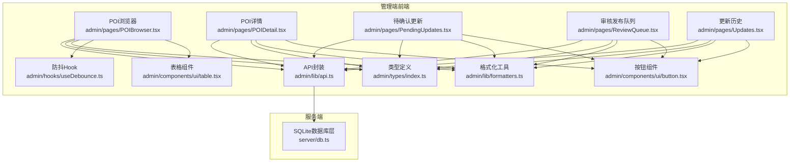
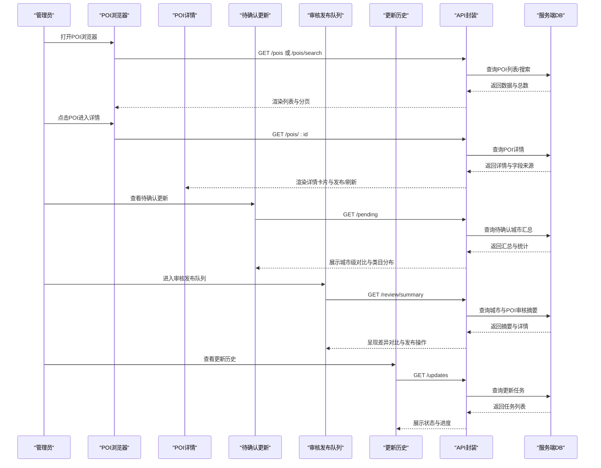
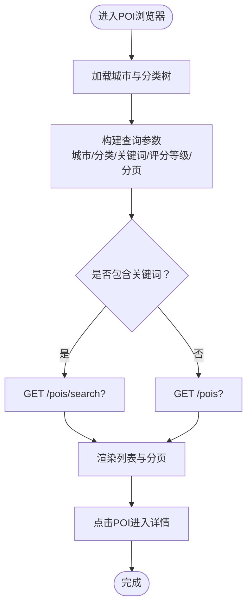
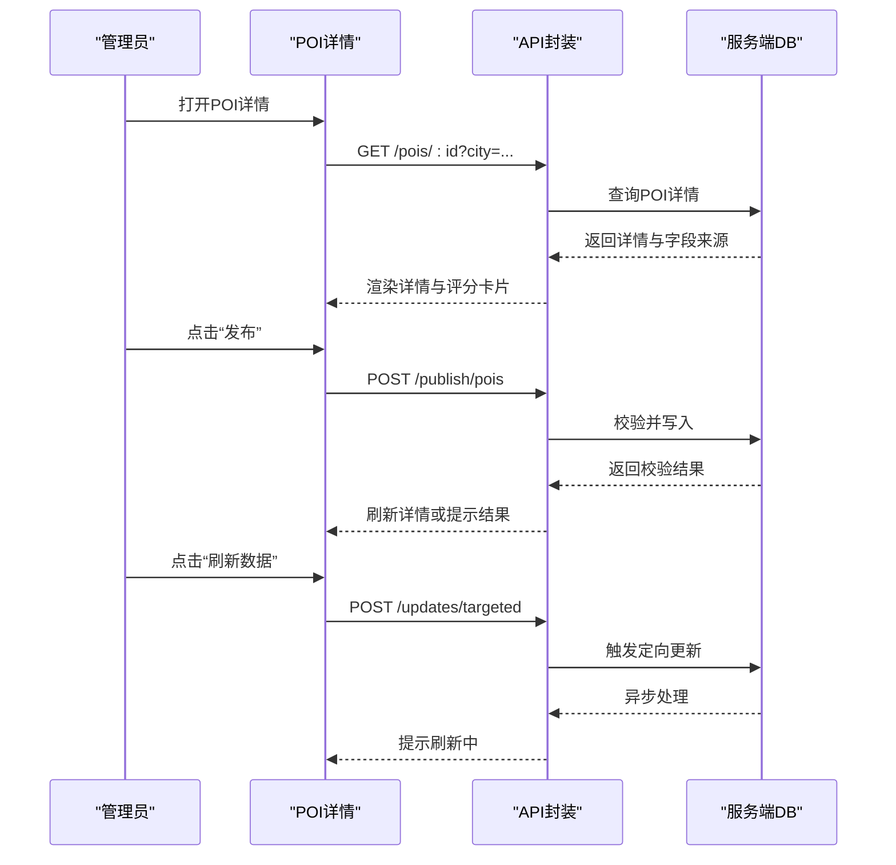
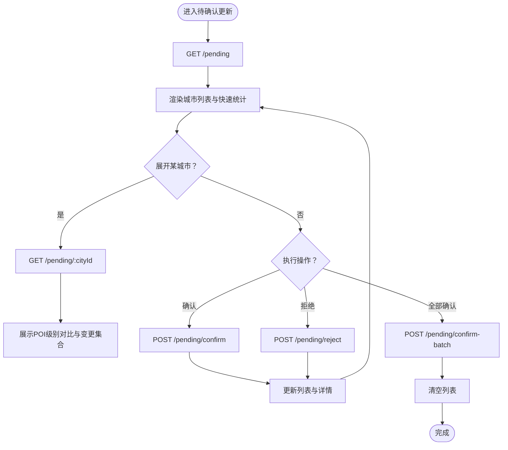
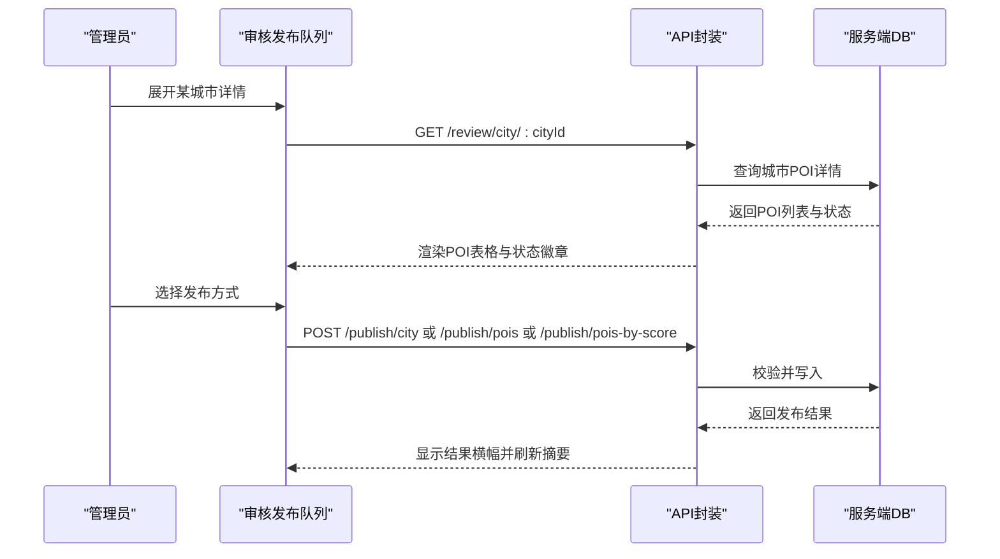
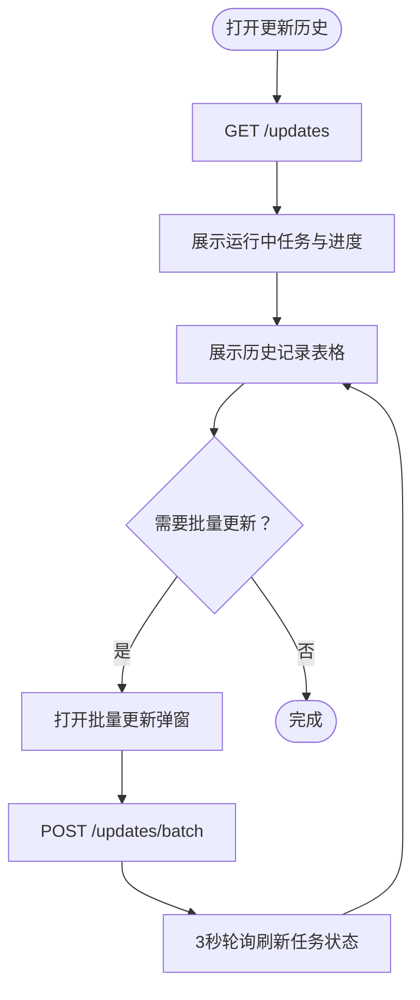
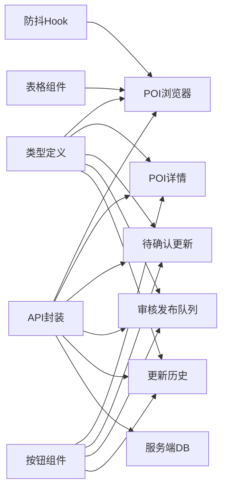

# POI数据管理

<cite>
**本文档引用的文件**
- [admin/pages/POIBrowser.tsx](file://admin/pages/POIBrowser.tsx)
- [admin/pages/POIDetail.tsx](file://admin/pages/POIDetail.tsx)
- [admin/pages/PendingUpdates.tsx](file://admin/pages/PendingUpdates.tsx)
- [admin/pages/ReviewQueue.tsx](file://admin/pages/ReviewQueue.tsx)
- [admin/pages/Updates.tsx](file://admin/pages/Updates.tsx)
- [admin/types/index.ts](file://admin/types/index.ts)
- [admin/lib/api.ts](file://admin/lib/api.ts)
- [admin/lib/formatters.ts](file://admin/lib/formatters.ts)
- [admin/hooks/useDebounce.ts](file://admin/hooks/useDebounce.ts)
- [admin/components/ui/table.tsx](file://admin/components/ui/table.tsx)
- [admin/components/ui/button.tsx](file://admin/components/ui/button.tsx)
- [server/db.ts](file://server/db.ts)
</cite>

## 目录
1. [简介](#简介)
2. [项目结构](#项目结构)
3. [核心组件](#核心组件)
4. [架构总览](#架构总览)
5. [详细组件分析](#详细组件分析)
6. [依赖关系分析](#依赖关系分析)
7. [性能考量](#性能考量)
8. [故障排查指南](#故障排查指南)
9. [结论](#结论)
10. [附录](#附录)

## 简介
本文件面向POI数据管理功能，系统性梳理POI浏览器、POI详情、待更新列表、审核发布队列与更新历史等模块的实现与交互。重点覆盖以下方面：
- POI列表展示、搜索过滤与排序
- POI详情页面设计、字段溯源与状态管理
- 待更新列表的接收、处理与状态跟踪
- 更新历史记录的查看与管理
- 质量控制流程（重复检测、冲突解决、数据验证）
- 操作指南与批量处理使用方法

## 项目结构
前端管理端采用React + TypeScript构建，核心页面位于admin/pages，类型定义在admin/types，通用工具在admin/lib，UI组件在admin/components/ui。

**图表来源**
- [admin/pages/POIBrowser.tsx:1-326](file://admin/pages/POIBrowser.tsx#L1-L326)
- [admin/pages/POIDetail.tsx:1-382](file://admin/pages/POIDetail.tsx#L1-L382)
- [admin/pages/PendingUpdates.tsx:1-414](file://admin/pages/PendingUpdates.tsx#L1-L414)
- [admin/pages/ReviewQueue.tsx:1-619](file://admin/pages/ReviewQueue.tsx#L1-L619)
- [admin/pages/Updates.tsx:1-240](file://admin/pages/Updates.tsx#L1-L240)
- [admin/types/index.ts:1-277](file://admin/types/index.ts#L1-L277)
- [admin/lib/api.ts:1-33](file://admin/lib/api.ts#L1-L33)
- [admin/lib/formatters.ts:1-49](file://admin/lib/formatters.ts#L1-L49)
- [admin/hooks/useDebounce.ts:1-11](file://admin/hooks/useDebounce.ts#L1-L11)
- [admin/components/ui/table.tsx:1-56](file://admin/components/ui/table.tsx#L1-L56)
- [admin/components/ui/button.tsx:1-43](file://admin/components/ui/button.tsx#L1-L43)
- [server/db.ts:1-513](file://server/db.ts#L1-L513)

**章节来源**
- [admin/pages/POIBrowser.tsx:1-326](file://admin/pages/POIBrowser.tsx#L1-L326)
- [admin/pages/POIDetail.tsx:1-382](file://admin/pages/POIDetail.tsx#L1-L382)
- [admin/pages/PendingUpdates.tsx:1-414](file://admin/pages/PendingUpdates.tsx#L1-L414)
- [admin/pages/ReviewQueue.tsx:1-619](file://admin/pages/ReviewQueue.tsx#L1-L619)
- [admin/pages/Updates.tsx:1-240](file://admin/pages/Updates.tsx#L1-L240)
- [admin/types/index.ts:1-277](file://admin/types/index.ts#L1-L277)
- [admin/lib/api.ts:1-33](file://admin/lib/api.ts#L1-L33)
- [admin/lib/formatters.ts:1-49](file://admin/lib/formatters.ts#L1-L49)
- [admin/hooks/useDebounce.ts:1-11](file://admin/hooks/useDebounce.ts#L1-L11)
- [admin/components/ui/table.tsx:1-56](file://admin/components/ui/table.tsx#L1-L56)
- [admin/components/ui/button.tsx:1-43](file://admin/components/ui/button.tsx#L1-L43)
- [server/db.ts:1-513](file://server/db.ts#L1-L513)

## 核心组件
- POI浏览器：支持按城市、分类层级、关键词、数据质量等级筛选，分页与URL参数同步，点击进入详情。
- POI详情：展示基础信息、评分卡片、字段来源溯源、发布与刷新操作。
- 待确认更新：按城市维度汇总新旧POI数量、质量评分、类目分布，支持展开查看详情与批量确认/拒绝。
- 审核发布队列：城市级POI审核，支持按状态、评分等级发布，差异对比，批量发布。
- 更新历史：展示更新任务状态、进度、耗时，支持批量更新配置弹窗。

**章节来源**
- [admin/pages/POIBrowser.tsx:25-326](file://admin/pages/POIBrowser.tsx#L25-L326)
- [admin/pages/POIDetail.tsx:19-382](file://admin/pages/POIDetail.tsx#L19-L382)
- [admin/pages/PendingUpdates.tsx:47-414](file://admin/pages/PendingUpdates.tsx#L47-L414)
- [admin/pages/ReviewQueue.tsx:32-619](file://admin/pages/ReviewQueue.tsx#L32-L619)
- [admin/pages/Updates.tsx:17-240](file://admin/pages/Updates.tsx#L17-L240)

## 架构总览
前端通过统一API封装调用后端接口，数据模型由类型定义统一约束；UI组件提供一致的交互体验；服务端以SQLite作为数据存储，提供POI缓存与用户、旅行等业务表。

**图表来源**
- [admin/lib/api.ts:10-32](file://admin/lib/api.ts#L10-L32)
- [admin/pages/POIBrowser.tsx:59-82](file://admin/pages/POIBrowser.tsx#L59-L82)
- [admin/pages/POIDetail.tsx:30-68](file://admin/pages/POIDetail.tsx#L30-L68)
- [admin/pages/PendingUpdates.tsx:60-81](file://admin/pages/PendingUpdates.tsx#L60-L81)
- [admin/pages/ReviewQueue.tsx:54-81](file://admin/pages/ReviewQueue.tsx#L54-L81)
- [admin/pages/Updates.tsx:23-28](file://admin/pages/Updates.tsx#L23-L28)
- [server/db.ts:237-261](file://server/db.ts#L237-L261)

**章节来源**
- [admin/lib/api.ts:1-33](file://admin/lib/api.ts#L1-L33)
- [admin/pages/POIBrowser.tsx:59-82](file://admin/pages/POIBrowser.tsx#L59-L82)
- [admin/pages/POIDetail.tsx:30-68](file://admin/pages/POIDetail.tsx#L30-L68)
- [admin/pages/PendingUpdates.tsx:60-81](file://admin/pages/PendingUpdates.tsx#L60-L81)
- [admin/pages/ReviewQueue.tsx:54-81](file://admin/pages/ReviewQueue.tsx#L54-L81)
- [admin/pages/Updates.tsx:23-28](file://admin/pages/Updates.tsx#L23-L28)
- [server/db.ts:237-261](file://server/db.ts#L237-L261)

## 详细组件分析

### POI浏览器（POIBrowser）
- 功能要点
  - URL参数驱动：城市、分类层级、关键词、评分等级、分页参数同步。
  - 搜索过滤：关键词输入带防抖，支持多条件组合查询。
  - 分类联动：L1→L2→L3三级联动选择器。
  - 数据质量：按评分等级筛选，显示等级徽章与范围。
  - 列表渲染：包含名称、别名、审核状态、评分、分类路径、坐标、更新时间等。
  - 分页导航：首页/尾页、页码跳转、上一页/下一页。
- 关键实现路径
  - 列表与分页：[admin/pages/POIBrowser.tsx:29-108](file://admin/pages/POIBrowser.tsx#L29-L108)
  - URL同步与查询：[admin/pages/POIBrowser.tsx:84-96](file://admin/pages/POIBrowser.tsx#L84-L96)
  - 分类联动选项：[admin/pages/POIBrowser.tsx:98-106](file://admin/pages/POIBrowser.tsx#L98-L106)
  - 表格渲染与点击跳转：[admin/pages/POIBrowser.tsx:215-295](file://admin/pages/POIBrowser.tsx#L215-L295)
  - 分页控件：[admin/pages/POIBrowser.tsx:297-323](file://admin/pages/POIBrowser.tsx#L297-L323)

**图表来源**
- [admin/pages/POIBrowser.tsx:49-82](file://admin/pages/POIBrowser.tsx#L49-L82)
- [admin/pages/POIBrowser.tsx:84-96](file://admin/pages/POIBrowser.tsx#L84-L96)
- [admin/pages/POIBrowser.tsx:215-295](file://admin/pages/POIBrowser.tsx#L215-L295)

**章节来源**
- [admin/pages/POIBrowser.tsx:25-326](file://admin/pages/POIBrowser.tsx#L25-L326)
- [admin/hooks/useDebounce.ts:1-11](file://admin/hooks/useDebounce.ts#L1-L11)
- [admin/lib/formatters.ts:1-49](file://admin/lib/formatters.ts#L1-L49)
- [admin/components/ui/table.tsx:1-56](file://admin/components/ui/table.tsx#L1-L56)

### POI详情（POIDetail）
- 功能要点
  - 详情加载：根据POI ID与可选城市参数获取详情。
  - 字段溯源：展示每个字段的来源渠道、置信度与最终选定值。
  - 审核状态：根据状态显示不同提示与操作入口。
  - 发布与刷新：支持单条POI发布与定向刷新。
  - 评分卡片：完整度、置信度、来源数、冲突字段可视化。
- 关键实现路径
  - 加载与发布流程：[admin/pages/POIDetail.tsx:30-68](file://admin/pages/POIDetail.tsx#L30-L68)
  - 字段溯源卡片：[admin/pages/POIDetail.tsx:353-381](file://admin/pages/POIDetail.tsx#L353-L381)
  - 评分卡片渲染：[admin/pages/POIDetail.tsx:156-215](file://admin/pages/POIDetail.tsx#L156-L215)

**图表来源**
- [admin/pages/POIDetail.tsx:30-68](file://admin/pages/POIDetail.tsx#L30-L68)
- [admin/lib/api.ts:10-32](file://admin/lib/api.ts#L10-L32)
- [server/db.ts:237-261](file://server/db.ts#L237-L261)

**章节来源**
- [admin/pages/POIDetail.tsx:19-382](file://admin/pages/POIDetail.tsx#L19-L382)
- [admin/lib/formatters.ts:1-49](file://admin/lib/formatters.ts#L1-L49)
- [admin/types/index.ts:76-97](file://admin/types/index.ts#L76-L97)

### 待确认更新（PendingUpdates）
- 功能要点
  - 城市级汇总：新旧POI总数、质量评分、来源渠道、问题数量。
  - 类目对比：按L1类目展示新增/更新/移除/不变数量。
  - 展开详情：支持展开查看具体POI变化。
  - 批量操作：逐个城市确认应用、丢弃，或一键全部确认。
- 关键实现路径
  - 列表与汇总：[admin/pages/PendingUpdates.tsx:135-204](file://admin/pages/PendingUpdates.tsx#L135-L204)
  - 展开与详情：[admin/pages/PendingUpdates.tsx:124-133](file://admin/pages/PendingUpdates.tsx#L124-L133)
  - 确认/拒绝/全部确认：[admin/pages/PendingUpdates.tsx:82-122](file://admin/pages/PendingUpdates.tsx#L82-L122)

**图表来源**
- [admin/pages/PendingUpdates.tsx:60-122](file://admin/pages/PendingUpdates.tsx#L60-L122)
- [admin/pages/PendingUpdates.tsx:124-133](file://admin/pages/PendingUpdates.tsx#L124-L133)

**章节来源**
- [admin/pages/PendingUpdates.tsx:47-414](file://admin/pages/PendingUpdates.tsx#L47-L414)
- [admin/types/index.ts:252-277](file://admin/types/index.ts#L252-L277)

### 审核发布队列（ReviewQueue）
- 功能要点
  - 城市筛选：支持按“全部/有变更/仅新增”筛选。
  - 选中发布：支持全选城市、按城市发布、按POI发布、按评分等级发布。
  - 差异对比：弹窗展示Agent DB与Server DB字段差异。
  - 发布结果：展示校验结果与消息。
- 关键实现路径
  - 城市行渲染与操作：[admin/pages/ReviewQueue.tsx:343-506](file://admin/pages/ReviewQueue.tsx#L343-L506)
  - 发布确认对话框：[admin/pages/ReviewQueue.tsx:508-549](file://admin/pages/ReviewQueue.tsx#L508-L549)
  - 差异对比弹窗：[admin/pages/ReviewQueue.tsx:551-618](file://admin/pages/ReviewQueue.tsx#L551-L618)

**图表来源**
- [admin/pages/ReviewQueue.tsx:65-109](file://admin/pages/ReviewQueue.tsx#L65-L109)
- [admin/pages/ReviewQueue.tsx:292-333](file://admin/pages/ReviewQueue.tsx#L292-L333)

**章节来源**
- [admin/pages/ReviewQueue.tsx:32-619](file://admin/pages/ReviewQueue.tsx#L32-L619)
- [admin/types/index.ts:211-250](file://admin/types/index.ts#L211-L250)

### 更新历史（Updates）
- 功能要点
  - 运行中任务：实时进度与消息展示。
  - 历史记录：状态、配置、进度、创建时间、耗时。
  - 批量更新：弹窗配置国家/城市/一级分类，提交后自动刷新。
- 关键实现路径
  - 运行中任务与历史：[admin/pages/Updates.tsx:64-151](file://admin/pages/Updates.tsx#L64-L151)
  - 批量更新弹窗与提交：[admin/pages/Updates.tsx:166-239](file://admin/pages/Updates.tsx#L166-L239)

**图表来源**
- [admin/pages/Updates.tsx:23-43](file://admin/pages/Updates.tsx#L23-L43)
- [admin/pages/Updates.tsx:166-239](file://admin/pages/Updates.tsx#L166-L239)

**章节来源**
- [admin/pages/Updates.tsx:17-240](file://admin/pages/Updates.tsx#L17-L240)

## 依赖关系分析
- 组件耦合
  - 页面组件均依赖统一API封装与类型定义，降低耦合度。
  - UI组件（表格、按钮）被多个页面复用，提升一致性。
- 外部依赖
  - 服务端SQLite数据库提供POI缓存与用户/旅行等业务数据存储。
  - 前端通过防抖Hook优化搜索性能，避免频繁请求。
- 接口契约
  - 各页面通过REST接口读取/写入数据，统一错误处理与响应格式。

**图表来源**
- [admin/types/index.ts:1-277](file://admin/types/index.ts#L1-L277)
- [admin/lib/api.ts:10-32](file://admin/lib/api.ts#L10-L32)
- [admin/hooks/useDebounce.ts:1-11](file://admin/hooks/useDebounce.ts#L1-L11)
- [admin/components/ui/table.tsx:1-56](file://admin/components/ui/table.tsx#L1-L56)
- [admin/components/ui/button.tsx:1-43](file://admin/components/ui/button.tsx#L1-L43)
- [server/db.ts:237-261](file://server/db.ts#L237-L261)

**章节来源**
- [admin/types/index.ts:1-277](file://admin/types/index.ts#L1-L277)
- [admin/lib/api.ts:1-33](file://admin/lib/api.ts#L1-L33)
- [admin/hooks/useDebounce.ts:1-11](file://admin/hooks/useDebounce.ts#L1-L11)
- [admin/components/ui/table.tsx:1-56](file://admin/components/ui/table.tsx#L1-L56)
- [admin/components/ui/button.tsx:1-43](file://admin/components/ui/button.tsx#L1-L43)
- [server/db.ts:237-261](file://server/db.ts#L237-L261)

## 性能考量
- 搜索防抖：关键词输入使用300ms防抖，减少无效请求。
- 分页加载：列表默认每页20条，支持切换至50条，降低单次渲染压力。
- 进度轮询：运行中任务每3秒刷新一次，避免过于频繁的轮询。
- 评分等级：前端根据阈值计算等级，避免重复计算开销。
- 表格滚动容器：表格外层包裹滚动容器，避免布局抖动。

**章节来源**
- [admin/hooks/useDebounce.ts:1-11](file://admin/hooks/useDebounce.ts#L1-L11)
- [admin/pages/POIBrowser.tsx:47-47](file://admin/pages/POIBrowser.tsx#L47-L47)
- [admin/pages/Updates.tsx:37-43](file://admin/pages/Updates.tsx#L37-L43)
- [admin/lib/formatters.ts:1-49](file://admin/lib/formatters.ts#L1-L49)
- [admin/components/ui/table.tsx:4-8](file://admin/components/ui/table.tsx#L4-L8)

## 故障排查指南
- 请求异常
  - API封装统一抛出ApiError，包含HTTP状态与消息，便于定位问题。
  - 建议检查网络连通性、后端服务状态与鉴权。
- 数据为空
  - POI浏览器在无匹配时显示“没有找到匹配的POI”，检查关键词与筛选条件。
  - 待确认更新与审核队列为空时，检查采集任务是否正常执行。
- 发布失败
  - 审核发布队列在发布失败时返回错误消息，检查字段冲突与评分等级。
- 刷新无响应
  - POI详情刷新按钮带旋转动画，若长时间无响应，检查后端更新任务状态。

**章节来源**
- [admin/lib/api.ts:3-8](file://admin/lib/api.ts#L3-L8)
- [admin/pages/POIBrowser.tsx:285-291](file://admin/pages/POIBrowser.tsx#L285-L291)
- [admin/pages/ReviewQueue.tsx:99-109](file://admin/pages/ReviewQueue.tsx#L99-L109)
- [admin/pages/POIDetail.tsx:40-47](file://admin/pages/POIDetail.tsx#L40-L47)

## 结论
本POI数据管理方案通过清晰的页面分工与统一的类型/工具体系，实现了从浏览、详情、审核到更新的全链路管理。配合服务端SQLite存储与任务轮询机制，满足了日常运营中的数据维护需求。建议在后续迭代中进一步完善重复检测与冲突解决策略，并扩展更多批量处理场景。

## 附录

### 数据质量控制流程
- 重复检测与相似度评估
  - 建议在采集阶段引入相似度计算与去重策略，避免同源/近似数据重复入库。
- 冲突解决
  - 字段来源溯源用于识别冲突渠道，结合评分等级进行优先级排序。
- 数据验证
  - 发布前执行校验，确保字段完整性与一致性，失败时返回明确提示。

[本节为概念性说明，不直接分析具体文件]

### 操作指南与批量处理
- POI浏览器
  - 使用城市/分类/关键词/评分等级筛选，点击POI进入详情。
- POI详情
  - 在“字段来源溯源”中查看各字段的来源与置信度；点击“发布”或“刷新数据”。
- 待确认更新
  - 支持逐城市确认应用/丢弃，或一键全部确认；展开查看具体POI变化。
- 审核发布队列
  - 支持按城市、按POI、按评分等级发布；使用差异对比确认变更。
- 更新历史
  - 打开“批量更新”弹窗，选择国家/城市/一级分类后提交任务；系统自动轮询刷新。

**章节来源**
- [admin/pages/POIBrowser.tsx:114-213](file://admin/pages/POIBrowser.tsx#L114-L213)
- [admin/pages/POIDetail.tsx:126-137](file://admin/pages/POIDetail.tsx#L126-L137)
- [admin/pages/PendingUpdates.tsx:164-179](file://admin/pages/PendingUpdates.tsx#L164-L179)
- [admin/pages/ReviewQueue.tsx:237-242](file://admin/pages/ReviewQueue.tsx#L237-L242)
- [admin/pages/Updates.tsx:57-62](file://admin/pages/Updates.tsx#L57-L62)