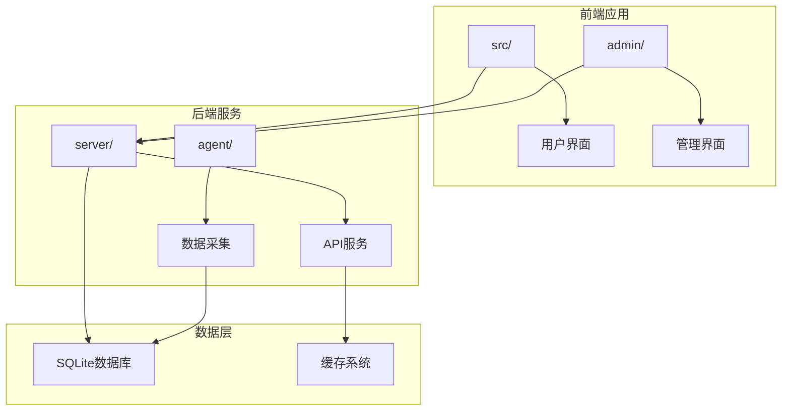
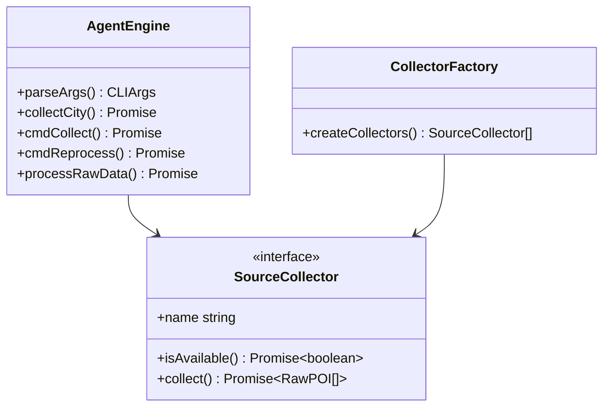
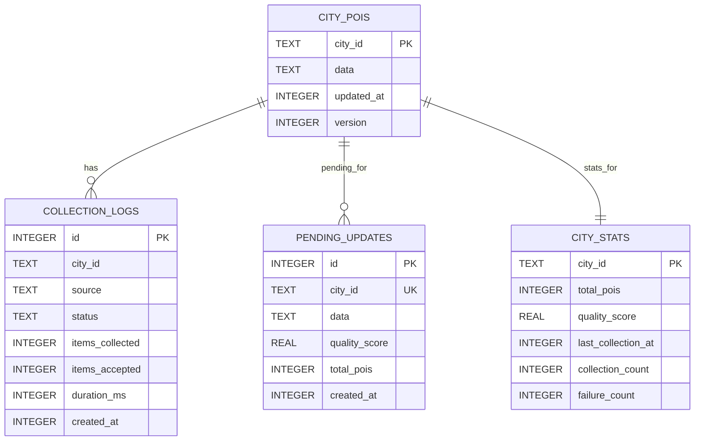
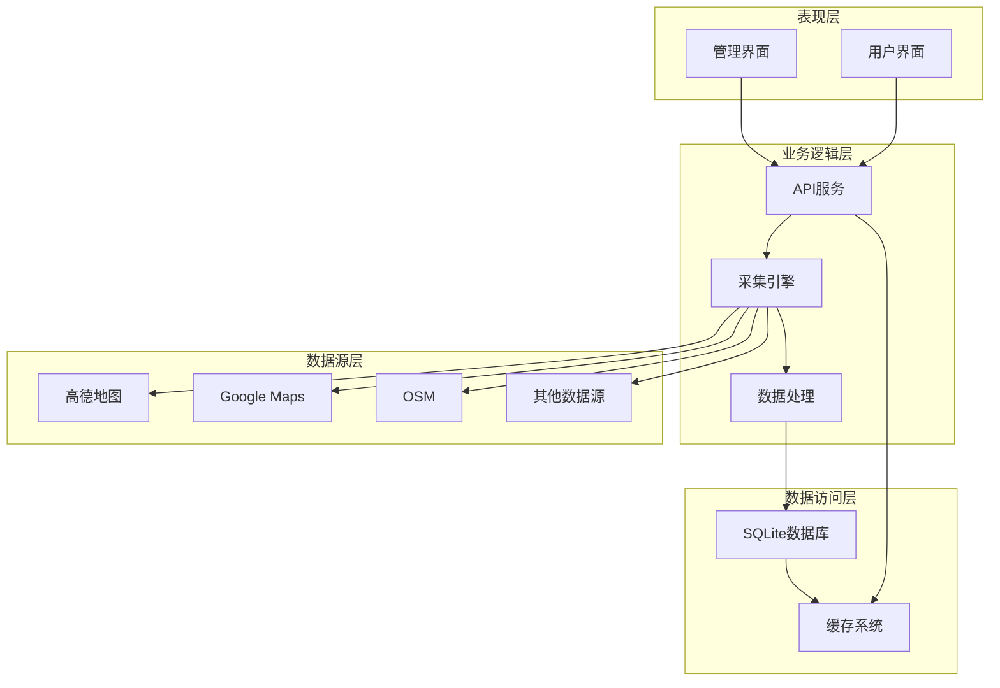
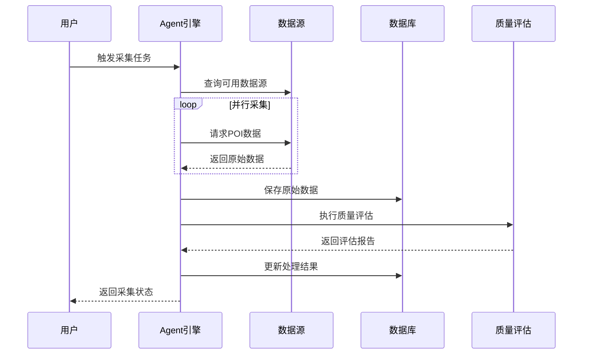
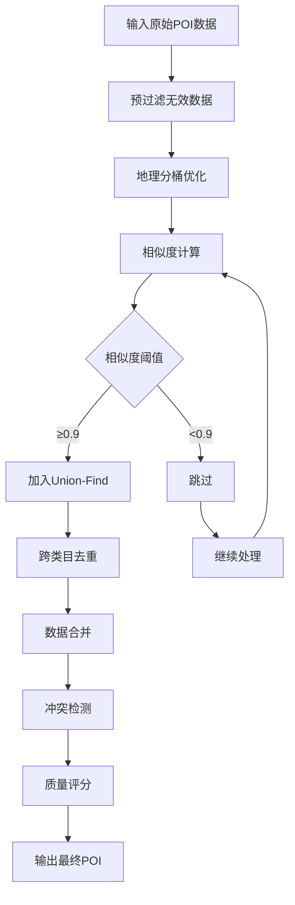
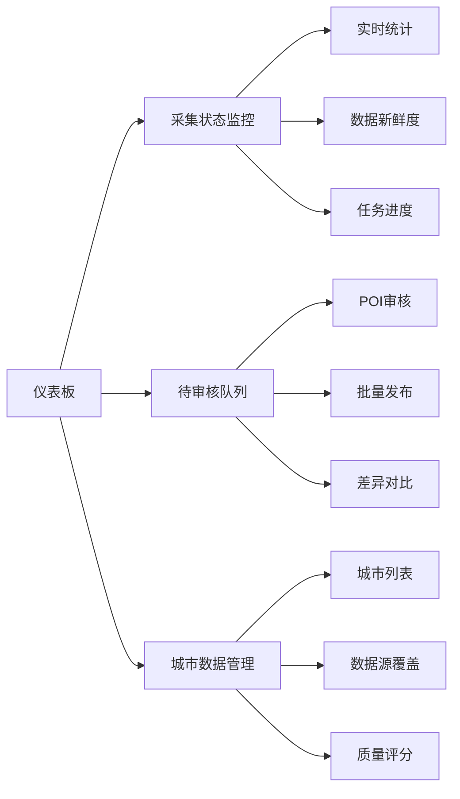
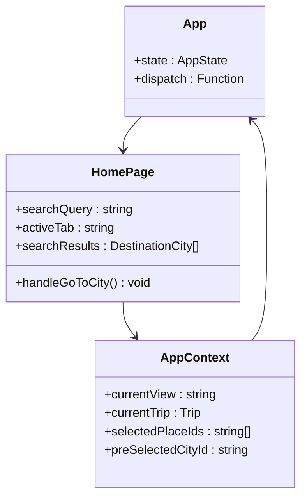
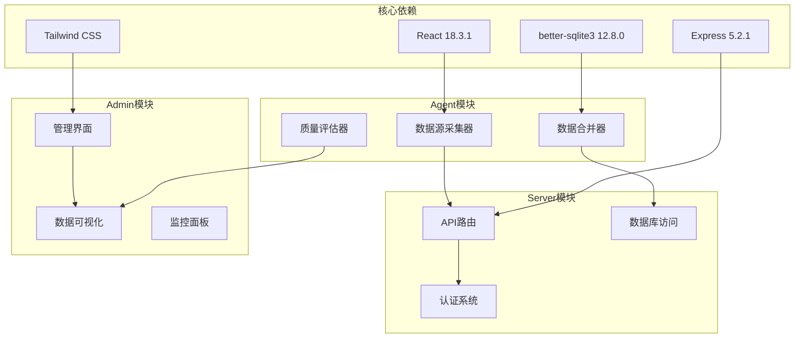
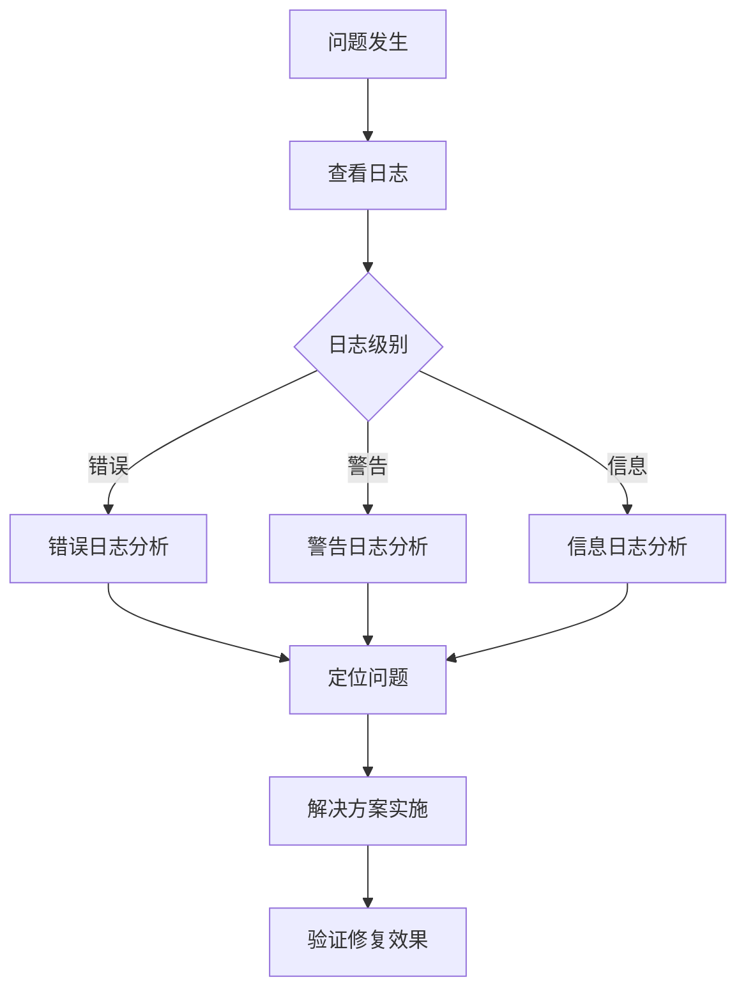

# POI采集监控系统

<cite>
**本文档引用的文件**
- [package.json](file://package.json)
- [agent/index.ts](file://agent/index.ts)
- [server/index.ts](file://server/index.ts)
- [agent/db.ts](file://agent/db.ts)
- [server/db.ts](file://server/db.ts)
- [agent/sources/base.ts](file://agent/sources/base.ts)
- [agent/merger.ts](file://agent/merger.ts)
- [agent/quality.ts](file://agent/quality.ts)
- [admin/App.tsx](file://admin/App.tsx)
- [admin/pages/Dashboard.tsx](file://admin/pages/Dashboard.tsx)
- [admin/pages/CollectionDashboard.tsx](file://admin/pages/CollectionDashboard.tsx)
- [admin/pages/ReviewQueue.tsx](file://admin/pages/ReviewQueue.tsx)
- [src/App.tsx](file://src/App.tsx)
- [src/pages/HomePage.tsx](file://src/pages/HomePage.tsx)
- [src/context/AppContext.tsx](file://src/context/AppContext.tsx)
</cite>

## 目录
1. [项目概述](#项目概述)
2. [项目结构](#项目结构)
3. [核心组件](#核心组件)
4. [架构概览](#架构概览)
5. [详细组件分析](#详细组件分析)
6. [依赖关系分析](#依赖关系分析)
7. [性能考虑](#性能考虑)
8. [故障排除指南](#故障排除指南)
9. [结论](#结论)

## 项目概述

POI采集监控系统是一个基于React和Node.js构建的智能旅行规划平台，专注于POI（兴趣点）数据的采集、处理和管理。该系统通过多数据源采集、智能合并去重、质量评估和实时监控等功能，为用户提供高质量的旅行目的地数据。

系统采用前后端分离架构，包含三个主要模块：
- **Agent采集模块**：负责从多个数据源采集POI数据，执行数据合并和质量评估
- **Server服务模块**：提供RESTful API接口，管理用户数据和旅行计划
- **Admin管理模块**：提供Web界面用于监控和管理POI数据采集过程

## 项目结构

**图表来源**
- [package.json:1-59](file://package.json#L1-L59)
- [src/App.tsx:1-62](file://src/App.tsx#L1-L62)
- [admin/App.tsx:1-31](file://admin/App.tsx#L1-L31)

**章节来源**
- [package.json:1-59](file://package.json#L1-L59)
- [src/App.tsx:1-62](file://src/App.tsx#L1-L62)
- [admin/App.tsx:1-31](file://admin/App.tsx#L1-L31)

## 核心组件

### Agent采集引擎

Agent模块是系统的核心数据采集引擎，负责从多个数据源获取POI数据并进行处理：

**图表来源**
- [agent/index.ts:58-131](file://agent/index.ts#L58-L131)
- [agent/sources/base.ts:91-100](file://agent/sources/base.ts#L91-L100)

### 数据库管理系统

系统采用双数据库架构，分别管理采集数据和用户数据：

**图表来源**
- [agent/db.ts:34-151](file://agent/db.ts#L34-L151)
- [server/db.ts:37-147](file://server/db.ts#L37-L147)

**章节来源**
- [agent/index.ts:1-800](file://agent/index.ts#L1-L800)
- [agent/db.ts:1-552](file://agent/db.ts#L1-L552)
- [server/db.ts:1-513](file://server/db.ts#L1-L513)

## 架构概览

系统采用分层架构设计，确保各组件职责清晰、耦合度低：

**图表来源**
- [server/index.ts:1-790](file://server/index.ts#L1-L790)
- [agent/index.ts:115-131](file://agent/index.ts#L115-L131)

## 详细组件分析

### 数据采集流程

系统实现了完整的POI数据采集流程，包括数据源发现、数据收集、合并处理和质量评估：

**图表来源**
- [agent/index.ts:135-290](file://agent/index.ts#L135-L290)
- [agent/quality.ts:189-293](file://agent/quality.ts#L189-L293)

### 数据合并算法

系统采用先进的数据合并算法，支持跨类目的POI去重和智能合并：

**图表来源**
- [agent/merger.ts:501-800](file://agent/merger.ts#L501-L800)

**章节来源**
- [agent/index.ts:135-290](file://agent/index.ts#L135-L290)
- [agent/merger.ts:1-800](file://agent/merger.ts#L1-L800)
- [agent/quality.ts:1-344](file://agent/quality.ts#L1-L344)

### 管理界面功能

Admin管理界面提供了全面的数据监控和管理功能：

**图表来源**
- [admin/pages/Dashboard.tsx:12-182](file://admin/pages/Dashboard.tsx#L12-L182)
- [admin/pages/ReviewQueue.tsx:32-619](file://admin/pages/ReviewQueue.tsx#L32-L619)

**章节来源**
- [admin/pages/Dashboard.tsx:1-182](file://admin/pages/Dashboard.tsx#L1-L182)
- [admin/pages/CollectionDashboard.tsx:1-145](file://admin/pages/CollectionDashboard.tsx#L1-L145)
- [admin/pages/ReviewQueue.tsx:1-619](file://admin/pages/ReviewQueue.tsx#L1-L619)

### 用户界面组件

前端用户界面采用响应式设计，提供流畅的用户体验：

**图表来源**
- [src/App.tsx:17-62](file://src/App.tsx#L17-L62)
- [src/pages/HomePage.tsx:26-688](file://src/pages/HomePage.tsx#L26-L688)
- [src/context/AppContext.tsx:220-234](file://src/context/AppContext.tsx#L220-L234)

**章节来源**
- [src/App.tsx:1-62](file://src/App.tsx#L1-L62)
- [src/pages/HomePage.tsx:1-688](file://src/pages/HomePage.tsx#L1-L688)
- [src/context/AppContext.tsx:1-234](file://src/context/AppContext.tsx#L1-L234)

## 依赖关系分析

系统采用模块化设计，各组件之间通过清晰的接口进行通信：

**图表来源**
- [package.json:26-42](file://package.json#L26-L42)
- [agent/index.ts:24-53](file://agent/index.ts#L24-L53)
- [server/index.ts:29-53](file://server/index.ts#L29-L53)

**章节来源**
- [package.json:1-59](file://package.json#L1-L59)
- [agent/index.ts:1-800](file://agent/index.ts#L1-L800)
- [server/index.ts:1-790](file://server/index.ts#L1-L790)

## 性能考虑

系统在设计时充分考虑了性能优化，采用了多种策略来提升响应速度和数据处理效率：

### 缓存策略
- **多级缓存**：实现内存缓存、数据库缓存和HTTP缓存的多层次缓存机制
- **智能过期**：根据数据新鲜度动态调整缓存策略
- **预加载机制**：对热点数据进行预加载，减少用户等待时间

### 数据处理优化
- **并行处理**：支持多数据源并行采集，提升整体处理效率
- **增量更新**：仅处理发生变化的数据，避免全量重处理
- **内存管理**：采用流式处理和分批处理，控制内存使用

### 系统监控
- **实时指标**：监控系统性能指标，及时发现性能瓶颈
- **告警机制**：设置性能阈值告警，确保系统稳定运行
- **资源优化**：定期清理无用数据，保持系统最佳性能

## 故障排除指南

### 常见问题诊断

**数据采集失败**
1. 检查API密钥配置是否正确
2. 验证网络连接和防火墙设置
3. 查看数据源可用性状态
4. 检查代理设置和超时配置

**数据质量异常**
1. 验证POI数据格式是否符合规范
2. 检查坐标数据的有效性
3. 确认类目分类的准确性
4. 核对标签和描述信息的完整性

**系统性能问题**
1. 监控数据库连接池使用情况
2. 检查缓存命中率
3. 分析慢查询日志
4. 优化索引和查询语句

### 调试工具

系统提供了完善的调试工具和日志记录机制：

**章节来源**
- [agent/index.ts:570-673](file://agent/index.ts#L570-L673)
- [server/index.ts:108-144](file://server/index.ts#L108-L144)

## 结论

POI采集监控系统是一个功能完善、架构清晰的智能旅行规划平台。系统通过多数据源采集、智能合并去重、质量评估和实时监控等核心功能，为用户提供了高质量的旅行目的地数据。

系统的主要优势包括：
- **模块化设计**：清晰的组件划分和接口定义
- **高性能架构**：多级缓存和并行处理机制
- **全面监控**：实时数据监控和质量评估
- **用户友好**：直观的界面设计和良好的用户体验

未来可以考虑的功能扩展包括：
- 增强机器学习算法，提升数据质量评估准确性
- 添加更多数据源支持，扩大数据覆盖范围
- 优化移动端用户体验
- 增加更多个性化推荐功能