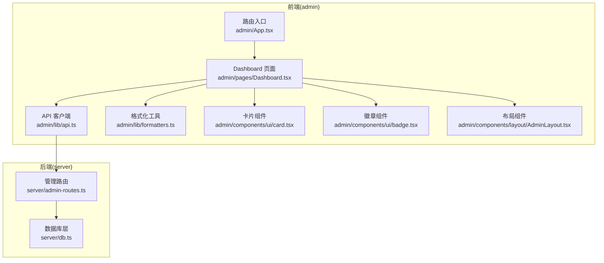
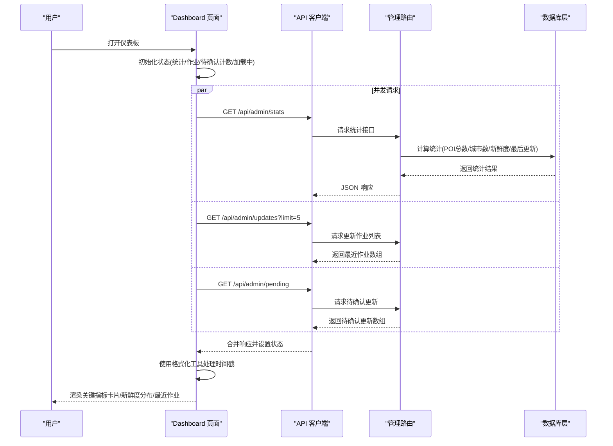
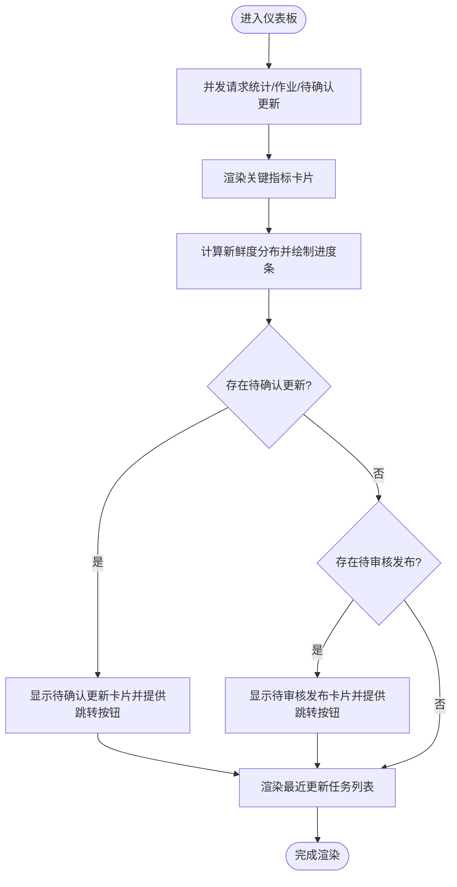
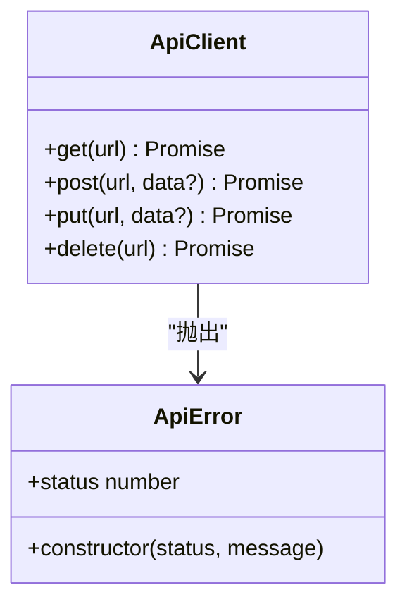
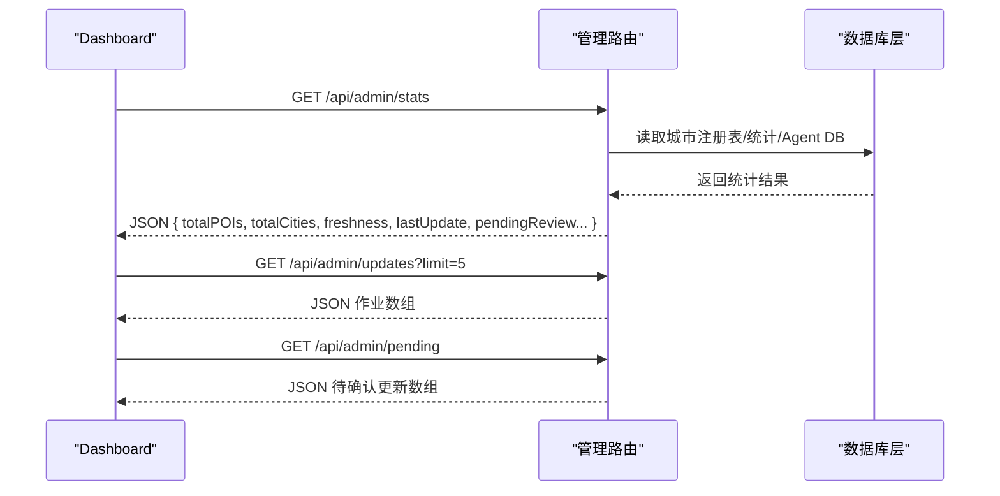
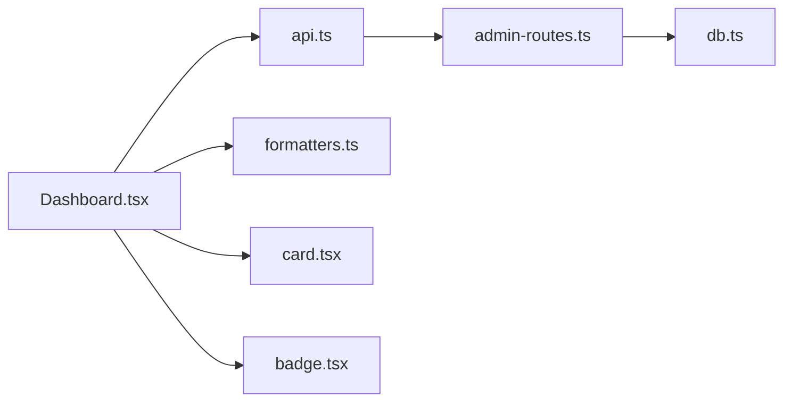

# 仪表板系统

<cite>
**本文档引用的文件**
- [admin/pages/Dashboard.tsx](file://admin/pages/Dashboard.tsx)
- [admin/lib/api.ts](file://admin/lib/api.ts)
- [admin/lib/formatters.ts](file://admin/lib/formatters.ts)
- [admin/types/index.ts](file://admin/types/index.ts)
- [admin/components/ui/card.tsx](file://admin/components/ui/card.tsx)
- [admin/components/ui/badge.tsx](file://admin/components/ui/badge.tsx)
- [admin/hooks/useDebounce.ts](file://admin/hooks/useDebounce.ts)
- [admin/App.tsx](file://admin/App.tsx)
- [admin/components/layout/AdminLayout.tsx](file://admin/components/layout/AdminLayout.tsx)
- [server/admin-routes.ts](file://server/admin-routes.ts)
- [server/db.ts](file://server/db.ts)
</cite>

## 目录
1. [简介](#简介)
2. [项目结构](#项目结构)
3. [核心组件](#核心组件)
4. [架构总览](#架构总览)
5. [详细组件分析](#详细组件分析)
6. [依赖关系分析](#依赖关系分析)
7. [性能考量](#性能考量)
8. [故障排查指南](#故障排查指南)
9. [结论](#结论)
10. [附录](#附录)

## 简介
本文件为后台管理仪表板的功能文档，聚焦于数据统计与实时监控面板的设计与实现。系统通过前端页面聚合后端统计接口返回的数据，形成关键业务指标卡片、数据新鲜度分布以及最近更新任务列表等核心展示模块。同时，系统支持待确认更新与待审核发布的提示与跳转，帮助运营人员快速定位工作流中的关键节点。

## 项目结构
仪表板位于 admin 前端工程中，采用 React + TypeScript 构建，UI 组件基于共享的通用组件库；后端服务通过 Express 路由提供统计与作业管理接口，数据存储采用 SQLite。整体采用前后端分离架构，前端通过统一的 API 客户端发起请求，后端在内存或数据库中计算统计信息并返回。

**图表来源**
- [admin/pages/Dashboard.tsx:1-182](file://admin/pages/Dashboard.tsx#L1-L182)
- [admin/lib/api.ts:1-33](file://admin/lib/api.ts#L1-L33)
- [admin/lib/formatters.ts:1-49](file://admin/lib/formatters.ts#L1-L49)
- [admin/components/ui/card.tsx:1-47](file://admin/components/ui/card.tsx#L1-L47)
- [admin/components/ui/badge.tsx:1-34](file://admin/components/ui/badge.tsx#L1-L34)
- [admin/components/layout/AdminLayout.tsx:1-23](file://admin/components/layout/AdminLayout.tsx#L1-L23)
- [admin/App.tsx:1-27](file://admin/App.tsx#L1-L27)
- [server/admin-routes.ts:440-496](file://server/admin-routes.ts#L440-L496)
- [server/db.ts:37-147](file://server/db.ts#L37-L147)

**章节来源**
- [admin/pages/Dashboard.tsx:1-182](file://admin/pages/Dashboard.tsx#L1-L182)
- [admin/App.tsx:1-27](file://admin/App.tsx#L1-L27)
- [admin/components/layout/AdminLayout.tsx:1-23](file://admin/components/layout/AdminLayout.tsx#L1-L23)
- [server/admin-routes.ts:440-496](file://server/admin-routes.ts#L440-L496)
- [server/db.ts:37-147](file://server/db.ts#L37-L147)

## 核心组件
- 仪表板页面：负责拉取统计、更新作业与待确认更新数据，渲染关键指标卡片、数据新鲜度分布与最近更新任务列表。
- API 客户端：封装统一的请求方法与错误处理，自动拼接后端基础路径。
- 格式化工具：提供日期、相对时间、坐标、分类等格式化函数，用于界面展示。
- UI 组件：卡片与徽章组件提供一致的视觉与交互语义，便于扩展新的指标模块。
- 类型定义：集中定义统计数据结构、作业状态与评分等级等类型，确保前后端契约清晰。

**章节来源**
- [admin/pages/Dashboard.tsx:12-182](file://admin/pages/Dashboard.tsx#L12-L182)
- [admin/lib/api.ts:10-32](file://admin/lib/api.ts#L10-L32)
- [admin/lib/formatters.ts:3-49](file://admin/lib/formatters.ts#L3-L49)
- [admin/components/ui/card.tsx:4-47](file://admin/components/ui/card.tsx#L4-L47)
- [admin/components/ui/badge.tsx:5-34](file://admin/components/ui/badge.tsx#L5-L34)
- [admin/types/index.ts:141-155](file://admin/types/index.ts#L141-L155)

## 架构总览
仪表板的数据流从后端统计接口开始，前端页面并发拉取三个数据源：统计概览、最近更新作业、待确认更新计数。随后根据类型定义进行渲染，使用格式化工具处理时间戳与分类标签，最终以卡片与进度条形式呈现。

**图表来源**
- [admin/pages/Dashboard.tsx:19-30](file://admin/pages/Dashboard.tsx#L19-L30)
- [admin/lib/api.ts:10-20](file://admin/lib/api.ts#L10-L20)
- [server/admin-routes.ts:444-496](file://server/admin-routes.ts#L444-L496)
- [server/admin-routes.ts:950-960](file://server/admin-routes.ts#L950-L960)
- [server/admin-routes.ts:1231-1272](file://server/admin-routes.ts#L1231-L1272)

**章节来源**
- [admin/pages/Dashboard.tsx:19-30](file://admin/pages/Dashboard.tsx#L19-L30)
- [admin/lib/api.ts:10-20](file://admin/lib/api.ts#L10-L20)
- [server/admin-routes.ts:444-496](file://server/admin-routes.ts#L444-L496)
- [server/admin-routes.ts:950-960](file://server/admin-routes.ts#L950-L960)
- [server/admin-routes.ts:1231-1272](file://server/admin-routes.ts#L1231-L1272)

## 详细组件分析

### 仪表板页面(Dashboard)
- 数据聚合与并发请求：页面在挂载时并发调用统计、最近更新作业与待确认更新接口，避免串行等待，提升首屏渲染速度。
- 关键指标卡片：展示 POI 总数、城市数、覆盖类目、最近更新时间等核心指标，图标与颜色区分不同维度，增强可读性。
- 数据新鲜度分布：按“新鲜 ≤3天”、“近期 ≤7天”、“老化 ≤14天”、“陈旧 ≤30天”、“过期 >30天”五个区间统计数量，计算百分比并以进度条可视化。
- 待确认更新与待审核发布：当存在待确认更新或待审核发布时，显示带颜色的主题卡片，提供一键跳转至对应页面。
- 最近更新任务：展示最近的更新作业，包含类型、目标区域、状态与创建时间，状态使用徽章组件进行语义化标识。

**图表来源**
- [admin/pages/Dashboard.tsx:19-30](file://admin/pages/Dashboard.tsx#L19-L30)
- [admin/pages/Dashboard.tsx:42-76](file://admin/pages/Dashboard.tsx#L42-L76)
- [admin/pages/Dashboard.tsx:118-178](file://admin/pages/Dashboard.tsx#L118-L178)

**章节来源**
- [admin/pages/Dashboard.tsx:12-182](file://admin/pages/Dashboard.tsx#L12-L182)

### API 客户端(api)
- 统一请求封装：自动拼接后端基础路径，提供 get/post/put/delete 方法。
- 错误处理：当响应非 OK 时解析错误消息并抛出自定义异常，便于上层捕获与提示。

**图表来源**
- [admin/lib/api.ts:10-32](file://admin/lib/api.ts#L10-L32)

**章节来源**
- [admin/lib/api.ts:1-33](file://admin/lib/api.ts#L1-L33)

### 格式化工具(formatters)
- 时间格式化：将时间戳格式化为本地日期字符串，支持年-月-日 时:分。
- 相对时间：根据当前时间计算“刚刚/分钟前/小时前/天前/月前/年前”，用于动态展示。
- 坐标格式化：将经纬度保留四位小数并以逗号连接。
- 分类格式化：将 L1 分类映射为中文标签，支持路径组合展示。
- 时长格式化：将秒数转换为“秒/分钟/小时”表达。

**章节来源**
- [admin/lib/formatters.ts:3-49](file://admin/lib/formatters.ts#L3-L49)

### UI 组件(card/badge)
- 卡片组件：提供标题区、内容区与描述区的标准结构，便于复用与样式统一。
- 徽章组件：支持多种语义化变体（默认/次要/破坏/轮廓/成功/警告/信息），用于状态标识。

**章节来源**
- [admin/components/ui/card.tsx:4-47](file://admin/components/ui/card.tsx#L4-L47)
- [admin/components/ui/badge.tsx:5-34](file://admin/components/ui/badge.tsx#L5-L34)

### 类型定义(types)
- 统计数据结构：包含 POI 总数、城市总数、覆盖类目数、最后更新时间、新鲜度分布、待审核城市与 POI 数量。
- 更新作业类型：包含作业 ID、类型（批量/定向）、状态、配置、进度、结果、错误、时间戳等字段。
- 评分等级配置：定义 A/B/C/D 四档评分的范围与颜色，便于在界面中进行分级展示。

**章节来源**
- [admin/types/index.ts:141-155](file://admin/types/index.ts#L141-L155)
- [admin/types/index.ts:104-127](file://admin/types/index.ts#L104-L127)
- [admin/types/index.ts:184-189](file://admin/types/index.ts#L184-L189)

### 路由与数据源(server/admin-routes.ts)
- 统计接口(/stats)：汇总 POI 总数、城市总数、新鲜度分布、最后更新时间，并统计待审核发布的城市与 POI 数量。
- 更新作业接口(/updates)：提供最近作业列表与单个作业详情查询。
- 待确认更新接口(/pending)：列出所有待确认更新并提供按城市查看的详细对比。

**图表来源**
- [server/admin-routes.ts:444-496](file://server/admin-routes.ts#L444-L496)
- [server/admin-routes.ts:950-960](file://server/admin-routes.ts#L950-L960)
- [server/admin-routes.ts:1231-1272](file://server/admin-routes.ts#L1231-L1272)

**章节来源**
- [server/admin-routes.ts:444-496](file://server/admin-routes.ts#L444-L496)
- [server/admin-routes.ts:950-960](file://server/admin-routes.ts#L950-L960)
- [server/admin-routes.ts:1231-1272](file://server/admin-routes.ts#L1231-L1272)

## 依赖关系分析
- 前端依赖：Dashboard 依赖 API 客户端与格式化工具；UI 组件提供卡片与徽章；类型定义贯穿数据结构与状态管理。
- 后端依赖：管理路由依赖数据库层与城市注册表/坐标数据；统计计算涉及 Agent DB 与 Server DB 的对比。
- 路由契约：前端通过固定前缀的路径访问后端接口，接口返回结构遵循统一的响应模型。

**图表来源**
- [admin/pages/Dashboard.tsx:1-11](file://admin/pages/Dashboard.tsx#L1-L11)
- [admin/lib/api.ts:1-33](file://admin/lib/api.ts#L1-L33)
- [admin/lib/formatters.ts:1-49](file://admin/lib/formatters.ts#L1-L49)
- [admin/components/ui/card.tsx:1-47](file://admin/components/ui/card.tsx#L1-L47)
- [admin/components/ui/badge.tsx:1-34](file://admin/components/ui/badge.tsx#L1-L34)
- [server/admin-routes.ts:444-496](file://server/admin-routes.ts#L444-L496)
- [server/db.ts:37-147](file://server/db.ts#L37-L147)

**章节来源**
- [admin/pages/Dashboard.tsx:1-11](file://admin/pages/Dashboard.tsx#L1-L11)
- [admin/lib/api.ts:1-33](file://admin/lib/api.ts#L1-L33)
- [server/admin-routes.ts:444-496](file://server/admin-routes.ts#L444-L496)
- [server/db.ts:37-147](file://server/db.ts#L37-L147)

## 性能考量
- 并发请求：在仪表板初始化时并发拉取统计、作业与待确认更新，减少首屏等待时间。
- 数据懒加载：卡片与列表在数据可用时再渲染，避免空数据造成的额外计算。
- 进度条计算：新鲜度分布仅在存在数据时进行百分比计算，避免无效渲染。
- 组件复用：通过通用卡片与徽章组件降低重复实现成本，提高维护效率。
- 建议优化点：
  - 引入节流/防抖钩子以应对频繁筛选或轮询场景（现有节流钩子可用于输入框搜索等）。
  - 对时间戳格式化与分类映射进行缓存，减少重复计算。
  - 对于大量作业列表，建议引入虚拟滚动或分页加载。

**章节来源**
- [admin/pages/Dashboard.tsx:19-30](file://admin/pages/Dashboard.tsx#L19-L30)
- [admin/hooks/useDebounce.ts:1-11](file://admin/hooks/useDebounce.ts#L1-L11)

## 故障排查指南
- 接口错误处理：API 客户端在响应非 OK 时抛出自定义异常，携带状态码与消息，便于前端捕获并提示用户。
- 常见问题定位：
  - 统计为空：检查后端统计接口是否正确读取城市注册表与统计数据。
  - 作业列表为空：确认作业队列是否存在数据，或 limit 参数是否过大导致截断。
  - 待确认更新为空：确认 Agent DB 中是否存在 pending_updates 表及数据。
- 建议排查步骤：
  - 查看浏览器网络面板，确认请求路径与状态码。
  - 在后端日志中定位统计与作业接口的执行情况。
  - 核对数据库表结构与数据完整性。

**章节来源**
- [admin/lib/api.ts:3-8](file://admin/lib/api.ts#L3-L8)
- [admin/lib/api.ts:15-19](file://admin/lib/api.ts#L15-L19)
- [server/admin-routes.ts:444-496](file://server/admin-routes.ts#L444-L496)
- [server/admin-routes.ts:950-960](file://server/admin-routes.ts#L950-L960)
- [server/admin-routes.ts:1231-1272](file://server/admin-routes.ts#L1231-L1272)

## 结论
仪表板系统通过简洁的前端页面与明确的后端接口契约，实现了对 POI 数据的多维度统计与实时监控。关键指标卡片、数据新鲜度分布与最近更新任务列表共同构成了运营人员的决策依据。未来可在数据刷新策略、筛选与分页、以及可视化组件扩展方面进一步完善，以提升用户体验与系统可维护性。

## 附录
- 仪表板核心指标
  - POI 总数：全量 POI 数量。
  - 城市数：注册城市总数。
  - 覆盖类目：L1 类目数量。
  - 最近更新：最后一次采集时间。
  - 新鲜度分布：按时间窗口划分的 POI 数量占比。
  - 待确认更新：Agent DB 中新增/变更但尚未应用的数量。
  - 待审核发布：待审核的 POI 数量与城市数。
- 可视化组件建议
  - 折线图：展示 POI 数量随时间的趋势变化。
  - 柱状图：按 L1/L2/L3 分类统计 POI 数量。
  - 饼图：展示各类目占比或新鲜度分布占比。
  - 实时监控面板：结合 WebSocket 或轮询，展示作业状态与错误率。
- 自定义功能建议
  - 指标选择：允许用户勾选显示的指标卡片。
  - 时间范围筛选：支持按日/周/月等粒度切换统计周期。
  - 视图配置：保存用户的布局偏好与筛选条件。
- 数据刷新机制
  - 轮询：定时请求后端接口，更新关键指标。
  - 事件驱动：监听后端推送或本地状态变化触发刷新。
  - 缓存策略：对静态数据（如城市注册表）进行本地缓存，减少重复请求。
- 设计最佳实践
  - 一致性：统一使用卡片与徽章组件，保持视觉与交互一致。
  - 可读性：合理使用颜色与图标，避免信息过载。
  - 可访问性：为图标与状态提供文本描述，支持键盘导航。
  - 响应式：适配不同屏幕尺寸，保证移动端可读性。