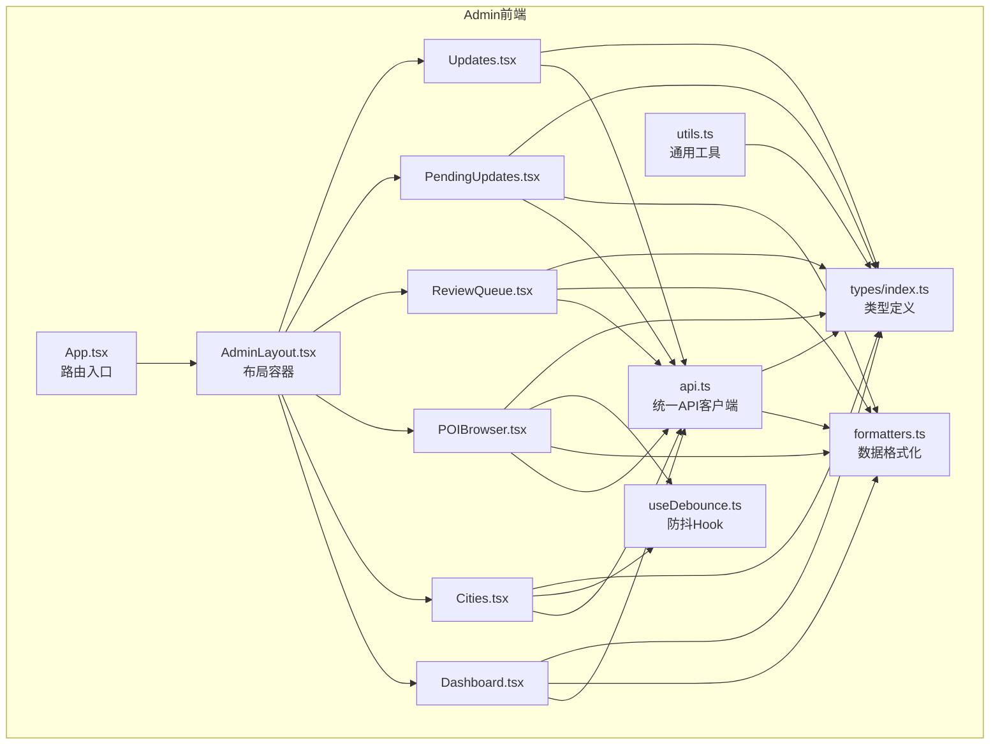
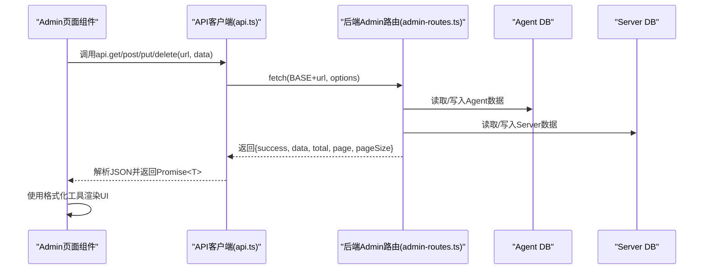
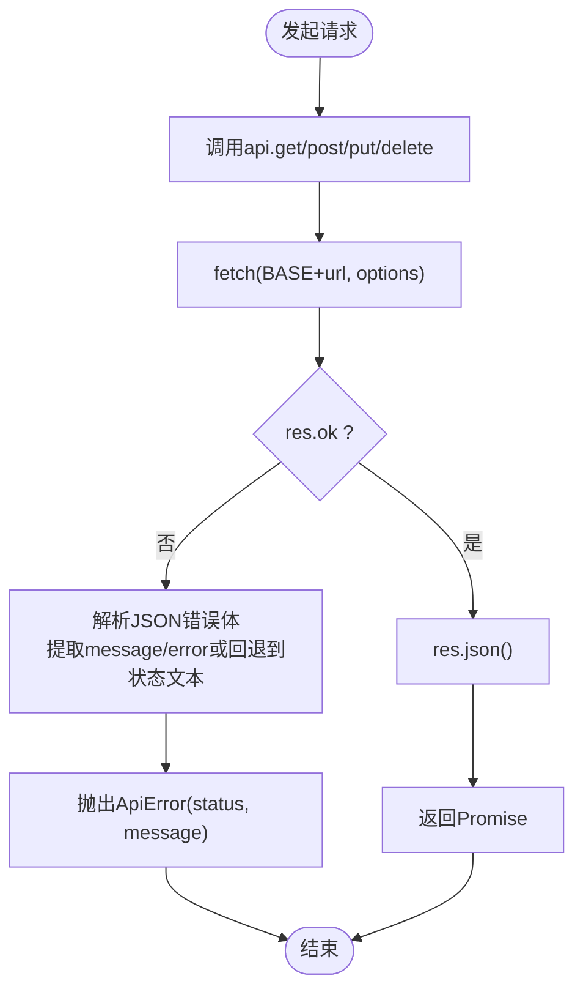
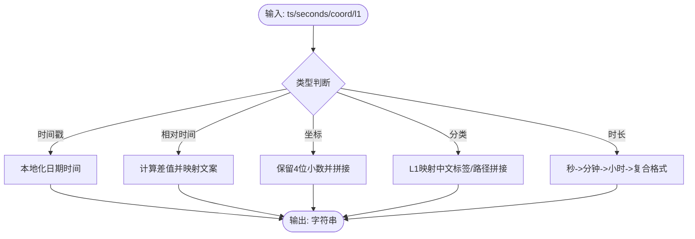
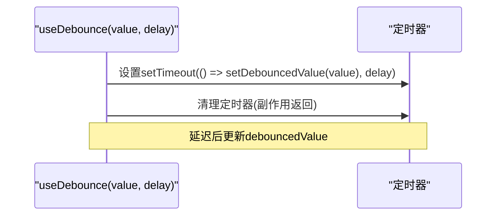
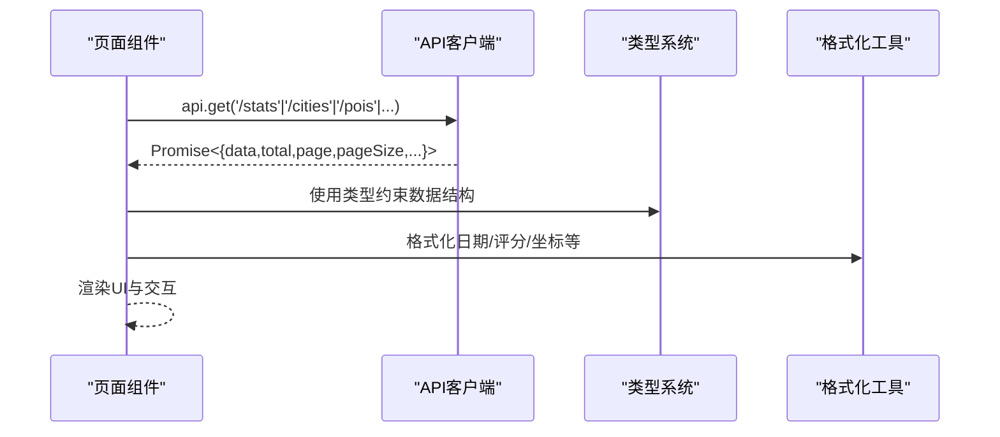
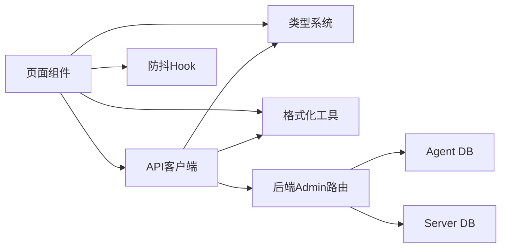

# 后台API集成

<cite>
**本文档引用的文件**
- [admin/lib/api.ts](file://admin/lib/api.ts)
- [admin/lib/formatters.ts](file://admin/lib/formatters.ts)
- [admin/lib/utils.ts](file://admin/lib/utils.ts)
- [admin/hooks/useDebounce.ts](file://admin/hooks/useDebounce.ts)
- [admin/types/index.ts](file://admin/types/index.ts)
- [admin/pages/Dashboard.tsx](file://admin/pages/Dashboard.tsx)
- [admin/pages/Cities.tsx](file://admin/pages/Cities.tsx)
- [admin/pages/POIBrowser.tsx](file://admin/pages/POIBrowser.tsx)
- [admin/pages/ReviewQueue.tsx](file://admin/pages/ReviewQueue.tsx)
- [admin/pages/PendingUpdates.tsx](file://admin/pages/PendingUpdates.tsx)
- [admin/pages/Updates.tsx](file://admin/pages/Updates.tsx)
- [admin/App.tsx](file://admin/App.tsx)
- [admin/components/layout/AdminLayout.tsx](file://admin/components/layout/AdminLayout.tsx)
- [server/admin-routes.ts](file://server/admin-routes.ts)
- [server/index.ts](file://server/index.ts)
</cite>

## 目录
1. [简介](#简介)
2. [项目结构](#项目结构)
3. [核心组件](#核心组件)
4. [架构总览](#架构总览)
5. [详细组件分析](#详细组件分析)
6. [依赖关系分析](#依赖关系分析)
7. [性能考量](#性能考量)
8. [故障排查指南](#故障排查指南)
9. [结论](#结论)
10. [附录](#附录)

## 简介
本文件面向后台管理系统（Admin）的API集成，系统采用前端React + 后端Express的双端架构，Admin前端通过统一的API客户端封装与后端Admin路由进行交互，提供仪表盘、城市与POI管理、审核发布、待确认更新、数据更新等能力。本文档重点阐述：
- API客户端封装设计（请求配置、错误处理、响应解析）
- 数据格式化工具（日期、相对时间、坐标、分类、时长等）
- 通用工具函数（UI样式合并）
- 防抖Hook（搜索与表单输入优化）
- API调用最佳实践与性能优化策略
- 错误处理与异常恢复机制
- API版本管理与向后兼容性考虑

## 项目结构
后台Admin前端位于admin目录，核心模块包括：
- lib：API客户端、格式化工具、通用工具
- hooks：自定义Hook（如useDebounce）
- types：类型定义（POI、城市、审核、评分等级等）
- pages：页面组件（Dashboard、Cities、POIBrowser、ReviewQueue、PendingUpdates、Updates）
- components/layout：布局组件（AdminLayout、Header、Sidebar）

**图表来源**
- [admin/App.tsx:11-26](file://admin/App.tsx#L11-L26)
- [admin/components/layout/AdminLayout.tsx:6-22](file://admin/components/layout/AdminLayout.tsx#L6-L22)
- [admin/lib/api.ts:10-32](file://admin/lib/api.ts#L10-L32)
- [admin/lib/formatters.ts:3-48](file://admin/lib/formatters.ts#L3-L48)
- [admin/lib/utils.ts:4-6](file://admin/lib/utils.ts#L4-L6)
- [admin/hooks/useDebounce.ts:3-9](file://admin/hooks/useDebounce.ts#L3-L9)
- [admin/types/index.ts:129-277](file://admin/types/index.ts#L129-L277)

**章节来源**
- [admin/App.tsx:11-26](file://admin/App.tsx#L11-L26)
- [admin/components/layout/AdminLayout.tsx:6-22](file://admin/components/layout/AdminLayout.tsx#L6-L22)

## 核心组件
- API客户端：统一的请求封装，自动拼接基础路径、设置Content-Type、处理非OK响应并抛出结构化错误，支持GET/POST/PUT/DELETE。
- 数据格式化：提供日期、相对时间、坐标、分类、时长等格式化方法，统一展示风格。
- 通用工具：cn用于Tailwind样式类合并。
- 防抖Hook：对搜索输入等高频变更进行节流，降低网络请求压力。
- 类型系统：集中定义POI、城市、审核、评分等级、API响应等类型，保证前后端契约一致。

**章节来源**
- [admin/lib/api.ts:10-32](file://admin/lib/api.ts#L10-L32)
- [admin/lib/formatters.ts:3-48](file://admin/lib/formatters.ts#L3-L48)
- [admin/lib/utils.ts:4-6](file://admin/lib/utils.ts#L4-L6)
- [admin/hooks/useDebounce.ts:3-9](file://admin/hooks/useDebounce.ts#L3-L9)
- [admin/types/index.ts:129-277](file://admin/types/index.ts#L129-L277)

## 架构总览
Admin前端通过统一API客户端访问后端Admin路由，后端Admin路由连接Agent DB与Server DB，提供统计、城市、POI、审核、发布、更新等接口。前端页面按需调用API，配合格式化工具与类型系统完成数据渲染与交互。

**图表来源**
- [admin/lib/api.ts:10-20](file://admin/lib/api.ts#L10-L20)
- [server/admin-routes.ts:444-496](file://server/admin-routes.ts#L444-L496)
- [server/admin-routes.ts:500-557](file://server/admin-routes.ts#L500-L557)
- [server/admin-routes.ts:707-750](file://server/admin-routes.ts#L707-L750)

**章节来源**
- [server/admin-routes.ts:6-25](file://server/admin-routes.ts#L6-L25)
- [server/index.ts:104-104](file://server/index.ts#L104-L104)

## 详细组件分析

### API客户端封装设计
- 请求配置
  - 基础路径：统一前缀“/api/admin”，所有调用自动拼接。
  - Content-Type：默认application/json，可由调用方传入覆盖。
  - 方法封装：get/post/put/delete分别构造请求体与body。
- 错误处理
  - 非OK响应：尝试解析JSON中的message/error字段，否则回退到状态文本；抛出结构化ApiError，包含status与message。
- 响应解析
  - 成功响应：统一解析为JSON；调用方以Promise<T>接收，其中T为泛型类型参数。

**图表来源**
- [admin/lib/api.ts:10-20](file://admin/lib/api.ts#L10-L20)
- [admin/lib/api.ts:3-8](file://admin/lib/api.ts#L3-L8)

**章节来源**
- [admin/lib/api.ts:10-32](file://admin/lib/api.ts#L10-L32)

### 数据格式化工具
- 日期格式化：本地化日期时间字符串，支持空值返回占位符。
- 相对时间：计算与当前时间差，输出“刚刚/分钟前/小时前/天前/月前/年前”等人性化文案。
- 坐标格式化：保留小数点后4位，统一“纬度, 经度”显示。
- 分类格式化：根据L1分类映射中文标签，支持路径拼接。
- 时长格式化：将秒数转为“秒/分钟/小时+分钟”的可读格式。

**图表来源**
- [admin/lib/formatters.ts:3-48](file://admin/lib/formatters.ts#L3-L48)

**章节来源**
- [admin/lib/formatters.ts:3-48](file://admin/lib/formatters.ts#L3-L48)

### 通用工具函数
- cn：基于clsx与tailwind-merge合并多个CSS类，避免重复与冲突，简化条件样式组合。

**章节来源**
- [admin/lib/utils.ts:4-6](file://admin/lib/utils.ts#L4-L6)

### 防抖Hook实现与应用
- 实现原理：使用useState保存目标值，useEffect在value或delay变化时设置定时器，延迟将debouncedValue同步为最新值；清理时清除定时器。
- 应用场景：
  - POI搜索：在POIBrowser中对查询关键词进行300ms防抖，减少频繁搜索请求。
  - 城市列表输入：在Cities中对搜索框输入进行防抖，优化筛选性能。

**图表来源**
- [admin/hooks/useDebounce.ts:3-9](file://admin/hooks/useDebounce.ts#L3-L9)

**章节来源**
- [admin/hooks/useDebounce.ts:3-9](file://admin/hooks/useDebounce.ts#L3-L9)
- [admin/pages/POIBrowser.tsx:47-47](file://admin/pages/POIBrowser.tsx#L47-L47)

### 页面组件中的API调用模式
- Dashboard：并发获取统计数据、最近更新任务、待确认更新数量，使用格式化工具渲染时间与进度条。
- Cities：列表加载、搜索过滤、删除操作；新增城市时进行经纬度校验与API提交。
- POIBrowser：多维筛选（城市、分类、评分等级）、分页、搜索（全局/按关键词）、URL参数同步。
- ReviewQueue：获取审核概要、展开城市详情、发布操作（整城/按POI/按评分等级）、差异对比弹窗。
- PendingUpdates：获取待确认列表、展开详情、确认/拒绝/批量确认。
- Updates：获取更新任务列表、自动轮询运行中任务、批量更新对话框。

**图表来源**
- [admin/pages/Dashboard.tsx:19-30](file://admin/pages/Dashboard.tsx#L19-L30)
- [admin/pages/Cities.tsx:23-29](file://admin/pages/Cities.tsx#L23-L29)
- [admin/pages/POIBrowser.tsx:60-82](file://admin/pages/POIBrowser.tsx#L60-L82)
- [admin/pages/ReviewQueue.tsx:54-63](file://admin/pages/ReviewQueue.tsx#L54-L63)
- [admin/pages/PendingUpdates.tsx:60-69](file://admin/pages/PendingUpdates.tsx#L60-L69)
- [admin/pages/Updates.tsx:23-35](file://admin/pages/Updates.tsx#L23-L35)

**章节来源**
- [admin/pages/Dashboard.tsx:19-30](file://admin/pages/Dashboard.tsx#L19-L30)
- [admin/pages/Cities.tsx:23-48](file://admin/pages/Cities.tsx#L23-L48)
- [admin/pages/POIBrowser.tsx:60-96](file://admin/pages/POIBrowser.tsx#L60-L96)
- [admin/pages/ReviewQueue.tsx:54-110](file://admin/pages/ReviewQueue.tsx#L54-L110)
- [admin/pages/PendingUpdates.tsx:60-123](file://admin/pages/PendingUpdates.tsx#L60-L123)
- [admin/pages/Updates.tsx:23-43](file://admin/pages/Updates.tsx#L23-L43)

## 依赖关系分析
- 组件耦合
  - 页面组件依赖API客户端与类型系统，形成清晰的调用链。
  - 格式化工具被多个页面共享，降低重复逻辑。
  - 防抖Hook被搜索与输入场景复用，提升交互体验。
- 外部依赖
  - 后端Admin路由提供统一REST接口，连接Agent DB与Server DB。
  - Express中间件与CORS配置支持跨域与JSON解析。
- 潜在循环依赖
  - 未发现直接循环依赖；类型定义集中在types/index.ts，被各页面与工具模块引用。

**图表来源**
- [admin/lib/api.ts:10-32](file://admin/lib/api.ts#L10-L32)
- [server/admin-routes.ts:444-496](file://server/admin-routes.ts#L444-L496)

**章节来源**
- [server/admin-routes.ts:38-62](file://server/admin-routes.ts#L38-L62)
- [server/index.ts:60-61](file://server/index.ts#L60-L61)

## 性能考量
- 防抖与节流
  - POIBrowser对搜索关键词使用300ms防抖，显著减少搜索请求频率。
  - 城市列表搜索同样受益于防抖，避免高频输入触发过多请求。
- 分页与筛选
  - 后端支持分页与评分等级过滤，前端控制pageSize与scoreGrade，避免一次性加载大量数据。
- 并发请求
  - Dashboard使用Promise.all并发拉取统计数据、更新任务与待确认列表，缩短首屏等待时间。
- 缓存与异步刷新（后端）
  - 后端对POI与酒店数据采用三段式缓存策略，命中缓存即刻返回，同时异步刷新，兼顾响应速度与数据新鲜度。

**章节来源**
- [admin/pages/POIBrowser.tsx:47-47](file://admin/pages/POIBrowser.tsx#L47-L47)
- [admin/pages/Dashboard.tsx:20-29](file://admin/pages/Dashboard.tsx#L20-L29)
- [server/index.ts:108-144](file://server/index.ts#L108-L144)

## 故障排查指南
- API错误处理
  - 客户端在非OK响应时解析错误消息并抛出结构化ApiError，便于上层捕获与提示。
  - 页面组件在API调用处使用.catch或try/catch处理错误，避免崩溃并给出用户提示。
- 常见问题定位
  - 400/404/409/403：检查请求参数、资源是否存在、鉴权是否通过。
  - 500/503：检查后端服务状态、API Key配置、Agent DB/Server DB可用性。
- 异常恢复
  - 页面组件在加载失败时清空数据并显示占位骨架，保证界面稳定。
  - 审核发布流程中，失败时生成包含validationMessage的结果对象，指导用户修复。

**章节来源**
- [admin/lib/api.ts:15-18](file://admin/lib/api.ts#L15-L18)
- [admin/pages/Cities.tsx:40-48](file://admin/pages/Cities.tsx#L40-L48)
- [admin/pages/ReviewQueue.tsx:100-109](file://admin/pages/ReviewQueue.tsx#L100-L109)
- [server/index.ts:128-143](file://server/index.ts#L128-L143)

## 结论
本后台API集成为Admin前端提供了统一、健壮、易用的通信通道。通过API客户端封装、类型系统、格式化工具与防抖Hook，实现了良好的开发体验与用户体验。结合后端的三段式缓存与异步刷新策略，系统在性能与数据新鲜度之间取得平衡。建议持续完善错误提示与监控埋点，进一步提升可观测性与可维护性。

## 附录

### API版本管理与向后兼容
- 版本策略
  - 建议在基础路径中引入版本号，如“/api/admin/v1”，以隔离破坏性变更。
- 向后兼容
  - 新增字段采用可选属性，避免强制迁移。
  - 保持现有字段命名与语义稳定，必要时通过别名或映射兼容旧客户端。
- 迁移与降级
  - 提供灰度发布窗口，逐步切换至新版本接口。
  - 旧版本接口保留过渡期，记录弃用时间表，避免突然断链。

[本节为通用指导，无需具体文件引用]