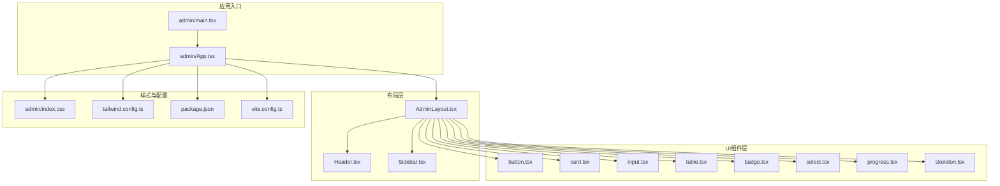
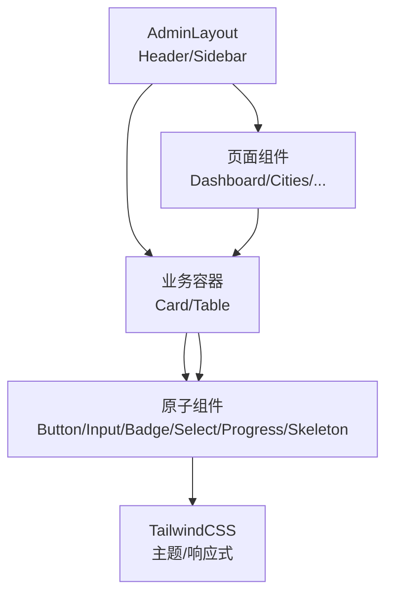
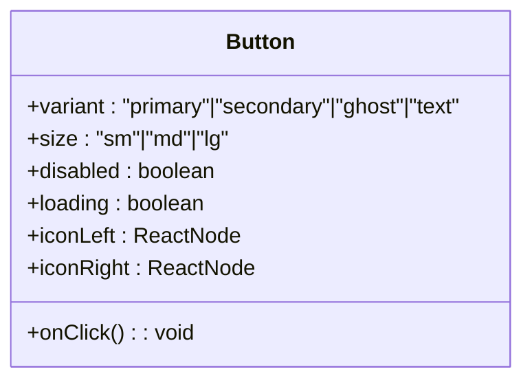
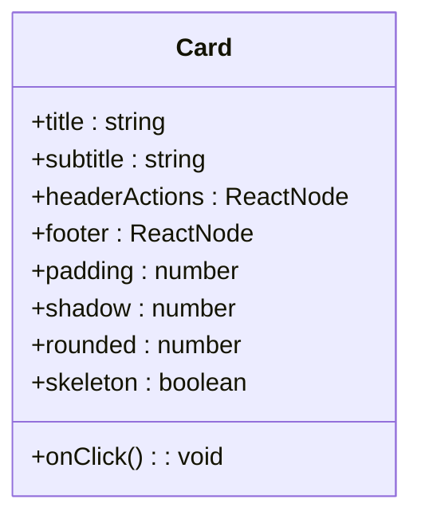
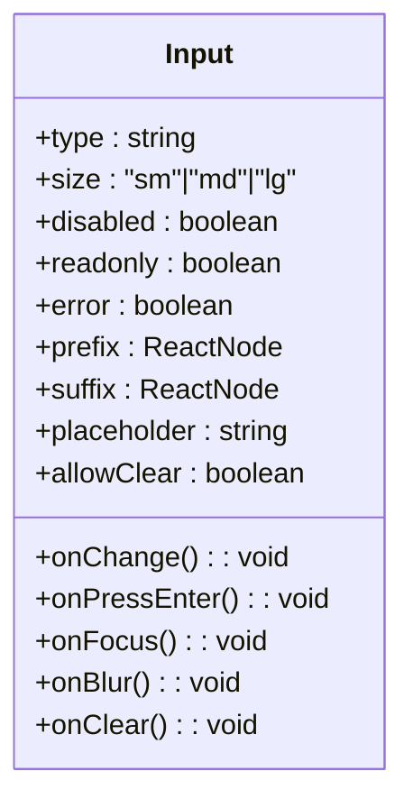
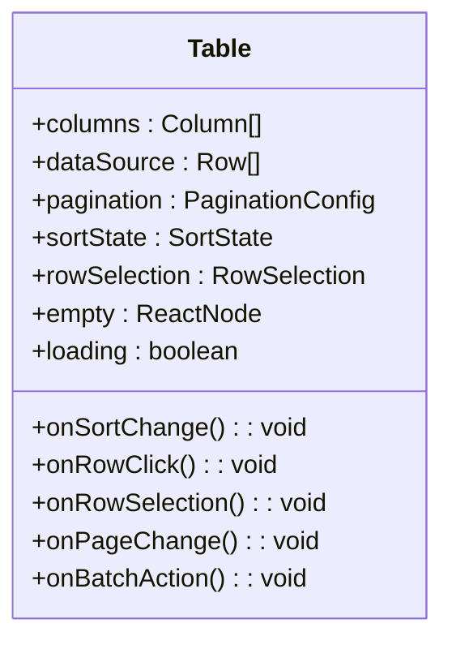
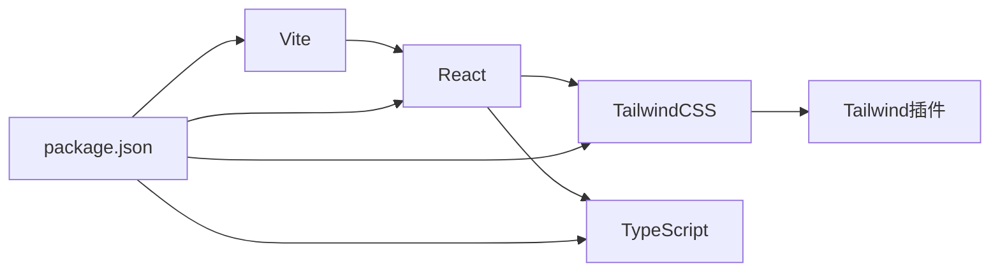

# 后台UI组件库

<cite>
**本文引用的文件**
- [admin/components/ui/button.tsx](file://admin/components/ui/button.tsx)
- [admin/components/ui/card.tsx](file://admin/components/ui/card.tsx)
- [admin/components/ui/input.tsx](file://admin/components/ui/input.tsx)
- [admin/components/ui/table.tsx](file://admin/components/ui/table.tsx)
- [admin/components/ui/badge.tsx](file://admin/components/ui/badge.tsx)
- [admin/components/ui/select.tsx](file://admin/components/ui/select.tsx)
- [admin/components/ui/progress.tsx](file://admin/components/ui/progress.tsx)
- [admin/components/ui/skeleton.tsx](file://admin/components/ui/skeleton.tsx)
- [admin/components/layout/AdminLayout.tsx](file://admin/components/layout/AdminLayout.tsx)
- [admin/components/layout/Header.tsx](file://admin/components/layout/Header.tsx)
- [admin/components/layout/Sidebar.tsx](file://admin/components/layout/Sidebar.tsx)
- [admin/App.tsx](file://admin/App.tsx)
- [admin/main.tsx](file://admin/main.tsx)
- [admin/index.css](file://admin/index.css)
- [tailwind.config.ts](file://tailwind.config.ts)
- [package.json](file://package.json)
- [vite.config.ts](file://vite.config.ts)
</cite>

## 目录
1. [简介](#简介)
2. [项目结构](#项目结构)
3. [核心组件](#核心组件)
4. [架构总览](#架构总览)
5. [详细组件分析](#详细组件分析)
6. [依赖分析](#依赖分析)
7. [性能考虑](#性能考虑)
8. [故障排查指南](#故障排查指南)
9. [结论](#结论)
10. [附录](#附录)

## 简介
本文件为后台管理系统UI组件库的权威文档，聚焦于Button、Card、Input、Table等基础组件的设计理念、使用场景与实现细节。文档覆盖组件属性配置、事件处理、样式定制、主题与响应式适配、可复用与扩展性、无障碍访问支持、跨浏览器兼容性、组件间协作与组合模式，并提供最佳实践与常见问题解决方案。

## 项目结构
后台管理前端采用Vite + React + TailwindCSS技术栈，UI组件集中于admin/components/ui目录，布局组件位于admin/components/layout目录，页面组件位于admin/pages目录。TailwindCSS通过tailwind.config.ts进行定制化配置，全局样式在admin/index.css中定义。

**图表来源**
- [admin/main.tsx](file://admin/main.tsx)
- [admin/App.tsx](file://admin/App.tsx)
- [admin/components/layout/AdminLayout.tsx](file://admin/components/layout/AdminLayout.tsx)
- [admin/components/ui/button.tsx](file://admin/components/ui/button.tsx)
- [admin/components/ui/card.tsx](file://admin/components/ui/card.tsx)
- [admin/components/ui/input.tsx](file://admin/components/ui/input.tsx)
- [admin/components/ui/table.tsx](file://admin/components/ui/table.tsx)
- [admin/index.css](file://admin/index.css)
- [tailwind.config.ts](file://tailwind.config.ts)
- [package.json](file://package.json)
- [vite.config.ts](file://vite.config.ts)

**章节来源**
- [admin/main.tsx](file://admin/main.tsx)
- [admin/App.tsx](file://admin/App.tsx)
- [admin/components/layout/AdminLayout.tsx](file://admin/components/layout/AdminLayout.tsx)
- [tailwind.config.ts](file://tailwind.config.ts)
- [admin/index.css](file://admin/index.css)

## 核心组件
本节对Button、Card、Input、Table四个基础组件进行深入解析，涵盖设计理念、属性配置、事件处理、样式定制与可复用性。

- Button（按钮）
  - 设计理念：强调语义明确、状态清晰、交互一致；支持多种尺寸、形状、颜色与禁用态。
  - 关键属性：外观变体（主按钮、次按钮、幽灵、文本）、尺寸（小/默认/大）、状态（禁用/加载）、图标位置、危险/成功等语义色。
  - 事件处理：点击回调、键盘触发（Enter/Space）。
  - 样式定制：基于Tailwind类名组合，支持传入className扩展；通过变体映射到不同背景/边框/文字颜色。
  - 可复用性：作为原子组件，被表单、卡片、表格等多处复用；支持受控/非受控两种模式。
  - 扩展性：预留扩展点（如loading态、自定义图标），便于业务侧二次封装。

- Card（卡片）
  - 设计理念：用于信息分组与内容容器，强调层级与留白；支持标题、操作区、阴影与圆角。
  - 关键属性：标题、副标题、头部操作、底部操作、内边距、阴影、圆角、占位骨架。
  - 事件处理：头部操作按钮点击、卡片点击（可选）。
  - 样式定制：统一的边框/阴影/圆角规范；支持无阴影/无边框变体以适配不同场景。
  - 可复用性：作为通用容器广泛用于Dashboard、列表详情、统计模块。
  - 扩展性：支持嵌套卡片、嵌入表格/表单/图表等子组件。

- Input（输入框）
  - 设计理念：简洁易用、状态可见、交互反馈及时；支持前缀/后缀图标、清除按钮、密码切换。
  - 关键属性：类型（text/password/email等）、尺寸、禁用、只读、错误状态、前缀/后缀、占位符、清除功能。
  - 事件处理：值变更、回车提交、焦点/失焦、清除按钮点击。
  - 样式定制：基于Tailwind类名组合，支持宽度自适应与紧凑/宽松布局。
  - 可复用性：作为表单基础单元，贯穿所有数据录入场景。
  - 扩展性：可与Select、DatePicker等组合形成复合输入。

- Table（表格）
  - 设计理念：数据密集场景下的可读性与可操作性；支持排序、筛选、分页、行选择与批量操作。
  - 关键属性：列定义、数据源、分页配置、排序状态、选择模式、空态占位、加载态。
  - 事件处理：列排序、行点击、行选择、分页切换、批量操作。
  - 样式定制：固定表头/滚动、斑马纹、边框、紧凑布局；支持自定义列渲染。
  - 可复用性：作为数据浏览与编辑的核心容器，广泛用于列表页与详情页。
  - 扩展性：支持虚拟滚动、树形表格、可展开行、行内编辑等高级能力。

**章节来源**
- [admin/components/ui/button.tsx](file://admin/components/ui/button.tsx)
- [admin/components/ui/card.tsx](file://admin/components/ui/card.tsx)
- [admin/components/ui/input.tsx](file://admin/components/ui/input.tsx)
- [admin/components/ui/table.tsx](file://admin/components/ui/table.tsx)

## 架构总览
后台UI组件库遵循“布局层-容器层-原子层”的分层架构。布局层负责整体框架与导航，容器层承载业务卡片与面板，原子层提供可复用的基础UI组件。组件间通过Props与事件进行松耦合协作，样式通过TailwindCSS统一规范，主题与响应式由配置文件与媒体查询共同保障。

**图表来源**
- [admin/components/layout/AdminLayout.tsx](file://admin/components/layout/AdminLayout.tsx)
- [admin/components/ui/button.tsx](file://admin/components/ui/button.tsx)
- [admin/components/ui/card.tsx](file://admin/components/ui/card.tsx)
- [admin/components/ui/input.tsx](file://admin/components/ui/input.tsx)
- [admin/components/ui/table.tsx](file://admin/components/ui/table.tsx)
- [tailwind.config.ts](file://tailwind.config.ts)

## 详细组件分析

### Button 组件
- 设计理念：以“可识别、可点击、可反馈”为核心，确保用户在复杂后台界面中快速定位与执行关键动作。
- 属性配置
  - 变体：primary、secondary、ghost、text
  - 尺寸：sm、md、lg
  - 状态：disabled、loading
  - 图标：left/right，支持自定义SVG
  - 语义：danger、success、warning
- 事件处理
  - onClick：点击回调，支持防抖包装（可结合hooks使用）
  - 键盘：支持Enter/Space触发
- 样式定制
  - 基于Tailwind类名组合，支持className透传
  - 通过变体映射到不同前景/背景/边框颜色
- 可复用性与扩展
  - 在Card、Table、Form中高频复用
  - 支持自定义图标与文案，便于业务侧二次封装

**图表来源**
- [admin/components/ui/button.tsx](file://admin/components/ui/button.tsx)

**章节来源**
- [admin/components/ui/button.tsx](file://admin/components/ui/button.tsx)

### Card 组件
- 设计理念：通过视觉层级与留白提升信息密度与可读性，适合展示统计、概览与操作面板。
- 属性配置
  - header: 标题、副标题、操作区
  - footer: 底部操作区
  - padding: 内边距级别
  - shadow: 阴影级别
  - rounded: 圆角级别
  - skeleton: 占位骨架开关
- 事件处理
  - headerActions: 头部操作按钮点击
  - onClick: 整体点击（可选）
- 样式定制
  - 统一边框/阴影/圆角规范
  - 提供无阴影/无边框变体
- 可复用性与扩展
  - 广泛用于Dashboard与详情页
  - 支持嵌套与子组件组合

**图表来源**
- [admin/components/ui/card.tsx](file://admin/components/ui/card.tsx)

**章节来源**
- [admin/components/ui/card.tsx](file://admin/components/ui/card.tsx)

### Input 组件
- 设计理念：简洁直观的数据录入入口，强调状态可见与即时反馈。
- 属性配置
  - type: text/password/email等
  - size: sm/md/lg
  - disabled/readonly
  - error: 错误状态
  - prefix/suffix: 前缀/后缀图标或节点
  - placeholder
  - allowClear: 清除按钮
- 事件处理
  - onChange: 值变更
  - onPressEnter: 回车提交
  - onFocus/onBlur: 焦点事件
  - onClear: 清除按钮点击
- 样式定制
  - 基于Tailwind类名组合
  - 支持紧凑/宽松布局
- 可复用性与扩展
  - 表单基础单元，贯穿各页面
  - 可与Select/DatePicker等组合

**图表来源**
- [admin/components/ui/input.tsx](file://admin/components/ui/input.tsx)

**章节来源**
- [admin/components/ui/input.tsx](file://admin/components/ui/input.tsx)

### Table 组件
- 设计理念：在大量数据场景下保持可读性与可操作性，支持排序、筛选、分页与批量操作。
- 属性配置
  - columns: 列定义（含key、title、render、sorter、ellipsis等）
  - dataSource: 数据源
  - pagination: 分页配置
  - sortState: 排序状态
  - rowSelection: 行选择模式
  - empty: 空态占位
  - loading: 加载态
- 事件处理
  - onSortChange: 列排序
  - onRowClick: 行点击
  - onRowSelection: 行选择
  - onPageChange: 分页切换
  - onBatchAction: 批量操作
- 样式定制
  - 固定表头/滚动
  - 斑马纹、边框、紧凑布局
  - 自定义列渲染
- 可复用性与扩展
  - 列定义抽象为可复用模板
  - 支持虚拟滚动、树形表格、可展开行

**图表来源**
- [admin/components/ui/table.tsx](file://admin/components/ui/table.tsx)

**章节来源**
- [admin/components/ui/table.tsx](file://admin/components/ui/table.tsx)

### 其他辅助组件
- Badge（徽标）
  - 用途：标记数量、状态、提醒
  - 关键属性：count、dot、status、color
  - 使用场景：消息中心、任务状态、未读数
- Select（选择器）
  - 用途：从预设集合中选择一项或多项目
  - 关键属性：options、mode、allowClear、showSearch
  - 使用场景：筛选、权限选择、分类选择
- Progress（进度条）
  - 用途：展示任务完成度
  - 关键属性：percent、status、strokeWidth、format
  - 使用场景：导入、同步、发布流程
- Skeleton（骨架屏）
  - 用途：数据加载时的占位
  - 关键属性：loading、rows、width、active
  - 使用场景：列表、卡片、详情页

**章节来源**
- [admin/components/ui/badge.tsx](file://admin/components/ui/badge.tsx)
- [admin/components/ui/select.tsx](file://admin/components/ui/select.tsx)
- [admin/components/ui/progress.tsx](file://admin/components/ui/progress.tsx)
- [admin/components/ui/skeleton.tsx](file://admin/components/ui/skeleton.tsx)

## 依赖分析
- 技术栈
  - 构建：Vite（开发与打包）
  - 框架：React（组件模型）
  - 样式：TailwindCSS（原子化样式）
  - 类型：TypeScript（类型安全）
- 外部依赖
  - TailwindCSS相关：tailwindcss、@tailwindcss/line-clamp等
  - 开发工具：@vitejs/plugin-react、typescript、autoprefixer
- 组件间依赖
  - Button/Select/Progress/Skeleton等作为Table/Card/Input的子依赖存在
  - AdminLayout统一承载Header/Sidebar与业务容器

**图表来源**
- [package.json](file://package.json)
- [vite.config.ts](file://vite.config.ts)
- [tailwind.config.ts](file://tailwind.config.ts)

**章节来源**
- [package.json](file://package.json)
- [vite.config.ts](file://vite.config.ts)
- [tailwind.config.ts](file://tailwind.config.ts)

## 性能考虑
- 组件渲染优化
  - 使用React.memo与useMemo避免不必要重渲染
  - Table启用虚拟滚动与懒加载
- 样式体积控制
  - Tailwind按需引入与purge配置，减少CSS体积
- 资源加载
  - 图标与静态资源通过Vite优化与缓存策略
- 交互体验
  - 防抖/节流在输入与搜索场景中降低计算压力
  - 骨架屏缩短感知等待时间

## 故障排查指南
- 样式异常
  - 检查Tailwind配置是否正确加载与编译
  - 确认类名拼写与变体映射
- 事件不生效
  - 确认disabled/readonly状态
  - 检查事件绑定顺序与防抖逻辑
- 表格性能问题
  - 启用虚拟滚动与分页
  - 减少列渲染复杂度，避免深层嵌套
- 响应式问题
  - 使用Tailwind断点类名验证移动端显示
  - 检查容器宽度与滚动设置

## 结论
后台UI组件库以清晰的分层架构、统一的样式体系与高复用性组件为核心，满足后台管理系统的高效开发与一致性需求。通过合理的属性设计、事件处理与样式定制，组件可在不同业务场景中灵活组合与扩展。建议在实际项目中遵循本文档的最佳实践，持续优化性能与可维护性。

## 附录
- 主题与响应式
  - TailwindCSS通过配置文件定义主题变量与断点，确保组件在不同屏幕尺寸下表现一致
- 无障碍访问
  - 按钮与输入框支持键盘操作（Enter/Space），提供可访问的label与aria属性
- 跨浏览器兼容
  - 通过PostCSS与autoprefixer自动添加厂商前缀，保证主流浏览器兼容性
- API参考（示例）
  - Button：变体、尺寸、禁用、加载、图标、语义色
  - Card：标题、副标题、头部/底部操作、内边距、阴影、圆角、骨架
  - Input：类型、尺寸、禁用、只读、错误、前缀/后缀、占位符、清除
  - Table：列定义、数据源、分页、排序、选择、空态、加载

**章节来源**
- [admin/index.css](file://admin/index.css)
- [tailwind.config.ts](file://tailwind.config.ts)
- [admin/components/ui/button.tsx](file://admin/components/ui/button.tsx)
- [admin/components/ui/card.tsx](file://admin/components/ui/card.tsx)
- [admin/components/ui/input.tsx](file://admin/components/ui/input.tsx)
- [admin/components/ui/table.tsx](file://admin/components/ui/table.tsx)