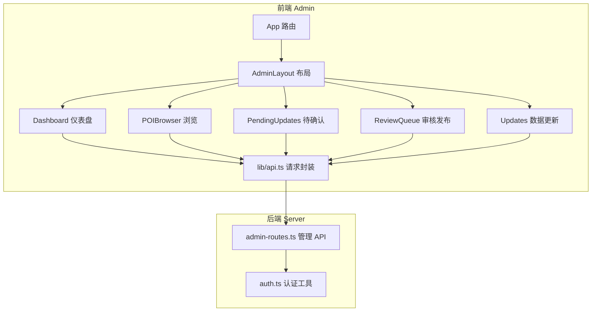
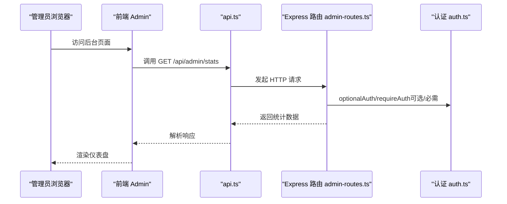
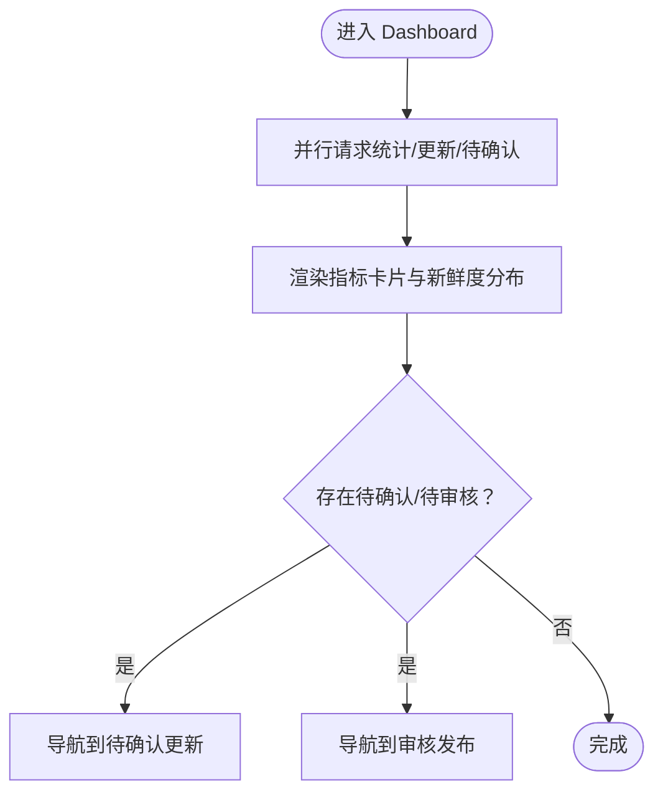
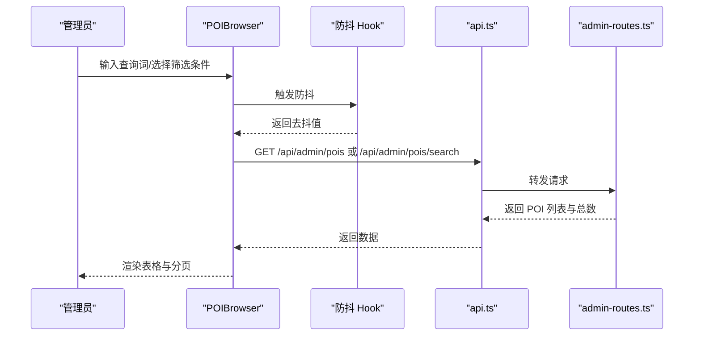
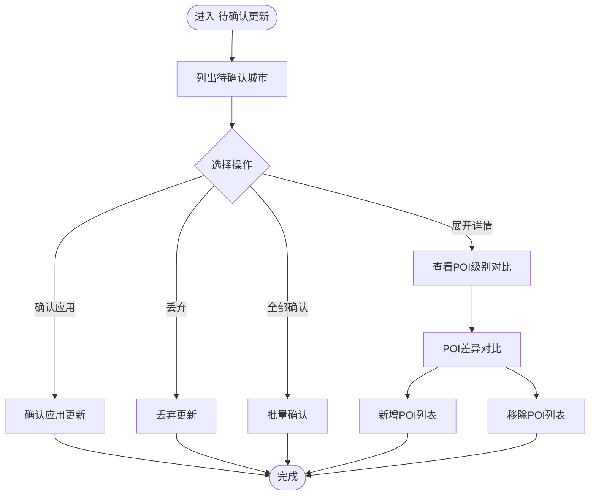
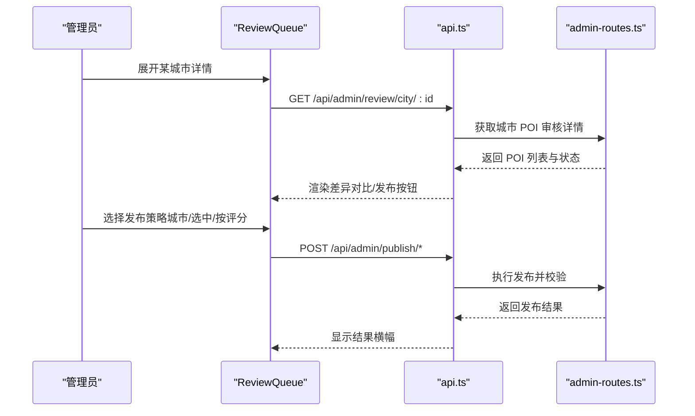
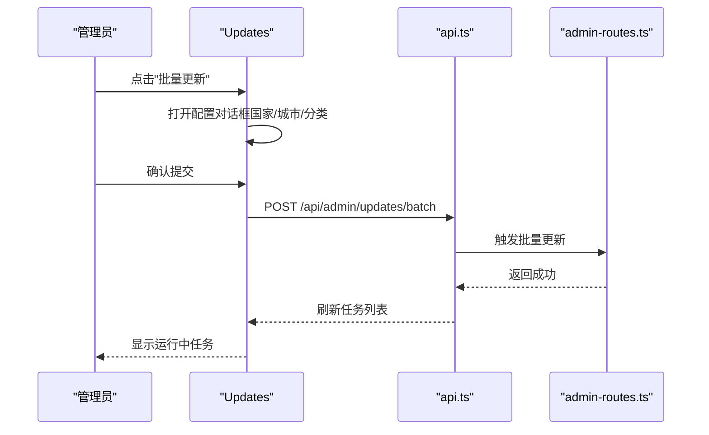
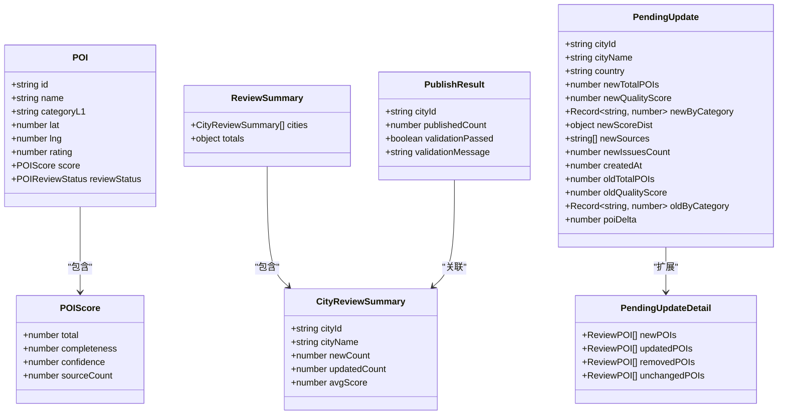
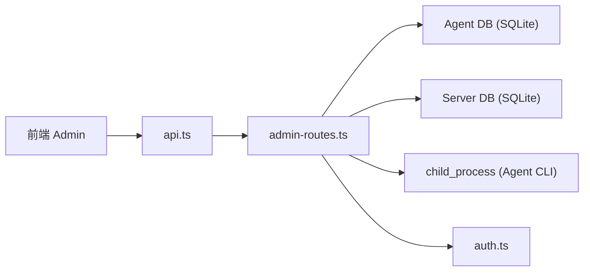

# 后台管理系统

<cite>
**本文档引用的文件**
- [admin/App.tsx](file://admin/App.tsx)
- [admin/main.tsx](file://admin/main.tsx)
- [admin/components/layout/AdminLayout.tsx](file://admin/components/layout/AdminLayout.tsx)
- [admin/components/layout/Sidebar.tsx](file://admin/components/layout/Sidebar.tsx)
- [admin/components/layout/Header.tsx](file://admin/components/layout/Header.tsx)
- [admin/pages/Dashboard.tsx](file://admin/pages/Dashboard.tsx)
- [admin/pages/POIBrowser.tsx](file://admin/pages/POIBrowser.tsx)
- [admin/pages/PendingUpdates.tsx](file://admin/pages/PendingUpdates.tsx)
- [admin/pages/ReviewQueue.tsx](file://admin/pages/ReviewQueue.tsx)
- [admin/pages/Updates.tsx](file://admin/pages/Updates.tsx)
- [admin/types/index.ts](file://admin/types/index.ts)
- [admin/lib/api.ts](file://admin/lib/api.ts)
- [admin/lib/formatters.ts](file://admin/lib/formatters.ts)
- [admin/lib/utils.ts](file://admin/lib/utils.ts)
- [admin/hooks/useDebounce.ts](file://admin/hooks/useDebounce.ts)
- [server/admin-routes.ts](file://server/admin-routes.ts)
- [server/auth.ts](file://server/auth.ts)
</cite>

## 目录
1. [简介](#简介)
2. [项目结构](#项目结构)
3. [核心组件](#核心组件)
4. [架构总览](#架构总览)
5. [详细组件分析](#详细组件分析)
6. [依赖关系分析](#依赖关系分析)
7. [性能考量](#性能考量)
8. [故障排查指南](#故障排查指南)
9. [结论](#结论)
10. [附录](#附录)

## 简介
本后台管理系统面向 POI 数据运营与管理，提供仪表盘概览、POI 浏览与检索、待确认更新、审核发布、数据更新与监控等能力。系统采用前后端分离架构：前端基于 React + TailwindCSS，后端基于 Node.js + Express，数据源来自 Agent DB（采集与评分后的数据）与 Server DB（对外货架数据）。管理员可通过统一界面完成数据审核、批量发布、城市与分类管理、更新任务调度与监控。

**更新** 新增待确认更新管理功能，提供完整的城市维度对比、批量确认/拒绝、POI 差异对比等管理能力。

## 项目结构
- 前端（admin）
  - 路由与布局：App、AdminLayout、Sidebar、Header
  - 页面：Dashboard、POIBrowser、PendingUpdates、ReviewQueue、Updates
  - 类型定义：admin/types/index.ts
  - 工具与格式化：lib/api.ts、lib/formatters.ts、lib/utils.ts、hooks/useDebounce.ts
- 后端（server）
  - 管理 API：server/admin-routes.ts（统计、POI、城市、分类、更新、审核发布等）
  - 认证工具：server/auth.ts（密码哈希、JWT、鉴权中间件）

**图表来源**
- [admin/App.tsx:1-27](file://admin/App.tsx#L1-L27)
- [admin/components/layout/AdminLayout.tsx:1-23](file://admin/components/layout/AdminLayout.tsx#L1-L23)
- [admin/lib/api.ts:1-33](file://admin/lib/api.ts#L1-L33)
- [server/admin-routes.ts:1-800](file://server/admin-routes.ts#L1-L800)
- [server/auth.ts:1-133](file://server/auth.ts#L1-L133)

**章节来源**
- [admin/App.tsx:1-27](file://admin/App.tsx#L1-L27)
- [admin/main.tsx:1-14](file://admin/main.tsx#L1-L14)
- [admin/components/layout/AdminLayout.tsx:1-23](file://admin/components/layout/AdminLayout.tsx#L1-L23)

## 核心组件
- 路由与入口
  - 应用入口：admin/main.tsx 使用 HashRouter 包裹，渲染 App
  - 路由配置：admin/App.tsx 定义后台页面路由与 AdminLayout 布局
- 布局组件
  - AdminLayout：整合 Sidebar 与 Header，提供主内容区域 Outlet
  - Sidebar：导航菜单，支持折叠切换，包含待确认更新菜单项
  - Header：面包屑标题，移动端显示菜单按钮
- 页面组件
  - Dashboard：聚合统计、新鲜度分布、最近更新任务、待审核提示
  - POIBrowser：POI 列表、筛选（城市/分类/评分）、分页、查看详情
  - PendingUpdates：**新增** 待确认更新列表、城市维度对比、批量确认/拒绝、POI 级别差异对比
  - ReviewQueue：城市级审核队列、POI 级差异对比、按城市/按评分发布
  - Updates：更新任务历史、运行中任务自动刷新、批量更新发起
- 类型系统
  - 统一定义 POI、城市、评分等级、审核状态、更新任务等类型
  - **新增** PendingUpdate、PendingUpdateDetail 类型定义
- 工具与格式化
  - api.ts：统一请求封装，自动拼接 /api/admin 前缀与错误处理
  - formatters.ts：日期、相对时间、坐标、分类路径、时长格式化
  - utils.ts：Tailwind 合并类名
  - useDebounce.ts：防抖 Hook，用于搜索输入优化

**章节来源**
- [admin/App.tsx:1-27](file://admin/App.tsx#L1-L27)
- [admin/main.tsx:1-14](file://admin/main.tsx#L1-L14)
- [admin/components/layout/AdminLayout.tsx:1-23](file://admin/components/layout/AdminLayout.tsx#L1-L23)
- [admin/components/layout/Sidebar.tsx:1-80](file://admin/components/layout/Sidebar.tsx#L1-L80)
- [admin/components/layout/Header.tsx:1-44](file://admin/components/layout/Header.tsx#L1-L44)
- [admin/pages/Dashboard.tsx:1-182](file://admin/pages/Dashboard.tsx#L1-L182)
- [admin/pages/POIBrowser.tsx:1-326](file://admin/pages/POIBrowser.tsx#L1-L326)
- [admin/pages/PendingUpdates.tsx:1-414](file://admin/pages/PendingUpdates.tsx#L1-L414)
- [admin/pages/ReviewQueue.tsx:1-619](file://admin/pages/ReviewQueue.tsx#L1-L619)
- [admin/pages/Updates.tsx:1-240](file://admin/pages/Updates.tsx#L1-L240)
- [admin/types/index.ts:1-277](file://admin/types/index.ts#L1-L277)
- [admin/lib/api.ts:1-33](file://admin/lib/api.ts#L1-L33)
- [admin/lib/formatters.ts:1-49](file://admin/lib/formatters.ts#L1-L49)
- [admin/lib/utils.ts:1-7](file://admin/lib/utils.ts#L1-L7)
- [admin/hooks/useDebounce.ts:1-11](file://admin/hooks/useDebounce.ts#L1-L11)

## 架构总览
- 前端通过 api.ts 统一调用 /api/admin 下的管理接口
- 后端 admin-routes.ts 提供统计、POI、城市、分类、更新、审核发布等接口
- 认证工具 auth.ts 提供可选/必需鉴权中间件与 JWT 工具
- 数据源
  - Agent DB：采集与评分后的 POI 数据与城市统计
  - Server DB：对外货架数据（发布后写入）

**图表来源**
- [admin/lib/api.ts:1-33](file://admin/lib/api.ts#L1-L33)
- [server/admin-routes.ts:1-800](file://server/admin-routes.ts#L1-L800)
- [server/auth.ts:1-133](file://server/auth.ts#L1-L133)

## 详细组件分析

### 仪表盘（Dashboard）
- 设计理念
  - 以卡片与可视化为主，快速呈现关键指标与运营状态
  - 关键指标：POI 总数、城市数、覆盖类目、最近更新时间、数据新鲜度分布
  - 运营提示：待确认更新、待审核发布，引导至对应页面
- 数据来源与处理
  - 并行请求统计、最近更新任务、待确认更新数量
  - 新鲜度分布按区间统计并计算占比
- 用户交互
  - 导航到"待确认更新"、"审核发布"页面
  - 展示最近更新任务列表，含状态与进度

**图表来源**
- [admin/pages/Dashboard.tsx:19-30](file://admin/pages/Dashboard.tsx#L19-L30)
- [admin/pages/Dashboard.tsx:42-57](file://admin/pages/Dashboard.tsx#L42-L57)
- [admin/pages/Dashboard.tsx:78-116](file://admin/pages/Dashboard.tsx#L78-L116)

**章节来源**
- [admin/pages/Dashboard.tsx:1-182](file://admin/pages/Dashboard.tsx#L1-L182)

### POI 浏览（POIBrowser）
- 功能要点
  - 支持按城市、分类层级（L1/L2/L3）、关键词、评分等级筛选
  - 分页与 URL 参数同步，提升可访问性
  - 展示 POI 名称、审核状态、评分等级、分类路径、评分、坐标、更新时间
  - 点击进入 POI 详情页
- 性能与体验
  - 使用防抖优化搜索输入
  - 分类联动（L1→L2→L3）动态选项
  - 加载骨架屏提升感知速度

**图表来源**
- [admin/pages/POIBrowser.tsx:25-82](file://admin/pages/POIBrowser.tsx#L25-L82)
- [admin/hooks/useDebounce.ts:1-11](file://admin/hooks/useDebounce.ts#L1-L11)
- [admin/lib/api.ts:10-20](file://admin/lib/api.ts#L10-L20)
- [server/admin-routes.ts:707-798](file://server/admin-routes.ts#L707-L798)

**章节来源**
- [admin/pages/POIBrowser.tsx:1-326](file://admin/pages/POIBrowser.tsx#L1-L326)

### 待确认更新（PendingUpdates）**新增功能**
- 功能要点
  - 展示各城市待确认更新数量、新增/删除/不变 POI 概览
  - 城市维度对比：旧/新 POI 数量、质量评分、来源与问题数
  - 分类维度对比：各类目数量变化
  - 批量确认/拒绝、一键全部确认
  - POI 级别差异对比：新增、更新、移除、不变 POI 的详细列表
- 用户交互
  - 展开详情查看前 N 个新增/移除 POI
  - 确认对话框二次确认，强调不可逆性
  - 支持单个城市确认、拒绝或批量操作
- 技术实现
  - 前端通过 /pending、/pending/:cityId、/pending/confirm、/pending/reject、/pending/confirm-batch 接口与后端交互
  - 实时计算 POI 净增量，使用颜色标识正负变化
  - 支持刷新和批量操作

**图表来源**
- [admin/pages/PendingUpdates.tsx:47-122](file://admin/pages/PendingUpdates.tsx#L47-L122)
- [admin/pages/PendingUpdates.tsx:220-362](file://admin/pages/PendingUpdates.tsx#L220-L362)

**章节来源**
- [admin/pages/PendingUpdates.tsx:1-414](file://admin/pages/PendingUpdates.tsx#L1-L414)

### 审核发布（ReviewQueue）
- 功能要点
  - 城市级审核概览：待审核城市数、新增/更新 POI 数
  - 城市展开详情：POI 列表、状态（新入库/有更新/已发布）、评分等级
  - 差异对比：新入库与更新 POI 的字段对比弹窗
  - 发布策略：按城市、按选中 POI、按评分等级（A/B 等）
- 用户交互
  - 搜索与过滤（全部/有变更/仅新增）
  - 多选城市批量发布
  - 发布前二次确认与结果提示

**图表来源**
- [admin/pages/ReviewQueue.tsx:32-120](file://admin/pages/ReviewQueue.tsx#L32-L120)
- [admin/pages/ReviewQueue.tsx:260-290](file://admin/pages/ReviewQueue.tsx#L260-L290)
- [admin/pages/ReviewQueue.tsx:293-333](file://admin/pages/ReviewQueue.tsx#L293-L333)
- [admin/pages/ReviewQueue.tsx:553-618](file://admin/pages/ReviewQueue.tsx#L553-L618)
- [server/admin-routes.ts:20-25](file://server/admin-routes.ts#L20-L25)

**章节来源**
- [admin/pages/ReviewQueue.tsx:1-619](file://admin/pages/ReviewQueue.tsx#L1-L619)

### 数据更新（Updates）
- 功能要点
  - 展示更新任务历史与运行中任务
  - 自动刷新运行中任务进度
  - 批量更新对话框：选择国家/城市/分类，触发批量采集
- 用户交互
  - "批量更新"按钮打开配置对话框
  - 成功提交后刷新任务列表

**图表来源**
- [admin/pages/Updates.tsx:17-62](file://admin/pages/Updates.tsx#L17-L62)
- [admin/pages/Updates.tsx:166-239](file://admin/pages/Updates.tsx#L166-L239)
- [server/admin-routes.ts:16](file://server/admin-routes.ts#L16)

**章节来源**
- [admin/pages/Updates.tsx:1-240](file://admin/pages/Updates.tsx#L1-L240)

### 类型系统与数据模型
- 关键类型
  - POI、POIScore、L1Category、City、FieldSource、POIDetail
  - UpdateJob、JobStatus、JobType
  - 审核状态：POIReviewStatus、发布结果 PublishResult
  - 评分等级：ScoreGrade、SCORE_GRADE_CONFIG、getScoreGrade
  - 审核概览：ReviewSummary、CityReviewSummary、CityReviewDetail
  - **新增** 待确认更新：PendingUpdate、PendingUpdateDetail
- 设计原则
  - 前后端类型对齐，避免字段不一致导致的渲染与逻辑错误
  - 评分等级与颜色映射集中管理，便于统一视觉风格

**图表来源**
- [admin/types/index.ts:3-35](file://admin/types/index.ts#L3-L35)
- [admin/types/index.ts:141-155](file://admin/types/index.ts#L141-L155)
- [admin/types/index.ts:211-235](file://admin/types/index.ts#L211-L235)
- [admin/types/index.ts:244-250](file://admin/types/index.ts#L244-L250)
- [admin/types/index.ts:256-278](file://admin/types/index.ts#L256-L278)

**章节来源**
- [admin/types/index.ts:1-277](file://admin/types/index.ts#L1-L277)

## 依赖关系分析
- 前端依赖
  - React 路由：react-router-dom
  - UI 组件：自研基础组件（button、card、table、badge、input、select、progress 等）
  - 图标：lucide-react
  - 样式：TailwindCSS + 自定义样式
  - 工具：clsx、tailwind-merge
- 后端依赖
  - Express：Web 框架
  - better-sqlite3：读写 SQLite（Agent DB 与 Server DB）
  - child_process：调用外部 Agent CLI（批量更新）
- 前后端通信
  - 前端通过 api.ts 统一请求 /api/admin/*，后端 admin-routes.ts 提供 REST 接口
  - 认证：optionalAuth/requireAuth 中间件，JWT 令牌验证

**图表来源**
- [admin/lib/api.ts:1-33](file://admin/lib/api.ts#L1-L33)
- [server/admin-routes.ts:27-62](file://server/admin-routes.ts#L27-L62)
- [server/auth.ts:87-113](file://server/auth.ts#L87-L113)

**章节来源**
- [server/admin-routes.ts:1-800](file://server/admin-routes.ts#L1-L800)
- [server/auth.ts:1-133](file://server/auth.ts#L1-L133)

## 性能考量
- 前端
  - 防抖搜索：减少频繁请求
  - 骨架屏：提升大列表加载体验
  - 分页与 URL 同步：避免重复请求与状态丢失
  - **新增** 待确认更新页面使用懒加载和展开详情机制，避免一次性加载大量数据
- 后端
  - WAL 模式：提升并发读取稳定性
  - 评分等级范围预设：简化筛选逻辑
  - 运行中任务自动刷新：3 秒轮询，平衡实时性与负载
  - **新增** 待确认更新批量操作：支持单个城市和批量确认，减少数据库往返次数
- 数据访问
  - 城市维度分页与评分过滤：限制单页大小（最大 50）
  - 搜索评分：基于关键词匹配打分，过滤阈值 ≥20，避免无效排序

**章节来源**
- [admin/hooks/useDebounce.ts:1-11](file://admin/hooks/useDebounce.ts#L1-L11)
- [admin/pages/POIBrowser.tsx:108-109](file://admin/pages/POIBrowser.tsx#L108-L109)
- [admin/pages/Updates.tsx:37-43](file://admin/pages/Updates.tsx#L37-L43)
- [server/admin-routes.ts:38-62](file://server/admin-routes.ts#L38-L62)
- [server/admin-routes.ts:707-750](file://server/admin-routes.ts#L707-L750)
- [server/admin-routes.ts:754-798](file://server/admin-routes.ts#L754-L798)

## 故障排查指南
- 常见错误与定位
  - Agent DB 未初始化：后端抛出"Agent DB not found"，需先执行初始化脚本
  - 请求失败：检查 /api/admin 前缀是否正确，网络连通性
  - 审核发布失败：查看发布结果横幅中的错误信息，确认数据对比与评分等级
  - **新增** 待确认更新操作失败：检查城市 ID 是否有效，确认/拒绝接口的错误信息
- 日志与诊断
  - 后端清理城市数据时记录错误日志，便于定位清理失败原因
  - 发布后校验：后端比较 Agent 与 Server 数据差异，异常时返回详细消息
  - **新增** 待确认更新：后端记录确认/拒绝操作的日志，便于审计追踪
- 安全建议
  - 使用 requireAuth 强制登录，避免匿名访问敏感操作
  - JWT 密钥通过环境变量配置，定期轮换
  - **新增** 待确认更新操作具有不可逆性，建议在生产环境增加额外的确认步骤

**章节来源**
- [server/admin-routes.ts:46-48](file://server/admin-routes.ts#L46-L48)
- [server/admin-routes.ts:636-648](file://server/admin-routes.ts#L636-L648)
- [server/auth.ts:102-113](file://server/auth.ts#L102-L113)

## 结论
本后台管理系统围绕"数据审核、发布与监控"构建，通过清晰的页面分工与统一的类型系统，实现了从概览到细节的完整运营闭环。**新增的待确认更新功能**进一步完善了数据管理流程，提供了城市维度的对比分析和批量操作能力。前端注重交互体验与可访问性，后端聚焦数据一致性与安全性。建议持续完善权限体系与审计日志，进一步提升系统的可运维性与合规性。

## 附录
- 使用指南与操作示例
  - 仪表盘：关注待确认更新与待审核发布提示，点击进入相应页面
  - POI 浏览：使用分类与评分筛选快速定位目标数据，点击"查看"进入详情
  - **待确认更新**：**新增** 查看各城市的数据变化，确认应用或丢弃更新；支持展开查看详情和批量操作
  - 审核发布：按城市或评分等级批量发布，发布前务必核对差异
  - 数据更新：通过"批量更新"对话框选择范围，配合 Agent CLI 执行采集
- 最佳实践
  - 审核优先：发布前必须进行字段差异核对与评分等级评估
  - 批量谨慎：批量发布前先小范围验证，再扩大范围
  - 监控更新：关注运行中任务与最近更新任务，及时发现异常
  - **新增** 待确认更新：建议建立数据变更审查流程，重要城市的数据变更需要多人复核
- 安全考虑
  - 登录态管理：使用 requireAuth 保护关键接口
  - 密码与令牌：生产环境设置强密钥，定期轮换
  - 数据备份：发布前保留 Server DB 快照，以便回滚
  - **新增** 待确认更新：由于确认操作不可逆，建议在生产环境实施更严格的操作审批流程